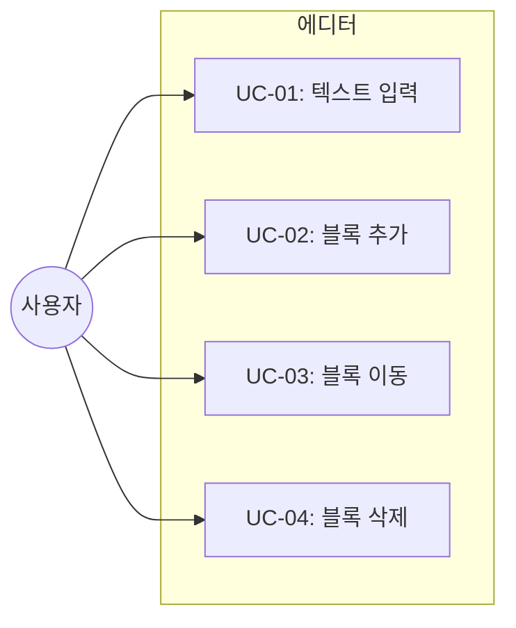
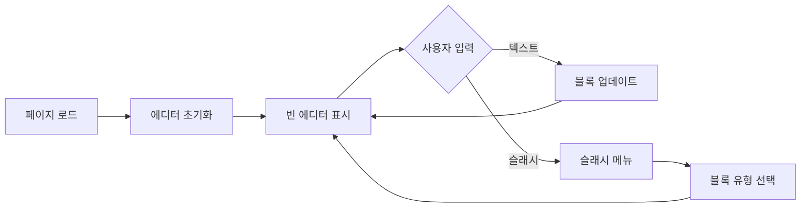
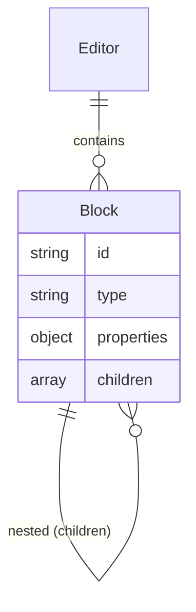

# TSK-01-01 - BlockNote 에디터 기본 통합 설계 문서

## 문서 정보

| 항목 | 내용 |
|------|------|
| Task ID | TSK-01-01 |
| 문서 버전 | 1.0 |
| 작성일 | 2026-01-02 |
| 상태 | 작성중 |
| 카테고리 | development |

---

## 1. 개요

### 1.1 배경 및 문제 정의

**현재 상황:**
- Orchay Notes 프로젝트가 WP-00에서 기본 인프라 설정 완료
- 블록 기반 에디터가 없어 문서 편집 기능이 없음
- 사용자가 Notion과 유사한 편집 경험을 기대

**해결하려는 문제:**
- 블록 기반의 WYSIWYG 에디터 부재
- Notion 스타일의 직관적인 문서 편집 환경 필요
- 슬래시 명령어, 드래그 앤 드롭 등 모던 에디터 기능 필요

### 1.2 목적 및 기대 효과

**목적:**
- BlockNote 라이브러리를 통합하여 블록 기반 에디터 구현
- Notion과 유사한 사용자 경험 제공
- 추후 콘텐츠 저장/로드 기능의 기반 마련

**기대 효과:**
- 사용자가 익숙한 Notion 스타일 편집 경험 제공
- 블록 단위 콘텐츠 조작 가능 (추가, 삭제, 이동)
- 다양한 블록 유형 사용 가능 (텍스트, 제목, 리스트 등)

### 1.3 범위

**포함:**
- src/components/editor/Editor.tsx 컴포넌트 생성
- useCreateBlockNote 훅으로 에디터 인스턴스 생성
- BlockNoteView 컴포넌트를 통한 에디터 렌더링
- 기본 테마 (light) 적용
- 기본 블록 유형 동작 확인

**제외:**
- 콘텐츠 저장/로드 (TSK-01-02에서 구현)
- Notion 스타일 CSS 커스터마이징 (TSK-01-03에서 구현)
- 페이지 헤더 (아이콘, 커버, 제목) (TSK-01-04에서 구현)
- 에디터 영역 패딩/레이아웃 세부 조정

### 1.4 참조 문서

| 문서 | 경로 | 관련 섹션 |
|------|------|----------|
| PRD | `.orchay/projects/notion-like/prd.md` | 2.1 블록 기반 에디터 |
| TRD | `.orchay/projects/notion-like/trd.md` | 1.2 BlockNote 선택 이유, 3.3 에디터 영역 |

---

## 2. 사용자 분석

### 2.1 대상 사용자

| 사용자 유형 | 특성 | 주요 니즈 |
|------------|------|----------|
| 일반 사용자 | Notion 사용 경험 있음 | 익숙한 블록 편집 UI |
| 개발자 | 마크다운 친숙 | 슬래시 명령어로 빠른 입력 |

### 2.2 사용자 페르소나

**페르소나 1: 김철수**
- 역할: 프로젝트 매니저
- 목표: 프로젝트 문서를 체계적으로 작성하고 관리
- 불만: 기존 텍스트 에디터는 구조화된 문서 작성이 어려움
- 시나리오: 프로젝트 기획서를 작성하며 제목, 리스트, 체크박스를 자유롭게 사용

---

## 3. 유즈케이스

### 3.1 유즈케이스 다이어그램



### 3.2 유즈케이스 상세

#### UC-01: 텍스트 입력

| 항목 | 내용 |
|------|------|
| 액터 | 사용자 |
| 목적 | 에디터에 텍스트 입력 |
| 사전 조건 | 페이지가 로드되어 에디터가 표시됨 |
| 사후 조건 | 입력한 텍스트가 블록에 표시됨 |
| 트리거 | 에디터 영역 클릭 후 타이핑 |

**기본 흐름:**
1. 사용자가 에디터 영역을 클릭한다
2. 커서가 깜빡이며 입력 대기 상태가 된다
3. 사용자가 텍스트를 입력한다
4. 입력한 텍스트가 실시간으로 블록에 표시된다

#### UC-02: 블록 추가 (슬래시 명령어)

| 항목 | 내용 |
|------|------|
| 액터 | 사용자 |
| 목적 | 새로운 블록 유형 추가 |
| 사전 조건 | 에디터에 포커스가 있음 |
| 사후 조건 | 선택한 유형의 새 블록이 추가됨 |
| 트리거 | `/` 입력 |

**기본 흐름:**
1. 사용자가 빈 줄에서 `/`를 입력한다
2. 슬래시 메뉴가 표시된다
3. 사용자가 원하는 블록 유형을 선택한다 (예: `/h1`)
4. 해당 유형의 블록이 생성된다
5. 커서가 새 블록으로 이동한다

**대안 흐름:**
- 2a. 사용자가 타이핑하여 필터링:
  - 입력에 맞는 블록 유형만 필터링되어 표시
  - Enter로 선택

#### UC-03: 블록 이동 (드래그 앤 드롭)

| 항목 | 내용 |
|------|------|
| 액터 | 사용자 |
| 목적 | 블록 순서 변경 |
| 사전 조건 | 2개 이상의 블록이 존재 |
| 사후 조건 | 블록 순서가 변경됨 |
| 트리거 | 블록 핸들 드래그 |

**기본 흐름:**
1. 사용자가 블록에 마우스를 올린다
2. 블록 좌측에 드래그 핸들이 표시된다
3. 사용자가 핸들을 드래그한다
4. 드롭 위치가 시각적으로 표시된다
5. 사용자가 원하는 위치에 드롭한다
6. 블록이 새 위치로 이동한다

#### UC-04: 블록 삭제

| 항목 | 내용 |
|------|------|
| 액터 | 사용자 |
| 목적 | 불필요한 블록 제거 |
| 사전 조건 | 삭제할 블록이 존재 |
| 사후 조건 | 블록이 삭제됨 |
| 트리거 | 빈 블록에서 Backspace |

**기본 흐름:**
1. 사용자가 블록 내용을 모두 지운다
2. 빈 블록 상태에서 Backspace를 누른다
3. 블록이 삭제된다
4. 커서가 이전 블록으로 이동한다

---

## 4. 사용자 시나리오

### 4.1 시나리오 1: 첫 문서 작성

**상황 설명:**
사용자가 새 페이지를 열고 첫 문서를 작성하려 한다.

**단계별 진행:**

| 단계 | 사용자 행동 | 시스템 반응 | 사용자 기대 |
|------|-----------|------------|------------|
| 1 | 페이지 진입 | 빈 에디터 표시, placeholder 보임 | 에디터가 준비되어 있음 |
| 2 | 에디터 클릭 | 커서 활성화 | 바로 입력 가능 |
| 3 | `/h1` 입력 | 슬래시 메뉴 → H1 선택 | 제목 블록 생성 |
| 4 | 제목 텍스트 입력 | 큰 글씨로 표시 | 제목처럼 보임 |
| 5 | Enter 후 본문 입력 | 새 paragraph 블록 | 본문 작성 가능 |

**성공 조건:**
- 제목과 본문이 구분되어 표시됨
- 블록 구조가 명확히 보임

### 4.2 시나리오 2: 블록 재구성

**상황 설명:**
작성 중인 문서에서 블록 순서를 변경하려 한다.

**단계별 진행:**

| 단계 | 사용자 행동 | 시스템 반응 | 사용자 기대 |
|------|-----------|------------|------------|
| 1 | 이동할 블록에 마우스 호버 | 블록 핸들 표시 | 드래그 가능함을 인지 |
| 2 | 핸들 드래그 | 블록이 따라옴, 드롭 위치 표시 | 이동 위치 확인 가능 |
| 3 | 원하는 위치에 드롭 | 블록 위치 변경 | 순서 변경 완료 |

**성공 조건:**
- 블록이 원하는 위치로 이동됨
- 다른 블록들은 자연스럽게 재배치됨

---

## 5. 화면 설계

### 5.1 화면 흐름도



### 5.2 화면별 상세

#### 화면 1: 에디터 (Editor.tsx)

**화면 목적:**
BlockNote 에디터를 렌더링하여 사용자가 블록 기반 문서를 편집할 수 있게 함

**진입 경로:**
- 페이지 라우트 `/[pageId]`에서 자동 로드

**와이어프레임:**
```
┌─────────────────────────────────────────────────────────────┐
│                         에디터 영역                          │
│  ┌───────────────────────────────────────────────────────┐  │
│  │                                                       │  │
│  │  ⋮⋮ [Block 1: paragraph]                             │  │
│  │     "Type '/' for commands..."  (placeholder)        │  │
│  │                                                       │  │
│  │  ⋮⋮ [Block 2: heading_1]                             │  │
│  │     "제목 텍스트"                                     │  │
│  │                                                       │  │
│  │  ⋮⋮ [Block 3: bulleted_list]                         │  │
│  │     • 리스트 아이템 1                                 │  │
│  │     • 리스트 아이템 2                                 │  │
│  │                                                       │  │
│  └───────────────────────────────────────────────────────┘  │
│                                                             │
└─────────────────────────────────────────────────────────────┘

[블록 좌측 ⋮⋮ 아이콘: 호버 시 표시되는 드래그 핸들]
```

**화면 요소 설명:**

| 영역 | 설명 | 사용자 인터랙션 |
|------|------|----------------|
| 블록 영역 | 각 블록의 콘텐츠 | 클릭하여 편집, 드래그하여 이동 |
| 드래그 핸들 (⋮⋮) | 블록 좌측에 호버 시 표시 | 드래그하여 블록 이동 |
| Placeholder | 빈 블록에 표시 | 타이핑 시 사라짐 |

**사용자 행동 시나리오:**
1. 사용자가 에디터에 진입하면 빈 블록과 placeholder를 본다
2. 타이핑을 시작하면 블록에 텍스트가 입력된다
3. `/`를 입력하면 슬래시 메뉴가 나타난다

#### 화면 2: 슬래시 메뉴

**화면 목적:**
블록 유형 선택을 위한 드롭다운 메뉴

**와이어프레임:**
```
┌──────────────────────────────┐
│  🔤 Paragraph               │
│  H1 Heading 1               │
│  H2 Heading 2               │
│  H3 Heading 3               │
│  • Bullet List              │
│  1. Numbered List           │
│  ☐ To-do List               │
│  ▶ Toggle List              │
│  " Quote                    │
│  — Divider                  │
│  </> Code Block             │
└──────────────────────────────┘
```

### 5.3 반응형 동작

| 화면 크기 | 레이아웃 변화 | 사용자 경험 |
|----------|--------------|------------|
| 데스크톱 (1024px+) | 에디터 전체 너비 활용 | 넉넉한 편집 공간 |
| 태블릿 (768-1023px) | 에디터 너비 축소 | 터치 제스처 지원 |
| 모바일 (767px-) | 단일 컬럼 | 터치 최적화 UI |

---

## 6. 인터랙션 설계

### 6.1 사용자 액션과 피드백

| 사용자 액션 | 즉각 피드백 | 결과 피드백 | 에러 피드백 |
|------------|-----------|------------|------------|
| 텍스트 입력 | 문자 표시 | 블록 업데이트 | N/A |
| `/` 입력 | 슬래시 메뉴 표시 | 메뉴 선택 대기 | 메뉴 없으면 숨김 |
| 블록 드래그 | 블록 이동 시각화 | 위치 변경 | 불가 영역 표시 |
| Backspace (빈 블록) | 블록 삭제 | 이전 블록 포커스 | N/A |

### 6.2 상태별 화면 변화

| 상태 | 화면 표시 | 사용자 안내 |
|------|----------|------------|
| 초기 로딩 | 에디터 스켈레톤 | N/A (빠른 로드) |
| 편집 대기 | Placeholder 표시 | "Type '/' for commands" |
| 편집 중 | 커서 깜빡임 | 실시간 텍스트 표시 |
| 드래그 중 | 블록 이동 시각화 | 드롭 가능 위치 표시 |

### 6.3 키보드/접근성

| 기능 | 키보드 단축키 | 스크린 리더 안내 |
|------|-------------|-----------------|
| 새 블록 | Enter | "새 블록 생성됨" |
| 블록 삭제 | Backspace (빈 블록) | "블록 삭제됨" |
| 블록 유형 선택 | `/` + 타이핑 + Enter | "슬래시 메뉴" |
| 텍스트 서식 | Ctrl+B, Ctrl+I | "볼드", "이탤릭" |

---

## 7. 데이터 요구사항

### 7.1 필요한 데이터

| 데이터 | 설명 | 출처 | 용도 |
|--------|------|------|------|
| initialContent | 에디터 초기 콘텐츠 (JSON) | props (추후 DB) | 에디터 초기화 |
| editor.document | 현재 에디터 상태 | BlockNote 인스턴스 | 콘텐츠 읽기 |

### 7.2 데이터 관계



**관계 설명:**
- Editor는 여러 Block을 포함한다
- Block은 중첩된 하위 Block을 가질 수 있다 (toggle, list 등)

### 7.3 BlockNote 문서 구조

```typescript
// BlockNote 문서 JSON 구조
interface Block {
  id: string;
  type: "paragraph" | "heading" | "bulletListItem" | "numberedListItem" | ...;
  props: {
    textColor?: string;
    backgroundColor?: string;
    level?: number; // heading의 경우
  };
  content: InlineContent[]; // 텍스트 및 인라인 요소
  children: Block[]; // 중첩 블록
}
```

---

## 8. 비즈니스 규칙

### 8.1 핵심 규칙

| 규칙 ID | 규칙 설명 | 적용 상황 | 예외 |
|---------|----------|----------|------|
| BR-01 | 빈 에디터는 기본 paragraph 블록으로 시작 | 에디터 초기화 시 | initialContent 있을 때 |
| BR-02 | 슬래시 메뉴는 빈 줄에서만 동작 | `/` 입력 시 | 텍스트 중간에서는 일반 문자 |
| BR-03 | 드래그 핸들은 블록 호버 시에만 표시 | 마우스 오버 | 모바일에서는 항상 표시 |

### 8.2 규칙 상세 설명

**BR-01: 기본 paragraph 블록**

설명: 사용자가 에디터를 처음 열면 빈 paragraph 블록이 하나 있어야 바로 타이핑을 시작할 수 있다.

예시:
- 새 페이지 생성 시: 빈 paragraph 블록 표시
- 기존 페이지 로드 시: 저장된 콘텐츠 표시

---

## 9. 에러 처리

### 9.1 예상 에러 상황

| 상황 | 원인 | 사용자 메시지 | 복구 방법 |
|------|------|--------------|----------|
| 에디터 로드 실패 | BlockNote 초기화 오류 | "에디터를 불러올 수 없습니다" | 페이지 새로고침 |
| 콘텐츠 파싱 오류 | 잘못된 JSON 형식 | N/A (빈 에디터로 폴백) | 기본 블록으로 시작 |

### 9.2 에러 표시 방식

| 에러 유형 | 표시 위치 | 표시 방법 |
|----------|----------|----------|
| 초기화 오류 | 에디터 영역 | 에러 메시지 + 새로고침 버튼 |

---

## 10. 기술 상세

### 10.1 컴포넌트 구조

```
src/components/editor/
└── Editor.tsx    # BlockNote 래퍼 컴포넌트
```

### 10.2 구현 상세

#### Editor.tsx

```typescript
"use client";

import { useCreateBlockNote } from "@blocknote/react";
import { BlockNoteView } from "@blocknote/mantine";
import "@blocknote/mantine/style.css";

interface EditorProps {
  initialContent?: string;
  onChange?: (content: string) => void;
}

export function Editor({ initialContent, onChange }: EditorProps) {
  const editor = useCreateBlockNote({
    initialContent: initialContent ? JSON.parse(initialContent) : undefined,
  });

  return (
    <BlockNoteView
      editor={editor}
      theme="light"
      onChange={() => {
        onChange?.(JSON.stringify(editor.document));
      }}
    />
  );
}
```

### 10.3 의존성

| 패키지 | 버전 | 용도 |
|--------|------|------|
| @blocknote/react | ^0.18.0 | useCreateBlockNote 훅 |
| @blocknote/mantine | ^0.18.0 | BlockNoteView 컴포넌트 |
| @blocknote/core | ^0.18.0 | 코어 기능 |

---

## 11. 연관 문서

| 문서 | 경로 | 용도 |
|------|------|------|
| 요구사항 추적 매트릭스 | `025-traceability-matrix.md` | PRD → 설계 → 테스트 양방향 추적 |
| 테스트 명세서 | `026-test-specification.md` | 단위/E2E/매뉴얼 테스트 상세 정의 |

---

## 12. 구현 범위

### 12.1 영향받는 영역

| 영역 | 변경 내용 | 영향도 |
|------|----------|--------|
| src/components/editor/Editor.tsx | 신규 생성 | 높음 |
| 페이지 컴포넌트 | Editor 컴포넌트 import | 중간 |

### 12.2 의존성

| 의존 항목 | 이유 | 상태 |
|----------|------|------|
| TSK-00-99 (WP-00 통합 검증) | 기본 인프라 완료 필요 | 진행중 |
| @blocknote/* 패키지 | 에디터 라이브러리 | 설치됨 (TSK-00-02) |

### 12.3 제약 사항

| 제약 | 설명 | 대응 방안 |
|------|------|----------|
| Client Component | BlockNote는 브라우저에서만 동작 | "use client" 지시어 사용 |
| 서버 렌더링 불가 | 동적 import 필요할 수 있음 | 필요시 next/dynamic 사용 |

---

## 13. 체크리스트

### 13.1 설계 완료 확인

- [x] 문제 정의 및 목적 명확화
- [x] 사용자 분석 완료
- [x] 유즈케이스 정의 완료
- [x] 사용자 시나리오 작성 완료
- [x] 화면 설계 완료 (와이어프레임)
- [x] 인터랙션 설계 완료
- [x] 데이터 요구사항 정의 완료
- [x] 비즈니스 규칙 정의 완료
- [x] 에러 처리 정의 완료

### 13.2 연관 문서 작성

- [ ] 요구사항 추적 매트릭스 작성 (→ `025-traceability-matrix.md`)
- [ ] 테스트 명세서 작성 (→ `026-test-specification.md`)

### 13.3 구현 준비

- [x] 구현 우선순위 결정
- [x] 의존성 확인 완료
- [x] 제약 사항 검토 완료

---

## 변경 이력

| 버전 | 일자 | 작성자 | 변경 내용 |
|------|------|--------|----------|
| 1.0 | 2026-01-02 | Claude | 최초 작성 |
