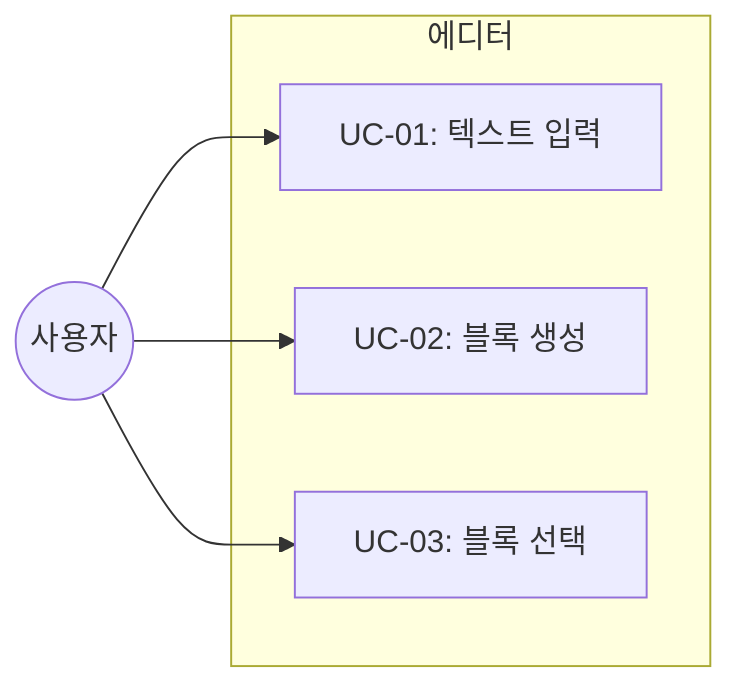

# TSK-01-01 - BlockNote 에디터 기본 통합 설계 문서

## 문서 정보

| 항목 | 내용 |
|------|------|
| Task ID | TSK-01-01 |
| 문서 버전 | 1.0 |
| 작성일 | 2026-01-02 |
| 상태 | 작성중 |
| 카테고리 | development |

---

## 1. 개요

### 1.1 배경 및 문제 정의

**현재 상황:**
- Orchay Notes 프로젝트에서 Notion 스타일의 블록 기반 문서 편집 기능이 필요
- WP-00에서 프로젝트 초기화 및 기본 인프라 구축 완료
- 에디터 컴포넌트가 아직 구현되지 않음

**해결하려는 문제:**
- 사용자가 블록 단위로 문서를 편집할 수 있는 WYSIWYG 에디터 필요
- Notion과 유사한 사용자 경험 제공 필요
- 슬래시 명령어, 드래그 앤 드롭 등 현대적인 에디터 기능 필요

### 1.2 목적 및 기대 효과

**목적:**
- BlockNote 라이브러리를 사용하여 React 기반 블록 에디터 컴포넌트 구현
- 기본적인 텍스트 입력 및 블록 조작 기능 제공

**기대 효과:**
- 사용자가 직관적으로 문서를 작성하고 편집 가능
- Notion 스타일의 친숙한 편집 경험 제공
- 향후 기능 확장을 위한 기반 마련

### 1.3 범위

**포함:**
- `src/components/editor/Editor.tsx` 컴포넌트 생성
- `useCreateBlockNote` 훅을 사용한 에디터 인스턴스 생성
- `BlockNoteView` 컴포넌트를 통한 에디터 렌더링
- 기본 테마 (light) 적용

**제외:**
- 에디터 콘텐츠 저장/로드 기능 (TSK-01-02)
- Notion 스타일 CSS 커스터마이징 (TSK-01-03)
- 페이지 헤더 컴포넌트 (TSK-01-04)

### 1.4 참조 문서

| 문서 | 경로 | 관련 섹션 |
|------|------|----------|
| PRD | `.orchay/projects/notion-like/prd.md` | 2.1 블록 기반 에디터 |
| TRD | `.orchay/projects/notion-like/trd.md` | 3.3 에디터 영역 |

---

## 2. 사용자 분석

### 2.1 대상 사용자

| 사용자 유형 | 특성 | 주요 니즈 |
|------------|------|----------|
| 문서 작성자 | Notion 사용 경험 있음, 일반 사용자 | 직관적인 블록 편집, 빠른 문서 작성 |
| 개발자 | 기술 문서 작성, 코드 블록 활용 | 마크다운 호환, 코드 구문 강조 |

### 2.2 사용자 페르소나

**페르소나 1: 김민준 (문서 작성자)**
- 역할: 프로젝트 매니저
- 목표: 팀 문서를 빠르게 작성하고 공유
- 불만: 기존 에디터는 서식 적용이 번거로움
- 시나리오: 회의록 작성, 프로젝트 계획서 편집

---

## 3. 유즈케이스

### 3.1 유즈케이스 다이어그램



### 3.2 유즈케이스 상세

#### UC-01: 텍스트 입력

| 항목 | 내용 |
|------|------|
| 액터 | 문서 작성자 |
| 목적 | 에디터에 텍스트 콘텐츠 입력 |
| 사전 조건 | 에디터 컴포넌트가 렌더링된 상태 |
| 사후 조건 | 입력된 텍스트가 에디터에 표시됨 |
| 트리거 | 에디터 영역 클릭 후 타이핑 |

**기본 흐름:**
1. 사용자가 에디터 영역을 클릭한다
2. 시스템이 커서를 해당 위치에 표시한다
3. 사용자가 텍스트를 입력한다
4. 시스템이 입력된 텍스트를 실시간으로 렌더링한다

#### UC-02: 블록 생성 (슬래시 명령어)

| 항목 | 내용 |
|------|------|
| 액터 | 문서 작성자 |
| 목적 | 새로운 유형의 블록 생성 |
| 사전 조건 | 에디터에 커서가 위치한 상태 |
| 사후 조건 | 선택한 유형의 블록이 생성됨 |
| 트리거 | `/` 키 입력 |

**기본 흐름:**
1. 사용자가 빈 줄에서 `/` 를 입력한다
2. 시스템이 슬래시 명령어 메뉴를 표시한다
3. 사용자가 원하는 블록 유형을 선택한다
4. 시스템이 해당 유형의 블록을 생성한다

**대안 흐름:**
- 3a. 사용자가 블록 유형명을 타이핑하면:
  - 시스템이 검색 결과를 필터링하여 표시한다

#### UC-03: 블록 선택 및 조작

| 항목 | 내용 |
|------|------|
| 액터 | 문서 작성자 |
| 목적 | 블록 선택 후 이동/삭제 |
| 사전 조건 | 에디터에 블록이 존재 |
| 사후 조건 | 블록이 선택되거나 조작됨 |
| 트리거 | 블록 핸들 클릭 또는 드래그 |

**기본 흐름:**
1. 사용자가 블록에 마우스를 올린다
2. 시스템이 블록 핸들(드래그 핸들, 메뉴)을 표시한다
3. 사용자가 드래그 핸들을 잡고 이동한다
4. 시스템이 블록 위치를 변경한다

---

## 4. 사용자 시나리오

### 4.1 시나리오 1: 첫 문서 작성

**상황 설명:**
사용자가 새 페이지를 열고 처음으로 문서를 작성하는 상황

**단계별 진행:**

| 단계 | 사용자 행동 | 시스템 반응 | 사용자 기대 |
|------|-----------|------------|------------|
| 1 | 에디터 영역 클릭 | 커서 표시 | 타이핑 준비 상태 |
| 2 | "안녕하세요" 입력 | 실시간 텍스트 표시 | 입력 내용 확인 |
| 3 | Enter 키 입력 | 새 블록 생성 | 다음 줄 준비 |
| 4 | `/h1` 입력 | 슬래시 메뉴 → H1 선택 | 제목 블록 생성 |

**성공 조건:**
- 텍스트 입력이 실시간으로 반영됨
- 슬래시 명령어가 정상 동작

### 4.2 시나리오 2: 블록 재배치

**상황 설명:**
이미 작성된 문서에서 블록 순서를 변경하려는 상황

**단계별 진행:**

| 단계 | 사용자 행동 | 시스템 반응 | 사용자 기대 |
|------|-----------|------------|------------|
| 1 | 블록에 마우스 호버 | 드래그 핸들 표시 | 조작 가능 상태 |
| 2 | 핸들 드래그 시작 | 블록 드래그 시각화 | 이동 위치 확인 |
| 3 | 원하는 위치에 드롭 | 블록 위치 변경 | 순서 변경 완료 |

---

## 5. 화면 설계

### 5.1 화면 흐름도


### 5.2 화면별 상세

#### 화면 1: 에디터 영역

**화면 목적:**
블록 기반 문서 편집을 위한 메인 에디터 영역

**진입 경로:**
- 페이지 URL 접근 시 자동 로드
- 사이드바에서 페이지 클릭 시

**와이어프레임:**
```
┌─────────────────────────────────────────────────────────┐
│                     에디터 영역                          │
│  ┌───────────────────────────────────────────────────┐  │
│  │                                                   │  │
│  │   ⋮⋮ │ 블록 1: 텍스트 입력 가능                   │  │
│  │   ⋮⋮ │ 블록 2: 텍스트 입력 가능                   │  │
│  │   ⋮⋮ │ 블록 3: 텍스트 입력 가능                   │  │
│  │                                                   │  │
│  │   [ 빈 블록: 타이핑 또는 '/' 입력 ]              │  │
│  │                                                   │  │
│  └───────────────────────────────────────────────────┘  │
│                                                          │
│  💡 블록 좌측의 ⋮⋮ 는 드래그 핸들                       │
└─────────────────────────────────────────────────────────┘
```

**화면 요소 설명:**

| 영역 | 설명 | 사용자 인터랙션 |
|------|------|----------------|
| 블록 핸들 (⋮⋮) | 드래그 앤 드롭용 핸들 | 드래그 시 블록 이동 |
| 블록 콘텐츠 | 텍스트 또는 블록별 콘텐츠 | 클릭 후 편집 |
| 슬래시 메뉴 | `/` 입력 시 표시되는 블록 선택 메뉴 | 클릭 또는 Enter로 선택 |

**사용자 행동 시나리오:**
1. 사용자가 빈 블록을 클릭하면 커서가 표시된다
2. 타이핑하면 실시간으로 텍스트가 입력된다
3. `/`를 입력하면 슬래시 명령어 메뉴가 나타난다

### 5.3 반응형 동작

| 화면 크기 | 레이아웃 변화 | 사용자 경험 |
|----------|--------------|------------|
| 데스크톱 (1024px+) | 좌우 패딩 96px | 넓은 편집 공간 |
| 모바일 (767px-) | 좌우 패딩 24px | 모바일 최적화 |

---

## 6. 인터랙션 설계

### 6.1 사용자 액션과 피드백

| 사용자 액션 | 즉각 피드백 | 결과 피드백 |
|------------|-----------|------------|
| 텍스트 입력 | 문자 표시 | 블록 내용 갱신 |
| 슬래시 입력 | 메뉴 표시 | 블록 유형 변경 |
| 블록 드래그 | 이동 시각화 | 위치 변경 |
| 블록 호버 | 핸들 표시 | - |

### 6.2 상태별 화면 변화

| 상태 | 화면 표시 | 사용자 안내 |
|------|----------|------------|
| 초기 로딩 | 로딩 상태 | (BlockNote 자체 처리) |
| 편집 가능 | 에디터 렌더링 | 커서 깜빡임 |
| 빈 상태 | Placeholder 표시 | "타이핑하거나 '/'를 입력하세요" |

### 6.3 키보드/접근성

| 기능 | 키보드 단축키 | 설명 |
|------|-------------|------|
| 새 블록 | Enter | 현재 블록 아래에 새 블록 생성 |
| 블록 삭제 | Backspace (빈 블록) | 빈 블록 삭제 후 이전 블록으로 |
| 슬래시 메뉴 | / | 블록 유형 선택 메뉴 |
| 볼드 | Ctrl/Cmd + B | 선택 텍스트 굵게 |
| 이탤릭 | Ctrl/Cmd + I | 선택 텍스트 기울임 |

---

## 7. 데이터 요구사항

### 7.1 필요한 데이터

| 데이터 | 설명 | 출처 | 용도 |
|--------|------|------|------|
| initialContent | 에디터 초기 콘텐츠 (JSON) | props | 페이지 로드 시 기존 콘텐츠 표시 |
| editor.document | 현재 에디터 콘텐츠 | BlockNote 인스턴스 | 저장 시 추출 |

### 7.2 BlockNote 문서 구조

```typescript
// BlockNote 블록 스키마 (기본 제공)
type Block = {
  id: string;
  type: "paragraph" | "heading" | "bulletListItem" | "numberedListItem" | "checkListItem" | "codeBlock" | "image" | ...;
  props: Record<string, any>;
  content: InlineContent[];
  children: Block[];
};
```

---

## 8. 비즈니스 규칙

### 8.1 핵심 규칙

| 규칙 ID | 규칙 설명 | 적용 상황 |
|---------|----------|----------|
| BR-01 | 에디터는 항상 편집 가능 상태로 렌더링 | 컴포넌트 마운트 시 |
| BR-02 | 기본 테마는 light로 설정 | 에디터 초기화 시 |
| BR-03 | BlockNote 기본 블록 유형 모두 지원 | 슬래시 메뉴 |

### 8.2 규칙 상세 설명

**BR-01: 편집 가능 상태**

설명: 에디터 컴포넌트가 렌더링되면 즉시 편집 가능한 상태여야 함. 별도의 "편집 모드 전환" 없이 바로 타이핑 가능.

**BR-02: 기본 테마**

설명: BlockNote는 light/dark 테마를 지원하며, 초기 구현에서는 light 테마만 적용. 다크모드는 TSK-03-02에서 구현.

---

## 9. 에러 처리

### 9.1 예상 에러 상황

| 상황 | 원인 | 사용자 메시지 | 복구 방법 |
|------|------|--------------|----------|
| 에디터 로드 실패 | 라이브러리 로드 오류 | (빈 화면) | 새로고침 |
| JSON 파싱 오류 | 잘못된 initialContent | 기본 빈 에디터 표시 | 자동 복구 |

### 9.2 에러 표시 방식

| 에러 유형 | 표시 위치 | 표시 방법 |
|----------|----------|----------|
| 로드 오류 | 콘솔 | console.error |
| 파싱 오류 | 콘솔 + 빈 에디터 | 빈 에디터로 폴백 |

---

## 10. 연관 문서

| 문서 | 경로 | 용도 |
|------|------|------|
| 요구사항 추적 매트릭스 | `025-traceability-matrix.md` | PRD → 설계 → 테스트 추적 |
| 테스트 명세서 | `026-test-specification.md` | 단위/E2E 테스트 정의 |

---

## 11. 구현 범위

### 11.1 영향받는 영역

| 영역 | 변경 내용 | 영향도 |
|------|----------|--------|
| `src/components/editor/` | 새 디렉토리 및 Editor.tsx 생성 | 높음 |
| 페이지 컴포넌트 | Editor 컴포넌트 임포트 및 사용 | 중간 |

### 11.2 의존성

| 의존 항목 | 이유 | 상태 |
|----------|------|------|
| TSK-00-99 (WP-00 통합 검증) | 프로젝트 기본 설정 필요 | 대기 |
| @blocknote/react | 에디터 라이브러리 | TSK-00-02에서 설치 |
| @blocknote/mantine | UI 테마 라이브러리 | TSK-00-02에서 설치 |

### 11.3 제약 사항

| 제약 | 설명 | 대응 방안 |
|------|------|----------|
| 클라이언트 컴포넌트 | BlockNote는 브라우저 전용 | `"use client"` 선언 |
| SSR 불가 | dynamic import 필요 가능 | next/dynamic 사용 고려 |

---

## 12. 기술 명세

### 12.1 컴포넌트 구조

```typescript
// src/components/editor/Editor.tsx
"use client";

import { useCreateBlockNote } from "@blocknote/react";
import { BlockNoteView } from "@blocknote/mantine";
import "@blocknote/mantine/style.css";

interface EditorProps {
  initialContent?: string;  // JSON 문자열
  onChange?: (content: string) => void;
}

export function Editor({ initialContent, onChange }: EditorProps) {
  const editor = useCreateBlockNote({
    initialContent: initialContent ? JSON.parse(initialContent) : undefined,
  });

  return (
    <BlockNoteView
      editor={editor}
      theme="light"
      onChange={() => {
        onChange?.(JSON.stringify(editor.document));
      }}
    />
  );
}
```

### 12.2 사용 예시

```tsx
// 페이지에서 사용
import { Editor } from "@/components/editor/Editor";

export default function PageEditor() {
  const handleChange = (content: string) => {
    console.log("Content changed:", content);
  };

  return (
    <div className="px-[96px] py-4 max-w-[900px] mx-auto">
      <Editor onChange={handleChange} />
    </div>
  );
}
```

---

## 13. 체크리스트

### 13.1 설계 완료 확인

- [x] 문제 정의 및 목적 명확화
- [x] 사용자 분석 완료
- [x] 유즈케이스 정의 완료
- [x] 사용자 시나리오 작성 완료
- [x] 화면 설계 완료 (와이어프레임)
- [x] 인터랙션 설계 완료
- [x] 데이터 요구사항 정의 완료
- [x] 비즈니스 규칙 정의 완료
- [x] 에러 처리 정의 완료
- [x] 기술 명세 작성 완료

### 13.2 구현 준비

- [x] 구현 우선순위 결정
- [x] 의존성 확인 완료
- [x] 제약 사항 검토 완료

---

## 변경 이력

| 버전 | 일자 | 작성자 | 변경 내용 |
|------|------|--------|----------|
| 1.0 | 2026-01-02 | Claude | 최초 작성 |
