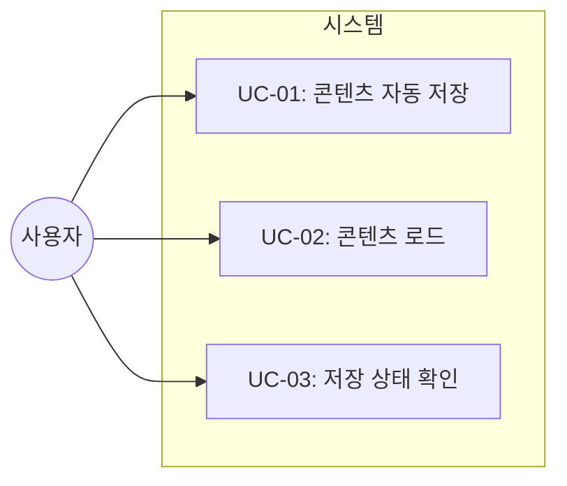
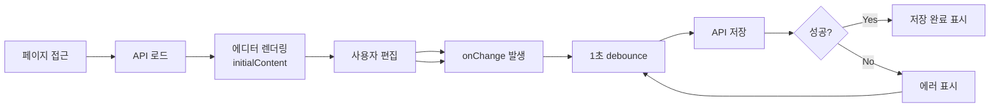

# TSK-01-02 - 에디터 콘텐츠 저장/로드 구현 설계 문서

## 문서 정보

| 항목 | 내용 |
|------|------|
| Task ID | TSK-01-02 |
| 문서 버전 | 1.0 |
| 작성일 | 2026-01-02 |
| 상태 | 작성중 |
| 카테고리 | development |

---

## 1. 개요

### 1.1 배경 및 문제 정의

**현재 상황:**
- TSK-01-01에서 BlockNote 에디터 기본 통합 완료
- 에디터에서 텍스트 입력 및 블록 조작이 가능한 상태
- 하지만 에디터의 콘텐츠가 저장되지 않아 새로고침 시 모든 내용이 사라짐

**해결하려는 문제:**
- 사용자가 작성한 콘텐츠가 영구적으로 저장되지 않음
- 페이지 새로고침이나 재방문 시 이전 작성 내용 복원 불가
- 실시간 자동 저장 부재로 인한 데이터 손실 위험

### 1.2 목적 및 기대 효과

**목적:**
- BlockNote 에디터의 콘텐츠를 SQLite 데이터베이스에 저장하고 로드하는 기능 구현
- 자동 저장 기능으로 사용자 데이터 손실 방지

**기대 효과:**
- 사용자 관점: 작성한 내용이 자동으로 저장되어 언제든 이어서 작업 가능
- 비즈니스 관점: 데이터 영속성 확보로 신뢰성 있는 노트 애플리케이션 제공

### 1.3 범위

**포함:**
- 에디터 onChange 콜백을 통한 콘텐츠 JSON 추출
- PUT /api/pages/:id API를 통한 DB 저장
- 페이지 로드 시 initialContent로 콘텐츠 복원
- 1초 debounce 기반 자동 저장
- 저장 상태 표시 (선택)

**제외:**
- 실시간 협업 동기화 (향후 과제)
- 오프라인 동기화 (향후 과제)
- 버전 히스토리 (향후 과제)
- 다중 탭 동시 편집 충돌 처리 (향후 과제)

### 1.4 참조 문서

| 문서 | 경로 | 관련 섹션 |
|------|------|----------|
| PRD | `.orchay/projects/notion-like/prd.md` | 2.1 블록 기반 에디터 |
| TRD | `.orchay/projects/notion-like/trd.md` | 3.3 에디터 영역, 5.2 데이터베이스 유틸리티, 7. API 엔드포인트 |

---

## 2. 사용자 분석

### 2.1 대상 사용자

| 사용자 유형 | 특성 | 주요 니즈 |
|------------|------|----------|
| 일반 사용자 | 문서 작성 및 메모 용도 | 작성 내용의 안전한 저장 |
| 파워 유저 | 대량의 문서 작성 | 빠른 자동 저장, 저장 상태 확인 |

### 2.2 사용자 페르소나

**페르소나 1: 김개발**
- 역할: 소프트웨어 개발자
- 목표: 기술 문서 및 메모 작성
- 불만: 저장 버튼 누르는 것을 잊어 내용 손실
- 시나리오: 코딩하면서 메모 작성, 브라우저 탭 전환 빈번

---

## 3. 유즈케이스

### 3.1 유즈케이스 다이어그램



### 3.2 유즈케이스 상세

#### UC-01: 콘텐츠 자동 저장

| 항목 | 내용 |
|------|------|
| 액터 | 문서 작성 사용자 |
| 목적 | 에디터에서 작성한 내용을 자동으로 저장 |
| 사전 조건 | 페이지가 로드되어 있고 에디터가 활성화된 상태 |
| 사후 조건 | 콘텐츠가 DB에 저장됨 |
| 트리거 | 에디터 내용 변경 후 1초 경과 |

**기본 흐름:**
1. 사용자가 에디터에서 텍스트를 입력하거나 블록을 조작한다
2. 에디터의 onChange 이벤트가 발생한다
3. 시스템이 1초 debounce 타이머를 시작한다
4. 1초 동안 추가 변경이 없으면 API 호출을 수행한다
5. PUT /api/pages/:id 요청으로 콘텐츠를 저장한다
6. 저장 완료 후 상태 표시가 업데이트된다

**대안 흐름:**
- 3a. 1초 내에 추가 변경이 발생하면:
  - 기존 타이머를 취소하고 새로운 1초 타이머를 시작한다

**예외 흐름:**
- 5a. 네트워크 오류가 발생하면:
  - 에러 토스트를 표시한다
  - 일정 시간 후 재시도한다

#### UC-02: 콘텐츠 로드

| 항목 | 내용 |
|------|------|
| 액터 | 문서 열람 사용자 |
| 목적 | 저장된 콘텐츠를 에디터에 표시 |
| 사전 조건 | 유효한 페이지 ID로 접근 |
| 사후 조건 | 에디터에 저장된 콘텐츠가 표시됨 |
| 트리거 | 페이지 URL 접근 또는 사이드바에서 페이지 선택 |

**기본 흐름:**
1. 사용자가 페이지 URL로 접근하거나 사이드바에서 페이지를 클릭한다
2. 시스템이 GET /api/pages/:id 요청을 수행한다
3. API가 페이지 데이터(content 포함)를 반환한다
4. 에디터 컴포넌트가 initialContent prop으로 JSON 콘텐츠를 받는다
5. 에디터가 저장된 블록 구조로 렌더링된다

**예외 흐름:**
- 3a. 페이지가 존재하지 않으면:
  - 404 에러 페이지를 표시한다
- 4a. content가 null이면:
  - 빈 에디터를 표시한다 (새 문서)

#### UC-03: 저장 상태 확인

| 항목 | 내용 |
|------|------|
| 액터 | 문서 작성 사용자 |
| 목적 | 현재 저장 상태를 시각적으로 확인 |
| 사전 조건 | 에디터가 활성화된 상태 |
| 사후 조건 | 저장 상태가 화면에 표시됨 |
| 트리거 | 저장 상태 변경 시 |

**기본 흐름:**
1. 콘텐츠 변경 시 "저장 중..." 상태 표시
2. 저장 완료 시 상태 표시 제거 또는 "저장됨" 표시
3. 일정 시간 후 상태 표시 사라짐

---

## 4. 사용자 시나리오

### 4.1 시나리오 1: 기본 문서 작성 및 저장

**상황 설명:**
사용자가 새 페이지를 열고 문서를 작성한다. 작성 중 다른 탭으로 이동했다가 돌아와도 내용이 유지되어야 한다.

**단계별 진행:**

| 단계 | 사용자 행동 | 시스템 반응 | 사용자 기대 |
|------|-----------|------------|------------|
| 1 | 사이드바에서 페이지 클릭 | 페이지 로드, 에디터 표시 | 이전 내용 표시 |
| 2 | 에디터에 텍스트 입력 | onChange 이벤트 발생 | 타이핑 반응 |
| 3 | 입력 멈춤 (1초 대기) | API 호출, DB 저장 | 자동 저장 |
| 4 | 브라우저 새로고침 | 페이지 재로드 | 작성 내용 유지 |

**성공 조건:**
- 새로고침 후에도 모든 작성 내용이 그대로 표시됨

### 4.2 시나리오 2: 네트워크 오류 상황

**상황 설명:**
문서 작성 중 네트워크 연결이 끊어져 저장이 실패하는 상황

**단계별 진행:**

| 단계 | 사용자 행동 | 시스템 반응 | 복구 방법 |
|------|-----------|------------|----------|
| 1 | 에디터에 텍스트 입력 | 저장 시도 | - |
| 2 | (네트워크 끊김) | 저장 실패, 에러 표시 | 네트워크 복구 대기 |
| 3 | 네트워크 복구 | 자동 재시도 | 저장 완료 |

---

## 5. 화면 설계

### 5.1 화면 흐름도



### 5.2 화면별 상세

#### 화면 1: 에디터 페이지 (저장 기능 통합)

**화면 목적:**
BlockNote 에디터와 자동 저장 기능이 통합된 메인 편집 화면

**진입 경로:**
- URL 직접 접근: `/[pageId]`
- 사이드바에서 페이지 클릭

**와이어프레임:**
```
┌─────────────────────────────────────────────────────────┐
│  [Sidebar]      │           [Editor Area]               │
│                 │  ┌─────────────────────────────────┐  │
│  ├─ Page A      │  │  📄 페이지 제목                  │  │
│  ├─ Page B  ◀── │  ├─────────────────────────────────┤  │
│  └─ Page C      │  │                                 │  │
│                 │  │  에디터 콘텐츠 영역              │  │
│                 │  │                                 │  │
│                 │  │  저장 상태: [저장됨 ✓]           │  │
│                 │  │                                 │  │
│                 │  └─────────────────────────────────┘  │
└─────────────────────────────────────────────────────────┘
```

**화면 요소 설명:**

| 영역 | 설명 | 사용자 인터랙션 |
|------|------|----------------|
| 에디터 영역 | BlockNote 에디터 | 텍스트 입력, 블록 조작 |
| 저장 상태 | 현재 저장 상태 표시 (선택) | 읽기 전용 |

**저장 상태 표시 (선택적 구현):**

| 상태 | 표시 | 위치 |
|------|------|------|
| 저장 중 | "저장 중..." 또는 스피너 | 헤더 우측 또는 제목 옆 |
| 저장 완료 | "저장됨" 또는 체크 아이콘 | 동일 위치 |
| 에러 | "저장 실패" 빨간색 | 동일 위치 |

---

## 6. 인터랙션 설계

### 6.1 사용자 액션과 피드백

| 사용자 액션 | 즉각 피드백 | 결과 피드백 | 에러 피드백 |
|------------|-----------|------------|------------|
| 에디터 입력 | 텍스트 표시 | 저장 중 표시 (1초 후) | - |
| 자동 저장 | 저장 중... | 저장됨 ✓ | 저장 실패 |

### 6.2 상태별 화면 변화

| 상태 | 화면 표시 | 사용자 안내 |
|------|----------|------------|
| 초기 로딩 | 에디터 스켈레톤 | "불러오는 중..." |
| 콘텐츠 없음 | 빈 에디터 | placeholder 표시 |
| 저장 중 | 저장 인디케이터 | "저장 중..." |
| 저장 완료 | 완료 표시 | "저장됨" (2초 후 사라짐) |
| 저장 실패 | 에러 표시 | "저장 실패. 재시도 중..." |

### 6.3 Debounce 동작

```
[사용자 입력] ─→ [타이머 시작 1초]
                        │
[추가 입력] ─────→ [타이머 리셋 1초]
                        │
[1초 경과, 입력 없음] ─→ [API 호출]
```

---

## 7. 데이터 요구사항

### 7.1 필요한 데이터

| 데이터 | 설명 | 출처 | 용도 |
|--------|------|------|------|
| pageId | 페이지 고유 식별자 | URL 파라미터 | API 요청 식별 |
| content | BlockNote JSON 문서 | 에디터 인스턴스 | DB 저장/로드 |

### 7.2 데이터 구조

**BlockNote Document 구조:**
```typescript
type Block = {
  id: string;
  type: string;  // "paragraph", "heading", "bulletListItem" 등
  props: Record<string, unknown>;
  content: InlineContent[];
  children: Block[];
};

// 에디터 문서 = Block 배열
type Document = Block[];
```

**API 요청/응답:**

```typescript
// PUT /api/pages/:id 요청
{
  content: string  // JSON.stringify(editor.document)
}

// GET /api/pages/:id 응답
{
  id: string;
  title: string;
  icon: string | null;
  cover_url: string | null;
  parent_id: string | null;
  content: string | null;  // JSON 문자열 또는 null
  is_favorite: number;
  sort_order: number;
  created_at: string;
  updated_at: string;
}
```

### 7.3 데이터 유효성 규칙

| 데이터 필드 | 규칙 | 위반 시 처리 |
|------------|------|-------------|
| content | 유효한 JSON 문자열 | 에러 반환 (400) |
| content | BlockNote 스키마 준수 | 에디터 기본 오류 처리 |

---

## 8. 비즈니스 규칙

### 8.1 핵심 규칙

| 규칙 ID | 규칙 설명 | 적용 상황 | 예외 |
|---------|----------|----------|------|
| BR-01 | 자동 저장은 1초 debounce 적용 | 모든 콘텐츠 변경 | 없음 |
| BR-02 | 저장 실패 시 자동 재시도 | 네트워크 오류 | 5회 실패 시 중단 |
| BR-03 | 빈 콘텐츠도 저장 가능 | 모든 경우 | 없음 |

### 8.2 규칙 상세 설명

**BR-01: 1초 Debounce**

설명: 사용자가 타이핑을 멈춘 후 1초가 지나면 저장을 수행한다. 이를 통해 불필요한 API 호출을 줄이고 서버 부하를 낮춘다.

예시:
- 사용자가 연속으로 타이핑: 마지막 입력 후 1초 뒤 저장
- 사용자가 1초 간격으로 입력: 매 입력마다 저장 (각 입력 후 1초 대기)

**BR-02: 자동 재시도**

설명: 네트워크 오류로 저장이 실패하면 지수 백오프로 재시도한다.

예시:
- 1회 실패: 2초 후 재시도
- 2회 실패: 4초 후 재시도
- 3회 실패: 8초 후 재시도
- 5회 실패: 사용자에게 수동 재시도 안내

---

## 9. 에러 처리

### 9.1 예상 에러 상황

| 상황 | 원인 | 사용자 메시지 | 복구 방법 |
|------|------|--------------|----------|
| 네트워크 오류 | 연결 끊김 | "저장 실패. 연결을 확인하세요." | 자동 재시도 |
| 서버 오류 | 500 에러 | "서버 오류. 잠시 후 다시 시도해주세요." | 자동 재시도 |
| 페이지 없음 | 404 에러 | "페이지를 찾을 수 없습니다." | 페이지 목록으로 이동 |
| JSON 파싱 오류 | 잘못된 데이터 | "데이터 오류가 발생했습니다." | 새로고침 안내 |

### 9.2 에러 표시 방식

| 에러 유형 | 표시 위치 | 표시 방법 |
|----------|----------|----------|
| 저장 실패 | 헤더 영역 | 빨간색 텍스트 또는 토스트 |
| 로드 실패 | 에디터 영역 | 에러 메시지 박스 |

---

## 10. 연관 문서

| 문서 | 경로 | 용도 |
|------|------|------|
| 요구사항 추적 매트릭스 | `025-traceability-matrix.md` | PRD → 설계 → 테스트 추적 |
| 테스트 명세서 | `026-test-specification.md` | 저장/로드 테스트 케이스 |

---

## 11. 구현 범위

### 11.1 영향받는 영역

| 영역 | 변경 내용 | 영향도 |
|------|----------|--------|
| Editor.tsx | onChange 콜백 추가, initialContent prop | 높음 |
| [pageId]/page.tsx | 페이지 데이터 로드 로직 | 높음 |
| API /api/pages/[id] | PUT 엔드포인트 활용 | 중간 |

### 11.2 의존성

| 의존 항목 | 이유 | 상태 |
|----------|------|------|
| TSK-01-01 | BlockNote 에디터 기본 통합 필요 | 진행중 |
| TSK-00-04 | SQLite 데이터베이스 초기화 필요 | 대기 |

### 11.3 제약 사항

| 제약 | 설명 | 대응 방안 |
|------|------|----------|
| 동시 편집 미지원 | 다중 탭/사용자 동시 편집 시 충돌 | 마지막 저장 우선 적용 |
| 오프라인 미지원 | 네트워크 끊김 시 저장 불가 | 에러 표시 및 재시도 |

---

## 12. 기술 명세

### 12.1 컴포넌트 구조

```typescript
// Editor.tsx 변경
interface EditorProps {
  pageId: string;
  initialContent?: string;  // JSON 문자열
  onSave?: (content: string) => void;
}

export function Editor({ pageId, initialContent, onSave }: EditorProps) {
  const editor = useCreateBlockNote({
    initialContent: initialContent ? JSON.parse(initialContent) : undefined,
  });

  // Debounced save
  const debouncedSave = useMemo(
    () => debounce((content: string) => {
      onSave?.(content);
    }, 1000),
    [onSave]
  );

  return (
    <BlockNoteView
      editor={editor}
      theme="light"
      onChange={() => {
        const content = JSON.stringify(editor.document);
        debouncedSave(content);
      }}
    />
  );
}
```

### 12.2 API 활용

```typescript
// 페이지 데이터 로드
const loadPage = async (pageId: string) => {
  const response = await fetch(`/api/pages/${pageId}`);
  if (!response.ok) throw new Error('Page not found');
  return response.json();
};

// 콘텐츠 저장
const saveContent = async (pageId: string, content: string) => {
  const response = await fetch(`/api/pages/${pageId}`, {
    method: 'PUT',
    headers: { 'Content-Type': 'application/json' },
    body: JSON.stringify({ content }),
  });
  if (!response.ok) throw new Error('Save failed');
  return response.json();
};
```

### 12.3 Debounce 유틸리티

```typescript
// lodash-es 또는 직접 구현
function debounce<T extends (...args: unknown[]) => unknown>(
  fn: T,
  delay: number
): (...args: Parameters<T>) => void {
  let timeoutId: ReturnType<typeof setTimeout>;
  return (...args: Parameters<T>) => {
    clearTimeout(timeoutId);
    timeoutId = setTimeout(() => fn(...args), delay);
  };
}
```

---

## 13. 체크리스트

### 13.1 설계 완료 확인

- [x] 문제 정의 및 목적 명확화
- [x] 사용자 분석 완료
- [x] 유즈케이스 정의 완료
- [x] 사용자 시나리오 작성 완료
- [x] 화면 설계 완료 (와이어프레임)
- [x] 인터랙션 설계 완료
- [x] 데이터 요구사항 정의 완료
- [x] 비즈니스 규칙 정의 완료
- [x] 에러 처리 정의 완료

### 13.2 연관 문서 작성

- [ ] 요구사항 추적 매트릭스 작성 (→ `025-traceability-matrix.md`)
- [ ] 테스트 명세서 작성 (→ `026-test-specification.md`)

### 13.3 구현 준비

- [x] 구현 우선순위 결정
- [x] 의존성 확인 완료
- [x] 제약 사항 검토 완료

---

## 변경 이력

| 버전 | 일자 | 작성자 | 변경 내용 |
|------|------|--------|----------|
| 1.0 | 2026-01-02 | Claude | 최초 작성 |
