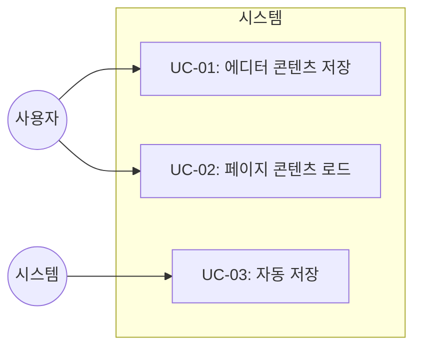
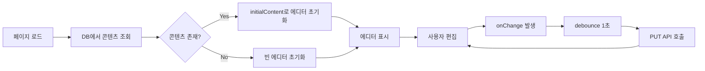
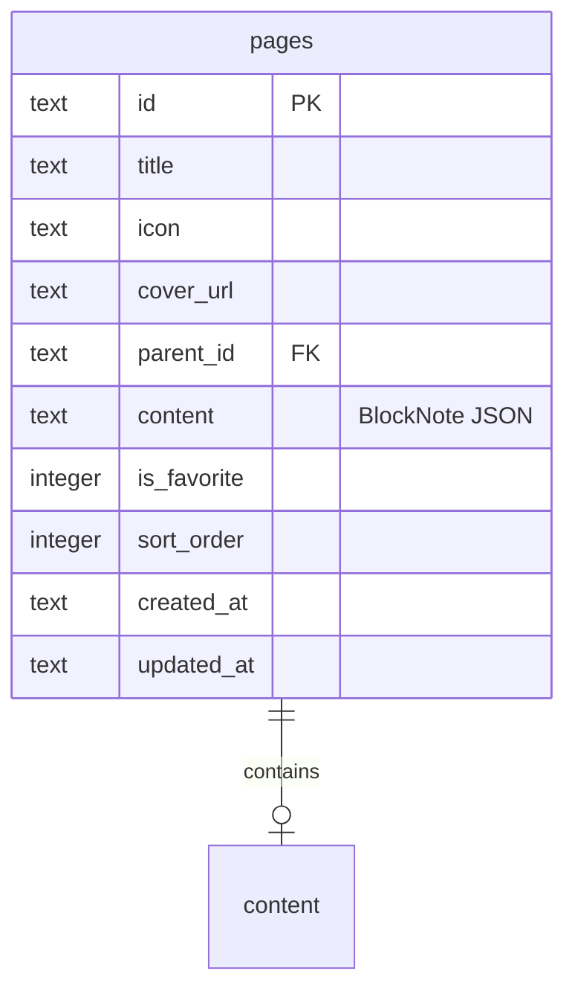

# TSK-01-02 - 에디터 콘텐츠 저장/로드 구현 설계 문서

## 문서 정보

| 항목 | 내용 |
|------|------|
| Task ID | TSK-01-02 |
| 문서 버전 | 1.0 |
| 작성일 | 2026-01-02 |
| 상태 | 작성중 |
| 카테고리 | development |

---

## 1. 개요

### 1.1 배경 및 문제 정의

**현재 상황:**
- TSK-01-01에서 BlockNote 에디터가 기본 통합되어 텍스트 입력 및 기본 블록 유형이 동작함
- 에디터에서 작성한 콘텐츠가 메모리에만 존재하고 새로고침 시 유실됨
- 페이지 로드 시 항상 빈 에디터가 표시됨

**해결하려는 문제:**
- 사용자가 작성한 콘텐츠가 영구적으로 저장되지 않음
- 페이지를 다시 열었을 때 이전에 작성한 내용을 복원할 수 없음
- 편집 중 데이터 손실 위험이 존재함

### 1.2 목적 및 기대 효과

**목적:**
- 에디터 콘텐츠를 SQLite 데이터베이스에 영구 저장
- 페이지 로드 시 저장된 콘텐츠를 자동으로 복원
- 사용자 편집 경험의 연속성 보장

**기대 효과:**
- 사용자 관점: 작성한 내용이 자동으로 저장되어 데이터 손실 걱정 없이 작업 가능
- 비즈니스 관점: Notion과 유사한 신뢰성 있는 편집 경험 제공

### 1.3 범위

**포함:**
- 에디터 onChange 콜백을 통한 콘텐츠 JSON 추출
- PUT /api/pages/:id API를 통한 DB 저장
- 페이지 로드 시 initialContent 전달
- 자동 저장 (debounce 1초 적용)
- 저장 중 상태 표시 (선택적)

**제외:**
- 실시간 협업 동기화 (향후 과제)
- 버전 히스토리 관리 (향후 과제)
- 오프라인 저장 큐 (향후 과제)

### 1.4 참조 문서

| 문서 | 경로 | 관련 섹션 |
|------|------|----------|
| PRD | `.orchay/projects/notion-like/prd.md` | 2.1 블록 기반 에디터 |
| TRD | `.orchay/projects/notion-like/trd.md` | 3.3 에디터 영역, 5 데이터베이스, 7 API 엔드포인트 |

---

## 2. 사용자 분석

### 2.1 대상 사용자

| 사용자 유형 | 특성 | 주요 니즈 |
|------------|------|----------|
| 일반 사용자 | 문서 작성자, 기술 수준 다양 | 작성 내용이 자동으로 안전하게 저장되길 원함 |
| 파워 유저 | 많은 문서를 관리, 높은 기술 이해도 | 빠른 저장, 저장 상태 확인 원함 |

### 2.2 사용자 페르소나

**페르소나 1: 김작성**
- 역할: 일반 사용자, 문서 작성자
- 목표: 아이디어와 메모를 빠르게 기록하고 언제든 접근
- 불만: 저장 버튼을 누르지 않아 작성 내용이 날아간 경험
- 시나리오: 회의 중 노트 작성, 브라우저 탭 닫았다가 다시 열었을 때 내용 유지 기대

---

## 3. 유즈케이스

### 3.1 유즈케이스 다이어그램



### 3.2 유즈케이스 상세

#### UC-01: 에디터 콘텐츠 저장

| 항목 | 내용 |
|------|------|
| 액터 | 사용자 (간접적으로 시스템) |
| 목적 | 에디터에서 수정된 콘텐츠를 DB에 저장 |
| 사전 조건 | 페이지가 로드되어 있고 에디터가 활성화됨 |
| 사후 조건 | 콘텐츠가 pages 테이블의 content 컬럼에 JSON 형태로 저장됨 |
| 트리거 | 에디터 내용 변경 후 1초 debounce 완료 |

**기본 흐름:**
1. 사용자가 에디터에서 텍스트를 입력하거나 블록을 수정한다
2. onChange 콜백이 호출되어 editor.document를 JSON으로 직렬화한다
3. debounce (1초) 후 PUT /api/pages/:id API를 호출한다
4. API가 pages 테이블의 content 컬럼을 업데이트한다
5. 저장 성공 시 저장 상태 표시가 사라진다 (선택)

**예외 흐름:**
- 4a. API 호출 실패 시:
  - 콘솔에 에러 로그 출력
  - 재시도 로직은 이번 범위에서 제외 (향후)

#### UC-02: 페이지 콘텐츠 로드

| 항목 | 내용 |
|------|------|
| 액터 | 사용자 |
| 목적 | 저장된 콘텐츠를 에디터에 표시 |
| 사전 조건 | 유효한 pageId로 페이지 라우트 접근 |
| 사후 조건 | 에디터에 저장된 콘텐츠가 렌더링됨 |
| 트리거 | 페이지 URL 접근 또는 사이드바에서 페이지 클릭 |

**기본 흐름:**
1. 사용자가 /[pageId] URL로 접근한다
2. 서버에서 GET /api/pages/:id를 호출하여 페이지 데이터를 가져온다
3. content 컬럼의 JSON을 파싱하여 initialContent로 전달한다
4. BlockNote 에디터가 initialContent를 기반으로 블록을 렌더링한다

**예외 흐름:**
- 3a. content가 null이거나 빈 문자열이면:
  - 빈 에디터로 시작 (기본 paragraph 블록)

#### UC-03: 자동 저장

| 항목 | 내용 |
|------|------|
| 액터 | 시스템 (자동) |
| 목적 | 사용자 개입 없이 주기적으로 콘텐츠 저장 |
| 사전 조건 | 에디터 내용이 변경됨 |
| 사후 조건 | 최신 콘텐츠가 DB에 저장됨 |
| 트리거 | onChange 이벤트 발생 후 1초 debounce |

**기본 흐름:**
1. 에디터에서 변경이 감지된다 (onChange)
2. debounce 타이머가 시작된다 (1초)
3. 1초 내에 추가 변경이 없으면 저장 API를 호출한다
4. 1초 내에 추가 변경이 있으면 타이머를 리셋한다

---

## 4. 사용자 시나리오

### 4.1 시나리오 1: 일반적인 문서 작성

**상황 설명:**
사용자가 노트 페이지를 열고 회의 내용을 기록한다. 작성 중간에 다른 탭으로 이동했다가 돌아오면 작성 내용이 그대로 유지되어 있다.

**단계별 진행:**

| 단계 | 사용자 행동 | 시스템 반응 | 사용자 기대 |
|------|-----------|------------|------------|
| 1 | 페이지 클릭 | DB에서 콘텐츠 로드, 에디터에 표시 | 이전 작성 내용 표시 |
| 2 | 텍스트 입력 | onChange 감지, debounce 시작 | 자연스러운 타이핑 |
| 3 | 1초 대기 | PUT API 호출, DB 저장 | (사용자는 인지 못함) |
| 4 | 브라우저 새로고침 | 페이지 다시 로드 | 작성 내용 그대로 표시 |

**성공 조건:**
- 새로고침 후 모든 콘텐츠가 정확히 복원됨
- 블록 순서, 서식, 내용이 저장 전과 동일

### 4.2 시나리오 2: 빠른 연속 편집

**상황 설명:**
사용자가 빠르게 여러 문장을 연속으로 입력한다. debounce가 제대로 동작하여 불필요한 API 호출을 방지한다.

**단계별 진행:**

| 단계 | 사용자 행동 | 시스템 반응 | 기대 결과 |
|------|-----------|------------|----------|
| 1 | 첫 문장 입력 | debounce 타이머 시작 (1초) | API 호출 없음 |
| 2 | 0.5초 후 두 번째 문장 입력 | 타이머 리셋 | API 호출 없음 |
| 3 | 0.5초 후 세 번째 문장 입력 | 타이머 리셋 | API 호출 없음 |
| 4 | 1초 대기 | PUT API 1회 호출 | 최종 콘텐츠만 저장 |

---

## 5. 화면 설계

### 5.1 화면 흐름도



### 5.2 화면별 상세

#### 화면 1: 에디터 페이지 (기존 화면에 저장 기능 추가)

**화면 목적:**
TSK-01-01에서 구현된 에디터에 저장/로드 기능 연동

**진입 경로:**
- /[pageId] URL 직접 접근
- 사이드바에서 페이지 클릭

**와이어프레임:**
```
┌─────────────────────────────────────────────────────────────┐
│  ┌─────────────────────────────────────────────────────┐   │
│  │                    페이지 헤더                       │   │
│  │  📄 아이콘    페이지 제목                           │   │
│  └─────────────────────────────────────────────────────┘   │
│                                                             │
│  ┌─────────────────────────────────────────────────────┐   │
│  │                                                     │   │
│  │              BlockNote 에디터 영역                   │   │
│  │                                                     │   │
│  │   [저장된 콘텐츠가 initialContent로 표시]           │   │
│  │                                                     │   │
│  │   사용자 편집 → onChange → debounce → 자동 저장     │   │
│  │                                                     │   │
│  └─────────────────────────────────────────────────────┘   │
│                                                             │
│  ┌───────────────────────────────────────────┐             │
│  │  (선택) 저장 상태 표시: "저장 중..." / "저장됨"      │   │
│  └───────────────────────────────────────────┘             │
│                                                             │
└─────────────────────────────────────────────────────────────┘
```

**화면 요소 설명:**

| 영역 | 설명 | 사용자 인터랙션 |
|------|------|----------------|
| BlockNote 에디터 | 콘텐츠 편집 영역 | 텍스트 입력, 블록 조작 |
| 저장 상태 표시 (선택) | 현재 저장 상태 | 읽기 전용 |

**사용자 행동 시나리오:**
1. 사용자가 페이지에 진입하면 저장된 콘텐츠가 에디터에 표시됨
2. 텍스트를 입력하거나 블록을 수정하면 자동으로 저장됨
3. 새로고침해도 콘텐츠가 유지됨

---

## 6. 인터랙션 설계

### 6.1 사용자 액션과 피드백

| 사용자 액션 | 즉각 피드백 | 결과 피드백 | 에러 피드백 |
|------------|-----------|------------|------------|
| 에디터 편집 | 텍스트 표시 | (자동 저장됨) | 콘솔 로그 |
| 페이지 로드 | 로딩 상태 | 콘텐츠 표시 | 에러 페이지 |

### 6.2 상태별 화면 변화

| 상태 | 화면 표시 | 사용자 안내 |
|------|----------|------------|
| 콘텐츠 로드 중 | 에디터 스켈레톤 (또는 빈 에디터) | - |
| 저장 중 | (선택) "저장 중..." 텍스트 | 작업 진행 중 |
| 저장 완료 | (선택) "저장됨" 또는 표시 사라짐 | 안전하게 저장됨 |
| 저장 실패 | 콘솔 에러 | (MVP에서는 별도 UI 없음) |

---

## 7. 데이터 요구사항

### 7.1 필요한 데이터

| 데이터 | 설명 | 출처 | 용도 |
|--------|------|------|------|
| page.id | 페이지 고유 식별자 | URL params (pageId) | API 호출 시 대상 지정 |
| page.content | BlockNote 문서 JSON | pages 테이블 content 컬럼 | 에디터 initialContent |
| editor.document | 현재 에디터 블록 배열 | BlockNote API | 저장할 콘텐츠 |

### 7.2 데이터 관계



**관계 설명:**
- pages 테이블의 content 컬럼에 BlockNote document를 JSON 문자열로 저장
- JSON 구조: `[{ type: "paragraph", content: [...], ... }, ...]`

### 7.3 데이터 유효성 규칙

| 데이터 필드 | 규칙 | 위반 시 메시지 |
|------------|------|---------------|
| content | JSON 형식 | "유효하지 않은 콘텐츠 형식" |
| pageId | 존재하는 페이지 | "페이지를 찾을 수 없습니다" (404) |

---

## 8. 비즈니스 규칙

### 8.1 핵심 규칙

| 규칙 ID | 규칙 설명 | 적용 상황 | 예외 |
|---------|----------|----------|------|
| BR-01 | 콘텐츠 변경 시 자동 저장 | 에디터에서 모든 변경 발생 시 | debounce 중 추가 변경 발생 |
| BR-02 | debounce 간격 1초 | 마지막 변경 후 1초 대기 | 없음 |
| BR-03 | 콘텐츠는 JSON 문자열로 저장 | DB 저장 시 | 없음 |

### 8.2 규칙 상세 설명

**BR-01: 자동 저장**

설명: 사용자가 에디터에서 어떤 변경을 하더라도 (텍스트 입력, 블록 추가/삭제, 드래그 앤 드롭 등) 시스템이 자동으로 저장한다. 사용자는 별도의 저장 버튼을 누를 필요가 없다.

예시:
- 텍스트 입력 시: 1초 후 자동 저장
- 블록 순서 변경 시: 1초 후 자동 저장
- 블록 삭제 시: 1초 후 자동 저장

**BR-02: debounce 간격**

설명: 연속적인 입력 시 매번 API를 호출하면 서버 부하가 증가하고 성능이 저하된다. 마지막 변경 후 1초 동안 추가 변경이 없을 때만 저장을 실행한다.

예시:
- 0.5초 간격으로 3번 입력: API 호출 1회 (마지막 입력 후 1초 뒤)
- 2초 간격으로 3번 입력: API 호출 3회 (각 입력 후 1초 뒤)

---

## 9. 에러 처리

### 9.1 예상 에러 상황

| 상황 | 원인 | 사용자 메시지 | 복구 방법 |
|------|------|--------------|----------|
| 페이지 없음 | 잘못된 pageId | 404 페이지 표시 | 올바른 URL로 이동 |
| 저장 실패 | 네트워크 오류 | 콘솔 로그 (MVP) | 페이지 새로고침 후 재시도 |
| JSON 파싱 오류 | 손상된 content | 빈 에디터로 시작 | 수동 복구 필요 |

### 9.2 에러 표시 방식

| 에러 유형 | 표시 위치 | 표시 방법 |
|----------|----------|----------|
| 페이지 없음 | 전체 화면 | 404 에러 페이지 |
| 저장 실패 | 콘솔 | console.error (MVP) |
| 로드 실패 | 에디터 영역 | 빈 에디터 + 콘솔 로그 |

---

## 10. 연관 문서

> 상세 테스트 명세 및 요구사항 추적은 별도 문서에서 관리합니다.

| 문서 | 경로 | 용도 |
|------|------|------|
| 요구사항 추적 매트릭스 | `025-traceability-matrix.md` | PRD → 설계 → 테스트 양방향 추적 |
| 테스트 명세서 | `026-test-specification.md` | 단위/E2E/매뉴얼 테스트 상세 정의 |

---

## 11. 구현 범위

### 11.1 영향받는 영역

| 영역 | 변경 내용 | 영향도 |
|------|----------|--------|
| src/components/editor/Editor.tsx | onChange 콜백 추가, initialContent 연동 | 높음 |
| src/app/[pageId]/page.tsx | 페이지 데이터 fetch, 에디터에 전달 | 높음 |
| src/app/api/pages/[id]/route.ts | PUT API content 저장 (기존 구현 확인) | 중간 |

### 11.2 의존성

| 의존 항목 | 이유 | 상태 |
|----------|------|------|
| TSK-01-01 | BlockNote 에디터 기본 통합 필요 | 대기중 |
| TSK-00-04 | SQLite DB 및 pages 테이블 필요 | 대기중 |

### 11.3 제약 사항

| 제약 | 설명 | 대응 방안 |
|------|------|----------|
| 실시간 동기화 없음 | MVP에서 단일 사용자만 가정 | 향후 Y.js 통합 |
| 오프라인 저장 없음 | 네트워크 필수 | 향후 Service Worker 추가 |

---

## 12. 기술 명세

### 12.1 에디터 컴포넌트 수정

```typescript
// src/components/editor/Editor.tsx
"use client";

import { useCreateBlockNote } from "@blocknote/react";
import { BlockNoteView } from "@blocknote/mantine";
import "@blocknote/mantine/style.css";
import { useCallback, useState } from "react";

interface EditorProps {
  pageId: string;
  initialContent?: string;
}

export function Editor({ pageId, initialContent }: EditorProps) {
  const [isSaving, setIsSaving] = useState(false);

  const editor = useCreateBlockNote({
    initialContent: initialContent ? JSON.parse(initialContent) : undefined,
  });

  // debounce 저장 함수
  const saveContent = useCallback(
    debounce(async (content: string) => {
      setIsSaving(true);
      try {
        await fetch(`/api/pages/${pageId}`, {
          method: "PUT",
          headers: { "Content-Type": "application/json" },
          body: JSON.stringify({ content }),
        });
      } catch (error) {
        console.error("Failed to save content:", error);
      } finally {
        setIsSaving(false);
      }
    }, 1000),
    [pageId]
  );

  return (
    <div className="px-[96px] py-4 max-w-[900px] mx-auto">
      {isSaving && (
        <div className="text-sm text-[#787774] mb-2">저장 중...</div>
      )}
      <BlockNoteView
        editor={editor}
        theme="light"
        onChange={() => {
          const content = JSON.stringify(editor.document);
          saveContent(content);
        }}
      />
    </div>
  );
}

// debounce 유틸리티 함수
function debounce<T extends (...args: any[]) => any>(
  fn: T,
  delay: number
): (...args: Parameters<T>) => void {
  let timeoutId: NodeJS.Timeout;
  return (...args: Parameters<T>) => {
    clearTimeout(timeoutId);
    timeoutId = setTimeout(() => fn(...args), delay);
  };
}
```

### 12.2 페이지 컴포넌트

```typescript
// src/app/[pageId]/page.tsx
import { getPage } from "@/lib/db";
import { Editor } from "@/components/editor/Editor";
import { PageHeader } from "@/components/editor/PageHeader";
import { notFound } from "next/navigation";

export default async function PageView({
  params,
}: {
  params: { pageId: string };
}) {
  const page = getPage(params.pageId);

  if (!page) {
    notFound();
  }

  return (
    <div className="flex-1 overflow-auto">
      <PageHeader
        icon={page.icon}
        coverUrl={page.cover_url}
        title={page.title}
        pageId={page.id}
      />
      <Editor
        pageId={page.id}
        initialContent={page.content || undefined}
      />
    </div>
  );
}
```

### 12.3 API 엔드포인트 (기존 확인)

```typescript
// src/app/api/pages/[id]/route.ts
// PUT 메서드에서 content 필드 저장 확인 필요

export async function PUT(
  request: Request,
  { params }: { params: { id: string } }
) {
  const data = await request.json();
  // data.content가 포함되면 DB에 저장됨
  const page = updatePage(params.id, data);
  if (!page) {
    return NextResponse.json({ error: 'Not found' }, { status: 404 });
  }
  return NextResponse.json(page);
}
```

---

## 13. 체크리스트

### 13.1 설계 완료 확인

- [x] 문제 정의 및 목적 명확화
- [x] 사용자 분석 완료
- [x] 유즈케이스 정의 완료
- [x] 사용자 시나리오 작성 완료
- [x] 화면 설계 완료 (와이어프레임)
- [x] 인터랙션 설계 완료
- [x] 데이터 요구사항 정의 완료
- [x] 비즈니스 규칙 정의 완료
- [x] 에러 처리 정의 완료
- [x] 기술 명세 작성 완료

### 13.2 연관 문서 작성

- [ ] 요구사항 추적 매트릭스 작성 (→ `025-traceability-matrix.md`)
- [ ] 테스트 명세서 작성 (→ `026-test-specification.md`)

### 13.3 구현 준비

- [x] 구현 우선순위 결정 (TSK-01-01 완료 후)
- [x] 의존성 확인 완료
- [x] 제약 사항 검토 완료

---

## 변경 이력

| 버전 | 일자 | 작성자 | 변경 내용 |
|------|------|--------|----------|
| 1.0 | 2026-01-02 | Claude | 최초 작성 |
