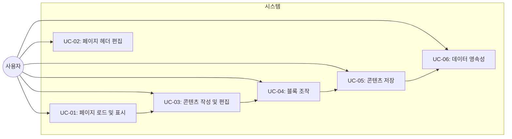

# TSK-01-99 - WP-01 통합 검증 설계 문서

## 문서 정보

| 항목 | 내용 |
|------|------|
| Task ID | TSK-01-99 |
| 문서 버전 | 1.0 |
| 작성일 | 2026-01-02 |
| 상태 | 작성중 |
| 카테고리 | simple-dev (통합 검증) |

---

## 1. 개요

### 1.1 배경 및 문제 정의

WP-01 핵심 에디터 작업 패키지의 모든 태스크(TSK-01-01 ~ TSK-01-05)가 완료되었으며, 이들이 올바르게 통합되어 사용자에게 기대된 경험을 제공하는지 검증해야 합니다.

**현재 상황:**
- 블록 에디터(BlockNote) 기본 통합 완료
- 에디터 콘텐츠 저장/로드 기능 완료
- Notion 스타일 CSS 적용 완료
- 페이지 헤더 컴포넌트(아이콘, 커버, 제목) 완료
- 아이콘 선택기 컴포넌트 완료

**해결하려는 문제:**
- 개별 태스크는 완료되었지만, 이들이 함께 작동하는지 검증 필요
- 페이지 로드 → 제목/아이콘/커버 표시 → 에디터 편집 → 저장 → 새로고침 후 유지 전체 흐름 검증
- 블록 생성, 드래그 앤 드롭, 저장 연동 확인 필요
- 기본 블록 유형(텍스트, 제목, 리스트, 인용, 코드) 모두 정상 동작 확인

### 1.2 목적 및 기대 효과

**목적:**
- WP-01의 모든 에디터 기능이 올바르게 통합되어 정상 동작하는지 검증
- 사용자가 기대하는 핵심 에디터 경험 제공 여부 확인
- 버그 및 호환성 문제 조기 발견 및 해결

**기대 효과:**
- 높은 품질의 에디터 경험 보장
- WP-02(페이지 구조)로 진행할 수 있는 기반 마련
- 사용자 신뢰도 향상

### 1.3 범위

**포함:**
- 페이지 로드 시 기존 데이터 표시 확인
- 페이지 헤더(제목, 아이콘, 커버) 편집 및 저장
- BlockNote 에디터를 통한 콘텐츠 작성 및 편집
- 다양한 블록 유형 생성 및 조작
- 콘텐츠 자동 저장 (debounce)
- 새로고침 후 데이터 유지 확인
- UI/UX 검증 (Notion 스타일 적용)
- 성능 검증 (저장 속도, 응답성)

**제외:**
- 협업 기능 (향후 과제)
- 버전 관리 (향후 과제)
- 고급 블록 유형 추가 (예: 임베드, 데이터베이스)
- 모바일 반응형 (WP-03에서 다룸)

### 1.4 참조 문서

| 문서 | 경로 | 관련 섹션 |
|------|------|----------|
| WBS | `.orchay/projects/notion-like/wbs.yaml` | WP-01, TSK-01-01~05 |
| 기본설계 (TSK-01-01) | `tasks/TSK-01-01/010-design.md` | BlockNote 통합 |
| 기본설계 (TSK-01-02) | `tasks/TSK-01-02/010-design.md` | 저장/로드 기능 |
| 기본설계 (TSK-01-03) | `tasks/TSK-01-03/010-design.md` | CSS 스타일 |
| 기본설계 (TSK-01-04) | `tasks/TSK-01-04/010-design.md` | 페이지 헤더 |
| 기본설계 (TSK-01-05) | `tasks/TSK-01-05/010-design.md` | 아이콘 선택기 |

---

## 2. 사용자 분석

### 2.1 대상 사용자

| 사용자 유형 | 특성 | 주요 니즈 |
|------------|------|----------|
| 일반 사용자 | 기술 수준 중간 이상, Notion 경험자 | 직관적 편집 경험, 빠른 저장, 신뢰성 있는 데이터 유지 |
| 파워 유저 | 기술 수준 높음, 효율성 중시 | 단축키, 빠른 네비게이션, 고급 블록 기능 |

### 2.2 사용자 페르소나

**페르소나 1: 에밀리(일반 사용자)**
- 역할: 개인 노트 정리, 문서 작성
- 목표: 간단하고 깔끔한 방식으로 콘텐츠 관리
- 불만: Notion은 좋지만, 너무 복잡하고 무겁다
- 시나리오: 매일 아침 할 일 목록을 작성하고, 저녁에 일기를 작성한다

**페르소나 2: 제임스(파워 유저)**
- 역할: 프로젝트 관리, 기술 문서 작성
- 목표: 빠르고 효율적으로 복잡한 문서 구조 생성
- 불만: 반복적인 클릭이 많고, 슬래시 명령어가 느리다
- 시나리오: 요구사항 문서를 작성할 때, 다양한 헤드라인과 코드 블록을 빠르게 삽입한다

---

## 3. 유즈케이스

### 3.1 유즈케이스 다이어그램



### 3.2 유즈케이스 상세

#### UC-01: 페이지 로드 및 표시

| 항목 | 내용 |
|------|------|
| 액터 | 사용자 |
| 목적 | 기존 페이지의 모든 정보(제목, 아이콘, 커버, 콘텐츠)를 올바르게 표시 |
| 사전 조건 | 데이터베이스에 저장된 페이지가 존재 |
| 사후 조건 | 모든 페이지 정보가 UI에 반영됨 |
| 트리거 | 사용자가 페이지 URL 방문 또는 사이드바에서 페이지 선택 |

**기본 흐름:**
1. 사용자가 페이지 URL에 접속한다
2. 시스템이 데이터베이스에서 페이지 정보(id, title, icon, cover_url, content)를 조회한다
3. 페이지 헤더(커버, 아이콘, 제목)가 렌더링된다
4. BlockNote 에디터가 초기화되고 저장된 콘텐츠(initialContent)가 로드된다
5. 사용자에게 완전히 편집 가능한 페이지가 표시된다

**대안 흐름:**
- 2a. 만약 페이지가 존재하지 않으면:
  - 시스템이 404 에러를 표시한다
  - 사용자가 새 페이지를 생성하도록 안내된다

**예외 흐름:**
- 2a. 만약 데이터베이스 조회에 실패하면:
  - 시스템이 에러 메시지를 표시한다
  - 사용자가 페이지 새로고침을 시도할 수 있다

#### UC-02: 페이지 헤더 편집

| 항목 | 내용 |
|------|------|
| 액터 | 사용자 |
| 목적 | 페이지의 제목, 아이콘, 커버 이미지 변경 |
| 사전 조건 | 페이지가 로드됨 |
| 사후 조건 | 변경된 헤더 정보가 DB에 저장되고 UI에 반영됨 |
| 트리거 | 사용자가 헤더의 편집 버튼 또는 요소 클릭 |

**기본 흐름:**
1. 사용자가 페이지 제목을 클릭하여 편집 모드로 전환한다
2. 사용자가 새 제목을 입력한다
3. 시스템이 자동으로 DB에 저장한다
4. 페이지 제목이 업데이트되어 표시된다
5. 사용자가 아이콘을 클릭하면 아이콘 선택기가 열린다
6. 사용자가 새 이모지를 선택한다
7. 시스템이 선택된 이모지를 저장하고 표시한다

#### UC-03: 콘텐츠 작성 및 편집

| 항목 | 내용 |
|------|------|
| 액터 | 사용자 |
| 목적 | BlockNote 에디터를 사용하여 다양한 블록으로 콘텐츠 작성 |
| 사전 조건 | 페이지가 로드됨, 에디터가 활성화됨 |
| 사후 조건 | 작성된 콘텐츠가 자동으로 저장됨 |
| 트리거 | 사용자가 에디터 영역에 포커스 |

**기본 흐름:**
1. 사용자가 에디터 영역을 클릭한다
2. 커서가 에디터에 나타난다
3. 사용자가 텍스트를 입력한다
4. 입력된 텍스트가 실시간으로 표시된다
5. 1초 debounce 후 콘텐츠가 자동으로 DB에 저장된다
6. 저장 표시가 UI에 나타났다가 사라진다

#### UC-04: 블록 조작

| 항목 | 내용 |
|------|------|
| 액터 | 사용자 |
| 목적 | 슬래시 명령어로 다양한 블록 생성, 드래그로 블록 순서 변경 |
| 사전 조건 | 에디터가 활성화됨 |
| 사후 조건 | 새로운 블록이 생성/수정되고 저장됨 |
| 트리거 | 사용자가 `/` 입력 또는 블록 핸들 드래그 |

**기본 흐름:**
1. 사용자가 블록 내에서 `/`를 입력한다
2. 슬래시 메뉴가 표시된다
3. 사용자가 원하는 블록 유형(제목, 리스트, 인용, 코드 등)을 선택한다
4. 새 블록이 생성되고 사용자가 콘텐츠를 입력한다
5. 시스템이 자동으로 저장한다

**대안 흐름:**
- 2a. 사용자가 블록 호버 시 나타나는 핸들을 드래그한다:
  - 블록이 새 위치로 이동한다
  - 순서 변경이 저장된다

#### UC-05: 콘텐츠 저장

| 항목 | 내용 |
|------|------|
| 액터 | 시스템 (자동 저장) / 사용자 (수동 저장) |
| 목적 | 에디터 콘텐츠를 데이터베이스에 저장 |
| 사전 조건 | 콘텐츠가 변경됨 |
| 사후 조건 | 콘텐츠가 DB에 저장되고 저장 상태 표시 |
| 트리거 | 콘텐츠 변경 후 1초 debounce |

**기본 흐름:**
1. 사용자가 콘텐츠를 편집한다
2. onChange 콜백이 트리거된다
3. editor.document에서 JSON 형식의 콘텐츠를 추출한다
4. debounce 타이머가 시작된다
5. 1초 동안 추가 변경이 없으면 PUT /api/pages/:id 요청이 발송된다
6. 저장 표시가 UI에 나타난다
7. 요청이 완료되면 저장 완료 표시가 나타났다가 사라진다

#### UC-06: 데이터 영속성

| 항목 | 내용 |
|------|------|
| 액터 | 사용자 / 브라우저 |
| 목적 | 저장된 콘텐츠가 새로고침 후에도 유지 |
| 사전 조건 | 콘텐츠가 DB에 저장됨 |
| 사후 조건 | 새로고침 후 동일한 콘텐츠 표시 |
| 트리거 | 사용자가 페이지 새로고침(F5, Cmd+R) |

**기본 흐름:**
1. 사용자가 콘텐츠를 작성하고 저장한다
2. 저장 완료를 확인한다
3. 페이지를 새로고침한다
4. 시스템이 DB에서 최신 콘텐츠를 다시 로드한다
5. 새로고침 전과 동일한 콘텐츠가 표시된다

---

## 4. 사용자 시나리오

### 4.1 시나리오 1: 기본 노트 작성 및 저장

**상황 설명:**
에밀리는 오늘의 할 일 목록을 정리하는 새 페이지를 만들었습니다. 이제 이 페이지에 내용을 작성하고 저장한 후, 나중에 확인하고 싶습니다.

**단계별 진행:**

| 단계 | 사용자 행동 | 시스템 반응 | 사용자 기대 |
|------|-----------|------------|------------|
| 1 | 페이지 접속 | 페이지 로드 (제목, 아이콘, 커버, 에디터) | 완전히 로드된 페이지 |
| 2 | 제목 클릭 후 "Today's Tasks" 입력 | 제목 변경, 자동 저장 | 입력이 즉시 반영됨 |
| 3 | 아이콘 클릭 | 아이콘 선택기 오픈 | 이모지 선택 가능 |
| 4 | ✓ 이모지 선택 | 선택한 이모지가 페이지에 표시, 저장 | 아이콘이 변경됨 |
| 5 | 에디터에 포커스, "오늘의 할 일:" 입력 | 텍스트 입력, debounce 후 자동 저장 | 텍스트 표시, 저장됨 |
| 6 | `/` 입력 후 "List" 선택 | 리스트 블록 생성 | 새 리스트 블록 표시 |
| 7 | 리스트 항목 3개 입력 | 각 항목 입력, debounce 후 저장 | 리스트 항목이 저장됨 |
| 8 | 페이지 새로고침 | DB에서 모든 데이터 로드 | 새로고침 전과 동일한 내용 표시 |
| 9 | 제목, 아이콘, 리스트 모두 유지 확인 | - | 모든 데이터가 정확히 유지됨 |

**성공 조건:**
- 페이지 제목이 "Today's Tasks"로 표시됨
- 아이콘이 선택한 이모지로 표시됨
- "오늘의 할 일:" 텍스트와 3개의 리스트 항목이 모두 표시됨
- 새로고침 후 모든 데이터가 유지됨 ✓

### 4.2 시나리오 2: 복잡한 문서 작성 (다양한 블록 타입)

**상황 설명:**
제임스는 프로젝트 요구사항 문서를 작성 중입니다. 제목, 본문, 코드 예제, 인용, 리스트 등 다양한 블록을 사용하여 구조화된 문서를 만들고 싶습니다.

**단계별 진행:**

| 단계 | 사용자 행동 | 시스템 반응 | 사용자 기대 |
|------|-----------|------------|------------|
| 1 | 페이지 접속 | 에디터 준비됨 | 빈 에디터 |
| 2 | "# 요구사항 분석서" 입력 후 Shift+Enter | H1 헤드라인 생성 | 큰 제목으로 표시됨 |
| 3 | 다음 줄에서 `/heading2` 입력 | H2 블록 생성 | H2 헤드라인 |
| 4 | "백그라운드" 입력 | 텍스트 입력 | H2 하위에 텍스트 |
| 5 | 새 라인에서 `/quote` 입력 | 인용 블록 생성 | 인용 스타일 블록 |
| 6 | 인용 텍스트 입력 | 텍스트 표시 | 스타일 적용됨 |
| 7 | `/code` 입력 후 코드 예제 입력 | 코드 블록 생성 | 코드 포맷팅 (선택) |
| 8 | 여러 블록을 호버하여 핸들 드래그 | 블록 순서 변경 | 원하는 순서로 정렬됨 |
| 9 | 각 변경 후 자동 저장 확인 | 1초 debounce로 저장 | 모든 변경이 저장됨 |
| 10 | 새로고침 | 모든 블록과 순서 유지 | 완벽한 문서 복원 |

**성공 조건:**
- 다양한 블록 타입(H1, H2, 인용, 코드, 리스트)이 모두 생성 가능 ✓
- 각 블록의 스타일이 시각적으로 구별됨 ✓
- 블록 순서를 드래그로 변경 가능 ✓
- 새로고침 후 모든 데이터와 순서가 유지됨 ✓

### 4.3 시나리오 3: 오류 복구

**상황 설명:**
사용자가 실수로 중요한 콘텐츠를 삭제했거나, 네트워크 지연으로 저장이 지연될 수 있습니다.

**단계별 진행:**

| 단계 | 사용자 행동 | 시스템 반응 | 복구 방법 |
|------|-----------|------------|----------|
| 1 | 콘텐츠 작성 후 1초 대기 | debounce 타이머 시작 | 자동 저장 진행 |
| 2 | 콘텐츠 실수로 삭제 | 로컬 상태 변경, 저장 요청 | 페이지 새로고침 시 이전 상태 복원 |
| 3 | 네트워크 느림으로 저장 중 | 저장 표시 나타남 | 저장 완료 확인 후 진행 |
| 4 | 모든 변경이 저장될 때까지 대기 | 저장 완료 표시 나타남 | 저장 표시가 사라지면 완료 |

---

## 5. 화면 설계

### 5.1 화면 흐름도


### 5.2 화면별 상세

#### 화면 1: 페이지 에디터 (메인 화면)

**화면 목적:**
사용자가 페이지 제목, 아이콘, 커버를 편집하고 BlockNote 에디터를 사용하여 콘텐츠를 작성하는 메인 인터페이스입니다.

**진입 경로:**
- 사이드바에서 기존 페이지 클릭
- URL 직접 입력 (`/[pageId]`)
- 새 페이지 생성 후 자동으로 진입

**와이어프레임:**
```
┌─────────────────────────────────────────────────────┐
│  ┌─────────────────────────────────────────────┐   │
│  │          커버 이미지 영역 (200px)           │   │
│  │   [변경 버튼 - 호버 시 표시]                │   │
│  └─────────────────────────────────────────────┘   │
│                                                     │
│  ┌─────────────────────────────────────────────┐   │
│  │  📝    페이지 제목 (40px 폰트)              │   │
│  │        [편집 가능, 클릭 시 포커스]         │   │
│  └─────────────────────────────────────────────┘   │
│                                                     │
│  ┌──────────────────────────────────────────────┐  │
│  │                                              │  │
│  │      BlockNote 에디터 영역                   │  │
│  │  ┌──────────────────────────────────────┐   │  │
│  │  │ 텍스트 입력...                          │   │  │
│  │  │ / 슬래시 메뉴 지원                       │   │  │
│  │  │ ☰ 블록 핸들 (호버 시 표시)             │   │  │
│  │  │                                      │   │  │
│  │  │ - 리스트 항목 1                        │   │  │
│  │  │ - 리스트 항목 2                        │   │  │
│  │  │                                      │   │  │
│  │  │ > 인용문                               │   │  │
│  │  │                                      │   │  │
│  │  │ ``` 코드 블록                          │   │  │
│  │  └──────────────────────────────────────┘   │  │
│  │                                              │  │
│  │  💾 저장 중... → 저장 완료 ✓                 │  │
│  └──────────────────────────────────────────────┘  │
│                                                     │
└─────────────────────────────────────────────────────┘
```

**화면 요소 설명:**

| 영역 | 설명 | 사용자 인터랙션 |
|------|------|----------------|
| 커버 이미지 | 페이지 상단 배너 이미지 (200px 높이, object-cover) | 호버 시 변경 버튼 표시, 클릭 시 이미지 업로드 |
| 페이지 아이콘 | 78px 크기의 이모지 아이콘 | 클릭 시 아이콘 선택기 오픈 |
| 페이지 제목 | 40px 크기의 bold 텍스트 | 클릭하여 편집, Ctrl+S 또는 포커스 해제 시 저장 |
| 에디터 영역 | BlockNote 에디터 | 텍스트 입력, `/` 로 슬래시 메뉴, 블록 호버 시 핸들 표시 |
| 저장 표시 | 자동 저장 상태 | debounce 후 "저장 중..." → "저장 완료" 순서로 표시 |

**사용자 행동 시나리오:**
1. 사용자가 페이지에 진입하면 커버, 아이콘, 제목, 에디터를 모두 본다
2. 제목을 클릭하면 텍스트가 편집 가능 상태가 된다
3. 아이콘을 클릭하면 이모지 선택기 팝업이 나타난다
4. 에디터에서 텍스트를 입력하면 실시간으로 반영된다
5. 1초 후 자동으로 저장되며 "저장 완료" 표시가 나타났다가 사라진다

#### 화면 2: 아이콘 선택기 (팝업)

**화면 목적:**
사용자가 다양한 이모지 중에서 원하는 아이콘을 선택하는 드롭다운 팝업입니다.

**와이어프레임:**
```
┌──────────────────────────────┐
│ 아이콘 선택기                 │ ← 드롭다운, Notion 스타일 그림자
│ ┌────────────────────────┐   │
│ │ 📙 📓 📕 📗 📘 📙 📚 📖 │   │ ← 카테고리 1: Books (8열 그리드)
│ │ 📖 📙 📓 📕 📗 📘 📙 📚 │   │
│ └────────────────────────┘   │
│ ┌────────────────────────┐   │
│ │ 😀 😃 😄 😁 😆 😅 😂 🤣 │   │ ← 카테고리 2: Smileys
│ │ 😊 😇 🙂 🙃 😉 😌 😍 🥰 │   │
│ └────────────────────────┘   │
│                              │
│ [최근 사용]                    │ ← 선택적
│ ✓ 📝 ✅ 🚀 📌                  │
│                              │
└──────────────────────────────┘
```

**화면 요소 설명:**

| 영역 | 설명 | 사용자 인터랙션 |
|------|------|----------------|
| 이모지 그리드 | 카테고리별로 정렬된 8열 그리드 | 클릭하여 선택, 호버 시 배경색 변경 |
| 카테고리 탭 | 이모지 카테고리 선택 (선택적) | 클릭하여 카테고리 전환 |
| 최근 사용 | 최근 선택한 이모지 5개 (선택적) | 클릭하여 빠르게 재선택 |
| 팝업 배경 | 반투명 오버레이 | 팝업 외부 클릭 시 닫힘 |

### 5.3 반응형 동작

| 화면 크기 | 레이아웃 변화 | 사용자 경험 |
|----------|--------------|------------|
| 데스크톱 (1024px+) | 일반 2컬럼 (사이드바 + 에디터) | 넓은 에디터 영역, 편안한 편집 |
| 태블릿 (768-1023px) | 사이드바 접힘, 에디터 확대 | 패딩 조정 (기본: 96px, 좁은 화면: 24px) |
| 모바일 (767px-) | 사이드바 오버레이, 햄버거 메뉴 | 에디터 패딩 축소, 커버 높이 감소 |

---

## 6. 인터랙션 설계

### 6.1 사용자 액션과 피드백

| 사용자 액션 | 즉각 피드백 | 결과 피드백 | 에러 피드백 |
|------------|-----------|------------|------------|
| 제목 클릭 | 포커스 표시, 커서 표시 | 제목 변경 저장, 라벨 표시 | 입력 제한 없음 |
| 아이콘 클릭 | 팝업 열기 애니메이션 | 아이콘 변경, 저장 표시 | 네트워크 오류 시 토스트 |
| 텍스트 입력 | 실시간 텍스트 표시 | 1초 후 "저장 완료" | 길이 제한 없음 |
| 슬래시 메뉴 | `/` 입력 후 메뉴 표시 | 블록 생성, 자동 저장 | 메뉴 미표시 시 재입력 안내 |
| 블록 드래그 | 드래그 중 투명도 변화 | 순서 변경 저장 | 드롭 영역 표시 |

### 6.2 상태별 화면 변화

| 상태 | 화면 표시 | 사용자 안내 |
|------|----------|------------|
| 초기 로딩 | 스켈레톤 또는 로딩 스피너 | "페이지 불러오는 중..." |
| 데이터 로드됨 | 헤더 + 에디터 완전 표시 | 편집 가능 상태 |
| 저장 중 | "💾 저장 중..." 표시 | 저장 완료 대기 |
| 저장 완료 | "✓ 저장 완료" 표시 (2초 후 사라짐) | 안전하게 저장됨 |
| 에러 발생 | 에러 토스트 알림 | "저장에 실패했습니다. 다시 시도해주세요." |
| 네트워크 오류 | 경고 아이콘 + 토스트 | "인터넷 연결을 확인해주세요." |

### 6.3 키보드/접근성

| 기능 | 키보드 단축키 | 스크린 리더 안내 |
|------|-------------|-----------------|
| 저장 | Ctrl+S (또는 자동 저장) | "저장됨" |
| 포커스 이동 | Tab | "제목 입력", "에디터 영역" |
| 슬래시 메뉴 | `/` | "슬래시 메뉴 열림, 블록 선택 가능" |
| 에디터 나가기 | Escape | "에디터 포커스 해제" |
| 블록 선택 | 방향키 | "블록 선택됨" |

---

## 7. 데이터 요구사항

### 7.1 필요한 데이터

| 데이터 | 설명 | 출처 | 용도 |
|--------|------|------|------|
| 페이지 ID | 고유 식별자 | URL 파라미터 또는 라우터 | 특정 페이지 조회/수정 |
| 페이지 제목 | 페이지 이름 | DB pages 테이블 | UI에 표시, 편집 |
| 페이지 아이콘 | 이모지 문자 (UTF-8) | DB pages 테이블 | UI에 표시, 변경 |
| 커버 URL | 이미지 URL 또는 Base64 | DB pages 테이블 또는 파일 스토리지 | 커버 이미지 렌더링 |
| 페이지 콘텐츠 | BlockNote JSON 형식 | DB pages 테이블 (content 필드) | 에디터 초기화, 저장 |
| 생성 시간 | timestamp | DB pages 테이블 | 메타데이터 (선택) |
| 수정 시간 | timestamp | DB pages 테이블 | 메타데이터, "최근 수정" (선택) |

### 7.2 데이터 관계

```mermaid
erDiagram
    pages ||--o{ blocks : contains
    blocks ||--o{ children : contains
    pages }o--|| users : owner

    pages : string id PK
    pages : string title
    pages : string icon
    pages : string cover_url
    pages : json content
    pages : string parent_id FK
    pages : datetime created_at
    pages : datetime updated_at

    blocks : string id
    blocks : string type
    blocks : json properties
    blocks : string children

    users : string id
    users : string name
```

**관계 설명:**
- `pages` 테이블이 BlockNote 에디터의 모든 데이터를 `content` JSON 필드에 저장합니다
- 각 페이지는 제목, 아이콘, 커버, 콘텐츠를 가지고 있습니다
- BlockNote 내부적으로 블록 트리 구조를 JSON으로 관리합니다

### 7.3 데이터 유효성 규칙

| 데이터 필드 | 규칙 | 위반 시 메시지 |
|------------|------|---------------|
| 페이지 ID | 필수, UUID 형식 | "잘못된 페이지 ID입니다" |
| 페이지 제목 | 선택적, 0-200자 | (자동 잘림 또는 경고 없음) |
| 페이지 아이콘 | 선택적, 단일 이모지 (UTF-8) | "유효한 이모지를 선택해주세요" |
| 커버 URL | 선택적, 유효한 URL 또는 Base64 | "이미지 로드에 실패했습니다" |
| 페이지 콘텐츠 | 선택적, 유효한 BlockNote JSON | "콘텐츠 형식이 올바르지 않습니다" |

---

## 8. 비즈니스 규칙

### 8.1 핵심 규칙

| 규칙 ID | 규칙 설명 | 적용 상황 | 예외 |
|---------|----------|----------|------|
| BR-01 | 모든 편집 변경은 자동으로 저장 | 제목, 아이콘, 콘텐츠 변경 시 | 네트워크 오류 시 재시도 |
| BR-02 | 저장은 debounce 1초로 최적화 | 텍스트 입력 중 | 수동 저장 요청 시 즉시 저장 |
| BR-03 | 슬래시 메뉴는 기본 블록 타입만 제공 | `/` 입력 시 | 향후 고급 블록 추가 가능 |
| BR-04 | 블록 드래그는 같은 레벨에서만 가능 | 블록 호버 시 | 나중에 중첩 드래그 지원 |
| BR-05 | 아이콘은 단일 이모지만 허용 | 아이콘 선택 시 | 다중 선택 불가 |

### 8.2 규칙 상세 설명

**BR-01: 자동 저장**

설명: 사용자가 페이지 제목, 아이콘, 에디터 콘텐츠를 변경할 때마다 자동으로 데이터베이스에 저장됩니다. 이를 통해 작업 손실을 방지하고 사용자 경험을 향상시킵니다.

예시:
- 제목 편집 완료 시: 즉시 PUT /api/pages/:id 요청
- 텍스트 입력 중: 1초 debounce 후 PUT /api/pages/:id 요청
- 아이콘 변경 시: 선택 완료 후 즉시 PUT /api/pages/:id 요청

**BR-02: Debounce 최적화**

설명: 텍스트 입력 중에는 매 키 입력마다 저장하지 않고, 마지막 입력 후 1초 동안 추가 입력이 없을 때 한 번만 저장합니다. 이는 네트워크 트래픽을 줄이고 서버 부하를 감소시킵니다.

예시:
- 0초: 사용자 텍스트 입력 → debounce 시작
- 0.5초: 추가 입력 → debounce 초기화
- 1.0초: 추가 입력 없음 → 저장 요청 발송

**BR-03: 기본 블록 타입**

설명: 초기 버전에서는 다음과 같은 기본 블록 타입만 지원합니다:
- 제목 (H1, H2, H3)
- 문단 (Paragraph)
- 리스트 (Bulleted List, Numbered List)
- 인용 (Quote)
- 코드 (Code Block)

향후 다음 블록들이 추가될 수 있습니다:
- 이미지, 비디오, 임베드
- 테이블, 데이터베이스
- 투두 리스트, 체크리스트

**BR-04: 블록 드래그 범위**

설명: 현재 버전에서는 같은 깊이 수준의 블록끼리만 순서를 변경할 수 있습니다. 중첩 구조나 들여쓰기는 향후 업데이트에서 지원될 예정입니다.

**BR-05: 아이콘 단일성**

설명: 페이지 아이콘은 하나의 이모지만 허용됩니다. 여러 이모지 조합은 향후 업데이트에서 고려될 수 있습니다.

---

## 9. 에러 처리

### 9.1 예상 에러 상황

| 상황 | 원인 | 사용자 메시지 | 복구 방법 |
|------|------|--------------|----------|
| 페이지 미존재 | 잘못된 ID 또는 삭제됨 | "페이지를 찾을 수 없습니다." | 사이드바로 돌아가기 |
| 로드 실패 | 네트워크 오류 | "페이지를 불러올 수 없습니다." | 새로고침 버튼 |
| 저장 실패 | 네트워크 오류 또는 서버 오류 | "저장에 실패했습니다. 다시 시도해주세요." | 재시도 또는 온라인 상태 확인 |
| 타임아웃 | 응답 없음 (>10초) | "요청 시간을 초과했습니다." | 재시도 또는 페이지 새로고침 |
| 권한 오류 | 접근 권한 없음 (향후) | "이 페이지에 접근할 수 없습니다." | 소유자에게 문의 |
| 데이터 형식 오류 | 잘못된 JSON 또는 손상된 데이터 | "페이지 데이터가 손상되었습니다." | 관리자 문의 또는 복구 대기 |

### 9.2 에러 표시 방식

| 에러 유형 | 표시 위치 | 표시 방법 |
|----------|----------|----------|
| 페이지 로드 오류 | 화면 중앙 | 에러 메시지 박스 + 재시도 버튼 |
| 저장 오류 | 화면 하단 우측 | 토스트 알림 (빨간색 배경) |
| 필드 오류 | 해당 필드 하단 | 빨간색 텍스트 또는 경고 아이콘 |
| 시스템 오류 | 화면 상단 | 경고 배너 (노란색 배경) |

---

## 10. 연관 문서

> 상세 테스트 명세 및 요구사항 추적은 별도 문서에서 관리합니다.

| 문서 | 경로 | 용도 |
|------|------|------|
| 요구사항 추적 매트릭스 | `025-traceability-matrix.md` | WP-01 요구사항 → 설계 → 테스트 추적 |
| 테스트 명세서 | `026-test-specification.md` | 통합 테스트 케이스 및 절차 정의 |

---

## 11. 구현 범위

### 11.1 영향받는 영역

| 영역 | 변경 내용 | 영향도 |
|------|----------|--------|
| 페이지 라우트 | `src/app/[pageId]/page.tsx` | 높음 |
| 페이지 헤더 | `src/components/editor/PageHeader.tsx` | 높음 |
| BlockNote 에디터 | `src/components/editor/Editor.tsx` | 높음 |
| API 엔드포인트 | `src/app/api/pages` | 중간 |
| Zustand 스토어 | `src/lib/store.ts` | 낮음 |
| DB 스키마 | `data/database.db` (pages 테이블) | 낮음 |

### 11.2 의존성

| 의존 항목 | 이유 | 상태 |
|----------|------|------|
| TSK-01-01 (BlockNote 통합) | 에디터 기본 기능 | 완료 ✓ |
| TSK-01-02 (저장/로드) | 콘텐츠 영속성 | 완료 ✓ |
| TSK-01-03 (CSS 스타일) | UI 일관성 | 완료 ✓ |
| TSK-01-04 (페이지 헤더) | 헤더 컴포넌트 | 완료 ✓ |
| TSK-01-05 (아이콘 선택기) | 아이콘 변경 기능 | 완료 ✓ |
| TSK-00-99 (WP-00 통합) | 기본 인프라 (DB, 스토어, API) | 대기 |

### 11.3 제약 사항

| 제약 | 설명 | 대응 방안 |
|------|------|----------|
| BlockNote 버전 | 0.18.x 고정 | 향후 업그레이드 시 호환성 검증 |
| 브라우저 지원 | 최신 2개 버전 (Chrome, Firefox, Safari) | IE11 미지원 |
| 파일 크기 제한 | 콘텐츠 JSON 크기 제한 없음 (DB 제약에 따름) | 대용량 문서는 향후 최적화 예정 |
| 실시간 협업 | 미지원 | WP-04 이상에서 계획 |

---

## 12. 테스트 전략

### 12.1 통합 테스트 범위

1. **페이지 로드 검증**
   - [ ] 기존 페이지 로드 시 모든 데이터(제목, 아이콘, 커버, 콘텐츠) 표시
   - [ ] 제목, 아이콘, 커버가 올바르게 렌더링됨
   - [ ] 에디터가 저장된 콘텐츠로 초기화됨

2. **페이지 헤더 편집**
   - [ ] 제목 클릭 후 편집 가능
   - [ ] 아이콘 클릭 시 선택기 열림
   - [ ] 이모지 선택 후 저장됨
   - [ ] 커버 변경 가능 (선택)

3. **에디터 기본 기능**
   - [ ] 텍스트 입력 가능
   - [ ] 기본 블록 유형(텍스트, 제목, 리스트, 인용, 코드) 생성 가능
   - [ ] 슬래시 메뉴 동작
   - [ ] 블록 호버 시 핸들 표시
   - [ ] 블록 드래그로 순서 변경 가능

4. **자동 저장**
   - [ ] 텍스트 입력 후 1초 debounce 검증
   - [ ] 저장 표시("💾 저장 중..." → "✓ 저장 완료") 확인
   - [ ] 네트워크 오류 시 재시도 동작

5. **데이터 영속성**
   - [ ] 페이지 새로고침 후 모든 데이터 유지
   - [ ] 다른 페이지 방문 후 돌아와도 데이터 유지
   - [ ] 브라우저 탭 닫았다 다시 열어도 데이터 유지

6. **에러 처리**
   - [ ] 페이지 미존재 시 404 처리
   - [ ] 네트워크 오류 시 토스트 알림
   - [ ] 저장 실패 시 재시도 옵션 제공

### 12.2 성능 테스트

| 시나리오 | 목표 | 측정 방법 |
|---------|------|----------|
| 페이지 로드 | < 2초 | Lighthouse 또는 DevTools |
| 텍스트 입력 응답성 | < 100ms | React DevTools Profiler |
| 저장 요청 완료 | < 1초 | Network 탭 확인 |
| 메모리 사용량 | < 100MB | Chrome DevTools |

### 12.3 사용자 시나리오 E2E 테스트

| 시나리오 | 테스트 항목 | 예상 결과 |
|---------|-----------|----------|
| 기본 노트 작성 | 제목 입력 → 아이콘 선택 → 콘텐츠 작성 → 저장 → 새로고침 | 모든 정보 유지 |
| 복잡한 문서 작성 | 다양한 블록 생성 → 순서 변경 → 저장 → 새로고침 | 구조 정확히 유지 |
| 에러 복구 | 저장 실패 → 재시도 → 성공 | 에러 없이 저장됨 |

---

## 13. 체크리스트

### 13.1 설계 완료 확인

- [x] 문제 정의 및 목적 명확화 (WP-01 통합 검증)
- [x] 사용자 분석 완료 (페르소나 2명)
- [x] 유즈케이스 정의 완료 (6가지)
- [x] 사용자 시나리오 작성 완료 (3가지)
- [x] 화면 설계 완료 (2개 화면)
- [x] 인터랙션 설계 완료
- [x] 데이터 요구사항 정의 완료
- [x] 비즈니스 규칙 정의 완료
- [x] 에러 처리 정의 완료
- [x] 테스트 전략 정의 완료

### 13.2 연관 문서 작성

- [ ] 요구사항 추적 매트릭스 작성 (→ `025-traceability-matrix.md`)
- [ ] 테스트 명세서 작성 (→ `026-test-specification.md`)

### 13.3 실행 준비

- [x] 모든 선행 태스크 완료 확인 (TSK-01-01~05)
- [x] 테스트 환경 준비 (개발 서버 실행 가능)
- [x] 테스트 케이스 정의 완료

---

## 변경 이력

| 버전 | 일자 | 작성자 | 변경 내용 |
|------|------|--------|----------|
| 1.0 | 2026-01-02 | Claude | 최초 작성 |
