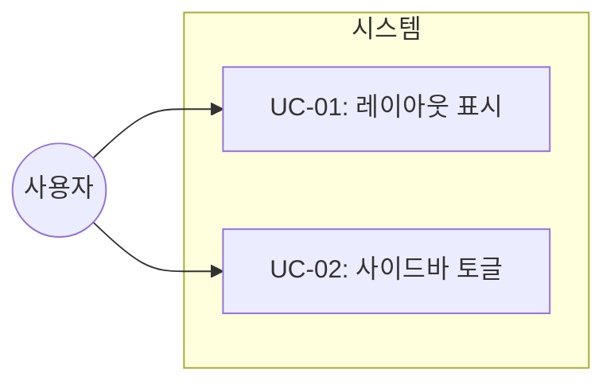

# TSK-02-01 - 메인 레이아웃 (사이드바 + 에디터 영역) 설계 문서

## 문서 정보

| 항목 | 내용 |
|------|------|
| Task ID | TSK-02-01 |
| 문서 버전 | 1.0 |
| 작성일 | 2026-01-02 |
| 상태 | 작성중 |
| 카테고리 | development |

---

## 1. 개요

### 1.1 배경 및 문제 정의

**현재 상황:**
- WP-01에서 BlockNote 에디터와 페이지 헤더 컴포넌트가 구현됨
- 에디터만 존재하고 페이지 네비게이션을 위한 사이드바가 없음
- 전체 화면을 에디터가 차지하여 Notion과 같은 워크스페이스 경험 제공 불가

**해결하려는 문제:**
- Notion 스타일의 2컬럼 레이아웃 구현 필요
- 사이드바를 통한 페이지 네비게이션 공간 확보
- 사용자가 작업 공간을 유연하게 조절할 수 있는 사이드바 토글 기능

### 1.2 목적 및 기대 효과

**목적:**
- Notion과 동일한 사이드바 + 에디터 2컬럼 레이아웃 구현
- 사이드바 접기/펼치기 기능으로 작업 공간 최적화

**기대 효과:**
- 사용자가 친숙한 Notion 스타일 인터페이스 경험
- 페이지 네비게이션과 에디터를 동시에 사용 가능
- 집중 모드를 위한 사이드바 숨김 기능

### 1.3 범위

**포함:**
- MainLayout.tsx 컴포넌트 생성
- 사이드바 영역 (240px 고정 너비)
- 에디터 영역 (flex-1, 나머지 공간)
- 사이드바 접기/펼치기 토글 기능
- Zustand 스토어 연동 (sidebarOpen 상태)

**제외:**
- 사이드바 내부 콘텐츠 (TSK-02-02에서 구현)
- 페이지 트리 구조 (TSK-02-03에서 구현)
- 사이드바 너비 조절 (드래그 리사이즈) - 향후 과제

### 1.4 참조 문서

| 문서 | 경로 | 관련 섹션 |
|------|------|----------|
| TRD | `.orchay/projects/notion-like/trd.md` | 3.1 메인 레이아웃, 2.3 레이아웃 치수 |
| PRD | `.orchay/projects/notion-like/prd.md` | 2.3.1 페이지 구조 |

---

## 2. 사용자 분석

### 2.1 대상 사용자

| 사용자 유형 | 특성 | 주요 니즈 |
|------------|------|----------|
| 일반 사용자 | Notion 사용 경험 있음 | 익숙한 레이아웃, 빠른 페이지 전환 |
| 신규 사용자 | 문서 편집 경험 있음 | 직관적인 네비게이션, 넓은 편집 공간 |

### 2.2 사용자 페르소나

**페르소나 1: 김노션**
- 역할: 지식 근로자, Notion 헤비 유저
- 목표: 빠르게 페이지 간 이동하며 문서 작성
- 불만: 사이드바 없이 페이지 탐색 불가
- 시나리오: 여러 페이지를 왔다갔다 하며 정보 정리

**페르소나 2: 이집중**
- 역할: 글쓰기 집중이 필요한 사용자
- 목표: 방해 없이 문서 작성에 집중
- 불만: 사이드바가 시선을 분산시킴
- 시나리오: 사이드바를 접고 넓은 화면에서 글쓰기

---

## 3. 유즈케이스

### 3.1 유즈케이스 다이어그램



### 3.2 유즈케이스 상세

#### UC-01: 레이아웃 표시

| 항목 | 내용 |
|------|------|
| 액터 | 모든 사용자 |
| 목적 | 사이드바와 에디터가 함께 표시되는 화면 보기 |
| 사전 조건 | 애플리케이션 로드 완료 |
| 사후 조건 | 2컬럼 레이아웃 표시 |
| 트리거 | 페이지 접속 |

**기본 흐름:**
1. 사용자가 애플리케이션에 접속한다
2. 시스템이 MainLayout을 렌더링한다
3. 왼쪽에 240px 사이드바 영역이 표시된다
4. 오른쪽에 에디터 영역이 나머지 공간을 차지한다
5. 사용자가 2컬럼 레이아웃을 확인한다

**대안 흐름:**
- 2a. sidebarOpen이 false면:
  - 사이드바가 숨겨진 상태로 표시된다
  - 에디터가 전체 너비를 차지한다

#### UC-02: 사이드바 토글

| 항목 | 내용 |
|------|------|
| 액터 | 모든 사용자 |
| 목적 | 사이드바를 접거나 펼치기 |
| 사전 조건 | 레이아웃이 표시된 상태 |
| 사후 조건 | 사이드바 표시 상태 변경 |
| 트리거 | 토글 버튼 클릭 또는 단축키 |

**기본 흐름:**
1. 사용자가 사이드바 토글 버튼을 클릭한다
2. 시스템이 sidebarOpen 상태를 변경한다
3. 사이드바가 애니메이션과 함께 접히거나 펼쳐진다
4. 에디터 영역이 변경된 공간에 맞게 조절된다

**예외 흐름:**
- 없음 (토글은 항상 성공)

---

## 4. 사용자 시나리오

### 4.1 시나리오 1: 첫 진입

**상황 설명:**
사용자가 처음 애플리케이션에 접속하여 기본 레이아웃을 확인한다.

**단계별 진행:**

| 단계 | 사용자 행동 | 시스템 반응 | 사용자 기대 |
|------|-----------|------------|------------|
| 1 | URL 접속 | 페이지 로딩 | 로딩 완료 |
| 2 | 화면 확인 | 2컬럼 레이아웃 표시 | 사이드바 + 에디터 보임 |
| 3 | 레이아웃 인식 | - | Notion과 유사한 구조 |

**성공 조건:**
- 사이드바가 왼쪽 240px 영역에 표시됨
- 에디터가 나머지 공간을 차지함
- 두 영역이 자연스럽게 나란히 배치됨

### 4.2 시나리오 2: 집중 모드

**상황 설명:**
사용자가 글쓰기에 집중하기 위해 사이드바를 접는다.

**단계별 진행:**

| 단계 | 사용자 행동 | 시스템 반응 | 사용자 기대 |
|------|-----------|------------|------------|
| 1 | 토글 버튼 클릭 | 사이드바 접힘 | 애니메이션 자연스러움 |
| 2 | 에디터 확인 | 전체 너비 차지 | 넓은 편집 공간 |
| 3 | 다시 토글 | 사이드바 펼침 | 원래 상태 복원 |

**성공 조건:**
- 사이드바가 부드럽게 접힘/펼침
- 에디터 영역이 즉시 조절됨
- 상태가 유지됨 (새로고침 전까지)

---

## 5. 화면 설계

### 5.1 화면 흐름도


### 5.2 화면별 상세

#### 화면 1: 사이드바 펼침 상태 (기본)

**화면 목적:**
Notion 스타일의 기본 레이아웃을 제공하여 페이지 네비게이션과 편집을 동시에 가능하게 한다.

**진입 경로:**
- 애플리케이션 기본 상태
- 사이드바가 접힌 상태에서 토글 클릭

**와이어프레임:**
```
┌─────────────────────────────────────────────────────────────┐
│ [Sidebar - 240px]           │        [Editor Area]          │
│ ┌─────────────────────────┐ │ ┌─────────────────────────┐   │
│ │                         │ │ │                         │   │
│ │   (사이드바 콘텐츠      │ │ │    (에디터 콘텐츠       │   │
│ │    TSK-02-02에서        │ │ │     기존 구현 사용)     │   │
│ │    구현 예정)           │ │ │                         │   │
│ │                         │ │ │                         │   │
│ │                         │ │ │                         │   │
│ │                         │ │ │                         │   │
│ └─────────────────────────┘ │ └─────────────────────────┘   │
│ bg-[#F7F6F3]               │  bg-white                      │
│ border-r-[#E9E9E7]         │  flex-1 overflow-auto          │
└─────────────────────────────────────────────────────────────┘
```

**화면 요소 설명:**

| 영역 | 설명 | 스타일 |
|------|------|--------|
| 사이드바 | 240px 고정 너비, 페이지 네비게이션 공간 | `w-[240px] bg-[#F7F6F3] border-r border-[#E9E9E7]` |
| 에디터 영역 | 나머지 공간, 스크롤 가능 | `flex-1 overflow-auto bg-white` |
| 토글 버튼 | 사이드바 상단 또는 좌측 가장자리 | 호버 시 표시 |

**사용자 행동 시나리오:**
1. 사용자가 화면에 진입하면 2컬럼 레이아웃을 본다
2. 사이드바에서 페이지를 선택하면 에디터에 해당 페이지가 로드된다
3. 토글 버튼을 누르면 사이드바가 접힌다

#### 화면 2: 사이드바 접힘 상태

**화면 목적:**
에디터에 집중할 수 있는 넓은 작업 공간 제공

**와이어프레임:**
```
┌─────────────────────────────────────────────────────────────┐
│ [≡]│                  [Editor Area - Full Width]            │
│    │ ┌─────────────────────────────────────────────────┐   │
│    │ │                                                 │   │
│    │ │              (에디터 콘텐츠)                    │   │
│    │ │                                                 │   │
│    │ │                                                 │   │
│    │ │                                                 │   │
│    │ │                                                 │   │
│    │ │                                                 │   │
│    │ └─────────────────────────────────────────────────┘   │
└─────────────────────────────────────────────────────────────┘
     ↑
  토글 버튼 (사이드바 복원)
```

**화면 요소 설명:**

| 영역 | 설명 | 스타일 |
|------|------|--------|
| 토글 버튼 | 좌측 상단 햄버거 아이콘 | 항상 표시, 호버 시 강조 |
| 에디터 영역 | 전체 너비 차지 | `w-full overflow-auto bg-white` |

### 5.3 반응형 동작

| 화면 크기 | 레이아웃 변화 | 사용자 경험 |
|----------|--------------|------------|
| 데스크톱 (1024px+) | 사이드바 240px + 에디터 | 기본 Notion 경험 |
| 태블릿 (768-1023px) | 동일 (사이드바 토글 권장) | 필요시 사이드바 접기 |
| 모바일 (767px-) | TSK-03-01에서 처리 (오버레이) | 향후 구현 |

---

## 6. 인터랙션 설계

### 6.1 사용자 액션과 피드백

| 사용자 액션 | 즉각 피드백 | 결과 피드백 | 에러 피드백 |
|------------|-----------|------------|------------|
| 토글 버튼 클릭 | 버튼 호버 효과 | 사이드바 접힘/펼침 애니메이션 | 없음 |
| 토글 버튼 호버 | 배경색 변경 (#EFEFEF) | - | - |

### 6.2 상태별 화면 변화

| 상태 | 화면 표시 | 전환 애니메이션 |
|------|----------|----------------|
| sidebarOpen: true | 사이드바 240px 표시 | 왼쪽에서 슬라이드 인 |
| sidebarOpen: false | 사이드바 숨김 | 왼쪽으로 슬라이드 아웃 |

### 6.3 애니메이션 상세

**사이드바 토글 애니메이션:**
```css
/* 접힘/펼침 전환 */
transition: width 200ms ease-in-out, opacity 150ms ease;
```

**토글 버튼:**
```css
/* 호버 효과 */
transition: background 20ms ease-in;
```

### 6.4 키보드/접근성

| 기능 | 키보드 단축키 | 스크린 리더 안내 |
|------|-------------|-----------------|
| 사이드바 토글 | Cmd+\ (Mac) / Ctrl+\ (Win) | "사이드바 토글 버튼" |

---

## 7. 데이터 요구사항

### 7.1 필요한 데이터

| 데이터 | 설명 | 출처 | 용도 |
|--------|------|------|------|
| sidebarOpen | 사이드바 열림 상태 (boolean) | Zustand 스토어 | 레이아웃 조건부 렌더링 |

### 7.2 Zustand 스토어 연동

```typescript
// src/lib/store.ts에 이미 정의됨
interface AppState {
  sidebarOpen: boolean;
  toggleSidebar: () => void;
}
```

**사용 예시:**
```typescript
const { sidebarOpen, toggleSidebar } = useAppStore();
```

---

## 8. 비즈니스 규칙

### 8.1 핵심 규칙

| 규칙 ID | 규칙 설명 | 적용 상황 | 예외 |
|---------|----------|----------|------|
| BR-01 | 사이드바 기본 너비는 240px | 사이드바 펼침 상태 | 없음 |
| BR-02 | 사이드바 상태는 세션 동안 유지 | 페이지 이동 시 | 새로고침 시 초기화 |
| BR-03 | 에디터 영역은 최소 너비 보장 | 항상 | 없음 |

### 8.2 규칙 상세 설명

**BR-01: 사이드바 기본 너비 240px**
- TRD 2.3 레이아웃 치수에 정의됨
- Notion과 동일한 너비로 일관된 경험 제공
- CSS: `w-[240px]`

**BR-02: 사이드바 상태 세션 유지**
- Zustand 스토어로 관리
- 페이지 간 이동 시 상태 유지
- 브라우저 새로고침 시 기본값(펼침)으로 초기화

**BR-03: 에디터 최소 너비**
- `flex-1`로 남은 공간 차지
- 사이드바가 펼쳐져도 에디터가 항상 사용 가능

---

## 9. 에러 처리

### 9.1 예상 에러 상황

| 상황 | 원인 | 사용자 메시지 | 복구 방법 |
|------|------|--------------|----------|
| 스토어 미연결 | Zustand 초기화 실패 | (발생 불가능) | 기본값 사용 |

> 이 컴포넌트는 순수 레이아웃이므로 에러 상황이 거의 없음

---

## 10. 연관 문서

| 문서 | 경로 | 용도 |
|------|------|------|
| 요구사항 추적 매트릭스 | `025-traceability-matrix.md` | PRD → 설계 → 테스트 양방향 추적 |
| 테스트 명세서 | `026-test-specification.md` | 단위/E2E/매뉴얼 테스트 상세 정의 |

---

## 11. 구현 범위

### 11.1 구현 파일 목록

| 파일 | 역할 | 신규/수정 |
|------|------|----------|
| `src/components/layout/MainLayout.tsx` | 메인 레이아웃 컴포넌트 | 신규 |
| `src/app/[pageId]/page.tsx` | MainLayout 적용 | 수정 |
| `src/app/layout.tsx` | MainLayout 적용 (선택) | 수정 |

### 11.2 컴포넌트 구조

```tsx
// MainLayout.tsx 구조
<div className="flex h-screen">
  {/* 사이드바 영역 */}
  {sidebarOpen && (
    <aside className="w-[240px] h-full bg-[#F7F6F3] border-r border-[#E9E9E7] flex-shrink-0">
      {/* 사이드바 콘텐츠 (TSK-02-02에서 구현) */}
    </aside>
  )}

  {/* 에디터 영역 */}
  <main className="flex-1 overflow-auto bg-white">
    {children}
  </main>
</div>
```

### 11.3 영향받는 영역

| 영역 | 변경 내용 | 영향도 |
|------|----------|--------|
| 페이지 레이아웃 | MainLayout으로 래핑 | 높음 |
| 에디터 컴포넌트 | 스타일 조정 없음 | 낮음 |

### 11.4 의존성

| 의존 항목 | 이유 | 상태 |
|----------|------|------|
| TSK-01-99 (WP-01 통합 검증) | 에디터 컴포넌트 완성 필요 | 대기 |
| TSK-00-05 (Zustand 스토어) | sidebarOpen 상태 관리 | 완료 예정 |

### 11.5 제약 사항

| 제약 | 설명 | 대응 방안 |
|------|------|----------|
| 사이드바 리사이즈 미지원 | MVP 범위 외 | 고정 너비 240px 사용 |
| 모바일 반응형 미지원 | TSK-03-01에서 구현 | 데스크톱 레이아웃만 구현 |

---

## 12. 체크리스트

### 12.1 설계 완료 확인

- [x] 문제 정의 및 목적 명확화
- [x] 사용자 분석 완료
- [x] 유즈케이스 정의 완료
- [x] 사용자 시나리오 작성 완료
- [x] 화면 설계 완료 (와이어프레임)
- [x] 인터랙션 설계 완료
- [x] 데이터 요구사항 정의 완료
- [x] 비즈니스 규칙 정의 완료
- [x] 에러 처리 정의 완료

### 12.2 연관 문서 작성

- [ ] 요구사항 추적 매트릭스 작성 (→ `025-traceability-matrix.md`)
- [ ] 테스트 명세서 작성 (→ `026-test-specification.md`)

### 12.3 구현 준비

- [x] 구현 우선순위 결정
- [x] 의존성 확인 완료
- [x] 제약 사항 검토 완료

---

## 변경 이력

| 버전 | 일자 | 작성자 | 변경 내용 |
|------|------|--------|----------|
| 1.0 | 2026-01-02 | Claude | 최초 작성 |
