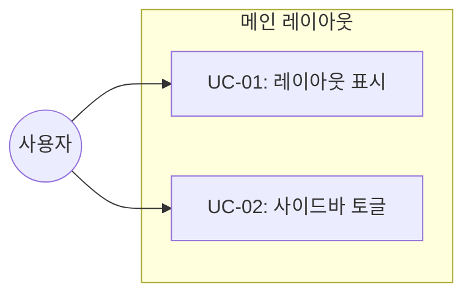

# TSK-02-01 - 메인 레이아웃 (사이드바 + 에디터 영역) 설계 문서

## 문서 정보

| 항목 | 내용 |
|------|------|
| Task ID | TSK-02-01 |
| 문서 버전 | 1.0 |
| 작성일 | 2026-01-02 |
| 상태 | 작성중 |
| 카테고리 | development |

---

## 1. 개요

### 1.1 배경 및 문제 정의

**현재 상황:**
- 에디터 컴포넌트(BlockNote)가 구현되어 있으나 레이아웃이 없음
- 사이드바 네비게이션 없이 단일 페이지만 표시 가능
- Notion과 같은 멀티 페이지 탐색이 불가능한 상태

**해결하려는 문제:**
- 좌측 사이드바 + 우측 에디터 영역의 2컬럼 레이아웃 필요
- 사이드바를 통한 페이지 네비게이션 기반 구조 필요
- 화면 공간 효율을 위한 사이드바 토글 기능 필요

### 1.2 목적 및 기대 효과

**목적:**
- Notion 스타일의 메인 레이아웃 구조 구축
- 사이드바와 에디터 영역이 분리된 2컬럼 레이아웃 제공

**기대 효과:**
- 사용자가 사이드바를 통해 페이지 간 빠른 탐색 가능
- 에디터 집중 모드를 위한 사이드바 접기 기능
- 향후 페이지 트리, 검색, 즐겨찾기 등 기능 추가를 위한 기반 마련

### 1.3 범위

**포함:**
- `src/components/layout/MainLayout.tsx` 컴포넌트 생성
- 사이드바 영역 (240px 고정 너비)
- 에디터 영역 (나머지 공간 flex-1)
- 사이드바 접기/펼치기 토글 기능
- Zustand 스토어에 사이드바 상태 관리 연동

**제외:**
- 사이드바 내부 컴포넌트 (TSK-02-02에서 구현)
- 페이지 트리 컴포넌트 (TSK-02-03에서 구현)
- 반응형 레이아웃 (TSK-03-01에서 구현)

### 1.4 참조 문서

| 문서 | 경로 | 관련 섹션 |
|------|------|----------|
| PRD | `.orchay/projects/notion-like/prd.md` | 2.3 페이지 및 워크스페이스 구조 |
| TRD | `.orchay/projects/notion-like/trd.md` | 3.1 메인 레이아웃, 2.3 레이아웃 치수, 6. 상태 관리 |

---

## 2. 사용자 분석

### 2.1 대상 사용자

| 사용자 유형 | 특성 | 주요 니즈 |
|------------|------|----------|
| 일반 사용자 | 문서 작성 및 관리 필요 | 페이지 간 빠른 탐색, 집중 모드 |
| 파워 유저 | 다수의 페이지 관리 | 효율적인 네비게이션, 키보드 단축키 |

### 2.2 사용자 페르소나

**페르소나 1: 개인 노트 사용자**
- 역할: 학생/직장인
- 목표: 여러 페이지에 걸쳐 노트를 정리하고 빠르게 탐색
- 불만: 현재 단일 페이지만 표시되어 페이지 전환 불가
- 시나리오: 사이드바에서 원하는 페이지를 클릭하여 바로 이동

---

## 3. 유즈케이스

### 3.1 유즈케이스 다이어그램



### 3.2 유즈케이스 상세

#### UC-01: 레이아웃 표시

| 항목 | 내용 |
|------|------|
| 액터 | 사용자 |
| 목적 | 2컬럼 레이아웃으로 앱을 표시 |
| 사전 조건 | 앱 접속 |
| 사후 조건 | 사이드바 + 에디터 레이아웃 표시 |
| 트리거 | 페이지 로드 |

**기본 흐름:**
1. 사용자가 앱에 접속한다
2. 시스템이 MainLayout 컴포넌트를 렌더링한다
3. 좌측에 사이드바(240px), 우측에 에디터 영역이 표시된다
4. 사용자는 두 영역을 모두 볼 수 있다

#### UC-02: 사이드바 토글

| 항목 | 내용 |
|------|------|
| 액터 | 사용자 |
| 목적 | 사이드바를 숨기거나 표시 |
| 사전 조건 | 레이아웃이 표시된 상태 |
| 사후 조건 | 사이드바 상태 변경 |
| 트리거 | 토글 버튼 클릭 |

**기본 흐름:**
1. 사용자가 사이드바 토글 버튼을 클릭한다
2. 시스템이 Zustand 스토어의 sidebarOpen 상태를 변경한다
3. 사이드바가 접히거나 펼쳐진다
4. 에디터 영역이 전체 너비를 사용하거나 원래 크기로 돌아온다

**대안 흐름:**
- 1a. 사이드바가 이미 접힌 상태:
  - 토글 버튼 클릭 시 사이드바가 펼쳐진다

---

## 4. 사용자 시나리오

### 4.1 시나리오 1: 기본 레이아웃 사용

**상황 설명:**
사용자가 앱에 처음 접속하여 기본 레이아웃을 경험하는 상황

**단계별 진행:**

| 단계 | 사용자 행동 | 시스템 반응 | 사용자 기대 |
|------|-----------|------------|------------|
| 1 | 앱 URL 접속 | 2컬럼 레이아웃 렌더링 | 좌측 사이드바, 우측 에디터 표시 |
| 2 | 사이드바 영역 확인 | 240px 너비의 사이드바 영역 | 페이지 목록이 표시될 공간 |
| 3 | 에디터 영역 확인 | 나머지 공간에 에디터 표시 | 문서 편집 가능 |

**성공 조건:**
- 사이드바와 에디터 영역이 나란히 표시됨
- 사이드바 너비가 240px로 고정됨

### 4.2 시나리오 2: 사이드바 접기

**상황 설명:**
사용자가 에디터에 집중하기 위해 사이드바를 접는 상황

**단계별 진행:**

| 단계 | 사용자 행동 | 시스템 반응 | 사용자 기대 |
|------|-----------|------------|------------|
| 1 | 토글 버튼 클릭 | 사이드바 영역 축소 | 에디터가 전체 너비 사용 |
| 2 | 다시 토글 버튼 클릭 | 사이드바 영역 복원 | 원래 레이아웃 복원 |

---

## 5. 화면 설계

### 5.1 화면 흐름도


### 5.2 화면별 상세

#### 화면 1: 메인 레이아웃 (사이드바 펼침)

**화면 목적:**
기본 2컬럼 레이아웃으로 사이드바와 에디터를 함께 표시

**진입 경로:**
- 앱 접속 시 기본 표시

**와이어프레임:**
```
┌─────────────────────────────────────────────────────────────┐
│ [Sidebar - 240px]           │        [Editor Area]          │
│ ┌─────────────────────────┐ │ ┌─────────────────────────┐   │
│ │                         │ │ │                         │   │
│ │    (사이드바 컴포넌트   │ │ │     (에디터 컴포넌트    │   │
│ │     TSK-02-02에서       │ │ │      - children)        │   │
│ │     구현 예정)          │ │ │                         │   │
│ │                         │ │ │                         │   │
│ │                         │ │ │                         │   │
│ │                         │ │ │                         │   │
│ │                         │ │ │                         │   │
│ │                         │ │ │                         │   │
│ └─────────────────────────┘ │ └─────────────────────────┘   │
└─────────────────────────────────────────────────────────────┘
```

**화면 요소 설명:**

| 영역 | 설명 | 사용자 인터랙션 |
|------|------|----------------|
| 사이드바 | 240px 고정, 배경색 #F7F6F3 | 내부 컨텐츠 클릭 가능 |
| 토글 버튼 | 사이드바 상단 또는 호버 시 표시 | 클릭 시 사이드바 토글 |
| 에디터 영역 | flex-1, 스크롤 가능 | 에디터 편집 |
| 구분선 | 사이드바 우측 border | 영역 구분 |

#### 화면 2: 메인 레이아웃 (사이드바 접힘)

**화면 목적:**
에디터 집중 모드로 전체 화면 활용

**와이어프레임:**
```
┌─────────────────────────────────────────────────────────────┐
│ [≡]│              [Editor Area - Full Width]                │
│    │ ┌───────────────────────────────────────────────────┐  │
│    │ │                                                   │  │
│    │ │            (에디터 컴포넌트 - children)           │  │
│    │ │                                                   │  │
│    │ │                                                   │  │
│    │ │                                                   │  │
│    │ └───────────────────────────────────────────────────┘  │
└─────────────────────────────────────────────────────────────┘
```

**화면 요소 설명:**

| 영역 | 설명 | 사용자 인터랙션 |
|------|------|----------------|
| 토글 버튼 | 좌측 상단에 표시 | 클릭 시 사이드바 펼침 |
| 에디터 영역 | 전체 너비 사용 | 에디터 편집 |

---

## 6. 인터랙션 설계

### 6.1 사용자 액션과 피드백

| 사용자 액션 | 즉각 피드백 | 결과 피드백 | 에러 피드백 |
|------------|-----------|------------|------------|
| 토글 버튼 클릭 | 버튼 hover 효과 | 사이드바 접힘/펼침 애니메이션 | - |
| 토글 버튼 호버 | 배경색 변경 (#EFEFEF) | - | - |

### 6.2 상태별 화면 변화

| 상태 | 화면 표시 | 전환 애니메이션 |
|------|----------|----------------|
| sidebarOpen: true | 사이드바 240px 표시 | 슬라이드 인 |
| sidebarOpen: false | 사이드바 숨김 (0px) | 슬라이드 아웃 |

### 6.3 키보드/접근성

| 기능 | 키보드 단축키 | 접근성 |
|------|-------------|--------|
| 사이드바 토글 | (향후 구현: Cmd+\) | aria-expanded 속성 |

---

## 7. 데이터 요구사항

### 7.1 필요한 데이터

| 데이터 | 설명 | 출처 | 용도 |
|--------|------|------|------|
| sidebarOpen | 사이드바 열림 상태 | Zustand 스토어 | 레이아웃 상태 관리 |
| children | 에디터 영역 콘텐츠 | React props | 에디터 컴포넌트 렌더링 |

### 7.2 Zustand 스토어 연동

```typescript
// 기존 useAppStore에서 사용
interface AppState {
  sidebarOpen: boolean;
  toggleSidebar: () => void;
}
```

---

## 8. 비즈니스 규칙

### 8.1 핵심 규칙

| 규칙 ID | 규칙 설명 | 적용 상황 | 예외 |
|---------|----------|----------|------|
| BR-01 | 사이드바 너비는 240px 고정 | 펼침 상태 | 반응형 레이아웃 시 변경 가능 |
| BR-02 | 사이드바 상태는 세션 동안 유지 | 토글 후 | 새로고침 시 초기화 (기본: 열림) |
| BR-03 | 에디터 영역은 항상 표시 | 모든 상태 | - |

### 8.2 규칙 상세 설명

**BR-01: 사이드바 너비 고정**

설명: Notion 스타일을 따라 사이드바 너비를 240px로 고정합니다. TRD 2.3 레이아웃 치수에 정의된 값입니다.

**BR-02: 사이드바 상태 유지**

설명: 사용자가 사이드바를 접으면 페이지 이동 시에도 상태가 유지됩니다. 단, 새로고침 시 기본값(열림)으로 초기화됩니다.

---

## 9. 에러 처리

### 9.1 예상 에러 상황

| 상황 | 원인 | 사용자 메시지 | 복구 방법 |
|------|------|--------------|----------|
| - | 이 컴포넌트는 에러 상황이 거의 없음 | - | - |

---

## 10. 연관 문서

| 문서 | 경로 | 용도 |
|------|------|------|
| 요구사항 추적 매트릭스 | `025-traceability-matrix.md` | PRD → 설계 → 테스트 양방향 추적 |
| 테스트 명세서 | `026-test-specification.md` | 단위/E2E/매뉴얼 테스트 상세 정의 |

---

## 11. 구현 범위

### 11.1 영향받는 영역

| 영역 | 변경 내용 | 영향도 |
|------|----------|--------|
| src/components/layout/MainLayout.tsx | 신규 생성 | 높음 |
| src/lib/store.ts | sidebarOpen 상태 활용 (이미 정의됨) | 낮음 |
| src/app/layout.tsx 또는 page.tsx | MainLayout 적용 | 중간 |

### 11.2 의존성

| 의존 항목 | 이유 | 상태 |
|----------|------|------|
| TSK-01-99 | WP-01 통합 검증 완료 필요 | 진행중 |
| TSK-00-05 | Zustand 스토어 설정 | 완료 필요 |

### 11.3 제약 사항

| 제약 | 설명 | 대응 방안 |
|------|------|----------|
| 반응형 미적용 | 이번 Task에서는 데스크톱만 고려 | TSK-03-01에서 반응형 구현 |

---

## 12. 상세 설계

### 12.1 컴포넌트 구조

```tsx
// src/components/layout/MainLayout.tsx

"use client";

import { useAppStore } from "@/lib/store";
import { Menu } from "lucide-react";

interface MainLayoutProps {
  sidebar?: React.ReactNode;  // 사이드바 영역에 렌더링할 컴포넌트
  children: React.ReactNode;  // 에디터 영역
}

export function MainLayout({ sidebar, children }: MainLayoutProps) {
  const { sidebarOpen, toggleSidebar } = useAppStore();

  return (
    <div className="flex h-screen">
      {/* 사이드바 영역 */}
      {sidebarOpen && (
        <aside className="w-[240px] h-screen bg-[#F7F6F3] flex flex-col border-r border-[#E9E9E7] flex-shrink-0">
          {sidebar}
        </aside>
      )}

      {/* 에디터 영역 */}
      <main className="flex-1 h-screen overflow-auto relative">
        {/* 사이드바 접힘 시 토글 버튼 */}
        {!sidebarOpen && (
          <button
            onClick={toggleSidebar}
            className="absolute top-3 left-3 p-1.5 rounded hover:bg-[#EFEFEF] transition-colors z-10"
            aria-label="사이드바 열기"
          >
            <Menu className="w-5 h-5 text-[#787774]" />
          </button>
        )}
        {children}
      </main>
    </div>
  );
}
```

### 12.2 스타일 규격

| 요소 | CSS | 값 |
|------|-----|-----|
| 사이드바 너비 | width | 240px |
| 사이드바 배경 | background-color | #F7F6F3 |
| 사이드바 테두리 | border-right | 1px solid #E9E9E7 |
| 에디터 영역 | flex | 1 |
| 토글 버튼 호버 | background-color | #EFEFEF |
| 토글 아이콘 색상 | color | #787774 |

### 12.3 Zustand 스토어 활용

```typescript
// src/lib/store.ts (기존 코드에 이미 정의됨)
interface AppState {
  sidebarOpen: boolean;
  toggleSidebar: () => void;
  // ... 기타 상태
}

export const useAppStore = create<AppState>((set) => ({
  sidebarOpen: true,
  toggleSidebar: () => set((state) => ({ sidebarOpen: !state.sidebarOpen })),
  // ...
}));
```

---

## 13. 체크리스트

### 13.1 설계 완료 확인

- [x] 문제 정의 및 목적 명확화
- [x] 사용자 분석 완료
- [x] 유즈케이스 정의 완료
- [x] 사용자 시나리오 작성 완료
- [x] 화면 설계 완료 (와이어프레임)
- [x] 인터랙션 설계 완료
- [x] 데이터 요구사항 정의 완료
- [x] 비즈니스 규칙 정의 완료
- [x] 에러 처리 정의 완료

### 13.2 연관 문서 작성

- [ ] 요구사항 추적 매트릭스 작성 (→ `025-traceability-matrix.md`)
- [ ] 테스트 명세서 작성 (→ `026-test-specification.md`)

### 13.3 구현 준비

- [x] 구현 우선순위 결정
- [x] 의존성 확인 완료
- [x] 제약 사항 검토 완료

---

## 변경 이력

| 버전 | 일자 | 작성자 | 변경 내용 |
|------|------|--------|----------|
| 1.0 | 2026-01-02 | Claude | 최초 작성 |
