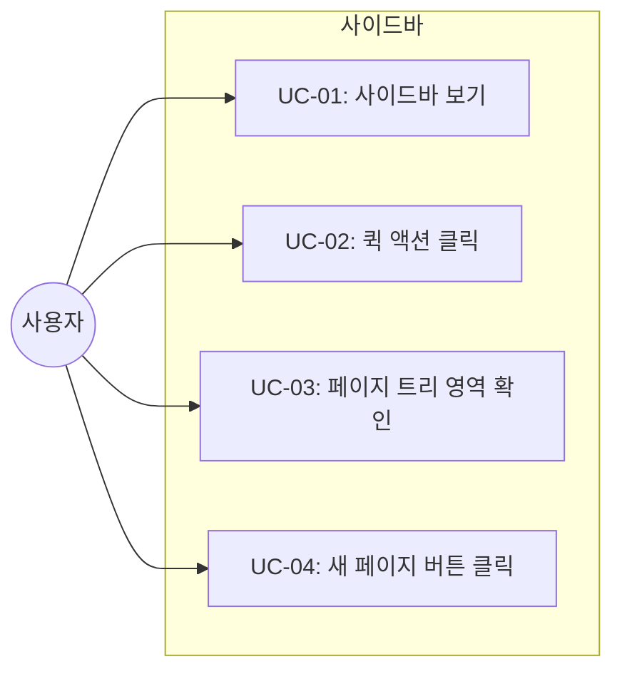
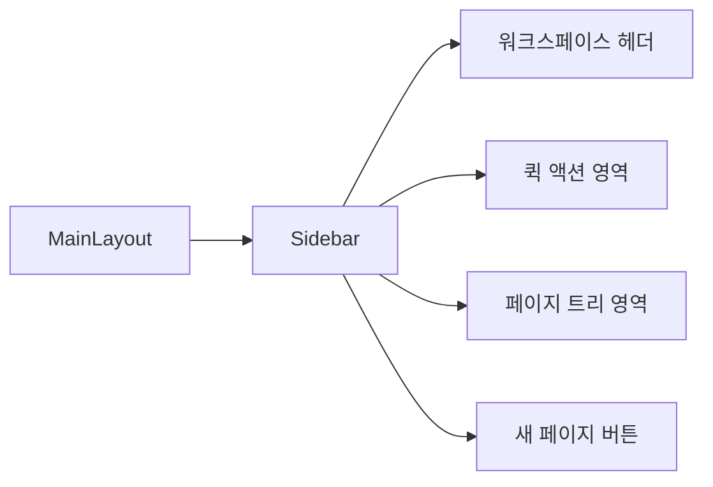

# TSK-02-02 - 사이드바 컴포넌트 설계 문서

## 문서 정보

| 항목 | 내용 |
|------|------|
| Task ID | TSK-02-02 |
| 문서 버전 | 1.0 |
| 작성일 | 2026-01-02 |
| 상태 | 작성중 |
| 카테고리 | development |

---

## 1. 개요

### 1.1 배경 및 문제 정의

**현재 상황:**
- TSK-02-01에서 MainLayout 컴포넌트가 구현되어 사이드바 + 에디터 2컬럼 레이아웃 구조가 완성됨
- 사이드바 영역이 비어있어 실제 네비게이션 기능이 없음

**해결하려는 문제:**
- 사이드바 내부 컴포넌트가 없어 워크스페이스 탐색 불가
- 검색, 설정 등 퀵 액션에 접근할 수 없음
- 페이지 트리 영역이 준비되지 않아 페이지 네비게이션 불가

### 1.2 목적 및 기대 효과

**목적:**
- Notion 스타일의 사이드바 UI 컴포넌트 구현
- 워크스페이스 헤더, 퀵 액션, 페이지 트리 영역, 새 페이지 버튼의 레이아웃 구성

**기대 효과:**
- 사용자가 사이드바를 통해 워크스페이스를 탐색할 수 있는 UI 기반 마련
- 향후 TSK-02-03 페이지 트리 컴포넌트와 연동 가능한 구조 확보
- Notion과 유사한 사용자 경험 제공

### 1.3 범위

**포함:**
- `src/components/layout/Sidebar.tsx` 컴포넌트 생성
- 워크스페이스 헤더 영역 (워크스페이스 이름 표시)
- 퀵 액션 영역 (검색, 설정 버튼 - UI만)
- 페이지 트리 영역 (빈 컨테이너 - TSK-02-03에서 구현)
- 새 페이지 버튼 (UI만)

**제외:**
- 페이지 트리 실제 렌더링 (TSK-02-03)
- 검색 기능 구현 (별도 Task)
- 설정 모달 구현 (별도 Task)
- 새 페이지 생성 API 연동 (별도 Task)

### 1.4 참조 문서

| 문서 | 경로 | 관련 섹션 |
|------|------|----------|
| TRD | `.orchay/projects/notion-like/trd.md` | 3.2 사이드바 컴포넌트 |
| PRD | `.orchay/projects/notion-like/prd.md` | 2.3 페이지 및 워크스페이스 구조 |

---

## 2. 사용자 분석

### 2.1 대상 사용자

| 사용자 유형 | 특성 | 주요 니즈 |
|------------|------|----------|
| 문서 작성자 | 페이지를 만들고 편집하는 일반 사용자 | 빠른 페이지 탐색, 새 페이지 생성 |
| 워크스페이스 관리자 | 워크스페이스 설정을 관리하는 사용자 | 설정 접근, 전체 페이지 구조 파악 |

### 2.2 사용자 페르소나

**페르소나 1: 김개발**
- 역할: 프론트엔드 개발자
- 목표: 프로젝트 문서를 체계적으로 관리하고 빠르게 탐색
- 불만: 사이드바 없이는 페이지를 찾기 어려움
- 시나리오: 작업 중 다른 페이지를 참조해야 할 때 사이드바로 빠르게 이동

---

## 3. 유즈케이스

### 3.1 유즈케이스 다이어그램



### 3.2 유즈케이스 상세

#### UC-01: 사이드바 보기

| 항목 | 내용 |
|------|------|
| 액터 | 문서 작성자 |
| 목적 | 사이드바 UI를 확인하고 각 영역 인식 |
| 사전 조건 | 애플리케이션이 로드됨 |
| 사후 조건 | 사이드바가 화면에 표시됨 |
| 트리거 | 페이지 진입 |

**기본 흐름:**
1. 사용자가 애플리케이션에 접속한다
2. 시스템이 MainLayout을 렌더링한다
3. 사이드바 컴포넌트가 좌측 240px 영역에 표시된다
4. 사용자가 워크스페이스 헤더, 퀵 액션, 페이지 트리 영역, 새 페이지 버튼을 확인한다

#### UC-02: 퀵 액션 클릭

| 항목 | 내용 |
|------|------|
| 액터 | 문서 작성자 |
| 목적 | 검색 또는 설정 기능에 접근 |
| 사전 조건 | 사이드바가 표시됨 |
| 사후 조건 | 해당 기능이 활성화됨 (MVP에서는 콘솔 로그) |
| 트리거 | 퀵 액션 버튼 클릭 |

**기본 흐름:**
1. 사용자가 검색 버튼을 클릭한다
2. 시스템이 호버 효과를 표시한다
3. 클릭 시 console.log로 이벤트 확인 (MVP)

#### UC-04: 새 페이지 버튼 클릭

| 항목 | 내용 |
|------|------|
| 액터 | 문서 작성자 |
| 목적 | 새 페이지 생성 시작 |
| 사전 조건 | 사이드바가 표시됨 |
| 사후 조건 | 새 페이지 생성 프로세스 시작 (MVP에서는 콘솔 로그) |
| 트리거 | 새 페이지 버튼 클릭 |

**기본 흐름:**
1. 사용자가 사이드바 하단의 "New page" 버튼을 클릭한다
2. 시스템이 버튼 클릭 이벤트를 처리한다
3. MVP에서는 콘솔에 로그 출력

---

## 4. 사용자 시나리오

### 4.1 시나리오 1: 사이드바 기본 탐색

**상황 설명:**
사용자가 Orchay Notes에 접속하여 사이드바를 통해 워크스페이스를 탐색하려 한다.

**단계별 진행:**

| 단계 | 사용자 행동 | 시스템 반응 | 사용자 기대 |
|------|-----------|------------|------------|
| 1 | 애플리케이션 접속 | 사이드바가 표시됨 | 좌측에 사이드바가 보임 |
| 2 | 워크스페이스 헤더 확인 | 워크스페이스 이름 표시 | "Orchay Notes" 확인 |
| 3 | 검색 버튼에 마우스 오버 | 호버 효과 (bg-[#EFEFEF]) | 버튼이 하이라이트됨 |
| 4 | 페이지 트리 영역 스크롤 | 빈 영역 또는 플레이스홀더 | 향후 페이지 목록이 표시될 영역 인식 |

**성공 조건:**
- 사이드바의 모든 영역이 TRD 디자인 시스템에 맞게 표시됨
- 호버 효과가 정상 동작함

---

## 5. 화면 설계

### 5.1 화면 흐름도



### 5.2 화면별 상세

#### Sidebar 컴포넌트

**화면 목적:**
워크스페이스 네비게이션 및 퀵 액션 제공

**진입 경로:**
- 애플리케이션 로드 시 자동 표시
- MainLayout의 좌측 영역

**와이어프레임:**
```
┌─────────────────────────────┐
│  🏠 Orchay Notes         ▾  │  ← 워크스페이스 헤더
├─────────────────────────────┤
│  🔍 Search             ⌘K  │  ← 퀵 액션
│  📥 Updates                │
│  ⚙️ Settings & members     │
├─────────────────────────────┤
│  Favorites                  │  ← 페이지 트리 영역
│    (빈 영역 - TSK-02-03)    │     섹션 헤더만 표시
│                             │
│  Private                    │
│    (빈 영역 - TSK-02-03)    │
│                             │
│                             │
│                             │
├─────────────────────────────┤
│  ➕ New page                │  ← 새 페이지 버튼
└─────────────────────────────┘
```

**화면 요소 설명:**

| 영역 | 설명 | 사용자 인터랙션 |
|------|------|----------------|
| 워크스페이스 헤더 | 워크스페이스 이름과 드롭다운 아이콘 | 클릭 시 워크스페이스 메뉴 (향후) |
| 검색 | 검색 기능 진입점 | 클릭 시 검색 모달 (향후) |
| Updates | 업데이트/알림 확인 | 클릭 시 알림 패널 (향후) |
| Settings | 설정 및 멤버 관리 | 클릭 시 설정 모달 (향후) |
| Favorites | 즐겨찾기 페이지 섹션 | TSK-02-03에서 트리 렌더링 |
| Private | 개인 페이지 섹션 | TSK-02-03에서 트리 렌더링 |
| New page | 새 페이지 생성 버튼 | 클릭 시 페이지 생성 (향후) |

### 5.3 컴포넌트 구조

```
Sidebar.tsx
├── WorkspaceHeader (워크스페이스 이름 + 드롭다운)
├── QuickActions (검색, Updates, Settings)
│   └── SidebarItem (재사용 가능한 아이템 컴포넌트)
├── PageTreeArea (페이지 트리 컨테이너)
│   ├── SectionHeader (Favorites)
│   ├── (PageTree - TSK-02-03)
│   ├── SectionHeader (Private)
│   └── (PageTree - TSK-02-03)
└── NewPageButton (새 페이지 버튼)
```

### 5.4 스타일 명세 (TRD 기준)

| 요소 | Tailwind 클래스 |
|------|----------------|
| 사이드바 컨테이너 | `w-[240px] h-screen bg-[#F7F6F3] flex flex-col border-r border-[#E9E9E7]` |
| 워크스페이스 헤더 | `px-3 py-3 flex items-center justify-between hover:bg-[#EFEFEF] cursor-pointer` |
| 퀵 액션 영역 | `px-2 py-1` |
| SidebarItem | `w-full flex items-center gap-2 px-3 py-1.5 text-[14px] text-[#37352F] rounded-[4px] hover:bg-[#EFEFEF] transition-colors duration-[20ms]` |
| 아이콘 색상 | `text-[#787774]` |
| 단축키 텍스트 | `text-[12px] text-[#B4B4B3]` |
| 섹션 헤더 | `px-3 py-1 text-[12px] font-medium text-[#787774] uppercase tracking-wide` |
| 새 페이지 버튼 | `p-2 border-t border-[#E9E9E7]` |

---

## 6. 인터랙션 설계

### 6.1 사용자 액션과 피드백

| 사용자 액션 | 즉각 피드백 | 결과 피드백 |
|------------|-----------|------------|
| 퀵 액션 호버 | `bg-[#EFEFEF]` 배경색 변경 | - |
| 퀵 액션 클릭 | 버튼 눌림 효과 | 콘솔 로그 (MVP) |
| 새 페이지 버튼 호버 | `bg-[#EFEFEF]` 배경색 변경 | - |
| 새 페이지 버튼 클릭 | 버튼 눌림 효과 | 콘솔 로그 (MVP) |

### 6.2 상태별 화면 변화

| 상태 | 화면 표시 |
|------|----------|
| 초기 로드 | 모든 영역 정상 표시 |
| 페이지 트리 로딩 | 빈 영역 (TSK-02-03에서 처리) |

### 6.3 호버 트랜지션

```css
transition-colors duration-[20ms] ease-in
```

---

## 7. 데이터 요구사항

### 7.1 필요한 데이터

| 데이터 | 설명 | 출처 | 용도 |
|--------|------|------|------|
| 워크스페이스 이름 | 표시용 이름 | 하드코딩 (MVP) | 헤더 표시 |

> MVP 단계에서는 외부 데이터 없이 정적 UI만 구현

---

## 8. 비즈니스 규칙

### 8.1 핵심 규칙

| 규칙 ID | 규칙 설명 | 적용 상황 |
|---------|----------|----------|
| BR-01 | 사이드바는 항상 240px 고정 너비 | 모든 화면 크기 |
| BR-02 | 퀵 액션은 항상 상단에 고정 | 스크롤과 무관 |
| BR-03 | 새 페이지 버튼은 하단에 고정 | 페이지 트리 영역만 스크롤 |

---

## 9. 에러 처리

MVP 단계에서는 별도 에러 처리 없음. UI 렌더링만 수행.

---

## 10. 구현 범위

### 10.1 영향받는 영역

| 영역 | 변경 내용 | 영향도 |
|------|----------|--------|
| MainLayout | Sidebar 컴포넌트 import 및 배치 | 낮음 |
| 새 파일 생성 | `src/components/layout/Sidebar.tsx` | 해당 없음 |

### 10.2 의존성

| 의존 항목 | 이유 | 상태 |
|----------|------|------|
| TSK-02-01 | MainLayout 컴포넌트 필요 | 진행중 |
| lucide-react | 아이콘 컴포넌트 | 설치됨 |

### 10.3 제약 사항

| 제약 | 설명 | 대응 방안 |
|------|------|----------|
| UI 라이브러리 금지 | TRD 가이드라인 | Tailwind CSS만 사용 |
| 하드코딩 | MVP 단계 | 향후 API 연동으로 교체 |

---

## 11. 파일 구조

```
src/components/layout/
└── Sidebar.tsx          # 사이드바 메인 컴포넌트
                         # (SidebarItem, SectionHeader 등 내부 정의)
```

---

## 12. 체크리스트

### 12.1 설계 완료 확인

- [x] 문제 정의 및 목적 명확화
- [x] 사용자 분석 완료
- [x] 유즈케이스 정의 완료
- [x] 사용자 시나리오 작성 완료
- [x] 화면 설계 완료 (와이어프레임)
- [x] 인터랙션 설계 완료
- [x] 데이터 요구사항 정의 완료
- [x] 비즈니스 규칙 정의 완료

### 12.2 구현 준비

- [x] 구현 우선순위 결정 (TSK-02-01 이후)
- [x] 의존성 확인 완료
- [x] 제약 사항 검토 완료

---

## 변경 이력

| 버전 | 일자 | 작성자 | 변경 내용 |
|------|------|--------|----------|
| 1.0 | 2026-01-02 | Claude | 최초 작성 |
