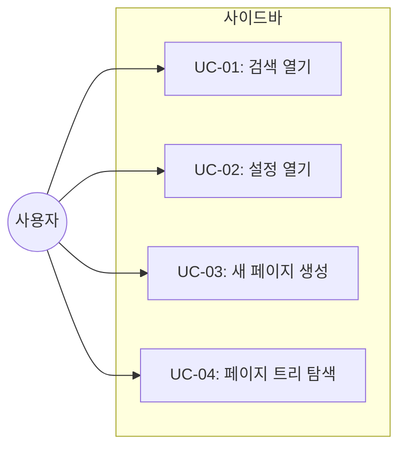
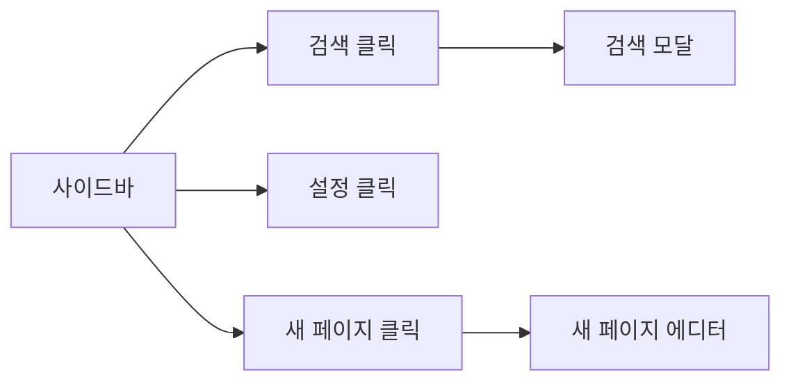
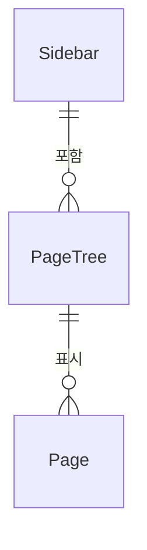

# TSK-02-02 - 사이드바 컴포넌트 설계 문서

## 문서 정보

| 항목 | 내용 |
|------|------|
| Task ID | TSK-02-02 |
| 문서 버전 | 1.0 |
| 작성일 | 2026-01-02 |
| 상태 | 작성중 |
| 카테고리 | development |

---

## 1. 개요

### 1.1 배경 및 문제 정의

**현재 상황:**
- TSK-02-01에서 메인 레이아웃(사이드바 + 에디터 2컬럼)이 구현됨
- 사이드바 영역은 240px 고정폭으로 할당되어 있으나 내부 콘텐츠가 없음
- 사용자가 워크스페이스를 탐색하고 페이지를 관리할 수 있는 인터페이스 필요

**해결하려는 문제:**
- Notion 스타일의 사이드바 UI 부재
- 워크스페이스 정보 표시 불가
- 퀵 액션(검색, 설정) 접근 경로 없음
- 새 페이지 생성 버튼 부재

### 1.2 목적 및 기대 효과

**목적:**
- Notion 스타일의 사이드바 컴포넌트 구현
- 워크스페이스 헤더, 퀵 액션, 페이지 트리 영역, 새 페이지 버튼을 포함하는 완전한 사이드바 UI 제공

**기대 효과:**
- 사용자가 검색, 설정 등 퀵 액션에 빠르게 접근 가능
- 페이지 트리 영역을 통해 문서 구조 파악 용이
- 새 페이지 생성 버튼으로 빠른 문서 생성 가능
- Notion과 유사한 사용자 경험 제공

### 1.3 범위

**포함:**
- `src/components/layout/Sidebar.tsx` 컴포넌트 생성
- 워크스페이스 헤더 (Workspace Switcher)
- 퀵 액션 (검색 - ⌘K, 설정)
- 페이지 트리 영역 (Favorites, Private 섹션)
- 새 페이지 버튼

**제외:**
- 페이지 트리 아이템 컴포넌트 (TSK-02-03에서 구현)
- 실제 검색 기능 (TSK-02-07에서 구현)
- 실제 설정 기능 (별도 Task)

### 1.4 참조 문서

| 문서 | 경로 | 관련 섹션 |
|------|------|----------|
| TRD | `.orchay/projects/notion-like/trd.md` | 3.2 사이드바 컴포넌트 |
| PRD | `.orchay/projects/notion-like/prd.md` | 2.3.1 페이지 구조 |

---

## 2. 사용자 분석

### 2.1 대상 사용자

| 사용자 유형 | 특성 | 주요 니즈 |
|------------|------|----------|
| 일반 사용자 | 문서 작성/편집 | 빠른 페이지 탐색, 새 페이지 생성 |
| 파워 유저 | 키보드 단축키 선호 | ⌘K로 빠른 검색 접근 |

### 2.2 사용자 페르소나

**페르소나 1: 김문서**
- 역할: 개인 사용자
- 목표: 여러 페이지를 효율적으로 관리하고 빠르게 탐색
- 불만: 복잡한 문서 구조에서 원하는 페이지 찾기 어려움
- 시나리오: 사이드바에서 즐겨찾기 페이지를 확인하고 새 페이지 생성

---

## 3. 유즈케이스

### 3.1 유즈케이스 다이어그램



### 3.2 유즈케이스 상세

#### UC-01: 검색 열기

| 항목 | 내용 |
|------|------|
| 액터 | 사용자 |
| 목적 | 검색 모달을 열어 페이지 검색 |
| 사전 조건 | 애플리케이션 로드 완료 |
| 사후 조건 | 검색 모달 표시 |
| 트리거 | 검색 버튼 클릭 또는 ⌘K |

**기본 흐름:**
1. 사용자가 사이드바의 "Search" 버튼을 클릭하거나 ⌘K를 누른다
2. 시스템이 검색 모달을 표시한다

**참고:** 검색 모달 구현은 TSK-02-07에서 진행

#### UC-02: 설정 열기

| 항목 | 내용 |
|------|------|
| 액터 | 사용자 |
| 목적 | 설정 화면 접근 |
| 사전 조건 | 애플리케이션 로드 완료 |
| 사후 조건 | 설정 화면/모달 표시 |
| 트리거 | 설정 버튼 클릭 |

**기본 흐름:**
1. 사용자가 "Settings & members" 버튼을 클릭한다
2. 시스템이 설정 관련 UI를 표시한다 (MVP에서는 placeholder)

#### UC-03: 새 페이지 생성

| 항목 | 내용 |
|------|------|
| 액터 | 사용자 |
| 목적 | 새 루트 페이지 생성 |
| 사전 조건 | 애플리케이션 로드 완료 |
| 사후 조건 | 새 페이지 생성 및 에디터 이동 |
| 트리거 | "+ New page" 버튼 클릭 |

**기본 흐름:**
1. 사용자가 사이드바 하단의 "+ New page" 버튼을 클릭한다
2. 시스템이 API를 통해 새 페이지를 생성한다
3. 새 페이지 에디터로 이동한다
4. 사이드바에 새 페이지가 표시된다

**참고:** 실제 페이지 생성 API 연동은 TSK-02-04에서 구현

---

## 4. 사용자 시나리오

### 4.1 시나리오 1: 사이드바를 통한 페이지 관리

**상황 설명:**
사용자가 앱을 열고 사이드바를 통해 페이지를 탐색하고 새 페이지를 생성한다.

**단계별 진행:**

| 단계 | 사용자 행동 | 시스템 반응 | 사용자 기대 |
|------|-----------|------------|------------|
| 1 | 앱 열기 | 사이드바 표시 | 워크스페이스 이름, 퀵 액션, 페이지 트리 보임 |
| 2 | Favorites 섹션 확인 | 즐겨찾기 페이지 목록 표시 | 자주 사용하는 페이지 빠르게 찾기 |
| 3 | "+ New page" 클릭 | 새 페이지 생성 | 새 페이지 에디터로 이동 |

**성공 조건:**
- 사이드바의 모든 영역이 올바르게 렌더링됨
- 퀵 액션 버튼들이 호버 효과와 함께 표시됨

---

## 5. 화면 설계

### 5.1 화면 흐름도



### 5.2 화면별 상세

#### 사이드바 컴포넌트

**화면 목적:**
사용자가 워크스페이스를 탐색하고, 퀵 액션에 접근하며, 페이지 트리를 확인하고, 새 페이지를 생성할 수 있는 네비게이션 영역

**진입 경로:**
- 애플리케이션 로드 시 자동 표시
- 메인 레이아웃의 왼쪽 영역

**와이어프레임 (TRD 3.1 기준):**
```
┌─────────────────────────────┐
│ 🏠 Workspace Name        ▾  │  ← 워크스페이스 스위처
├─────────────────────────────┤
│ 🔍 Search             ⌘K   │  ← 퀵 액션
│ 📥 Updates                  │
│ ⚙️ Settings & members       │
├─────────────────────────────┤
│ Favorites                   │  ← 섹션 헤더
│   └─ ⭐ Important          │  ← PageTree (Placeholder)
├─────────────────────────────┤
│ Private                     │  ← 섹션 헤더
│   ├─ 📄 Page 1             │  ← PageTree (Placeholder)
│   ├─ 📁 Folder              │
│   │   └─ 📄 Subpage        │
│   └─ 📄 Page 2             │
├─────────────────────────────┤
│ ➕ New page                 │  ← 새 페이지 버튼
└─────────────────────────────┘
```

**화면 요소 설명:**

| 영역 | 설명 | 사용자 인터랙션 |
|------|------|----------------|
| 워크스페이스 스위처 | 현재 워크스페이스 이름 표시 | 클릭 시 워크스페이스 전환 (MVP에서는 placeholder) |
| 퀵 액션 | 검색, 업데이트, 설정 접근 | 호버 시 배경색 변경, 클릭 시 해당 기능 |
| 섹션 구분선 | Favorites/Private 영역 구분 | - |
| Favorites 섹션 | 즐겨찾기 페이지 표시 | PageTree 컴포넌트 렌더링 영역 |
| Private 섹션 | 개인 페이지 표시 | PageTree 컴포넌트 렌더링 영역 |
| 새 페이지 버튼 | 루트 페이지 생성 | 클릭 시 새 페이지 생성 |

**스타일 명세 (TRD 기준):**

| 요소 | 스타일 |
|------|--------|
| 사이드바 컨테이너 | `w-[240px] h-screen bg-[#F7F6F3] border-r border-[#E9E9E7]` |
| 퀵 액션 버튼 | `hover:bg-[#EFEFEF]` 호버 효과 |
| 섹션 헤더 | `text-[12px] text-[#787774] font-medium` |
| 새 페이지 버튼 | 하단 고정, `border-t border-[#E9E9E7]` |

---

## 6. 인터랙션 설계

### 6.1 사용자 액션과 피드백

| 사용자 액션 | 즉각 피드백 | 결과 피드백 | 에러 피드백 |
|------------|-----------|------------|------------|
| 버튼 호버 | `bg-[#EFEFEF]` 배경 | - | - |
| 검색 버튼 클릭 | 버튼 눌림 효과 | 검색 모달 열림 | - |
| 새 페이지 클릭 | 버튼 눌림 효과 | 새 페이지 에디터 이동 | 생성 실패 시 토스트 |

### 6.2 상태별 화면 변화

| 상태 | 화면 표시 | 사용자 안내 |
|------|----------|------------|
| 초기 로딩 | 사이드바 스켈레톤 | - |
| 페이지 없음 | 빈 Private 섹션 | "새 페이지를 추가해보세요" |
| 정상 표시 | 모든 영역 렌더링 | - |

### 6.3 키보드/접근성

| 기능 | 키보드 단축키 | 스크린 리더 안내 |
|------|-------------|-----------------|
| 검색 열기 | ⌘K (Cmd+K) | "검색 열기" |
| 새 페이지 | - | "새 페이지 생성" |

---

## 7. 데이터 요구사항

### 7.1 필요한 데이터

| 데이터 | 설명 | 출처 | 용도 |
|--------|------|------|------|
| 워크스페이스명 | 현재 워크스페이스 이름 | 하드코딩 (MVP) | 헤더 표시 |
| 페이지 목록 | 트리 구조 페이지 | API GET /api/pages | PageTree 렌더링 |

### 7.2 데이터 관계



---

## 8. 비즈니스 규칙

### 8.1 핵심 규칙

| 규칙 ID | 규칙 설명 | 적용 상황 | 예외 |
|---------|----------|----------|------|
| BR-01 | Favorites 섹션은 `is_favorite=true` 페이지만 표시 | 페이지 목록 렌더링 시 | 없음 |
| BR-02 | Private 섹션은 모든 루트 페이지 표시 | 페이지 목록 렌더링 시 | 즐겨찾기 페이지 제외 |

---

## 9. 에러 처리

### 9.1 예상 에러 상황

| 상황 | 원인 | 사용자 메시지 | 복구 방법 |
|------|------|--------------|----------|
| 페이지 생성 실패 | API 오류 | "페이지를 생성할 수 없습니다" | 재시도 버튼 |
| 페이지 목록 로드 실패 | 네트워크 오류 | "페이지 목록을 불러올 수 없습니다" | 새로고침 안내 |

### 9.2 에러 표시 방식

| 에러 유형 | 표시 위치 | 표시 방법 |
|----------|----------|----------|
| API 오류 | 화면 상단 | 토스트 알림 |

---

## 10. 연관 문서

| 문서 | 경로 | 용도 |
|------|------|------|
| 요구사항 추적 매트릭스 | `025-traceability-matrix.md` | PRD → 설계 → 테스트 추적 |
| 테스트 명세서 | `026-test-specification.md` | 단위/E2E 테스트 정의 |

---

## 11. 구현 범위

### 11.1 영향받는 영역

| 영역 | 변경 내용 | 영향도 |
|------|----------|--------|
| `src/components/layout/Sidebar.tsx` | 신규 생성 | 높음 |
| `src/components/layout/MainLayout.tsx` | Sidebar 임포트 | 낮음 |

### 11.2 의존성

| 의존 항목 | 이유 | 상태 |
|----------|------|------|
| TSK-02-01 (메인 레이아웃) | 사이드바 영역 제공 | 완료 필요 |
| TSK-01-99 (WP-01 통합 검증) | 에디터 기능 의존 | 완료 필요 |

### 11.3 제약 사항

| 제약 | 설명 | 대응 방안 |
|------|------|----------|
| UI 라이브러리 금지 | TRD 가이드라인 | Tailwind CSS만 사용 |

---

## 12. 상세 구현 명세

### 12.1 컴포넌트 구조

```typescript
// src/components/layout/Sidebar.tsx
export function Sidebar() {
  return (
    <aside className="w-[240px] h-screen bg-[#F7F6F3] flex flex-col border-r border-[#E9E9E7]">
      {/* 워크스페이스 스위처 */}
      <WorkspaceSwitcher />

      {/* 퀵 액션 */}
      <div className="px-2 py-1">
        <SidebarItem icon={<Search />} label="Search" shortcut="⌘K" />
        <SidebarItem icon={<Inbox />} label="Updates" />
        <SidebarItem icon={<Settings />} label="Settings & members" />
      </div>

      <Divider />

      {/* 페이지 트리 */}
      <div className="flex-1 overflow-y-auto px-2">
        <SectionHeader title="Favorites" />
        <PageTree filter="favorites" />

        <SectionHeader title="Private" />
        <PageTree filter="private" />
      </div>

      {/* 새 페이지 버튼 */}
      <div className="p-2 border-t border-[#E9E9E7]">
        <NewPageButton />
      </div>
    </aside>
  );
}
```

### 12.2 하위 컴포넌트 명세

#### WorkspaceSwitcher
- 워크스페이스 아이콘 + 이름 표시
- 드롭다운 화살표 (MVP에서는 기능 없음)
- 호버 시 `bg-[#EFEFEF]` 배경

#### SidebarItem
```typescript
interface SidebarItemProps {
  icon: React.ReactNode;
  label: string;
  shortcut?: string;
  onClick?: () => void;
}
```
- 아이콘(20x20), 라벨, 단축키 표시
- 호버 시 배경색 변경

#### SectionHeader
```typescript
interface SectionHeaderProps {
  title: string;
}
```
- 섹션 제목 표시
- `text-[12px] text-[#787774] uppercase`

#### NewPageButton
- "+ New page" 텍스트 + 아이콘
- 클릭 시 새 페이지 생성 (TSK-02-04에서 API 연동)

### 12.3 스타일 명세

| 컴포넌트 | Tailwind 클래스 |
|----------|----------------|
| Sidebar 컨테이너 | `w-[240px] h-screen bg-[#F7F6F3] flex flex-col border-r border-[#E9E9E7]` |
| SidebarItem | `w-full flex items-center gap-2 px-3 py-1.5 text-[14px] text-[#37352F] rounded-[4px] hover:bg-[#EFEFEF] transition-colors duration-[20ms]` |
| SidebarItem 아이콘 | `w-5 h-5 text-[#787774]` |
| 단축키 표시 | `text-[12px] text-[#B4B4B3]` |
| SectionHeader | `px-3 py-1 text-[12px] text-[#787774] font-medium` |
| Divider | `border-t border-[#E9E9E7] mx-2 my-1` |

---

## 13. 체크리스트

### 13.1 설계 완료 확인

- [x] 문제 정의 및 목적 명확화
- [x] 사용자 분석 완료
- [x] 유즈케이스 정의 완료
- [x] 사용자 시나리오 작성 완료
- [x] 화면 설계 완료 (와이어프레임)
- [x] 인터랙션 설계 완료
- [x] 데이터 요구사항 정의 완료
- [x] 비즈니스 규칙 정의 완료
- [x] 에러 처리 정의 완료

### 13.2 구현 준비

- [x] 구현 우선순위 결정
- [x] 의존성 확인 완료
- [x] 제약 사항 검토 완료

---

## 변경 이력

| 버전 | 일자 | 작성자 | 변경 내용 |
|------|------|--------|----------|
| 1.0 | 2026-01-02 | Claude | 최초 작성 |
