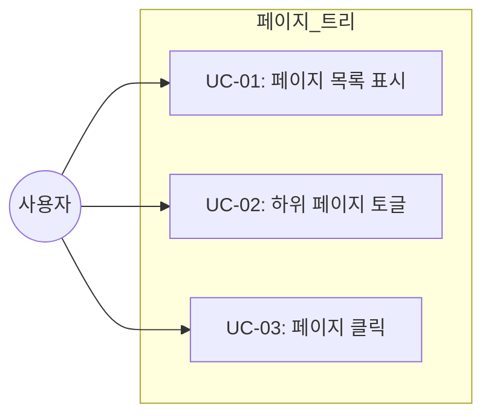
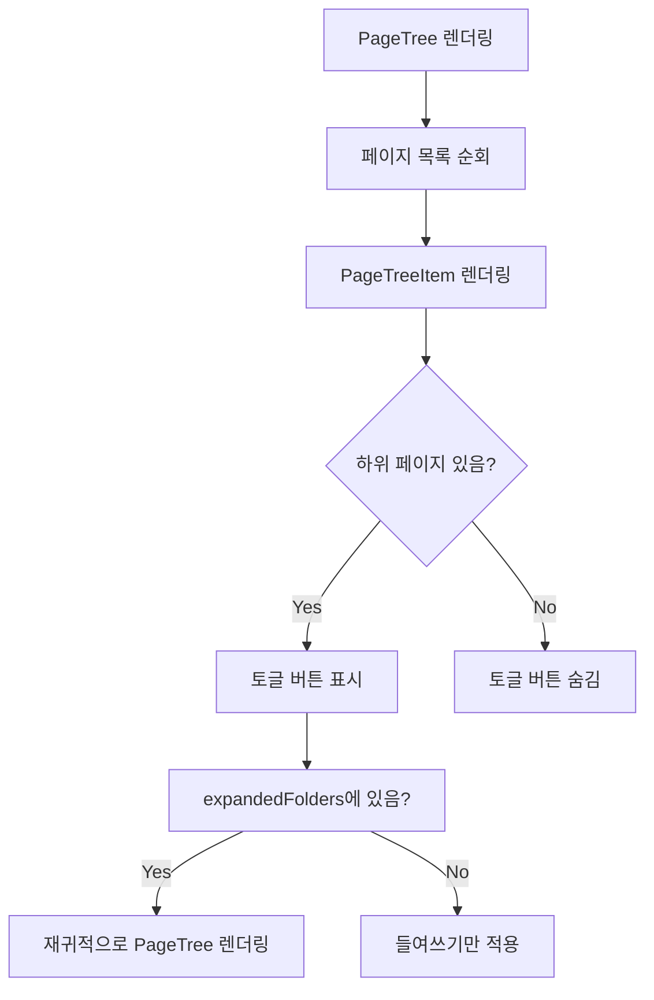

# TSK-02-03 - 페이지 트리 컴포넌트 (중첩 구조) 설계 문서

## 문서 정보

| 항목 | 내용 |
|------|------|
| Task ID | TSK-02-03 |
| 문서 버전 | 1.0 |
| 작성일 | 2026-01-02 |
| 상태 | 작성중 |
| 카테고리 | development |

---

## 1. 개요

### 1.1 배경 및 문제 정의

**현재 상황:**
- TSK-02-02에서 사이드바 컴포넌트의 구조가 완성되어 있음
- 사이드바 내 PageTreeArea 영역이 준비되었지만 실제 페이지 트리 렌더링 로직이 없음
- 사이드바에 "Favorites", "Private" 등 섹션 헤더만 표시됨

**해결하려는 문제:**
- 사용자가 페이지 목록을 확인하고 탐색할 수 없음
- 중첩된 페이지 구조(하위 페이지)를 표시할 방법이 없음
- 페이지 폴더 열기/닫기 기능이 없음

### 1.2 목적 및 기대 효과

**목적:**
- Notion 스타일의 재귀적 페이지 트리 컴포넌트 구현
- 중첩된 페이지 구조를 계층적으로 표시
- 폴더 토글로 하위 페이지 숨김/표시 기능 제공

**기대 효과:**
- 사용자가 사이드바를 통해 모든 페이지를 계층적으로 탐색 가능
- 무한 중첩 구조 지원으로 Notion과 동일한 사용자 경험
- TSK-02-04 페이지 생성/삭제 기능과 연동 가능한 기반 마련

### 1.3 범위

**포함:**
- `src/components/layout/PageTree.tsx` 메인 컴포넌트
- `src/components/layout/PageTreeItem.tsx` 개별 항목 컴포넌트
- 재귀적 트리 렌더링 로직
- depth에 따른 들여쓰기 구현
- 폴더 토글 (열기/닫기) 상태 관리
- 페이지 아이콘 + 제목 표시

**제외:**
- 페이지 클릭 시 라우팅 (TSK-02-05에서 구현)
- 컨텍스트 메뉴 (우클릭 메뉴 - TSK-02-04에서 구현)
- 드래그 앤 드롭 (선택적 기능)
- 데이터 로딩 (API 연동은 TSK-02-04에서)
- 페이지 생성/삭제 (TSK-02-04에서 구현)

### 1.4 참조 문서

| 문서 | 경로 | 관련 섹션 |
|------|------|----------|
| PRD | `.orchay/projects/notion-like/prd.md` | 2.3.1 무한 중첩 |
| TRD | `.orchay/projects/notion-like/trd.md` | 3.2 사이드바 컴포넌트 |

---

## 2. 사용자 분석

### 2.1 대상 사용자

| 사용자 유형 | 특성 | 주요 니즈 |
|------------|------|----------|
| 문서 작성자 | 여러 계층의 페이지를 관리 | 계층 구조를 한눈에 파악하고 빠르게 탐색 |
| 조직 관리자 | 프로젝트의 전체 구조를 관리 | 계층 관계를 명확히 하고 효율적으로 관리 |

### 2.2 사용자 페르소나

**페르소나 1: 김개발**
- 역할: 프론트엔드 개발자
- 목표: 프로젝트 내 다양한 문서를 계층 구조로 관리하고 빠르게 접근
- 불만: 페이지 목록이 없어 필요한 문서를 찾기 어려움
- 시나리오: "Design" 폴더를 펼쳐서 하위 설계 문서들을 확인하고 클릭

---

## 3. 유즈케이스

### 3.1 유즈케이스 다이어그램



### 3.2 유즈케이스 상세

#### UC-01: 페이지 목록 표시

| 항목 | 내용 |
|------|------|
| 액터 | 문서 작성자 |
| 목적 | 페이지 트리를 사이드바에 표시 |
| 사전 조건 | 사이드바가 표시됨, 페이지 목록이 스토어에 있음 |
| 사후 조건 | 계층 구조의 페이지 목록이 표시됨 |
| 트리거 | 페이지 로드 |

**기본 흐름:**
1. 시스템이 DB에서 페이지 목록을 조회한다
2. Zustand 스토어에서 페이지 목록을 로드한다
3. PageTree 컴포넌트가 페이지 목록을 렌더링한다
4. 각 페이지가 아이콘 + 제목 형태로 표시된다

#### UC-02: 하위 페이지 토글

| 항목 | 내용 |
|------|------|
| 액터 | 문서 작성자 |
| 목적 | 폴더 토글 버튼으로 하위 페이지 숨김/표시 |
| 사전 조건 | 페이지 목록이 표시됨, 하위 페이지가 있음 |
| 사후 조건 | 하위 페이지가 숨겨지거나 표시됨 |
| 트리거 | 토글 버튼 (ChevronRight 아이콘) 클릭 |

**기본 흐름:**
1. 사용자가 폴더 토글 버튼을 클릭한다
2. 시스템이 expandedFolders 상태를 업데이트한다
3. 하위 페이지가 펼쳐지거나 접힌다

**대안 흐름:**
- 2a. 하위 페이지가 없는 경우: 토글 버튼이 표시되지 않음

#### UC-03: 페이지 클릭

| 항목 | 내용 |
|------|------|
| 액터 | 문서 작성자 |
| 목적 | 페이지를 선택하여 에디터 로드 |
| 사전 조건 | 페이지 목록이 표시됨 |
| 사후 조건 | 해당 페이지가 선택되고 에디터에 로드됨 (다음 Task) |
| 트리거 | 페이지 아이템 클릭 |

**기본 흐름:**
1. 사용자가 페이지 항목을 클릭한다
2. 시스템이 현재 페이지 ID를 업데이트한다
3. 라우터가 해당 페이지로 이동한다 (TSK-02-05)

---

## 4. 사용자 시나리오

### 4.1 시나리오 1: 중첩된 페이지 구조 탐색

**상황 설명:**
사용자가 여러 계층의 페이지를 관리하고 있으며, 특정 하위 페이지를 찾아 클릭하려 한다.

**단계별 진행:**

| 단계 | 사용자 행동 | 시스템 반응 | 사용자 기대 |
|------|-----------|------------|------------|
| 1 | 애플리케이션 접속 | 페이지 트리 표시 | 최상위 페이지 목록 보임 |
| 2 | "Projects" 폴더 호버 | 토글 버튼 강조 | 폴더임을 인식 |
| 3 | 토글 버튼 클릭 | 하위 페이지 펼침 | "Design", "Code Review" 등 보임 |
| 4 | "Design" 페이지 클릭 | 에디터 로드 | Design 페이지 콘텐츠 표시 |

**성공 조건:**
- 트리 구조가 정확하게 표시됨
- 들여쓰기 계산이 정확함 (depth * 12 + 8)
- 토글이 부드럽게 작동함

### 4.2 시나리오 2: 깊은 중첩 구조 처리

**상황 설명:**
3단계 이상 깊이 있는 페이지 구조도 정상 처리되는지 확인

**단계별 진행:**

| 단계 | 사용자 행동 | 시스템 반응 | 사용자 기대 |
|------|-----------|------------|------------|
| 1 | "WP-01" 폴더 확장 | 하위 페이지 표시 | Tasks 목록 보임 |
| 2 | "Task 1" 폴더 확장 | 추가 들여쓰기 적용 | Subtasks 보임 |
| 3 | 최하위 페이지 클릭 | 올바른 페이지 선택 | 페이지 이동 |

---

## 5. 화면 설계

### 5.1 화면 흐름도



### 5.2 화면별 상세

#### Sidebar - PageTree 영역

**화면 목적:**
페이지의 계층 구조를 시각적으로 표시하고 탐색

**진입 경로:**
- 애플리케이션 로드 → Sidebar → PageTreeArea

**와이어프레임:**
```
┌──────────────────────────────┐
│ Favorites                    │  ← 섹션 헤더
│  ├─ 📄 My Dashboard          │  ← depth 1
│  │  ├─ 📊 Q1 Analytics       │  ← depth 2
│  │  └─ 📈 Monthly Report     │  ← depth 2
│  └─ 🎯 Goals                 │  ← depth 1
│                              │
│ Private                      │  ← 섹션 헤더
│  ├─ 📁 Projects (▶ 펼침 전) │  ← depth 1
│  └─ 📁 Archive (▼ 펼침 상태)│  ← depth 1
│     ├─ 📄 Old Docs           │  ← depth 2
│     └─ 📄 Deprecated         │  ← depth 2
│                              │
└──────────────────────────────┘
```

**화면 요소 설명:**

| 요소 | 설명 | 상호작용 |
|------|------|----------|
| 토글 버튼 (▶/▼) | 하위 페이지 펼침/접음 | 클릭 시 상태 토글 |
| 아이콘 | 페이지 타입 (📄: 페이지, 📁: 폴더) | 클릭 시 페이지 이동 (향후) |
| 페이지 제목 | 페이지 이름 | 클릭 시 페이지 이동 (향후) |
| 들여쓰기 | depth * 12 + 8 px | 계층 구조 시각화 |

### 5.3 컴포넌트 구조

```
PageTree.tsx (메인 컴포넌트)
├── pages: Page[] (Props)
├── expandedFolders: Set<string> (상태)
├── onToggleFolder: (pageId: string) => void (콜백)
└── renderPageTreeItems()
    └── PageTreeItem.tsx (개별 항목)
        ├── page: Page (Props)
        ├── depth: number (Props)
        ├── isExpanded: boolean (Props)
        ├── onToggle: () => void (콜백)
        ├── onNavigate: () => void (콜백)
        ├── 토글 버튼 (hasChildren이 true일 때만)
        ├── 페이지 아이콘
        ├── 페이지 제목
        └── {isExpanded && <PageTree depth={depth+1} />} (재귀)
```

### 5.4 스타일 명세 (TRD 기준)

| 요소 | Tailwind 클래스 | 설명 |
|------|----------------|------|
| PageTree 컨테이너 | `flex flex-col gap-0.5 px-2 py-1` | 페이지 목록 컨테이너 |
| PageTreeItem | `flex items-center gap-1 px-3 py-1.5 rounded-[4px] hover:bg-[#EFEFEF] cursor-pointer transition-colors` | 개별 페이지 항목 |
| 들여쓰기 | `ml-[calc(var(--depth)*12px+8px)]` | depth 기반 동적 들여쓰기 |
| 토글 버튼 | `w-4 h-4 flex items-center justify-center mr-0.5` | 토글 버튼 영역 |
| 토글 아이콘 (닫힘) | `<ChevronRight size={16} className="text-[#B4B4B3]" />` | 닫힌 상태 |
| 토글 아이콘 (펼침) | `<ChevronDown size={16} className="text-[#B4B4B3]" />` | 펼쳐진 상태 |
| 페이지 아이콘 | `text-[18px] leading-none` | 페이지 이모지 아이콘 |
| 페이지 제목 | `text-[14px] text-[#37352F] font-[400]` | 페이지 이름 텍스트 |

---

## 6. 인터랙션 설계

### 6.1 사용자 액션과 피드백

| 사용자 액션 | 즉각 피드백 | 결과 피드백 |
|------------|-----------|------------|
| 토글 버튼 호버 | 아이콘 색상 변경 | - |
| 토글 버튼 클릭 | 아이콘 회전 (▶→▼) | 하위 페이지 펼침/접힘 애니메이션 |
| 페이지 항목 호버 | `bg-[#EFEFEF]` 배경 | - |
| 페이지 항목 클릭 | 선택 상태 강조 | 에디터 영역에 페이지 로드 (TSK-02-05) |

### 6.2 상태별 화면 변화

| 상태 | 화면 표시 |
|------|----------|
| expandedFolders에 포함 | ChevronDown 아이콘, 하위 항목 표시 |
| expandedFolders에 미포함 | ChevronRight 아이콘, 하위 항목 숨김 |
| 하위 페이지 없음 | 토글 버튼 미표시 |

### 6.3 애니메이션

```css
/* 토글 애니메이션 */
.toggle-icon {
  transition: transform 0.15s ease-in-out;
}

.toggle-icon.expanded {
  transform: rotate(90deg);
}

/* 호버 효과 */
.page-tree-item {
  transition: background-color 20ms ease-in;
}
```

---

## 7. 데이터 구조

### 7.1 Page 모델

```typescript
interface Page {
  id: string;              // 페이지 고유 ID
  title: string;           // 페이지 제목
  icon: string;            // 이모지 아이콘
  parentId?: string;       // 상위 페이지 ID (undefined: 루트)
  children?: Page[];       // 하위 페이지 배열 (선택적)
  createdAt: string;       // 생성 일자
  updatedAt: string;       // 수정 일자
}
```

### 7.2 상태 관리

```typescript
// Zustand 스토어
interface AppState {
  // 기존 상태
  pages: Page[];
  currentPageId: string | null;

  // 페이지 트리 상태 (이번 Task에서 추가)
  expandedFolders: Set<string>;  // 펼쳐진 폴더의 ID 목록

  // 메서드
  toggleFolder: (folderId: string) => void;
  navigateToPage: (pageId: string) => void;
}
```

### 7.3 필요한 데이터

| 데이터 | 출처 | 용도 |
|--------|------|------|
| pages | Zustand 스토어 (API 조회) | 페이지 트리 렌더링 |
| expandedFolders | Zustand 스토어 | 토글 상태 유지 |
| currentPageId | Zustand 스토어 | 현재 선택 페이지 강조 |

---

## 8. 비즈니스 규칙

### 8.1 핵심 규칙

| 규칙 ID | 규칙 설명 | 적용 상황 | 예외 |
|---------|----------|----------|------|
| BR-01 | 들여쓰기 = depth * 12 + 8 px | 모든 페이지 항목 | 없음 |
| BR-02 | 하위 페이지가 없으면 토글 버튼 미표시 | 리프 노드 | 없음 |
| BR-03 | 페이지 클릭 시 navigateToPage 호출 | 모든 클릭 | 토글 버튼 클릭 제외 |
| BR-04 | expandedFolders는 세션 동안 유지 | 모든 토글 | 새로고침 시 초기화 가능 |
| BR-05 | 최대 깊이 제한 없음 (무한 중첩 지원) | 모든 깊이 | 없음 |

---

## 9. 에러 처리

### 9.1 예상 에러 상황

| 상황 | 원인 | 처리 방법 |
|------|------|----------|
| 빈 페이지 목록 | 데이터 없음 | 빈 트리 표시, 안내 메시지 (선택) |
| 순환 참조 | 잘못된 데이터 구조 | 무한 루프 방지 로직 추가 (선택) |

---

## 10. 구현 범위

### 10.1 생성할 파일

| 파일 | 목적 | 라인 수 (예상) |
|------|------|--------------|
| `src/components/layout/PageTree.tsx` | 페이지 트리 메인 컴포넌트 | 60-80 |
| `src/components/layout/PageTreeItem.tsx` | 개별 페이지 항목 컴포넌트 | 40-60 |

### 10.2 의존성

| 의존 항목 | 이유 | 상태 |
|----------|------|------|
| TSK-02-02 | Sidebar 컴포넌트 완료 필요 | 진행중 |
| lucide-react | 아이콘 (ChevronRight, ChevronDown) | 설치됨 |
| Zustand | 페이지 트리 상태 관리 | 설치됨 (TSK-00-05) |

### 10.3 제약 사항

| 제약 | 설명 | 대응 방안 |
|------|------|----------|
| API 미연동 | 이번 Task에서는 목 데이터 사용 | TSK-02-04에서 API 연동 |
| 페이지 클릭 기능 | 라우팅은 TSK-02-05에서 구현 | 이번 Task에서는 콘솔 로그만 |
| 드래그 앤 드롭 | 선택적 기능 | MVP에서는 제외 |

---

## 11. 상세 설계

### 11.1 PageTreeItem 컴포넌트 (개별 항목)

```typescript
interface PageTreeItemProps {
  page: Page;
  depth: number;
  isExpanded: boolean;
  onToggleExpand: () => void;
  onSelect: (pageId: string) => void;
}

export function PageTreeItem({
  page,
  depth,
  isExpanded,
  onToggleExpand,
  onSelect,
}: PageTreeItemProps) {
  const hasChildren = page.children && page.children.length > 0;

  return (
    <div>
      {/* 페이지 항목 */}
      <div
        className="flex items-center gap-1 px-3 py-1.5 rounded-[4px] hover:bg-[#EFEFEF] cursor-pointer transition-colors"
        style={{ marginLeft: `${depth * 12 + 8}px` }}
        onClick={() => onSelect(page.id)}
      >
        {/* 토글 버튼 */}
        {hasChildren ? (
          <button
            onClick={(e) => {
              e.stopPropagation();
              onToggleExpand();
            }}
            className="w-4 h-4 flex items-center justify-center"
          >
            {isExpanded ? (
              <ChevronDown size={16} className="text-[#B4B4B3]" />
            ) : (
              <ChevronRight size={16} className="text-[#B4B4B3]" />
            )}
          </button>
        ) : (
          <div className="w-4" /> {/* 플레이스홀더 */}
        )}

        {/* 페이지 아이콘 */}
        <span className="text-[18px] leading-none">{page.icon}</span>

        {/* 페이지 제목 */}
        <span className="text-[14px] text-[#37352F] font-[400]">
          {page.title}
        </span>
      </div>

      {/* 하위 페이지 */}
      {hasChildren && isExpanded && (
        <PageTree pages={page.children} depth={depth + 1} />
      )}
    </div>
  );
}
```

### 11.2 PageTree 컴포넌트 (메인)

```typescript
interface PageTreeProps {
  pages: Page[];
  depth?: number;
}

export function PageTree({ pages, depth = 0 }: PageTreeProps) {
  const store = useAppStore();
  const { expandedFolders, toggleFolder } = store;

  return (
    <div className="flex flex-col gap-0">
      {pages.map((page) => (
        <PageTreeItem
          key={page.id}
          page={page}
          depth={depth}
          isExpanded={expandedFolders.has(page.id)}
          onToggleExpand={() => toggleFolder(page.id)}
          onSelect={(pageId) => {
            console.log(`Navigate to page: ${pageId}`);
            store.setCurrentPageId(pageId);
          }}
        />
      ))}
    </div>
  );
}
```

### 11.3 Zustand 스토어 (확장)

```typescript
// src/lib/store.ts에 추가
interface AppState {
  // ... 기존 상태

  // 페이지 트리 상태 (새로 추가)
  expandedFolders: Set<string>;

  // 메서드 (새로 추가)
  toggleFolder: (folderId: string) => void;
}

export const useAppStore = create<AppState>((set) => ({
  // ... 기존 상태 및 메서드

  expandedFolders: new Set<string>(),

  toggleFolder: (folderId: string) =>
    set((state) => {
      const newExpanded = new Set(state.expandedFolders);
      if (newExpanded.has(folderId)) {
        newExpanded.delete(folderId);
      } else {
        newExpanded.add(folderId);
      }
      return { expandedFolders: newExpanded };
    }),
}));
```

---

## 12. 테스트 시나리오

### 12.1 단위 테스트 (예상)

| 테스트 | 입력 | 기대 결과 |
|--------|------|----------|
| PageTree 렌더링 | pages 배열 | 각 페이지가 올바른 depth로 렌더링됨 |
| 토글 기능 | expandedFolders 변경 | 하위 페이지 표시/숨김 |
| 깊이 계산 | depth = 2 | marginLeft = 32px |

### 12.2 E2E 테스트 (예상)

| 시나리오 | 단계 | 검증 |
|----------|------|------|
| 트리 탐색 | 폴더 확장 → 페이지 클릭 | 올바른 페이지 선택됨 |
| 깊은 중첩 | 3단계 페이지 토글 | 모든 레벨에서 토글 작동 |

---

## 13. 체크리스트

### 13.1 설계 완료 확인

- [x] 문제 정의 및 목적 명확화
- [x] 사용자 분석 완료
- [x] 유즈케이스 정의 완료
- [x] 사용자 시나리오 작성 완료
- [x] 화면 설계 완료 (와이어프레임)
- [x] 인터랙션 설계 완료
- [x] 데이터 요구사항 정의 완료
- [x] 비즈니스 규칙 정의 완료
- [x] 상세 설계 코드 작성

### 13.2 구현 준비

- [x] 구현 우선순위 결정
- [x] 의존성 확인 완료
- [x] 제약 사항 검토 완료

---

## 변경 이력

| 버전 | 일자 | 작성자 | 변경 내용 |
|------|------|--------|----------|
| 1.0 | 2026-01-02 | Claude | 최초 작성 |

