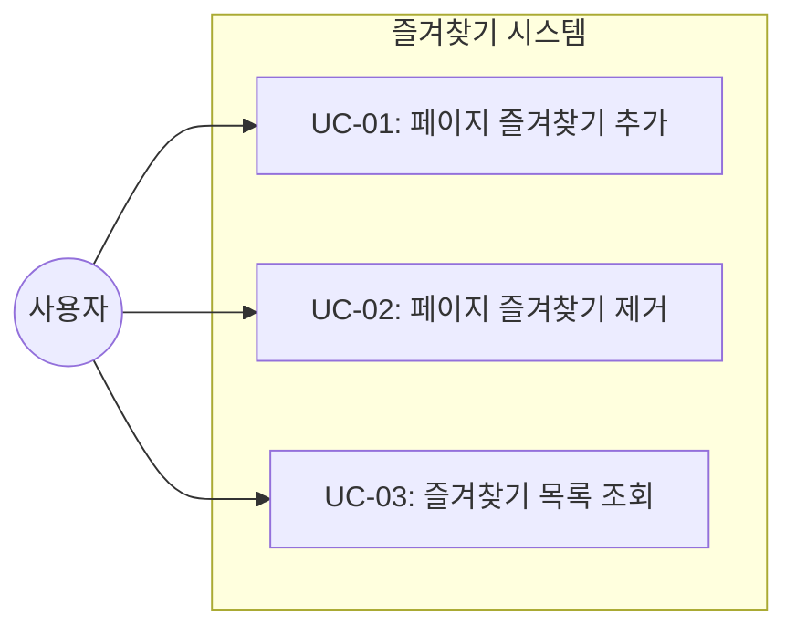
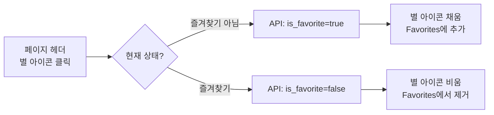

# TSK-02-06 - 즐겨찾기 기능 설계 문서

## 문서 정보

| 항목 | 내용 |
|------|------|
| Task ID | TSK-02-06 |
| 문서 버전 | 1.0 |
| 작성일 | 2026-01-03 |
| 상태 | 작성중 |
| 카테고리 | development |

---

## 1. 개요

### 1.1 배경 및 문제 정의

**현재 상황:**
- 페이지 트리에 모든 페이지가 계층 구조로 표시됨
- 자주 사용하는 페이지에 빠르게 접근할 수 있는 방법이 없음
- 페이지 수가 많아질수록 원하는 페이지를 찾는 데 시간이 걸림

**해결하려는 문제:**
- 사용자가 자주 사용하는 페이지를 빠르게 접근할 수 있어야 함
- Notion과 같이 Favorites 섹션을 통해 중요 페이지를 상단에 표시해야 함

### 1.2 목적 및 기대 효과

**목적:**
- 페이지에 즐겨찾기 기능을 추가하여 사용자 경험 개선

**기대 효과:**
- 자주 사용하는 페이지에 1클릭으로 즐겨찾기 추가/제거
- 사이드바 Favorites 섹션에서 즐겨찾기 페이지 바로 접근 가능
- Notion과 유사한 워크플로우 제공

### 1.3 범위

**포함:**
- 즐겨찾기 토글 버튼 (별 아이콘)
- 사이드바 Favorites 섹션에 즐겨찾기 페이지 목록 표시
- 즐겨찾기 상태 DB 저장 및 조회 API

**제외:**
- 즐겨찾기 순서 변경 (드래그 앤 드롭)
- 즐겨찾기 그룹화
- 즐겨찾기 최대 개수 제한

### 1.4 참조 문서

| 문서 | 경로 | 관련 섹션 |
|------|------|----------|
| WBS | `.orchay/projects/notion-like/wbs.yaml` | TSK-02-06 |
| 기존 DB 스키마 | `notion-like/src/lib/db.ts` | is_favorite 필드 |
| 기존 Store | `notion-like/src/lib/store.ts` | is_favorite 필드 |

---

## 2. 사용자 분석

### 2.1 대상 사용자

| 사용자 유형 | 특성 | 주요 니즈 |
|------------|------|----------|
| 일반 사용자 | Notion 경험자, 문서 작성 주 사용 | 자주 사용하는 페이지에 빠르게 접근 |
| 파워 유저 | 많은 페이지 관리, 복잡한 계층 구조 | 중요 문서를 상단에 고정하여 효율성 향상 |

### 2.2 사용자 페르소나

**페르소나 1: 김개발**
- 역할: 개발자
- 목표: 프로젝트 문서, 회의록 등 자주 참조하는 문서에 빠르게 접근
- 불만: 깊은 계층에 있는 중요 문서를 매번 찾아 들어가야 함
- 시나리오: 매일 확인하는 "스프린트 백로그" 페이지를 즐겨찾기에 추가하여 1클릭 접근

---

## 3. 유즈케이스

### 3.1 유즈케이스 다이어그램



### 3.2 유즈케이스 상세

#### UC-01: 페이지 즐겨찾기 추가

| 항목 | 내용 |
|------|------|
| 액터 | 사용자 |
| 목적 | 페이지를 즐겨찾기에 추가하여 빠른 접근 |
| 사전 조건 | 해당 페이지가 즐겨찾기에 없음 |
| 사후 조건 | 페이지가 즐겨찾기에 추가되고, Favorites 섹션에 표시됨 |
| 트리거 | 별 아이콘 클릭 또는 컨텍스트 메뉴 선택 |

**기본 흐름:**
1. 사용자가 페이지 헤더의 별 아이콘을 클릭한다
2. 시스템이 API를 통해 is_favorite를 true로 업데이트한다
3. 별 아이콘이 채워진 상태(filled)로 변경된다
4. 사이드바 Favorites 섹션에 해당 페이지가 추가된다
5. 사용자에게 성공 피드백이 표시된다 (아이콘 변화로 확인)

**예외 흐름:**
- 2a. API 호출 실패 시:
  - 시스템이 에러 토스트를 표시한다
  - 별 아이콘 상태는 변경되지 않는다

#### UC-02: 페이지 즐겨찾기 제거

| 항목 | 내용 |
|------|------|
| 액터 | 사용자 |
| 목적 | 더 이상 필요 없는 즐겨찾기 제거 |
| 사전 조건 | 해당 페이지가 즐겨찾기에 있음 |
| 사후 조건 | 페이지가 즐겨찾기에서 제거되고, Favorites 섹션에서 사라짐 |
| 트리거 | 채워진 별 아이콘 클릭 또는 컨텍스트 메뉴 선택 |

**기본 흐름:**
1. 사용자가 채워진 별 아이콘을 클릭한다
2. 시스템이 API를 통해 is_favorite를 false로 업데이트한다
3. 별 아이콘이 빈 상태(outline)로 변경된다
4. 사이드바 Favorites 섹션에서 해당 페이지가 제거된다

#### UC-03: 즐겨찾기 목록 조회

| 항목 | 내용 |
|------|------|
| 액터 | 사용자 |
| 목적 | 즐겨찾기 페이지 목록 확인 및 접근 |
| 사전 조건 | 애플리케이션 로드 |
| 사후 조건 | Favorites 섹션에 즐겨찾기 페이지 목록이 표시됨 |
| 트리거 | 애플리케이션 시작, 즐겨찾기 상태 변경 |

**기본 흐름:**
1. 시스템이 API를 통해 즐겨찾기 페이지 목록을 조회한다
2. 사이드바 Favorites 섹션에 목록이 표시된다
3. 사용자가 목록의 페이지를 클릭하면 해당 페이지로 이동한다

---

## 4. 사용자 시나리오

### 4.1 시나리오 1: 즐겨찾기 추가 및 사용

**상황 설명:**
김개발은 매일 확인해야 하는 "스프린트 백로그" 페이지가 있다. 이 페이지는 "프로젝트 > 2024 Q1 > Sprint" 하위에 있어서 매번 찾아가기 번거롭다.

**단계별 진행:**

| 단계 | 사용자 행동 | 시스템 반응 | 사용자 기대 |
|------|-----------|------------|------------|
| 1 | "스프린트 백로그" 페이지로 이동 | 페이지 로드, 헤더에 빈 별 아이콘 표시 | 별 아이콘이 보임 |
| 2 | 별 아이콘 클릭 | 별 아이콘이 채워짐, Favorites에 페이지 추가 | 즉시 반영 |
| 3 | 다른 페이지로 이동 후 Favorites 클릭 | Favorites 섹션 확인 | "스프린트 백로그"가 목록에 있음 |
| 4 | Favorites에서 페이지 클릭 | 해당 페이지로 이동 | 빠르게 접근 가능 |

**성공 조건:**
- 별 아이콘 클릭 즉시 상태 반영
- Favorites 섹션에 페이지 표시
- 1클릭으로 페이지 접근 가능

### 4.2 시나리오 2: 즐겨찾기 제거

**상황 설명:**
완료된 프로젝트의 페이지를 즐겨찾기에서 제거하고 싶다.

**단계별 진행:**

| 단계 | 사용자 행동 | 시스템 반응 | 사용자 기대 |
|------|-----------|------------|------------|
| 1 | 즐겨찾기된 페이지에서 채워진 별 아이콘 클릭 | 별 아이콘이 비워짐 | 즉시 반영 |
| 2 | Favorites 섹션 확인 | 해당 페이지가 목록에서 제거됨 | 깔끔하게 정리됨 |

---

## 5. 화면 설계

### 5.1 화면 흐름도



### 5.2 화면별 상세

#### 화면 1: 페이지 헤더 - 즐겨찾기 버튼

**화면 목적:**
현재 페이지를 즐겨찾기에 추가/제거할 수 있는 버튼

**위치:**
- `PageHeader.tsx` 또는 페이지 제목 영역 옆
- 아이콘/커버 변경 버튼과 같은 행에 배치

**와이어프레임:**
```
┌─────────────────────────────────────────────────────────┐
│  ┌─────────────────────────────────────────────────┐   │
│  │    [커버 이미지 영역 - 200px]                    │   │
│  └─────────────────────────────────────────────────┘   │
│                                                         │
│  📄 ← 페이지 아이콘 (78px)                              │
│                                                         │
│  ┌─────────────────────────────────────────────────┐   │
│  │  페이지 제목                        ☆  ← 즐겨찾기│   │
│  │  (40px 폰트)                           버튼     │   │
│  └─────────────────────────────────────────────────┘   │
│                                                         │
│  [Add icon]  [Add cover]  ← 기존 버튼들                │
│                                                         │
└─────────────────────────────────────────────────────────┘
```

**화면 요소 설명:**

| 요소 | 설명 | 상태 | 스타일 |
|------|------|------|--------|
| 빈 별 (☆) | 즐겨찾기 아님 | default | `text-[#B4B4B3]` |
| 채운 별 (★) | 즐겨찾기됨 | active | `text-[#E9B44C]` (노란색) |

**사용자 행동 시나리오:**
1. 사용자가 페이지에 진입하면 현재 is_favorite 상태에 따라 아이콘 표시
2. 별 아이콘 호버 시 툴팁 표시: "Add to Favorites" / "Remove from Favorites"
3. 클릭 시 상태 토글 및 API 호출

#### 화면 2: 사이드바 Favorites 섹션

**화면 목적:**
즐겨찾기된 페이지 목록을 표시하여 빠른 접근 제공

**위치:**
- `Sidebar.tsx` 내부, 기존 "Favorites" 섹션 헤더 하단

**와이어프레임:**
```
┌─────────────────────────────────────────┐
│  FAVORITES                              │ ← 섹션 헤더
├─────────────────────────────────────────┤
│  ★ 📄 스프린트 백로그                   │ ← 즐겨찾기 항목
│  ★ 📋 회의록                           │
│  ★ 📊 대시보드                         │
├─────────────────────────────────────────┤
│  PRIVATE                                │ ← 기존 섹션
│  ...                                    │
└─────────────────────────────────────────┘
```

**화면 요소 설명:**

| 영역 | 설명 | 스타일 |
|------|------|--------|
| 섹션 헤더 | "FAVORITES" 텍스트 | `text-[12px] text-[#787774] uppercase` |
| 즐겨찾기 항목 | 페이지 아이콘 + 제목 | PageTree와 동일한 스타일 |
| 빈 상태 | "No favorites yet" | `text-[12px] text-[#B4B4B3] italic` |

**사용자 행동 시나리오:**
1. Favorites 섹션에 즐겨찾기 페이지들이 표시됨
2. 항목 클릭 시 해당 페이지로 이동
3. 즐겨찾기가 없을 경우 빈 상태 메시지 표시

### 5.3 반응형 동작

| 화면 크기 | 레이아웃 변화 | 사용자 경험 |
|----------|--------------|------------|
| 데스크톱 (1024px+) | 사이드바 240px, Favorites 항상 표시 | 전체 기능 사용 가능 |
| 태블릿 (768-1023px) | 사이드바 240px, 동일 | 동일 |
| 모바일 (767px-) | 사이드바 오버레이, Favorites 동일 | 사이드바 열면 Favorites 표시 |

---

## 6. 인터랙션 설계

### 6.1 사용자 액션과 피드백

| 사용자 액션 | 즉각 피드백 | 결과 피드백 | 에러 피드백 |
|------------|-----------|------------|------------|
| 별 아이콘 호버 | 툴팁 표시 | - | - |
| 별 아이콘 클릭 | 아이콘 색상 변경 (즉시) | Favorites 목록 업데이트 | 에러 토스트 + 상태 롤백 |
| Favorites 항목 호버 | 배경색 변경 (#EFEFEF) | - | - |
| Favorites 항목 클릭 | - | 페이지 로드 | - |

### 6.2 상태별 화면 변화

| 상태 | 별 아이콘 | Favorites 섹션 |
|------|----------|----------------|
| 즐겨찾기 아님 | ☆ (outline, #B4B4B3) | 해당 페이지 없음 |
| 즐겨찾기됨 | ★ (filled, #E9B44C) | 해당 페이지 표시 |
| API 호출 중 | 로딩 스피너 (선택적) | 변경 없음 |
| 에러 발생 | 원래 상태 유지 | 변경 없음 |

### 6.3 키보드/접근성

| 기능 | 키보드 단축키 | 스크린 리더 안내 |
|------|-------------|-----------------|
| 별 아이콘 포커스 | Tab | "Add to Favorites button" / "Remove from Favorites button" |
| 별 아이콘 실행 | Enter / Space | 상태 변경 안내 |
| Favorites 항목 포커스 | Tab | "{페이지 제목}, Favorite page" |

---

## 7. 데이터 요구사항

### 7.1 필요한 데이터

| 데이터 | 설명 | 출처 | 용도 |
|--------|------|------|------|
| is_favorite | 즐겨찾기 여부 | DB pages 테이블 | 상태 표시 및 필터링 |
| 즐겨찾기 목록 | is_favorite=true인 페이지들 | API 조회 | Favorites 섹션 렌더링 |

### 7.2 기존 데이터 구조 (이미 구현됨)

**DB 스키마 (db.ts:87-88):**
```sql
is_favorite INTEGER DEFAULT 0
```

**API (db.ts:166-174):**
```typescript
getFavoritePages(): Page[] {
  const stmt = this.db.prepare(`
    SELECT * FROM pages
    WHERE is_favorite = 1
    ORDER BY sort_order, created_at
  `);
  ...
}
```

**Store 타입 (store.ts:10):**
```typescript
is_favorite: boolean;
```

### 7.3 데이터 유효성 규칙

| 데이터 필드 | 규칙 | 위반 시 메시지 |
|------------|------|---------------|
| is_favorite | boolean (0/1) | - (내부 처리) |
| pageId | 유효한 UUID | "Page not found" |

---

## 8. API 설계

### 8.1 즐겨찾기 상태 변경 API

**기존 PUT API 확장 (pages/[id]/route.ts):**

```
PUT /api/pages/:id
```

**Request Body:**
```json
{
  "is_favorite": true | false
}
```

**Response (200 OK):**
```json
{
  "id": "uuid",
  "title": "페이지 제목",
  "is_favorite": true,
  ...
}
```

**Error Response (404 Not Found):**
```json
{
  "error": "Page not found"
}
```

### 8.2 즐겨찾기 목록 조회 API

**새 API 또는 기존 API 쿼리 파라미터:**

```
GET /api/pages?favorites=true
```

**또는 별도 엔드포인트:**

```
GET /api/pages/favorites
```

**Response (200 OK):**
```json
[
  {
    "id": "uuid",
    "title": "페이지 제목",
    "icon": "📄",
    "is_favorite": true,
    ...
  }
]
```

---

## 9. 에러 처리

### 9.1 예상 에러 상황

| 상황 | 원인 | 사용자 메시지 | 복구 방법 |
|------|------|--------------|----------|
| 페이지 미존재 | 삭제된 페이지 | "Page not found" | Favorites에서 자동 제거 |
| 네트워크 오류 | 연결 끊김 | "Failed to update. Please try again." | 재시도 버튼 |
| 서버 오류 | 500 에러 | "Something went wrong." | 재시도 또는 새로고침 |

### 9.2 에러 표시 방식

| 에러 유형 | 표시 위치 | 표시 방법 |
|----------|----------|----------|
| API 오류 | 화면 상단 | 토스트 알림 |
| 상태 복구 | 별 아이콘 | 원래 상태로 롤백 |

---

## 10. 구현 범위

### 10.1 영향받는 영역

| 영역 | 변경 내용 | 영향도 |
|------|----------|--------|
| PageHeader.tsx | 즐겨찾기 버튼 추가 | 중간 |
| Sidebar.tsx | Favorites 섹션 구현 | 중간 |
| pages/[id]/route.ts | is_favorite 업데이트 지원 | 낮음 |
| pages/route.ts 또는 새 API | 즐겨찾기 목록 조회 | 낮음 |
| store.ts | 즐겨찾기 관련 상태 (선택적) | 낮음 |

### 10.2 의존성

| 의존 항목 | 이유 | 상태 |
|----------|------|------|
| TSK-02-05 (페이지 라우팅) | Favorites에서 페이지 이동 | 진행중 |
| TSK-01-04 (PageHeader) | 별 아이콘 추가 위치 | 기본설계 완료 |
| 기존 DB 스키마 | is_favorite 필드 | 완료 |
| 기존 API | getFavoritePages | 완료 |

### 10.3 제약 사항

| 제약 | 설명 | 대응 방안 |
|------|------|----------|
| 순서 변경 불가 | MVP에서 드래그 앤 드롭 미지원 | sort_order 기반 정렬 (생성순) |
| 최대 개수 없음 | 무제한 즐겨찾기 | 스크롤로 처리 |

---

## 11. 구현 파일 목록

| 파일 | 변경 유형 | 설명 |
|------|----------|------|
| `src/components/layout/Sidebar.tsx` | 수정 | Favorites 섹션 구현 |
| `src/components/layout/FavoritesList.tsx` | 신규 | 즐겨찾기 목록 컴포넌트 |
| `src/components/editor/PageHeader.tsx` | 수정 | 즐겨찾기 버튼 추가 |
| `src/app/api/pages/[id]/route.ts` | 수정 | is_favorite 업데이트 지원 |
| `src/app/api/pages/favorites/route.ts` | 신규 | 즐겨찾기 목록 조회 API |

---

## 12. 체크리스트

### 12.1 설계 완료 확인

- [x] 문제 정의 및 목적 명확화
- [x] 사용자 분석 완료
- [x] 유즈케이스 정의 완료
- [x] 사용자 시나리오 작성 완료
- [x] 화면 설계 완료 (와이어프레임)
- [x] 인터랙션 설계 완료
- [x] 데이터 요구사항 정의 완료
- [x] API 설계 완료
- [x] 에러 처리 정의 완료

### 12.2 구현 준비

- [x] 구현 우선순위 결정 (API → 컴포넌트 → 통합)
- [x] 의존성 확인 완료
- [x] 제약 사항 검토 완료

---

## 변경 이력

| 버전 | 일자 | 작성자 | 변경 내용 |
|------|------|--------|----------|
| 1.0 | 2026-01-03 | Claude | 최초 작성 |
