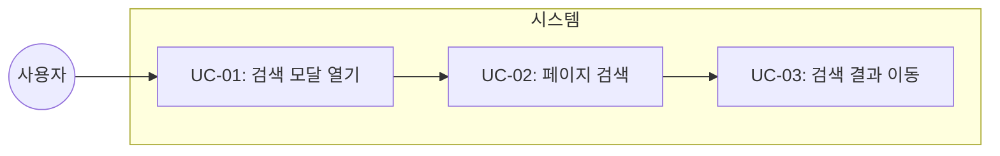
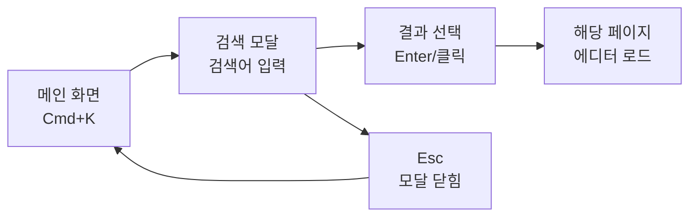

# TSK-02-07 - 검색 기능 (Cmd+K) 설계 문서

## 문서 정보

| 항목 | 내용 |
|------|------|
| Task ID | TSK-02-07 |
| 문서 버전 | 1.0 |
| 작성일 | 2026-01-03 |
| 상태 | 작성완료 |
| 카테고리 | development |

---

## 1. 개요

### 1.1 배경 및 문제 정의

**현재 상황:**
- 사용자는 사이드바의 페이지 트리를 직접 탐색해야 페이지를 찾을 수 있음
- 페이지 수가 많아지면 원하는 페이지를 찾는 데 시간이 오래 걸림
- 중첩된 하위 페이지의 경우 폴더를 일일이 펼쳐야 접근 가능

**해결하려는 문제:**
- 빠른 페이지 탐색 수단 부재
- 키보드 중심 사용자의 마우스 의존도 증가
- Notion과 유사한 UX 기대에 미달

### 1.2 목적 및 기대 효과

**목적:**
- Cmd+K(Mac) / Ctrl+K(Windows) 단축키로 검색 모달을 열어 페이지를 빠르게 찾고 이동하는 기능 구현

**기대 효과:**
- 사용자 관점: 페이지 수와 관계없이 2-3초 내 원하는 페이지 접근
- 비즈니스 관점: Notion과 유사한 핵심 UX 제공으로 사용자 만족도 향상

### 1.3 범위

**포함:**
- Cmd+K / Ctrl+K 단축키로 검색 모달 열기
- 페이지 제목 기반 실시간 필터링
- 검색 결과 클릭 또는 Enter로 페이지 이동
- 키보드 네비게이션 (화살표 위/아래, Enter, Esc)

**제외:**
- 페이지 콘텐츠(블록) 내용 검색 (향후 과제)
- 검색어 하이라이트 (MVP 제외)
- 최근 검색 기록 저장 (향후 과제)
- 검색 결과 정렬 옵션 (향후 과제)

### 1.4 참조 문서

| 문서 | 경로 | 관련 섹션 |
|------|------|----------|
| WBS | `.orchay/projects/notion-like/wbs.yaml` | TSK-02-07 |

---

## 2. 사용자 분석

### 2.1 대상 사용자

| 사용자 유형 | 특성 | 주요 니즈 |
|------------|------|----------|
| 일반 사용자 | 마우스/키보드 혼용 | 빠른 페이지 접근 |
| 파워 유저 | 키보드 중심 작업 | 단축키 기반 빠른 워크플로우 |

### 2.2 사용자 페르소나

**페르소나 1: 김개발**
- 역할: 개발자
- 목표: 문서를 빠르게 탐색하며 작업 효율 극대화
- 불만: 마우스로 사이드바를 탐색하는 것이 번거로움
- 시나리오: 코딩 중 문서를 참조할 때 Cmd+K로 즉시 검색하여 이동

---

## 3. 유즈케이스

### 3.1 유즈케이스 다이어그램



### 3.2 유즈케이스 상세

#### UC-01: 검색 모달 열기

| 항목 | 내용 |
|------|------|
| 액터 | 사용자 |
| 목적 | 검색 UI를 빠르게 열기 |
| 사전 조건 | 앱이 로드된 상태 |
| 사후 조건 | 검색 모달이 화면 중앙에 표시됨 |
| 트리거 | Cmd+K (Mac) / Ctrl+K (Windows) |

**기본 흐름:**
1. 사용자가 Cmd+K (또는 Ctrl+K)를 누른다
2. 시스템이 검색 모달을 화면 중앙에 표시한다
3. 검색 입력창에 자동으로 포커스가 이동한다
4. 전체 페이지 목록이 초기 결과로 표시된다

**대안 흐름:**
- 1a. 사이드바의 Search 버튼을 클릭한 경우:
  - 동일하게 검색 모달이 열린다

#### UC-02: 페이지 검색

| 항목 | 내용 |
|------|------|
| 액터 | 사용자 |
| 목적 | 원하는 페이지를 제목으로 찾기 |
| 사전 조건 | 검색 모달이 열린 상태 |
| 사후 조건 | 검색어와 일치하는 페이지 목록 표시 |
| 트리거 | 검색어 입력 |

**기본 흐름:**
1. 사용자가 검색어를 입력한다
2. 시스템이 입력과 동시에(debounce 없이) 페이지 제목을 필터링한다
3. 일치하는 페이지 목록이 아래에 표시된다
4. 첫 번째 결과가 자동으로 선택(하이라이트)된다

**대안 흐름:**
- 3a. 일치하는 페이지가 없는 경우:
  - "검색 결과가 없습니다" 메시지 표시

#### UC-03: 검색 결과 이동

| 항목 | 내용 |
|------|------|
| 액터 | 사용자 |
| 목적 | 선택한 페이지로 이동 |
| 사전 조건 | 검색 결과가 표시된 상태 |
| 사후 조건 | 해당 페이지가 에디터에 로드됨 |
| 트리거 | 클릭 또는 Enter |

**기본 흐름:**
1. 사용자가 검색 결과를 클릭한다 (또는 Enter를 누른다)
2. 시스템이 해당 페이지 URL(/[pageId])로 라우팅한다
3. 검색 모달이 자동으로 닫힌다
4. 에디터에 해당 페이지가 로드된다

**대안 흐름:**
- 1a. 화살표 키로 선택을 변경한 후 Enter:
  - 현재 선택된 항목으로 이동

---

## 4. 사용자 시나리오

### 4.1 시나리오 1: 단축키로 빠르게 페이지 찾기

**상황 설명:**
김개발은 여러 문서를 작성 중이며, "API 설계" 페이지를 빠르게 열고 싶다.

**단계별 진행:**

| 단계 | 사용자 행동 | 시스템 반응 | 사용자 기대 |
|------|-----------|------------|------------|
| 1 | Cmd+K 입력 | 검색 모달 표시, 입력창 포커스 | 즉시 모달이 열림 |
| 2 | "API" 입력 | "API 설계" 포함 결과 필터링 | 입력 즉시 필터링 |
| 3 | Enter 입력 | 첫 번째 결과로 이동, 모달 닫힘 | 페이지가 로드됨 |

**성공 조건:**
- 3초 이내에 원하는 페이지로 이동 완료

### 4.2 시나리오 2: 마우스로 검색

**상황 설명:**
사용자가 사이드바의 Search 버튼을 클릭하여 검색을 시작한다.

**단계별 진행:**

| 단계 | 사용자 행동 | 시스템 반응 | 사용자 기대 |
|------|-----------|------------|------------|
| 1 | Search 버튼 클릭 | 검색 모달 표시 | 모달이 열림 |
| 2 | "회의록" 입력 | 관련 페이지 필터링 | 결과 표시 |
| 3 | 원하는 결과 클릭 | 해당 페이지로 이동 | 페이지 로드 |

### 4.3 시나리오 3: 검색 결과 없음

**상황 설명:**
존재하지 않는 페이지를 검색한다.

**단계별 진행:**

| 단계 | 사용자 행동 | 시스템 반응 | 복구 방법 |
|------|-----------|------------|----------|
| 1 | "xyz123" 입력 | "검색 결과가 없습니다" 표시 | 검색어 수정 |
| 2 | Esc 입력 | 모달 닫힘 | 다시 시도 가능 |

---

## 5. 화면 설계

### 5.1 화면 흐름도



### 5.2 화면별 상세

#### 화면 1: 검색 모달

**화면 목적:**
페이지 제목을 검색하고 빠르게 이동하기 위한 모달

**진입 경로:**
- Cmd+K (Mac) / Ctrl+K (Windows) 단축키
- 사이드바 Search 버튼 클릭

**와이어프레임:**
```
┌─────────────────────────────────────────────────────────┐
│                    오버레이 (반투명)                      │
│                                                         │
│     ┌───────────────────────────────────────────┐       │
│     │  🔍  Search pages...                     │       │
│     ├───────────────────────────────────────────┤       │
│     │  📄 API 설계                              │       │
│     │  📋 회의록 - 2024.01.02                   │       │
│     │  🎯 프로젝트 계획                          │       │
│     │  📝 개발 가이드                           │       │
│     │  ...                                      │       │
│     └───────────────────────────────────────────┘       │
│                                                         │
└─────────────────────────────────────────────────────────┘
```

**화면 요소 설명:**

| 영역 | 설명 | 사용자 인터랙션 |
|------|------|----------------|
| 오버레이 | 배경 어둡게 처리 | 클릭 시 모달 닫힘 |
| 검색 입력창 | 페이지 제목 검색 | 타이핑 시 실시간 필터 |
| 결과 목록 | 일치하는 페이지 목록 | 클릭 또는 Enter로 이동 |
| 각 결과 항목 | 아이콘 + 페이지 제목 | 호버 시 하이라이트 |

**사용자 행동 시나리오:**
1. 사용자가 모달에 진입하면 검색창에 포커스가 자동 이동
2. 검색어를 입력하면 즉시 결과가 필터링됨
3. 화살표 키로 선택 이동, Enter로 확정
4. 외부 클릭 또는 Esc로 모달 닫힘

### 5.3 반응형 동작

| 화면 크기 | 레이아웃 변화 | 사용자 경험 |
|----------|--------------|------------|
| 데스크톱 (768px+) | 모달 너비 500px, 중앙 정렬 | 최적의 검색 경험 |
| 모바일 (767px-) | 모달 너비 90vw, 상단 정렬 | 모바일 키보드 고려 |

---

## 6. 인터랙션 설계

### 6.1 사용자 액션과 피드백

| 사용자 액션 | 즉각 피드백 | 결과 피드백 | 에러 피드백 |
|------------|-----------|------------|------------|
| Cmd+K | 모달 fade-in | 입력창 포커스 | - |
| 검색어 입력 | 결과 즉시 필터링 | 첫 항목 선택 | "검색 결과 없음" |
| 화살표 키 | 선택 항목 변경 | 하이라이트 이동 | - |
| Enter | 모달 닫힘 | 페이지 로드 | - |
| Esc | 모달 닫힘 | - | - |
| 외부 클릭 | 모달 닫힘 | - | - |

### 6.2 상태별 화면 변화

| 상태 | 화면 표시 | 사용자 안내 |
|------|----------|------------|
| 초기 (검색어 없음) | 전체 페이지 목록 | 검색창 placeholder |
| 검색 중 | 필터링된 목록 | - |
| 결과 없음 | 빈 상태 | "검색 결과가 없습니다" |

### 6.3 키보드/접근성

| 기능 | 키보드 단축키 | 스크린 리더 안내 |
|------|-------------|-----------------|
| 모달 열기 | Cmd+K / Ctrl+K | "검색 모달 열림" |
| 모달 닫기 | Esc | "검색 모달 닫힘" |
| 선택 이동 | ↑ / ↓ | "{페이지명} 선택됨" |
| 선택 확정 | Enter | "{페이지명}으로 이동" |

---

## 7. 데이터 요구사항

### 7.1 필요한 데이터

| 데이터 | 설명 | 출처 | 용도 |
|--------|------|------|------|
| pages | 페이지 목록 | Zustand pageCache | 검색 대상 |
| 검색어 | 사용자 입력 | 로컬 상태 | 필터링 기준 |
| 선택 인덱스 | 현재 선택 항목 | 로컬 상태 | 키보드 네비게이션 |

### 7.2 검색 로직

```
검색어 → toLowerCase → 페이지 제목.toLowerCase.includes(검색어)
```

- 대소문자 무시
- 부분 일치 (contains)
- 특수문자 허용

### 7.3 데이터 유효성 규칙

| 데이터 필드 | 규칙 | 위반 시 메시지 |
|------------|------|---------------|
| 검색어 | 최대 100자 | 자동 잘림 (사용자 알림 없음) |

---

## 8. 비즈니스 규칙

### 8.1 핵심 규칙

| 규칙 ID | 규칙 설명 | 적용 상황 | 예외 |
|---------|----------|----------|------|
| BR-01 | 검색은 클라이언트 측에서 수행 | 항상 | API 호출 없음 |
| BR-02 | 검색어가 비어있으면 전체 목록 표시 | 초기 상태 | - |
| BR-03 | 결과가 많으면 스크롤 가능 | 결과 10개 초과 | - |

### 8.2 규칙 상세 설명

**BR-01: 클라이언트 측 검색**

설명: 서버 부하를 줄이고 즉각적인 응답을 위해 pageCache에서 검색

예시:
- 페이지 100개: 즉시 필터링 가능
- 페이지 1000개 이상: 향후 서버 검색 고려

---

## 9. 에러 처리

### 9.1 예상 에러 상황

| 상황 | 원인 | 사용자 메시지 | 복구 방법 |
|------|------|--------------|----------|
| 결과 없음 | 일치하는 페이지 없음 | "검색 결과가 없습니다" | 검색어 수정 |

### 9.2 에러 표시 방식

| 에러 유형 | 표시 위치 | 표시 방법 |
|----------|----------|----------|
| 결과 없음 | 결과 영역 | 중앙 텍스트 |

---

## 10. 구현 범위

### 10.1 영향받는 영역

| 영역 | 변경 내용 | 영향도 |
|------|----------|--------|
| SearchModal.tsx | 새로 생성 | 높음 |
| ClientSidebar.tsx | Search 버튼 연동 | 중간 |
| MainLayout.tsx | 전역 키보드 이벤트 | 중간 |
| store.ts | 검색 모달 상태 (선택) | 낮음 |

### 10.2 컴포넌트 구조

```
src/components/
└── ui/
    └── SearchModal.tsx      # 검색 모달 컴포넌트

src/components/layout/
├── ClientSidebar.tsx        # Search 버튼 onClick 연동
└── MainLayout.tsx           # 전역 Cmd+K 이벤트 리스너
```

### 10.3 의존성

| 의존 항목 | 이유 | 상태 |
|----------|------|------|
| TSK-02-06 즐겨찾기 | 동일 WP 내 순차 의존 | 진행중 |
| pageCache (store.ts) | 검색 대상 데이터 | 완료 |
| next/navigation | 페이지 이동 | 완료 |

### 10.4 제약 사항

| 제약 | 설명 | 대응 방안 |
|------|------|----------|
| 클라이언트 검색만 | 서버 검색 미지원 | pageCache 활용 |
| 제목만 검색 | 콘텐츠 검색 미지원 | 향후 확장 가능 |

---

## 11. 기술 명세

### 11.1 컴포넌트 Props

```typescript
interface SearchModalProps {
  isOpen: boolean;
  onClose: () => void;
}
```

### 11.2 상태 관리

```typescript
// SearchModal 내부 상태
const [query, setQuery] = useState('');
const [selectedIndex, setSelectedIndex] = useState(0);
const filteredPages = useMemo(() => {
  if (!query) return pageCache;
  return pageCache.filter(page =>
    page.title.toLowerCase().includes(query.toLowerCase())
  );
}, [query, pageCache]);
```

### 11.3 키보드 이벤트

```typescript
// MainLayout.tsx 또는 RootLayout
useEffect(() => {
  const handleKeyDown = (e: KeyboardEvent) => {
    if ((e.metaKey || e.ctrlKey) && e.key === 'k') {
      e.preventDefault();
      setSearchOpen(true);
    }
  };
  document.addEventListener('keydown', handleKeyDown);
  return () => document.removeEventListener('keydown', handleKeyDown);
}, []);
```

### 11.4 UI 스펙

| 요소 | 스타일 |
|------|--------|
| 모달 배경 | `bg-black/50` |
| 모달 컨테이너 | `w-[500px] max-h-[400px] bg-white rounded-lg shadow-xl` |
| 검색 입력 | `px-4 py-3 text-[16px] border-b` |
| 결과 항목 | `px-4 py-2 hover:bg-[#F7F6F3] cursor-pointer` |
| 선택된 항목 | `bg-[#E8F0FE]` |

---

## 12. 체크리스트

### 12.1 설계 완료 확인

- [x] 문제 정의 및 목적 명확화
- [x] 사용자 분석 완료
- [x] 유즈케이스 정의 완료
- [x] 사용자 시나리오 작성 완료
- [x] 화면 설계 완료 (와이어프레임)
- [x] 인터랙션 설계 완료
- [x] 데이터 요구사항 정의 완료
- [x] 비즈니스 규칙 정의 완료
- [x] 에러 처리 정의 완료

### 12.2 구현 준비

- [x] 구현 우선순위 결정
- [x] 의존성 확인 완료 (TSK-02-06)
- [x] 제약 사항 검토 완료

---

## 변경 이력

| 버전 | 일자 | 작성자 | 변경 내용 |
|------|------|--------|----------|
| 1.0 | 2026-01-03 | Claude | 최초 작성 |
