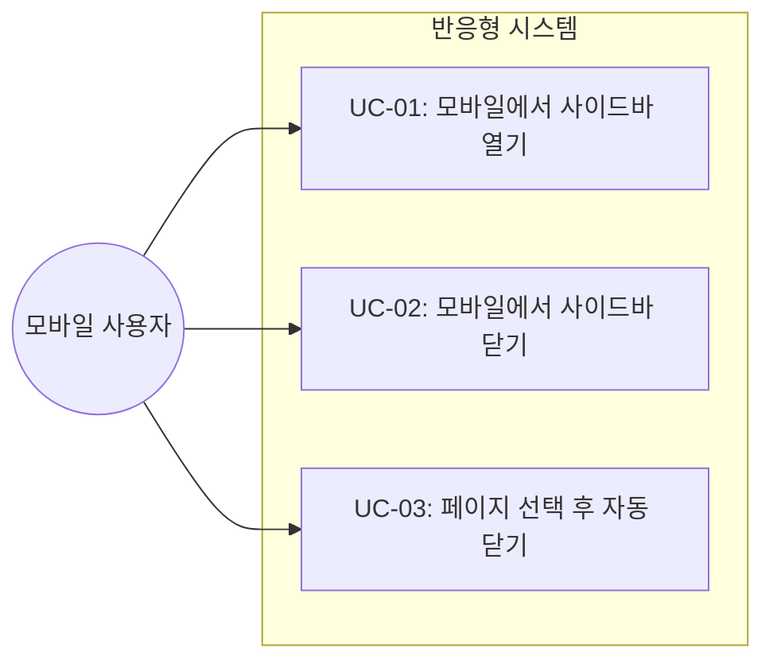

# TSK-03-01 - 반응형 레이아웃 적용 설계 문서

## 문서 정보

| 항목 | 내용 |
|------|------|
| Task ID | TSK-03-01 |
| 문서 버전 | 1.0 |
| 작성일 | 2026-01-03 |
| 상태 | 작성중 |
| 카테고리 | development |

---

## 1. 개요

### 1.1 배경 및 문제 정의

**현재 상황:**
- MainLayout과 Sidebar 컴포넌트는 고정 너비(240px)로 설계됨
- 모바일 기기에서 사이드바가 화면의 대부분을 차지하여 에디터 영역이 좁아짐
- 에디터 패딩이 96px로 고정되어 좁은 화면에서 콘텐츠 영역이 부족함

**해결하려는 문제:**
- 768px 이하의 화면에서 사이드바가 에디터 영역을 가려 사용성 저하
- 모바일 사용자가 사이드바와 에디터를 동시에 볼 수 없음
- 반응형 패딩이 적용되어 있지 않아 모바일 화면에서 콘텐츠 공간 부족

### 1.2 목적 및 기대 효과

**목적:**
- 768px 이하에서 사이드바를 오버레이 방식으로 전환
- 화면 크기에 따른 에디터 패딩 최적화
- 햄버거 메뉴로 모바일 친화적인 네비게이션 제공

**기대 효과:**
- 모바일 기기에서 전체 화면 에디터 사용 가능
- 사이드바를 필요할 때만 열어 네비게이션
- 일관된 사용자 경험 제공 (데스크톱/모바일)

### 1.3 범위

**포함:**
- MainLayout 컴포넌트 반응형 수정
- 모바일 사이드바 오버레이 구현
- 햄버거 메뉴 버튼 추가
- 에디터 영역 반응형 패딩 적용
- 오버레이 배경(backdrop) 구현

**제외:**
- 사이드바 내부 컴포넌트 반응형 수정 (별도 Task)
- 터치 제스처 (스와이프 열기/닫기)
- 태블릿 전용 레이아웃 (768px-1024px 범위)

### 1.4 참조 문서

| 문서 | 경로 | 관련 섹션 |
|------|------|----------|
| WBS | `.orchay/projects/notion-like/wbs.yaml` | TSK-03-01 requirements |
| globals.css | `notion-like/src/app/globals.css` | 기존 반응형 스타일 |

---

## 2. 사용자 분석

### 2.1 대상 사용자

| 사용자 유형 | 특성 | 주요 니즈 |
|------------|------|----------|
| 모바일 사용자 | 스마트폰에서 앱 접속, 터치 인터페이스 | 전체 화면 에디터, 쉬운 네비게이션 |
| 태블릿 사용자 | 중간 화면 크기, 터치 인터페이스 | 사이드바와 에디터 동시 사용 가능 |
| 데스크톱 사용자 | 넓은 화면, 마우스/키보드 | 현재 레이아웃 유지 |

### 2.2 사용자 페르소나

**페르소나 1: 이동 중인 직장인**
- 역할: 지하철/버스에서 메모 확인
- 목표: 빠르게 페이지 내용 확인 및 간단한 편집
- 불만: 사이드바가 화면을 가려 내용을 볼 수 없음
- 시나리오: 출퇴근 시간에 스마트폰으로 오늘 할 일 확인

---

## 3. 유즈케이스

### 3.1 유즈케이스 다이어그램



### 3.2 유즈케이스 상세

#### UC-01: 모바일에서 사이드바 열기

| 항목 | 내용 |
|------|------|
| 액터 | 모바일 사용자 |
| 목적 | 페이지 목록 확인 및 네비게이션 |
| 사전 조건 | 768px 이하 화면, 사이드바 닫힘 상태 |
| 사후 조건 | 사이드바가 오버레이로 표시됨 |
| 트리거 | 햄버거 메뉴 버튼 클릭 |

**기본 흐름:**
1. 사용자가 좌측 상단 햄버거 메뉴 버튼을 탭한다
2. 사이드바가 화면 좌측에서 슬라이드 인 애니메이션으로 나타난다
3. 배경이 반투명 오버레이로 덮인다
4. 사용자가 페이지 목록을 볼 수 있다

#### UC-02: 모바일에서 사이드바 닫기

| 항목 | 내용 |
|------|------|
| 액터 | 모바일 사용자 |
| 목적 | 사이드바를 닫고 에디터에 집중 |
| 사전 조건 | 768px 이하 화면, 사이드바 열림 상태 |
| 사후 조건 | 사이드바가 숨겨짐 |
| 트리거 | 배경 오버레이 클릭 또는 X 버튼 클릭 |

**기본 흐름:**
1. 사용자가 배경 오버레이 영역을 탭한다
2. 사이드바가 슬라이드 아웃 애니메이션으로 사라진다
3. 배경 오버레이가 페이드 아웃된다
4. 에디터가 전체 화면을 차지한다

**대안 흐름:**
- 1a. 사용자가 사이드바 상단의 X 버튼을 탭하면:
  - 같은 방식으로 사이드바가 닫힌다

#### UC-03: 페이지 선택 후 자동 닫기

| 항목 | 내용 |
|------|------|
| 액터 | 모바일 사용자 |
| 목적 | 페이지 이동 시 자동으로 사이드바 닫기 |
| 사전 조건 | 768px 이하 화면, 사이드바 열림 상태 |
| 사후 조건 | 선택한 페이지로 이동, 사이드바 닫힘 |
| 트리거 | 페이지 트리 아이템 클릭 |

**기본 흐름:**
1. 사용자가 사이드바에서 페이지를 탭한다
2. 해당 페이지로 라우팅된다
3. 사이드바가 자동으로 닫힌다
4. 에디터에 선택한 페이지가 로드된다

---

## 4. 사용자 시나리오

### 4.1 시나리오 1: 모바일에서 다른 페이지로 이동

**상황 설명:**
지하철에서 스마트폰으로 앱에 접속한 사용자가 다른 페이지를 확인하려고 한다.

**단계별 진행:**

| 단계 | 사용자 행동 | 시스템 반응 | 사용자 기대 |
|------|-----------|------------|------------|
| 1 | 앱 접속 | 에디터 전체 화면 표시, 좌측 상단 햄버거 메뉴 | 콘텐츠가 잘 보인다 |
| 2 | 햄버거 메뉴 탭 | 사이드바 슬라이드 인, 배경 오버레이 | 페이지 목록이 보인다 |
| 3 | 원하는 페이지 탭 | 페이지 이동, 사이드바 자동 닫힘 | 선택한 페이지가 열린다 |

**성공 조건:**
- 페이지 이동이 완료됨
- 사이드바가 자동으로 닫혀 에디터 전체 화면 확보

### 4.2 시나리오 2: 사이드바 닫기 (배경 클릭)

**상황 설명:**
사이드바를 열었다가 페이지를 선택하지 않고 닫으려고 한다.

**단계별 진행:**

| 단계 | 사용자 행동 | 시스템 반응 | 복구 방법 |
|------|-----------|------------|----------|
| 1 | 배경 오버레이 탭 | 사이드바 슬라이드 아웃, 오버레이 페이드 아웃 | - |

---

## 5. 화면 설계

### 5.1 화면 흐름도


### 5.2 화면별 상세

#### 화면 1: 모바일 레이아웃 - 사이드바 닫힘

**화면 목적:**
모바일에서 에디터를 전체 화면으로 표시하여 콘텐츠 편집에 집중

**진입 경로:**
- 앱 첫 접속
- 사이드바 닫기 후

**와이어프레임:**
```
┌─────────────────────────────────────────────────────────┐
│  [≡]                                                     │ ← 햄버거 메뉴
├─────────────────────────────────────────────────────────┤
│                                                          │
│                                                          │
│                    에디터 전체 화면                       │
│                    (패딩: 24px)                          │
│                                                          │
│                                                          │
│                                                          │
│                                                          │
└─────────────────────────────────────────────────────────┘
```

**화면 요소 설명:**

| 영역 | 설명 | 사용자 인터랙션 |
|------|------|----------------|
| 햄버거 메뉴 | 좌측 상단 Menu 아이콘 | 탭 시 사이드바 오버레이 열림 |
| 에디터 영역 | 전체 화면, 24px 패딩 | 콘텐츠 편집 |

#### 화면 2: 모바일 레이아웃 - 사이드바 열림

**화면 목적:**
페이지 네비게이션을 위한 사이드바 오버레이 표시

**와이어프레임:**
```
┌─────────────────────────────────────────────────────────┐
│ ┌────────────────────┐ ▓▓▓▓▓▓▓▓▓▓▓▓▓▓▓▓▓▓▓▓▓▓▓▓▓▓▓▓▓▓▓ │
│ │  [X] Orchay Notes  │ ▓▓▓▓▓▓▓▓▓▓▓▓▓▓▓▓▓▓▓▓▓▓▓▓▓▓▓▓▓▓▓ │
│ │ ─────────────────  │ ▓▓▓▓▓▓▓▓▓▓▓▓▓▓▓▓▓▓▓▓▓▓▓▓▓▓▓▓▓▓▓ │
│ │  🔍 Search    ⌘K  │ ▓▓▓▓▓▓▓▓▓▓▓▓▓▓▓▓▓▓▓▓▓▓▓▓▓▓▓▓▓▓▓ │
│ │  📥 Updates        │ ▓▓▓▓▓▓▓▓▓▓▓▓▓▓▓▓▓▓▓▓▓▓▓▓▓▓▓▓▓▓▓ │
│ │  ⚙️ Settings       │ ▓▓▓ 반투명 오버레이 (클릭 시 닫힘) ▓▓▓ │
│ │ ─────────────────  │ ▓▓▓▓▓▓▓▓▓▓▓▓▓▓▓▓▓▓▓▓▓▓▓▓▓▓▓▓▓▓▓ │
│ │  FAVORITES         │ ▓▓▓▓▓▓▓▓▓▓▓▓▓▓▓▓▓▓▓▓▓▓▓▓▓▓▓▓▓▓▓ │
│ │  📄 Page 1         │ ▓▓▓▓▓▓▓▓▓▓▓▓▓▓▓▓▓▓▓▓▓▓▓▓▓▓▓▓▓▓▓ │
│ │  PRIVATE           │ ▓▓▓▓▓▓▓▓▓▓▓▓▓▓▓▓▓▓▓▓▓▓▓▓▓▓▓▓▓▓▓ │
│ │  📄 Page 2         │ ▓▓▓▓▓▓▓▓▓▓▓▓▓▓▓▓▓▓▓▓▓▓▓▓▓▓▓▓▓▓▓ │
│ │ ─────────────────  │ ▓▓▓▓▓▓▓▓▓▓▓▓▓▓▓▓▓▓▓▓▓▓▓▓▓▓▓▓▓▓▓ │
│ │  [+] New page      │ ▓▓▓▓▓▓▓▓▓▓▓▓▓▓▓▓▓▓▓▓▓▓▓▓▓▓▓▓▓▓▓ │
│ └────────────────────┘ ▓▓▓▓▓▓▓▓▓▓▓▓▓▓▓▓▓▓▓▓▓▓▓▓▓▓▓▓▓▓▓ │
└─────────────────────────────────────────────────────────┘
   ← 사이드바 240px →   ← 배경 오버레이 →
```

**화면 요소 설명:**

| 영역 | 설명 | 사용자 인터랙션 |
|------|------|----------------|
| 사이드바 | 240px 너비, absolute 위치, z-50 | 페이지 선택, 검색 등 |
| X 버튼 | 사이드바 상단 좌측 | 탭 시 사이드바 닫힘 |
| 배경 오버레이 | 반투명 검정 (opacity 0.5) | 탭 시 사이드바 닫힘 |

### 5.3 반응형 동작

| 화면 크기 | 레이아웃 변화 | 사용자 경험 |
|----------|--------------|------------|
| 데스크톱 (768px+) | 사이드바 고정 + 에디터 flex-1, 패딩 96px | 양측 동시 표시 |
| 모바일 (767px-) | 사이드바 오버레이 (absolute z-50), 패딩 24px | 전체 화면 에디터, 필요시 사이드바 열기 |

---

## 6. 인터랙션 설계

### 6.1 사용자 액션과 피드백

| 사용자 액션 | 즉각 피드백 | 결과 피드백 | 에러 피드백 |
|------------|-----------|------------|------------|
| 햄버거 메뉴 탭 | 버튼 호버 효과 | 사이드바 슬라이드 인 (200ms) | - |
| 배경 오버레이 탭 | 오버레이 반응 | 사이드바 슬라이드 아웃 (200ms) | - |
| X 버튼 탭 | 버튼 호버 효과 | 사이드바 슬라이드 아웃 | - |
| 페이지 선택 | 아이템 하이라이트 | 페이지 이동 + 사이드바 자동 닫힘 | - |

### 6.2 상태별 화면 변화

| 상태 | 화면 표시 | 사용자 안내 |
|------|----------|------------|
| 모바일 + 사이드바 닫힘 | 햄버거 메뉴 표시, 에디터 전체 화면 | - |
| 모바일 + 사이드바 열림 | 사이드바 오버레이 + 배경 오버레이 | - |
| 데스크톱 + 사이드바 닫힘 | 햄버거 메뉴 표시 (현재와 동일) | - |
| 데스크톱 + 사이드바 열림 | 사이드바 고정 + 에디터 (현재와 동일) | - |

### 6.3 키보드/접근성

| 기능 | 키보드 단축키 | 스크린 리더 안내 |
|------|-------------|-----------------|
| 사이드바 토글 | - | "사이드바 열기/닫기 버튼" |
| 오버레이 닫기 | Esc | "사이드바 닫기" |

---

## 7. 데이터 요구사항

### 7.1 필요한 데이터

| 데이터 | 설명 | 출처 | 용도 |
|--------|------|------|------|
| sidebarOpen | 사이드바 열림/닫힘 상태 | Zustand store | 레이아웃 결정 |
| isMobile | 모바일 여부 (768px 이하) | CSS media query / JS | 레이아웃 모드 결정 |

### 7.2 데이터 관계

Zustand store의 `sidebarOpen` 상태만 사용하며, 추가 데이터 모델 변경 없음.

### 7.3 데이터 유효성 규칙

해당 없음 (UI 상태만 관리)

---

## 8. 비즈니스 규칙

### 8.1 핵심 규칙

| 규칙 ID | 규칙 설명 | 적용 상황 | 예외 |
|---------|----------|----------|------|
| BR-01 | 768px 이하에서 사이드바는 오버레이로 동작 | 모바일 뷰포트 | 없음 |
| BR-02 | 모바일에서 페이지 선택 시 사이드바 자동 닫힘 | 모바일 + 페이지 클릭 | 없음 |
| BR-03 | 에디터 패딩: 데스크톱 96px, 모바일 24px | 뷰포트 크기에 따라 | 없음 |

### 8.2 규칙 상세 설명

**BR-01: 모바일 사이드바 오버레이 모드**

설명: 768px 이하의 화면에서는 사이드바가 에디터 위에 오버레이로 표시된다.

예시:
- 데스크톱(1024px)일 때: 사이드바가 에디터 왼쪽에 고정
- 모바일(375px)일 때: 사이드바가 absolute로 에디터 위에 겹침

**BR-02: 자동 닫힘 동작**

설명: 모바일에서 페이지를 선택하면 사이드바가 자동으로 닫혀 편집에 집중할 수 있도록 한다.

---

## 9. 에러 처리

### 9.1 예상 에러 상황

| 상황 | 원인 | 사용자 메시지 | 복구 방법 |
|------|------|--------------|----------|
| - | - | - | - |

반응형 레이아웃은 에러 상황이 거의 발생하지 않음.

---

## 10. 연관 문서

> 상세 테스트 명세 및 요구사항 추적은 별도 문서에서 관리합니다.

| 문서 | 경로 | 용도 |
|------|------|------|
| 요구사항 추적 매트릭스 | `025-traceability-matrix.md` | PRD → 설계 → 테스트 양방향 추적 |
| 테스트 명세서 | `026-test-specification.md` | 단위/E2E/매뉴얼 테스트 상세 정의 |

---

## 11. 구현 범위

### 11.1 영향받는 영역

| 영역 | 변경 내용 | 영향도 |
|------|----------|--------|
| MainLayout.tsx | 반응형 사이드바 로직 추가, 오버레이/backdrop 구현 | 높음 |
| globals.css | 모바일 에디터 패딩 (기존에 적용됨) | 낮음 |
| Zustand store | closeSidebarOnMobile() 추가 가능 | 중간 |

### 11.2 의존성

| 의존 항목 | 이유 | 상태 |
|----------|------|------|
| TSK-02-99 (WP-02 통합 검증) | 기본 레이아웃 완성 필요 | 완료 ([dd]) |

### 11.3 제약 사항

| 제약 | 설명 | 대응 방안 |
|------|------|----------|
| CSS Media Query 한계 | JS에서 뷰포트 크기 감지 필요 | window.matchMedia 또는 Tailwind 반응형 클래스 활용 |
| 애니메이션 성능 | 저사양 기기에서 슬라이드 애니메이션 버벅임 | transform 기반 애니메이션 사용 |

---

## 12. 체크리스트

### 12.1 설계 완료 확인

- [x] 문제 정의 및 목적 명확화
- [x] 사용자 분석 완료
- [x] 유즈케이스 정의 완료
- [x] 사용자 시나리오 작성 완료
- [x] 화면 설계 완료 (와이어프레임)
- [x] 인터랙션 설계 완료
- [x] 데이터 요구사항 정의 완료
- [x] 비즈니스 규칙 정의 완료
- [x] 에러 처리 정의 완료

### 12.2 연관 문서 작성

- [ ] 요구사항 추적 매트릭스 작성 (→ `025-traceability-matrix.md`)
- [ ] 테스트 명세서 작성 (→ `026-test-specification.md`)

### 12.3 구현 준비

- [x] 구현 우선순위 결정
- [x] 의존성 확인 완료
- [x] 제약 사항 검토 완료

---

## 변경 이력

| 버전 | 일자 | 작성자 | 변경 내용 |
|------|------|--------|----------|
| 1.0 | 2026-01-03 | Claude | 최초 작성 |
