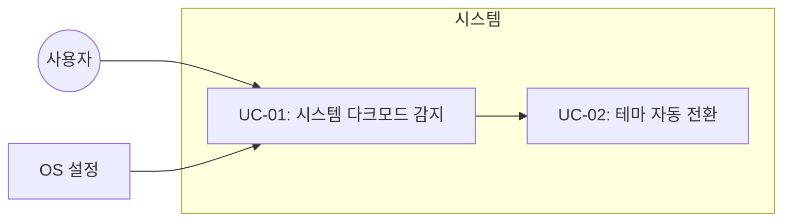

# TSK-03-02 - 다크모드 지원 설계 문서

## 문서 정보

| 항목 | 내용 |
|------|------|
| Task ID | TSK-03-02 |
| 문서 버전 | 1.0 |
| 작성일 | 2026-01-03 |
| 상태 | 작성중 |
| 카테고리 | development |

---

## 1. 개요

### 1.1 배경 및 문제 정의

**현재 상황:**
- globals.css에 다크모드 CSS 변수가 정의되어 있으나 (`prefers-color-scheme: dark` 미디어 쿼리)
- 실제 컴포넌트들은 하드코딩된 라이트 모드 색상값 사용
- Tailwind 설정에 darkMode 구성 없음
- 사용자가 OS 다크모드를 사용해도 UI가 여전히 라이트 모드로 표시

**해결하려는 문제:**
- 컴포넌트별 하드코딩된 색상값을 CSS 변수로 교체
- 시스템 다크모드 설정 자동 감지 및 적용
- BlockNote 에디터의 다크모드 스타일 지원

### 1.2 목적 및 기대 효과

**목적:**
- 시스템 다크모드 설정에 따른 자동 테마 전환
- 일관된 다크 테마 색상 시스템 적용

**기대 효과:**
- 사용자 눈의 피로도 감소 (야간 사용 시)
- 시스템 설정과 일관된 사용자 경험
- OLED 화면에서 배터리 절약

### 1.3 범위

**포함:**
- Tailwind darkMode 설정 추가
- 컴포넌트 하드코딩 색상 → CSS 변수 또는 dark: 클래스로 전환
- BlockNote 에디터 다크모드 CSS 오버라이드
- 색상 전환 트랜지션 효과

**제외:**
- 수동 토글 버튼 (선택적 - WBS에 따라 optional)
- 사용자별 테마 설정 저장 (DB)

### 1.4 참조 문서

| 문서 | 경로 | 관련 섹션 |
|------|------|----------|
| WBS | `.orchay/projects/notion-like/wbs.yaml` | TSK-03-02 |
| TRD | TRD 2.1 컬러 시스템 (Dark Mode) | 다크모드 팔레트 |

---

## 2. 사용자 분석

### 2.1 대상 사용자

| 사용자 유형 | 특성 | 주요 니즈 |
|------------|------|----------|
| 야간 사용자 | 밤에 작업하는 사용자 | 눈 피로 감소, 화면 밝기 저감 |
| 시스템 다크모드 사용자 | OS 다크모드 활성화 | 앱과 시스템 간 일관된 테마 |
| OLED 디바이스 사용자 | OLED 화면 사용 | 배터리 절약 |

### 2.2 사용자 페르소나

**페르소나 1: 야간 작업자**
- 역할: 프리랜서 작가/개발자
- 목표: 밤에도 편안하게 노트 작성
- 불만: 라이트 모드가 밤에 눈부심
- 시나리오: OS 다크모드 설정 시 앱도 자동으로 다크 테마 적용 기대

---

## 3. 유즈케이스

### 3.1 유즈케이스 다이어그램



### 3.2 유즈케이스 상세

#### UC-01: 시스템 다크모드 감지

| 항목 | 내용 |
|------|------|
| 액터 | 시스템 |
| 목적 | OS의 color-scheme 설정 감지 |
| 사전 조건 | 앱 로드됨 |
| 사후 조건 | 현재 테마 상태 확인됨 |
| 트리거 | 앱 시작 또는 OS 설정 변경 |

**기본 흐름:**
1. 앱이 로드된다
2. CSS `prefers-color-scheme` 미디어 쿼리가 OS 설정을 감지한다
3. 감지된 테마에 따라 CSS 변수가 적용된다

#### UC-02: 테마 자동 전환

| 항목 | 내용 |
|------|------|
| 액터 | 사용자 |
| 목적 | 테마 색상 자동 변경 |
| 사전 조건 | 다크모드 CSS 정의됨 |
| 사후 조건 | UI가 다크/라이트 테마로 표시됨 |
| 트리거 | OS 다크모드 설정 변경 |

**기본 흐름:**
1. 사용자가 OS 다크모드를 활성화한다
2. 브라우저가 `prefers-color-scheme: dark` 감지
3. CSS 변수가 다크 팔레트로 전환된다
4. 모든 컴포넌트가 다크 테마로 렌더링된다

---

## 4. 사용자 시나리오

### 4.1 시나리오 1: 시스템 다크모드 자동 적용

**상황 설명:**
야간에 작업하는 사용자가 OS 다크모드를 활성화한 상태에서 앱에 접속

**단계별 진행:**

| 단계 | 사용자 행동 | 시스템 반응 | 사용자 기대 |
|------|-----------|------------|------------|
| 1 | OS 다크모드 활성화 | - | 시스템 전체가 다크 테마 |
| 2 | 앱 접속 | 다크 테마로 렌더링 | 앱도 어두운 배경 표시 |
| 3 | 사이드바 확인 | 어두운 배경의 사이드바 | 눈부심 없음 |
| 4 | 에디터 사용 | 다크 테마 에디터 | 텍스트 가독성 유지 |

**성공 조건:**
- 모든 UI 요소가 다크 팔레트로 표시됨
- 텍스트 가독성 유지 (충분한 대비)

### 4.2 시나리오 2: 다크모드 ↔ 라이트모드 전환

**상황 설명:**
사용자가 OS 설정에서 다크모드를 토글

**단계별 진행:**

| 단계 | 사용자 행동 | 시스템 반응 | 사용자 기대 |
|------|-----------|------------|------------|
| 1 | OS 다크모드 해제 | 라이트 테마로 전환 | 부드러운 색상 전환 |
| 2 | 계속 작업 | 에디터 내용 유지 | 데이터 손실 없음 |

---

## 5. 화면 설계

### 5.1 다크모드 컬러 팔레트

```
┌──────────────────────────────────────────────────────────────────┐
│                        다크모드 팔레트                            │
├──────────────────────────────────────────────────────────────────┤
│                                                                  │
│  Background                                                      │
│  ┌─────────┐  ┌─────────┐  ┌─────────┐                          │
│  │ Primary │  │Secondary│  │Tertiary │                          │
│  │ #191919 │  │ #2A2A2A │  │ #3A3A37 │                          │
│  └─────────┘  └─────────┘  └─────────┘                          │
│                                                                  │
│  Text                                                            │
│  ┌─────────┐  ┌─────────┐  ┌─────────┐                          │
│  │ Primary │  │Secondary│  │Tertiary │                          │
│  │ #E6E6E4 │  │ #B3B3B1 │  │ #808080 │                          │
│  └─────────┘  └─────────┘  └─────────┘                          │
│                                                                  │
│  Border                                                          │
│  ┌─────────┐  ┌─────────┐                                       │
│  │  Light  │  │ Medium  │                                       │
│  │ #3D3D3A │  │ #4D4D4A │                                       │
│  └─────────┘  └─────────┘                                       │
│                                                                  │
└──────────────────────────────────────────────────────────────────┘
```

### 5.2 컴포넌트별 다크모드 매핑

#### MainLayout & Sidebar

```
라이트모드                           다크모드
┌────────────┬───────────────┐      ┌────────────┬───────────────┐
│            │               │      │            │               │
│  Sidebar   │    Editor     │      │  Sidebar   │    Editor     │
│  #F7F6F3   │    #FFFFFF    │      │  #2A2A2A   │    #191919    │
│            │               │      │            │               │
│  text:     │               │      │  text:     │               │
│  #37352F   │               │      │  #E6E6E4   │               │
│            │               │      │            │               │
└────────────┴───────────────┘      └────────────┴───────────────┘
```

#### Editor Area

```
다크모드 에디터
┌─────────────────────────────────────────────────────────────┐
│  ┌───────────────────────────────────────────────────────┐  │
│  │  🔹  Page Title                     (#E6E6E4 text)    │  │
│  │      ─────────────────────────────                    │  │
│  └───────────────────────────────────────────────────────┘  │
│                                                             │
│  ┌───────────────────────────────────────────────────────┐  │
│  │                                                       │  │
│  │  본문 텍스트...                      (#E6E6E4)        │  │
│  │                                                       │  │
│  │  ┌─────────────────────────────────────────────────┐  │  │
│  │  │  Code Block                     (#2A2A2A bg)    │  │  │
│  │  │  const example = 'dark';                        │  │  │
│  │  └─────────────────────────────────────────────────┘  │  │
│  │                                                       │  │
│  │  > 인용문                           (#808080 text)   │  │
│  │                                                       │  │
│  └───────────────────────────────────────────────────────┘  │
│                                           bg: #191919       │
└─────────────────────────────────────────────────────────────┘
```

### 5.3 반응형 동작

| 화면 크기 | 다크모드 동작 |
|----------|--------------|
| 모든 크기 | 시스템 설정에 따라 동일하게 적용 |

---

## 6. 인터랙션 설계

### 6.1 색상 전환 트랜지션

| 속성 | 값 | 설명 |
|------|-----|------|
| transition-property | background-color, color, border-color | 전환할 속성 |
| transition-duration | 150ms | 부드럽지만 빠른 전환 |
| transition-timing-function | ease | 자연스러운 가속/감속 |

### 6.2 상태별 화면 변화

| 상태 | 배경 | 텍스트 | 보더 |
|------|------|--------|------|
| 라이트모드 | #FFFFFF, #F7F6F3 | #37352F | #E9E9E7 |
| 다크모드 | #191919, #2A2A2A | #E6E6E4 | #3D3D3A |

---

## 7. 데이터 요구사항

### 7.1 필요한 데이터

| 데이터 | 설명 | 출처 | 용도 |
|--------|------|------|------|
| color-scheme | 시스템 테마 설정 | OS/브라우저 | 테마 결정 |

### 7.2 데이터 저장

이 Task에서는 테마 설정을 DB에 저장하지 않음 (시스템 설정만 사용)

---

## 8. 비즈니스 규칙

### 8.1 핵심 규칙

| 규칙 ID | 규칙 설명 | 적용 상황 |
|---------|----------|----------|
| BR-01 | 시스템 다크모드 설정에 따라 자동 전환 | 항상 |
| BR-02 | 텍스트 대비율 최소 4.5:1 유지 | 다크모드 시 |
| BR-03 | 색상 전환 시 콘텐츠 손실 없음 | 모드 전환 시 |

---

## 9. 에러 처리

### 9.1 예상 에러 상황

| 상황 | 원인 | 대응 |
|------|------|------|
| CSS 변수 미지원 브라우저 | 구형 브라우저 | 라이트모드 폴백 |
| prefers-color-scheme 미지원 | 구형 브라우저 | 라이트모드 기본값 |

---

## 10. 구현 전략

### 10.1 수정 필요 파일 목록

| 파일 | 현재 상태 | 변경 내용 |
|------|----------|----------|
| `tailwind.config.ts` | darkMode 없음 | `darkMode: 'media'` 추가 |
| `src/app/layout.tsx` | `bg-white text-gray-900` 고정 | CSS 변수 사용 |
| `src/components/layout/MainLayout.tsx` | `bg-[#F7F6F3]` 고정 | CSS 변수 또는 dark: 클래스 |
| `src/components/layout/Sidebar.tsx` | `bg-[#F7F6F3]` 고정 | CSS 변수 또는 dark: 클래스 |
| `src/components/editor/PageHeader.tsx` | `bg-white` 고정 | CSS 변수 사용 |
| `src/app/[pageId]/page.tsx` | `bg-white` 고정 | CSS 변수 사용 |
| `src/app/globals.css` | 부분 구현 | BlockNote 다크모드 스타일 추가 |

### 10.2 구현 순서

1. **Tailwind 설정**: `darkMode: 'media'` 설정
2. **글로벌 스타일**: globals.css에 dark 모드 BlockNote 스타일 추가
3. **레이아웃 컴포넌트**: layout.tsx, MainLayout.tsx 수정
4. **사이드바**: Sidebar.tsx 다크모드 적용
5. **에디터 영역**: PageHeader.tsx, [pageId]/page.tsx 수정
6. **UI 컴포넌트**: ContextMenu, DeleteModal, IconPicker 등 확인

### 10.3 Tailwind darkMode 설정

```typescript
// tailwind.config.ts
export default {
  darkMode: 'media', // 시스템 설정 자동 감지
  // ...
}
```

### 10.4 CSS 변수 활용 패턴

**패턴 A: CSS 변수 직접 사용**
```tsx
// Before
<div className="bg-[#F7F6F3]">

// After
<div className="bg-[var(--notion-bg-secondary)]">
```

**패턴 B: Tailwind dark: variant 사용**
```tsx
<div className="bg-white dark:bg-[#191919]">
```

권장: 패턴 A (CSS 변수) - 이미 globals.css에 정의되어 있으므로

### 10.5 BlockNote 다크모드 CSS 추가

```css
/* globals.css에 추가 */
@media (prefers-color-scheme: dark) {
  .bn-popover {
    background-color: var(--notion-bg-secondary);
    border-color: var(--notion-border-light);
  }

  .bn-menu-item:hover {
    background-color: var(--notion-bg-tertiary);
  }

  .bn-code-block {
    background-color: var(--notion-bg-secondary);
  }
}
```

---

## 11. 영향받는 영역

| 영역 | 변경 내용 | 영향도 |
|------|----------|--------|
| tailwind.config.ts | darkMode 설정 추가 | 중간 |
| globals.css | BlockNote 다크모드 스타일 | 중간 |
| layout.tsx | 배경색, 텍스트색 | 높음 |
| MainLayout.tsx | 배경색 | 중간 |
| Sidebar.tsx | 배경색, 텍스트색, 보더 | 높음 |
| PageHeader.tsx | 배경색 | 중간 |
| [pageId]/page.tsx | 배경색 | 중간 |

---

## 12. 체크리스트

### 12.1 설계 완료 확인

- [x] 문제 정의 및 목적 명확화
- [x] 사용자 분석 완료
- [x] 유즈케이스 정의 완료
- [x] 사용자 시나리오 작성 완료
- [x] 화면 설계 완료 (색상 팔레트)
- [x] 인터랙션 설계 완료
- [x] 비즈니스 규칙 정의 완료
- [x] 에러 처리 정의 완료

### 12.2 구현 준비

- [x] 구현 우선순위 결정
- [x] 의존성 확인 완료 (TSK-03-01 반응형 레이아웃)
- [x] 제약 사항 검토 완료

---

## 변경 이력

| 버전 | 일자 | 작성자 | 변경 내용 |
|------|------|--------|----------|
| 1.0 | 2026-01-03 | Claude | 최초 작성 |
