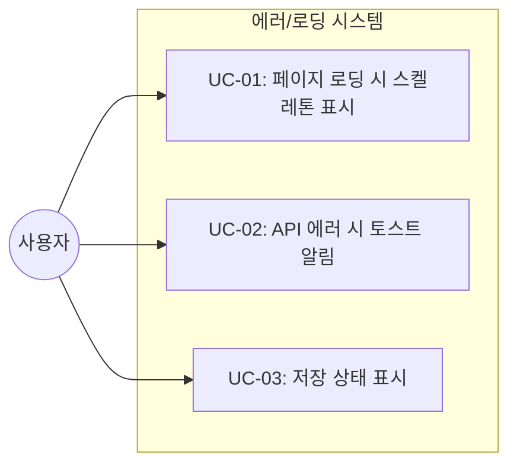

# TSK-03-03 - 에러 처리 및 로딩 상태 설계 문서

## 문서 정보

| 항목 | 내용 |
|------|------|
| Task ID | TSK-03-03 |
| 문서 버전 | 1.0 |
| 작성일 | 2026-01-03 |
| 상태 | 작성중 |
| 카테고리 | development |

---

## 1. 개요

### 1.1 배경 및 문제 정의

**현재 상황:**
- 페이지 로딩 시 단순 텍스트("불러오는 중...")만 표시되어 사용자 경험이 저하됨
- API 에러 발생 시 콘솔에만 로그가 남고, 사용자에게 명확한 피드백이 부족함
- 저장 상태 표시가 헤더 우측에만 있어 가시성이 낮음
- 네트워크 오류 시 복구 방법이 제공되지 않음

**해결하려는 문제:**
- 로딩 중 시각적 피드백 부재로 인한 UX 저하
- 에러 상황에서 사용자가 다음 행동을 알 수 없음
- 저장 상태의 명확한 피드백 부족

### 1.2 목적 및 기대 효과

**목적:**
- API 에러 발생 시 사용자에게 명확한 토스트 알림 제공
- 페이지 로딩 시 스켈레톤 UI로 시각적 피드백 제공
- 에디터 저장 상태를 명확하게 표시

**기대 효과:**
- 사용자 경험 향상 (로딩/저장/에러 상태 명확화)
- 에러 상황에서 복구 가능한 액션 제공
- Notion과 유사한 세련된 피드백 시스템

### 1.3 범위

**포함:**
- 토스트 알림 컴포넌트 구현
- 페이지 로딩 스켈레톤 컴포넌트 구현
- 에디터 저장 상태 표시 개선
- 기존 에러 처리 로직 토스트 연동

**제외:**
- 오프라인 모드 지원 (향후 과제)
- 에러 로깅/모니터링 서비스 연동
- 재시도 자동화 로직

### 1.4 참조 문서

| 문서 | 경로 | 관련 섹션 |
|------|------|----------|
| WBS | `.orchay/projects/notion-like/wbs.yaml` | TSK-03-03 |

---

## 2. 사용자 분석

### 2.1 대상 사용자

| 사용자 유형 | 특성 | 주요 니즈 |
|------------|------|----------|
| 일반 사용자 | 노트 작성/편집 수행 | 작업 상태를 명확히 알고 싶음 |
| 모바일 사용자 | 불안정한 네트워크 환경 | 저장 여부 확인, 에러 복구 |

### 2.2 사용자 페르소나

**페르소나 1: 김민수 (직장인)**
- 역할: 업무 노트 작성
- 목표: 빠르게 노트를 작성하고 저장 확인
- 불만: 저장 됐는지 알 수 없어 불안함
- 시나리오: 회의 중 노트 작성 후 저장 확인 필요

---

## 3. 유즈케이스

### 3.1 유즈케이스 다이어그램



### 3.2 유즈케이스 상세

#### UC-01: 페이지 로딩 시 스켈레톤 표시

| 항목 | 내용 |
|------|------|
| 액터 | 사용자 |
| 목적 | 로딩 중임을 시각적으로 인지 |
| 사전 조건 | 페이지 URL로 진입 |
| 사후 조건 | 실제 콘텐츠 표시 |
| 트리거 | 페이지 데이터 fetch 시작 |

**기본 흐름:**
1. 사용자가 페이지에 접근한다
2. 시스템이 데이터 로딩을 시작한다
3. 스켈레톤 UI가 표시된다 (헤더, 에디터 영역)
4. 데이터 로딩이 완료된다
5. 실제 콘텐츠로 교체된다

**예외 흐름:**
- 3a. 로딩 시간이 3초 초과 시:
  - 스켈레톤 아래 "로딩이 오래 걸리고 있습니다" 텍스트 표시

#### UC-02: API 에러 시 토스트 알림

| 항목 | 내용 |
|------|------|
| 액터 | 시스템 |
| 목적 | 에러 상황을 사용자에게 알림 |
| 사전 조건 | API 호출 실패 |
| 사후 조건 | 사용자가 에러 인지 |
| 트리거 | API 응답 에러 (4xx, 5xx, 네트워크) |

**기본 흐름:**
1. API 호출이 실패한다
2. 에러 유형을 판별한다
3. 토스트 알림이 화면 우측 하단에 표시된다
4. 3초 후 자동으로 사라진다

**에러 유형별 메시지:**
| HTTP 상태 | 메시지 |
|----------|--------|
| 400 | 잘못된 요청입니다 |
| 401/403 | 권한이 없습니다 |
| 404 | 페이지를 찾을 수 없습니다 |
| 500+ | 서버 오류가 발생했습니다 |
| Network | 네트워크 연결을 확인해주세요 |

#### UC-03: 저장 상태 표시

| 항목 | 내용 |
|------|------|
| 액터 | 사용자 |
| 목적 | 저장 진행 상태 확인 |
| 사전 조건 | 에디터에서 콘텐츠 편집 |
| 사후 조건 | 저장 완료 확인 |
| 트리거 | 에디터 onChange 이벤트 |

**기본 흐름:**
1. 사용자가 에디터에서 내용을 수정한다
2. "저장 중..." 표시가 나타난다
3. 저장이 완료된다
4. "저장됨" 표시로 변경된다
5. 2초 후 표시가 사라진다

---

## 4. 사용자 시나리오

### 4.1 시나리오 1: 정상 페이지 로딩

**상황 설명:**
김민수가 이전에 작성한 "회의록" 페이지에 접근한다.

**단계별 진행:**

| 단계 | 사용자 행동 | 시스템 반응 | 사용자 기대 |
|------|-----------|------------|------------|
| 1 | URL 클릭/입력 | 스켈레톤 UI 표시 | 로딩 중임을 인지 |
| 2 | 대기 | 데이터 로딩 | 곧 콘텐츠가 보일 것 |
| 3 | - | 실제 콘텐츠 표시 | 자연스러운 전환 |

**성공 조건:**
- 스켈레톤에서 실제 콘텐츠로 부드럽게 전환됨

### 4.2 시나리오 2: 저장 중 에러 발생

**상황 설명:**
네트워크가 불안정한 상태에서 노트를 작성하다가 저장이 실패한다.

**단계별 진행:**

| 단계 | 사용자 행동 | 시스템 반응 | 복구 방법 |
|------|-----------|------------|----------|
| 1 | 콘텐츠 수정 | "저장 중..." 표시 | - |
| 2 | - | API 호출 실패 | - |
| 3 | - | 토스트: "저장 실패. 다시 시도해주세요" | 다시 수정하여 저장 시도 |

---

## 5. 화면 설계

### 5.1 화면 흐름도


### 5.2 화면별 상세

#### 화면 1: 페이지 로딩 스켈레톤

**화면 목적:**
페이지 데이터 로딩 중 사용자에게 콘텐츠 구조를 미리 보여줌

**와이어프레임:**
```
┌─────────────────────────────────────────────────────────┐
│  ┌───────────────────────────────────────────────────┐  │
│  │  [████████████████████████████]  커버 스켈레톤    │  │
│  │                                                   │  │
│  └───────────────────────────────────────────────────┘  │
│                                                         │
│  [🔳] ← 아이콘 스켈레톤 (78x78)                         │
│                                                         │
│  [████████████████] ← 제목 스켈레톤 (40% 너비)         │
│                                                         │
│  [████████████████████████████] ← 본문 라인 1          │
│  [██████████████████████] ← 본문 라인 2                │
│  [████████████████████████████████] ← 본문 라인 3     │
│  [██████████████] ← 본문 라인 4                        │
│                                                         │
└─────────────────────────────────────────────────────────┘
```

**스켈레톤 스타일:**
- 배경색: `#EFEFEF` (라이트), `#3A3A37` (다크)
- 애니메이션: `pulse` (1.5s ease-in-out infinite)
- 모서리: `rounded-md` (4px)

#### 화면 2: 토스트 알림

**화면 목적:**
API 에러 발생 시 사용자에게 알림

**와이어프레임:**
```
                                          ┌──────────────────────────┐
                                          │ ⚠️ 저장 실패             │
                                          │    다시 시도해주세요     │
                                          │                   [닫기] │
                                          └──────────────────────────┘
                                                         ↑
                                            화면 우측 하단에 위치
```

**토스트 스타일:**
| 유형 | 배경색 | 아이콘 | 테두리 |
|------|--------|--------|--------|
| error | `#FEE2E2` | ⚠️ | `#F87171` |
| success | `#D1FAE5` | ✅ | `#34D399` |
| info | `#DBEAFE` | ℹ️ | `#60A5FA` |

**화면 요소 설명:**

| 영역 | 설명 | 사용자 인터랙션 |
|------|------|----------------|
| 아이콘 | 에러/성공/정보 구분 | - |
| 메시지 | 상황 설명 | - |
| 닫기 버튼 | 수동 닫기 | 클릭 시 즉시 닫힘 |

### 5.3 반응형 동작

| 화면 크기 | 레이아웃 변화 | 사용자 경험 |
|----------|--------------|------------|
| 데스크톱 (1024px+) | 토스트 우측 하단, 320px 너비 | 작업 방해 최소화 |
| 태블릿 (768-1023px) | 토스트 중앙 하단, 280px 너비 | 적절한 가시성 |
| 모바일 (767px-) | 토스트 전체 너비, 하단 고정 | 명확한 알림 |

---

## 6. 인터랙션 설계

### 6.1 사용자 액션과 피드백

| 사용자 액션 | 즉각 피드백 | 결과 피드백 | 에러 피드백 |
|------------|-----------|------------|------------|
| 페이지 진입 | 스켈레톤 표시 | 콘텐츠 페이드인 | 에러 토스트 |
| 콘텐츠 편집 | - | "저장 중..." | "저장 실패" 토스트 |
| API 호출 | - | 성공 메시지 | 에러 토스트 |

### 6.2 상태별 화면 변화

| 상태 | 화면 표시 | 사용자 안내 |
|------|----------|------------|
| 초기 로딩 | 스켈레톤 UI | (애니메이션으로 로딩 중 표현) |
| 로딩 지연 (3초+) | 스켈레톤 + 텍스트 | "로딩이 오래 걸리고 있습니다..." |
| 저장 중 | 상태 배지 | "저장 중..." |
| 저장 완료 | 상태 배지 | "저장됨 ✓" |
| 에러 발생 | 토스트 알림 | 에러 메시지 + 복구 안내 |

### 6.3 토스트 동작

| 속성 | 값 | 설명 |
|------|-----|------|
| 표시 위치 | 우측 하단 | `bottom: 24px, right: 24px` |
| 표시 시간 | 3초 | 자동 닫힘 |
| 애니메이션 | slide-up + fade | 0.2s ease-out |
| 최대 개수 | 3개 | 오래된 것부터 제거 |
| 스택 방향 | 위로 쌓임 | 새 토스트가 아래에 추가 |

---

## 7. 데이터 요구사항

### 7.1 필요한 데이터

| 데이터 | 설명 | 출처 | 용도 |
|--------|------|------|------|
| 로딩 상태 | boolean | 컴포넌트 state | 스켈레톤 표시 여부 |
| 에러 정보 | { type, message } | API 응답 | 토스트 메시지 결정 |
| 저장 상태 | 'idle' \| 'saving' \| 'saved' \| 'error' | 컴포넌트 state | 저장 배지 표시 |

### 7.2 토스트 상태 관리

```typescript
interface Toast {
  id: string;
  type: 'error' | 'success' | 'info';
  message: string;
  duration?: number;  // 기본 3000ms
}

interface ToastState {
  toasts: Toast[];
  addToast: (toast: Omit<Toast, 'id'>) => void;
  removeToast: (id: string) => void;
}
```

---

## 8. 비즈니스 규칙

### 8.1 핵심 규칙

| 규칙 ID | 규칙 설명 | 적용 상황 | 예외 |
|---------|----------|----------|------|
| BR-01 | 토스트는 최대 3개까지 표시 | 모든 토스트 | - |
| BR-02 | 에러 토스트는 수동 닫기 전까지 유지 가능 | 심각한 에러 | 자동 닫힘 설정 시 |
| BR-03 | 스켈레톤은 최소 300ms 표시 | 로딩 시 | 빠른 응답 시에도 깜빡임 방지 |

### 8.2 규칙 상세 설명

**BR-01: 토스트 최대 개수**

설명: 화면에 동시 표시되는 토스트가 3개를 초과하면 가장 오래된 토스트를 자동 제거

예시:
- 토스트 4개 발생 시: 첫 번째 토스트 자동 제거

**BR-03: 스켈레톤 최소 표시 시간**

설명: 데이터가 매우 빠르게 로드되어도 최소 300ms 동안 스켈레톤을 표시하여 깜빡임 방지

---

## 9. 에러 처리

### 9.1 예상 에러 상황

| 상황 | 원인 | 사용자 메시지 | 복구 방법 |
|------|------|--------------|----------|
| 페이지 로드 실패 | API 에러 | "페이지를 불러오는 중 오류가 발생했습니다" | 새로고침 버튼 |
| 저장 실패 | 네트워크/서버 | "저장 실패. 다시 시도해주세요" | 재편집 시 자동 재시도 |
| 네트워크 오류 | 연결 끊김 | "네트워크 연결을 확인해주세요" | 연결 복구 후 자동 재시도 |
| 권한 없음 | 인증 만료 | "권한이 없습니다" | 재로그인 안내 |

### 9.2 에러 표시 방식

| 에러 유형 | 표시 위치 | 표시 방법 |
|----------|----------|----------|
| API 에러 | 토스트 (우측 하단) | error 타입 토스트 |
| 저장 실패 | 헤더 배지 + 토스트 | 빨간색 텍스트 + error 토스트 |
| 치명적 에러 | 전체 화면 | 에러 페이지 |

---

## 10. 연관 문서

> 상세 테스트 명세 및 요구사항 추적은 별도 문서에서 관리합니다.

| 문서 | 경로 | 용도 |
|------|------|------|
| 요구사항 추적 매트릭스 | `025-traceability-matrix.md` | PRD → 설계 → 테스트 양방향 추적 |
| 테스트 명세서 | `026-test-specification.md` | 단위/E2E/매뉴얼 테스트 상세 정의 |

---

## 11. 구현 범위

### 11.1 영향받는 영역

| 영역 | 변경 내용 | 영향도 |
|------|----------|--------|
| `src/components/ui/Toast.tsx` | 신규 컴포넌트 생성 | 높음 |
| `src/components/ui/Skeleton.tsx` | 신규 컴포넌트 생성 | 높음 |
| `src/components/ui/PageSkeleton.tsx` | 페이지 전용 스켈레톤 | 중간 |
| `src/lib/store.ts` | 토스트 상태 추가 | 중간 |
| `src/app/[pageId]/page.tsx` | 스켈레톤/토스트 연동 | 중간 |
| `src/app/layout.tsx` | ToastContainer 추가 | 낮음 |

### 11.2 의존성

| 의존 항목 | 이유 | 상태 |
|----------|------|------|
| TSK-03-02 (다크모드) | 토스트/스켈레톤 다크모드 스타일 | 진행중 |
| Zustand store | 토스트 상태 관리 | 완료 |
| Tailwind CSS | 애니메이션 및 스타일 | 완료 |

### 11.3 제약 사항

| 제약 | 설명 | 대응 방안 |
|------|------|----------|
| 외부 라이브러리 제한 | toast 라이브러리 사용 안함 | 직접 구현 |
| CSS 애니메이션 | Tailwind animate 클래스 활용 | 커스텀 keyframe 추가 |

---

## 12. 컴포넌트 설계

### 12.1 Toast 컴포넌트

```typescript
// src/components/ui/Toast.tsx
interface ToastProps {
  id: string;
  type: 'error' | 'success' | 'info';
  message: string;
  onClose: (id: string) => void;
}

// src/components/ui/ToastContainer.tsx
// 토스트 목록을 렌더링하는 컨테이너
```

### 12.2 Skeleton 컴포넌트

```typescript
// src/components/ui/Skeleton.tsx
interface SkeletonProps {
  className?: string;
  variant?: 'text' | 'circular' | 'rectangular';
  width?: string | number;
  height?: string | number;
}

// src/components/ui/PageSkeleton.tsx
// 페이지 전체 스켈레톤 (헤더 + 에디터 영역)
```

### 12.3 Zustand 토스트 스토어

```typescript
// src/lib/store.ts 에 추가
interface ToastSlice {
  toasts: Toast[];
  addToast: (toast: Omit<Toast, 'id'>) => void;
  removeToast: (id: string) => void;
}
```

---

## 13. 체크리스트

### 13.1 설계 완료 확인

- [x] 문제 정의 및 목적 명확화
- [x] 사용자 분석 완료
- [x] 유즈케이스 정의 완료
- [x] 사용자 시나리오 작성 완료
- [x] 화면 설계 완료 (와이어프레임)
- [x] 인터랙션 설계 완료
- [x] 데이터 요구사항 정의 완료
- [x] 비즈니스 규칙 정의 완료
- [x] 에러 처리 정의 완료

### 13.2 연관 문서 작성

- [ ] 요구사항 추적 매트릭스 작성 (→ `025-traceability-matrix.md`)
- [ ] 테스트 명세서 작성 (→ `026-test-specification.md`)

### 13.3 구현 준비

- [x] 구현 우선순위 결정
- [x] 의존성 확인 완료
- [x] 제약 사항 검토 완료

---

## 변경 이력

| 버전 | 일자 | 작성자 | 변경 내용 |
|------|------|--------|----------|
| 1.0 | 2026-01-03 | Claude | 최초 작성 |
