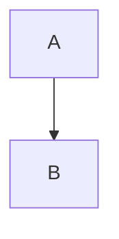

# PRD: orchay - Task 스케줄러

## 문서 정보

| 항목 | 내용 |
|------|------|
| 문서 버전 | 2.0 |
| 작성일 | 2025-12-28 |
| 상태 | Draft |
| 프로젝트 경로 | `./orchay` |

---

## 1. 제품 개요

### 1.1 이름 유래

**orchay** = **orch**estration + ok**ay**

오케스트레이션(작업 조율)과 okay(확인/승인)의 합성어로, Task 작업을 자동으로 조율하고 분배하는 스케줄러의 역할을 표현합니다.

### 1.2 제품 비전

WezTerm 터미널 멀티플렉서 환경에서 실행되는 Task 스케줄러입니다. wbs.md를 지속적으로 모니터링하여 실행 가능한 Task를 추출하고, 여러 Claude Code Worker pane에 작업을 자동 분배합니다.

### 1.3 핵심 가치

| 가치 | 설명 |
|------|------|
| 자동화 | 수동 Task 분배 없이 자동으로 작업 조율 |
| 병렬 처리 | 여러 Claude Code 인스턴스에서 동시 작업 |
| 의존성 관리 | Task 간 의존성을 고려한 지능적 스케줄링 |
| 크로스플랫폼 | Windows, macOS, Linux 단일 코드 지원 |

---

## 2. 아키텍처

### 2.1 시스템 구성


<details>
<summary>텍스트 다이어그램</summary>

```
┌─────────────────────────────────────────────────────────────┐
│                      WezTerm (N+1 panes)                    │
├───────────────────────┬─────────────────────────────────────┤
│  Pane 0: orchay       │  Pane 1: Claude (Worker 1)          │
│  ┌─────────────────┐  │  ┌─────────────────────────────────┐│
│  │ [스케줄러]       │  │  │ 작업 중: TSK-01-01-01          ││
│  │                 │──┼─▶│ /wf:start ...                  ││
│  │ • wbs.md 모니터링│  │  └─────────────────────────────────┘│
│  │ • 스케줄 큐 관리 │  ├─────────────────────────────────────┤
│  │ • pane 상태 감지 │  │  Pane 2: Claude (Worker 2)          │
│  │ • 작업 분배      │  │  ┌─────────────────────────────────┐│
│  │                 │──┼─▶│ 작업 중: TSK-01-01-02          ││
│  │ ┌─────────────┐ │  │  └─────────────────────────────────┘│
│  │ │ 스케줄 큐    │ │  ├─────────────────────────────────────┤
│  │ │ 1. TSK-02-01│ │  │  Pane 3: Claude (Worker 3)          │
│  │ │ 2. TSK-02-02│ │  │  ┌─────────────────────────────────┐│
│  │ │ 3. ...      │─┼──┼─▶│ 대기 중 → 다음 Task 분배       ││
│  │ └─────────────┘ │  │  └─────────────────────────────────┘│
│  └─────────────────┘  │                                     │
└───────────────────────┴─────────────────────────────────────┘
```

</details>

### 2.2 구성 요소

| 구성 요소 | 위치 | 역할 |
|----------|------|------|
| orchay | Pane 0 | 스케줄러 - wbs.md 모니터링, 큐 관리, 작업 분배 |
| Worker 1~N | Pane 1~N | Claude Code 인스턴스 - 실제 워크플로우 실행 |

### 2.3 스케줄러(orchay) 상세 역할

#### 핵심 책임

| 책임 | 상세 설명 |
|------|----------|
| **wbs.md 모니터링** | 파일 변경 감지 (polling/watcher), 파싱, Task 상태 추적 |
| **스케줄 큐 관리** | 실행 가능 Task 필터링, 우선순위 정렬, 큐 유지 |
| **Worker 상태 감시** | pane 출력 모니터링, 대기/작업중/에러 상태 판별 |
| **작업 분배** | 대기 중 Worker에 Task 할당, WezTerm CLI로 명령 전송 |
| **진행 상황 추적** | 전체 작업 현황, 완료율, 예상 잔여 시간 표시 |
| **로깅/리포팅** | 실행 로그 기록, 에러 추적, 통계 출력 |
| **작업 히스토리 관리** | 완료된 작업 출력 저장, 조회 기능 제공 |

#### 스케줄러 상태 머신


<details>
<summary>텍스트 다이어그램</summary>

```
┌─────────┐     ┌───────────┐     ┌─────────┐     ┌─────────┐
│ 초기화   │────▶│ 모니터링   │◀───▶│ 분배 중  │────▶│ 대기 중  │
└────┬────┘     └─────┬─────┘     └────┬────┘     └────┬────┘
     │                │                │               │
     ▼                ▼                ▼               ▼
┌─────────────────────────────────────────────────────────────┐
│                         에러 상태                            │
└─────────────────────────────────────────────────────────────┘
```

</details>

| 상태 | 설명 | 전이 조건 |
|------|------|----------|
| 초기화 | 설정 로드, wbs.md 파싱, Worker 탐지 | 완료 시 → 모니터링 |
| 모니터링 | wbs.md 변경 감지, Worker 상태 체크 | 대기 Worker 발견 → 분배 중 |
| 분배 중 | Task 선택, 명령 전송 | 완료 → 모니터링 |
| 대기 중 | 큐 비어있음, 모든 Worker busy | 큐 갱신 또는 Worker idle → 모니터링 |
| 에러 | 치명적 오류 발생 | 복구 또는 종료 |

#### 스케줄러 이벤트 루프 상세

→ 코드 참조: [orchay-code-reference.md#스케줄러-이벤트-루프](orchay-code-reference.md#스케줄러-이벤트-루프)

### 2.4 워커(Claude Code) 상세 역할

#### 핵심 책임

| 책임 | 상세 설명 |
|------|----------|
| **명령 수신** | 스케줄러로부터 워크플로우 명령 수신 (stdin) |
| **워크플로우 실행** | /wf:start, /wf:approve, /wf:build, /wf:done 등 실행 |
| **wbs.md 상태 업데이트** | 작업 진행에 따라 Task 상태 기호 변경 |
| **산출물 생성** | 설계 문서, 코드, 테스트 파일 생성/수정 |
| **결과 보고** | 완료/에러 시 프롬프트로 복귀하여 상태 표시 |

#### 워커 상태

| 상태 | 감지 방법 | 의미 | 스케줄러 대응 |
|------|----------|------|-------------|
| `idle` | 프롬프트 패턴 (`>`, `╭─`, `❯`) | 작업 대기, 새 Task 수신 가능 | `/clear` 후 다음 Task 분배 |
| `busy` | 출력 진행 중 (프롬프트 없음) | 워크플로우 실행 중 | 대기 |
| `paused` | 일시 중단 패턴 (레이트/토큰 리밋) | API 제한으로 일시 중단 | 대기 후 "계속" 전송 |
| `error` | 에러 패턴 (`Error:`, `Failed:`) | 작업 실패, 개입 필요 | 로그 기록, 알림 |
| `blocked` | 질문 패턴 (`?`, `선택하세요`) | 사용자 입력 대기 중 | 타임아웃 또는 스킵 |
| `dead` | pane 미존재 | pane 종료됨 | Worker 풀에서 제거 |

##### 상태별 복구 방법

| 상태 | 복구 액션 | 설명 |
|------|----------|------|
| `paused` | 대기 → "계속" 전송 | 레이트 리밋 해제 대기 후 자동 재개 |
| `error` | 로그 → 스킵 → 다음 Task | Task를 blocked 마킹 후 다음 작업 진행 |
| `blocked` | 타임아웃 → 스킵 | 일정 시간 후 응답 없으면 스킵 |
| `dead` | Worker 풀 갱신 | 다음 모니터링 주기에 새 pane 탐지 |

#### 워커 실행 흐름


<details>
<summary>텍스트 다이어그램</summary>

```
┌─────────────────────────────────────────────────────────────────┐
│                        Worker 실행 흐름                          │
├─────────────────────────────────────────────────────────────────┤
│                                                                 │
│  [idle] ◀─────────────────────────────────────────────────────┐ │
│    │                                                          │ │
│    │ 명령 수신: /wf:start TSK-01-01-01                        │ │
│    ▼                                                          │ │
│  [busy]                                                       │ │
│    │                                                          │ │
│    ├──▶ 1. Task 컨텍스트 로드 (wbs.md에서 상세 정보 읽기)       │ │
│    │                                                          │ │
│    ├──▶ 2. 설계 문서 생성                                      │ │
│    │       └── wbs.md 상태 업데이트: [ ] → [dd]                │ │
│    │                                                          │ │
│    ├──▶ 3. 코드 구현                                           │ │
│    │       └── wbs.md 상태 업데이트: [dd] → [ap] (승인 대기)    │ │
│    │                                                          │ │
│    ├──▶ 4. 테스트 실행 및 검증                                  │ │
│    │       └── wbs.md 상태 업데이트: [ap] → [im]               │ │
│    │                                                          │ │
│    └──▶ 5. 완료 처리                                           │ │
│            └── 프롬프트 출력 (>) ─────────────────────────────┘ │
│                                                                 │
│  ※ 스케줄러가 프롬프트 감지 → 다음 Task 분배                     │
│                                                                 │
└─────────────────────────────────────────────────────────────────┘
```

</details>

#### 워커가 수정하는 파일

| 파일 유형 | 경로 패턴 | 설명 |
|----------|----------|------|
| wbs.md | `.orchay/projects/{project}/wbs.md` | Task 상태 업데이트 |
| 설계 문서 | `.orchay/projects/{project}/design/{task-id}.md` | 상세 설계 |
| 소스 코드 | `lib/`, `src/` | 구현 코드 |
| 테스트 | `test/` | 단위/통합 테스트 |

### 2.5 스케줄러-워커 상호작용 프로토콜

#### 통신 채널


<details>
<summary>텍스트 다이어그램</summary>

```
┌───────────────┐                              ┌───────────────┐
│   스케줄러     │                              │    워커       │
│   (orchay)    │                              │ (Claude Code) │
├───────────────┤                              ├───────────────┤
│               │  wezterm cli send-text       │               │
│   명령 전송   │ ─────────────────────────▶   │   명령 수신   │
│               │                              │               │
│               │  wezterm cli get-text        │               │
│   상태 확인   │ ◀─────────────────────────   │   출력 생성   │
│               │  (폴링)                      │               │
├───────────────┤                              ├───────────────┤
│               │         wbs.md               │               │
│   변경 감지   │ ◀─────────────────────────   │   상태 갱신   │
│               │  (파일 모니터링)              │               │
└───────────────┘                              └───────────────┘
```

</details>

#### 명령 형식

```bash
# 기본 형식
/wf:{action} {task-id}

# 예시
/wf:start TSK-01-01-01
/wf:approve TSK-01-01-01
/wf:build TSK-01-01-01
/wf:done TSK-01-01-01
```

#### 완료 감지 프로토콜


<details>
<summary>텍스트 다이어그램</summary>

```
┌─────────────────────────────────────────────────────────────────┐
│                      완료 감지 시퀀스                            │
├─────────────────────────────────────────────────────────────────┤
│                                                                 │
│  1. 스케줄러: wezterm cli get-text --pane-id N                  │
│     └── Worker pane의 최근 출력 읽기                             │
│                                                                 │
│  2. 프롬프트 패턴 매칭                                           │
│     └── 기본: ^>\s*$ (줄 시작이 > 로 시작)                       │
│     └── 커스텀: promptPattern 설정으로 변경 가능                  │
│                                                                 │
│  3. 매칭 성공 → idle 상태 판정                                   │
│                                                                 │
│  4. wbs.md 재읽기                                               │
│     └── 해당 Task의 상태 확인                                    │
│     └── 상태가 진행되었으면 → 작업 완료로 판정                    │
│     └── 상태 미변경 → 에러 또는 스킵으로 판정                     │
│                                                                 │
│  5. 다음 Task 분배 (큐에 항목 있으면)                             │
│                                                                 │
└─────────────────────────────────────────────────────────────────┘
```

</details>

#### 동시성 제어

| 규칙 | 설명 |
|------|------|
| **Task 단독 실행** | 동일 Task를 여러 Worker에서 동시 실행 금지 |
| **wbs.md 순차 쓰기** | Worker들이 동시에 wbs.md 수정 시 충돌 가능 → 순차 업데이트 권장 |
| **의존성 준수** | depends에 명시된 선행 Task 완료 전까지 후행 Task 분배 안 함 |
| **최대 병렬도** | 동시 실행 Task 수 = Worker pane 수 |

---

## 3. 핵심 기능

### 3.1 wbs.md 모니터링

- 파일 변경 감지 (polling 또는 file watcher)
- 변경 시 Task 목록 재파싱
- 스케줄 큐 갱신

#### Task 속성 파싱

→ [wbs-task-spec.md](../../docs/wbs-task-spec.md) 참조

**스케줄러가 파싱하는 주요 속성:**
- **기본 속성**: category, domain, status, priority, depends, blocked-by
- **PRD 연동 속성**: prd-ref, requirements, acceptance (standard 이상)
- **TRD 연동 속성**: tech-spec, api-spec, data-model (detailed 이상)
- **상세도 레벨**: minimal, standard, detailed, full

#### wbs.md 메타데이터

wbs.md 상단의 `> key: value` 형식 메타데이터를 파싱합니다:

| 필드 | 설명 | 예시 |
|------|------|------|
| `version` | WBS 버전 | `1.0` |
| `depth` | 계층 깊이 (3 또는 4) | `3` |
| `updated` | 마지막 업데이트 날짜 | `2025-12-28` |
| `project-root` | 개발 폴더 경로 (프로젝트 루트 기준) | `orchay`, `./`, `lib/myapp` |
| `strategy` | 개발 전략 설명 | `부트스트래핑` |

**project-root 사용**:
- 프로젝트명으로 Task ID 접두사 지정
- 예: `project-root: orchay` → `/wf:design orchay/TSK-01-01`

### 3.2 스케줄 큐 관리

의존성과 우선순위를 고려하여 실행 가능한 Task 큐를 유지합니다. 스케줄 큐에는 **개발 가능한 Task만** 표시됩니다.

#### 의존성 필터링 규칙 (단계별)

| 단계 | 모드 | 의존성 확인 |
|------|------|------------|
| 설계 (/wf:start) | 모든 모드 | **무시** (설계는 자유롭게) |
| 구현 (/wf:approve 이후) | develop | **확인** (선행 Task [im] 이상) |
| 구현 (/wf:approve 이후) | force | **무시** |

#### 스케줄링 알고리즘

```
1. wbs.md 파싱 → 전체 Task 목록 추출

2. 실행 가능 Task 필터링:
   - status가 [xx] (완료)인 Task 제외
   - blocked-by가 있는 Task 제외
   - 현재 실행 중인 Task 제외

3. 모드별 의존성 필터링:
   [design 모드]
   - 설계 미완료([ ] 상태) Task만 표시
   - 의존성 무시

   [develop 모드]
   - 설계 미완료([ ]) Task: 의존성 무시 → 표시
   - 설계 완료([dd] 이상) Task: depends 선행 Task가 [im] 이상이면 표시

   [force 모드]
   - 모든 미완료 Task 표시
   - 의존성 무시

4. 우선순위 정렬:
   - priority: critical > high > medium > low
   - schedule 시작일 오름차순

5. 스케줄 큐에 추가
6. 대기 중인 Worker pane에 분배
```

#### 필터링 로직

→ 코드 참조: [orchay-code-reference.md#filter_executable_tasks](orchay-code-reference.md#filter_executable_tasks)

### 3.3 Worker 상태 감지


**프롬프트 패턴 감지 방식:**

Claude Code가 입력 대기 상태일 때 출력하는 프롬프트 패턴을 감지합니다.

| 항목 | 설명 |
|------|------|
| 명령어 | `wezterm cli get-text --pane-id N` |
| 읽기 범위 | 마지막 50줄 (설정 가능) |
| 매칭 방식 | 정규식 패턴 매칭 |

#### 상태 감지 패턴

| 상태 | 패턴 | 예시 |
|------|------|------|
| **done (완료 신호)** | `ORCHAY_DONE:([^:]+):(\w+):(success\|error)` | wf 명령어 완료 |
| **idle (프롬프트)** | `^>\s*$`, `╭─`, `❯` | Claude Code 입력 대기 |
| **paused (일시 중단)** | `rate.*limit`, `please.*wait`, `try.*again` | API 제한 |
| | `weekly.*limit.*reached`, `resets.*at` | Weekly limit |
| | `context.*limit`, `conversation.*too.*long` | 토큰 한계 |
| **error** | `Error:`, `Failed:`, `Exception:`, `❌` | 작업 실패 |
| **blocked (질문)** | `\?\s*$`, `\(y/n\)`, `선택` | 사용자 입력 대기 |

#### 완료 신호 형식 (ORCHAY_DONE)

각 `/wf:*` 명령어는 작업 완료 시 다음 형식의 신호를 출력합니다:

```
ORCHAY_DONE:[{project}/]{task-id}:{action}:{status}[:{message}]
```

| 필드 | 설명 | 예시 |
|------|------|------|
| `project` | 프로젝트명 (선택) | `orchay` |
| `task-id` | Task 식별자 | `TSK-01-01` |
| `action` | wf 명령어 | `start`, `build`, `done` 등 |
| `status` | 완료 상태 | `success` 또는 `error` |
| `message` | 에러 메시지 (선택) | `테스트 실패` |

**예시:**
```
ORCHAY_DONE:TSK-01-01:start:success              # 기존 호환
ORCHAY_DONE:orchay/TSK-01-01:start:success       # 새 형식
ORCHAY_DONE:orchay/TSK-01-01:build:error:TDD 5회 초과
```

**Fallback 패턴** (ORCHAY_DONE 누락 시):
```
Task orchay/TSK-01-01 완료
Task TSK-01-01 완료                               # 기존 호환
```

#### 상태 판정 우선순위

**파일 기반 상태 관리**: 작업 중인 Worker는 `orchay-active.json` 파일로 추적합니다.

> 상세 구현 코드는 [orchay-code-reference.md](./orchay-code-reference.md#상태-감지) 참조

```
판정 로직:
1. 파일에 해당 pane의 작업이 있으면:
   - ORCHAY_DONE 감지 시 → done + 파일에서 제거
   - 그 외 → busy (계속 작업 중)

2. 파일에 없으면 (초기 상태 또는 작업 완료 후):
   - pane 출력으로 상태 판단
   - 우선순위: dead > done > idle > paused > error > blocked > busy
```

### 3.4 작업 분배

대기 중인 Worker pane에 Task를 분배합니다. **한 Worker가 한 Task를 끝까지 책임지고 수행**합니다.

#### Task 단위 실행 원칙

```
기존: Worker1: TSK-01 /wf:start → TSK-02 /wf:start → TSK-01 /wf:approve → ...
변경: Worker1: TSK-01 (/wf:start → /wf:approve → /wf:build → /wf:done) → TSK-02 ...
```

- 한 Worker가 한 Task의 전체 workflow를 순차 실행
- Task 완료 후 다음 Task 할당
- 중간에 에러 발생 시 해당 Task 중단 후 다음 Task로 이동

#### 분배 시퀀스

```
idle Worker 감지 → /clear 전송 → Task workflow 순차 실행 → 완료 → 다음 Task
```

#### Task 실행 로직

→ 코드 참조: [orchay-code-reference.md#task-실행-로직](orchay-code-reference.md#task-실행-로직)

#### WezTerm CLI 명령어

| 명령어 | 설명 |
|--------|------|
| `wezterm cli send-text --no-paste --pane-id N "/clear"` | 컨텍스트 초기화 |
| `wezterm cli send-text --no-paste --pane-id N "text"` | 워크플로우 명령 전송 |
| `wezterm cli send-text --no-paste --pane-id N \r` | Enter 키 전송 |

### 3.5 스케줄러 루프

```python
while True:
    1. wbs.md 변경 감지 → 큐 갱신
    2. 각 Worker pane 출력 확인:
       - wezterm cli get-text --pane-id N
       - 프롬프트 패턴 감지 → 대기 중
    3. 대기 중인 pane 발견 시:
       - 큐에서 다음 Task pop
       - wezterm cli send-text로 분배
    4. sleep(interval)
```

### 3.6 작업 히스토리 관리

Worker가 완료한 작업의 출력 내용을 저장하고 나중에 조회할 수 있는 기능입니다.

#### 저장 시점

| 이벤트 | 저장 내용 |
|--------|----------|
| Task 분배 시 | task_id, worker_id, started_at |
| Task 완료 감지 시 | completed_at, status, output (pane 출력) |
| Task 에러 발생 시 | completed_at, status="error", output, error_message |

#### 저장 형식 (JSON Lines)

`.orchay/logs/orchay-history.jsonl` 파일에 한 줄씩 JSON 형태로 저장합니다.

```jsonl
{"task_id": "TSK-01-01-01", "worker_id": 1, "started_at": "2025-12-27T10:00:00", "completed_at": "2025-12-27T10:15:30", "status": "completed", "output": "...pane 출력 내용..."}
{"task_id": "TSK-01-01-02", "worker_id": 2, "started_at": "2025-12-27T10:00:05", "completed_at": "2025-12-27T10:20:15", "status": "completed", "output": "...pane 출력 내용..."}
{"task_id": "TSK-01-02-01", "worker_id": 1, "started_at": "2025-12-27T10:15:35", "completed_at": "2025-12-27T10:18:00", "status": "error", "output": "...", "error_message": "TypeError: ..."}
```

#### 히스토리 레코드 스키마

| 필드 | 타입 | 설명 |
|------|------|------|
| `task_id` | string | Task 식별자 (예: TSK-01-01-01) |
| `worker_id` | number | Worker pane 번호 |
| `started_at` | string | 작업 시작 시간 (ISO 8601) |
| `completed_at` | string | 작업 완료 시간 (ISO 8601) |
| `status` | string | 완료 상태: "completed", "error", "skipped" |
| `output` | string | pane 출력 내용 (마지막 N줄) |
| `error_message` | string? | 에러 발생 시 에러 메시지 |
| `duration_seconds` | number | 작업 소요 시간 (초) |

#### 히스토리 저장/조회 로직

→ 코드 참조: [orchay-code-reference.md#히스토리-관리](orchay-code-reference.md#히스토리-관리)

### 3.7 인터랙티브 명령어 시스템

스케줄러 실행 중 터미널에서 직접 명령어를 입력하거나 Function Key로 빠르게 조작할 수 있습니다.

#### 명령어 목록

| 분류 | 명령어 | 설명 |
|------|--------|------|
| **제어** | `start` | 스케줄링 시작 |
| | `stop` | 스케줄링 종료 (graceful shutdown) |
| | `pause` | 새 Task 분배 일시 중지 (진행 중 작업 유지) |
| | `resume` | 일시 중지 해제 |
| **조회** | `status` | 전체 현황 (큐 크기, Worker 상태, 진행률) |
| | `queue` | 대기 중인 Task 목록 (순서대로) |
| | `workers` | 전체 Worker 상태 |
| | `worker N` | Worker N의 현재 pane 출력 |
| | `history [ID]` | 완료된 작업 히스토리 |
| **큐 조정** | `up TSK-XX` | 해당 Task를 한 칸 위로 |
| | `top TSK-XX` | 해당 Task를 최우선(1번)으로 |
| **작업 관리** | `skip TSK-XX` | 해당 Task 스킵 (blocked 처리) |
| | `retry TSK-XX` | 실패한 Task 재시도 |
| | `reload` | wbs.md 강제 재로드 |
| | `clear N` | Worker N에 /clear 전송 |
| **모드** | `mode design` | 설계 모드로 전환 |
| | `mode develop` | 개발 모드로 전환 |
| | `mode force` | 강제 모드로 전환 |
| **기타** | `help` | 명령어 도움말 및 키 바인딩 표시 |

#### Function Key 바인딩

| Key | 명령어 | 설명 |
|-----|--------|------|
| **F1** | `help` | 도움말 / 키 바인딩 표시 |
| **F2** | `status` | 전체 현황 |
| **F3** | `queue` | 대기 Task 목록 (인터랙티브 모드) |
| **F4** | `workers` | Worker 상태 |
| **F5** | `reload` | wbs.md 재로드 |
| **F6** | `history` | 완료 히스토리 |
| **F7** | `mode` | 모드 순환 (design → develop → force) |
| **F9** | `pause`/`resume` | 토글 |
| **F10** | `stop` | 종료 |
| **Shift+F1** | `worker 1` | Worker 1 출력 보기 |
| **Shift+F2** | `worker 2` | Worker 2 출력 보기 |
| **Shift+F3** | `worker 3` | Worker 3 출력 보기 |
| **Shift+F5** | `clear` | 선택된 Worker에 /clear |

#### 인터랙티브 Task 선택 UI

`F3` (queue) 또는 `queue` 명령 실행 시 인터랙티브 모드로 진입합니다.

```
┌─────────────────────────────────────────────────────────────────┐
│  📋 Task Queue (5 items)                          [F1: Help]    │
├─────────────────────────────────────────────────────────────────┤
│  ▶ 1. TSK-01-01-01  [ ]  development  기본 설계          ←선택됨 │
│    2. TSK-01-01-02  [ ]  development  상세 설계                 │
│    3. TSK-01-02-01  [dd] development  UI 구현                   │
│    4. TSK-02-01     [ ]  defect       버그 수정                 │
│    5. TSK-03-01     [ ]  infra        CI/CD 설정                │
├─────────────────────────────────────────────────────────────────┤
│  ↑/↓: 이동  Enter: 액션 선택  U: 위로  T: 최우선  ESC: 닫기     │
└─────────────────────────────────────────────────────────────────┘
```

**조작 키:**

| Key | 동작 |
|-----|------|
| `↑` / `↓` | Task 선택 이동 |
| `Enter` | 선택한 Task에 대한 액션 메뉴 열기 |
| `U` | 선택한 Task를 한 칸 위로 (up) |
| `T` | 선택한 Task를 최우선으로 (top) |
| `S` | 선택한 Task 스킵 (skip) |
| `R` | 선택한 Task 재시도 (retry) |
| `ESC` | 인터랙티브 모드 종료 |

**액션 메뉴 (Enter 시):**

```
┌─────────────────────────────┐
│  TSK-01-01-01 액션 선택      │
├─────────────────────────────┤
│  1. 위로 이동 (up)          │
│  2. 최우선 (top)            │
│  3. 스킵 (skip)             │
│  4. 재시도 (retry)          │
│  5. 상세 보기               │
│  ─────────────────────────  │
│  ESC: 취소                  │
└─────────────────────────────┘
```

#### 명령어 입력 처리

→ 코드 참조: [orchay-code-reference.md#인터랙티브-명령어](orchay-code-reference.md#인터랙티브-명령어)

### 3.8 실행 모드

스케줄러의 동작 방식을 결정하는 4가지 실행 모드를 제공합니다.

→ 모드 정의: [workflows.json](../../settings/workflows.json) `executionModes` 참조

#### 모드 정의

| 모드 | 설계 단계 | 구현 이후 | 수행 범위 | 용도 |
|------|----------|----------|----------|------|
| **design** | 의존성 무시 | - | start만 | 전체 Task 설계 문서 일괄 생성 |
| **quick** | 의존성 무시 | 의존성 확인 | transitions만 | 빠른 개발 (리뷰/테스트 생략) |
| **develop** | 의존성 무시 | 의존성 확인 | full (transitions + actions) | 전체 워크플로우 (리뷰/테스트 포함) |
| **force** | 의존성 무시 | 의존성 무시 | transitions만 | 긴급 개발, 의존성 무시 |

#### 워크플로우 단계 비교

| 모드 | 워크플로우 단계 |
|------|----------------|
| design | `start` |
| quick | `start → approve → build → done` |
| develop | `start → review → apply → approve → build → audit → patch → test → done` |
| force | quick과 동일 |

#### 모드별 동작

**design 모드:**
```
- 모든 [ ] 상태 Task에 대해 /wf:start 실행
- 설계 문서만 생성 ([dd] 상태까지)
- 의존관계 무시 → 전체 Task 설계 병렬 진행 가능
- 용도: 프로젝트 초기 전체 설계 수행
```

**quick 모드:**
```
- 설계 단계: 의존관계 무시
- 구현 단계: 선행 Task가 구현 완료([im]) 이상이어야 진행
- transitions만 실행 (review, apply, audit, patch, test 생략)
- 용도: 빠른 개발, 리뷰 불필요한 작업
```

**develop 모드:**
```
- 설계 단계: 의존관계 무시
- 구현 단계: 선행 Task가 구현 완료([im]) 이상이어야 진행
- 전체 workflow 순차 실행 (transitions + actions)
- 용도: 정상적인 개발 워크플로우 (리뷰/테스트 포함)
```

**force 모드:**
```
- 모든 단계에서 의존관계 무시
- transitions만 실행 (quick과 동일한 단계)
- 용도: 긴급 개발, 특정 Task 우선 완료 필요 시
```

#### 모드 전환

**명령어:**
```bash
mode design   # 설계 모드로 전환
mode quick    # 빠른 개발 모드로 전환
mode develop  # 전체 개발 모드로 전환
mode force    # 강제 모드로 전환
```

**Function Key:**
- `F7`: 모드 순환 (design → quick → develop → force → design)

#### 모드 표시 UI

```
╔═══════════════════════════════════════════════════════════════╗
║  orchay - Task Scheduler                   [MODE: quick]      ║
║  Workers: 3 | Queue: 5 | Completed: 12     F7: 모드 전환      ║
╚═══════════════════════════════════════════════════════════════╝
```

모드 색상 표시:
- `[MODE: design]` - 청색 (#3b82f6)
- `[MODE: quick]` - 녹색 (#22c55e)
- `[MODE: develop]` - 보라색 (#8b5cf6)
- `[MODE: force]` - 황색 (#f59e0b)

### 3.9 작업 중 상태 관리

현재 Worker가 처리 중인 Task와 진행 단계를 추적하는 기능입니다.

#### 저장 위치

`.orchay/logs/orchay-active.json`

#### 데이터 구조

```json
{
  "activeTasks": {
    "TSK-01-01-01": {
      "worker": 1,
      "startedAt": "2025-12-28T10:00:00",
      "currentStep": "build"
    },
    "TSK-01-02-01": {
      "worker": 2,
      "startedAt": "2025-12-28T10:05:00",
      "currentStep": "start"
    }
  }
}
```

#### 필드 설명

| 필드 | 타입 | 설명 |
|------|------|------|
| `worker` | number | 작업 중인 Worker pane 번호 |
| `startedAt` | string | Task 시작 시간 (ISO 8601) |
| `currentStep` | string | 현재 진행 중인 /wf 명령어 |

#### currentStep 값

| 값 | 설명 |
|---|------|
| `start` | 설계 시작 (/wf:start) |
| `draft` | 상세 설계 (/wf:draft) |
| `review` | 리뷰 (/wf:review) |
| `apply` | 리뷰 반영 (/wf:apply) |
| `approve` | 승인 (/wf:approve) |
| `build` | 구현 (/wf:build) |
| `audit` | 코드 리뷰 (/wf:audit) |
| `patch` | 패치 반영 (/wf:patch) |
| `test` | 테스트 (/wf:test) |
| `done` | 완료 처리 (/wf:done) |

#### 생명주기

```
┌─────────────────────────────────────────────────────────────────┐
│                     작업 중 상태 생명주기                         │
├─────────────────────────────────────────────────────────────────┤
│                                                                 │
│  1. 등록 (Task 분배 시)                                          │
│     └── worker, startedAt, currentStep 기록                     │
│                                                                 │
│  2. 단계 갱신 (각 /wf 명령어 전송 시)                             │
│     └── currentStep 업데이트                                     │
│                                                                 │
│  3. 해제 (ORCHAY_DONE 신호 감지 시)                               │
│     └── activeTasks에서 해당 Task 삭제                           │
│                                                                 │
│  4. 초기화 (스케줄러 시작 시)                                     │
│     └── 파일 비우기 또는 삭제 (이전 세션 상태 클리어)              │
│                                                                 │
└─────────────────────────────────────────────────────────────────┘
```

#### 상태 관리 로직

→ 코드 참조: [orchay-code-reference.md#상태-파일-구조](orchay-code-reference.md#상태-파일-구조)

#### UI 연동

WBS 기반 UI에서 `orchay-active.json` 파일을 모니터링하여:
- `activeTasks`에 있는 Task는 **스피너 아이콘** 표시
- `currentStep` 값으로 현재 진행 단계 표시 가능
- 파일 변경 감지 (polling 또는 file watcher)로 실시간 업데이트

### 3.10 스케줄러 상태 및 워커 제어

스케줄러와 개별 워커의 상태를 제어하고 표시하는 기능입니다.

#### 스케줄러 상태 (SchedulerState)

| 상태 | 아이콘 | 색상 | 설명 |
|------|--------|------|------|
| `running` | ▶ | #22c55e (녹색) | 정상 동작 중 |
| `paused` | ⏸ | #f59e0b (황색) | 일시정지 (새 Task 분배 안 함) |
| `stopped` | ⏹ | #ef4444 (적색) | 완전 중지 |

#### 워커 단위 Pause/Resume

개별 Worker를 수동으로 일시정지/재개할 수 있습니다.

**기능:**
- 수동 일시정지된 Worker는 `is_available()` 메서드에서 `False` 반환
- 새 Task 분배 대상에서 제외
- 현재 진행 중인 Task는 계속 완료 (강제 중단 아님)

**상태 파일:**

```json
{
  "activeTasks": { ... },
  "pausedWorkers": [2, 3],
  "schedulerState": "running"
}
```

#### TUI 조작

| 키 | 동작 |
|-----|------|
| **F4** | Workers 인터랙티브 모드 토글 |
| **1~5** | 해당 번호의 Worker 선택 및 인터랙티브 모드 진입 |
| **↑/↓** | 인터랙티브 모드에서 Worker 선택 이동 |
| **P** | 선택된 Worker의 pause/resume 토글 |
| **Enter** | 선택된 Worker의 pause/resume 토글 |
| **ESC** | 인터랙티브 모드 종료 |
| **F9** | 스케줄러 전체 일시정지/재개 |

#### Worker 패널 표시

```
  Workers (↑↓: 선택  P: Pause/Resume  ESC: 닫기)
  ▶ Worker 1  ●  idle      -                     Ready for next task
    Worker 2  ◐  busy  🛑  TSK-01-01 (build)    Manually paused (P to resume)
    Worker 3  ●  idle      -                     Ready for next task
```

- `▶`: 현재 선택된 Worker
- `🛑`: 수동 일시정지 상태

### 3.11 문서 뷰어 (Markdown Rendering)

웹 UI에서 Task 관련 Markdown 문서를 VS Code 수준으로 렌더링합니다.

#### 렌더링 방식

| 항목 | 설명 |
|------|------|
| 렌더링 위치 | 서버 사이드 (Python) |
| 파서 | markdown-it-py (GFM 호환) |
| 코드 하이라이팅 | Pygments (598개 언어, monokai 테마) |
| 다이어그램 | Mermaid.js (클라이언트 사이드) |

#### 지원 기능 (GFM)

| 기능 | 문법 | 렌더링 |
|------|------|--------|
| 테이블 | `\| A \| B \|` | HTML `<table>` |
| 체크리스트 | `- [x] Done` | 체크박스 |
| 취소선 | `~~deleted~~` | `<del>` 태그 |
| 각주 | `[^1]` | 하단 각주 |
| 자동 링크 | `https://...` | 클릭 가능 링크 |

#### 코드 블록 하이라이팅

```markdown
```python
def hello():
    print("world")
```
```

- 언어 자동 감지 (lang 미지정 시)
- Pygments monokai 테마 적용
- 598개 프로그래밍 언어 지원

#### Mermaid 다이어그램

```markdown

```

- 서버에서 `language-mermaid` 클래스로 패스스루
- 클라이언트에서 mermaid.js로 렌더링
- 다크 테마 자동 적용

#### API 엔드포인트

| 엔드포인트 | 응답 |
|------------|------|
| `GET /api/document/{task_id}/{doc_name}` | `.md`: HTMLResponse (렌더링됨) |
| | 이미지: FileResponse |
| `GET /api/pygments.css` | Pygments 테마 CSS |

#### 스타일

- `/static/markdown.css`: VS Code 다크 테마 기반 prose 스타일
- `/api/pygments.css`: 코드 하이라이팅 CSS (monokai)

---

## 4. 상태 → 명령어 매핑

| 상태 | 카테고리 | 실행 명령어 |
|------|---------|------------|
| `[ ]` | development | `/wf:start {ID}` |
| `[ ]` | defect | `/wf:start {ID}` |
| `[ ]` | infrastructure | `/wf:start {ID}` |
| `[dd]` | development | `/wf:approve {ID}` |
| `[ap]` | development | `/wf:build {ID}` |
| `[im]` | development | `/wf:done {ID}` |
| `[an]` | defect | `/wf:fix {ID}` |
| `[fx]` | defect | `/wf:verify {ID}` |
| `[vf]` | defect | `/wf:done {ID}` |
| `[dd]` | infrastructure | `/wf:build {ID}` |
| `[im]` | infrastructure | `/wf:done {ID}` |

---

## 5. 설정

### 5.1 설정 파일

`.orchay/settings/orchay.json`

```json
{
  "workers": 3,
  "interval": 5,
  "category": null,
  "project": null,
  "detection": {
    "donePattern": "ORCHAY_DONE:([^:]+):(\\w+):(success|error)(?::(.+))?",
    "promptPatterns": ["^>\\s*$", "╭─", "❯"],
    "pausePatterns": [
      "rate.*limit", "please.*wait", "try.*again",
      "weekly.*limit.*reached", "resets.*at",
      "context.*limit", "conversation.*too.*long",
      "overloaded", "capacity"
    ],
    "errorPatterns": ["Error:", "Failed:", "Exception:", "❌", "fatal:"],
    "questionPatterns": ["\\?\\s*$", "\\(y/n\\)", "선택"],
    "readLines": 50
  },
  "recovery": {
    "resumeText": "계속",
    "defaultWaitTime": 60,
    "contextLimitWait": 5,
    "maxRetries": 3,
    "retryInterval": 5,
    "resetTimePatterns": [
      "resets\\s+(\\w+\\s+\\d+)\\s+at\\s+(\\d+:\\d+(?:am|pm)?)",
      "reset\\s+at\\s+(\\w+\\s+\\d+),?\\s*(\\d+:?\\d*\\s*(?:am|pm)?)"
    ]
  },
  "dispatch": {
    "clearBeforeDispatch": true,
    "clearWaitTime": 2
  },
  "history": {
    "enabled": true,
    "storagePath": ".orchay/logs/orchay-history.jsonl",
    "maxEntries": 1000,
    "captureLines": 500
  },
  "execution": {
    "mode": "quick",
    "allowModeSwitch": true
  }
}
```

### 5.2 설정 항목

#### 기본 설정

| 설정 | 타입 | 설명 | 기본값 |
|------|------|------|--------|
| `workers` | number | Worker pane 수 | 3 |
| `interval` | number | 모니터링 간격 (초) | 5 |
| `category` | string\|null | 카테고리 필터 (null=전체) | null |
| `project` | string\|null | 프로젝트 경로 (null=자동) | null |

#### 상태 감지 설정 (detection)

| 설정 | 타입 | 설명 | 기본값 |
|------|------|------|--------|
| `donePattern` | string | wf 완료 신호 감지 정규식 | `"ORCHAY_DONE:..."` |
| `promptPatterns` | string[] | idle 상태 감지 정규식 | `["^>\\s*$", "╭─", "❯"]` |
| `pausePatterns` | string[] | 일시 중단 감지 정규식 | (레이트/토큰 리밋 패턴) |
| `errorPatterns` | string[] | 에러 감지 정규식 | `["Error:", "Failed:", ...]` |
| `questionPatterns` | string[] | 질문 대기 감지 정규식 | `["\\?\\s*$", "(y/n)", ...]` |
| `readLines` | number | pane 출력 읽기 줄 수 | 50 |

#### 복구 설정 (recovery)

| 설정 | 타입 | 설명 | 기본값 |
|------|------|------|--------|
| `resumeText` | string | 재개 시 전송할 텍스트 | `"계속"` |
| `defaultWaitTime` | number | 레이트 리밋 대기 시간 (초) | 60 |
| `contextLimitWait` | number | 컨텍스트 리밋 대기 시간 (초) | 5 |
| `maxRetries` | number | 최대 재시도 횟수 | 3 |
| `retryInterval` | number | 재시도 간격 (초) | 5 |
| `resetTimePatterns` | string[] | Reset 시간 추출 정규식 | (아래 참조) |

#### 분배 설정 (dispatch)

| 설정 | 타입 | 설명 | 기본값 |
|------|------|------|--------|
| `clearBeforeDispatch` | boolean | Task 분배 전 /clear 전송 | true |
| `clearWaitTime` | number | /clear 후 대기 시간 (초) | 2 |

#### 히스토리 설정 (history)

| 설정 | 타입 | 설명 | 기본값 |
|------|------|------|--------|
| `enabled` | boolean | 히스토리 저장 활성화 | true |
| `storagePath` | string | 히스토리 파일 경로 | `.orchay/logs/orchay-history.jsonl` |
| `maxEntries` | number | 최대 저장 항목 수 | 1000 |
| `captureLines` | number | pane 출력 캡처 줄 수 | 500 |

#### 실행 설정 (execution)

| 설정 | 타입 | 설명 | 기본값 |
|------|------|------|--------|
| `mode` | string | 실행 모드: "design", "quick", "develop", "force" | "quick" |
| `allowModeSwitch` | boolean | 실행 중 모드 전환 허용 | true |

→ 모드 상세: [workflows.json](../../settings/workflows.json) `executionModes` 참조

---

## 6. CLI

### 6.1 파일 구성

```
.orchay/
└── bin/
    ├── orchay.py        # Python 크로스플랫폼 스크립트
    ├── orchay           # Unix wrapper
    └── orchay.ps1       # Windows wrapper
```

### 6.2 사용법

```bash
# Unix/macOS
./orchay                    # 스케줄러 시작
./orchay --dry-run          # 미리보기 (분배 안 함)

# Windows PowerShell
.\orchay.ps1
.\orchay.ps1 -DryRun

# 히스토리 조회
./orchay history              # 최근 완료된 작업 리스트
./orchay history TSK-01-01-01 # 특정 작업의 상세 출력 보기
./orchay history --limit 50   # 최근 50개 작업 리스트
./orchay history --clear      # 히스토리 전체 삭제
```

### 6.3 CLI 사용법

```bash
orchay [PROJECT] [OPTIONS]
```

| 인자/옵션 | 설명 |
|----------|------|
| `PROJECT` | 프로젝트명 (`.orchay/projects/{PROJECT}/` 사용, 기본: orchay) |
| `-w, --workers N` | workers 오버라이드 |
| `-i, --interval S` | interval 오버라이드 |
| `-m, --mode MODE` | 실행 모드 (design/quick/develop/force) |
| `--dry-run` | 미리보기 (분배 안 함) |
| `-v, --verbose` | 상세 로그 출력 |

**사용 예시**:
```bash
# orchay 프로젝트 실행
uv run python -m orchay orchay --dry-run

# orchay-flutter 프로젝트 실행
uv run python -m orchay orchay-flutter -m develop

# 기본값 (orchay 프로젝트)
uv run python -m orchay --dry-run
```

**우선순위**: CLI 옵션 > 설정 파일 > 기본값

### 6.4 exec 서브커맨드 (실행 상태 관리)

워크플로우(`/wf:*`) 명령어 실행 시 Task 실행 상태를 추적하기 위한 서브커맨드입니다.
Claude Code Worker들이 어떤 Task를 실행 중인지 `.orchay/logs/orchay-active.json`에 기록합니다.

```bash
# Task 실행 시작 등록
orchay exec start TSK-01-01 design

# Task 실행 완료 해제
orchay exec stop TSK-01-01

# Task 단계 갱신
orchay exec update TSK-01-01 build

# 실행 중인 Task 목록
orchay exec list

# 모든 실행 상태 초기화
orchay exec clear
```

| 명령어 | 설명 |
|--------|------|
| `exec start <task_id> <step>` | Task 실행 시작 등록 |
| `exec stop <task_id>` | Task 실행 완료 해제 |
| `exec update <task_id> <step>` | Task 단계 갱신 |
| `exec list` | 실행 중인 Task 목록 |
| `exec clear` | 모든 실행 상태 초기화 |

**옵션 (start)**:
| 옵션 | 설명 |
|------|------|
| `-w, --worker N` | Worker ID (기본: 0) |
| `-p, --pane N` | Pane ID (기본: 0) |

**상태 파일 구조** (`.orchay/logs/orchay-active.json`):
```json
{
  "activeTasks": {
    "TSK-01-01": {
      "worker": 1,
      "paneId": 2,
      "startedAt": "2025-12-28T10:00:00",
      "currentStep": "design"
    }
  }
}
```

**워크플로우 훅 연동**:
- `/wf:*` 명령어 시작 시: `orchay exec start {TASK_ID} {COMMAND}`
- `/wf:*` 명령어 완료 시: `orchay exec stop {TASK_ID}`

### 6.5 설치

```bash
# PATH에 추가 (Unix)
echo 'export PATH="$PATH:$HOME/.orchay/bin"' >> ~/.bashrc

# PowerShell 프로필에 추가 (Windows)
[Environment]::SetEnvironmentVariable("Path", $env:Path + ";$HOME\.orchay\bin", "User")
```

---

## 7. 구현

### 7.1 Python 선택 이유

| 장점 | 설명 |
|------|------|
| 크로스플랫폼 | Windows, macOS, Linux 단일 코드 |
| 마크다운 파싱 | wbs.md 파싱 용이 (regex 또는 라이브러리) |
| JSON 처리 | settings 파일 처리 네이티브 지원 |
| 가독성 | 복잡한 로직도 유지보수 용이 |
| 의존성 | Python 3.x만 필요 (추가 패키지 불필요) |

### 7.2 의존성

- Python 3.8+
- 표준 라이브러리만 사용 (argparse, json, re, subprocess, time)
- 외부 패키지 불필요

### 7.3 WezTerm CLI 명령어

| 명령어 | 설명 |
|--------|------|
| `wezterm cli list` | 현재 pane 목록 및 ID 조회 |
| `wezterm cli get-text --pane-id N` | pane 출력 텍스트 읽기 |
| `wezterm cli send-text --no-paste --pane-id N "text"` | pane에 텍스트 전송 |

---

## 8. 운영

### 8.1 병렬 실행 규칙

| 규칙 | 설명 |
|------|------|
| 의존성 검사 | depends에 명시된 선행 Task가 완료되지 않으면 제외 |
| 중복 방지 | 이미 실행 중인 Task는 분배 대상에서 제외 |
| 최대 N개 | 동시 실행은 Worker pane 수만큼 |
| 상태 무관 | [dd], [im] 등 진행 중 상태도 다음 단계로 분배 가능 |

### 8.2 주의사항

| 항목 | 설명 |
|------|------|
| pane ID | WezTerm 재시작 시 pane ID가 변경될 수 있음 → orchay가 자동 조회 |
| 동일 Task 금지 | 동일 Task를 여러 pane에서 동시 실행 금지 |
| wbs.md 충돌 | 동시 수정 시 Git 충돌 가능 → 순차적 상태 업데이트 권장 |
| 리소스 | Claude Code N개 동시 실행 시 메모리/CPU 사용량 고려 |

### 8.3 환경 변수

| 변수명 | 설명 | 기본값 |
|--------|------|--------|
| `ORCHAY_ROOT` | .orchay 폴더 경로 | 자동 탐색 |
| `NUMBER_OF_WORKING_PANE` | Claude pane 개수 | 3 |

### 8.4 에러 처리 및 복구

#### 에러 유형 및 대응

| 에러 유형 | 감지 방법 | 스케줄러 대응 | 복구 방법 |
|----------|----------|-------------|----------|
| **워크플로우 실패** | Worker 출력에 에러 패턴 | Task blocked 마킹, 스킵 | 수동 개입 후 재시작 |
| **Worker 무응답** | 타임아웃 (설정 가능) | 해당 Worker 비활성화, Task 재큐 | pane 재시작 |
| **wbs.md 파싱 오류** | 파싱 예외 발생 | 이전 상태 유지, 경고 출력 | 파일 수정 후 자동 재파싱 |
| **wbs.md 충돌** | Git 충돌 마커 감지 | 스케줄링 일시 중지 | 충돌 해결 후 재개 |
| **pane 종료** | wezterm cli list 조회 | Worker 풀에서 제거 | 새 pane 생성 또는 대기 |
| **네트워크/API 오류** | Claude Code 에러 출력 | Task 재시도 또는 스킵 | 자동 재시도 (최대 3회) |

#### 에러 로깅

```
[12:15:30] ❌ Worker 2 에러 발생
           Task: TSK-01-02-03
           에러: TypeError: Cannot read property 'x' of undefined
           대응: Task를 blocked 상태로 마킹, 스킵

[12:15:35] ⚠️ Worker 2 복구 완료, 다음 Task 분배
```

#### 에러 패턴 설정

```json
{
  "errorPatterns": [
    "Error:",
    "Failed:",
    "Exception:",
    "❌",
    "fatal:"
  ],
  "retryCount": 3,
  "retryDelay": 5
}
```

### 8.5 생명주기 관리

#### 스케줄러 생명주기


<details>
<summary>텍스트 다이어그램</summary>

```
┌─────────────────────────────────────────────────────────────────┐
│                    스케줄러(orchay) 생명주기                      │
├─────────────────────────────────────────────────────────────────┤
│                                                                 │
│  [시작]                                                         │
│    │                                                            │
│    ├──▶ 1. 설정 파일 로드 (orchay.json)                          │
│    ├──▶ 2. wbs.md 초기 파싱                                      │
│    ├──▶ 3. Worker pane 탐지 (wezterm cli list)                  │
│    ├──▶ 4. 스케줄 큐 초기화                                      │
│    └──▶ 5. 이벤트 루프 시작                                      │
│                                                                 │
│  [실행 중]                                                       │
│    │                                                            │
│    └──▶ 이벤트 루프 반복 (모니터링 → 분배 → 대기)                 │
│                                                                 │
│  [종료]                                                          │
│    │                                                            │
│    ├──▶ 1. Ctrl+C 또는 SIGTERM 수신                              │
│    ├──▶ 2. 진행 중 Task 상태 출력                                 │
│    ├──▶ 3. 현재 큐 상태 저장 (선택)                               │
│    └──▶ 4. 정리 및 종료                                          │
│                                                                 │
└─────────────────────────────────────────────────────────────────┘
```

</details>

#### 워커 생명주기


<details>
<summary>텍스트 다이어그램</summary>

```
┌─────────────────────────────────────────────────────────────────┐
│                    워커(Claude Code) 생명주기                     │
├─────────────────────────────────────────────────────────────────┤
│                                                                 │
│  [시작]                                                         │
│    │                                                            │
│    ├──▶ 1. WezTerm pane에서 Claude Code 실행                     │
│    │       $ claude                                              │
│    └──▶ 2. 프롬프트 대기 (idle 상태)                              │
│                                                                 │
│  [작업 루프]                                                     │
│    │                                                            │
│    ├──▶ 명령 수신 (/wf:start TSK-XX-XX)                          │
│    ├──▶ 워크플로우 실행                                          │
│    ├──▶ wbs.md 상태 업데이트                                     │
│    └──▶ 프롬프트 복귀 (idle) → 다음 명령 대기                     │
│                                                                 │
│  [종료]                                                          │
│    │                                                            │
│    ├──▶ 방법 1: pane 닫기                                        │
│    ├──▶ 방법 2: /exit 명령                                       │
│    └──▶ 스케줄러가 감지 → Worker 풀에서 제거                      │
│                                                                 │
└─────────────────────────────────────────────────────────────────┘
```

</details>

#### 재시작 시나리오

| 시나리오 | 설명 | 복구 절차 |
|----------|------|----------|
| **스케줄러 재시작** | orchay 프로세스 종료 후 재실행 | wbs.md에서 현재 상태 복원, 진행 중 Task 감지 |
| **Worker 재시작** | Claude Code pane 종료 후 재생성 | 스케줄러가 자동 감지, 대기 중 Task 재분배 |
| **전체 재시작** | WezTerm 종료 후 재실행 | 스케줄러 → Worker 순서로 시작, 이전 상태 복원 |

#### Graceful Shutdown

```bash
# 1. 스케줄러에 종료 신호 전송
Ctrl+C

# 2. 출력 예시
[12:30:00] 🛑 종료 신호 수신
[12:30:00] 진행 중 Task:
           - Worker 1: TSK-01-01-03 (진행률 50%)
           - Worker 2: TSK-01-02-01 (진행률 80%)
           - Worker 3: idle
[12:30:00] 스케줄 큐 잔여: 5건
[12:30:01] orchay 종료 완료
```

### 8.6 자동 재개 메커니즘


Worker가 일시 중단(paused) 상태가 되었을 때 자동으로 재개하는 메커니즘입니다.

#### 핵심 원리

```
paused 상태 감지 → 대기 시간 계산 → 대기 → "계속" 전송 → 작업 재개
```

#### Weekly Limit Reset 시간 파싱

Claude Code가 Weekly limit에 도달하면 다음 형식의 메시지를 출력합니다:

```
Weekly limit reached · resets Oct 9 at 10:30am
/upgrade to increase your usage limit.
```

이 메시지에서 reset 시간을 파싱하여 정확한 대기 시간을 계산합니다.

→ 코드 참조: [orchay-code-reference.md#rate-limit-처리](orchay-code-reference.md#rate-limit-처리)

#### 재개 텍스트 옵션

| 상황 | 전송 텍스트 | 설명 |
|------|-----------|------|
| 일반 재개 | `계속` | 한국어 환경 기본값 |
| 영문 환경 | `continue` | 영문 Claude Code |
| 강제 진행 | `y` 또는 Enter | 확인 프롬프트 |

#### 재개 흐름도

```
┌──────────────────────────────────────────────────────────────────┐
│                        자동 재개 흐름                             │
├──────────────────────────────────────────────────────────────────┤
│                                                                  │
│  [paused 감지]                                                   │
│       │                                                          │
│       ▼                                                          │
│  ┌─────────────────┐                                             │
│  │ 대기 시간 계산   │                                             │
│  │ - Weekly limit: reset 시간 파싱 (resets Oct 9 at 10:30am)     │
│  │ - 레이트 리밋: 60초 (또는 출력에서 추출)                        │
│  │ - 컨텍스트: 5초                                                │
│  │ - 기타: 30초                                                   │
│  └────────┬────────┘                                             │
│           ▼                                                      │
│  ┌─────────────────┐                                             │
│  │   대기 (sleep)   │                                             │
│  └────────┬────────┘                                             │
│           ▼                                                      │
│  ┌─────────────────┐                                             │
│  │ "계속" 전송      │                                             │
│  └────────┬────────┘                                             │
│           ▼                                                      │
│  ┌─────────────────┐     성공      ┌─────────────────┐           │
│  │  상태 재확인     │─────────────▶│   busy 상태     │           │
│  └────────┬────────┘              └─────────────────┘           │
│           │ 실패                                                  │
│           ▼                                                      │
│  ┌─────────────────┐     초과      ┌─────────────────┐           │
│  │ retry_count++   │─────────────▶│   error 상태    │           │
│  └────────┬────────┘              └─────────────────┘           │
│           │ 재시도                                                │
│           └──────────────────────────────────────────────────▶ 처음으로
│                                                                  │
└──────────────────────────────────────────────────────────────────┘
```

#### 스케줄러 루프 통합

→ 코드 참조: [orchay-code-reference.md#스케줄러-이벤트-루프](orchay-code-reference.md#스케줄러-이벤트-루프)

---

## 9. 출력 예시

### 9.1 스케줄러 시작

```bash
$ ./orchay

╔═══════════════════════════════════════════════════════════════╗
║  orchay - Task Scheduler                                       ║
║  Workers: 3 | Interval: 5s | Project: orchay-flutter           ║
╚═══════════════════════════════════════════════════════════════╝

[12:00:00] 스케줄 큐 초기화 완료 (5건)
[12:00:00] Worker 1 (pane 1): 대기 중 → TSK-01-01-01 분배
[12:00:00] Worker 2 (pane 2): 대기 중 → TSK-01-01-02 분배
[12:00:00] Worker 3 (pane 3): 대기 중 → TSK-02-01 분배
[12:00:05] Worker 1: 작업 중...
[12:00:05] Worker 2: 작업 중...
[12:00:05] Worker 3: 작업 중...
[12:05:30] Worker 2 (pane 2): 완료 감지 → TSK-02-02 분배
[12:08:15] Worker 1 (pane 1): 완료 감지 → TSK-03-01 분배
...
```

### 9.2 Dry Run

```bash
$ ./orchay --dry-run

╔═══════════════════════════════════════════════════════════════╗
║  orchay - Task Scheduler (DRY RUN)                             ║
╚═══════════════════════════════════════════════════════════════╝

┌─────────────────────────────────────────────────────────────────┐
│ 스케줄 큐 (5건)                                                  │
├────┬───────────────┬──────┬─────────────┬────────────────────────┤
│ #  │ Task ID       │ 상태 │ 카테고리    │ 다음 액션              │
├────┼───────────────┼──────┼─────────────┼────────────────────────┤
│ 1  │ TSK-01-01-01  │ [ ]  │ development │ /wf:start              │
│ 2  │ TSK-01-01-02  │ [ ]  │ development │ /wf:start              │
│ 3  │ TSK-02-01     │ [ ]  │ development │ /wf:start              │
│ 4  │ TSK-02-02     │ [ ]  │ development │ /wf:start              │
│ 5  │ TSK-03-01     │ [dd] │ development │ /wf:approve            │
└────┴───────────────┴──────┴─────────────┴────────────────────────┘

Workers: 3 | 초기 분배: TSK-01-01-01, TSK-01-01-02, TSK-02-01
```

---

## 변경 이력

| 버전 | 날짜 | 변경 내용 |
|------|------|-----------|
| 1.0 | 2025-12-27 | 초기 PRD 작성 (스케줄러 정의) |
| 1.1 | 2025-12-27 | WBS 상세화 지원 추가 (PRD/TRD 연동 속성, Task 상세도 레벨) |
| 1.2 | 2025-12-27 | 스케줄러/워커 역할 상세화 (2.3~2.5, 8.4~8.5 섹션 추가) |
| 1.3 | 2025-12-27 | 상태 감지 및 자동 재개 메커니즘 추가 |
|     |            | - 워커 상태 확장: paused, dead 추가 (2.4) |
|     |            | - 상태 감지 로직 상세화: 패턴 기반 우선순위 판정 (3.3) |
|     |            | - 작업 분배 수정: /clear 후 명령 전송 (3.4) |
|     |            | - 자동 재개 메커니즘 추가: 대기 후 "계속" 전송 (8.6) |
|     |            | - 설정 파일 확장: detection, recovery, dispatch 옵션 (5) |
| 1.4 | 2025-12-27 | Weekly limit reset 시간 파싱 기능 추가 |
|     |            | - 메시지 형식: "Weekly limit reached · resets Oct 9 at 10:30am" |
|     |            | - extract_reset_time() 함수로 정확한 대기 시간 계산 (8.6) |
|     |            | - resetTimePatterns 설정 추가 (5.1) |
| 1.5 | 2025-12-27 | 작업 히스토리 저장 및 조회 기능 추가 |
|     |            | - Worker 완료 작업 출력 저장 (JSON Lines 형식) (3.6) |
|     |            | - 히스토리 조회 CLI 명령 추가 (6.2) |
|     |            | - history 설정 옵션 추가 (5.1, 5.2) |
| 1.6 | 2025-12-27 | 인터랙티브 명령어 시스템 추가 (3.7) |
|     |            | - 실행 중 명령어 입력: start, stop, pause, resume, status 등 |
|     |            | - Function Key 바인딩: F1~F10, Shift+F1~F3 |
|     |            | - 큐 조정 명령어: up, top |
|     |            | - 인터랙티브 Task 선택 UI (화살표 이동, 액션 메뉴) |
| 1.7 | 2025-12-27 | 스케줄링 로직 및 실행 모드 추가 |
|     |            | - Task 단위 실행: 한 Worker가 한 Task를 끝까지 수행 (3.4) |
|     |            | - 의존성 필터링: 설계 단계는 무시, 구현 단계만 확인 (3.2) |
|     |            | - 실행 모드 3종: design, develop, force (3.8) |
|     |            | - F7 키로 모드 순환 전환 |
|     |            | - execution 설정 옵션 추가 (5.1, 5.2) |
| 1.8 | 2025-12-27 | 실행 모드 확장 및 워크플로우 외부화 |
|     |            | - 실행 모드 4종으로 확장: design, quick, develop, force (3.8) |
|     |            | - quick: transitions만 (리뷰/테스트 생략) |
|     |            | - develop: full workflow (transitions + actions) |
|     |            | - 의존성 확인: 구현 단계에서 선행 Task [im] 이상 필요 (3.2) |
|     |            | - workflows.json에 executionModes 섹션 추가 |
|     |            | - 기본 모드 변경: develop → quick |
| 1.9 | 2025-12-28 | 작업 중 상태 관리 기능 추가 (3.9) |
|     |            | - 별도 상태 파일: `.orchay/logs/orchay-active.json` |
|     |            | - 데이터 구조: worker, startedAt, currentStep |
|     |            | - 생명주기: 등록(분배 시) → 갱신(단계 변경 시) → 해제(완료 시) → 초기화(재시작 시) |
|     |            | - UI 연동: 스피너 표시, 현재 진행 단계 표시 |
| 2.0 | 2025-12-28 | exec 서브커맨드 CLI 추가 (6.4) |
|     |            | - `orchay exec start/stop/update/list/clear` 명령어 |
|     |            | - 워크플로우 훅 연동: `/wf:*` 실행 시 상태 등록/해제 |
|     |            | - `orchay/src/orchay/cli.py` 구현 |
|     |            | - 기존 `npx orchay exec` → `orchay exec`로 대체 |
| 2.1 | 2025-12-28 | 워커 단위 Pause/Resume 및 스케줄러 상태 표시 기능 추가 |
|     |            | - 스케줄러 상태 표시: running/paused/stopped (SchedulerState 열거형) |
|     |            | - TUI 헤더에 스케줄러 상태 아이콘(▶/⏸/⏹) 표시 |
|     |            | - 워커 단위 수동 일시정지/재개 기능 (is_manually_paused 필드) |
|     |            | - TUI에서 F4 또는 1~5 키로 워커 선택, P 키로 pause/resume 토글 |
|     |            | - 상태 파일 확장: `pausedWorkers`, `schedulerState` 필드 추가 |
|     |            | - 워커 패널에 수동 일시정지 표시(🛑) 및 인터랙티브 선택 UI |
| 2.2 | 2025-12-28 | transition.ts 독립 구현 및 Worker Reset 기능 추가 |
|     |            | - `.orchay/script/transition.ts` 외부 모듈 의존성 제거 |
|     |            | - wbs.md 직접 파싱/수정 로직 구현 (taskService/wbsService 없이 동작) |
|     |            | - dispatch 후 grace period 추가 (기본 20초, 상태 체크 지연) |
|     |            | - TUI Worker Reset 기능: R 키로 error 상태 Worker를 idle로 복구 |
|     |            | - Queue 테이블 컬럼 분리: Title과 Depends를 별도 컬럼으로 |
| 2.3 | 2025-12-28 | 문서 뷰어 Markdown 렌더링 고도화 (3.11) |
|     |            | - 서버 사이드 렌더링: markdown-it-py + Pygments |
|     |            | - GFM 완전 지원: 테이블, 체크리스트, 취소선, 각주 |
|     |            | - 코드 하이라이팅: Pygments monokai 테마 (598개 언어) |
|     |            | - Mermaid 다이어그램: 클라이언트 사이드 렌더링 유지 |
|     |            | - VS Code 수준 다크 테마 스타일 적용 |
