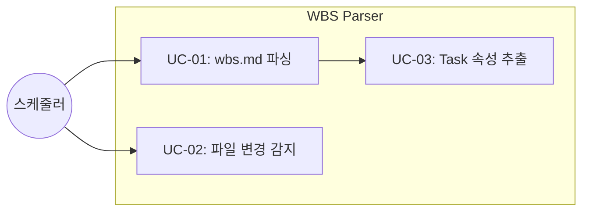
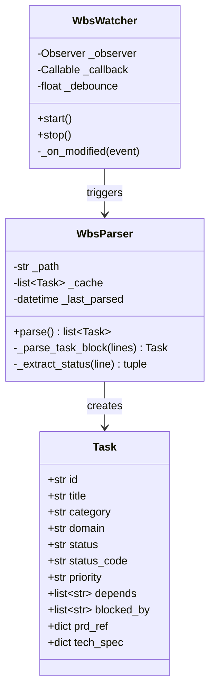

# TSK-01-02 - WBS 파서 구현 설계 문서

## 문서 정보

| 항목 | 내용 |
|------|------|
| Task ID | TSK-01-02 |
| 문서 버전 | 1.0 |
| 작성일 | 2025-12-28 |
| 상태 | 작성중 |
| 카테고리 | development |

---

## 1. 개요

### 1.1 배경 및 문제 정의

**현재 상황:**
- orchay 스케줄러가 wbs.md 파일에서 Task 정보를 읽어와야 함
- wbs.md는 마크다운 형식으로 계층적 Task 구조를 표현
- 실시간으로 파일 변경을 감지하여 스케줄 큐를 갱신해야 함

**해결하려는 문제:**
- 마크다운 형식의 wbs.md를 구조화된 Task 객체로 변환
- 파일 변경 시 자동으로 재파싱하여 최신 상태 유지
- 파싱 오류 발생 시 안정적인 폴백 제공

### 1.2 목적 및 기대 효과

**목적:**
- wbs.md 파일을 파싱하여 Task 리스트 반환
- 파일 변경 감지 및 콜백 실행

**기대 효과:**
- 스케줄러가 실행 가능한 Task를 정확히 파악
- 실시간 상태 변경 반영으로 자동화 워크플로우 지원

### 1.3 범위

**포함:**
- wbs.md 마크다운 파싱
- Task 속성 추출 (category, domain, status, priority, depends, blocked-by 등)
- 상태 기호 파싱 ([ ], [dd], [ap], [im], [xx] 등)
- watchdog 기반 파일 변경 감지
- asyncio 이벤트 기반 변경 알림

**제외:**
- wbs.md 파일 수정 (워커가 담당)
- 스케줄링 로직 (TSK-01-03에서 담당)
- UI 표시 (TSK-02-02에서 담당)

### 1.4 참조 문서

| 문서 | 경로 | 관련 섹션 |
|------|------|----------|
| PRD | `.orchay/projects/orchay/prd.md` | 3.1 wbs.md 모니터링, 3.2 스케줄 큐 관리 |
| TRD | `.orchay/projects/orchay/trd.md` | 배포 구조, 의존성 목록 |
| workflows.json | `.orchay/settings/workflows.json` | states, categories |

---

## 2. 사용자 분석

### 2.1 대상 사용자

| 사용자 유형 | 특성 | 주요 니즈 |
|------------|------|----------|
| 스케줄러 코어 | 내부 모듈 | 정확한 Task 리스트, 실시간 갱신 |
| 개발자 | 디버깅 목적 | 파싱 결과 검증, 에러 추적 |

### 2.2 사용자 페르소나

**페르소나 1: 스케줄러 코어**
- 역할: 내부 소비자 모듈
- 목표: 실행 가능한 Task 목록 획득
- 불만: 부정확한 파싱, 지연된 갱신
- 시나리오: wbs.md 변경 시 즉시 콜백 수신

---

## 3. 유즈케이스

### 3.1 유즈케이스 다이어그램



### 3.2 유즈케이스 상세

#### UC-01: wbs.md 파싱

| 항목 | 내용 |
|------|------|
| 액터 | 스케줄러 코어 |
| 목적 | wbs.md 파일을 Task 리스트로 변환 |
| 사전 조건 | wbs.md 파일 존재 |
| 사후 조건 | Task 리스트 반환 |
| 트리거 | parse_wbs() 호출 또는 파일 변경 이벤트 |

**기본 흐름:**
1. wbs.md 파일 읽기
2. 마크다운 헤더 파싱 (##, ###, ####)
3. 각 Task 블록에서 속성 추출
4. Task 객체 리스트 생성
5. 리스트 반환

**대안 흐름:**
- 2a. 파일이 존재하지 않으면:
  - 빈 리스트 반환
  - 경고 로그 기록

**예외 흐름:**
- 3a. 파싱 오류 발생 시:
  - 이전 파싱 결과 유지
  - 에러 로그 기록

#### UC-02: 파일 변경 감지

| 항목 | 내용 |
|------|------|
| 액터 | 파일 시스템 |
| 목적 | wbs.md 변경 시 콜백 실행 |
| 사전 조건 | watch_wbs() 호출됨 |
| 사후 조건 | 콜백 함수 실행 |
| 트리거 | 파일 수정/저장 이벤트 |

**기본 흐름:**
1. watchdog Observer 시작
2. 파일 수정 이벤트 감지
3. 디바운싱 (중복 이벤트 필터링)
4. 콜백 함수 호출

---

## 4. 사용자 시나리오

### 4.1 시나리오 1: 초기 파싱

**상황 설명:**
스케줄러가 시작될 때 wbs.md를 파싱하여 초기 Task 큐를 구성

**단계별 진행:**

| 단계 | 시스템 행동 | 결과 |
|------|-----------|------|
| 1 | parse_wbs() 호출 | wbs.md 파일 로드 |
| 2 | 마크다운 파싱 | Task 블록 추출 |
| 3 | 속성 추출 | Task 객체 생성 |
| 4 | 리스트 반환 | 스케줄러에서 큐 구성 |

**성공 조건:**
- 모든 Task가 정확히 파싱됨
- 상태 기호가 올바르게 해석됨

### 4.2 시나리오 2: 실시간 갱신

**상황 설명:**
워커가 Task 완료 후 wbs.md 상태를 업데이트

**단계별 진행:**

| 단계 | 시스템 행동 | 결과 |
|------|-----------|------|
| 1 | 워커가 wbs.md 수정 | 파일 변경 이벤트 발생 |
| 2 | watchdog 이벤트 감지 | 콜백 대기열에 추가 |
| 3 | 디바운싱 후 콜백 실행 | parse_wbs() 재호출 |
| 4 | 새 Task 리스트 반환 | 스케줄러 큐 갱신 |

### 4.3 시나리오 3: 파싱 오류

**상황 설명:**
잘못된 형식의 wbs.md로 인해 파싱 실패

**단계별 진행:**

| 단계 | 시스템 행동 | 복구 방법 |
|------|-----------|----------|
| 1 | 파싱 시도 | 예외 발생 |
| 2 | 에러 로그 기록 | 상세 위치 정보 포함 |
| 3 | 이전 결과 유지 | 캐시된 Task 리스트 반환 |

---

## 5. 아키텍처 설계

### 5.1 모듈 구조

```
src/orchay/
├── wbs_parser.py       # 메인 파서 모듈
├── models/
│   └── task.py         # Task Pydantic 모델
└── utils/
    └── watcher.py      # 파일 감시 유틸리티 (선택)
```

### 5.2 클래스 다이어그램



### 5.3 상태 코드 매핑

workflows.json의 states와 연동:

| 상태 기호 | id | label | 의미 |
|----------|-----|-------|------|
| `[ ]` | todo | 시작 전 | 대기 |
| `[bd]` | basic-design | 기본설계 | 설계 중 |
| `[dd]` | detail-design | 상세설계 | 상세 설계 중 |
| `[ap]` | approve | 승인 | 승인 대기 |
| `[im]` | implement | 구현 | 구현 중 |
| `[vf]` | verify | 검증 | 검증 중 |
| `[xx]` | done | 완료 | 완료 |
| `[an]` | analysis | 분석 | 결함 분석 |
| `[fx]` | fix | 수정 | 결함 수정 |
| `[ds]` | design | 설계 | 인프라 설계 |

---

## 6. API 명세

### 6.1 parse_wbs

```python
async def parse_wbs(path: str | Path) -> list[Task]:
    """wbs.md 파일을 파싱하여 Task 리스트 반환

    Args:
        path: wbs.md 파일 경로

    Returns:
        Task 객체 리스트

    Raises:
        FileNotFoundError: 파일이 존재하지 않을 때
        WbsParseError: 파싱 실패 시 (이전 캐시 반환)

    Example:
        tasks = await parse_wbs(".orchay/projects/orchay/wbs.md")
        for task in tasks:
            print(f"{task.id}: {task.status}")
    """
```

### 6.2 watch_wbs

```python
def watch_wbs(
    path: str | Path,
    callback: Callable[[list[Task]], Awaitable[None]],
    debounce: float = 0.5
) -> WbsWatcher:
    """wbs.md 파일 변경 감지 및 콜백 실행

    Args:
        path: 감시할 wbs.md 파일 경로
        callback: 변경 시 호출될 async 콜백 (Task 리스트 전달)
        debounce: 디바운스 시간 (초)

    Returns:
        WbsWatcher 인스턴스 (start/stop 메서드 제공)

    Example:
        async def on_change(tasks: list[Task]):
            print(f"Tasks updated: {len(tasks)}")

        watcher = watch_wbs("wbs.md", on_change)
        watcher.start()
        # ... 작업 ...
        watcher.stop()
    """
```

### 6.3 Task 모델

```python
from pydantic import BaseModel, Field
from typing import Literal

class Task(BaseModel):
    """WBS Task 모델"""

    id: str = Field(..., description="Task ID (예: TSK-01-02)")
    title: str = Field(..., description="Task 제목")
    category: str = Field(..., description="카테고리 (development, defect, infrastructure)")
    domain: str = Field(default="", description="도메인 (backend, frontend, infra 등)")
    status: str = Field(..., description="상태 텍스트 (예: 'todo [ ]')")
    status_code: str = Field(..., description="상태 코드 (예: '[ ]', '[im]')")
    priority: Literal["critical", "high", "medium", "low"] = Field(default="medium")
    assignee: str = Field(default="-")
    schedule: str = Field(default="")
    tags: list[str] = Field(default_factory=list)
    depends: list[str] = Field(default_factory=list)
    blocked_by: list[str] = Field(default_factory=list)

    # PRD/TRD 연동 (선택)
    prd_ref: str = Field(default="")
    requirements: list[str] = Field(default_factory=list)
    acceptance: list[str] = Field(default_factory=list)
    tech_spec: dict = Field(default_factory=dict)
```

---

## 7. 데이터 요구사항

### 7.1 입력 데이터: wbs.md 형식

```markdown
### TSK-01-02: WBS 파서 구현
- category: development
- domain: backend
- status: [ ]
- priority: critical
- assignee: -
- schedule: 2025-12-29 ~ 2025-12-29
- tags: parser, markdown, regex
- depends: TSK-01-01

#### PRD 요구사항
- prd-ref: PRD 3.1, PRD 3.2
- requirements:
  - wbs.md 파일 파싱
  - Task 속성 추출
  - 파일 변경 감지
```

### 7.2 파싱 규칙

| 패턴 | 의미 | 정규식 |
|------|------|--------|
| `### TSK-XX-XX:` | Task 헤더 (3단계) | `^###\s+(TSK-\d+-\d+):\s*(.+)$` |
| `#### TSK-XX-XX-XX:` | Task 헤더 (4단계) | `^####\s+(TSK-\d+-\d+-\d+):\s*(.+)$` |
| `- status: xxx [yy]` | 상태 + 코드 | `^-\s*status:\s*(.+?)\s*(\[.+?\])?\s*$` |
| `- depends: TSK-XX-XX` | 의존성 | `^-\s*depends:\s*(.+)$` |
| `- tags: a, b, c` | 태그 목록 | `^-\s*tags:\s*(.+)$` |

### 7.3 상태 코드 추출

```python
import re

STATUS_PATTERN = re.compile(r'\[([^\]]+)\]')

def extract_status_code(status_line: str) -> str:
    """상태 라인에서 코드 추출

    '- status: todo [ ]' -> '[ ]'
    '- status: implement [im]' -> '[im]'
    """
    match = STATUS_PATTERN.search(status_line)
    return match.group(0) if match else '[ ]'
```

---

## 8. 비즈니스 규칙

### 8.1 핵심 규칙

| 규칙 ID | 규칙 설명 | 적용 상황 | 예외 |
|---------|----------|----------|------|
| BR-01 | 파싱 실패 시 이전 캐시 반환 | 모든 파싱 시도 | 최초 파싱 시 빈 리스트 |
| BR-02 | 상태 코드 없으면 `[ ]` 기본값 | status 파싱 | - |
| BR-03 | 디바운싱으로 중복 이벤트 필터링 | 파일 변경 감지 | - |
| BR-04 | workflows.json의 states 유효성 검증 | 상태 코드 파싱 | 알 수 없는 코드는 그대로 반환 |

### 8.2 규칙 상세 설명

**BR-01: 파싱 실패 시 캐시 반환**

설명: 파일 수정 중간에 저장되거나 형식 오류가 있을 수 있음. 스케줄러 안정성을 위해 이전 성공한 결과를 캐시하고 반환.

예시:
- 파싱 성공: 새 리스트 캐시 및 반환
- 파싱 실패: 에러 로그 + 캐시된 리스트 반환

---

## 9. 에러 처리

### 9.1 예상 에러 상황

| 상황 | 원인 | 처리 방법 | 로그 레벨 |
|------|------|----------|----------|
| 파일 없음 | 경로 오류 | 빈 리스트 반환 | WARNING |
| 파싱 오류 | 형식 불일치 | 캐시 반환 | ERROR |
| 인코딩 오류 | UTF-8 아님 | 캐시 반환 | ERROR |
| watchdog 오류 | 권한/경로 | 재시도 또는 종료 | CRITICAL |

### 9.2 에러 클래스

```python
class WbsParseError(Exception):
    """WBS 파싱 오류"""

    def __init__(self, message: str, line_number: int | None = None):
        self.line_number = line_number
        super().__init__(f"{message} (line {line_number})" if line_number else message)
```

---

## 10. 연관 문서

| 문서 | 경로 | 용도 |
|------|------|------|
| 요구사항 추적 매트릭스 | `025-traceability-matrix.md` | PRD → 설계 → 테스트 추적 |
| 테스트 명세서 | `026-test-specification.md` | 단위/통합 테스트 정의 |

---

## 11. 구현 범위

### 11.1 영향받는 영역

| 영역 | 변경 내용 | 영향도 |
|------|----------|--------|
| `src/orchay/wbs_parser.py` | 신규 생성 | 높음 |
| `src/orchay/models/task.py` | Task 모델 (TSK-01-01에서 생성) | 중간 |

### 11.2 의존성

| 의존 항목 | 이유 | 상태 |
|----------|------|------|
| TSK-01-01 | Pydantic 모델, 프로젝트 구조 | 대기 |
| watchdog | 파일 변경 감지 | 외부 의존성 |

### 11.3 제약 사항

| 제약 | 설명 | 대응 방안 |
|------|------|----------|
| asyncio 호환 | Textual과 동일 이벤트 루프 사용 | asyncio 기반 구현 |
| 크로스플랫폼 | Windows/macOS/Linux 지원 | watchdog 사용 |

---

## 12. 체크리스트

### 12.1 설계 완료 확인

- [x] 문제 정의 및 목적 명확화
- [x] 사용자 분석 완료
- [x] 유즈케이스 정의 완료
- [x] 사용자 시나리오 작성 완료
- [x] 아키텍처 설계 완료
- [x] API 명세 정의 완료
- [x] 데이터 요구사항 정의 완료
- [x] 비즈니스 규칙 정의 완료
- [x] 에러 처리 정의 완료

### 12.2 연관 문서 작성

- [ ] 요구사항 추적 매트릭스 작성 (→ `025-traceability-matrix.md`)
- [ ] 테스트 명세서 작성 (→ `026-test-specification.md`)

### 12.3 구현 준비

- [x] 구현 우선순위 결정
- [x] 의존성 확인 완료
- [x] 제약 사항 검토 완료

---

## 변경 이력

| 버전 | 일자 | 작성자 | 변경 내용 |
|------|------|--------|----------|
| 1.0 | 2025-12-28 | Claude | 최초 작성 |
