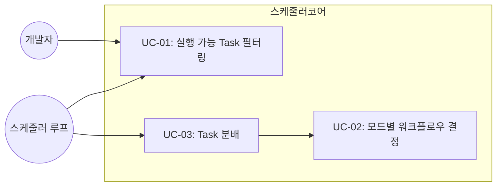

# TSK-01-03 - 스케줄러 코어 구현 설계 문서

## 문서 정보

| 항목 | 내용 |
|------|------|
| Task ID | TSK-01-03 |
| 문서 버전 | 1.0 |
| 작성일 | 2025-12-28 |
| 상태 | 작성중 |
| 카테고리 | development |

---

## 1. 개요

### 1.1 배경 및 문제 정의

**현재 상황:**
- WezTerm 멀티플렉서 환경에서 여러 Claude Code Worker가 각각 독립적으로 실행됨
- 개발자가 수동으로 각 Worker에 Task를 할당해야 함
- Task 간 의존성과 우선순위를 고려한 작업 순서 관리가 어려움

**해결하려는 문제:**
- 실행 가능한 Task를 자동으로 필터링하고 우선순위에 따라 정렬하는 로직 부재
- 모드별(design, quick, develop, force)로 다른 의존성 검사 규칙 적용 필요
- Task 분배 시 중복 분배 방지 및 의존성 순서 준수 메커니즘 필요

### 1.2 목적 및 기대 효과

**목적:**
- 스케줄러의 핵심 로직인 Task 필터링, 우선순위 정렬, 분배 기능 구현
- 4가지 실행 모드에 따른 차별화된 워크플로우 단계 결정 로직 구현

**기대 효과:**
- 개발자의 수동 Task 관리 부담 제거
- 의존성 준수로 빌드 실패 및 충돌 최소화
- 모드별 최적화된 개발 워크플로우 지원

### 1.3 범위

**포함:**
- 실행 가능 Task 필터링 함수 (`filter_executable_tasks`)
- 모드별 워크플로우 단계 결정 함수 (`get_workflow_steps`)
- Task 분배 함수 (`dispatch_task`)
- 우선순위 정렬 로직 (priority + schedule)
- 의존성 검사 로직 (모드별 분기)

**제외:**
- WezTerm CLI 통합 (TSK-01-04에서 구현)
- Worker 상태 감지 (TSK-01-04에서 구현)
- TUI 화면 (TSK-02-02에서 구현)

### 1.4 참조 문서

| 문서 | 경로 | 관련 섹션 |
|------|------|----------|
| PRD | `.orchay/projects/orchay/prd.md` | 3.2 스케줄 큐 관리, 3.4 작업 분배, 3.8 실행 모드 |
| TRD | `.orchay/projects/orchay/trd.md` | asyncio 기반 설계, workflows.json 연동 |
| WBS | `.orchay/projects/orchay/wbs.md` | TSK-01-03 |

---

## 2. 사용자 분석

### 2.1 대상 사용자

| 사용자 유형 | 특성 | 주요 니즈 |
|------------|------|----------|
| orchay 스케줄러 (시스템) | 내부 호출자 | 정확한 Task 필터링, 빠른 우선순위 계산 |
| 개발자 | orchay 사용자 | 모드 전환, 큐 상태 확인, Task 수동 조정 |

### 2.2 사용자 페르소나

**페르소나 1: orchay 스케줄러 (시스템)**
- 역할: 메인 이벤트 루프에서 주기적으로 호출
- 목표: 대기 중인 Worker에 적절한 Task 분배
- 불만: 잘못된 필터링으로 의존성 미충족 Task 분배
- 시나리오: wbs.md 변경 감지 → 큐 갱신 → Worker idle 감지 → dispatch

**페르소나 2: 개발자 (인터랙티브)**
- 역할: 모드 전환, 큐 조정 명령 실행
- 목표: 특정 Task 우선 처리, 긴급 모드 전환
- 불만: 의존성 때문에 원하는 Task가 큐에 표시되지 않음
- 시나리오: `mode force` → 의존성 무시 → Task 즉시 분배

---

## 3. 유즈케이스

### 3.1 유즈케이스 다이어그램



### 3.2 유즈케이스 상세

#### UC-01: 실행 가능 Task 필터링

| 항목 | 내용 |
|------|------|
| 액터 | 스케줄러 루프, 개발자 (queue 명령) |
| 목적 | 현재 모드에서 분배 가능한 Task 목록 산출 |
| 사전 조건 | wbs.md 파싱 완료, Task 목록 존재 |
| 사후 조건 | 정렬된 실행 가능 Task 리스트 반환 |
| 트리거 | wbs.md 변경, 모드 전환, queue 명령 |

**기본 흐름:**
1. 전체 Task 목록을 입력받는다
2. 완료 상태(`[xx]`) Task를 제외한다
3. `blocked-by` 필드가 설정된 Task를 제외한다
4. 현재 실행 중인 Task를 제외한다
5. 모드에 따라 의존성 필터링을 적용한다
6. 우선순위(priority) → 일정(schedule) 순으로 정렬한다
7. 정렬된 리스트를 반환한다

**대안 흐름:**
- 5a. design 모드인 경우:
  - `[ ]` 상태 Task만 포함
  - 의존성 무시

- 5b. quick/develop 모드인 경우:
  - `[ ]` 상태: 의존성 무시
  - `[dd]` 이상 상태: depends의 선행 Task가 `[im]` 이상인지 확인

- 5c. force 모드인 경우:
  - 모든 미완료 Task 포함
  - 의존성 무시

**예외 흐름:**
- 2a. Task 목록이 비어있으면:
  - 빈 리스트 반환

#### UC-02: 모드별 워크플로우 결정

| 항목 | 내용 |
|------|------|
| 액터 | dispatch_task 함수 |
| 목적 | Task와 모드에 따른 실행할 워크플로우 단계 결정 |
| 사전 조건 | Task 객체, 현재 모드 |
| 사후 조건 | 워크플로우 명령어 리스트 반환 |
| 트리거 | Task 분배 시 |

**기본 흐름:**
1. Task의 현재 상태를 확인한다
2. 현재 모드를 확인한다
3. 모드와 상태에 따른 워크플로우 단계를 결정한다
4. 명령어 리스트를 반환한다

**모드별 반환값:**
- design 모드: `["start"]`
- quick/force 모드: `["start", "approve", "build", "done"]`
- develop 모드: `["start", "review", "apply", "approve", "build", "audit", "patch", "test", "done"]`

#### UC-03: Task 분배

| 항목 | 내용 |
|------|------|
| 액터 | 스케줄러 루프 |
| 목적 | idle 상태 Worker에 Task 할당 |
| 사전 조건 | 실행 가능 Task 존재, idle Worker 존재 |
| 사후 조건 | Worker가 busy 상태로 전환, Task 실행 시작 |
| 트리거 | Worker idle 감지 + 큐에 Task 존재 |

**기본 흐름:**
1. Worker가 idle 상태인지 확인한다
2. 큐에서 다음 Task를 선택한다
3. 워크플로우 단계를 결정한다
4. Worker 상태를 busy로 변경한다
5. Worker의 current_task를 설정한다
6. dispatch_time을 기록한다
7. (TSK-01-04에서 구현) WezTerm CLI로 명령 전송

---

## 4. 사용자 시나리오

### 4.1 시나리오 1: 정상적인 Task 분배

**상황 설명:**
스케줄러가 실행 중이고, Worker 1이 이전 Task를 완료하여 idle 상태가 되었다. 큐에는 여러 Task가 대기 중이다.

**단계별 진행:**

| 단계 | 스케줄러 행동 | 시스템 반응 | 결과 |
|------|-----------|------------|------------|
| 1 | Worker 1 idle 감지 | 큐에서 최우선 Task 조회 | TSK-01-03 선택 |
| 2 | `get_workflow_steps(task, mode)` 호출 | develop 모드 → 9단계 워크플로우 | `["start", ...]` |
| 3 | `dispatch_task(worker, task)` 호출 | Worker 상태 업데이트 | busy 상태 전환 |
| 4 | 명령 전송 (TSK-01-04) | `/wf:start TSK-01-03` 전송 | Task 실행 시작 |

**성공 조건:**
- Worker가 busy 상태로 전환
- 동일 Task가 다른 Worker에 중복 분배되지 않음

### 4.2 시나리오 2: 의존성으로 인한 필터링

**상황 설명:**
develop 모드에서 TSK-01-03이 TSK-01-02에 의존하는데, TSK-01-02가 아직 `[dd]` 상태이다.

**단계별 진행:**

| 단계 | 스케줄러 행동 | 시스템 반응 | 결과 |
|------|-----------|------------|----------|
| 1 | `filter_executable_tasks` 호출 | TSK-01-03 의존성 검사 | depends: TSK-01-02 |
| 2 | TSK-01-02 상태 확인 | 현재 상태 `[dd]` | `[im]` 미만 |
| 3 | 의존성 미충족 판정 | TSK-01-03 제외 | 큐에서 제거 |

### 4.3 시나리오 3: force 모드로 전환

**상황 설명:**
긴급한 상황으로 의존성을 무시하고 TSK-01-03을 먼저 처리해야 한다.

**단계별 진행:**

| 단계 | 사용자 행동 | 시스템 반응 | 결과 |
|------|-----------|------------|----------|
| 1 | `mode force` 명령 입력 | 모드 전환 | force 모드 활성화 |
| 2 | `filter_executable_tasks` 재실행 | 의존성 무시 | TSK-01-03 포함 |
| 3 | Worker idle 시 분배 | 큐 순서대로 분배 | TSK-01-03 즉시 분배 |

---

## 5. 화면 설계

> 본 Task는 백엔드 로직으로, 화면은 TUI에서 큐 상태 표시 시 사용됩니다.

### 5.1 큐 상태 표시 (DataTable)

**표시 형식:**
```
┌─────────────────────────────────────────────────────────────────┐
│  # │ Task ID       │ Priority │ Status │ Depends    │ Mode     │
├────┼───────────────┼──────────┼────────┼────────────┼──────────┤
│  1 │ TSK-01-02     │ critical │ [ ]    │ TSK-01-01  │ ✓ ready  │
│  2 │ TSK-01-03     │ critical │ [ ]    │ TSK-01-02  │ ⏳ wait  │
│  3 │ TSK-02-01     │ high     │ [ ]    │ -          │ ✓ ready  │
└─────────────────────────────────────────────────────────────────┘
```

---

## 6. 인터랙션 설계

### 6.1 스케줄러 루프와의 상호작용

| 이벤트 | 스케줄러 코어 함수 | 반환값 |
|--------|------------------|--------|
| wbs.md 변경 | `filter_executable_tasks(tasks, mode)` | `list[Task]` |
| Worker idle | `dispatch_task(worker, task, mode)` | `None` (상태 변경) |
| 모드 전환 | `filter_executable_tasks(tasks, new_mode)` | 갱신된 `list[Task]` |

### 6.2 상태별 동작

| 상태 | 동작 | 후속 처리 |
|------|------|----------|
| Task `[ ]` (Todo) | 모든 모드에서 설계 가능 | start 실행 |
| Task `[dd]` (설계완료) | develop/quick 모드에서 의존성 검사 | approve 실행 |
| Task `[im]` (구현중) | 이미 분배된 상태 | 큐에서 제외 |
| Task `[xx]` (완료) | 항상 제외 | - |

---

## 7. 데이터 요구사항

### 7.1 필요한 데이터

| 데이터 | 설명 | 출처 | 용도 |
|--------|------|------|------|
| Task 목록 | wbs.md에서 파싱된 Task 객체들 | WBS 파서 (TSK-01-02) | 필터링 대상 |
| 현재 모드 | design/quick/develop/force | 사용자 설정/명령 | 필터링 규칙 결정 |
| Worker 상태 | idle/busy/error 등 | Worker 관리 (TSK-01-04) | 분배 대상 결정 |
| 실행 중 Task | 현재 분배된 Task 목록 | 내부 상태 | 중복 분배 방지 |

### 7.2 데이터 구조

```python
from enum import Enum
from pydantic import BaseModel
from datetime import datetime

class Priority(str, Enum):
    CRITICAL = "critical"
    HIGH = "high"
    MEDIUM = "medium"
    LOW = "low"

class ExecutionMode(str, Enum):
    DESIGN = "design"
    QUICK = "quick"
    DEVELOP = "develop"
    FORCE = "force"

class Task(BaseModel):
    id: str                          # TSK-XX-XX
    category: str                    # development, defect, infrastructure
    domain: str                      # backend, frontend, etc
    status: str                      # [ ], [dd], [ap], [im], [xx]
    priority: Priority
    depends: list[str] | None = None # 선행 Task ID 목록
    blocked_by: list[str] | None = None

class Worker(BaseModel):
    id: str
    pane_id: int
    state: str                       # idle, busy, paused, error, etc
    current_task: str | None = None
    dispatch_time: datetime | None = None
```

### 7.3 데이터 유효성 규칙

| 데이터 필드 | 규칙 | 위반 시 처리 |
|------------|------|---------------|
| task.id | TSK-XX-XX 형식 | ValueError |
| task.priority | Priority enum 멤버 | 기본값 MEDIUM |
| task.status | 유효한 상태 기호 | ValueError |
| mode | ExecutionMode enum 멤버 | 기본값 QUICK |

---

## 8. 비즈니스 규칙

### 8.1 핵심 규칙

| 규칙 ID | 규칙 설명 | 적용 상황 | 예외 |
|---------|----------|----------|------|
| BR-01 | 완료 Task(`[xx]`)는 항상 제외 | 모든 필터링 | 없음 |
| BR-02 | `blocked-by` 설정된 Task 제외 | 모든 필터링 | 없음 |
| BR-03 | 실행 중 Task 중복 분배 금지 | 모든 분배 | 없음 |
| BR-04 | design 모드: `[ ]` 상태만 표시 | filter_executable_tasks | 없음 |
| BR-05 | develop/quick: 구현 단계에서 의존성 검사 | `[dd]` 이상 상태 | force 모드 |
| BR-06 | force 모드: 의존성 무시 | 모든 상태 | 없음 |
| BR-07 | 우선순위 정렬: critical > high > medium > low | 큐 정렬 | 없음 |

### 8.2 규칙 상세 설명

**BR-05: 의존성 검사 규칙**

설명: quick/develop 모드에서 Task가 이미 설계 완료(`[dd]` 이상)인 경우, 구현 단계로 진행하려면 `depends`에 명시된 선행 Task들이 모두 `[im]` 이상 상태여야 합니다.

예시:
- TSK-01-03이 TSK-01-02에 의존
- TSK-01-02가 `[dd]` 상태: TSK-01-03은 구현 불가 (큐에서 제외)
- TSK-01-02가 `[im]` 상태: TSK-01-03은 구현 가능 (큐에 포함)

**BR-07: 우선순위 정렬**

설명: 동일 우선순위 내에서는 schedule 시작일이 빠른 Task가 먼저 분배됩니다.

정렬 키: `(priority_order, schedule_start_date)`

---

## 9. 에러 처리

### 9.1 예상 에러 상황

| 상황 | 원인 | 처리 방법 | 로그 레벨 |
|------|------|----------|----------|
| 빈 Task 목록 | wbs.md 파싱 실패 또는 모든 Task 완료 | 빈 리스트 반환 | INFO |
| 잘못된 priority 값 | wbs.md 오타 | 기본값 MEDIUM 적용 | WARNING |
| 순환 의존성 | depends 설정 오류 | 해당 Task 제외 + 경고 | ERROR |
| 존재하지 않는 depends Task | Task ID 오타 | 해당 의존성 무시 | WARNING |

### 9.2 에러 반환 형식

```python
from typing import TypeVar, Generic
from pydantic import BaseModel

T = TypeVar('T')

class Result(BaseModel, Generic[T]):
    success: bool
    data: T | None = None
    error: str | None = None
```

---

## 10. 연관 문서

| 문서 | 경로 | 용도 |
|------|------|------|
| 요구사항 추적 매트릭스 | `025-traceability-matrix.md` | PRD → 설계 → 테스트 양방향 추적 |
| 테스트 명세서 | `026-test-specification.md` | 단위/통합 테스트 상세 정의 |

---

## 11. 구현 범위

### 11.1 영향받는 영역

| 영역 | 변경 내용 | 영향도 |
|------|----------|--------|
| `scheduler.py` | 새 모듈 생성 | 높음 |
| `models/task.py` | Task 모델 확장 (depends, blocked_by) | 중간 |
| `models/worker.py` | Worker 모델 확장 (current_task, dispatch_time) | 중간 |

### 11.2 의존성

| 의존 항목 | 이유 | 상태 |
|----------|------|------|
| TSK-01-01 | Task, Worker 모델 정의 필요 | design [dd] |
| TSK-01-02 | wbs.md 파싱 → Task 목록 제공 | Todo [ ] |

### 11.3 제약 사항

| 제약 | 설명 | 대응 방안 |
|------|------|----------|
| asyncio 기반 | TRD에서 asyncio 필수 지정 | async/await 패턴 준수 |
| workflows.json 연동 | 모드 정의는 외부 JSON에서 로드 | 설정 로더 함수 구현 |

---

## 12. API 설계

### 12.1 주요 함수 시그니처

```python
async def filter_executable_tasks(
    tasks: list[Task],
    mode: ExecutionMode,
    running_tasks: set[str] | None = None
) -> list[Task]:
    """실행 가능한 Task를 필터링하고 우선순위순으로 정렬합니다.

    Args:
        tasks: 전체 Task 목록
        mode: 현재 실행 모드
        running_tasks: 현재 실행 중인 Task ID 집합

    Returns:
        우선순위순 정렬된 실행 가능 Task 리스트
    """
    pass


def get_workflow_steps(
    task: Task,
    mode: ExecutionMode
) -> list[str]:
    """모드와 Task 상태에 따른 워크플로우 단계를 반환합니다.

    Args:
        task: 대상 Task
        mode: 현재 실행 모드

    Returns:
        워크플로우 명령어 리스트 (예: ["start", "approve", "build", "done"])
    """
    pass


async def dispatch_task(
    worker: Worker,
    task: Task,
    mode: ExecutionMode
) -> None:
    """Worker에 Task를 분배합니다.

    Args:
        worker: 대상 Worker
        task: 분배할 Task
        mode: 현재 실행 모드

    Side Effects:
        - worker.state = "busy"
        - worker.current_task = task.id
        - worker.dispatch_time = now()
    """
    pass


def check_dependencies_implemented(
    task: Task,
    all_tasks: dict[str, Task]
) -> bool:
    """Task의 선행 의존성이 모두 구현 완료([im] 이상)인지 확인합니다.

    Args:
        task: 검사 대상 Task
        all_tasks: 전체 Task 딕셔너리 (id -> Task)

    Returns:
        모든 의존성이 충족되면 True
    """
    pass
```

### 12.2 상수 정의

```python
# 우선순위 정렬 순서
PRIORITY_ORDER = {
    Priority.CRITICAL: 0,
    Priority.HIGH: 1,
    Priority.MEDIUM: 2,
    Priority.LOW: 3,
}

# 구현 완료 이상 상태
IMPLEMENTED_STATUSES = {"[im]", "[vf]", "[xx]"}

# 모드별 워크플로우 단계
WORKFLOW_STEPS = {
    ExecutionMode.DESIGN: ["start"],
    ExecutionMode.QUICK: ["start", "approve", "build", "done"],
    ExecutionMode.DEVELOP: [
        "start", "review", "apply", "approve",
        "build", "audit", "patch", "test", "done"
    ],
    ExecutionMode.FORCE: ["start", "approve", "build", "done"],
}
```

---

## 13. 체크리스트

### 13.1 설계 완료 확인

- [x] 문제 정의 및 목적 명확화
- [x] 사용자 분석 완료
- [x] 유즈케이스 정의 완료
- [x] 사용자 시나리오 작성 완료
- [x] 화면 설계 완료 (큐 표시 형식)
- [x] 인터랙션 설계 완료
- [x] 데이터 요구사항 정의 완료
- [x] 비즈니스 규칙 정의 완료
- [x] 에러 처리 정의 완료
- [x] API 설계 완료

### 13.2 연관 문서 작성

- [ ] 요구사항 추적 매트릭스 작성 (→ `025-traceability-matrix.md`)
- [ ] 테스트 명세서 작성 (→ `026-test-specification.md`)

### 13.3 구현 준비

- [x] 구현 우선순위 결정 (의존성: TSK-01-01, TSK-01-02)
- [x] 의존성 확인 완료
- [x] 제약 사항 검토 완료

---

## 변경 이력

| 버전 | 일자 | 작성자 | 변경 내용 |
|------|------|--------|----------|
| 1.0 | 2025-12-28 | Claude | 최초 작성 |
