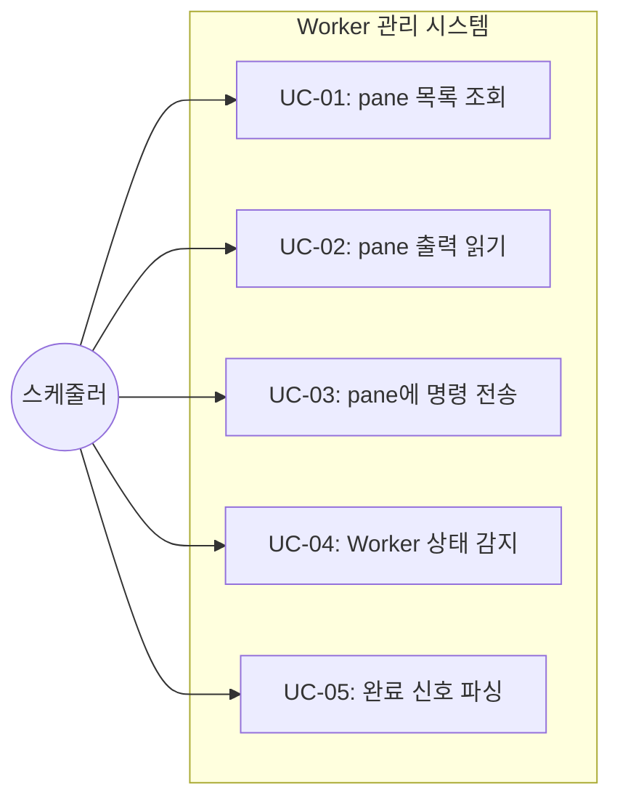
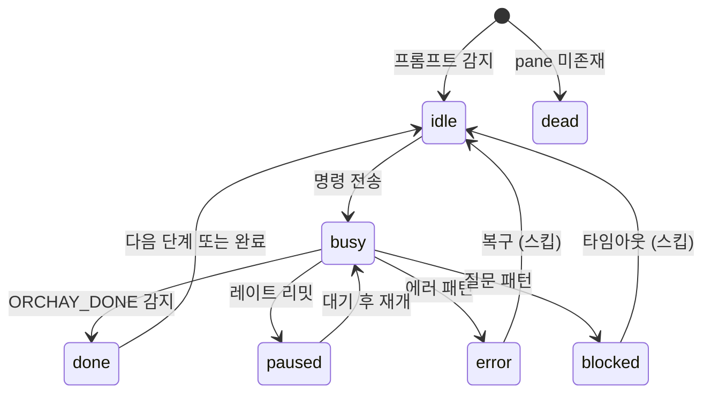

# TSK-01-04 - Worker 관리 및 WezTerm CLI 통합 설계 문서

## 문서 정보

| 항목 | 내용 |
|------|------|
| Task ID | TSK-01-04 |
| 문서 버전 | 1.0 |
| 작성일 | 2025-12-28 |
| 상태 | 작성중 |
| 카테고리 | development |

---

## 1. 개요

### 1.1 배경 및 문제 정의

**현재 상황:**
- WezTerm 터미널에서 여러 Claude Code 인스턴스를 수동으로 관리해야 함
- 각 Worker pane의 상태(idle, busy, error 등)를 사람이 직접 확인해야 함
- Task 완료 여부를 수동으로 추적해야 함

**해결하려는 문제:**
- Worker pane 상태 자동 감지 부재
- WezTerm CLI 통합 래퍼 부재
- 작업 완료 신호(ORCHAY_DONE) 파싱 로직 부재
- 명령어 전송 자동화 부재

### 1.2 목적 및 기대 효과

**목적:**
- WezTerm CLI 래퍼를 통한 pane 관리 자동화
- Worker 상태 감지 시스템 구현
- ORCHAY_DONE 패턴 파싱으로 작업 완료 감지
- /clear 후 명령 전송 자동화

**기대 효과:**
- Worker 상태 감지 정확도 95% 이상
- 수동 개입 없는 Task 분배 가능
- 스케줄러 코어와 완전 통합

### 1.3 범위

**포함:**
- WezTerm CLI 래퍼 (list, get-text, send-text)
- Worker 상태 감지 (done, idle, busy, paused, error, blocked, dead)
- ORCHAY_DONE 패턴 파싱
- 프롬프트/에러/일시중단 패턴 매칭
- /clear 후 명령 전송 로직

**제외:**
- TUI 인터페이스 (TSK-02-02에서 구현)
- 자동 재개 메커니즘 (TSK-02-01에서 구현)
- 히스토리 관리 (TSK-02-04에서 구현)

### 1.4 참조 문서

| 문서 | 경로 | 관련 섹션 |
|------|------|----------|
| PRD | `.orchay/projects/orchay/prd.md` | 3.3 Worker 상태 감지, 3.4 작업 분배, 2.4 워커 상태 |
| TRD | `.orchay/projects/orchay/trd.md` | 배포 구조, AI 코딩 가이드라인 |
| TSK-01-03 | 스케줄러 코어 | 의존성 |

---

## 2. 사용자 분석

### 2.1 대상 사용자

| 사용자 유형 | 특성 | 주요 니즈 |
|------------|------|----------|
| orchay 스케줄러 | 시스템 컴포넌트 | Worker 상태 조회, 명령 전송 |
| 개발자 | 디버깅/모니터링 | Worker 상태 로그 확인 |

### 2.2 사용자 페르소나

**페르소나 1: orchay 스케줄러 (시스템)**
- 역할: 자동화된 작업 분배 시스템
- 목표: Worker pane 상태를 정확히 파악하고 Task 분배
- 불만: 잘못된 상태 감지로 인한 중복 분배 또는 누락
- 시나리오: 5초 간격으로 모든 Worker 상태 확인, idle Worker에 Task 분배

---

## 3. 유즈케이스

### 3.1 유즈케이스 다이어그램



### 3.2 유즈케이스 상세

#### UC-01: pane 목록 조회

| 항목 | 내용 |
|------|------|
| 액터 | 스케줄러 |
| 목적 | 현재 WezTerm의 모든 pane 목록 획득 |
| 사전 조건 | WezTerm 실행 중 |
| 사후 조건 | pane 목록 반환 |
| 트리거 | 스케줄러 초기화 또는 주기적 갱신 |

**기본 흐름:**
1. 스케줄러가 pane 목록을 요청한다
2. 시스템이 `wezterm cli list --format json` 실행
3. JSON 결과를 파싱하여 pane 정보 반환
4. 스케줄러가 Worker 풀 갱신

**예외 흐름:**
- 2a. WezTerm CLI 미설치:
  - 시스템이 `WezTermNotFoundError` 발생
  - 스케줄러가 에러 로그 기록 후 종료

#### UC-02: pane 출력 읽기

| 항목 | 내용 |
|------|------|
| 액터 | 스케줄러 |
| 목적 | 특정 pane의 최근 출력 텍스트 획득 |
| 사전 조건 | 유효한 pane_id |
| 사후 조건 | 텍스트 문자열 반환 |
| 트리거 | 상태 감지 주기 |

**기본 흐름:**
1. 스케줄러가 pane_id와 줄 수를 지정하여 요청
2. 시스템이 `wezterm cli get-text --pane-id N --escapes` 실행
3. 출력 텍스트 반환

**예외 흐름:**
- 2a. pane 미존재:
  - 빈 문자열 반환
  - 호출자에게 pane 미존재 표시

#### UC-03: pane에 명령 전송

| 항목 | 내용 |
|------|------|
| 액터 | 스케줄러 |
| 목적 | 특정 pane에 텍스트 명령 전송 |
| 사전 조건 | 유효한 pane_id, Worker idle 상태 |
| 사후 조건 | 명령 전송 완료 |
| 트리거 | Task 분배 시점 |

**기본 흐름:**
1. 스케줄러가 pane_id와 명령 텍스트 지정
2. 시스템이 `wezterm cli send-text --pane-id N -- TEXT` 실행
3. 전송 성공 확인

**예외 흐름:**
- 2a. 명령 인젝션 시도:
  - shlex.quote로 이스케이프
  - 안전하게 전송

#### UC-04: Worker 상태 감지

| 항목 | 내용 |
|------|------|
| 액터 | 스케줄러 |
| 목적 | pane 출력 기반 Worker 상태 판정 |
| 사전 조건 | pane 출력 텍스트 획득 |
| 사후 조건 | 상태 문자열 반환 |
| 트리거 | 모니터링 주기 (5초) |

**기본 흐름:**
1. 스케줄러가 상태 감지 요청
2. 시스템이 pane 출력 읽기
3. 우선순위 기반 패턴 매칭:
   - done → idle → paused → error → blocked → busy
4. 상태와 추가 정보 반환

#### UC-05: 완료 신호 파싱

| 항목 | 내용 |
|------|------|
| 액터 | 스케줄러 |
| 목적 | ORCHAY_DONE 패턴에서 Task 완료 정보 추출 |
| 사전 조건 | pane 출력에 ORCHAY_DONE 포함 |
| 사후 조건 | task_id, action, status, message 반환 |
| 트리거 | done 상태 감지 시 |

**기본 흐름:**
1. pane 출력에서 ORCHAY_DONE 패턴 검색
2. 정규식으로 필드 추출
3. 구조화된 정보 반환

---

## 4. 사용자 시나리오

### 4.1 시나리오 1: Worker 상태 모니터링 사이클

**상황 설명:**
스케줄러가 5초 간격으로 모든 Worker pane의 상태를 확인하고, idle Worker 발견 시 Task를 분배합니다.

**단계별 진행:**

| 단계 | 시스템 행동 | 결과 | 기대 |
|------|-----------|------|------|
| 1 | wezterm_list_panes() 호출 | 3개 pane 목록 획득 | Worker 풀 갱신 |
| 2 | 각 pane에 detect_worker_state() | 상태: busy, idle, paused | 상태 배열 반환 |
| 3 | idle Worker 발견 | Worker 2 idle | 분배 대상 선정 |
| 4 | wezterm_send_text(2, "/clear\r") | 컨텍스트 초기화 | 성공 |
| 5 | wezterm_send_text(2, "/wf:start TSK-01-04\r") | 명령 전송 | Worker busy 전환 |

**성공 조건:**
- 모든 상태 정확히 감지
- idle Worker에 Task 정상 분배
- 중복 분배 없음

### 4.2 시나리오 2: ORCHAY_DONE 신호 처리

**상황 설명:**
Worker가 Task 완료 후 ORCHAY_DONE 신호를 출력, 스케줄러가 이를 감지하고 다음 단계 진행

**단계별 진행:**

| 단계 | 시스템 행동 | 결과 | 복구 방법 |
|------|-----------|------|----------|
| 1 | detect_worker_state() 호출 | done 상태 + done_info | - |
| 2 | done_info 분석 | task_id=TSK-01-04, action=build, status=success | - |
| 3 | 다음 workflow step 결정 | /wf:done 전송 | - |
| 에러 | done_info.status == "error" | Task 중단 | 다음 Task로 이동 |

---

## 5. 화면 설계

### 5.1 화면 흐름도

이 Task는 백엔드 모듈로, UI 화면이 없습니다. TUI는 TSK-02-02에서 구현됩니다.

### 5.2 로그 출력 형식

```
[2025-12-28 10:30:15] 🔍 Worker 1: 상태 감지 → idle
[2025-12-28 10:30:15] 📤 Worker 1: /clear 전송
[2025-12-28 10:30:17] 📤 Worker 1: /wf:start TSK-01-04 전송
[2025-12-28 10:30:17] 🔄 Worker 1: busy 상태로 전환
[2025-12-28 10:35:22] ✅ Worker 1: ORCHAY_DONE 감지 (TSK-01-04:start:success)
```

---

## 6. 인터랙션 설계

### 6.1 WezTerm CLI 인터랙션

| 명령 | 호출 | 응답 | 에러 처리 |
|------|------|------|----------|
| list | `wezterm cli list --format json` | JSON 배열 | 빈 배열 반환 |
| get-text | `wezterm cli get-text --pane-id N` | 텍스트 | 빈 문자열 |
| send-text | `wezterm cli send-text --pane-id N -- TEXT` | 없음 | 예외 발생 |

### 6.2 상태 전이 다이어그램



---

## 7. 데이터 요구사항

### 7.1 필요한 데이터

| 데이터 | 설명 | 출처 | 용도 |
|--------|------|------|------|
| pane_id | WezTerm pane 식별자 | wezterm cli list | Worker 식별 |
| pane_output | pane 출력 텍스트 | wezterm cli get-text | 상태 감지 |
| Worker 상태 | idle/busy/done/paused/error/blocked/dead | 상태 감지 로직 | 분배 결정 |
| done_info | ORCHAY_DONE 파싱 결과 | 정규식 매칭 | 다음 단계 결정 |

### 7.2 데이터 구조

```python
@dataclass
class DoneInfo:
    task_id: str           # e.g., "TSK-01-04"
    action: str            # e.g., "build"
    status: Literal["success", "error"]
    message: str | None    # 에러 메시지 (선택)

@dataclass
class PaneInfo:
    pane_id: int
    workspace: str
    cwd: str
    title: str
```

### 7.3 데이터 유효성 규칙

| 데이터 필드 | 규칙 | 위반 시 처리 |
|------------|------|--------------|
| pane_id | 양의 정수 | ValueError 발생 |
| text | 빈 문자열 허용 | 정상 처리 |
| ORCHAY_DONE 형식 | 정규식 패턴 준수 | 무시 (busy 상태로 간주) |

---

## 8. 비즈니스 규칙

### 8.1 핵심 규칙

| 규칙 ID | 규칙 설명 | 적용 상황 | 예외 |
|---------|----------|----------|------|
| BR-01 | 상태 감지 우선순위: dead > done > paused > error > blocked > idle > busy | 모든 상태 감지 | 없음 |
| BR-02 | 명령 전송 전 shlex.quote로 이스케이프 | 모든 send-text | 없음 |
| BR-03 | pane 미존재 시 dead 상태 반환 | pane 조회 실패 | 없음 |
| BR-04 | ORCHAY_DONE은 최근 50줄에서만 검색 | 상태 감지 | 없음 |

### 8.2 규칙 상세 설명

**BR-01: 상태 감지 우선순위**

설명: 여러 패턴이 동시에 매칭될 수 있으므로, 우선순위에 따라 단일 상태 결정

예시:
- 출력에 "ORCHAY_DONE" + "Error:" 포함: done 상태 (ORCHAY_DONE 우선)
- 출력에 "rate limit" + ">" 포함: paused 상태 (레이트 리밋 우선)

**BR-02: 명령 인젝션 방지**

설명: 외부 입력(Task ID 등)이 셸 명령에 포함되므로 shlex.quote 사용 필수

```python
# Good
command = shlex.quote(f"/wf:start {task_id}")
subprocess.run(["wezterm", "cli", "send-text", "--pane-id", str(pane_id), "--", command])

# Bad (인젝션 가능)
subprocess.run(f"wezterm cli send-text --pane-id {pane_id} -- {task_id}", shell=True)
```

---

## 9. 에러 처리

### 9.1 예상 에러 상황

| 상황 | 원인 | 처리 | 복구 방법 |
|------|------|------|----------|
| WezTerm CLI 미설치 | PATH 미등록 | WezTermNotFoundError | 설치 안내 후 종료 |
| pane 미존재 | 사용자가 닫음 | dead 상태 반환 | Worker 풀에서 제거 |
| 명령 전송 실패 | 네트워크/권한 | 예외 로그 기록 | 재시도 또는 스킵 |
| 패턴 매칭 실패 | 예상치 못한 출력 | busy 상태 기본값 | 다음 사이클에서 재감지 |

### 9.2 에러 표시 방식

| 에러 유형 | 표시 방법 | 로그 레벨 |
|----------|----------|----------|
| WezTerm 미설치 | 콘솔 에러 메시지 | ERROR |
| pane 미존재 | 경고 로그 | WARNING |
| 명령 전송 실패 | 에러 로그 | ERROR |
| 패턴 매칭 실패 | 디버그 로그 | DEBUG |

---

## 10. 연관 문서

| 문서 | 경로 | 용도 |
|------|------|------|
| 요구사항 추적 매트릭스 | `025-traceability-matrix.md` | PRD → 설계 → 테스트 추적 |
| 테스트 명세서 | `026-test-specification.md` | 단위/통합 테스트 정의 |

---

## 11. 구현 범위

### 11.1 영향받는 영역

| 영역 | 변경 내용 | 영향도 |
|------|----------|--------|
| src/orchay/utils/wezterm.py | WezTerm CLI 래퍼 신규 | 높음 |
| src/orchay/worker.py | Worker 상태 감지 로직 | 높음 |
| src/orchay/models/worker.py | Worker, DoneInfo 모델 | 중간 |

### 11.2 의존성

| 의존 항목 | 이유 | 상태 |
|----------|------|------|
| TSK-01-03 스케줄러 코어 | scheduler가 worker 모듈 호출 | 진행중 |
| TSK-01-01 프로젝트 초기화 | 패키지 구조, 모델 | 완료 예정 |

### 11.3 제약 사항

| 제약 | 설명 | 대응 방안 |
|------|------|----------|
| WezTerm 필수 | WezTerm CLI 없으면 동작 불가 | 사전 검증 후 에러 메시지 |
| asyncio 필수 | 비동기 CLI 호출 | asyncio.create_subprocess_exec 사용 |
| Windows/macOS/Linux | 크로스플랫폼 지원 | shlex/asyncio 표준 라이브러리 활용 |

---

## 12. 체크리스트

### 12.1 설계 완료 확인

- [x] 문제 정의 및 목적 명확화
- [x] 사용자 분석 완료
- [x] 유즈케이스 정의 완료
- [x] 사용자 시나리오 작성 완료
- [x] 화면 설계 완료 (N/A - 백엔드 모듈)
- [x] 인터랙션 설계 완료
- [x] 데이터 요구사항 정의 완료
- [x] 비즈니스 규칙 정의 완료
- [x] 에러 처리 정의 완료

### 12.2 연관 문서 작성

- [ ] 요구사항 추적 매트릭스 작성 (→ `025-traceability-matrix.md`)
- [ ] 테스트 명세서 작성 (→ `026-test-specification.md`)

### 12.3 구현 준비

- [x] 구현 우선순위 결정
- [x] 의존성 확인 완료
- [x] 제약 사항 검토 완료

---

## 변경 이력

| 버전 | 일자 | 작성자 | 변경 내용 |
|------|------|--------|----------|
| 1.0 | 2025-12-28 | Claude | 최초 작성 |
