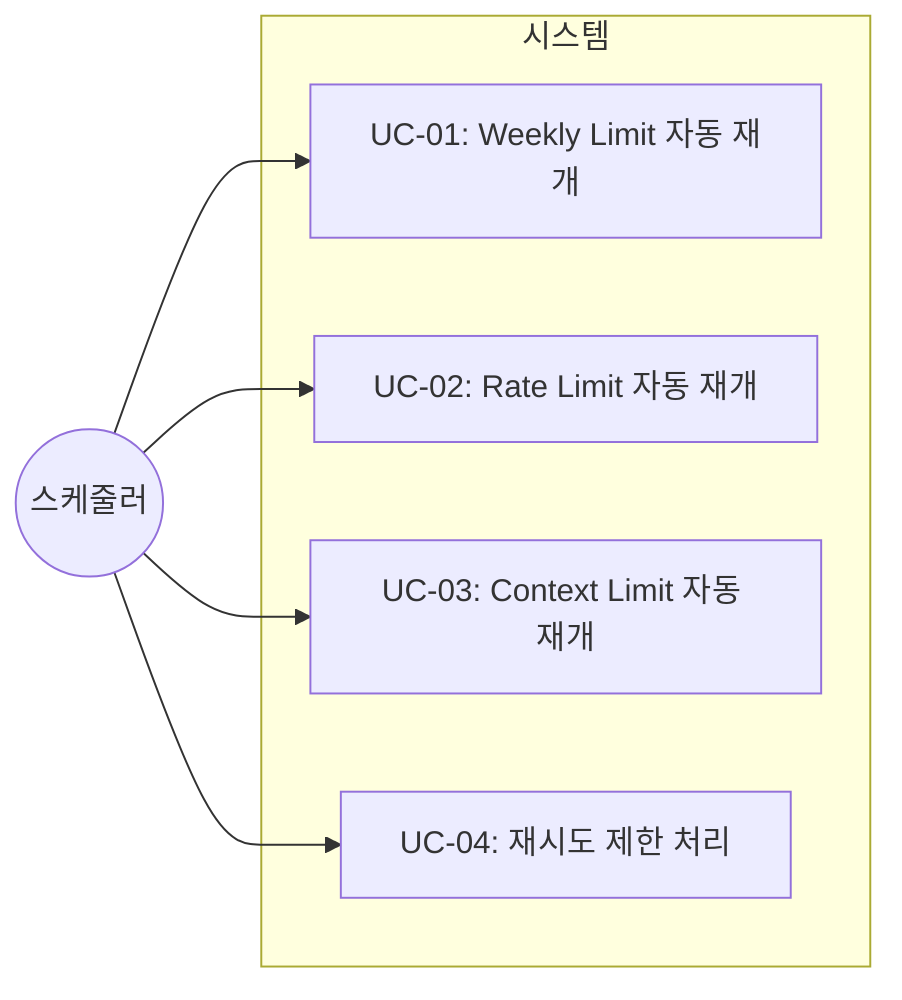
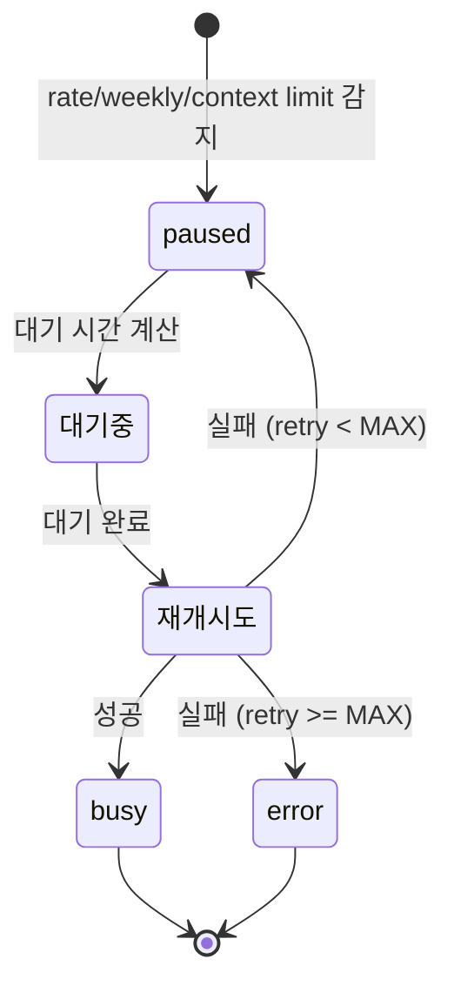

# TSK-02-01 - 자동 재개 메커니즘 설계 문서

## 문서 정보

| 항목 | 내용 |
|------|------|
| Task ID | TSK-02-01 |
| 문서 버전 | 1.0 |
| 작성일 | 2025-12-28 |
| 상태 | 작성중 |
| 카테고리 | development |

---

## 1. 개요

### 1.1 배경 및 문제 정의

**현재 상황:**
- Worker가 paused 상태(rate limit, weekly limit, context limit)가 되면 상태 감지만 되고 자동 복구 없음
- 관리자가 수동으로 "계속" 입력 또는 대기 후 재시작해야 함
- 야간/무인 운영 시 작업 중단으로 생산성 저하

**해결하려는 문제:**
- paused 상태에서 자동 복구 메커니즘 부재
- Weekly limit reset 시간 파싱 부재로 정확한 대기 시간 산출 불가
- 무한 재시도로 인한 리소스 낭비 가능성

### 1.2 목적 및 기대 효과

**목적:**
- Worker가 paused 상태일 때 자동으로 재개하는 메커니즘 구현
- 중단 유형별 최적 대기 시간 계산 및 적용

**기대 효과:**
- 무인 운영 가능: 야간/주말에도 자동 작업 진행
- 리소스 최적화: 정확한 reset 시간 파싱으로 불필요한 대기 최소화
- 안정성 향상: 최대 재시도 제한으로 무한 루프 방지

### 1.3 범위

**포함:**
- paused 상태 유형 판별 (weekly limit, rate limit, context limit)
- Weekly limit reset 시간 파싱 (다양한 형식 지원)
- 대기 시간 계산 및 sleep
- "계속" 텍스트 전송으로 재개
- 재시도 횟수 관리

**제외:**
- TUI 표시 (TSK-02-02에서 처리)
- error 상태 복구 (별도 Task)
- blocked 상태 자동 응답

### 1.4 참조 문서

| 문서 | 경로 | 관련 섹션 |
|------|------|----------|
| PRD | `.orchay/projects/orchay/prd.md` | 8.6 자동 재개 메커니즘 |
| TRD | `.orchay/projects/orchay/trd.md` | asyncio 패턴, 설정 검증 |

---

## 2. 사용자 분석

### 2.1 대상 사용자

| 사용자 유형 | 특성 | 주요 니즈 |
|------------|------|----------|
| 개발팀 리더 | orchay 운영 담당, 야간 무인 운영 필요 | 자동 복구로 작업 연속성 확보 |
| DevOps 엔지니어 | 모니터링 담당 | 재개 상태 로그 및 알림 |

### 2.2 사용자 페르소나

**페르소나 1: 개발팀 리더 김과장**
- 역할: 프로젝트 관리 및 orchay 운영
- 목표: 야간에도 자동으로 작업이 진행되어 다음 날 결과 확인
- 불만: rate limit으로 중단되면 수동 재시작 필요
- 시나리오: 퇴근 전 orchay 시작 → 야간 rate limit 발생 → 자동 재개 → 출근 시 결과 확인

---

## 3. 유즈케이스

### 3.1 유즈케이스 다이어그램



### 3.2 유즈케이스 상세

#### UC-01: Weekly Limit 자동 재개

| 항목 | 내용 |
|------|------|
| 액터 | 스케줄러 (자동) |
| 목적 | Weekly limit 도달 시 reset 시간까지 대기 후 자동 재개 |
| 사전 조건 | Worker가 paused 상태, 출력에 "Weekly limit" 패턴 존재 |
| 사후 조건 | Worker가 busy 또는 error 상태로 전환 |
| 트리거 | 메인 루프에서 paused 상태 감지 |

**기본 흐름:**
1. 스케줄러가 Worker의 paused 상태를 감지한다
2. pane 출력에서 "Weekly limit reached · resets Oct 9 at 10:30am" 패턴을 찾는다
3. reset 시간을 파싱하여 대기 시간을 계산한다
4. 계산된 시간만큼 대기한다
5. "계속" 텍스트를 전송한다
6. 3초 후 상태를 재확인한다
7. busy 상태면 성공, 아니면 재시도

**대안 흐름:**
- 3a. reset 시간 파싱 실패 시:
  - 기본 1시간(3600초) 대기
  - 경고 로그 출력

**예외 흐름:**
- 7a. 최대 재시도(3회) 초과 시:
  - Worker를 error 상태로 전환
  - 에러 로그 출력

#### UC-02: Rate Limit 자동 재개

| 항목 | 내용 |
|------|------|
| 액터 | 스케줄러 (자동) |
| 목적 | Rate limit 도달 시 짧은 대기 후 자동 재개 |
| 사전 조건 | Worker가 paused 상태, 출력에 rate limit 패턴 존재 |
| 사후 조건 | Worker가 busy 또는 error 상태로 전환 |
| 트리거 | 메인 루프에서 paused 상태 감지 |

**기본 흐름:**
1. 스케줄러가 Worker의 paused 상태를 감지한다
2. pane 출력에서 rate limit 패턴을 확인한다
3. 출력에서 대기 시간 추출 (실패 시 기본 60초)
4. 계산된 시간만큼 대기한다
5. "계속" 텍스트를 전송한다
6. 상태를 재확인하고 결과 처리

#### UC-03: Context Limit 자동 재개

| 항목 | 내용 |
|------|------|
| 액터 | 스케줄러 (자동) |
| 목적 | Context limit 시 짧은 대기 후 자동 재개 |
| 사전 조건 | Worker가 paused 상태, 출력에 context limit 패턴 존재 |
| 사후 조건 | Worker가 busy 또는 error 상태로 전환 |
| 트리거 | 메인 루프에서 paused 상태 감지 |

**기본 흐름:**
1. context limit 패턴 감지
2. 5초 대기
3. "계속" 전송
4. 상태 확인

#### UC-04: 재시도 제한 처리

| 항목 | 내용 |
|------|------|
| 액터 | 스케줄러 (자동) |
| 목적 | 무한 재시도 방지 및 error 상태 전환 |
| 사전 조건 | 재시도 횟수가 최대값에 도달 |
| 사후 조건 | Worker가 error 상태로 전환 |
| 트리거 | 재개 실패 후 retry_count 증가 |

**기본 흐름:**
1. 재개 시도 후 실패
2. retry_count 증가
3. MAX_RETRIES(3) 초과 확인
4. 초과 시 error 상태로 전환 및 로그

---

## 4. 사용자 시나리오

### 4.1 시나리오 1: Weekly Limit 야간 자동 재개

**상황 설명:**
개발팀 리더 김과장이 퇴근 전 orchay를 시작했다. 새벽 2시에 Worker 1이 weekly limit에 도달했고, reset 시간은 오전 10:30이다.

**단계별 진행:**

| 단계 | 시스템 동작 | 결과 | 로그 |
|------|-----------|------|------|
| 1 | Worker 1 paused 상태 감지 | paused 확인 | `[paused] Worker 1: 상태 변경` |
| 2 | 출력에서 reset 시간 파싱 | `2025-12-29 10:30` | `[resume] Reset 시간 파싱 성공` |
| 3 | 대기 시간 계산 | 30600초 (8.5시간) | `⏳ Worker 1: Weekly limit, 12/29 10:30까지 대기 (30600초)` |
| 4 | 대기 완료 | - | `[resume] 대기 완료` |
| 5 | "계속" 전송 | - | `▶️ Worker 1: '계속' 전송` |
| 6 | 상태 재확인 | busy | `✅ Worker 1: 작업 재개됨` |

**성공 조건:**
- 출근 시 Worker 1이 정상 작업 중

### 4.2 시나리오 2: 재시도 실패로 error 전환

**상황 설명:**
Worker 2가 rate limit에 도달했지만, 네트워크 문제로 재개가 계속 실패한다.

**단계별 진행:**

| 단계 | 시스템 동작 | 결과 | 로그 |
|------|-----------|------|------|
| 1 | 1차 재시도 | 실패 | `⚠️ Worker 2: 재개 실패 (1/3)` |
| 2 | 2차 재시도 | 실패 | `⚠️ Worker 2: 재개 실패 (2/3)` |
| 3 | 3차 재시도 | 실패 | `⚠️ Worker 2: 재개 실패 (3/3)` |
| 4 | error 상태 전환 | error | `❌ Worker 2: 최대 재시도 초과, error 상태로 전환` |

---

## 5. 화면 설계

> 이 Task는 백엔드 로직으로 TUI 없음. TUI 표시는 TSK-02-02에서 처리.

### 5.1 로그 출력 형식

```
[2025-12-28 14:30:15] ⏳ Worker 1: Weekly limit, 12/29 10:30까지 대기 (30600초)
[2025-12-28 14:30:15] [resume] 대기 시작...
...
[2025-12-29 10:30:20] [resume] 대기 완료
[2025-12-29 10:30:20] ▶️ Worker 1: '계속' 전송
[2025-12-29 10:30:23] ✅ Worker 1: 작업 재개됨
```

---

## 6. 인터랙션 설계

### 6.1 상태 전이 다이어그램



### 6.2 paused 유형별 처리

| 유형 | 판별 패턴 | 대기 시간 | 비고 |
|------|----------|----------|------|
| Weekly limit | `weekly.*limit`, `resets.*at` | reset 시간까지 (파싱) | 파싱 실패 시 3600초 |
| Rate limit | `rate.*limit`, `please.*wait` | 60초 (또는 추출) | 출력에서 시간 추출 시도 |
| Context limit | `context.*limit`, `conversation.*too.*long` | 5초 | 짧은 대기 후 재시도 |
| 기타 | 위 패턴 미매칭 | 30초 | 기본값 |

---

## 7. 데이터 요구사항

### 7.1 필요한 데이터

| 데이터 | 설명 | 출처 | 용도 |
|--------|------|------|------|
| pane 출력 텍스트 | 최근 50줄 | WezTerm CLI | paused 유형 판별 |
| reset 시간 문자열 | "resets Oct 9 at 10:30am" | pane 출력 | 대기 시간 계산 |
| 설정값 | resumeText, defaultWaitTime | orchay.json | 재개 동작 제어 |
| retry_count | Worker별 재시도 횟수 | Worker 모델 | 최대 재시도 제한 |

### 7.2 설정 스키마

```python
class RecoveryConfig(BaseModel):
    """자동 재개 관련 설정."""

    resume_text: str = "계속"
    default_wait_time: int = 60  # 기본 대기 시간 (초)
    max_retries: int = 3  # 최대 재시도 횟수
    weekly_limit_default: int = 3600  # weekly limit 파싱 실패 시 대기 (초)
    context_limit_wait: int = 5  # context limit 대기 (초)
```

### 7.3 데이터 유효성 규칙

| 데이터 필드 | 규칙 | 위반 시 동작 |
|------------|------|-------------|
| resume_text | 비어있지 않음 | 기본값 "계속" 사용 |
| default_wait_time | 1-3600 범위 | 범위 내 클램핑 |
| max_retries | 1-10 범위 | 범위 내 클램핑 |

---

## 8. 비즈니스 규칙

### 8.1 핵심 규칙

| 규칙 ID | 규칙 설명 | 적용 상황 | 예외 |
|---------|----------|----------|------|
| BR-01 | Weekly limit은 reset 시간 파싱 우선 | weekly limit 감지 시 | 파싱 실패 시 기본값 사용 |
| BR-02 | 최대 재시도 초과 시 error 전환 | retry_count >= max_retries | 없음 |
| BR-03 | 재개 성공 시 retry_count 초기화 | busy 상태 전환 시 | 없음 |
| BR-04 | asyncio.sleep 사용 (블로킹 금지) | 모든 대기 | 없음 |

### 8.2 규칙 상세 설명

**BR-01: Weekly limit reset 시간 파싱 우선**

설명: Weekly limit은 다음 주까지 긴 시간 대기가 필요하므로, 정확한 reset 시간 파싱이 중요합니다. 파싱 성공 시 정확한 대기 시간을 사용하고, 실패 시에만 기본값(1시간)을 사용합니다.

예시:
- 출력: "Weekly limit reached · resets Oct 9 at 10:30am"
- 파싱 결과: 2025-10-09 10:30:00
- 대기 시간: (reset_time - now).total_seconds()

**BR-02: 최대 재시도 제한**

설명: 무한 재시도를 방지하여 리소스 낭비를 막습니다. 3회 연속 실패 시 해당 Worker는 수동 개입이 필요한 것으로 판단합니다.

---

## 9. 에러 처리

### 9.1 예상 에러 상황

| 상황 | 원인 | 로그 메시지 | 복구 방법 |
|------|------|--------------|----------|
| reset 시간 파싱 실패 | 예상치 못한 형식 | `[WARN] Reset 시간 파싱 실패, 기본 3600초 사용` | 기본값 사용 |
| pane 접근 실패 | WezTerm CLI 오류 | `[ERROR] Pane {id} 접근 실패` | dead 상태 전환 |
| 텍스트 전송 실패 | 네트워크/CLI 오류 | `[ERROR] 텍스트 전송 실패` | 재시도 |
| 최대 재시도 초과 | 지속적 실패 | `❌ Worker {id}: 최대 재시도 초과` | error 상태 전환 |

### 9.2 에러 표시 방식

| 에러 유형 | 표시 방법 | 심각도 |
|----------|----------|--------|
| 파싱 실패 | WARN 로그 | 낮음 (자동 복구) |
| CLI 오류 | ERROR 로그 | 중간 (재시도) |
| 재시도 초과 | ERROR 로그 + 상태 변경 | 높음 (수동 개입 필요) |

---

## 10. 연관 문서

| 문서 | 경로 | 용도 |
|------|------|------|
| 요구사항 추적 매트릭스 | `025-traceability-matrix.md` | PRD → 설계 → 테스트 양방향 추적 |
| 테스트 명세서 | `026-test-specification.md` | 단위/통합 테스트 상세 정의 |

---

## 11. 구현 범위

### 11.1 영향받는 영역

| 영역 | 변경 내용 | 영향도 |
|------|----------|--------|
| orchay/src/orchay/worker.py | 상태 감지는 기존 유지, 재개 로직 별도 모듈로 분리 | 낮음 |
| orchay/src/orchay/recovery.py | **신규 모듈** - 자동 재개 로직 | 높음 |
| orchay/src/orchay/models/worker.py | retry_count 필드 추가 | 중간 |
| orchay/src/orchay/models/config.py | RecoveryConfig 추가 | 중간 |
| orchay/src/orchay/scheduler.py | 메인 루프에 재개 처리 통합 | 중간 |

### 11.2 신규 파일

```
orchay/src/orchay/
├── recovery.py           # 자동 재개 로직 (신규)
│   ├── extract_reset_time()
│   ├── calculate_wait_seconds()
│   ├── detect_paused_type()
│   └── handle_paused_worker()
```

### 11.3 API 명세

```python
# recovery.py

from datetime import datetime
from typing import Literal

PausedType = Literal["weekly_limit", "rate_limit", "context_limit", "unknown"]

async def extract_reset_time(output: str) -> datetime | None:
    """Claude Code 출력에서 reset 시간 추출.

    Args:
        output: pane 출력 텍스트

    Returns:
        reset datetime 또는 None (파싱 실패 시)

    지원 형식:
        - "Weekly limit reached · resets Oct 9 at 10:30am"
        - "resets Oct 6, 1pm"
        - "reset at Oct 6, 1pm"
    """

def calculate_wait_seconds(reset_time: datetime) -> int:
    """reset 시간까지 대기할 초 계산.

    Args:
        reset_time: 목표 시간

    Returns:
        대기할 초 (최소 0)
    """

def detect_paused_type(output: str) -> PausedType:
    """paused 상태의 세부 유형 판별.

    Args:
        output: pane 출력 텍스트

    Returns:
        PausedType (weekly_limit, rate_limit, context_limit, unknown)
    """

async def handle_paused_worker(
    worker: "Worker",
    config: "RecoveryConfig"
) -> bool:
    """일시 중단된 Worker 자동 재개.

    Args:
        worker: Worker 객체 (상태 및 pane_id 포함)
        config: 재개 설정

    Returns:
        재개 성공 여부
    """
```

### 11.4 의존성

| 의존 항목 | 이유 | 상태 |
|----------|------|------|
| TSK-01-04 (Worker 관리 및 WezTerm CLI 통합) | wezterm_get_text, wezterm_send_text 사용 | 완료 |
| worker.py (상태 감지) | detect_worker_state 재사용 | 완료 |

### 11.5 제약 사항

| 제약 | 설명 | 대응 방안 |
|------|------|----------|
| asyncio 필수 | 블로킹 sleep 금지 | asyncio.sleep 사용 |
| reset 시간 형식 제한 | 알려진 형식만 파싱 가능 | 기본값 폴백 |

---

## 12. 체크리스트

### 12.1 설계 완료 확인

- [x] 문제 정의 및 목적 명확화
- [x] 사용자 분석 완료
- [x] 유즈케이스 정의 완료
- [x] 사용자 시나리오 작성 완료
- [x] 인터랙션 설계 완료 (상태 전이)
- [x] 데이터 요구사항 정의 완료
- [x] 비즈니스 규칙 정의 완료
- [x] 에러 처리 정의 완료

### 12.2 연관 문서 작성

- [ ] 요구사항 추적 매트릭스 작성 (→ `025-traceability-matrix.md`)
- [ ] 테스트 명세서 작성 (→ `026-test-specification.md`)

### 12.3 구현 준비

- [x] 구현 우선순위 결정 (recovery.py → models → scheduler 통합)
- [x] 의존성 확인 완료 (TSK-01-04 완료)
- [x] 제약 사항 검토 완료

---

## 변경 이력

| 버전 | 일자 | 작성자 | 변경 내용 |
|------|------|--------|----------|
| 1.0 | 2025-12-28 | Claude | 최초 작성 |
