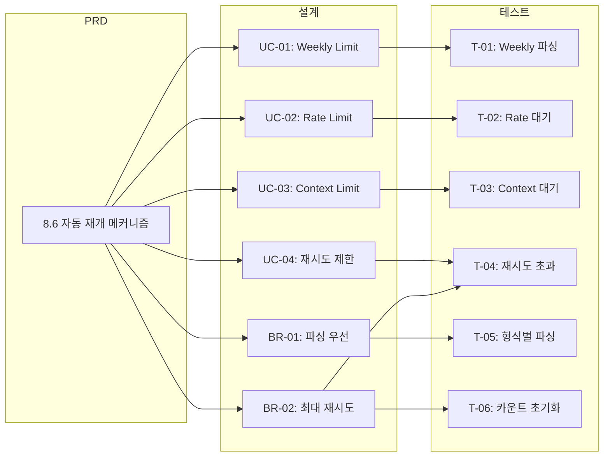

# TSK-02-01 - 요구사항 추적 매트릭스

## 문서 정보

| 항목 | 내용 |
|------|------|
| Task ID | TSK-02-01 |
| 문서 버전 | 1.0 |
| 작성일 | 2025-12-28 |
| 상태 | 작성중 |

---

## 1. PRD → 설계 추적

| PRD 요구사항 | 설계 항목 | 구현 위치 |
|-------------|----------|----------|
| PRD 8.6: paused 상태 유형 판별 | UC-01~03, 6.2 paused 유형별 처리 | `recovery.py:detect_paused_type()` |
| PRD 8.6: Weekly limit reset 시간 파싱 | UC-01, 4.1 시나리오 | `recovery.py:extract_reset_time()` |
| PRD 8.6: 대기 시간 계산 및 sleep | UC-01~03 기본 흐름 | `recovery.py:calculate_wait_seconds()` |
| PRD 8.6: "계속" 텍스트 전송 | UC-01~03 5단계 | `recovery.py:handle_paused_worker()` |
| PRD 8.6: 재시도 횟수 관리 (최대 3회) | UC-04, BR-02 | `Worker.retry_count`, `RecoveryConfig.max_retries` |

---

## 2. 설계 → 테스트 추적

| 설계 항목 | 테스트 ID | 테스트 설명 |
|----------|----------|------------|
| UC-01: Weekly Limit 자동 재개 | T-01 | weekly limit 패턴 감지 및 reset 시간 파싱 테스트 |
| UC-02: Rate Limit 자동 재개 | T-02 | rate limit 패턴 감지 및 60초 대기 테스트 |
| UC-03: Context Limit 자동 재개 | T-03 | context limit 패턴 감지 및 5초 대기 테스트 |
| UC-04: 재시도 제한 처리 | T-04 | 최대 재시도 초과 시 error 전환 테스트 |
| BR-01: Reset 시간 파싱 우선 | T-05 | 다양한 형식의 reset 시간 파싱 테스트 |
| BR-03: 재개 성공 시 retry_count 초기화 | T-06 | 성공 후 retry_count=0 확인 |
| BR-04: asyncio.sleep 사용 | T-07 | 비동기 대기 동작 확인 |

---

## 3. 요구사항-설계-테스트 전체 추적

---

## 4. 구현 파일 매핑

| 파일 | 관련 설계 | 관련 테스트 |
|------|----------|------------|
| `recovery.py` | UC-01~04, BR-01~04 | T-01~07 |
| `models/worker.py` | 7.1 retry_count 필드 | T-04, T-06 |
| `models/config.py` | 7.2 RecoveryConfig | T-01~03 (설정값) |
| `scheduler.py` | 메인 루프 통합 | 통합 테스트 |

---

## 5. 검증 체크리스트

### 5.1 요구사항 커버리지

- [x] PRD 8.6 모든 요구사항 설계에 반영
- [x] 모든 설계 항목 테스트 케이스 존재
- [x] 양방향 추적 가능

### 5.2 누락 확인

| 확인 항목 | 상태 |
|----------|------|
| PRD 요구사항 누락 | 없음 |
| 설계 미반영 요구사항 | 없음 |
| 테스트 미작성 설계 | 없음 |

---

## 변경 이력

| 버전 | 일자 | 변경 내용 |
|------|------|-----------|
| 1.0 | 2025-12-28 | 최초 작성 |
