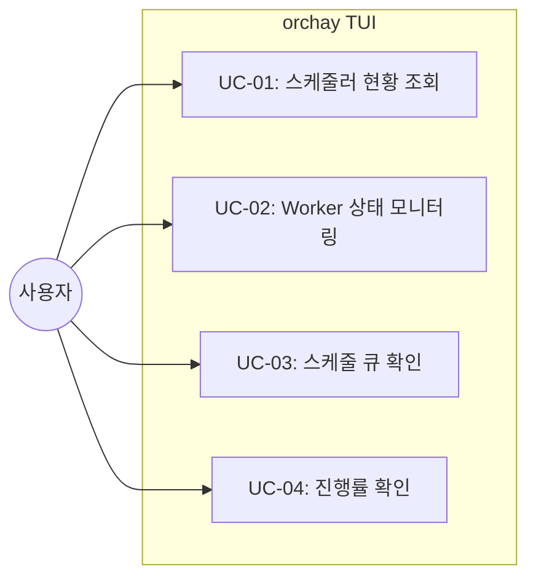
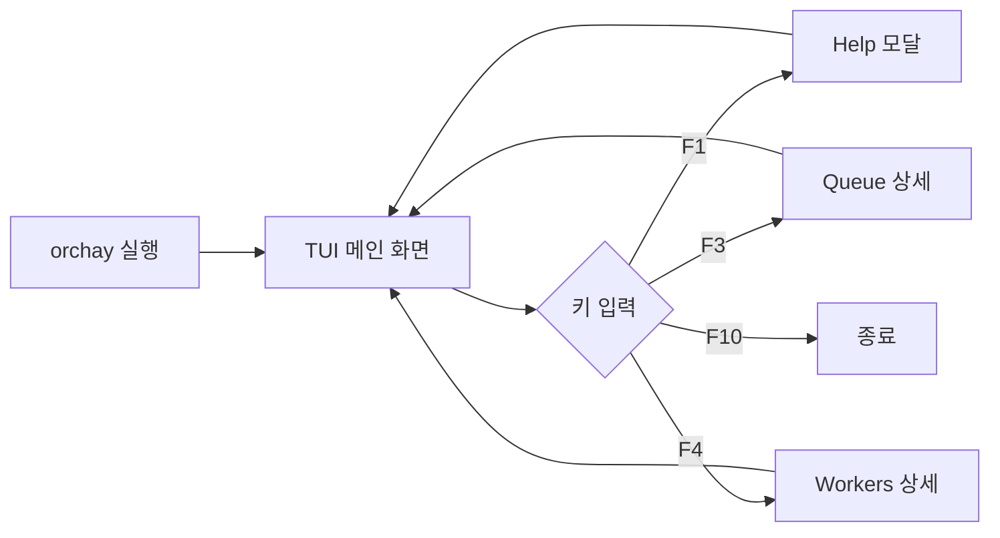
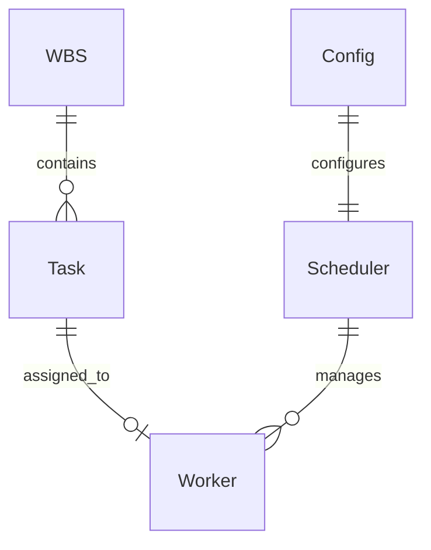

# TSK-02-02 - TUI 메인 화면 설계 문서

## 문서 정보

| 항목 | 내용 |
|------|------|
| Task ID | TSK-02-02 |
| 문서 버전 | 1.0 |
| 작성일 | 2025-12-28 |
| 상태 | 작성중 |
| 카테고리 | development |
| 도메인 | frontend |

---

## 1. 개요

### 1.1 배경 및 문제 정의

**현재 상황:**
- orchay 스케줄러의 코어 기능(WBS 파서, 스케줄러, Worker 관리)이 구현됨
- CLI 기반으로만 동작하며 실시간 상태를 시각적으로 확인하기 어려움
- Worker 상태, 스케줄 큐, 진행률 등을 직관적으로 파악할 인터페이스 부재

**해결하려는 문제:**
- 스케줄러 상태를 실시간으로 모니터링할 수 있는 TUI 필요
- 여러 Worker의 상태를 한눈에 파악할 수 있는 대시보드 필요
- 모드 표시, 큐 크기, 진행률 등 핵심 정보의 시각화 필요

### 1.2 목적 및 기대 효과

**목적:**
- Textual 프레임워크 기반의 현대적 TUI 메인 화면 구현
- 실시간 스케줄러 상태 시각화 (Worker, Queue, Progress)
- Function Key 바인딩을 통한 빠른 조작 지원

**기대 효과:**
- 사용자가 스케줄러 상태를 직관적으로 파악 가능
- 병렬 작업 현황을 한눈에 모니터링
- 터미널 환경에서도 풍부한 UI 경험 제공

### 1.3 범위

**포함:**
- 헤더 영역 (프로젝트명, Worker 수, 큐 크기, 모드 표시)
- 스케줄 큐 테이블 (DataTable)
- Worker 상태 패널 (Static/RichLog)
- 진행률 표시 (ProgressBar)
- 상태바/Footer (F-key 바인딩 표시)
- 실시간 상태 갱신
- 모드별 색상 표시

**제외:**
- 인터랙티브 기능 (TSK-02-03에서 구현)
- CLI 옵션 처리 (TSK-02-04에서 구현)
- 테스트 작성 (TSK-02-05에서 구현)

### 1.4 참조 문서

| 문서 | 경로 | 관련 섹션 |
|------|------|----------|
| PRD | `.orchay/projects/orchay/prd.md` | 9.1 스케줄러 시작, 3.7 인터랙티브 명령어 시스템 |
| TRD | `.orchay/projects/orchay/trd.md` | Textual 위젯 매핑, 디자인 시스템 |

---

## 2. 사용자 분석

### 2.1 대상 사용자

| 사용자 유형 | 특성 | 주요 니즈 |
|------------|------|----------|
| 개발자 | Claude Code를 활용한 자동화 개발 수행 | 여러 Worker의 작업 현황을 한눈에 파악 |
| 프로젝트 관리자 | 전체 Task 진행률 모니터링 | 완료율, 남은 작업 수 확인 |

### 2.2 사용자 페르소나

**페르소나 1: 개발자 민수**
- 역할: AI 지원 개발을 수행하는 소프트웨어 개발자
- 목표: 여러 Claude Code 인스턴스로 병렬 개발 수행
- 불만: 각 Worker pane을 일일이 확인해야 하는 번거로움
- 시나리오: WezTerm 터미널에서 orchay를 실행하고 한 화면에서 전체 현황 모니터링

---

## 3. 유즈케이스

### 3.1 유즈케이스 다이어그램



### 3.2 유즈케이스 상세

#### UC-01: 스케줄러 현황 조회

| 항목 | 내용 |
|------|------|
| 액터 | 개발자 |
| 목적 | 스케줄러의 전체 상태를 한눈에 파악 |
| 사전 조건 | orchay 스케줄러 실행 |
| 사후 조건 | 현황 정보 표시됨 |
| 트리거 | 스케줄러 시작 또는 F2 키 |

**기본 흐름:**
1. 사용자가 orchay를 실행한다
2. TUI가 헤더에 프로젝트명, Worker 수, 큐 크기, 모드를 표시한다
3. 하단 Footer에 F-key 바인딩이 표시된다
4. 정보가 실시간으로 갱신된다

#### UC-02: Worker 상태 모니터링

| 항목 | 내용 |
|------|------|
| 액터 | 개발자 |
| 목적 | 각 Worker의 현재 상태와 작업 중인 Task 확인 |
| 사전 조건 | Worker pane이 1개 이상 존재 |
| 사후 조건 | Worker 상태 패널에 정보 표시 |
| 트리거 | 자동 갱신 또는 F4 키 |

**기본 흐름:**
1. TUI가 Worker 패널을 표시한다
2. 각 Worker의 상태 (idle/busy/paused/error)가 색상으로 구분된다
3. 작업 중인 Task ID와 현재 단계가 표시된다
4. 상태가 interval 간격으로 갱신된다

#### UC-03: 스케줄 큐 확인

| 항목 | 내용 |
|------|------|
| 액터 | 개발자 |
| 목적 | 대기 중인 Task 목록과 순서 확인 |
| 사전 조건 | wbs.md에 실행 가능한 Task가 있음 |
| 사후 조건 | 큐 테이블에 Task 목록 표시 |
| 트리거 | 자동 표시 또는 F3 키 |

**기본 흐름:**
1. TUI가 DataTable로 스케줄 큐를 표시한다
2. 각 Task의 ID, 상태, 카테고리, 우선순위가 표시된다
3. wbs.md 변경 시 자동으로 갱신된다

#### UC-04: 진행률 확인

| 항목 | 내용 |
|------|------|
| 액터 | 개발자/프로젝트 관리자 |
| 목적 | 전체 작업의 완료율 확인 |
| 사전 조건 | Task가 1개 이상 존재 |
| 사후 조건 | ProgressBar에 완료율 표시 |
| 트리거 | 자동 계산 및 표시 |

**기본 흐름:**
1. TUI가 전체 Task 수와 완료된 Task 수를 계산한다
2. ProgressBar로 완료율을 시각화한다
3. Task 완료 시 자동으로 갱신된다

---

## 4. 사용자 시나리오

### 4.1 시나리오 1: 스케줄러 실행 및 모니터링

**상황 설명:**
민수는 새로운 프로젝트의 9개 Task를 3개의 Worker로 병렬 처리하려고 한다.

**단계별 진행:**

| 단계 | 사용자 행동 | 시스템 반응 | 사용자 기대 |
|------|-----------|------------|------------|
| 1 | `python -m orchay` 실행 | TUI 메인 화면 표시 | 전체 레이아웃이 보임 |
| 2 | 화면 확인 | 헤더에 `orchay - Task Scheduler [MODE: quick]` 표시 | 현재 모드 확인 |
| 3 | Worker 패널 확인 | Worker 1~3 상태: idle (녹색) | 모든 Worker 준비됨 |
| 4 | 스케줄 큐 확인 | 5개 Task가 우선순위순으로 표시 | 실행 대기 Task 확인 |
| 5 | 잠시 후 | Worker 1이 busy (청색)로 변경, Task 실행 시작 | 자동 분배 동작 |
| 6 | 진행률 확인 | ProgressBar: 0% → 12% (1/9 완료 시) | 진행 상황 파악 |

**성공 조건:**
- 모든 정보가 실시간으로 갱신됨
- 색상으로 상태를 직관적으로 파악 가능

### 4.2 시나리오 2: 에러 상황 모니터링

**상황 설명:**
Worker 2에서 Task 실행 중 에러가 발생한 상황

**단계별 진행:**

| 단계 | 사용자 행동 | 시스템 반응 | 복구 방법 |
|------|-----------|------------|----------|
| 1 | 화면 모니터링 | Worker 2가 error (적색)로 변경 | 에러 발생 인지 |
| 2 | Worker 패널 확인 | `Worker 2: error - TSK-01-02 (build)` 표시 | 에러 Task 확인 |
| 3 | 대기 | Worker 2가 다음 Task로 이동 | 자동 복구 |

---

## 5. 화면 설계

### 5.1 화면 흐름도



### 5.2 화면별 상세

#### 화면 1: TUI 메인 화면 (Textual App)

**화면 목적:**
orchay 스케줄러의 전체 상태를 실시간으로 표시하는 메인 대시보드

**진입 경로:**
- `python -m orchay` 실행 시 자동 표시

**와이어프레임:**
```
╔═══════════════════════════════════════════════════════════════════════════════╗
║  orchay - Task Scheduler                   [MODE: quick] F7: 모드 전환          ║
║  Project: orchay | Workers: 3 | Queue: 5 | Completed: 4/9                       ║
╠═══════════════════════════════════════════════════════════════════════════════╣
║                                                                                 ║
║  ┌─────────────────────────────── Schedule Queue ────────────────────────────┐ ║
║  │  #   Task ID       Status   Category      Priority   Title                │ ║
║  │ ─────────────────────────────────────────────────────────────────────────│ ║
║  │  1   TSK-02-01     [ ]      development   high       자동 재개 메커니즘   │ ║
║  │  2   TSK-02-02     [ ]      development   high       TUI 메인 화면        │ ║
║  │  3   TSK-02-03     [ ]      development   medium     TUI 인터랙티브 기능  │ ║
║  │  4   TSK-02-04     [ ]      development   medium     CLI 및 설정 관리     │ ║
║  │  5   TSK-02-05     [ ]      development   medium     테스트 및 문서화     │ ║
║  └───────────────────────────────────────────────────────────────────────────┘ ║
║                                                                                 ║
║  ┌─────────────────────────────── Workers ───────────────────────────────────┐ ║
║  │  Worker 1  ●  busy    TSK-01-04 (build)  ████████████░░░░░░░░  60%        │ ║
║  │  Worker 2  ●  idle    -                   Ready for next task             │ ║
║  │  Worker 3  ●  paused  TSK-02-01 (start)  Rate limit - waiting...          │ ║
║  └───────────────────────────────────────────────────────────────────────────┘ ║
║                                                                                 ║
║  ┌─────────────────────────────── Progress ──────────────────────────────────┐ ║
║  │  Total: ████████████████████░░░░░░░░░░░░░░░░░░░░  44% (4/9 tasks)         │ ║
║  └───────────────────────────────────────────────────────────────────────────┘ ║
║                                                                                 ║
╠═══════════════════════════════════════════════════════════════════════════════╣
║  F1:Help  F2:Status  F3:Queue  F4:Workers  F5:Reload  F7:Mode  F9:Pause  F10:Exit║
╚═══════════════════════════════════════════════════════════════════════════════╝
```

**화면 요소 설명:**

| 영역 | Textual 위젯 | 설명 | 갱신 주기 |
|------|-------------|------|----------|
| 헤더 | Header | 프로젝트명, 통계, 모드 | 실시간 |
| 스케줄 큐 | DataTable | 대기 중인 Task 목록 | wbs.md 변경 시 |
| Worker 패널 | Static/RichLog | 각 Worker 상태 및 작업 정보 | interval (5초) |
| 진행률 | ProgressBar | 전체 완료율 | Task 완료 시 |
| 상태바 | Footer | F-key 바인딩 안내 | 고정 |

**Textual 위젯 매핑:**

| PRD UI 요소 | Textual 위젯 | 속성/스타일 |
|------------|-------------|------------|
| 헤더 | Header | title, subtitle |
| 스케줄 큐 테이블 | DataTable | cursor_type="row" |
| Worker 상태 패널 | Static | 상태별 색상 클래스 |
| 진행률 | ProgressBar | percentage, show_eta |
| 상태바 | Footer | 키 바인딩 표시 |

### 5.3 반응형 동작

| 화면 크기 | 레이아웃 변화 | 사용자 경험 |
|----------|--------------|------------|
| 넓음 (120col+) | Queue와 Workers 가로 배치 | 모든 정보 한눈에 |
| 중간 (80-119col) | Queue와 Workers 세로 스택 | 스크롤 가능 |
| 좁음 (79col-) | 컬럼 축소, 필수 정보만 | 최소 정보 표시 |

---

## 6. 인터랙션 설계

### 6.1 사용자 액션과 피드백

| 사용자 액션 | 즉각 피드백 | 결과 피드백 | 에러 피드백 |
|------------|-----------|------------|------------|
| 스케줄러 시작 | "Starting..." 메시지 | TUI 전체 표시 | 에러 메시지 표시 |
| F-key 입력 | 키 highlight | 해당 기능 실행 | 잘못된 키 무시 |
| 모드 전환 (F7) | 모드 색상 변경 | 헤더 모드 표시 갱신 | - |

### 6.2 상태별 화면 변화

| 상태 | 화면 표시 | 사용자 안내 |
|------|----------|------------|
| 초기 로딩 | 로딩 스피너 | "Loading wbs.md..." |
| 큐 비어있음 | 빈 테이블 | "No executable tasks" |
| 모든 Worker busy | 큐에 대기 표시 | "All workers busy" |
| 에러 발생 | Worker 빨간색 | "Error: {message}" |

### 6.3 상태 색상 체계

| Worker 상태 | 색상 | RGB |
|------------|------|-----|
| idle | 녹색 | #22c55e |
| busy | 청색 | #3b82f6 |
| paused | 황색 | #f59e0b |
| error | 적색 | #ef4444 |
| blocked | 보라색 | #8b5cf6 |
| dead | 회색 | #6b7280 |

| 실행 모드 | 색상 | RGB |
|----------|------|-----|
| design | 청색 | #3b82f6 |
| quick | 녹색 | #22c55e |
| develop | 보라색 | #8b5cf6 |
| force | 황색 | #f59e0b |

### 6.4 키보드 바인딩

| 기능 | 키 | 설명 |
|------|---|------|
| 도움말 | F1 | Help 모달 표시 |
| 상태 | F2 | 전체 현황 표시 |
| 큐 | F3 | 스케줄 큐 상세 |
| Workers | F4 | Worker 상태 상세 |
| 새로고침 | F5 | wbs.md 재로드 |
| 히스토리 | F6 | 완료 히스토리 |
| 모드 전환 | F7 | design → quick → develop → force |
| 일시정지 | F9 | pause/resume 토글 |
| 종료 | F10 | 스케줄러 종료 |

---

## 7. 데이터 요구사항

### 7.1 필요한 데이터

| 데이터 | 설명 | 출처 | 용도 |
|--------|------|------|------|
| Task 목록 | 실행 가능한 Task | wbs.md 파싱 | 스케줄 큐 표시 |
| Worker 상태 | 각 Worker의 현재 상태 | WezTerm CLI | Worker 패널 표시 |
| 실행 모드 | 현재 실행 모드 | orchay.json | 헤더 모드 표시 |
| 완료 통계 | 완료/전체 Task 수 | wbs.md 파싱 | 진행률 계산 |
| 활성 Task | 현재 실행 중인 Task | orchay-active.json | Worker 작업 표시 |

### 7.2 데이터 관계



### 7.3 데이터 유효성 규칙

| 데이터 필드 | 규칙 | 위반 시 처리 |
|------------|------|-------------|
| Worker 수 | 1 이상 정수 | 기본값 3 사용 |
| interval | 1-60초 | 기본값 5초 사용 |
| mode | design/quick/develop/force 중 하나 | 기본값 quick 사용 |

---

## 8. 비즈니스 규칙

### 8.1 핵심 규칙

| 규칙 ID | 규칙 설명 | 적용 상황 | 예외 |
|---------|----------|----------|------|
| BR-01 | Worker 상태는 interval 간격으로 갱신 | 모든 화면 | - |
| BR-02 | 모드 색상은 workflows.json에서 참조 | 모드 표시 시 | - |
| BR-03 | DataTable은 우선순위순으로 정렬 | 큐 표시 시 | - |
| BR-04 | 진행률은 완료 Task / 전체 Task로 계산 | ProgressBar 갱신 시 | - |

### 8.2 규칙 상세 설명

**BR-01: 갱신 주기**
Worker 상태 감지는 WezTerm CLI 호출이 필요하므로 과도한 호출을 방지하기 위해 interval(기본 5초) 간격으로 갱신합니다.

**BR-02: 색상 일관성**
하드코딩된 색상 대신 workflows.json의 상태 색상을 참조하여 시스템 전체에서 일관된 색상을 사용합니다.

---

## 9. 에러 처리

### 9.1 예상 에러 상황

| 상황 | 원인 | 사용자 메시지 | 복구 방법 |
|------|------|--------------|----------|
| wbs.md 없음 | 파일 경로 오류 | "wbs.md not found" | 경로 확인 안내 |
| WezTerm 미설치 | CLI 호출 실패 | "WezTerm CLI not found" | 설치 안내 |
| Worker pane 없음 | pane 종료됨 | "No worker panes" | pane 생성 안내 |
| 설정 파일 오류 | JSON 파싱 실패 | "Config error" | 기본값 사용 |

### 9.2 에러 표시 방식

| 에러 유형 | 표시 위치 | 표시 방법 |
|----------|----------|----------|
| 치명적 에러 | 전체 화면 | 에러 메시지 + 종료 |
| Worker 에러 | Worker 패널 | 빨간색 배경 + 메시지 |
| 경고 | 상태바 | 노란색 텍스트 |

---

## 10. 연관 문서

| 문서 | 경로 | 용도 |
|------|------|------|
| 요구사항 추적 매트릭스 | `025-traceability-matrix.md` | PRD → 설계 → 테스트 양방향 추적 |
| 테스트 명세서 | `026-test-specification.md` | 단위/E2E/매뉴얼 테스트 상세 정의 |

---

## 11. 구현 범위

### 11.1 영향받는 영역

| 영역 | 변경 내용 | 영향도 |
|------|----------|--------|
| `orchay/src/orchay/ui/app.py` | Textual App 클래스 구현 | 높음 |
| `orchay/src/orchay/ui/widgets.py` | 커스텀 위젯 (필요시) | 중간 |
| `orchay/src/orchay/ui/styles.tcss` | Textual CSS 스타일 | 높음 |
| `orchay/src/orchay/main.py` | App 실행 로직 연결 | 중간 |

### 11.2 의존성

| 의존 항목 | 이유 | 상태 |
|----------|------|------|
| TSK-01-04 (Worker 관리) | Worker 상태 데이터 제공 | 완료 |
| Textual ^1.0 | TUI 프레임워크 | 설치됨 |
| Rich ^14.0 | Textual 의존성 | 설치됨 |

### 11.3 제약 사항

| 제약 | 설명 | 대응 방안 |
|------|------|----------|
| 터미널 지원 | 트루컬러 지원 터미널 필요 | Rich가 자동 폴백 |
| 최소 화면 크기 | 80x24 이상 권장 | 반응형 레이아웃 적용 |
| asyncio 필수 | Textual은 asyncio 기반 | 기존 asyncio 코드와 통합 |

---

## 12. 체크리스트

### 12.1 설계 완료 확인

- [x] 문제 정의 및 목적 명확화
- [x] 사용자 분석 완료
- [x] 유즈케이스 정의 완료
- [x] 사용자 시나리오 작성 완료
- [x] 화면 설계 완료 (와이어프레임)
- [x] 인터랙션 설계 완료
- [x] 데이터 요구사항 정의 완료
- [x] 비즈니스 규칙 정의 완료
- [x] 에러 처리 정의 완료

### 12.2 연관 문서 작성

- [ ] 요구사항 추적 매트릭스 작성 (→ `025-traceability-matrix.md`)
- [ ] 테스트 명세서 작성 (→ `026-test-specification.md`)

### 12.3 구현 준비

- [x] 구현 우선순위 결정
- [x] 의존성 확인 완료
- [x] 제약 사항 검토 완료

---

## 변경 이력

| 버전 | 일자 | 작성자 | 변경 내용 |
|------|------|--------|----------|
| 1.0 | 2025-12-28 | Claude | 최초 작성 |
