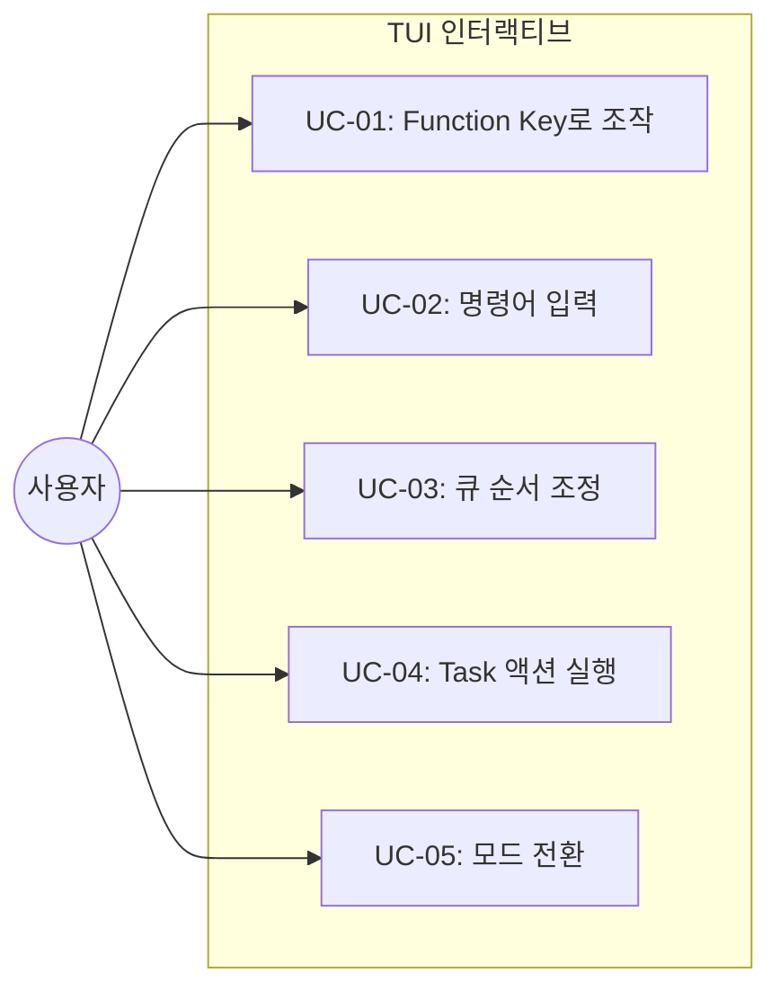
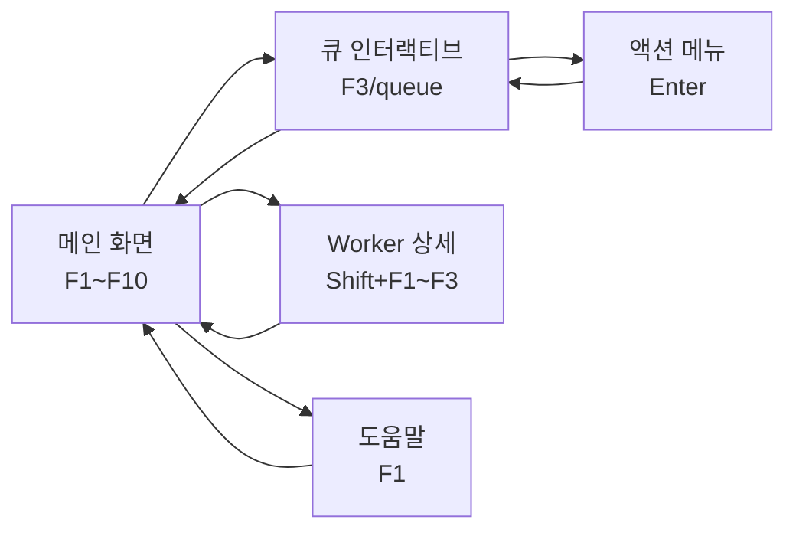
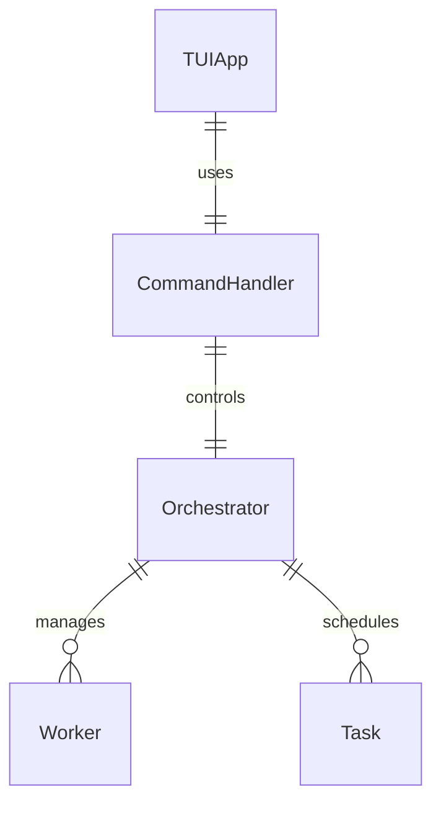

# TSK-02-03 - TUI 인터랙티브 기능 설계 문서

## 문서 정보

| 항목 | 내용 |
|------|------|
| Task ID | TSK-02-03 |
| 문서 버전 | 1.0 |
| 작성일 | 2025-12-28 |
| 상태 | 작성중 |
| 카테고리 | development |

---

## 1. 개요

### 1.1 배경 및 문제 정의

**현재 상황:**
- TSK-02-02에서 기본적인 TUI 메인 화면(헤더, 스케줄 큐 테이블, Worker 상태 패널, 진행률, 상태바)이 구현됨
- 사용자는 스케줄러 실행 중 상태를 확인할 수만 있고, 조작할 수 없음
- 실시간으로 큐를 조정하거나 모드를 변경하려면 프로그램을 종료하고 다시 시작해야 함

**해결하려는 문제:**
- 스케줄러 실행 중 동적 조작 불가
- 키보드 바인딩 없음 (마우스/키 입력 무응답)
- 명령어 입력 인터페이스 부재
- 큐 조정(우선순위 변경, 스킵, 재시도) 기능 없음

### 1.2 목적 및 기대 효과

**목적:**
- 스케줄러 실행 중 실시간 조작 기능 제공
- Function Key 바인딩으로 빠른 조작
- 명령어 입력으로 세밀한 제어
- 인터랙티브 Task 선택 UI 제공

**기대 효과:**
- 프로그램 재시작 없이 동적 제어 가능
- 긴급 Task 우선순위 조정 가능
- 문제 발생 시 즉각적인 대응 (pause, skip, retry)
- 모드 전환으로 유연한 작업 스타일 변경

### 1.3 범위

**포함:**
- Function Key 바인딩 (F1~F10, Shift+F1~F3)
- 명령어 입력 시스템 (start, stop, pause, resume, status, queue 등)
- 인터랙티브 Task 선택 UI (↑/↓ 이동, Enter 액션)
- 큐 조정 기능 (up, top, skip, retry)
- 모드 전환 (F7로 순환)
- CommandHandler 클래스 구현

**제외:**
- TUI 기본 레이아웃 (TSK-02-02에서 구현)
- CLI 설정 파일 관리 (TSK-02-04)
- 자동 재개 메커니즘 (TSK-02-01)

### 1.4 참조 문서

| 문서 | 경로 | 관련 섹션 |
|------|------|----------|
| PRD | `.orchay/projects/orchay/prd.md` | 3.7 인터랙티브 명령어 시스템 |
| TRD | `.orchay/projects/orchay/trd.md` | Textual 위젯 매핑, 키 바인딩 |

---

## 2. 사용자 분석

### 2.1 대상 사용자

| 사용자 유형 | 특성 | 주요 니즈 |
|------------|------|----------|
| 개발자 | CLI 환경에 익숙, 키보드 중심 작업 | 빠른 단축키 조작, 명령어 입력 |
| DevOps 엔지니어 | 다중 터미널 모니터링, 자동화 관심 | 실시간 상태 확인, 긴급 개입 |

### 2.2 사용자 페르소나

**페르소나 1: 백엔드 개발자 김철수**
- 역할: orchay로 Task 자동화 중
- 목표: 긴급 버그 수정 Task를 우선 처리하고 싶음
- 불만: 현재는 프로그램을 종료하고 WBS 순서를 수동으로 변경해야 함
- 시나리오: F3으로 큐 열고 → 긴급 Task 선택 → T(top)으로 최우선 배치

---

## 3. 유즈케이스

### 3.1 유즈케이스 다이어그램



### 3.2 유즈케이스 상세

#### UC-01: Function Key로 조작

| 항목 | 내용 |
|------|------|
| 액터 | 개발자 |
| 목적 | 단축키로 빠르게 스케줄러 조작 |
| 사전 조건 | orchay TUI 실행 중 |
| 사후 조건 | 해당 기능 실행됨 |
| 트리거 | F1~F10, Shift+F1~F3 키 입력 |

**기본 흐름:**
1. 사용자가 Function Key를 누른다
2. 시스템이 해당 키에 매핑된 명령을 실행한다
3. 결과가 화면에 표시된다

**대안 흐름:**
- F8 등 미정의 키 입력 시 무시

#### UC-02: 명령어 입력

| 항목 | 내용 |
|------|------|
| 액터 | 개발자 |
| 목적 | 텍스트 명령어로 세밀한 제어 |
| 사전 조건 | TUI 실행 중, Input 위젯 포커스 가능 |
| 사후 조건 | 명령어 실행됨 |
| 트리거 | 명령어 입력 후 Enter |

**기본 흐름:**
1. 사용자가 Input 위젯에 명령어를 입력한다 (예: `top TSK-01-02`)
2. Enter 키를 누른다
3. 시스템이 명령어를 파싱하고 실행한다
4. 결과 메시지가 상태바에 표시된다

**예외 흐름:**
- 잘못된 명령어 입력 시 에러 메시지 표시
- Task ID가 없는 경우 "Task를 찾을 수 없습니다" 표시

#### UC-03: 큐 순서 조정

| 항목 | 내용 |
|------|------|
| 액터 | 개발자 |
| 목적 | Task 실행 우선순위 변경 |
| 사전 조건 | 큐에 2개 이상 Task 존재 |
| 사후 조건 | 큐 순서 변경됨 |
| 트리거 | up/top 명령어 또는 인터랙티브 UI에서 U/T 키 |

**기본 흐름:**
1. 사용자가 F3으로 큐 UI를 연다
2. ↑/↓로 Task를 선택한다
3. T 키를 눌러 최우선으로 이동한다
4. 큐가 재정렬되어 화면에 반영된다

#### UC-04: Task 액션 실행

| 항목 | 내용 |
|------|------|
| 액터 | 개발자 |
| 목적 | 특정 Task에 대한 액션 (skip, retry) 실행 |
| 사전 조건 | Task 존재 |
| 사후 조건 | 액션 적용됨 |
| 트리거 | 인터랙티브 UI에서 S/R 키 또는 명령어 |

**기본 흐름:**
1. 사용자가 F3으로 큐 UI를 연다
2. 문제가 있는 Task를 선택한다
3. S 키를 눌러 스킵한다
4. Task가 blocked 처리되고 큐에서 제외된다

#### UC-05: 모드 전환

| 항목 | 내용 |
|------|------|
| 액터 | 개발자 |
| 목적 | 실행 모드 변경 |
| 사전 조건 | TUI 실행 중 |
| 사후 조건 | 모드 변경됨 |
| 트리거 | F7 키 또는 `mode` 명령어 |

**기본 흐름:**
1. 사용자가 F7을 누른다
2. 모드가 순환된다 (design → quick → develop → force → design)
3. 헤더의 모드 표시가 업데이트된다
4. 다음 분배부터 새 모드 적용

---

## 4. 사용자 시나리오

### 4.1 시나리오 1: 긴급 Task 우선 처리

**상황 설명:**
개발자가 orchay로 작업을 자동화하던 중 긴급 버그 수정 Task(TSK-02-04)가 큐 뒤쪽에 있음을 발견했습니다.

**단계별 진행:**

| 단계 | 사용자 행동 | 시스템 반응 | 사용자 기대 |
|------|-----------|------------|------------|
| 1 | F3 키를 누른다 | 큐 목록이 인터랙티브 모드로 표시됨 | Task 목록 확인 |
| 2 | ↓ 키로 TSK-02-04 선택 | 선택 표시(▶) 이동 | 해당 Task 하이라이트 |
| 3 | T 키를 누른다 | TSK-02-04가 1번으로 이동 | 최우선 배치 확인 |
| 4 | ESC로 닫는다 | 인터랙티브 모드 종료 | 메인 화면 복귀 |

**성공 조건:**
- TSK-02-04가 다음 idle Worker에 최우선 분배됨

### 4.2 시나리오 2: 문제 Task 스킵

**상황 설명:**
특정 Task가 계속 실패하여 다음 Task 진행을 위해 일단 스킵해야 합니다.

**단계별 진행:**

| 단계 | 사용자 행동 | 시스템 반응 | 복구 방법 |
|------|-----------|------------|----------|
| 1 | `skip TSK-01-03` 입력 | Task가 blocked 처리됨 | `retry TSK-01-03`으로 복구 |

---

## 5. 화면 설계

### 5.1 화면 흐름도



### 5.2 화면별 상세

#### 화면 1: 메인 화면 (키 바인딩 활성화)

**화면 목적:**
기본 TUI 화면에 Function Key 바인딩 추가

**진입 경로:**
- orchay 실행 시 기본 화면

**와이어프레임:**
```
┌─────────────────────────────────────────────────────────────┐
│  [Header] orchay v0.1.0 | Mode: develop | Workers: 3 | Q: 5 │
├─────────────────────────────────────────────────────────────┤
│  ┌─────────────────────────┐ ┌─────────────────────────────┐│
│  │     Schedule Queue      │ │      Worker Status          ││
│  │  DataTable (task list)  │ │  Worker 1: busy TSK-01-01   ││
│  │                         │ │  Worker 2: idle             ││
│  │                         │ │  Worker 3: busy TSK-01-02   ││
│  └─────────────────────────┘ └─────────────────────────────┘│
│  ┌─────────────────────────────────────────────────────────┐│
│  │  [Input] 명령어 입력 ▌                                   ││
│  └─────────────────────────────────────────────────────────┘│
├─────────────────────────────────────────────────────────────┤
│  [Footer] F1:Help F2:Status F3:Queue F5:Reload F7:Mode F10:Stop│
└─────────────────────────────────────────────────────────────┘
```

**화면 요소 설명:**

| 영역 | 설명 | 사용자 인터랙션 |
|------|------|----------------|
| Header | 프로젝트명, 모드, Worker 수, 큐 크기 | - |
| Schedule Queue | Task 목록 (DataTable) | 더블클릭으로 상세 |
| Worker Status | Worker 상태 패널 | - |
| Input | 명령어 입력 (Textual Input) | 텍스트 입력 후 Enter |
| Footer | Function Key 바인딩 표시 | 해당 키 입력 |

#### 화면 2: 큐 인터랙티브 UI

**화면 목적:**
Task 선택 및 순서 조정

**와이어프레임:**
```
┌─────────────────────────────────────────────────────────────────┐
│  📋 Task Queue (5 items)                          [F1: Help]    │
├─────────────────────────────────────────────────────────────────┤
│  ▶ 1. TSK-01-01  [ ]  development  기본 설계          ←선택됨   │
│    2. TSK-01-02  [ ]  development  상세 설계                   │
│    3. TSK-02-01  [dd] development  UI 구현                     │
│    4. TSK-02-02  [ ]  defect       버그 수정                   │
│    5. TSK-03-01  [ ]  infra        CI/CD 설정                  │
├─────────────────────────────────────────────────────────────────┤
│  ↑/↓: 이동  Enter: 액션  U: 위로  T: 최우선  S: 스킵  ESC: 닫기 │
└─────────────────────────────────────────────────────────────────┘
```

#### 화면 3: 액션 메뉴 (OptionList)

**화면 목적:**
선택된 Task에 대한 액션 선택

**와이어프레임:**
```
┌─────────────────────────────┐
│  TSK-01-01 액션 선택        │
├─────────────────────────────┤
│  1. 위로 이동 (up)          │
│  2. 최우선 (top)            │
│  3. 스킵 (skip)             │
│  4. 재시도 (retry)          │
│  5. 상세 보기               │
│  ─────────────────────────  │
│  ESC: 취소                  │
└─────────────────────────────┘
```

---

## 6. 인터랙션 설계

### 6.1 사용자 액션과 피드백

| 사용자 액션 | 즉각 피드백 | 결과 피드백 | 에러 피드백 |
|------------|-----------|------------|------------|
| F1~F10 키 입력 | 해당 패널/모달 표시 | 기능 실행 | 미지원 키 무시 |
| 명령어 입력 Enter | 입력창 클리어 | 결과 메시지 (Footer) | 에러 메시지 |
| ↑/↓ 이동 | 선택 표시 이동 | - | 경계 도달 시 무반응 |
| U/T 키 | 순서 변경 애니메이션 | 큐 갱신 | 이미 1번이면 무반응 |

### 6.2 상태별 화면 변화

| 상태 | 화면 표시 | 사용자 안내 |
|------|----------|------------|
| 명령어 실행 중 | 로딩 인디케이터 | "처리 중..." |
| 큐 비어있음 | 빈 목록 표시 | "대기 중인 Task가 없습니다" |
| 에러 발생 | Footer에 에러 메시지 | "명령어 오류: {상세}" |
| 성공 완료 | Footer에 성공 메시지 | "TSK-01-01 → 최우선 이동" |

### 6.3 키보드/접근성

| 기능 | 키보드 단축키 | 설명 |
|------|-------------|-----|
| 도움말 | F1 | 전체 키 바인딩 표시 |
| 전체 현황 | F2 | status 명령 실행 |
| 큐 목록 | F3 | 인터랙티브 큐 UI 열기 |
| Worker 상태 | F4 | workers 명령 실행 |
| WBS 재로드 | F5 | reload 명령 실행 |
| 히스토리 | F6 | history 명령 실행 |
| 모드 순환 | F7 | design → quick → develop → force |
| 일시중지 토글 | F9 | pause/resume 토글 |
| 종료 | F10 | graceful shutdown |
| Worker N 출력 | Shift+F1~F3 | 해당 Worker pane 출력 |

---

## 7. 데이터 요구사항

### 7.1 필요한 데이터

| 데이터 | 설명 | 출처 | 용도 |
|--------|------|------|------|
| Task 목록 | 현재 큐의 Task 정보 | Orchestrator.tasks | 큐 UI 표시 |
| Worker 상태 | 각 Worker의 현재 상태 | Orchestrator.workers | Worker 패널 표시 |
| 실행 모드 | 현재 실행 모드 | Orchestrator.mode | 모드 표시/전환 |
| 명령어 맵 | Function Key → 명령어 | CommandHandler | 키 바인딩 처리 |

### 7.2 데이터 관계



### 7.3 데이터 유효성 규칙

| 데이터 필드 | 규칙 | 위반 시 메시지 |
|------------|------|---------------|
| Task ID | 존재하는 Task | "Task를 찾을 수 없습니다" |
| Worker 번호 | 1~N (config.workers) | "유효하지 않은 Worker 번호" |
| 명령어 | 정의된 명령어 | "알 수 없는 명령어" |

---

## 8. 비즈니스 규칙

### 8.1 핵심 규칙

| 규칙 ID | 규칙 설명 | 적용 상황 | 예외 |
|---------|----------|----------|------|
| BR-01 | 실행 중인 Task는 skip 불가 | skip 명령 시 | retry로 복구 가능 |
| BR-02 | 모드 전환은 다음 분배부터 적용 | mode 명령 시 | 진행 중 작업에 영향 없음 |
| BR-03 | pause 시 새 분배만 중지 | pause 명령 시 | 진행 중 작업은 계속 |

### 8.2 규칙 상세 설명

**BR-01: 실행 중인 Task는 skip 불가**

설명: Worker에서 현재 실행 중인 Task는 skip할 수 없습니다. 큐에 대기 중인 Task만 skip 가능합니다.

예시:
- TSK-01-01이 Worker 1에서 실행 중 → skip TSK-01-01 → 에러: "실행 중인 Task는 스킵할 수 없습니다"
- TSK-01-02가 큐에 대기 중 → skip TSK-01-02 → 성공: blocked 처리

---

## 9. 에러 처리

### 9.1 예상 에러 상황

| 상황 | 원인 | 사용자 메시지 | 복구 방법 |
|------|------|--------------|----------|
| Task 없음 | 잘못된 ID 입력 | "Task 'TSK-XX-XX'를 찾을 수 없습니다" | 올바른 ID로 재시도 |
| 명령어 오류 | 잘못된 문법 | "명령어 오류: help 참조" | F1으로 도움말 확인 |
| Worker 없음 | 잘못된 번호 | "Worker N이 존재하지 않습니다" | 올바른 번호 입력 |
| 큐 비어있음 | 모든 Task 완료 | "대기 중인 Task가 없습니다" | - |

### 9.2 에러 표시 방식

| 에러 유형 | 표시 위치 | 표시 방법 |
|----------|----------|----------|
| 명령어 오류 | Footer | 빨간색 텍스트 3초 표시 |
| Task 오류 | 상태바 | 경고 아이콘 + 메시지 |
| 시스템 오류 | 모달 | 상세 에러 메시지 |

---

## 10. 연관 문서

> 상세 테스트 명세 및 요구사항 추적은 별도 문서에서 관리합니다.

| 문서 | 경로 | 용도 |
|------|------|------|
| 요구사항 추적 매트릭스 | `025-traceability-matrix.md` | PRD → 설계 → 테스트 양방향 추적 |
| 테스트 명세서 | `026-test-specification.md` | 단위/E2E/매뉴얼 테스트 상세 정의 |

---

## 11. 구현 범위

### 11.1 영향받는 영역

| 영역 | 변경 내용 | 영향도 |
|------|----------|--------|
| orchay/src/orchay/ui/ | 신규 모듈 추가 (app.py, widgets.py, styles.tcss) | 높음 |
| orchay/src/orchay/main.py | Orchestrator에 TUI 연동 | 중간 |
| orchay/src/orchay/command.py | 신규 CommandHandler 모듈 | 높음 |

### 11.2 의존성

| 의존 항목 | 이유 | 상태 |
|----------|------|------|
| TSK-02-02 (TUI 메인 화면) | 기본 레이아웃 필요 | 의존 (미완료) |
| TSK-01-04 (Worker/WezTerm) | Worker 상태 조회 필요 | 완료 |

### 11.3 제약 사항

| 제약 | 설명 | 대응 방안 |
|------|------|----------|
| Textual 위젯 사용 | TRD 가이드라인 준수 필수 | 내장 위젯 우선 (Input, OptionList, DataTable) |
| Windows 지원 | select.select 미지원 | Textual 이벤트 루프 사용 |
| asyncio 호환 | 블로킹 금지 | @on 데코레이터, async/await |

---

## 12. 체크리스트

### 12.1 설계 완료 확인

- [x] 문제 정의 및 목적 명확화
- [x] 사용자 분석 완료
- [x] 유즈케이스 정의 완료
- [x] 사용자 시나리오 작성 완료
- [x] 화면 설계 완료 (와이어프레임)
- [x] 인터랙션 설계 완료
- [x] 데이터 요구사항 정의 완료
- [x] 비즈니스 규칙 정의 완료
- [x] 에러 처리 정의 완료

### 12.2 연관 문서 작성

- [x] 요구사항 추적 매트릭스 작성 (→ `025-traceability-matrix.md`)
- [x] 테스트 명세서 작성 (→ `026-test-specification.md`)

### 12.3 구현 준비

- [x] 구현 우선순위 결정
- [x] 의존성 확인 완료
- [x] 제약 사항 검토 완료

---

## 변경 이력

| 버전 | 일자 | 작성자 | 변경 내용 |
|------|------|--------|----------|
| 1.0 | 2025-12-28 | Claude | 최초 작성 |
