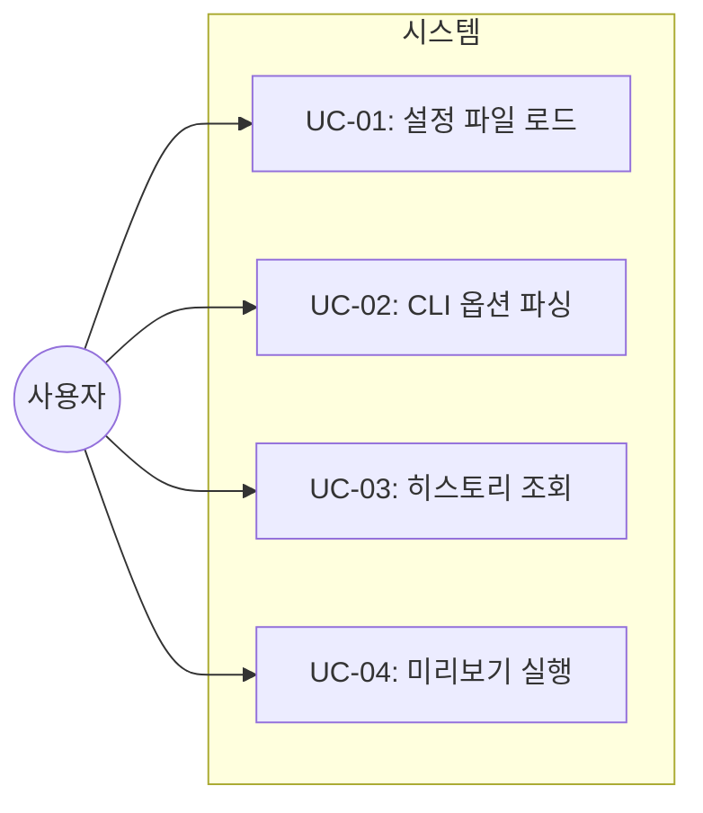
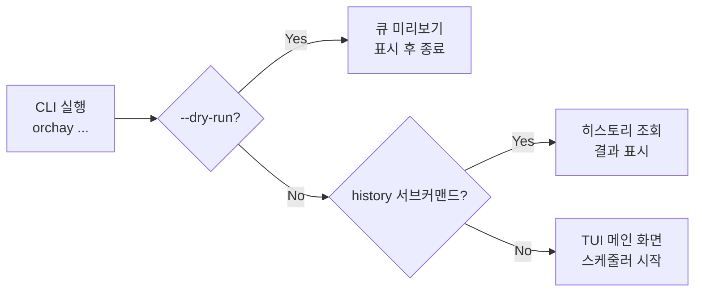
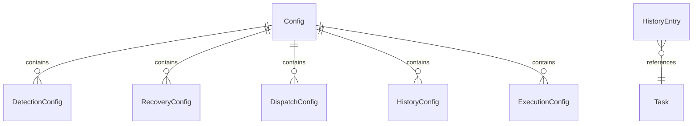

# TSK-02-04 - CLI 및 설정 관리 설계 문서

## 문서 정보

| 항목 | 내용 |
|------|------|
| Task ID | TSK-02-04 |
| 문서 버전 | 1.0 |
| 작성일 | 2025-12-28 |
| 상태 | 작성중 |
| 카테고리 | development |

---

## 1. 개요

### 1.1 배경 및 문제 정의

**현재 상황:**
- orchay 스케줄러는 하드코딩된 설정값으로만 동작 가능
- 실행 시 파라미터 조정이 불가능하여 유연성 부족
- 작업 히스토리를 확인하거나 관리할 수 있는 방법이 없음

**해결하려는 문제:**
- 설정 파일(orchay.json)을 통한 설정 관리 부재
- CLI 인터페이스 부재로 인한 사용성 제한
- 히스토리 조회 기능 부재로 인한 작업 추적 불가

### 1.2 목적 및 기대 효과

**목적:**
- orchay.json 설정 파일을 통한 유연한 설정 관리 구현
- CLI 옵션을 통한 런타임 설정 오버라이드 지원
- 작업 히스토리 저장 및 조회 기능 구현

**기대 효과:**
- 사용자가 상황에 맞게 설정을 조정하여 스케줄러 동작 제어 가능
- --dry-run 옵션으로 실제 분배 없이 스케줄 큐 미리보기 가능
- 완료된 작업의 출력을 저장하고 나중에 조회하여 디버깅/분석 용이

### 1.3 범위

**포함:**
- orchay.json 설정 파일 로드 및 검증 (Pydantic 기반)
- argparse 기반 CLI 옵션 파싱
- 설정 우선순위 처리 (CLI > 설정파일 > 기본값)
- JSON Lines 형식 히스토리 저장 및 조회
- --dry-run 모드 구현

**제외:**
- 설정 파일 GUI 편집기
- 히스토리 데이터 원격 동기화
- 설정 파일 자동 생성/마이그레이션

### 1.4 참조 문서

| 문서 | 경로 | 관련 섹션 |
|------|------|----------|
| PRD | `.orchay/projects/orchay/prd.md` | 섹션 5 (설정), 섹션 6 (CLI) |
| TRD | `.orchay/projects/orchay/trd.md` | 배포 구조, 의존성 목록 |

---

## 2. 사용자 분석

### 2.1 대상 사용자

| 사용자 유형 | 특성 | 주요 니즈 |
|------------|------|----------|
| 개발자 | CLI 도구에 익숙, 터미널 환경 선호 | 빠른 설정 변경, 실행 옵션 제어 |
| 프로젝트 관리자 | 작업 진행 상황 추적 필요 | 히스토리 조회, 작업 결과 확인 |

### 2.2 사용자 페르소나

**페르소나 1: 개발자 A**
- 역할: 백엔드 개발자, orchay로 병렬 작업 분배
- 목표: 상황에 맞게 Worker 수와 모드를 조절하며 스케줄러 운영
- 불만: 매번 설정 파일을 수정해야 하는 번거로움
- 시나리오: `orchay -w 2 -m develop`로 빠르게 Worker 2개, develop 모드로 시작

---

## 3. 유즈케이스

### 3.1 유즈케이스 다이어그램



### 3.2 유즈케이스 상세

#### UC-01: 설정 파일 로드

| 항목 | 내용 |
|------|------|
| 액터 | 스케줄러 시스템 (사용자가 실행 트리거) |
| 목적 | orchay.json에서 설정값 로드 및 검증 |
| 사전 조건 | 스케줄러 실행 시작 |
| 사후 조건 | Config 객체가 유효한 설정값으로 초기화됨 |
| 트리거 | orchay 명령어 실행 |

**기본 흐름:**
1. 시스템이 `.orchay/settings/orchay.json` 파일 경로를 결정한다
2. 파일이 존재하면 JSON을 파싱한다
3. Pydantic 모델로 스키마 검증을 수행한다
4. 검증 통과 시 Config 객체를 반환한다
5. CLI 옵션으로 오버라이드된 값이 있으면 적용한다

**대안 흐름:**
- 2a. 파일이 존재하지 않으면:
  - 기본값으로 Config 객체를 생성한다
  - 경고 메시지를 출력한다: "설정 파일 없음, 기본값 사용"

**예외 흐름:**
- 3a. 스키마 검증 실패 시:
  - 에러 메시지와 함께 잘못된 필드를 표시한다
  - 스케줄러 시작을 중단한다

#### UC-02: CLI 옵션 파싱

| 항목 | 내용 |
|------|------|
| 액터 | 사용자 |
| 목적 | 명령행 인자를 파싱하여 설정 오버라이드 |
| 사전 조건 | orchay 명령어 실행 |
| 사후 조건 | Namespace 객체에 CLI 옵션이 저장됨 |
| 트리거 | 명령행 인자 전달 |

**기본 흐름:**
1. 사용자가 `orchay [PROJECT] [OPTIONS]`를 실행한다
2. argparse가 인자를 파싱한다
3. PROJECT 위치 인자가 있으면 프로젝트명으로 설정한다
4. 각 옵션(-w, -i, -m, --dry-run 등)을 처리한다
5. Namespace 객체를 반환한다

**예외 흐름:**
- 4a. 유효하지 않은 옵션 값:
  - argparse 에러 메시지 출력
  - 사용법(usage) 표시 후 종료

#### UC-03: 히스토리 조회

| 항목 | 내용 |
|------|------|
| 액터 | 사용자 |
| 목적 | 완료된 작업 목록 또는 상세 출력 조회 |
| 사전 조건 | 히스토리 파일 존재 |
| 사후 조건 | 히스토리 정보가 화면에 출력됨 |
| 트리거 | `orchay history` 명령 실행 |

**기본 흐름:**
1. 사용자가 `orchay history`를 실행한다
2. 시스템이 히스토리 파일을 읽는다
3. 최근 작업 목록을 테이블 형식으로 출력한다

**대안 흐름:**
- 1a. `orchay history TSK-01-01` 실행 시:
  - 해당 Task ID의 상세 출력 내용을 표시한다
- 1b. `orchay history --limit 50` 실행 시:
  - 최근 50개 항목만 표시한다
- 1c. `orchay history --clear` 실행 시:
  - 히스토리 파일을 삭제한다

**예외 흐름:**
- 2a. 히스토리 파일 없음:
  - "히스토리가 없습니다" 메시지 출력

#### UC-04: 미리보기 실행 (--dry-run)

| 항목 | 내용 |
|------|------|
| 액터 | 사용자 |
| 목적 | 실제 분배 없이 스케줄 큐 상태 확인 |
| 사전 조건 | orchay 명령어에 --dry-run 옵션 |
| 사후 조건 | 스케줄 큐 표시 후 종료 (분배 없음) |
| 트리거 | `orchay --dry-run` 실행 |

**기본 흐름:**
1. 사용자가 `orchay --dry-run`을 실행한다
2. 설정 파일 로드 및 wbs.md 파싱을 수행한다
3. 스케줄 큐를 생성한다
4. 큐 내용을 화면에 표시한다
5. Worker 상태 감지는 건너뛴다
6. Task 분배 없이 종료한다

---

## 4. 사용자 시나리오

### 4.1 시나리오 1: 기본 실행

**상황 설명:**
개발자가 orchay를 처음 실행하여 기본 설정으로 스케줄러를 시작하려 한다.

**단계별 진행:**

| 단계 | 사용자 행동 | 시스템 반응 | 사용자 기대 |
|------|-----------|------------|------------|
| 1 | `uv run python -m orchay` 실행 | 설정 파일 로드 | 스케줄러 시작 |
| 2 | - | wbs.md 파싱, 큐 생성 | 큐에 Task 표시 |
| 3 | - | TUI 화면 표시 | 대시보드 확인 가능 |

**성공 조건:**
- 스케줄러가 정상 시작되어 TUI 화면이 표시됨

### 4.2 시나리오 2: CLI 옵션으로 설정 오버라이드

**상황 설명:**
개발자가 Worker 수를 2개로 줄이고 develop 모드로 실행하려 한다.

**단계별 진행:**

| 단계 | 사용자 행동 | 시스템 반응 | 사용자 기대 |
|------|-----------|------------|------------|
| 1 | `orchay -w 2 -m develop` 실행 | CLI 인자 파싱 | 옵션 적용 |
| 2 | - | 설정 파일 로드 후 CLI 값으로 오버라이드 | 2 Workers, develop 모드 |
| 3 | - | TUI 화면에 설정값 표시 | Workers: 2, Mode: develop 확인 |

**성공 조건:**
- TUI 헤더에 Workers: 2, Mode: develop 표시

### 4.3 시나리오 3: 히스토리 조회

**상황 설명:**
개발자가 이전에 완료된 작업의 상세 출력을 확인하려 한다.

**단계별 진행:**

| 단계 | 사용자 행동 | 시스템 반응 | 사용자 기대 |
|------|-----------|------------|------------|
| 1 | `orchay history` 실행 | 히스토리 파일 읽기 | 최근 작업 목록 |
| 2 | 목록에서 TSK-01-02 확인 | - | Task ID 식별 |
| 3 | `orchay history TSK-01-02` 실행 | 해당 Task 출력 표시 | 상세 로그 확인 |

**성공 조건:**
- Task 작업 시 캡처된 pane 출력이 표시됨

---

## 5. 화면 설계

### 5.1 화면 흐름도



### 5.2 화면별 상세

#### 화면 1: 큐 미리보기 (--dry-run)

**화면 목적:**
실제 분배 없이 현재 스케줄 큐 상태를 터미널에 출력

**진입 경로:**
- `orchay --dry-run` 또는 `orchay PROJECT --dry-run`

**와이어프레임:**
```
┌─────────────────────────────────────────────────────────────┐
│  orchay - Dry Run Mode                                      │
│  Project: orchay | Mode: quick | Workers: 3 (not started)   │
├─────────────────────────────────────────────────────────────┤
│                                                             │
│  📋 Schedule Queue (5 tasks)                                │
│  ┌────────────────────────────────────────────────────────┐ │
│  │ #  │ Task ID     │ Title                  │ Priority   │ │
│  │────┼─────────────┼────────────────────────┼────────────│ │
│  │ 1  │ TSK-02-01   │ 자동 재개 메커니즘      │ high       │ │
│  │ 2  │ TSK-02-02   │ TUI 메인 화면          │ high       │ │
│  │ 3  │ TSK-02-04   │ CLI 및 설정 관리        │ medium     │ │
│  │ 4  │ TSK-02-03   │ TUI 인터랙티브 기능     │ medium     │ │
│  │ 5  │ TSK-02-05   │ 테스트 및 문서화        │ medium     │ │
│  └────────────────────────────────────────────────────────┘ │
│                                                             │
│  ℹ️  Dry run complete. No tasks were dispatched.            │
│                                                             │
└─────────────────────────────────────────────────────────────┘
```

**화면 요소 설명:**

| 영역 | 설명 | 사용자 인터랙션 |
|------|------|----------------|
| 헤더 | 프로젝트, 모드, Worker 수 표시 | 없음 |
| 큐 테이블 | 스케줄 큐의 Task 목록 | 없음 |
| 안내 메시지 | Dry run 완료 안내 | 없음 |

#### 화면 2: 히스토리 목록

**화면 목적:**
완료된 작업의 히스토리 목록 표시

**진입 경로:**
- `orchay history` 또는 `orchay history --limit N`

**와이어프레임:**
```
┌─────────────────────────────────────────────────────────────┐
│  orchay - Task History                                       │
├─────────────────────────────────────────────────────────────┤
│                                                             │
│  📜 Recent Tasks (showing 10 of 45)                         │
│  ┌────────────────────────────────────────────────────────┐ │
│  │ Task ID     │ Command    │ Result  │ Timestamp          │ │
│  │─────────────┼────────────┼─────────┼────────────────────│ │
│  │ TSK-01-04   │ build      │ success │ 2025-12-28 14:30   │ │
│  │ TSK-01-03   │ verify     │ success │ 2025-12-28 13:15   │ │
│  │ TSK-01-02   │ build      │ error   │ 2025-12-28 12:00   │ │
│  │ ...         │ ...        │ ...     │ ...                │ │
│  └────────────────────────────────────────────────────────┘ │
│                                                             │
│  ℹ️  Use 'orchay history <TASK-ID>' for detailed output     │
│                                                             │
└─────────────────────────────────────────────────────────────┘
```

#### 화면 3: 히스토리 상세

**화면 목적:**
특정 Task의 상세 출력 내용 표시

**진입 경로:**
- `orchay history TSK-01-02`

**와이어프레임:**
```
┌─────────────────────────────────────────────────────────────┐
│  orchay - Task History Detail                                │
├─────────────────────────────────────────────────────────────┤
│                                                             │
│  📋 Task: TSK-01-02                                         │
│  Command: build | Result: error | Worker: 2                 │
│  Timestamp: 2025-12-28 12:00:15                             │
│                                                             │
│  ─── Captured Output (500 lines) ───────────────────────── │
│                                                             │
│  > /wf:build TSK-01-02                                      │
│  [wf:build] 구현 시작                                        │
│  ...                                                        │
│  ❌ Error: TypeScript compilation failed                    │
│  ORCHAY_DONE:TSK-01-02:build:error:compilation failed       │
│                                                             │
└─────────────────────────────────────────────────────────────┘
```

---

## 6. 인터랙션 설계

### 6.1 사용자 액션과 피드백

| 사용자 액션 | 즉각 피드백 | 결과 피드백 | 에러 피드백 |
|------------|-----------|------------|------------|
| CLI 명령 실행 | 로딩 메시지 | 결과 화면 표시 | 에러 메시지 + 종료 코드 |
| --help 옵션 | - | 사용법 출력 | - |
| 잘못된 옵션 | - | - | 에러 + 사용법 출력 |

### 6.2 상태별 화면 변화

| 상태 | 화면 표시 | 사용자 안내 |
|------|----------|------------|
| 설정 로드 성공 | 로드된 설정 요약 (verbose 모드) | - |
| 설정 파일 없음 | 경고 메시지 | "기본값 사용 중" |
| 설정 검증 실패 | 에러 상세 | "설정 파일을 확인하세요" |
| 히스토리 없음 | 빈 상태 메시지 | "아직 완료된 작업이 없습니다" |

---

## 7. 데이터 요구사항

### 7.1 필요한 데이터

| 데이터 | 설명 | 출처 | 용도 |
|--------|------|------|------|
| Config | 스케줄러 설정값 | orchay.json + CLI | 스케줄러 동작 제어 |
| HistoryEntry | 완료된 작업 기록 | orchay-history.jsonl | 히스토리 조회 |
| Namespace | CLI 파싱 결과 | argparse | 설정 오버라이드 |

### 7.2 데이터 관계



**관계 설명:**
- Config는 여러 하위 설정 그룹을 포함한다
- HistoryEntry는 Task ID를 참조한다

### 7.3 데이터 유효성 규칙

| 데이터 필드 | 규칙 | 위반 시 메시지 |
|------------|------|---------------|
| workers | 1-10 정수 | "workers는 1-10 사이 정수여야 합니다" |
| interval | 1-60 정수 | "interval은 1-60초 사이여야 합니다" |
| mode | design/quick/develop/force | "유효하지 않은 모드입니다" |
| storagePath | 유효한 파일 경로 | "히스토리 저장 경로가 잘못되었습니다" |

---

## 8. 비즈니스 규칙

### 8.1 핵심 규칙

| 규칙 ID | 규칙 설명 | 적용 상황 | 예외 |
|---------|----------|----------|------|
| BR-01 | 설정 우선순위: CLI > 설정파일 > 기본값 | 모든 설정값 | 없음 |
| BR-02 | 히스토리 항목 수 maxEntries 초과 시 오래된 것 삭제 | 히스토리 저장 시 | disabled 시 |
| BR-03 | --dry-run 시 Task 분배 금지 | dry-run 모드 | 없음 |

### 8.2 규칙 상세 설명

**BR-01: 설정 우선순위**

설명: 사용자가 CLI 옵션으로 값을 지정하면 설정 파일의 값을 오버라이드한다. 설정 파일에 없는 값은 기본값을 사용한다.

예시:
- 설정 파일: workers=3, CLI: -w 2 → 최종 workers=2
- 설정 파일: workers 없음, CLI: 없음 → 기본값 workers=3

**BR-02: 히스토리 로테이션**

설명: maxEntries(기본 1000)를 초과하면 가장 오래된 항목부터 삭제하여 파일 크기를 제한한다.

---

## 9. 에러 처리

### 9.1 예상 에러 상황

| 상황 | 원인 | 사용자 메시지 | 복구 방법 |
|------|------|--------------|----------|
| 설정 파일 JSON 오류 | 잘못된 JSON 문법 | "설정 파일 파싱 실패: {상세}" | 파일 수정 후 재실행 |
| 설정 스키마 오류 | 잘못된 필드값 | "설정 검증 실패: {필드} - {오류}" | 값 수정 후 재실행 |
| 히스토리 파일 손상 | JSON Lines 형식 오류 | "히스토리 파일 읽기 실패" | --clear로 초기화 |
| 권한 오류 | 파일 쓰기 권한 없음 | "히스토리 저장 실패: 권한 오류" | 권한 수정 |

### 9.2 에러 표시 방식

| 에러 유형 | 표시 위치 | 표시 방법 |
|----------|----------|----------|
| CLI 옵션 오류 | stderr | argparse 기본 에러 + usage |
| 설정 파일 오류 | stderr | Rich 형식 에러 박스 |
| 히스토리 조회 오류 | stdout | 경고 메시지 |

---

## 10. 연관 문서

> 상세 테스트 명세 및 요구사항 추적은 별도 문서에서 관리합니다.

| 문서 | 경로 | 용도 |
|------|------|------|
| 요구사항 추적 매트릭스 | `025-traceability-matrix.md` | PRD → 설계 → 테스트 양방향 추적 |
| 테스트 명세서 | `026-test-specification.md` | 단위/E2E/매뉴얼 테스트 상세 정의 |

---

## 11. 구현 범위

### 11.1 영향받는 영역

| 영역 | 변경 내용 | 영향도 |
|------|----------|--------|
| `src/orchay/models/config.py` | Config Pydantic 모델 정의 | 높음 |
| `src/orchay/utils/config.py` | 설정 로드 함수 구현 | 높음 |
| `src/orchay/utils/history.py` | 히스토리 저장/조회 함수 | 중간 |
| `src/orchay/main.py` | CLI 파싱 및 진입점 | 높음 |
| `src/orchay/__main__.py` | 모듈 실행 지원 | 낮음 |

### 11.2 파일 구조

```
src/orchay/
├── __init__.py
├── __main__.py           # python -m orchay 진입점
├── main.py               # 메인 함수, CLI 파싱
├── models/
│   ├── __init__.py
│   └── config.py         # Config, DetectionConfig 등 Pydantic 모델
└── utils/
    ├── __init__.py
    ├── config.py         # load_config() 함수
    └── history.py        # HistoryManager 클래스
```

### 11.3 의존성

| 의존 항목 | 이유 | 상태 |
|----------|------|------|
| TSK-01-01 (프로젝트 초기화) | Pydantic 모델 기반 | 완료 |
| TSK-01-04 (Worker 관리) | 스케줄러 코어와 통합 | 완료 |

### 11.4 제약 사항

| 제약 | 설명 | 대응 방안 |
|------|------|----------|
| JSON 형식 한정 | orchay.json은 JSON만 지원 | YAML 지원은 향후 과제 |
| 히스토리 로컬 저장 | 원격 동기화 미지원 | 로컬 파일만 사용 |

---

## 12. 기술 설계

### 12.1 Config Pydantic 모델

```python
from pydantic import BaseModel, Field
from typing import Optional, Literal

class DetectionConfig(BaseModel):
    donePattern: str = r"ORCHAY_DONE:([^:]+):(\w+):(success|error)(?::(.+))?"
    promptPatterns: list[str] = [r"^>\s*$", "╭─", "❯"]
    pausePatterns: list[str] = [
        r"rate.*limit", r"please.*wait", r"try.*again",
        r"weekly.*limit.*reached", r"resets.*at",
        r"context.*limit", r"conversation.*too.*long",
        r"overloaded", r"capacity"
    ]
    errorPatterns: list[str] = ["Error:", "Failed:", "Exception:", "❌", "fatal:"]
    questionPatterns: list[str] = [r"\?\s*$", r"\(y/n\)", "선택"]
    readLines: int = 50

class RecoveryConfig(BaseModel):
    resumeText: str = "계속"
    defaultWaitTime: int = 60
    contextLimitWait: int = 5
    maxRetries: int = 3
    retryInterval: int = 5
    resetTimePatterns: list[str] = [
        r"resets\s+(\w+\s+\d+)\s+at\s+(\d+:\d+(?:am|pm)?)",
        r"reset\s+at\s+(\w+\s+\d+),?\s*(\d+:?\d*\s*(?:am|pm)?)"
    ]

class DispatchConfig(BaseModel):
    clearBeforeDispatch: bool = True
    clearWaitTime: int = 2

class HistoryConfig(BaseModel):
    enabled: bool = True
    storagePath: str = ".orchay/logs/orchay-history.jsonl"
    maxEntries: int = 1000
    captureLines: int = 500

class ExecutionConfig(BaseModel):
    mode: Literal["design", "quick", "develop", "force"] = "quick"
    allowModeSwitch: bool = True

class Config(BaseModel):
    workers: int = Field(default=3, ge=1, le=10)
    interval: int = Field(default=5, ge=1, le=60)
    category: Optional[str] = None
    project: Optional[str] = None
    detection: DetectionConfig = Field(default_factory=DetectionConfig)
    recovery: RecoveryConfig = Field(default_factory=RecoveryConfig)
    dispatch: DispatchConfig = Field(default_factory=DispatchConfig)
    history: HistoryConfig = Field(default_factory=HistoryConfig)
    execution: ExecutionConfig = Field(default_factory=ExecutionConfig)
```

### 12.2 설정 로드 함수

```python
import json
from pathlib import Path
from .models.config import Config

def find_orchay_root() -> Path:
    """프로젝트 루트에서 .orchay 폴더를 찾는다."""
    current = Path.cwd()
    while current != current.parent:
        if (current / ".orchay").is_dir():
            return current / ".orchay"
        current = current.parent
    raise FileNotFoundError(".orchay 폴더를 찾을 수 없습니다")

def load_config() -> Config:
    """설정 파일을 로드하여 Config 객체를 반환한다."""
    try:
        orchay_root = find_orchay_root()
        config_path = orchay_root / "settings" / "orchay.json"

        if config_path.exists():
            with open(config_path, "r", encoding="utf-8") as f:
                data = json.load(f)
            return Config.model_validate(data)
        else:
            # 설정 파일 없으면 기본값 사용
            return Config()
    except Exception as e:
        raise RuntimeError(f"설정 로드 실패: {e}")
```

### 12.3 CLI 파싱 함수

```python
import argparse
from typing import Optional

def parse_args() -> argparse.Namespace:
    """CLI 인자를 파싱한다."""
    parser = argparse.ArgumentParser(
        prog="orchay",
        description="WezTerm 기반 Task 스케줄러"
    )

    # 서브커맨드
    subparsers = parser.add_subparsers(dest="command")

    # history 서브커맨드
    history_parser = subparsers.add_parser("history", help="작업 히스토리 조회")
    history_parser.add_argument("task_id", nargs="?", help="조회할 Task ID")
    history_parser.add_argument("--limit", type=int, default=10, help="표시할 항목 수")
    history_parser.add_argument("--clear", action="store_true", help="히스토리 삭제")

    # 메인 스케줄러 옵션
    parser.add_argument("project", nargs="?", default="orchay", help="프로젝트명")
    parser.add_argument("-w", "--workers", type=int, help="Worker 수 오버라이드")
    parser.add_argument("-i", "--interval", type=int, help="모니터링 간격 오버라이드")
    parser.add_argument("-m", "--mode", choices=["design", "quick", "develop", "force"],
                        help="실행 모드")
    parser.add_argument("--dry-run", action="store_true", help="미리보기 (분배 안 함)")
    parser.add_argument("-v", "--verbose", action="store_true", help="상세 로그 출력")

    return parser.parse_args()
```

### 12.4 HistoryManager 클래스

```python
import json
from pathlib import Path
from datetime import datetime
from dataclasses import dataclass, asdict
from typing import Optional

@dataclass
class HistoryEntry:
    task_id: str
    command: str
    result: str  # "success" | "error"
    worker_id: int
    timestamp: str
    output: str  # 캡처된 pane 출력

class HistoryManager:
    def __init__(self, storage_path: str, max_entries: int = 1000):
        self.storage_path = Path(storage_path)
        self.max_entries = max_entries

    def save(self, entry: HistoryEntry) -> None:
        """히스토리 항목을 저장한다."""
        self.storage_path.parent.mkdir(parents=True, exist_ok=True)

        # 기존 항목 읽기
        entries = self._read_all()
        entries.append(asdict(entry))

        # 최대 항목 수 초과 시 오래된 것 삭제
        if len(entries) > self.max_entries:
            entries = entries[-self.max_entries:]

        # JSON Lines 형식으로 저장
        with open(self.storage_path, "w", encoding="utf-8") as f:
            for e in entries:
                f.write(json.dumps(e, ensure_ascii=False) + "\n")

    def list(self, limit: int = 10) -> list[dict]:
        """최근 히스토리 목록을 반환한다."""
        entries = self._read_all()
        return entries[-limit:][::-1]  # 최신순

    def get(self, task_id: str) -> Optional[dict]:
        """특정 Task의 가장 최근 히스토리를 반환한다."""
        entries = self._read_all()
        for entry in reversed(entries):
            if entry["task_id"] == task_id:
                return entry
        return None

    def clear(self) -> None:
        """히스토리를 삭제한다."""
        if self.storage_path.exists():
            self.storage_path.unlink()

    def _read_all(self) -> list[dict]:
        """모든 히스토리 항목을 읽는다."""
        if not self.storage_path.exists():
            return []

        entries = []
        with open(self.storage_path, "r", encoding="utf-8") as f:
            for line in f:
                line = line.strip()
                if line:
                    entries.append(json.loads(line))
        return entries
```

### 12.5 메인 함수 구조

```python
from rich.console import Console
from rich.table import Table

def main() -> int:
    """orchay 메인 진입점."""
    console = Console()
    args = parse_args()

    # history 서브커맨드 처리
    if args.command == "history":
        return handle_history(args, console)

    # 설정 로드
    try:
        config = load_config()
    except Exception as e:
        console.print(f"[red]설정 로드 실패:[/red] {e}")
        return 1

    # CLI 옵션으로 오버라이드
    if args.workers:
        config.workers = args.workers
    if args.interval:
        config.interval = args.interval
    if args.mode:
        config.execution.mode = args.mode
    if args.project:
        config.project = args.project

    # --dry-run 모드
    if args.dry_run:
        return handle_dry_run(config, console)

    # 메인 스케줄러 시작
    return run_scheduler(config, console)

def handle_history(args, console: Console) -> int:
    """히스토리 조회 처리."""
    config = load_config()
    manager = HistoryManager(config.history.storagePath, config.history.maxEntries)

    if args.clear:
        manager.clear()
        console.print("[green]히스토리가 삭제되었습니다.[/green]")
        return 0

    if args.task_id:
        entry = manager.get(args.task_id)
        if entry:
            # 상세 출력
            console.print(f"\n[bold]Task:[/bold] {entry['task_id']}")
            console.print(f"[bold]Command:[/bold] {entry['command']}")
            console.print(f"[bold]Result:[/bold] {entry['result']}")
            console.print(f"[bold]Timestamp:[/bold] {entry['timestamp']}")
            console.print("\n--- Captured Output ---\n")
            console.print(entry['output'])
        else:
            console.print(f"[yellow]Task {args.task_id}의 히스토리를 찾을 수 없습니다.[/yellow]")
        return 0

    # 목록 출력
    entries = manager.list(args.limit)
    if not entries:
        console.print("[yellow]히스토리가 없습니다.[/yellow]")
        return 0

    table = Table(title="Task History")
    table.add_column("Task ID", style="cyan")
    table.add_column("Command", style="green")
    table.add_column("Result")
    table.add_column("Timestamp", style="dim")

    for entry in entries:
        result_style = "green" if entry["result"] == "success" else "red"
        table.add_row(
            entry["task_id"],
            entry["command"],
            f"[{result_style}]{entry['result']}[/{result_style}]",
            entry["timestamp"]
        )

    console.print(table)
    return 0

def handle_dry_run(config: Config, console: Console) -> int:
    """Dry run 모드 처리."""
    # wbs.md 파싱 및 큐 생성
    # ...
    console.print("[bold]orchay - Dry Run Mode[/bold]")
    console.print(f"Project: {config.project} | Mode: {config.execution.mode}")
    console.print("\nℹ️ Dry run complete. No tasks were dispatched.")
    return 0

if __name__ == "__main__":
    import sys
    sys.exit(main())
```

---

## 13. 체크리스트

### 13.1 설계 완료 확인

- [x] 문제 정의 및 목적 명확화
- [x] 사용자 분석 완료
- [x] 유즈케이스 정의 완료
- [x] 사용자 시나리오 작성 완료
- [x] 화면 설계 완료 (CLI 출력 형식)
- [x] 인터랙션 설계 완료
- [x] 데이터 요구사항 정의 완료
- [x] 비즈니스 규칙 정의 완료
- [x] 에러 처리 정의 완료
- [x] 기술 설계 (코드 구조, 인터페이스) 완료

### 13.2 연관 문서 작성

- [ ] 요구사항 추적 매트릭스 작성 (→ `025-traceability-matrix.md`)
- [ ] 테스트 명세서 작성 (→ `026-test-specification.md`)

### 13.3 구현 준비

- [x] 구현 우선순위 결정: Config 모델 → load_config → CLI 파싱 → history
- [x] 의존성 확인 완료 (TSK-01-01, TSK-01-04)
- [x] 제약 사항 검토 완료

---

## 변경 이력

| 버전 | 일자 | 작성자 | 변경 내용 |
|------|------|--------|----------|
| 1.0 | 2025-12-28 | Claude | 최초 작성 |
