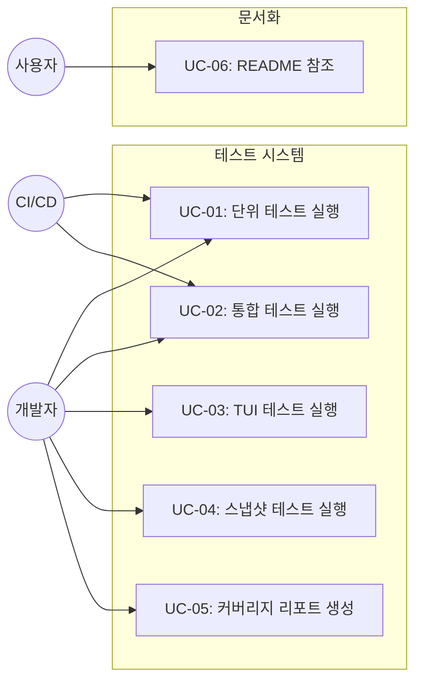
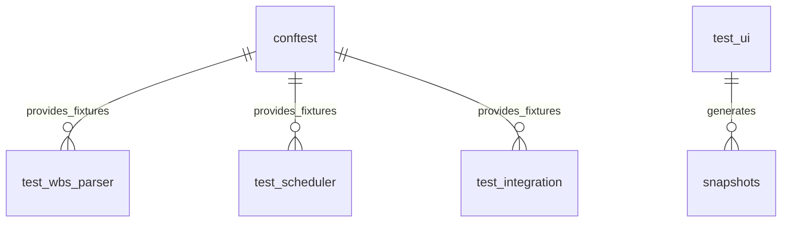

# TSK-02-05 - 테스트 및 문서화 설계 문서

## 문서 정보

| 항목 | 내용 |
|------|------|
| Task ID | TSK-02-05 |
| 문서 버전 | 1.0 |
| 작성일 | 2025-12-28 |
| 상태 | 작성중 |
| 카테고리 | development |
| 도메인 | test |

---

## 1. 개요

### 1.1 배경 및 문제 정의

**현재 상황:**
- orchay 스케줄러의 핵심 기능(WBS 파서, 스케줄러 코어, Worker 관리, TUI)이 구현됨
- 체계적인 테스트 코드가 부재하여 품질 보장이 어려움
- 사용자 가이드 문서(README.md)가 없어 설치/사용법 파악이 어려움

**해결하려는 문제:**
- 코드 품질 보장을 위한 테스트 체계 구축 필요
- 80% 이상의 테스트 커버리지 달성 필요
- 사용자가 쉽게 설치하고 사용할 수 있는 문서화 필요

### 1.2 목적 및 기대 효과

**목적:**
- pytest 기반 단위/통합/TUI 테스트 구현
- pytest-textual-snapshot을 활용한 UI 스냅샷 테스트
- README.md 작성 (설치, 사용법, 설정 가이드)

**기대 효과:**
- 코드 변경 시 회귀 버그 조기 발견
- 80% 이상 테스트 커버리지로 품질 보장
- 사용자가 빠르게 orchay를 설치하고 사용 가능

### 1.3 범위

**포함:**
- 단위 테스트: WBS 파서, 스케줄러, Worker 감지
- 통합 테스트: 주요 플로우 (Task 분배, 상태 전환)
- TUI 테스트: Textual 위젯 테스트 (textual.testing)
- 스냅샷 테스트: UI 레이아웃 검증
- README.md 작성 (설치, 사용법, 설정, 명령어)
- conftest.py (공통 fixtures)

**제외:**
- 성능/부하 테스트 (향후 과제)
- E2E 테스트 (실제 WezTerm 연동)
- API 문서 자동 생성

### 1.4 참조 문서

| 문서 | 경로 | 관련 섹션 |
|------|------|----------|
| TRD | `.orchay/projects/orchay/trd.md` | 테스트 전략, AI 코딩 가이드라인 |
| PRD | `.orchay/projects/orchay/prd.md` | 전체 기능 명세 |

---

## 2. 사용자 분석

### 2.1 대상 사용자

| 사용자 유형 | 특성 | 주요 니즈 |
|------------|------|----------|
| 개발자 (기여자) | orchay 코드를 수정하는 개발자 | 테스트로 변경 안전성 검증 |
| 사용자 (설치자) | orchay를 설치하여 사용하는 사람 | 명확한 설치/사용 가이드 |
| CI/CD 시스템 | 자동화된 빌드/테스트 파이프라인 | 테스트 자동 실행 및 결과 리포트 |

### 2.2 사용자 페르소나

**페르소나 1: 기여자 민수**
- 역할: orchay에 새 기능을 추가하려는 개발자
- 목표: 기존 기능 깨뜨리지 않고 안전하게 기능 추가
- 불만: 테스트 없이는 변경의 영향 범위 파악 어려움
- 시나리오: `pytest` 실행하여 모든 테스트 통과 확인 후 PR 제출

**페르소나 2: 사용자 영희**
- 역할: orchay를 처음 설치하려는 사용자
- 목표: 빠르게 설치하고 사용 시작
- 불만: 설치 방법, 설정 방법을 모름
- 시나리오: README.md 읽고 5분 내 설치 및 실행 성공

---

## 3. 유즈케이스

### 3.1 유즈케이스 다이어그램



### 3.2 유즈케이스 상세

#### UC-01: 단위 테스트 실행

| 항목 | 내용 |
|------|------|
| 액터 | 개발자, CI/CD 시스템 |
| 목적 | 개별 모듈의 기능 정확성 검증 |
| 사전 조건 | 개발 의존성 설치 완료 |
| 사후 조건 | 테스트 결과 리포트 생성 |
| 트리거 | `pytest tests/` 실행 |

**기본 흐름:**
1. 개발자가 `pytest tests/test_wbs_parser.py` 실행
2. pytest가 테스트 케이스 수집
3. 각 테스트 케이스 실행
4. 결과 (pass/fail) 출력
5. 실패 시 상세 에러 메시지 표시

#### UC-05: 커버리지 리포트 생성

| 항목 | 내용 |
|------|------|
| 액터 | 개발자, CI/CD 시스템 |
| 목적 | 테스트 커버리지 측정 및 보고 |
| 사전 조건 | pytest-cov 설치 |
| 사후 조건 | HTML 커버리지 리포트 생성 |
| 트리거 | `pytest --cov=src/orchay --cov-report=html` |

---

## 4. 사용자 시나리오

### 4.1 시나리오 1: 개발자의 테스트 실행

**상황 설명:**
민수가 WBS 파서에 새 기능을 추가한 후 기존 기능이 정상 동작하는지 확인

**단계별 진행:**

| 단계 | 사용자 행동 | 시스템 반응 | 사용자 기대 |
|------|-----------|------------|------------|
| 1 | `pytest tests/` 실행 | 테스트 수집 및 실행 | 모든 테스트 실행 |
| 2 | 결과 확인 | `12 passed, 0 failed` | 기존 기능 정상 동작 |
| 3 | 커버리지 확인 | `Coverage: 82%` | 80% 이상 달성 |

**성공 조건:**
- 모든 테스트 통과
- 커버리지 80% 이상 유지

### 4.2 시나리오 2: 사용자의 설치

**상황 설명:**
영희가 README를 보고 orchay를 설치

**단계별 진행:**

| 단계 | 사용자 행동 | 시스템 반응 | 사용자 기대 |
|------|-----------|------------|------------|
| 1 | README.md 열기 | 설치 가이드 표시 | 명확한 안내 |
| 2 | `uv pip install -e .` 실행 | 의존성 설치 | 에러 없이 완료 |
| 3 | `python -m orchay` 실행 | TUI 화면 표시 | 정상 실행 |

---

## 5. 테스트 구조 설계

### 5.1 디렉토리 구조

```
orchay/
├── tests/
│   ├── __init__.py
│   ├── conftest.py              # 공통 fixtures
│   ├── test_wbs_parser.py       # WBS 파서 단위 테스트
│   ├── test_scheduler.py        # 스케줄러 단위 테스트
│   ├── test_worker.py           # Worker 관리 단위 테스트
│   ├── test_wezterm.py          # WezTerm CLI 래퍼 테스트
│   ├── test_config.py           # 설정 관리 테스트
│   ├── test_integration.py      # 통합 테스트
│   └── test_ui/
│       ├── __init__.py
│       ├── test_app.py          # TUI App 테스트
│       ├── test_widgets.py      # 개별 위젯 테스트
│       └── snapshots/           # 스냅샷 파일
│           └── *.svg
└── README.md
```

### 5.2 테스트 카테고리

| 카테고리 | 파일 | 대상 모듈 | 테스트 수 (예상) |
|---------|------|----------|----------------|
| 단위 - 파서 | test_wbs_parser.py | wbs_parser.py | 15+ |
| 단위 - 스케줄러 | test_scheduler.py | scheduler.py | 12+ |
| 단위 - Worker | test_worker.py | worker.py | 10+ |
| 단위 - WezTerm | test_wezterm.py | utils/wezterm.py | 8+ |
| 단위 - Config | test_config.py | models/config.py | 6+ |
| 통합 | test_integration.py | 전체 플로우 | 5+ |
| TUI | test_ui/*.py | ui/ | 15+ |

### 5.3 공통 Fixtures (conftest.py)

```python
import pytest
from pathlib import Path
from orchay.models.task import Task
from orchay.models.worker import Worker
from orchay.models.config import Config

@pytest.fixture
def sample_wbs_content() -> str:
    """테스트용 wbs.md 내용"""
    return """
## WP-01: 테스트 WP
- status: in_progress

### TSK-01-01: 테스트 Task 1
- category: development
- status: [ ]
- priority: high
- depends: -

### TSK-01-02: 테스트 Task 2
- category: development
- status: [dd]
- priority: medium
- depends: TSK-01-01
"""

@pytest.fixture
def sample_tasks() -> list[Task]:
    """테스트용 Task 목록"""
    return [
        Task(id="TSK-01-01", category="development", status="[ ]", priority="high"),
        Task(id="TSK-01-02", category="development", status="[dd]", priority="medium", depends=["TSK-01-01"]),
        Task(id="TSK-02-01", category="defect", status="[ ]", priority="low"),
    ]

@pytest.fixture
def sample_workers() -> list[Worker]:
    """테스트용 Worker 목록"""
    return [
        Worker(id=1, pane_id=1, state="idle"),
        Worker(id=2, pane_id=2, state="busy", current_task="TSK-01-01"),
        Worker(id=3, pane_id=3, state="paused"),
    ]

@pytest.fixture
def sample_config() -> Config:
    """테스트용 설정"""
    return Config(
        workers=3,
        interval=5,
        mode="quick",
    )

@pytest.fixture
def temp_wbs_file(tmp_path: Path, sample_wbs_content: str) -> Path:
    """임시 wbs.md 파일"""
    wbs_path = tmp_path / "wbs.md"
    wbs_path.write_text(sample_wbs_content, encoding="utf-8")
    return wbs_path
```

---

## 6. 문서화 설계 (README.md)

### 6.1 README 구조

```markdown
# orchay - Task Scheduler for WezTerm

## Overview
## Features
## Requirements
## Installation
  ### Quick Start
  ### Development Setup
## Usage
  ### Basic Usage
  ### Modes
  ### Commands
  ### Key Bindings
## Configuration
  ### orchay.json
  ### Settings Reference
## Architecture
## Testing
## Contributing
## License
```

### 6.2 핵심 섹션 내용

#### Installation 섹션

```markdown
## Installation

### Requirements
- Python >= 3.10
- WezTerm (with CLI enabled)
- uv (recommended) or pip

### Quick Start
\`\`\`bash
cd orchay
uv venv
uv pip install -e .
python -m orchay
\`\`\`

### Development Setup
\`\`\`bash
uv pip install -e ".[dev]"
pytest tests/
\`\`\`
```

#### Usage 섹션

```markdown
## Usage

### Basic Usage
\`\`\`bash
# Start scheduler
python -m orchay

# With options
python -m orchay --workers 3 --mode quick --dry-run
\`\`\`

### Modes
| Mode | Description |
|------|-------------|
| design | Design documents only |
| quick | Fast development (skip reviews) |
| develop | Full workflow (with reviews) |
| force | Ignore dependencies |

### Key Bindings
| Key | Action |
|-----|--------|
| F1 | Help |
| F3 | Queue |
| F7 | Toggle mode |
| F10 | Exit |
```

---

## 7. 데이터 요구사항

### 7.1 필요한 데이터

| 데이터 | 설명 | 출처 | 용도 |
|--------|------|------|------|
| 테스트 fixtures | 샘플 Task, Worker, Config | conftest.py | 테스트 입력 |
| 스냅샷 파일 | UI 레이아웃 SVG | tests/test_ui/snapshots/ | UI 회귀 테스트 |
| 커버리지 데이터 | 코드 커버리지 정보 | pytest-cov | 품질 측정 |

### 7.2 데이터 관계



---

## 8. 비즈니스 규칙

### 8.1 핵심 규칙

| 규칙 ID | 규칙 설명 | 적용 상황 | 예외 |
|---------|----------|----------|------|
| BR-01 | 테스트 커버리지 80% 이상 유지 | PR 머지 시 | - |
| BR-02 | 모든 테스트 통과해야 PR 머지 가능 | CI 파이프라인 | 명시적 스킵 |
| BR-03 | 스냅샷 변경 시 리뷰 필수 | UI 변경 시 | - |
| BR-04 | 새 기능 추가 시 테스트 필수 | 코드 추가 시 | 문서 변경 |

### 8.2 규칙 상세 설명

**BR-01: 커버리지 기준**
- 전체 코드의 80% 이상이 테스트로 커버되어야 함
- `pytest --cov=src/orchay --cov-fail-under=80` 사용

**BR-02: 테스트 통과 필수**
- CI에서 테스트 실패 시 PR 머지 차단
- `pytest tests/ --tb=short` 사용

---

## 9. 에러 처리

### 9.1 예상 에러 상황

| 상황 | 원인 | 처리 방법 |
|------|------|----------|
| 테스트 실패 | 코드 버그 | 상세 에러 메시지 출력 |
| 스냅샷 불일치 | UI 변경 | `--snapshot-update` 제안 |
| 커버리지 미달 | 테스트 부족 | 미커버 라인 리포트 |
| fixture 에러 | 설정 오류 | 명확한 에러 메시지 |

### 9.2 에러 표시 방식

| 에러 유형 | 표시 방법 |
|----------|----------|
| 테스트 실패 | pytest 기본 출력 (FAILED) |
| 어설션 에러 | 기대값 vs 실제값 비교 |
| 예외 발생 | 스택 트레이스 |

---

## 10. 연관 문서

| 문서 | 경로 | 용도 |
|------|------|------|
| 요구사항 추적 매트릭스 | `025-traceability-matrix.md` | PRD → 테스트 추적 |
| 테스트 명세서 | `026-test-specification.md` | 테스트 케이스 상세 |

---

## 11. 구현 범위

### 11.1 영향받는 영역

| 영역 | 변경 내용 | 영향도 |
|------|----------|--------|
| `tests/` | 신규 테스트 디렉토리 생성 | 높음 |
| `README.md` | 신규 문서 작성 | 중간 |
| `pyproject.toml` | 테스트 설정 추가 | 낮음 |

### 11.2 의존성

| 의존 항목 | 이유 | 상태 |
|----------|------|------|
| TSK-02-01 | 자동 재개 테스트 대상 | 승인됨 |
| TSK-02-02 | TUI 메인 화면 테스트 대상 | 승인됨 |
| TSK-02-03 | TUI 인터랙티브 테스트 대상 | 승인됨 |
| TSK-02-04 | CLI/설정 테스트 대상 | 미완료 |
| pytest>=8.0 | 테스트 프레임워크 | pyproject.toml |
| pytest-asyncio>=0.23 | 비동기 테스트 | pyproject.toml |
| pytest-textual-snapshot>=1.0 | UI 스냅샷 테스트 | pyproject.toml |

### 11.3 제약 사항

| 제약 | 설명 | 대응 방안 |
|------|------|----------|
| WezTerm 실제 호출 | 단위 테스트에서 실제 호출 어려움 | Mock 사용 |
| TUI 테스트 환경 | 터미널 환경 필요 | textual.testing 활용 |
| 비동기 테스트 | asyncio 테스트 복잡도 | pytest-asyncio 사용 |

---

## 12. 체크리스트

### 12.1 설계 완료 확인

- [x] 문제 정의 및 목적 명확화
- [x] 사용자 분석 완료
- [x] 유즈케이스 정의 완료
- [x] 사용자 시나리오 작성 완료
- [x] 테스트 구조 설계 완료
- [x] README 구조 설계 완료
- [x] 데이터 요구사항 정의 완료
- [x] 비즈니스 규칙 정의 완료
- [x] 에러 처리 정의 완료

### 12.2 연관 문서 작성

- [ ] 요구사항 추적 매트릭스 작성 (→ `025-traceability-matrix.md`)
- [ ] 테스트 명세서 작성 (→ `026-test-specification.md`)

### 12.3 구현 준비

- [x] 구현 우선순위 결정
- [x] 의존성 확인 완료
- [x] 제약 사항 검토 완료

---

## 변경 이력

| 버전 | 일자 | 작성자 | 변경 내용 |
|------|------|--------|----------|
| 1.0 | 2025-12-28 | Claude | 최초 작성 |
