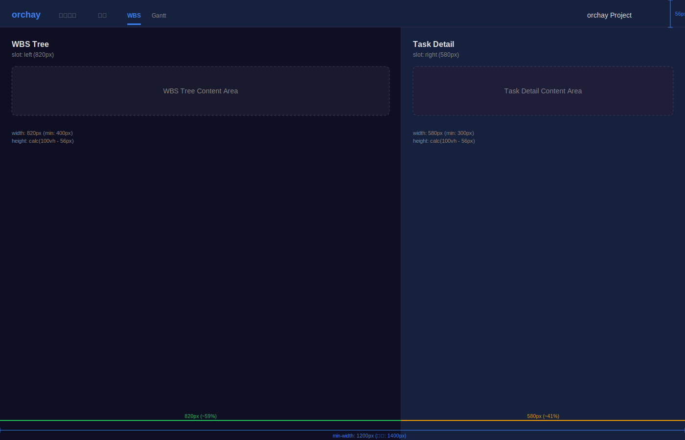
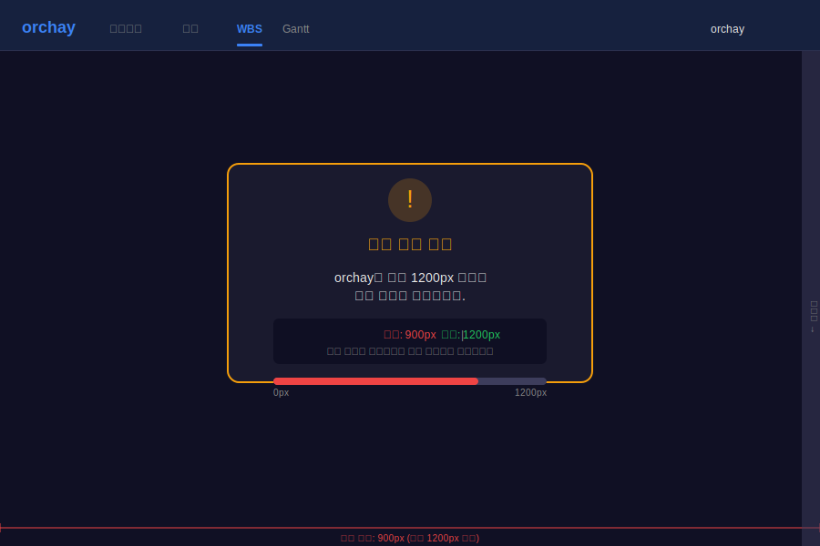

# 화면설계: AppLayout 컴포넌트 구현

## 문서 정보

| 항목 | 내용 |
|------|------|
| Task ID | TSK-01-02-01 |
| Category | development |
| 상태 | [bd] 기본설계 |
| 기본설계 참조 | 010-basic-design.md |
| 작성일 | 2025-12-13 |

---

## 1. 화면 목록

| 화면 ID | 화면명 | 목적 | SVG 파일 |
|---------|--------|------|----------|
| SCR-01 | AppLayout 기본 | 전체 앱 레이아웃 (Header + 좌우 분할 패널) 제공 | [screen-01-layout.svg](./ui-assets/screen-01-layout.svg) |
| SCR-02 | AppLayout 반응형 경고 | 1200px 미만 화면에서 경고 메시지 표시 | [screen-02-layout-warning.svg](./ui-assets/screen-02-layout-warning.svg) |

---

## 2. 화면 전환 흐름

### 2.1 전체 흐름도

```mermaid
stateDiagram-v2
    [*] --> SCR-01: 화면 너비 >= 1200px
    [*] --> SCR-02: 화면 너비 < 1200px
    SCR-02 --> SCR-01: 화면 크기 조절
    SCR-01 --> SCR-02: 화면 크기 축소
```

### 2.2 액션-화면 매트릭스

| 현재 화면 | 사용자 액션 | 결과 | 조건 |
|----------|------------|------|------|
| SCR-01 | 브라우저 크기 축소 | SCR-02로 전환 | 너비 < 1200px |
| SCR-02 | 브라우저 크기 확대 | SCR-01로 전환 | 너비 >= 1200px |

---

## 3. 화면별 상세 설계

### 3.1 SCR-01: AppLayout 기본

#### 3.1.1 화면 목적

orchay 애플리케이션의 모든 페이지에서 사용되는 기본 레이아웃을 제공합니다. Header와 Content 영역을 분리하고, Content 영역을 좌우로 분할하여 WBS Tree와 Detail Panel을 동시에 표시합니다.

#### 3.1.2 레이아웃 구조

```
┌─────────────────────────────────────────────────────────────────────────────┐
│                              Header (56px)                                   │
│  [Logo]  [Dashboard] [Kanban] [WBS*] [Gantt]              [Project Name]    │
├─────────────────────────────────────────────┬───────────────────────────────┤
│                                             │                               │
│              Left Panel (60%)               │      Right Panel (40%)        │
│                                             │                               │
│           (WBS Tree - slot:left)            │    (Detail - slot:right)      │
│                                             │                               │
│              min-width: 400px               │       min-width: 300px        │
│                                             │                               │
│           height: calc(100vh - 56px)        │   height: calc(100vh - 56px)  │
│                                             │                               │
│                                             │                               │
│                                             │                               │
│                                             │                               │
│                                             │                               │
└─────────────────────────────────────────────┴───────────────────────────────┘
                              최소 지원 너비: 1200px
```

#### 3.1.3 SVG 참조

- 기본 상태: 

#### 3.1.4 영역별 사양

| 영역 | 크기 | 배경색 | 설명 |
|------|------|--------|------|
| Header | 높이 56px, 너비 100% | `#16213e` (bg-header) | 고정 헤더, 로고/네비게이션/프로젝트명 |
| Left Panel | 너비 60%, 높이 calc(100vh - 56px) | `#0f0f23` (bg-sidebar) | WBS Tree 표시 영역 |
| Right Panel | 너비 40%, 높이 calc(100vh - 56px) | `#1a1a2e` (bg) | Task Detail 표시 영역 |
| Divider | 너비 1px | `#2d2d44` (border) | 좌우 패널 구분선 |

#### 3.1.5 컴포넌트 목록

| 컴포넌트 | 타입 | 위치 | Props/Slots |
|----------|------|------|-------------|
| AppLayout | Layout | 전체 | slots: header, left, right |
| Header Slot | Slot | 상단 56px | AppHeader 컴포넌트 삽입 |
| Left Panel | Container | 좌측 60% | slot:left로 WBS Tree 삽입 |
| Right Panel | Container | 우측 40% | slot:right로 Detail Panel 삽입 |

#### 3.1.6 상태별 화면 변화

| 상태 | 표시 내용 | 사용 가능 액션 |
|------|----------|---------------|
| 기본 | Header + 좌우 분할 패널 | 슬롯 컨텐츠 상호작용 |
| 로딩 | 동일 레이아웃 (슬롯 컨텐츠가 로딩 상태) | 없음 |

---

### 3.2 SCR-02: AppLayout 반응형 경고

#### 3.2.1 화면 목적

화면 너비가 최소 지원 너비(1200px) 미만일 때 사용자에게 경고 메시지를 표시하여 더 넓은 화면을 사용하도록 안내합니다.

#### 3.2.2 레이아웃 구조

```
┌─────────────────────────────────────────────────────────────────────────────┐
│                              Header (56px)                                   │
│  [Logo]  [Dashboard] [Kanban] [WBS*] [Gantt]              [Project Name]    │
├─────────────────────────────────────────────────────────────────────────────┤
│                                                                             │
│                                                                             │
│                         ┌─────────────────────────┐                         │
│                         │    ⚠️ 화면 너비 경고     │                         │
│                         │                         │                         │
│                         │   orchay은 최소          │                         │
│                         │   1200px 이상의         │                         │
│                         │   화면 너비가 필요합니다  │                         │
│                         │                         │                         │
│                         │   현재: XXXpx           │                         │
│                         │   필요: 1200px          │                         │
│                         └─────────────────────────┘                         │
│                                                                             │
│                                                                             │
└─────────────────────────────────────────────────────────────────────────────┘
```

#### 3.2.3 SVG 참조

- 경고 상태: 

#### 3.2.4 컴포넌트 목록

| 컴포넌트 | 타입 | 위치 | 동작 |
|----------|------|------|------|
| WarningCard | Card | 화면 중앙 | 경고 메시지 표시 |
| WarningIcon | Icon | 카드 상단 | 경고 아이콘 (⚠️) |
| WarningMessage | Text | 카드 본문 | 화면 크기 안내 |
| CurrentWidth | Text | 카드 본문 | 현재 화면 너비 표시 |

---

## 4. 공통 컴포넌트

### 4.1 레이아웃 Slot 정의

| Slot 이름 | 용도 | 기본 컨텐츠 |
|-----------|------|-------------|
| header | Header 영역 | AppHeader 컴포넌트 |
| left | 좌측 패널 | WbsTreePanel 컴포넌트 |
| right | 우측 패널 | TaskDetailPanel 컴포넌트 |

### 4.2 Props 정의

| Prop | 타입 | 기본값 | 설명 |
|------|------|--------|------|
| leftWidth | number | 60 | 좌측 패널 너비 비율 (%) |
| minLeftWidth | number | 400 | 좌측 패널 최소 너비 (px) |
| minRightWidth | number | 300 | 우측 패널 최소 너비 (px) |

---

## 5. 반응형 설계

### 5.1 Breakpoint 정의

| Breakpoint | 너비 | 레이아웃 변화 |
|------------|------|--------------|
| Desktop | >= 1200px | 전체 레이아웃 (Header + 좌우 분할) |
| Narrow | < 1200px | 경고 메시지 표시, 스크롤 가능 |

### 5.2 반응형 동작

```javascript
// 반응형 로직
if (windowWidth >= 1200) {
  // 기본 레이아웃 표시
  showLayout()
} else {
  // 경고 메시지 표시 + 수평 스크롤
  showWarning()
  enableHorizontalScroll()
}
```

---

## 6. 접근성 고려사항

| 항목 | 적용 내용 |
|------|----------|
| 키보드 네비게이션 | 패널 간 Tab 이동 가능 |
| 스크린 리더 | 영역별 ARIA landmark (header, main, aside) |
| 색상 대비 | WCAG 2.1 AA 기준 충족 (4.5:1 이상) |
| 포커스 표시 | 포커스 시 outline 표시 |

---

## 7. SVG 파일 목록

| 파일명 | 화면 | 상태 | 설명 |
|--------|------|------|------|
| screen-01-layout.svg | SCR-01 | 기본 | 전체 레이아웃 구조 |
| screen-02-layout-warning.svg | SCR-02 | 경고 | 화면 너비 경고 상태 |

---

## 8. 색상 팔레트

> PRD 10.1 Dark Blue Theme 참조

| 용도 | 색상 코드 | 색상명 |
|------|----------|--------|
| 헤더 배경 | `#16213e` | bg-header |
| 사이드바 배경 | `#0f0f23` | bg-sidebar |
| 메인 배경 | `#1a1a2e` | bg |
| 테두리 | `#2d2d44` | border |
| 텍스트 기본 | `#e2e8f0` | text-base |
| 텍스트 밝음 | `#ffffff` | text-light |
| 포인트 | `#667eea` | accent |
| 경고 | `#f59e0b` | warning |

---

## 9. 다음 단계

- `/wf:draft TSK-01-02-01` 명령어로 상세설계 진행
- 화면설계 내용을 상세설계 UI/UX 섹션에 반영

---

## 관련 문서

- 기본설계: `010-basic-design.md`
- PRD: `.orchay/projects/orchay/prd.md` (섹션 6.1, 10.1)
- 테마 설정: `tailwind.config.ts`, `app/assets/css/main.css`
