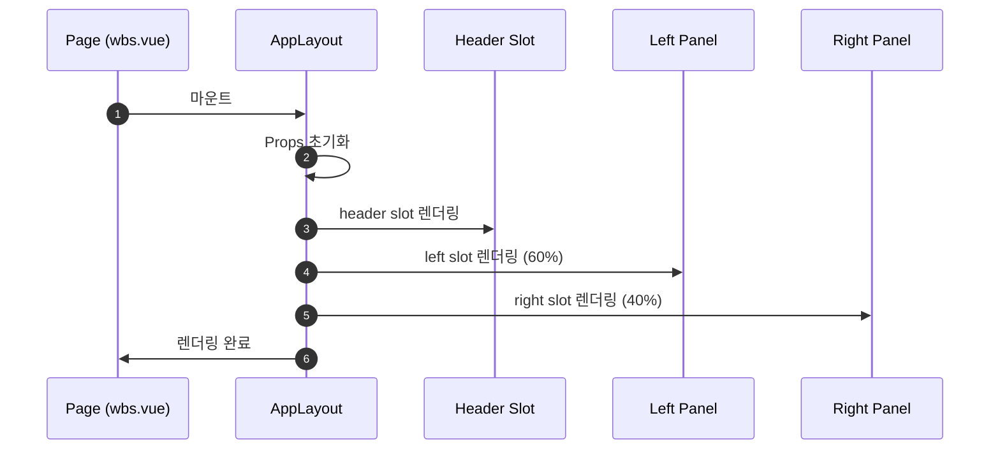

# 상세설계: AppLayout 컴포넌트 구현

**Template Version:** 3.0.0 — **Last Updated:** 2025-12-13

> **설계 규칙**
> * *기능 중심 설계*에 집중한다.
> * 실제 소스코드(전체 또는 일부)는 **절대 포함하지 않는다**.
> * 작성 후 **상위 문서(PRD, TRD, 기본설계)와 비교**하여 차이가 있으면 **즉시 중단 → 차이 설명 → 지시 대기**.
> * **다이어그램 규칙**
>   * 프로세스: **Mermaid**만 사용
>   * UI 레이아웃: **Text Art(ASCII)** → 바로 아래 **SVG 개념도**를 순차 배치
>
> **분할 문서**
> * 요구사항 추적성: `025-traceability-matrix.md`
> * 테스트 명세: `026-test-specification.md`

---

## 0. 문서 메타데이터

| 항목 | 내용 |
|------|------|
| Task ID | TSK-01-02-01 |
| Task명 | AppLayout 컴포넌트 구현 |
| Category | development |
| 상태 | [dd] 상세설계 |
| 작성일 | 2025-12-13 |
| 작성자 | Claude |

### 상위 문서 참조

| 문서 유형 | 경로 | 참조 섹션 |
|----------|------|----------|
| PRD | `.orchay/projects/orchay/prd.md` | 섹션 6.1 (레이아웃 구조) |
| TRD | `.orchay/projects/orchay/trd.md` | 전체 |
| 기본설계 | `010-basic-design.md` | 전체 |
| 상위 Activity | ACT-01-02: App Layout | - |
| 상위 Work Package | WP-01: Platform Infrastructure | - |

### 분할 문서 참조

| 문서 유형 | 파일명 | 목적 |
|----------|--------|------|
| 추적성 매트릭스 | `025-traceability-matrix.md` | 요구사항 ↔ 설계 ↔ 테스트 추적 |
| 테스트 명세 | `026-test-specification.md` | 테스트 시나리오, 데이터, data-testid |

---

## 1. 일관성 검증 결과

> 상위 문서와의 일관성 검증 결과를 기록합니다.

### 1.1 검증 요약

| 구분 | 통과 | 경고 | 실패 |
|------|------|------|------|
| PRD ↔ 기본설계 | 4개 | 0개 | 0개 |
| 기본설계 ↔ 상세설계 | 6개 | 0개 | 0개 |
| TRD ↔ 상세설계 | 5개 | 0개 | 0개 |

### 1.2 검증 상세

| 검증 ID | 검증 항목 | 결과 | 비고 |
|---------|----------|------|------|
| CHK-PRD-01 | 기능 요구사항 완전성 | ✅ PASS | PRD 6.1의 레이아웃 구조 반영 |
| CHK-PRD-02 | 비즈니스 규칙 일치성 | ✅ PASS | Header 56px, 60:40 비율 준수 |
| CHK-PRD-03 | 용어 일관성 | ✅ PASS | Left/Right Panel 용어 일치 |
| CHK-PRD-04 | 범위 일치성 | ✅ PASS | 기본설계 범위 내 설계 |
| CHK-BD-01 | 기능 요구사항 완전성 | ✅ PASS | 3개 기능 요구사항 모두 설계 |
| CHK-BD-02 | 비즈니스 규칙 구현 명세 | ✅ PASS | BR-001~004 구현 방안 명시 |
| CHK-BD-03 | 데이터 모델 일치성 | ✅ PASS | panelRatio, headerHeight 포함 |
| CHK-BD-04 | 인터페이스 일치성 | ✅ PASS | Props, Slots 동일 |
| CHK-BD-05 | 화면 일치성 | ✅ PASS | 레이아웃 구조 동일 |
| CHK-BD-06 | 수용 기준 구현 가능성 | ✅ PASS | 모든 수용 기준 테스트 가능 |
| CHK-TRD-01 | 기술 스택 준수 | ✅ PASS | Vue 3 + Nuxt 3 사용 |
| CHK-TRD-02 | 아키텍처 패턴 준수 | ✅ PASS | layouts/ 폴더 구조 준수 |
| CHK-TRD-03 | API 설계 규칙 준수 | ✅ PASS | N/A (API 없음) |
| CHK-TRD-04 | DB 스키마 규칙 준수 | ✅ PASS | N/A (DB 없음) |
| CHK-TRD-05 | 에러 핸들링 표준 준수 | ✅ PASS | N/A |

---

## 2. 목적 및 범위

### 2.1 목적

orchay 애플리케이션의 전체 레이아웃 구조를 정의하는 AppLayout 컴포넌트를 구현합니다. 이 컴포넌트는 모든 페이지의 기본 틀이 되며, Header와 Content 영역을 분리하고 좌우 분할 패널을 제공합니다.

### 2.2 범위

**포함 범위** (기본설계 구현 범위의 기술적 구현 사항):
- Header + Content 영역 분리 레이아웃 구현
- 좌우 분할 패널 (60:40 비율) 구현
- 반응형 레이아웃 (최소 1200px) 구현
- Slot 기반 컨텐츠 삽입 구조

**제외 범위** (다른 Task에서 구현):
- AppHeader 컴포넌트 상세 구현 → TSK-01-02-02
- WBS Tree Panel 내용 → WP-04
- Task Detail Panel 내용 → WP-05

---

## 3. 기술 스택

> TRD 기준, 이 Task에서 사용하는 기술만 명시

| 구분 | 기술 | 버전 | 용도 |
|------|------|------|------|
| Frontend | Vue 3 + Nuxt 3 | 3.5.x / 3.18.x | UI 렌더링 |
| UI Framework | PrimeVue | 4.x | 레이아웃 컴포넌트 |
| Styling | TailwindCSS | 3.4.x | 유틸리티 CSS |
| Testing | Vitest + Playwright | 2.x / 1.49.x | 테스트 |

---

## 4. 용어/가정/제약

### 4.1 용어 정의

| 용어 | 정의 |
|------|------|
| AppLayout | 전체 앱의 기본 레이아웃 컴포넌트 |
| Header | 상단 고정 영역 (56px) |
| Left Panel | 좌측 패널 (WBS Tree 영역, 60%) |
| Right Panel | 우측 패널 (Detail 영역, 40%) |
| Slot | Vue의 컨텐츠 삽입 메커니즘 |

### 4.2 가정 (Assumptions)

- 사용자는 1200px 이상의 화면에서 주로 사용
- 모든 페이지에서 동일한 레이아웃 구조 사용
- 패널 비율은 초기 60:40 고정 (리사이즈 기능은 향후)

### 4.3 제약 (Constraints)

- 최소 지원 화면 너비: 1200px
- Header 높이: 56px 고정
- TRD에 따라 PrimeVue 컴포넌트 우선 사용

---

## 5. 시스템/모듈 구조

> **규칙**: 구현 코드가 아닌 **구조/역할/책임**만 표현

### 5.1 모듈 역할 및 책임

| 모듈 | 역할 | 책임 |
|------|------|------|
| AppLayout.vue | 레이아웃 컴포넌트 | Header + Content 구조 정의, 좌우 패널 분할 |
| app/layouts/ | 레이아웃 폴더 | Nuxt layouts 디렉토리 규칙 준수 |

### 5.2 모듈 구조도 (개념)

```
app/
├── layouts/
│   └── default.vue          # AppLayout 적용 (Nuxt default layout)
├── components/
│   └── layout/
│       └── AppLayout.vue    # 메인 레이아웃 컴포넌트
└── pages/
    └── wbs.vue              # AppLayout 사용
```

### 5.3 외부 의존성

| 의존성 | 유형 | 용도 |
|--------|------|------|
| PrimeVue | Library | 레이아웃 관련 컴포넌트 (Splitter 등) |
| TailwindCSS | Library | 레이아웃 유틸리티 클래스 |

---

## 6. 데이터 모델 (개념 수준)

> **규칙**: 코드가 아닌 **개념 수준 정의**만 기술
>
> 이 Task는 UI 컴포넌트로 데이터베이스 엔티티가 없음

### 6.1 컴포넌트 상태 정의

| 상태명 | 타입 | 필수 | 설명 | 기본값 |
|--------|------|------|------|--------|
| leftWidth | number | N | 좌측 패널 비율 (%) | 60 |
| minLeftWidth | number | N | 좌측 최소 너비 (px) | 400 |
| minRightWidth | number | N | 우측 최소 너비 (px) | 300 |
| headerHeight | number | N | 헤더 높이 (px) | 56 |

---

## 7. 인터페이스 계약 (Component Contract)

> **규칙**: 코드가 아닌 **표 형태의 계약 정의**
>
> 이 Task는 API가 없고 컴포넌트 인터페이스만 정의

### 7.1 Props 정의

| Prop명 | 타입 | 필수 | 설명 | 기본값 | 유효성 규칙 |
|--------|------|------|------|--------|------------|
| leftWidth | number | N | 좌측 패널 비율 (%) | 60 | 30 ≤ value ≤ 80 |
| minLeftWidth | number | N | 좌측 최소 너비 (px) | 400 | ≥ 300 |
| minRightWidth | number | N | 우측 최소 너비 (px) | 300 | ≥ 200 |

### 7.2 Slots 정의

| Slot명 | 용도 | 필수 | 예시 컨텐츠 |
|--------|------|------|------------|
| header | Header 영역 컨텐츠 | N | AppHeader 컴포넌트 |
| left | 좌측 패널 컨텐츠 | N | WbsTreePanel 컴포넌트 |
| right | 우측 패널 컨텐츠 | N | TaskDetailPanel 컴포넌트 |
| default | Content 전체 영역 (분할 미사용 시) | N | 단일 컨텐츠 |

### 7.3 Emits 정의

| Event명 | Payload | 설명 |
|---------|---------|------|
| resize | `{ leftWidth: number }` | 패널 크기 변경 시 (향후 구현) |

---

## 8. 프로세스 흐름

### 8.1 프로세스 설명

> 각 단계에 관련 요구사항 태그 `[FR-XXX]` 병기

1. **렌더링** [FR-001]: AppLayout 컴포넌트가 마운트됨
2. **Header 렌더링** [FR-001]: header slot에 전달된 컨텐츠 렌더링
3. **Content 분할** [FR-002]: 좌우 패널을 60:40 비율로 분할
4. **Slot 렌더링** [FR-001]: left, right slot 컨텐츠 렌더링
5. **반응형 처리** [FR-003]: 화면 너비에 따른 레이아웃 조정

### 8.2 컴포넌트 렌더링 흐름



---

## 9. UI 설계

> **규칙**: Text Art(ASCII)로 영역 구성

### 9.1 화면 목록

| 화면 | 경로 | 목적 | 주요 기능 |
|------|------|------|----------|
| AppLayout | 모든 페이지 | 앱 레이아웃 제공 | Header/Content 분리, 좌우 분할 |

### 9.2 레이아웃 구조

```
┌─────────────────────────────────────────────────────────────────────┐
│                         Header (56px)                                │
│  ┌─────────────────────────────────────────────────────────────────┐│
│  │                    [slot: header]                               ││
│  └─────────────────────────────────────────────────────────────────┘│
├─────────────────────────────────────┬───────────────────────────────┤
│                                     │                               │
│         Left Panel (60%)            │      Right Panel (40%)        │
│                                     │                               │
│  ┌─────────────────────────────────┐│  ┌─────────────────────────┐  │
│  │                                 ││  │                         │  │
│  │         [slot: left]            ││  │      [slot: right]      │  │
│  │                                 ││  │                         │  │
│  │   (WBS Tree Panel 영역)         ││  │  (Detail Panel 영역)     │  │
│  │                                 ││  │                         │  │
│  │                                 ││  │                         │  │
│  │                                 ││  │                         │  │
│  │                                 ││  │                         │  │
│  │   min-width: 400px              ││  │   min-width: 300px      │  │
│  │   height: calc(100vh - 56px)    ││  │   height: calc(100vh    │  │
│  │                                 ││  │           - 56px)       │  │
│  └─────────────────────────────────┘│  └─────────────────────────┘  │
│                                     │                               │
└─────────────────────────────────────┴───────────────────────────────┘
                          min-width: 1200px
```

### 9.3 컴포넌트 구조 (개념)

| 컴포넌트 | 역할 | Props (개념) | Slots (개념) |
|----------|------|--------------|--------------|
| AppLayout | 전체 레이아웃 | leftWidth, minLeftWidth, minRightWidth | header, left, right, default |

### 9.4 영역별 스타일 사양

| 영역 | 크기 | 배경색 | TailwindCSS 클래스 |
|------|------|--------|-------------------|
| Container | min-width: 1200px, height: 100vh | - | min-w-[1200px] h-screen |
| Header | height: 56px, width: 100% | bg-header | h-[56px] w-full bg-header |
| Content | height: calc(100vh - 56px) | - | h-[calc(100vh-56px)] |
| Left Panel | width: 60%, min-width: 400px | bg-panel-left | w-[60%] min-w-[400px] bg-panel-left |
| Right Panel | width: 40%, min-width: 300px | bg-panel-right | w-[40%] min-w-[300px] bg-panel-right |

> **구현 참고**: 색상은 `tailwind.config.js`의 theme.extend.colors에 정의된 변수 사용 권장
> - `bg-header`: #16213e
> - `bg-panel-left`: #0f0f23
> - `bg-panel-right`: #1a1a2e

### 9.5 반응형/접근성 가이드

* **반응형**:
  * `≥ 1200px`: 정상 표시
  * `< 1200px`: 가로 스크롤 발생 (최소 너비 고정)

* **접근성**:
  * 시맨틱 HTML 사용 (header, main, aside)
  * 키보드 탐색 지원

#### 시맨틱 태그 매핑

| 영역 | HTML 태그 | ARIA 역할 |
|------|----------|----------|
| Container | div | - |
| Header | header | banner |
| Content | main | main |
| Left Panel | aside | complementary |
| Right Panel | section | region |

---

## 10. 비즈니스 규칙 구현 명세

> 기본설계 BR-XXX 규칙의 구현 방안

| 규칙 ID | 규칙 설명 | 구현 위치(개념) | 구현 방식(개념) | 검증 방법 |
|---------|----------|-----------------|-----------------|-----------|
| BR-001 | Header 높이는 56px로 고정 | AppLayout | CSS 고정 높이 | E2E 테스트 |
| BR-002 | Content 영역은 화면 높이에서 Header를 제외한 나머지 | AppLayout | calc(100vh - 56px) | E2E 테스트 |
| BR-003 | 좌측 패널은 최소 400px, 우측은 최소 300px | AppLayout | min-width CSS | E2E 테스트 |
| BR-004 | 기본 분할 비율은 60:40 | AppLayout | CSS flex/width 비율 | E2E 테스트 |

---

## 11. 오류/예외 처리

### 11.1 예상 오류 상황

| 오류 상황 | 오류 코드 | 사용자 메시지 | 복구 전략 |
|----------|----------|--------------|----------|
| Slot 미제공 | - | - | 빈 영역 표시 (정상 동작) |

### 11.2 경계 조건

| 조건 | 처리 방안 |
|------|----------|
| 1200px 미만 화면 | 가로 스크롤 표시 |
| Slot 컨텐츠 오버플로우 | 개별 패널 내 스크롤 |

---

## 12. 구현 체크리스트

### Frontend

- [ ] AppLayout.vue 컴포넌트 생성
- [ ] Header 영역 (56px 고정)
- [ ] Content 영역 (좌우 분할)
- [ ] 좌측 패널 (60%, min 400px)
- [ ] 우측 패널 (40%, min 300px)
- [ ] Slot 정의 (header, left, right, default)
- [ ] Props 정의 (leftWidth, minLeftWidth, minRightWidth)
- [ ] Dark Blue 테마 색상 적용
- [ ] 반응형 처리 (min-width 1200px)
- [ ] layouts/default.vue에서 AppLayout 사용

### 품질

- [ ] 요구사항 추적성 검증 완료 (`025-traceability-matrix.md`)
- [ ] 테스트 명세 작성 완료 (`026-test-specification.md`)
- [ ] 비즈니스 규칙 구현 완료
- [ ] 일관성 검증 통과

---

## 13. 다음 단계

- `/wf:review` 명령어로 설계리뷰 진행
- `/wf:build TSK-01-02-01` 명령어로 구현 진행

---

## 관련 문서

- 기본설계: `010-basic-design.md`
- 추적성 매트릭스: `025-traceability-matrix.md`
- 테스트 명세: `026-test-specification.md`
- PRD: `.orchay/projects/orchay/prd.md`
- TRD: `.orchay/projects/orchay/trd.md`
