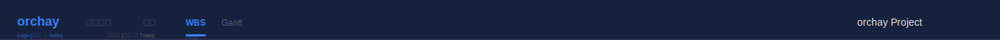
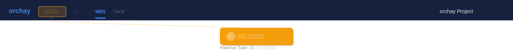
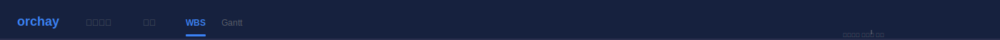

# 화면설계: AppHeader 컴포넌트 구현

## 문서 정보

| 항목 | 내용 |
|------|------|
| Task ID | TSK-01-02-02 |
| Category | development |
| 상태 | [bd] 기본설계 |
| 기본설계 참조 | 010-basic-design.md |
| 작성일 | 2025-12-13 |

---

## 1. 화면 목록

| 화면 ID | 화면명 | 목적 | SVG 파일 |
|---------|--------|------|----------|
| SCR-01 | AppHeader 기본 | 로고, 네비게이션 메뉴, 프로젝트명 표시 | [screen-01-header.svg](./ui-assets/screen-01-header.svg) |
| SCR-02 | AppHeader 토스트 | 비활성 메뉴 클릭 시 "준비 중" 토스트 표시 | [screen-02-header-toast.svg](./ui-assets/screen-02-header-toast.svg) |
| SCR-03 | AppHeader 프로젝트 미선택 | 프로젝트 미선택 상태 표시 | [screen-03-header-no-project.svg](./ui-assets/screen-03-header-no-project.svg) |

---

## 2. 화면 전환 흐름

### 2.1 전체 흐름도

```mermaid
stateDiagram-v2
    [*] --> SCR-01: 프로젝트 선택됨
    [*] --> SCR-03: 프로젝트 미선택
    SCR-01 --> SCR-02: 비활성 메뉴 클릭
    SCR-02 --> SCR-01: 토스트 자동 사라짐 (3초)
    SCR-03 --> SCR-01: 프로젝트 선택
```

### 2.2 액션-화면 매트릭스

| 현재 화면 | 사용자 액션 | 결과 | 조건 |
|----------|------------|------|------|
| SCR-01 | WBS 메뉴 클릭 | /wbs 페이지 이동 | - |
| SCR-01 | 로고 클릭 | /wbs 페이지 이동 | - |
| SCR-01 | 비활성 메뉴 클릭 | SCR-02 (토스트 표시) | 대시보드/칸반/Gantt |
| SCR-02 | 3초 경과 | SCR-01로 복귀 | 자동 |
| SCR-03 | 프로젝트 선택 | SCR-01로 전환 | - |

---

## 3. 화면별 상세 설계

### 3.1 SCR-01: AppHeader 기본

#### 3.1.1 화면 목적

orchay 애플리케이션의 상단 헤더를 표시합니다. 사용자가 앱 브랜드를 인식하고, 주요 기능 간 탐색하며, 현재 작업 중인 프로젝트를 확인할 수 있습니다.

#### 3.1.2 레이아웃 구조

```
┌─────────────────────────────────────────────────────────────────────────────┐
│  [Logo]     [Dashboard] [Kanban] [WBS*] [Gantt]              [Project Name] │
│  orchay      (비활성)    (비활성) (활성)  (비활성)              orchay Project │
│                                                                             │
│  ← 좌측 영역 →  ←────────── 중앙 메뉴 영역 ──────────→  ←── 우측 영역 ──→    │
└─────────────────────────────────────────────────────────────────────────────┘
                                  높이: 56px
```

#### 3.1.3 SVG 참조

- 기본 상태: 

#### 3.1.4 컴포넌트 목록

| 컴포넌트 | 타입 | 위치 | 동작 |
|----------|------|------|------|
| Logo | NuxtLink | 좌측 20px | 클릭 시 /wbs로 이동 |
| NavMenu | nav | 중앙-좌측 | 메뉴 아이템 4개 표시 |
| MenuItem (Dashboard) | button | NavMenu 내 | 비활성, 클릭 시 토스트 |
| MenuItem (Kanban) | button | NavMenu 내 | 비활성, 클릭 시 토스트 |
| MenuItem (WBS) | NuxtLink | NavMenu 내 | 활성, 클릭 시 /wbs |
| MenuItem (Gantt) | button | NavMenu 내 | 비활성, 클릭 시 토스트 |
| ProjectName | span | 우측 20px | 현재 프로젝트명 표시 |

#### 3.1.5 영역별 사양

| 영역 | 크기 | 스타일 | 설명 |
|------|------|--------|------|
| Container | 높이 56px, 너비 100% | `bg-bg-header (#16213e)` | 헤더 전체 영역 |
| Logo | 자동 | `text-xl font-bold text-white` | orchay 로고 텍스트 |
| Logo Icon | 30x30px | `bg-accent (#667eea) rounded` | 아이콘 배경 |
| NavMenu | gap-4 | `flex items-center` | 메뉴 컨테이너 |
| MenuItem (활성) | padding-x 16px | `text-accent bg-accent/20 rounded` | 현재 페이지 |
| MenuItem (비활성) | padding-x 16px | `text-text-muted opacity-50` | 1차 미지원 |
| ProjectName | max-width 200px | `text-sm text-text-secondary truncate` | 말줄임 처리 |

#### 3.1.6 상태별 화면 변화

| 상태 | 표시 내용 | 사용 가능 액션 |
|------|----------|---------------|
| 기본 | 로고, 메뉴 4개, 프로젝트명 | 로고/WBS 클릭, 비활성 메뉴 클릭 |
| 메뉴 호버 | 활성 메뉴: 배경 밝아짐 | - |
| 메뉴 포커스 | outline 표시 | - |

#### 3.1.7 사용자 액션 상세

| 액션 | 트리거 | 결과 | 조건 |
|------|--------|------|------|
| 로고 클릭 | Logo 클릭 | /wbs 페이지 이동 | - |
| WBS 메뉴 클릭 | WBS MenuItem 클릭 | /wbs 페이지 이동 | - |
| 비활성 메뉴 클릭 | Dashboard/Kanban/Gantt 클릭 | 토스트 표시 | - |

---

### 3.2 SCR-02: AppHeader 토스트

#### 3.2.1 화면 목적

비활성화된 메뉴를 클릭했을 때 사용자에게 해당 기능이 아직 준비 중임을 알립니다.

#### 3.2.2 레이아웃 구조

```
┌─────────────────────────────────────────────────────────────────────────────┐
│  [Logo]     [Dashboard] [Kanban] [WBS*] [Gantt]              [Project Name] │
│  orchay      (클릭됨)    (비활성) (활성)  (비활성)              orchay Project │
└─────────────────────────────────────────────────────────────────────────────┘
                                    │
                                    ▼
                    ┌─────────────────────────────────┐
                    │  ⚠️ "준비 중입니다" 토스트 메시지  │
                    └─────────────────────────────────┘
                              (3초 후 자동 사라짐)
```

#### 3.2.3 SVG 참조

- 토스트 상태: 

#### 3.2.4 토스트 컴포넌트 사양

| 속성 | 값 | 설명 |
|------|-----|------|
| 위치 | 화면 상단 중앙, 헤더 아래 16px | fixed positioning |
| 크기 | 자동 (컨텐츠 기반), padding 16px | - |
| 배경색 | `#f59e0b` (warning) | 경고 색상 |
| 텍스트 | "준비 중입니다" | 안내 메시지 |
| 아이콘 | ⚠️ | 경고 아이콘 |
| 지속시간 | 3초 | 자동 사라짐 |

---

### 3.3 SCR-03: AppHeader 프로젝트 미선택

#### 3.3.1 화면 목적

프로젝트가 선택되지 않았을 때 사용자에게 프로젝트 선택이 필요함을 안내합니다.

#### 3.3.2 레이아웃 구조

```
┌─────────────────────────────────────────────────────────────────────────────┐
│  [Logo]     [Dashboard] [Kanban] [WBS*] [Gantt]     [프로젝트를 선택하세요]  │
│  orchay      (비활성)    (비활성) (활성)  (비활성)           (muted 색상)      │
└─────────────────────────────────────────────────────────────────────────────┘
```

#### 3.3.3 SVG 참조

- 미선택 상태: 

#### 3.3.4 프로젝트명 영역 변화

| 상태 | 텍스트 | 스타일 |
|------|--------|--------|
| 프로젝트 있음 | 프로젝트명 | `text-text-secondary` |
| 프로젝트 없음 | "프로젝트를 선택하세요" | `text-text-muted italic` |

---

## 4. 공통 컴포넌트

### 4.1 메뉴 아이템 상태

| 상태 | 스타일 | 동작 |
|------|--------|------|
| 기본 | `text-text-secondary` | hover 효과 |
| 활성 (현재 페이지) | `text-accent bg-accent/20 rounded px-4 py-2` | 클릭 시 현재 페이지 |
| 비활성 (미지원) | `text-text-muted opacity-50 cursor-not-allowed` | 클릭 시 토스트 |
| 호버 (활성만) | `bg-accent/30` | - |
| 포커스 | `outline outline-2 outline-accent` | 키보드 네비게이션 |

### 4.2 토스트 알림

| 타입 | 배경색 | 아이콘 | 사용 시점 |
|------|--------|--------|----------|
| Warning | `#f59e0b` | ⚠️ | 비활성 메뉴 클릭 |

---

## 5. 반응형 설계

### 5.1 Breakpoint 정의

| Breakpoint | 너비 | 레이아웃 변화 |
|------------|------|--------------|
| Desktop | >= 1200px | 전체 레이아웃 |
| Narrow | < 1200px | 헤더 유지, 메뉴 텍스트 축소 가능 |

### 5.2 최소 너비 동작

- 최소 1200px에서 정상 표시
- 그 이하에서는 수평 스크롤 (AppLayout의 경고와 연동)

---

## 6. 접근성 고려사항

| 항목 | 적용 내용 |
|------|----------|
| 키보드 네비게이션 | Tab으로 메뉴 간 이동, Enter로 활성화 |
| ARIA 레이블 | `aria-current="page"` (활성 메뉴), `aria-disabled="true"` (비활성) |
| 스크린 리더 | 비활성 메뉴에 "준비 중" aria-label |
| 색상 대비 | WCAG 2.1 AA 기준 충족 |
| 포커스 표시 | 명확한 outline 스타일 |

---

## 7. SVG 파일 목록

| 파일명 | 화면 | 상태 | 설명 |
|--------|------|------|------|
| screen-01-header.svg | SCR-01 | 기본 | 헤더 기본 상태 |
| screen-02-header-toast.svg | SCR-02 | 토스트 | 비활성 메뉴 클릭 시 |
| screen-03-header-no-project.svg | SCR-03 | 미선택 | 프로젝트 미선택 상태 |

---

## 8. 색상 팔레트

> PRD 10.1 Dark Blue Theme 참조

| 용도 | 색상 코드 | 색상명 |
|------|----------|--------|
| 헤더 배경 | `#16213e` | bg-header |
| 로고/활성 메뉴 | `#667eea` | accent |
| 활성 메뉴 배경 | `rgba(102, 126, 234, 0.2)` | accent/20 |
| 비활성 메뉴 | `#6b7280` | text-muted |
| 일반 텍스트 | `#9ca3af` | text-secondary |
| 프로젝트명 | `#e2e8f0` | text-base |
| 경고 토스트 | `#f59e0b` | warning |

---

## 9. 메뉴 아이템 정의

| ID | 라벨 | 라우트 | 활성화 | 아이콘 (선택) |
|----|------|--------|--------|--------------|
| dashboard | 대시보드 | /dashboard | 2차 | LayoutDashboard |
| kanban | 칸반 | /kanban | 2차 | Kanban |
| wbs | WBS | /wbs | 1차 ✅ | GitBranch |
| gantt | Gantt | /gantt | 2차 | CalendarDays |

---

## 10. 다음 단계

- `/wf:draft TSK-01-02-02` 명령어로 상세설계 진행
- 화면설계 내용을 상세설계 UI/UX 섹션에 반영

---

## 관련 문서

- 기본설계: `010-basic-design.md`
- PRD: `.orchay/projects/orchay/prd.md` (섹션 6.1, 10.1)
- 테마 설정: `tailwind.config.ts`, `app/assets/css/main.css`
- AppLayout: TSK-01-02-01
