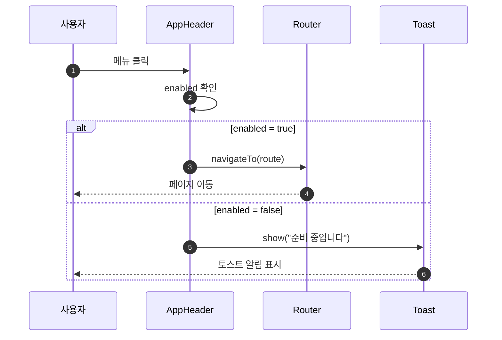
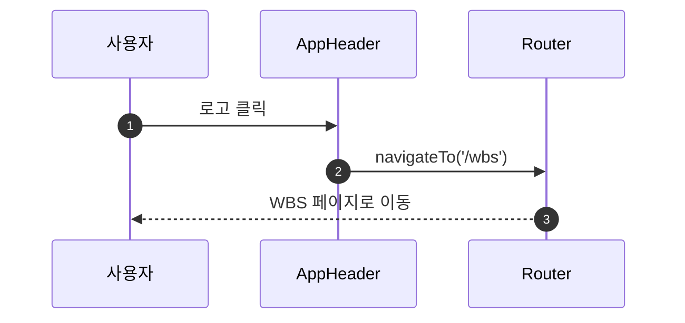

# 상세설계: AppHeader 컴포넌트 구현

**Template Version:** 3.0.0 — **Last Updated:** 2025-12-13

> **설계 규칙**
> * *기능 중심 설계*에 집중한다.
> * 실제 소스코드(전체 또는 일부)는 **절대 포함하지 않는다**.
> * 작성 후 **상위 문서(PRD, TRD, 기본설계)와 비교**하여 차이가 있으면 **즉시 중단 → 차이 설명 → 지시 대기**.
> * **다이어그램 규칙**
>   * 프로세스: **Mermaid**만 사용
>   * UI 레이아웃: **Text Art(ASCII)** → 바로 아래 **SVG 개념도**를 순차 배치
>
> **분할 문서**
> * 요구사항 추적성: `025-traceability-matrix.md`
> * 테스트 명세: `026-test-specification.md`

---

## 0. 문서 메타데이터

| 항목 | 내용 |
|------|------|
| Task ID | TSK-01-02-02 |
| Task명 | AppHeader 컴포넌트 구현 |
| Category | development |
| 상태 | [dd] 상세설계 |
| 작성일 | 2025-12-13 |
| 작성자 | Claude |

### 상위 문서 참조

| 문서 유형 | 경로 | 참조 섹션 |
|----------|------|----------|
| PRD | `.orchay/projects/orchay/prd.md` | 섹션 6.1 (레이아웃 구조) |
| TRD | `.orchay/projects/orchay/trd.md` | 전체 |
| 기본설계 | `010-basic-design.md` | 전체 |
| 상위 Activity | ACT-01-02: App Layout | - |
| 상위 Work Package | WP-01: Platform Infrastructure | - |

### 분할 문서 참조

| 문서 유형 | 파일명 | 목적 |
|----------|--------|------|
| 추적성 매트릭스 | `025-traceability-matrix.md` | 요구사항 ↔ 설계 ↔ 테스트 추적 |
| 테스트 명세 | `026-test-specification.md` | 테스트 시나리오, 데이터, data-testid |

---

## 1. 일관성 검증 결과

> 상위 문서와의 일관성 검증 결과를 기록합니다.

### 1.1 검증 요약

| 구분 | 통과 | 경고 | 실패 |
|------|------|------|------|
| PRD ↔ 기본설계 | 4개 | 0개 | 0개 |
| 기본설계 ↔ 상세설계 | 6개 | 0개 | 0개 |
| TRD ↔ 상세설계 | 5개 | 0개 | 0개 |

### 1.2 검증 상세

| 검증 ID | 검증 항목 | 결과 | 비고 |
|---------|----------|------|------|
| CHK-PRD-01 | 기능 요구사항 완전성 | ✅ PASS | PRD 6.1의 헤더 요소 반영 |
| CHK-PRD-02 | 비즈니스 규칙 일치성 | ✅ PASS | WBS만 활성화, 비활성 메뉴 처리 |
| CHK-PRD-03 | 용어 일관성 | ✅ PASS | 네비게이션, 프로젝트명 용어 일치 |
| CHK-PRD-04 | 범위 일치성 | ✅ PASS | 기본설계 범위 내 설계 |
| CHK-BD-01 | 기능 요구사항 완전성 | ✅ PASS | 3개 기능 요구사항 모두 설계 |
| CHK-BD-02 | 비즈니스 규칙 구현 명세 | ✅ PASS | BR-001~004 구현 방안 명시 |
| CHK-BD-03 | 데이터 모델 일치성 | ✅ PASS | MenuItem 구조 동일 |
| CHK-BD-04 | 인터페이스 일치성 | ✅ PASS | Props, Events 동일 |
| CHK-BD-05 | 화면 일치성 | ✅ PASS | 헤더 구조 동일 |
| CHK-BD-06 | 수용 기준 구현 가능성 | ✅ PASS | 모든 수용 기준 테스트 가능 |
| CHK-TRD-01 | 기술 스택 준수 | ✅ PASS | Vue 3 + Nuxt 3, PrimeVue 사용 |
| CHK-TRD-02 | 아키텍처 패턴 준수 | ✅ PASS | components/layout/ 폴더 구조 |
| CHK-TRD-03 | API 설계 규칙 준수 | ✅ PASS | N/A (API 없음) |
| CHK-TRD-04 | DB 스키마 규칙 준수 | ✅ PASS | N/A (DB 없음) |
| CHK-TRD-05 | 에러 핸들링 표준 준수 | ✅ PASS | 토스트 알림 사용 |

---

## 2. 목적 및 범위

### 2.1 목적

orchay 애플리케이션의 상단 헤더 영역을 담당하는 AppHeader 컴포넌트를 구현합니다. 로고, 네비게이션 메뉴, 현재 프로젝트명을 표시하여 사용자가 앱 내에서 쉽게 탐색할 수 있도록 합니다.

### 2.2 범위

**포함 범위** (기본설계 구현 범위의 기술적 구현 사항):
- orchay 로고 표시 및 클릭 시 WBS 페이지 이동
- 네비게이션 메뉴 (대시보드, 칸반, WBS, Gantt) 표시
- 1차 범위에서 WBS만 활성화, 나머지 비활성 처리
- 현재 프로젝트명 표시

**제외 범위** (다른 Task에서 구현):
- 대시보드 페이지 → 2차 개발
- 칸반 보드 페이지 → 2차 개발
- Gantt 차트 페이지 → 2차 개발
- 프로젝트 선택 드롭다운 → 2차 개발

---

## 3. 기술 스택

> TRD 기준, 이 Task에서 사용하는 기술만 명시

| 구분 | 기술 | 버전 | 용도 |
|------|------|------|------|
| Frontend | Vue 3 + Nuxt 3 | 3.5.x / 3.18.x | UI 렌더링 |
| UI Framework | PrimeVue | 4.x | Button, Toast 등 컴포넌트 |
| Styling | TailwindCSS | 3.4.x | 유틸리티 CSS |
| State | Pinia | 2.x | 프로젝트 상태 관리 |
| Routing | Nuxt Router | - | 페이지 네비게이션 |
| Testing | Vitest + Playwright | 2.x / 1.49.x | 테스트 |

---

## 4. 용어/가정/제약

### 4.1 용어 정의

| 용어 | 정의 |
|------|------|
| AppHeader | 앱 상단 헤더 컴포넌트 |
| 네비게이션 메뉴 | 주요 기능 페이지 간 이동 메뉴 |
| 활성 메뉴 | 1차 범위에서 사용 가능한 메뉴 (WBS) |
| 비활성 메뉴 | 1차 범위에서 미지원 메뉴 (대시보드, 칸반, Gantt) |

### 4.2 가정 (Assumptions)

- 1차 범위에서는 WBS 메뉴만 활성화
- 프로젝트명은 Pinia store에서 가져옴
- 토스트 알림은 PrimeVue Toast 사용

### 4.3 제약 (Constraints)

- TRD에 따라 PrimeVue 컴포넌트 우선 사용
- 비활성 메뉴 클릭 시 "준비 중" 안내 표시
- 로고 클릭 시 /wbs로 이동

---

## 5. 시스템/모듈 구조

> **규칙**: 구현 코드가 아닌 **구조/역할/책임**만 표현

### 5.1 모듈 역할 및 책임

| 모듈 | 역할 | 책임 |
|------|------|------|
| AppHeader.vue | 헤더 컴포넌트 | 로고, 네비게이션, 프로젝트명 표시 |
| stores/project.ts | 프로젝트 스토어 | 현재 프로젝트 정보 관리 |

### 5.2 모듈 구조도 (개념)

```
app/
├── components/
│   └── layout/
│       └── AppHeader.vue    # 헤더 컴포넌트
├── stores/
│   └── project.ts           # 프로젝트 스토어 (참조)
└── pages/
    └── wbs.vue              # AppLayout > AppHeader 사용
```

### 5.3 외부 의존성

| 의존성 | 유형 | 용도 |
|--------|------|------|
| PrimeVue Button | Library | 메뉴 버튼 |
| PrimeVue Toast | Library | 알림 메시지 |
| Nuxt Router | Library | 페이지 네비게이션 |
| Pinia | Library | 상태 관리 |

---

## 6. 데이터 모델 (개념 수준)

> **규칙**: 코드가 아닌 **개념 수준 정의**만 기술
>
> 이 Task는 UI 컴포넌트로 데이터베이스 엔티티가 없음

### 6.1 MenuItem 구조 정의

| 필드명 | 타입 | 필수 | 설명 | 예시 |
|--------|------|------|------|------|
| id | string | Y | 메뉴 고유 식별자 | 'wbs' |
| label | string | Y | 메뉴 표시명 | 'WBS' |
| icon | string | Y | 아이콘 식별자 | 'pi-sitemap' |
| route | string | Y | 이동할 라우트 | '/wbs' |
| enabled | boolean | Y | 활성화 여부 | true |

### 6.2 기본 메뉴 목록

| id | label | icon | route | enabled (1차) |
|----|-------|------|-------|---------------|
| dashboard | 대시보드 | pi-home | /dashboard | false |
| kanban | 칸반 | pi-th-large | /kanban | false |
| wbs | WBS | pi-sitemap | /wbs | true |
| gantt | Gantt | pi-chart-line | /gantt | false |

> **확장성 고려**: 2차 개발 시 메뉴 항목 추가/활성화가 예상되므로, 메뉴 구성을 composable (`useNavMenu`)로 분리하여 구현 권장

---

## 7. 인터페이스 계약 (Component Contract)

> **규칙**: 코드가 아닌 **표 형태의 계약 정의**

### 7.1 Props 정의

| Prop명 | 타입 | 필수 | 설명 | 기본값 |
|--------|------|------|------|--------|
| projectName | string | N | 현재 프로젝트명 | '' |

### 7.2 Emits 정의

| Event명 | Payload | 설명 |
|---------|---------|------|
| navigate | `{ route: string }` | 메뉴 클릭 시 라우트 변경 |

### 7.3 외부 상태 의존성

| Store | 상태 | 용도 |
|-------|------|------|
| projectStore | currentProject.name | 프로젝트명 표시 |

---

## 8. 프로세스 흐름

### 8.1 프로세스 설명

> 각 단계에 관련 요구사항 태그 `[FR-XXX]` 병기

1. **렌더링** [FR-001, FR-002, FR-003]: AppHeader 컴포넌트가 마운트됨
2. **로고 표시** [FR-001]: orchay 로고 렌더링
3. **메뉴 렌더링** [FR-002]: 4개 메뉴 아이템 렌더링 (활성/비활성 구분)
4. **프로젝트명 표시** [FR-003]: 현재 프로젝트명 렌더링
5. **현재 페이지 강조** [BR-003]: 현재 라우트에 해당하는 메뉴 강조

### 8.2 메뉴 클릭 흐름



### 8.3 로고 클릭 흐름



---

## 9. UI 설계

> **규칙**: Text Art(ASCII)로 영역 구성

### 9.1 화면 목록

| 화면 | 경로 | 목적 | 주요 기능 |
|------|------|------|----------|
| AppHeader | 모든 페이지 (헤더 영역) | 앱 네비게이션 | 로고, 메뉴, 프로젝트명 |

### 9.2 헤더 레이아웃

```
┌─────────────────────────────────────────────────────────────────────────────┐
│                              AppHeader (56px)                                │
│                                                                              │
│  ┌────────────┐  ┌─────────────────────────────────────┐  ┌───────────────┐ │
│  │            │  │                                     │  │               │ │
│  │   ORCHAY   │  │  [대시보드] [칸반] [WBS] [Gantt]    │  │  ProjectName  │ │
│  │   (Logo)   │  │  (비활성)  (비활성)(활성)(비활성)   │  │               │ │
│  │            │  │                                     │  │               │ │
│  └────────────┘  └─────────────────────────────────────┘  └───────────────┘ │
│                                                                              │
│    좌측 영역         중앙-좌측 영역 (네비게이션)              우측 영역       │
└─────────────────────────────────────────────────────────────────────────────┘
```

### 9.3 컴포넌트 구조 (개념)

| 컴포넌트 | 역할 | 상태 | PrimeVue 컴포넌트 |
|----------|------|------|------------------|
| Logo | 브랜드 표시 | - | 텍스트 ("orchay", Primary 색상) |
| NavMenu | 네비게이션 | currentRoute, menuItems | Button |
| ProjectName | 프로젝트명 표시 | projectName | - |

> **로고 구현 가이드**: 텍스트 로고 "orchay" 사용 (Primary 색상 #3b82f6, font-weight: bold)

### 9.4 영역별 스타일 사양

| 영역 | 스타일 | TailwindCSS/PrimeVue |
|------|--------|---------------------|
| Container | h-56px, flex, items-center, justify-between | h-[56px] flex items-center justify-between px-4 |
| Logo | text-xl, font-bold, Primary 색상 | text-xl font-bold text-primary cursor-pointer |
| NavMenu Container | flex, gap-4 | flex gap-4 |
| NavMenu Item (기본) | text-secondary, hover 효과 | text-text-secondary hover:text-text |
| NavMenu Item (활성) | Primary 색상, font-medium | text-primary font-medium |
| NavMenu Item (비활성) | muted, cursor-not-allowed | text-text-muted cursor-not-allowed opacity-50 |
| ProjectName | text-sm, text-secondary | text-sm text-text-secondary |

### 9.5 반응형/접근성 가이드

* **반응형**:
  * `≥ 1200px`: 전체 레이아웃 표시
  * 헤더는 고정 높이 유지

* **접근성**:
  * 키보드 네비게이션 지원 (Tab, Enter)
  * ARIA 라벨 적용 (nav role)
  * 현재 페이지 표시 (aria-current)

#### ARIA 속성 매핑

| 요소 | HTML 태그 | ARIA 속성 | 비고 |
|------|----------|----------|------|
| 네비게이션 컨테이너 | nav | role="navigation", aria-label="메인 네비게이션" | 랜드마크 |
| 활성 메뉴 | button | aria-current="page" | 현재 페이지 |
| 비활성 메뉴 | button | aria-disabled="true" | 클릭 불가 |
| 로고 | a | aria-label="홈으로 이동" | WBS 페이지 링크 |

---

## 10. 비즈니스 규칙 구현 명세

> 기본설계 BR-XXX 규칙의 구현 방안

| 규칙 ID | 규칙 설명 | 구현 위치(개념) | 구현 방식(개념) | 검증 방법 |
|---------|----------|-----------------|-----------------|-----------|
| BR-001 | WBS 메뉴만 1차에서 활성화 | AppHeader | menuItems 배열의 enabled 필드 | E2E 테스트 |
| BR-002 | 비활성 메뉴 클릭 시 "준비 중" 안내 | AppHeader | Toast 표시, 라우팅 차단 | E2E 테스트 |
| BR-003 | 현재 페이지 메뉴는 Primary 색상으로 강조 | AppHeader | useRoute() 비교, 조건부 스타일 | E2E 테스트 |
| BR-004 | 로고 클릭 시 /wbs로 이동 | AppHeader | navigateTo('/wbs') | E2E 테스트 |

---

## 11. 오류/예외 처리

### 11.1 예상 오류 상황

| 오류 상황 | 오류 코드 | 사용자 메시지 | 복구 전략 |
|----------|----------|--------------|----------|
| 비활성 메뉴 클릭 | - | 준비 중입니다 | Toast 알림 표시 |
| 프로젝트명 없음 | - | - | 기본 텍스트 표시 "프로젝트를 선택하세요" |

### 11.2 경계 조건

| 조건 | 처리 방안 |
|------|----------|
| 프로젝트명이 긴 경우 | 말줄임 처리 (text-ellipsis) |
| 라우트 정보 없음 | 메뉴 강조 없음 (기본 상태) |

---

## 12. 구현 체크리스트

### Frontend

- [ ] AppHeader.vue 컴포넌트 생성
- [ ] 로고 영역 (클릭 시 /wbs 이동)
- [ ] 네비게이션 메뉴 (4개 아이템)
- [ ] 활성 메뉴 스타일 (WBS만)
- [ ] 비활성 메뉴 스타일 (나머지 3개)
- [ ] 비활성 메뉴 클릭 시 Toast 표시
- [ ] 현재 페이지 메뉴 강조 (useRoute)
- [ ] 프로젝트명 표시 (projectStore 연동)
- [ ] 프로젝트명 없을 시 기본 텍스트
- [ ] Dark Blue 테마 색상 적용
- [ ] PrimeVue Button 사용 (메뉴)
- [ ] PrimeVue Toast 사용 (알림)

### 품질

- [ ] 요구사항 추적성 검증 완료 (`025-traceability-matrix.md`)
- [ ] 테스트 명세 작성 완료 (`026-test-specification.md`)
- [ ] 비즈니스 규칙 구현 완료
- [ ] 일관성 검증 통과

---

## 13. 다음 단계

- `/wf:review` 명령어로 설계리뷰 진행
- `/wf:build TSK-01-02-02` 명령어로 구현 진행

---

## 관련 문서

- 기본설계: `010-basic-design.md`
- 추적성 매트릭스: `025-traceability-matrix.md`
- 테스트 명세: `026-test-specification.md`
- PRD: `.orchay/projects/orchay/prd.md`
- TRD: `.orchay/projects/orchay/trd.md`
- AppLayout: TSK-01-02-01
