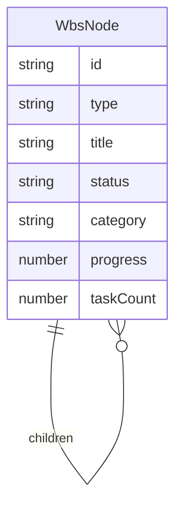

# 기본설계: wbs.md 파서 구현

## 문서 정보
| 항목 | 내용 |
|------|------|
| Task ID | TSK-02-02-01 |
| Category | development |
| 상태 | [bd] 기본설계 |
| 상위 Activity | ACT-02-02 (WBS Parser) |
| 상위 Work Package | WP-02 (Data Storage Layer) |
| PRD 참조 | PRD 7.2, 7.3 |
| 작성일 | 2025-12-13 |

---

## 1. 개요

### 1.1 목적
wbs.md 마크다운 파일을 파싱하여 WbsNode[] 트리 구조로 변환하는 파서를 구현합니다. 이 파서는 orchay의 핵심 데이터 소스인 wbs.md 파일을 읽어 프론트엔드와 API에서 사용할 수 있는 구조화된 데이터로 변환하는 역할을 합니다.

### 1.2 구현 범위
> WBS Task 설명에서 추출

- Markdown → WbsNode[] 트리 변환
- WP/ACT/TSK 계층 파싱 (## / ### / ####)
- 속성 파싱 (category, status, priority, assignee 등)
- 4단계/3단계 구조 모두 지원

### 1.3 제외 범위
> 동일 PRD 섹션이지만 다른 Task에서 구현

- WbsNode[] → Markdown 변환 → TSK-02-02-02
- 유효성 검증 → TSK-02-02-03

---

## 2. 사용자 시나리오

### 2.1 주요 사용자
- **프론트엔드 컴포넌트**: WBS 트리 데이터를 렌더링하기 위해 파싱된 데이터 사용
- **Server API**: wbs.md 파일을 읽어 JSON 응답으로 반환
- **LLM CLI**: wbs.md 파일 수정 후 변경 내용 확인

### 2.2 사용 시나리오
> 사용자 관점에서 기능 사용 흐름

**시나리오 1: WBS 트리 페이지 로드**
1. 사용자가 WBS 페이지에 접속
2. API가 wbs.md 파일을 읽어 파서에 전달
3. 파서가 Markdown을 WbsNode[] 트리로 변환
4. 프론트엔드가 트리 데이터를 렌더링

**시나리오 2: Task 상세 조회**
1. 사용자가 특정 Task 선택
2. 파서가 해당 Task의 속성 정보를 추출
3. 상세 패널에 Task 정보 표시

---

## 3. 기능 요구사항
> PRD 7.2, 7.3에서 범위 내 항목만 추출

### 3.1 Markdown 헤더 파싱
**설명**: wbs.md의 마크다운 헤더를 계층 구조로 파싱
**입력**: wbs.md 파일 내용 (문자열)
**출력**: 계층별 노드 목록
**제약조건**:
- `## WP-XX:` → Work Package (Level 2)
- `### ACT-XX-XX:` → Activity (Level 3, 4단계 구조)
- `### TSK-XX-XX:` → Task (Level 3, 3단계 구조)
- `#### TSK-XX-XX-XX:` → Task (Level 4, 4단계 구조)

### 3.2 속성 파싱
**설명**: 각 노드의 속성(메타데이터) 파싱
**입력**: 헤더 아래의 속성 라인들
**출력**: 속성 객체
**파싱 대상 속성**:
| 속성 | 형식 | 예시 |
|------|------|------|
| category | `- category: {value}` | `- category: development` |
| status | `- status: {text} [{code}]` | `- status: todo [ ]` |
| priority | `- priority: {value}` | `- priority: high` |
| assignee | `- assignee: {value}` | `- assignee: hong` |
| schedule | `- schedule: {start} ~ {end}` | `- schedule: 2025-12-18 ~ 2025-12-20` |
| tags | `- tags: {tag1}, {tag2}` | `- tags: parser, markdown` |
| depends | `- depends: {taskId}` | `- depends: TSK-02-01-02` |
| requirements | `- requirements:` + 하위 목록 | 여러 줄 |
| ref | `- ref: {reference}` | `- ref: PRD 7.2` |

### 3.3 계층 구조 빌드
**설명**: 파싱된 노드들을 부모-자식 관계의 트리로 구성
**입력**: 플랫 노드 목록
**출력**: WbsNode[] (트리 구조)
**규칙**:
- WP 노드는 Project의 자식
- ACT 노드는 WP의 자식 (4단계)
- TSK 노드는 ACT의 자식 (4단계) 또는 WP의 자식 (3단계)

### 3.4 진행률 계산
**설명**: 하위 Task 상태 기반 진행률 자동 계산
**입력**: 노드와 그 하위 Task들
**출력**: 진행률 (0-100)
**계산 규칙**:
- `[xx]` 완료 Task 수 / 전체 Task 수 × 100

---

## 4. 비즈니스 규칙
> PRD에서 추출한 범위 내 규칙만

| 규칙 ID | 규칙 설명 | 적용 시점 |
|---------|----------|----------|
| BR-001 | 헤더 레벨로 계층 결정 (## = WP, ### = ACT/TSK, #### = TSK) | 헤더 파싱 시 |
| BR-002 | ID 패턴으로 노드 타입 식별 (WP-XX, ACT-XX-XX, TSK-XX-XX-XX) | ID 추출 시 |
| BR-003 | 3단계 구조: WP 아래 직접 TSK (`### TSK-XX-XX:`) | 계층 빌드 시 |
| BR-004 | 4단계 구조: WP → ACT → TSK | 계층 빌드 시 |
| BR-005 | 상태 코드는 `[xx]` 형식으로 추출 | 상태 파싱 시 |

---

## 5. 데이터 요구사항 (개념)
> 비즈니스 관점의 데이터 정의

### 5.1 주요 데이터

| 데이터 | 설명 | 비즈니스 의미 |
|--------|------|--------------|
| WbsNode | 트리 노드 구조체 | WBS 계층의 각 항목 표현 |
| NodeType | 노드 타입 열거형 | 계층 구분 (project/wp/act/task) |
| TaskStatus | 상태 코드 | 워크플로우 진행 상태 |

### 5.2 데이터 관계

---

## 6. 화면 요구사항 (개념)
> 이 Task는 Backend 서비스이므로 화면 없음

해당 없음 - 순수 파싱 로직 구현

---

## 7. 인터페이스 요구사항 (개념)
> 비즈니스 관점의 API 정의

| 기능 | 설명 | 입력 | 출력 |
|------|------|------|------|
| parseWbsMarkdown | wbs.md 전체 파싱 | Markdown 문자열 | WbsNode[] |
| parseNodeHeader | 헤더 라인 파싱 | 헤더 문자열 | { id, type, title } |
| parseNodeAttributes | 속성 블록 파싱 | 속성 라인 배열 | 속성 객체 |
| buildTree | 플랫 노드 → 트리 | 노드 배열 | WbsNode[] |
| calculateProgress | 진행률 계산 | WbsNode | number |

---

## 8. 수용 기준
> 비즈니스 관점의 완료 조건

- [ ] wbs.md 파일을 읽어 WbsNode[] 트리로 변환 가능
- [ ] 4단계 구조 (WP → ACT → TSK) 정상 파싱
- [ ] 3단계 구조 (WP → TSK) 정상 파싱
- [ ] 모든 속성 (category, status, priority 등) 정상 추출
- [ ] 진행률 자동 계산
- [ ] 잘못된 형식의 라인은 무시하고 계속 파싱

---

## 9. 다음 단계
- `/wf:draft` 명령어로 상세설계 진행

---

## 관련 문서
- 프로젝트 정보: `.orchay/projects/orchay/project.json`
- PRD: `.orchay/projects/orchay/prd.md`
- TRD: `.orchay/projects/orchay/trd.md`
