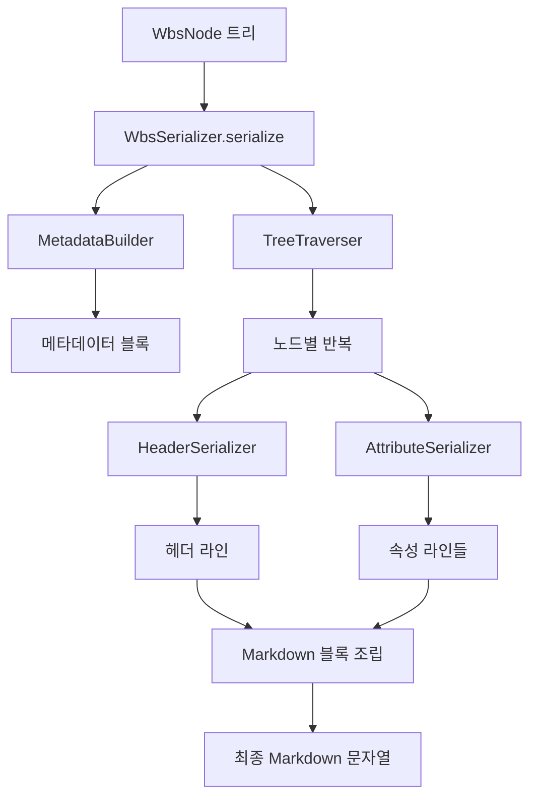

# 상세설계: wbs.md 시리얼라이저 구현

## 문서 정보
| 항목 | 내용 |
|------|------|
| Task ID | TSK-02-02-02 |
| Category | development |
| 상태 | [dd] 상세설계 |
| 상위 Activity | ACT-02-02 (WBS Parser) |
| 상위 Work Package | WP-02 (Data Storage Layer) |
| PRD 참조 | PRD 7.2, 7.3, 7.4 |
| 작성일 | 2025-12-13 |
| 기본설계 참조 | 010-basic-design.md |

---

## 1. 개요

### 1.1 목적
WbsNode[] 트리 구조를 wbs.md 마크다운 형식으로 변환하는 시리얼라이저의 상세 구현 사양을 정의합니다. 이 문서는 개발자가 직접 구현할 수 있도록 알고리즘, 데이터 구조, 인터페이스, 예외 처리를 상세히 기술합니다.

### 1.2 기본설계 요약
- **핵심 기능**: WbsNode[] → Markdown 문자열 변환
- **주요 요구사항**: 속성 포맷팅, 계층별 헤더 생성, 트리 순회
- **비즈니스 규칙**: 3/4단계 구조 지원, 상태 형식 유지, 빈 값 처리

### 1.3 설계 원칙
- **Round-trip 보장**: 시리얼라이저 출력을 파서(TSK-02-02-01)로 읽었을 때 동일한 데이터 복원
- **가독성 우선**: 사람이 직접 수정 가능한 마크다운 형식 생성
- **내결함성**: 누락된 속성이나 잘못된 값에 대한 안전한 처리

---

## 2. 시스템 아키텍처

### 2.1 컴포넌트 구조

| 컴포넌트 | 책임 | 의존성 |
|----------|------|--------|
| WbsSerializer | 전체 직렬화 오케스트레이션 | HeaderSerializer, AttributeSerializer, TreeTraverser |
| HeaderSerializer | 마크다운 헤더 생성 | 없음 |
| AttributeSerializer | 속성 포맷팅 | 없음 |
| TreeTraverser | 트리 깊이 우선 순회 | WbsNode 타입 |
| MetadataBuilder | 문서 메타데이터 생성 | WbsNode 타입 |

### 2.2 데이터 흐름



### 2.3 처리 순서

1. **메타데이터 생성**: 버전, 깊이, 업데이트 일시
2. **트리 순회 시작**: 루트 노드부터 깊이 우선
3. **노드별 처리**:
   - 헤더 생성 (타입에 따라 `##`, `###`, `####`)
   - 속성 포맷팅 (필수 속성 먼저, 선택 속성은 값이 있을 때만)
   - 자식 노드 재귀 처리
4. **구분선 삽입**: WP 사이에 `---` 추가
5. **최종 조립**: 모든 블록 결합

---

## 3. 데이터 구조 설계

### 3.1 입력 데이터 구조

| 인터페이스 | 속성명 | 타입 | 필수 | 설명 |
|-----------|--------|------|------|------|
| WbsNode | id | string | O | 노드 고유 ID |
| | type | NodeType | O | 'project', 'wp', 'act', 'task' |
| | title | string | O | 노드 제목 |
| | status | string | - | 상태 코드 (예: "[ ]", "[bd]") |
| | category | string | - | 'development', 'defect', 'infrastructure' |
| | priority | string | - | 'critical', 'high', 'medium', 'low' |
| | assignee | string | - | 담당자 ID 또는 "-" |
| | schedule | ScheduleRange | - | 시작일 ~ 종료일 |
| | tags | string[] | - | 태그 배열 |
| | depends | string | - | 선행 Task ID |
| | requirements | string[] | - | 요구사항 목록 |
| | ref | string | - | 참조 문서 |
| | progress | number | - | 진행률 (0-100) |
| | children | WbsNode[] | - | 하위 노드 배열 |

| 인터페이스 | 속성명 | 타입 | 설명 |
|-----------|--------|------|------|
| ScheduleRange | start | string | 시작일 (YYYY-MM-DD) |
| | end | string | 종료일 (YYYY-MM-DD) |

| 인터페이스 | 속성명 | 타입 | 설명 |
|-----------|--------|------|------|
| WbsMetadata | version | string | 문서 버전 |
| | depth | number | WBS 깊이 (3 또는 4) |
| | updated | string | 업데이트 일시 (YYYY-MM-DD) |
| | start | string | 프로젝트 시작일 |

### 3.2 출력 데이터 구조

| 타입 | 설명 | 예시 |
|------|------|------|
| string | 완전한 Markdown 문자열 | 전체 wbs.md 내용 |

### 3.3 내부 데이터 구조

| 인터페이스 | 속성명 | 타입 | 설명 |
|-----------|--------|------|------|
| SerializerContext | currentDepth | number | 현재 트리 깊이 |
| | wpCount | number | 처리된 WP 수 (구분선 삽입 판단) |
| | maxDepth | number | 전체 트리의 최대 깊이 |

---

## 4. 인터페이스 설계

### 4.1 공개 인터페이스

| 메서드명 | serializeWbs |
|----------|--------------|
| 설명 | WBS 트리 전체를 Markdown으로 변환 |
| 입력 파라미터 | nodes: WbsNode[], metadata: WbsMetadata |
| 반환 타입 | string |
| 예외 | SerializationError (변환 실패 시) |
| 부작용 | 없음 (순수 함수) |

### 4.2 내부 인터페이스

| 메서드명 | serializeHeader |
|----------|----------------|
| 설명 | 노드 타입에 따른 마크다운 헤더 생성 |
| 입력 파라미터 | node: WbsNode, context: SerializerContext |
| 반환 타입 | string |
| 예외 | 없음 (기본값 반환) |
| 부작용 | 없음 |

| 메서드명 | serializeAttributes |
|----------|-------------------|
| 설명 | 노드 속성을 마크다운 목록으로 포맷팅 |
| 입력 파라미터 | node: WbsNode |
| 반환 타입 | string[] |
| 예외 | 없음 (빈 값은 무시) |
| 부작용 | 없음 |

| 메서드명 | serializeNode |
|----------|---------------|
| 설명 | 단일 노드와 그 하위 노드를 재귀적으로 직렬화 |
| 입력 파라미터 | node: WbsNode, context: SerializerContext |
| 반환 타입 | string |
| 예외 | SerializationError (재귀 깊이 초과) |
| 부작용 | context.currentDepth 수정 |

| 메서드명 | buildMetadataBlock |
|----------|-------------------|
| 설명 | wbs.md 상단 메타데이터 블록 생성 |
| 입력 파라미터 | metadata: WbsMetadata |
| 반환 타입 | string |
| 예외 | 없음 |
| 부작용 | 없음 |

| 메서드명 | calculateMaxDepth |
|----------|------------------|
| 설명 | 트리의 최대 깊이 계산 (3단계 vs 4단계 판단) |
| 입력 파라미터 | nodes: WbsNode[] |
| 반환 타입 | number |
| 예외 | 없음 |
| 부작용 | 없음 |

---

## 5. 알고리즘 설계

### 5.1 헤더 생성 알고리즘

**입력**: node (WbsNode), context (SerializerContext)
**출력**: 헤더 문자열 (예: `## WP-02: Data Storage Layer`)

**단계**:
1. node.type 확인
2. type이 'wp'인 경우 → `## {id}: {title}` 반환
3. type이 'act'인 경우 → `### {id}: {title}` 반환
4. type이 'task'인 경우:
   - context.maxDepth가 4 → `#### {id}: {title}` 반환
   - context.maxDepth가 3 → `### {id}: {title}` 반환
5. type이 'project'인 경우 → `# WBS - {title}` 반환

**제약조건**:
- id는 항상 존재해야 함 (없으면 "UNKNOWN" 사용)
- title이 빈 문자열이면 "Untitled" 사용

### 5.2 속성 포맷팅 알고리즘

**입력**: node (WbsNode)
**출력**: 속성 라인 배열 (예: `["- category: development", "- status: todo [ ]"]`)

**단계**:
1. 빈 배열 lines 초기화
2. 다음 속성들을 순서대로 처리:
   - **category**: 값이 있으면 `- category: {value}` 추가
   - **status**: 값이 있으면 `- status: {value}` 추가
   - **priority**: 값이 있으면 `- priority: {value}` 추가
   - **assignee**: 값이 있으면 `- assignee: {value}` 추가, 없으면 건너뛰기
   - **schedule**: start와 end가 모두 있으면 `- schedule: {start} ~ {end}` 추가
   - **tags**: 배열이 비어있지 않으면 `- tags: {tag1}, {tag2}, ...` 추가
   - **depends**: 값이 있으면 `- depends: {value}` 추가
   - **requirements**: 배열이 비어있지 않으면:
     - `- requirements:` 추가
     - 각 요구사항에 대해 `  - {requirement}` 추가 (2칸 들여쓰기)
   - **ref**: 값이 있으면 `- ref: {value}` 추가
   - **progress**: WP나 ACT 타입이고 값이 있으면 `- progress: {value}` 추가 (숫자만, % 없음)
3. lines 배열 반환

**제약조건**:
- 빈 문자열, null, undefined, 빈 배열은 출력하지 않음
- status는 상태 텍스트와 코드가 모두 포함된 형식 유지
- schedule은 start와 end 둘 다 있어야만 출력

### 5.3 트리 순회 알고리즘

**입력**: nodes (WbsNode[]), context (SerializerContext)
**출력**: Markdown 블록 문자열

**단계**:
1. 빈 문자열 output 초기화
2. nodes 배열 순회 (각 node에 대해):
   - node.type이 'wp'이고 context.wpCount > 0이면 `---\n\n` 구분선 추가
   - serializeHeader(node, context) 호출하여 헤더 추가
   - serializeAttributes(node) 호출하여 속성 라인들 추가
   - 헤더와 속성 사이 빈 줄 없음
   - node.type이 'wp'이면 context.wpCount 증가
   - node.children이 있으면:
     - context.currentDepth 증가
     - 재귀적으로 serializeNode(child, context) 호출
     - context.currentDepth 감소
   - 노드 사이에 빈 줄 추가 (`\n`)
3. output 문자열 반환

**제약조건**:
- 재귀 깊이는 10을 초과할 수 없음 (무한 루프 방지)
- children이 undefined나 빈 배열이면 재귀 호출 생략
- 순환 참조 검출: visited Set에 현재 노드 ID 추가, 이미 존재하면 SerializationError 발생

**순환 참조 검출 알고리즘**:
```
visitedSet = new Set<string>()

함수 serializeNodeWithCheck(node, context, visitedSet):
    if visitedSet.has(node.id):
        throw SerializationError("Circular reference detected: " + node.id)

    visitedSet.add(node.id)
    result = serializeNode(node, context)
    visitedSet.delete(node.id)  // 백트래킹 시 제거
    return result
```

### 5.4 메타데이터 생성 알고리즘

**입력**: metadata (WbsMetadata), options?: SerializerOptions
**출력**: 메타데이터 블록 문자열

**SerializerOptions**:
| 옵션 | 타입 | 기본값 | 설명 |
|------|------|--------|------|
| updateDate | boolean | true | updated 필드를 현재 날짜로 갱신할지 여부 |

**단계**:
1. 다음 형식으로 문자열 구성:
   ```
   > version: {metadata.version}
   > depth: {metadata.depth}
   > updated: {metadata.updated}
   > start: {metadata.start}
   ```
2. 각 필드가 없으면 기본값 사용:
   - version: "1.0"
   - depth: 4
   - updated: options.updateDate가 true이면 현재 날짜 (YYYY-MM-DD), false이면 기존 값 유지
   - start: metadata.start 또는 metadata.updated
3. 문자열 반환

**주의**: `updateDate: false` 옵션 사용 시 내용 변경 없이 저장해도 Git Diff 노이즈가 발생하지 않음

### 5.5 최대 깊이 계산 알고리즘

**입력**: nodes (WbsNode[])
**출력**: maxDepth (number)

**단계**:
1. nodes 배열 순회
2. 각 노드에 대해:
   - 노드 타입이 'act'이면 즉시 4 반환 (4단계 구조)
   - 노드 타입이 'task'이고 ID 패턴이 `TSK-XX-XX-XX`이면 4 반환
   - children이 있으면 재귀적으로 확인
3. 'act' 노드나 4단계 Task를 찾지 못하면 3 반환

---

## 6. 비즈니스 규칙 구현

### 6.1 규칙 매핑

| 규칙 ID | 규칙 설명 | 구현 위치 | 구현 방법 |
|---------|----------|----------|----------|
| BR-001 | 노드 타입에 따라 헤더 레벨 결정 | serializeHeader | type에 따라 분기: wp → ##, act → ###, task → ####/### |
| BR-002 | 3/4단계 구조에 따라 TSK 헤더 조정 | serializeHeader | maxDepth 확인하여 task 헤더 레벨 결정 |
| BR-003 | 상태는 `{text} [{code}]` 형식 유지 | serializeAttributes | status 값을 그대로 출력 (파서가 생성한 형식 보존) |
| BR-004 | 빈 값 속성은 출력하지 않음 | serializeAttributes | 각 속성 출력 전 존재 여부 검사 |
| BR-005 | 노드 순서 유지 | serializeNode | children 배열 순회 순서대로 출력 |

### 6.2 규칙 검증 로직

| 규칙 ID | 검증 시점 | 검증 방법 | 실패 처리 |
|---------|----------|----------|----------|
| BR-001 | 헤더 생성 시 | type 값이 유효한 NodeType인지 확인 | 기본값 "##" 사용 |
| BR-002 | 헤더 생성 시 | maxDepth가 3 또는 4인지 확인 | 4로 간주 |
| BR-003 | 상태 포맷팅 시 | status 문자열에 "[" 포함 여부 확인 | 있는 그대로 출력 |
| BR-004 | 속성 포맷팅 시 | 값이 truthy인지 확인 | 라인 추가 안 함 |
| BR-005 | 트리 순회 시 | children 배열 존재 확인 | 순서대로 순회 |

---

## 7. 예외 처리

### 7.1 예외 시나리오

| 시나리오 | 발생 조건 | 예외 타입 | 메시지 | 처리 방법 |
|----------|----------|-----------|--------|----------|
| 입력 데이터 null | nodes가 null/undefined | SerializationError | "Input nodes cannot be null" | 빈 문자열 반환 |
| 재귀 깊이 초과 | currentDepth > 10 | SerializationError | "Maximum recursion depth exceeded" | 예외 던지기 |
| 잘못된 노드 타입 | node.type이 유효하지 않음 | 없음 (경고만) | console.warn 출력 | 기본 헤더 레벨 사용 |
| 순환 참조 | node.children에 부모 포함 | SerializationError | "Circular reference detected: {nodeId}" | 예외 던지기 (visited Set 사용) |

### 7.2 에러 복구 전략

| 에러 유형 | 복구 전략 | 대체 값 |
|----------|----------|---------|
| 누락된 id | 경고 로그 출력 후 계속 | "UNKNOWN-{index}" |
| 누락된 title | 경고 로그 출력 후 계속 | "Untitled" |
| 잘못된 schedule 형식 | 속성 출력 생략 | (출력 안 함) |
| 잘못된 타입 | 기본 타입 사용 | "task" |

### 7.3 입력 검증

| 검증 항목 | 검증 규칙 | 실패 시 처리 |
|----------|----------|-------------|
| nodes 배열 | null, undefined가 아니어야 함 | 빈 문자열 반환 |
| metadata | 객체여야 함 | 기본 metadata 사용 |
| node.id | 문자열이어야 함 | "UNKNOWN" 사용 |
| node.type | 'project', 'wp', 'act', 'task' 중 하나 | 'task' 사용 |
| schedule.start/end | YYYY-MM-DD 형식 | 출력 생략 |

---

## 8. 성능 고려사항

### 8.1 성능 목표

| 항목 | 목표 | 측정 방법 |
|------|------|----------|
| 처리 시간 | 100개 노드 < 100ms | 단위 테스트로 측정 |
| 메모리 사용 | 입력 크기의 3배 이하 | 프로파일러로 측정 |
| 재귀 깊이 | 최대 10단계 | context.currentDepth 모니터링 |

### 8.2 최적화 전략

| 전략 | 적용 위치 | 기대 효과 |
|------|----------|----------|
| 문자열 빌더 사용 | serializeNode | 문자열 연결 최적화 (O(n) → O(1)) |
| 메모이제이션 | calculateMaxDepth | 중복 계산 방지 |
| 조기 반환 | serializeAttributes | 빈 값 속성 처리 시간 단축 |

### 8.3 성능 측정 지표

| 지표명 | 측정 단위 | 수집 방법 |
|--------|----------|----------|
| 직렬화 시간 | 밀리초 | performance.now() |
| 출력 크기 | 바이트 | Buffer.byteLength() |
| 노드 처리 속도 | 노드/초 | 총 노드 수 / 처리 시간 |

---

## 9. 보안 고려사항

### 9.1 보안 위험

| 위험 | 설명 | 영향도 | 완화 방안 |
|------|------|--------|----------|
| 무한 재귀 | 순환 참조로 인한 스택 오버플로우 | 높음 | 재귀 깊이 제한 (10) |
| 메모리 고갈 | 매우 큰 트리 직렬화 | 중간 | 노드 수 제한 (1000개) |
| 마크다운 인젝션 | 악의적인 속성 값 | 낮음 | 특수 문자 이스케이프 |

### 9.2 입력 검증

| 검증 항목 | 검증 규칙 | 실패 시 처리 |
|----------|----------|-------------|
| 노드 수 | 1000개 이하 | SerializationError 던지기 |
| 문자열 길이 | title 200자 이하 | 초과 부분 잘라내기 |
| 특수 문자 | `#`, `-`, `>` 이스케이프 | 자동 이스케이프 처리 |

### 9.3 출력 검증

| 검증 항목 | 검증 규칙 | 실패 시 처리 |
|----------|----------|-------------|
| 마크다운 형식 | 유효한 마크다운 구문 | 경고 로그 |
| 파일 크기 | 10MB 이하 | SerializationError 던지기 |
| 라인 수 | 50000줄 이하 | SerializationError 던지기 |

---

## 10. 테스트 전략

### 10.1 단위 테스트 범위

| 대상 메서드 | 테스트 케이스 수 | 커버리지 목표 |
|------------|----------------|--------------|
| serializeHeader | 6 | 100% |
| serializeAttributes | 10 | 100% |
| serializeNode | 8 | 95% |
| buildMetadataBlock | 4 | 100% |
| calculateMaxDepth | 5 | 100% |

### 10.2 통합 테스트 시나리오

| 시나리오 ID | 설명 | 입력 | 예상 출력 |
|------------|------|------|----------|
| INT-001 | 4단계 구조 직렬화 | WP → ACT → TSK 트리 | 올바른 마크다운 헤더 레벨 |
| INT-002 | 3단계 구조 직렬화 | WP → TSK 트리 | TSK가 ### 레벨 |
| INT-003 | Round-trip 테스트 | WbsNode[] → Markdown → WbsNode[] | 동일한 데이터 복원 |
| INT-004 | 모든 속성 포함 | 전체 속성이 채워진 노드 | 모든 속성 라인 출력 |
| INT-005 | 빈 속성 처리 | 필수 속성만 있는 노드 | 선택 속성 라인 없음 |

### 10.3 엣지 케이스

| 케이스 | 설명 | 예상 동작 |
|--------|------|----------|
| 빈 트리 | nodes = [] | 메타데이터만 포함된 마크다운 |
| 단일 노드 | WP 1개만 | 정상 출력 |
| 깊은 트리 | 9단계 깊이 | 정상 출력 |
| 매우 깊은 트리 | 11단계 깊이 | SerializationError |
| 순환 참조 | 노드가 조상을 참조 | SerializationError |

---

## 11. 구현 가이드

### 11.1 파일 구조

| 파일 경로 | 역할 | 주요 내용 |
|----------|------|----------|
| `server/utils/wbs/serializer.ts` | 메인 시리얼라이저 | serializeWbs 함수 |
| `server/utils/wbs/serializer/header.ts` | 헤더 생성 | serializeHeader 함수 |
| `server/utils/wbs/serializer/attributes.ts` | 속성 포맷팅 | serializeAttributes 함수 |
| `server/utils/wbs/serializer/metadata.ts` | 메타데이터 생성 | buildMetadataBlock 함수 |
| `types/wbs.ts` | 타입 정의 | WbsNode, WbsMetadata 인터페이스 |

### 11.2 의존성

| 패키지명 | 버전 | 용도 |
|---------|------|------|
| 없음 | - | 순수 TypeScript 구현 |

### 11.3 구현 순서

1. **1단계**: 타입 정의 (WbsNode, WbsMetadata, SerializerContext)
2. **2단계**: 헤더 생성 함수 구현 및 테스트
3. **3단계**: 속성 포맷팅 함수 구현 및 테스트
4. **4단계**: 메타데이터 생성 함수 구현 및 테스트
5. **5단계**: 트리 순회 로직 구현 및 테스트
6. **6단계**: 메인 시리얼라이저 통합
7. **7단계**: Round-trip 테스트 (파서와 함께)

### 11.4 코드 품질 기준

| 항목 | 기준 | 측정 도구 |
|------|------|----------|
| 테스트 커버리지 | 95% 이상 | Vitest coverage |
| 타입 안정성 | strict 모드 통과 | TypeScript 컴파일러 |
| 코드 복잡도 | 함수당 Cyclomatic < 10 | ESLint |
| 코드 중복 | 10% 이하 | SonarQube |

---

## 12. 비기능 요구사항

### 12.1 신뢰성

| 항목 | 요구사항 | 검증 방법 |
|------|----------|----------|
| 정확성 | Round-trip 테스트 100% 통과 | 통합 테스트 |
| 내결함성 | 잘못된 입력에도 크래시 없음 | Fuzz 테스트 |
| 일관성 | 동일 입력 → 동일 출력 | 반복 테스트 |

### 12.2 유지보수성

| 항목 | 요구사항 | 측정 방법 |
|------|----------|----------|
| 가독성 | 함수당 50줄 이하 | 정적 분석 |
| 모듈화 | 단일 책임 원칙 준수 | 코드 리뷰 |
| 문서화 | JSDoc 주석 100% | ESLint 규칙 |

### 12.3 확장성

| 항목 | 요구사항 | 구현 방법 |
|------|----------|----------|
| 새 속성 추가 | 속성 추가 시 기존 코드 최소 수정 | 속성 배열 기반 구현 |
| 포맷 변경 | 포맷터 교체 가능 | 인터페이스 분리 |

---

## 13. 추적성

### 13.1 요구사항 추적

상세한 추적성 매트릭스는 `025-traceability-matrix.md` 참조

### 13.2 테스트 추적

상세한 테스트 명세는 `026-test-specification.md` 참조

---

## 14. 변경 이력

| 버전 | 날짜 | 변경 내용 | 작성자 |
|------|------|----------|--------|
| 1.0 | 2025-12-13 | 최초 작성 | Claude |

---

## 15. 승인

| 역할 | 이름 | 날짜 | 서명 |
|------|------|------|------|
| 작성자 | Claude | 2025-12-13 | - |
| 검토자 | - | - | - |
| 승인자 | - | - | - |

---

## 관련 문서
- 기본설계: `010-basic-design.md`
- 추적성 매트릭스: `025-traceability-matrix.md`
- 테스트 명세: `026-test-specification.md`
- 파서 설계: `.orchay/projects/orchay/tasks/TSK-02-02-01/020-detail-design.md`
- PRD: `.orchay/projects/orchay/prd.md`
- TRD: `.orchay/projects/orchay/trd.md`
