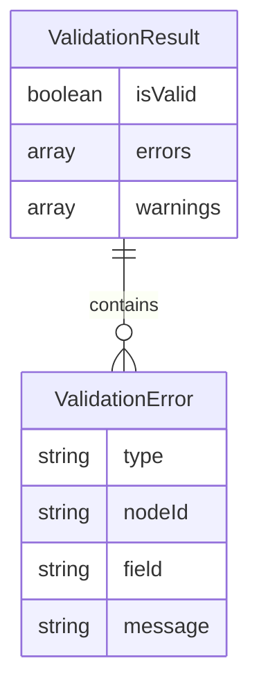

# 기본설계: WBS 데이터 유효성 검증

## 문서 정보
| 항목 | 내용 |
|------|------|
| Task ID | TSK-02-02-03 |
| Category | development |
| 상태 | [bd] 기본설계 |
| 상위 Activity | ACT-02-02 (WBS Parser) |
| 상위 Work Package | WP-02 (Data Storage Layer) |
| PRD 참조 | PRD 7.3, 7.4 |
| 작성일 | 2025-12-13 |

---

## 1. 개요

### 1.1 목적
WBS 데이터의 무결성과 일관성을 보장하기 위한 유효성 검증 서비스를 구현합니다. 이 서비스는 파싱된 WbsNode[] 데이터가 규칙에 맞는지 검증하고, 문제가 있을 경우 명확한 오류 메시지를 제공합니다.

### 1.2 구현 범위
> WBS Task 설명에서 추출

- ID 형식 검증 (WP-XX, ACT-XX-XX, TSK-XX-XX-XX)
- 필수 속성 검증 (category, status, priority)
- 상태 기호 유효성 검증
- 중복 ID 검사

### 1.3 제외 범위
> 동일 PRD 섹션이지만 다른 Task에서 구현

- Markdown 파싱 → TSK-02-02-01
- Markdown 생성 → TSK-02-02-02

---

## 2. 사용자 시나리오

### 2.1 주요 사용자
- **Server API**: wbs.md 저장 전 데이터 검증
- **프론트엔드**: 사용자 입력 유효성 검사
- **LLM CLI**: 파일 수정 후 검증

### 2.2 사용 시나리오
> 사용자 관점에서 기능 사용 흐름

**시나리오 1: wbs.md 저장 전 검증**
1. 사용자가 Task 수정 후 저장 요청
2. 시리얼라이저가 Markdown 생성 전 검증 호출
3. 검증 통과 시 저장 진행
4. 검증 실패 시 오류 메시지 반환

**시나리오 2: 새 Task 생성 시 검증**
1. 사용자가 새 Task ID 입력
2. ID 형식 검증 (TSK-XX-XX-XX 패턴)
3. 중복 ID 검사
4. 문제 있으면 즉시 피드백

**시나리오 3: 상태 전이 검증**
1. 사용자가 상태 변경 시도
2. 상태 기호 유효성 검증
3. 허용된 상태인지 확인

---

## 3. 기능 요구사항
> PRD 7.3, 7.4에서 범위 내 항목만 추출

### 3.1 ID 형식 검증
**설명**: 각 계층의 ID가 올바른 패턴인지 검증
**입력**: ID 문자열
**출력**: { valid: boolean, error?: string }
**규칙**:
| 타입 | 패턴 | 예시 |
|------|------|------|
| Work Package | `WP-{2자리 숫자}` | WP-01, WP-12 |
| Activity | `ACT-{2자리}-{2자리}` | ACT-01-01, ACT-02-03 |
| Task (4단계) | `TSK-{2자리}-{2자리}-{2자리}` | TSK-01-01-01 |
| Task (3단계) | `TSK-{2자리}-{2자리}` | TSK-02-01 |

### 3.2 필수 속성 검증
**설명**: Task 노드에 필수 속성이 존재하는지 검증
**입력**: WbsNode (Task)
**출력**: { valid: boolean, missingFields: string[] }
**필수 속성**:
| 속성 | 설명 |
|------|------|
| category | `development` / `defect` / `infrastructure` |
| status | 상태 코드 |
| priority | `critical` / `high` / `medium` / `low` |

### 3.3 상태 기호 검증
**설명**: 상태 코드가 허용된 값인지 검증
**입력**: status 문자열
**출력**: { valid: boolean, error?: string }
**허용된 상태 기호**:
| 코드 | 의미 | 칸반 컬럼 |
|------|------|----------|
| `[ ]` | Todo | Todo |
| `[bd]` | 기본설계 | Design |
| `[dd]` | 상세설계 | Detail |
| `[an]` | 분석 (defect) | Detail |
| `[ds]` | 설계 (infra) | Detail |
| `[im]` | 구현 | Implement |
| `[fx]` | 수정 (defect) | Implement |
| `[vf]` | 검증 | Verify |
| `[xx]` | 완료 | Done |

### 3.4 중복 ID 검사
**설명**: 전체 WBS에서 동일 ID가 중복되지 않는지 검사
**입력**: WbsNode[] 전체 트리
**출력**: { valid: boolean, duplicates: string[] }

### 3.5 계층 관계 검증
**설명**: 부모-자식 관계가 올바른지 검증
**입력**: WbsNode와 그 부모 노드
**출력**: { valid: boolean, error?: string }
**규칙**:
- TSK-02-02-01은 ACT-02-02 또는 WP-02의 자식이어야 함
- ACT-02-02는 WP-02의 자식이어야 함

---

## 4. 비즈니스 규칙
> PRD에서 추출한 범위 내 규칙만

| 규칙 ID | 규칙 설명 | 적용 시점 |
|---------|----------|----------|
| BR-001 | ID는 해당 계층의 패턴과 일치해야 함 | ID 검증 시 |
| BR-002 | category, status, priority는 Task에서 필수 | 속성 검증 시 |
| BR-003 | status 값은 허용된 기호 목록에 있어야 함 | 상태 검증 시 |
| BR-004 | 동일 ID는 WBS 내에서 유일해야 함 | 전체 검증 시 |
| BR-005 | TSK ID의 접두사는 부모 ID와 일치해야 함 | 계층 검증 시 |

---

## 5. 데이터 요구사항 (개념)
> 비즈니스 관점의 데이터 정의

### 5.1 주요 데이터

| 데이터 | 설명 | 비즈니스 의미 |
|--------|------|--------------|
| ValidationResult | 검증 결과 구조체 | 유효성 검사 결과 및 오류 정보 |
| ValidationError | 오류 상세 정보 | 어떤 규칙 위반인지, 어디서 발생했는지 |
| ValidatorRule | 검증 규칙 정의 | 규칙 타입, 검증 함수, 오류 메시지 |

### 5.2 검증 결과 구조

---

## 6. 화면 요구사항 (개념)
> 이 Task는 Backend 서비스이므로 화면 없음

해당 없음 - 순수 검증 로직 구현 (오류 메시지는 API 응답으로 전달)

---

## 7. 인터페이스 요구사항 (개념)
> 비즈니스 관점의 API 정의

| 기능 | 설명 | 입력 | 출력 |
|------|------|------|------|
| validateWbs | 전체 WBS 검증 | WbsNode[] | ValidationResult |
| validateId | ID 형식 검증 | id: string, type: NodeType | ValidationResult |
| validateAttributes | 필수 속성 검증 | WbsNode | ValidationResult |
| validateStatus | 상태 기호 검증 | status: string | ValidationResult |
| checkDuplicates | 중복 ID 검사 | WbsNode[] | ValidationResult |
| validateHierarchy | 계층 관계 검증 | WbsNode, parentNode | ValidationResult |

---

## 8. 수용 기준
> 비즈니스 관점의 완료 조건

- [ ] WP-XX, ACT-XX-XX, TSK-XX-XX-XX 형식 검증 정상 동작
- [ ] 3단계 구조 (TSK-XX-XX) 형식도 유효하게 인식
- [ ] 필수 속성 누락 시 명확한 오류 메시지 반환
- [ ] 잘못된 상태 기호 입력 시 오류 반환
- [ ] 중복 ID 발견 시 모든 중복 항목 목록 반환
- [ ] 계층 불일치 시 어떤 관계가 잘못되었는지 명시

---

## 9. 다음 단계
- `/wf:draft` 명령어로 상세설계 진행

---

## 관련 문서
- 프로젝트 정보: `.orchay/projects/orchay/project.json`
- PRD: `.orchay/projects/orchay/prd.md`
- TRD: `.orchay/projects/orchay/trd.md`
- 파서 설계: `.orchay/projects/orchay/tasks/TSK-02-02-01/010-basic-design.md`
- 시리얼라이저 설계: `.orchay/projects/orchay/tasks/TSK-02-02-02/010-basic-design.md`
