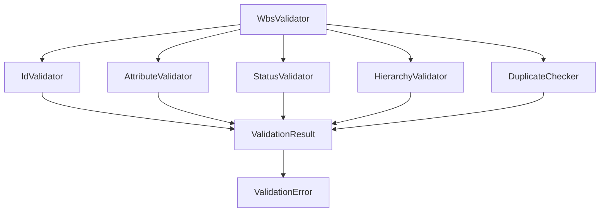
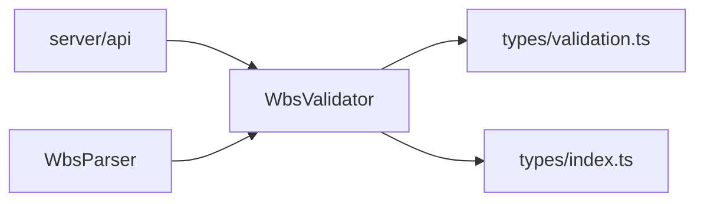

# 상세설계: WBS 데이터 유효성 검증

## 문서 정보
| 항목 | 내용 |
|------|------|
| Task ID | TSK-02-02-03 |
| Category | development |
| 상태 | [dd] 상세설계 |
| 상위 Activity | ACT-02-02 (WBS Parser) |
| 상위 Work Package | WP-02 (Data Storage Layer) |
| PRD 참조 | PRD 7.3, 7.4 |
| 작성일 | 2025-12-13 |

---

## 1. 개요

### 1.1 설계 목적
WBS 데이터의 무결성과 일관성을 보장하는 유효성 검증 서비스의 상세 구현 사양을 정의합니다. 이 서비스는 파싱된 WbsNode[] 데이터가 비즈니스 규칙에 부합하는지 검증하고, 위반 사항에 대한 명확한 오류 정보를 제공합니다.

### 1.2 설계 범위
- 검증 서비스 모듈 구조 정의
- 검증 규칙별 상세 로직 설계
- 오류 메시지 표준 정의
- 검증 결과 데이터 구조 설계
- 성능 최적화 전략

### 1.3 참조 문서
- 기본설계: `010-basic-design.md`
- 파서 설계: `TSK-02-02-01/010-basic-design.md`
- 타입 정의: `types/index.ts`
- PRD 섹션 7.3, 7.4

---

## 2. 아키텍처 설계

### 2.1 모듈 구조



### 2.2 계층 구조

| 계층 | 모듈 | 책임 |
|------|------|------|
| 서비스 계층 | WbsValidator | 전체 검증 조율, 결과 통합 |
| 검증 계층 | IdValidator | ID 형식 검증 |
| 검증 계층 | AttributeValidator | 필수 속성 검증 |
| 검증 계층 | StatusValidator | 상태 기호 검증 |
| 검증 계층 | HierarchyValidator | 계층 관계 검증 |
| 검증 계층 | DuplicateChecker | 중복 ID 검사 |
| 데이터 계층 | ValidationResult | 검증 결과 데이터 |

### 2.3 의존성 관계



---

## 3. 데이터 구조 설계

### 3.1 타입 정의

#### ValidationResult
| 속성 | 타입 | 필수 | 설명 |
|------|------|------|------|
| isValid | boolean | Y | 전체 검증 통과 여부 |
| errors | ValidationError[] | Y | 오류 목록 (빈 배열 가능) |
| warnings | ValidationWarning[] | Y | 경고 목록 (빈 배열 가능) |
| validatedAt | string | Y | 검증 수행 시각 (ISO 8601) |
| nodeCount | number | Y | 검증된 노드 수 |

#### ValidationError
| 속성 | 타입 | 필수 | 설명 |
|------|------|------|------|
| type | ErrorType | Y | 오류 타입 (ID_FORMAT, MISSING_ATTR 등) |
| severity | 'error' \| 'warning' | Y | 심각도 |
| nodeId | string | N | 문제가 발생한 노드 ID |
| field | string | N | 문제가 있는 필드명 |
| message | string | Y | 사람이 읽을 수 있는 오류 메시지 |
| expected | string | N | 예상된 값 |
| actual | string | N | 실제 값 |
| line | number | N | wbs.md 파일의 라인 번호 (선택) |

#### ValidationWarning
| 속성 | 타입 | 필수 | 설명 |
|------|------|------|------|
| type | WarningType | Y | 경고 타입 |
| nodeId | string | N | 노드 ID |
| message | string | Y | 경고 메시지 |
| suggestion | string | N | 권장 조치 사항 |

#### ErrorType 열거형
| 값 | 설명 |
|-----|------|
| ID_FORMAT | ID 형식 오류 |
| MISSING_ATTR | 필수 속성 누락 |
| INVALID_STATUS | 잘못된 상태 코드 |
| DUPLICATE_ID | 중복된 ID |
| HIERARCHY_MISMATCH | 계층 관계 불일치 |
| INVALID_VALUE | 잘못된 속성 값 |

### 3.2 검증 규칙 데이터

#### ID 패턴 규칙
| 노드 타입 | 정규식 패턴 | 예시 |
|----------|------------|------|
| wp | `^WP-\d{2}$` | WP-01, WP-12 |
| act | `^ACT-\d{2}-\d{2}$` | ACT-01-01, ACT-02-03 |
| task (4단계) | `^TSK-\d{2}-\d{2}-\d{2}$` | TSK-01-01-01 |
| task (3단계) | `^TSK-\d{2}-\d{2}$` | TSK-02-01 |

#### 허용된 상태 코드
| 코드 | 컬럼 | 의미 |
|------|------|------|
| [ ] | Todo | 미착수 |
| [bd] | Design | 기본설계 |
| [dd] | Detail | 상세설계 |
| [an] | Detail | 분석 (defect) |
| [ds] | Detail | 설계 (infra) |
| [im] | Implement | 구현 |
| [fx] | Implement | 수정 (defect) |
| [vf] | Verify | 검증 |
| [xx] | Done | 완료 |

---

## 4. 검증 로직 설계

### 4.1 WbsValidator 메서드

#### validateWbs
| 항목 | 내용 |
|------|------|
| 목적 | 전체 WBS 트리 검증 |
| 입력 | nodes: WbsNode[], options?: ValidationOptions |
| 출력 | ValidationResult |
| 알고리즘 | 1. 중복 ID 검사 수행<br>2. 순환 참조 검출 (visited Set 사용)<br>3. 각 노드에 대해 재귀적으로 validateNode 호출<br>4. options.failFast가 true면 첫 오류 시 즉시 반환<br>5. 모든 오류/경고 수집<br>6. ValidationResult 생성 및 반환 |
| 복잡도 | O(n) - n은 노드 수 |

**ValidationOptions 인터페이스**:
| 옵션 | 타입 | 기본값 | 설명 |
|------|------|--------|------|
| failFast | boolean | false | 첫 번째 오류 발견 시 즉시 반환 (Early Return) |
| depth | 3 \| 4 | undefined | 프로젝트 깊이 (Task ID 검증에 사용) |

**순환 참조 검출**:
```
함수 validateWbs(nodes, options):
    visitedSet = new Set<string>()
    errors = []

    함수 validateRecursive(node, parent):
        if visitedSet.has(node.id):
            errors.push(ValidationError(
                type: CIRCULAR_REFERENCE,
                message: "순환 참조 감지: " + node.id
            ))
            return
        visitedSet.add(node.id)

        // 노드 검증...
        if options.failFast && errors.length > 0:
            return

        for child in node.children:
            validateRecursive(child, node)

        visitedSet.delete(node.id)  // 백트래킹

    for node in nodes:
        validateRecursive(node, null)

    return ValidationResult(...)
```

#### validateNode
| 항목 | 내용 |
|------|------|
| 목적 | 단일 노드 검증 |
| 입력 | node: WbsNode, parent?: WbsNode |
| 출력 | ValidationError[] |
| 알고리즘 | 1. ID 형식 검증<br>2. 타입이 'task'인 경우 속성 검증<br>3. 상태 코드 검증<br>4. 부모가 있으면 계층 관계 검증<br>5. 오류 목록 반환 |

### 4.2 IdValidator 메서드

#### validateId
| 항목 | 내용 |
|------|------|
| 목적 | ID 형식 검증 |
| 입력 | id: string, type: WbsNodeType, depth?: 3 \| 4 |
| 출력 | ValidationError \| null |
| 알고리즘 | 1. 타입에 맞는 정규식 패턴 선택<br>2. type='task'인 경우:<br>&nbsp;&nbsp;- depth 파라미터가 있으면 해당 깊이 패턴만 검사<br>&nbsp;&nbsp;- depth 없으면 3단계 OR 4단계 패턴 중 하나라도 매칭되면 통과<br>3. id가 패턴과 일치하는지 검사<br>4. 불일치 시 ValidationError 생성<br>5. 일치 시 null 반환 |
| 예외 처리 | 알 수 없는 타입 입력 시 INVALID_VALUE 오류 |

**Task ID 유연 매칭 로직**:
```
함수 validateTaskId(id: string, depth?: 3 | 4):
    if depth == 3:
        return TSK_3LEVEL_PATTERN.test(id)
    else if depth == 4:
        return TSK_4LEVEL_PATTERN.test(id)
    else:
        // depth 미지정 시 둘 중 하나라도 매칭되면 통과
        return TSK_3LEVEL_PATTERN.test(id) || TSK_4LEVEL_PATTERN.test(id)
```

#### getPattern
| 항목 | 내용 |
|------|------|
| 목적 | 노드 타입별 정규식 패턴 반환 |
| 입력 | type: WbsNodeType |
| 출력 | RegExp |
| 로직 | 타입에 따라 미리 정의된 정규식 반환 |

### 4.3 AttributeValidator 메서드

#### validateAttributes
| 항목 | 내용 |
|------|------|
| 목적 | Task 노드의 필수 속성 검증 |
| 입력 | node: WbsNode |
| 출력 | ValidationError[] |
| 알고리즘 | 1. node.type이 'task'가 아니면 빈 배열 반환<br>2. 필수 속성 목록 = ['category', 'status', 'priority']<br>3. 각 속성이 존재하고 유효한지 검사<br>4. 누락/잘못된 속성에 대해 오류 생성<br>5. 오류 배열 반환 |

#### validateCategory
| 항목 | 내용 |
|------|------|
| 목적 | category 값 유효성 검증 |
| 입력 | category: string |
| 출력 | boolean |
| 로직 | category가 `VALID_CATEGORIES` 상수 배열에 포함되는지 확인 |

**참조**: `types/index.ts`의 `TaskCategory` enum 또는 `VALID_CATEGORIES` 상수 사용
```typescript
// types/index.ts에서 import
import { VALID_CATEGORIES, VALID_PRIORITIES, VALID_STATUS_CODES } from '@/types'
// VALID_CATEGORIES = ['development', 'defect', 'infrastructure']
```

#### validatePriority
| 항목 | 내용 |
|------|------|
| 목적 | priority 값 유효성 검증 |
| 입력 | priority: string |
| 출력 | boolean |
| 로직 | priority가 `VALID_PRIORITIES` 상수 배열에 포함되는지 확인 |

**참조**: `types/index.ts`의 `Priority` enum 또는 `VALID_PRIORITIES` 상수 사용

### 4.4 StatusValidator 메서드

#### validateStatus
| 항목 | 내용 |
|------|------|
| 목적 | 상태 코드 유효성 검증 |
| 입력 | status: string |
| 출력 | ValidationError \| null |
| 알고리즘 | 1. status가 `VALID_STATUS_CODES` 상수에 있는지 확인<br>2. 없으면 ValidationError 생성 (실제 값, 허용된 목록 포함)<br>3. 있으면 null 반환 |
| 허용 목록 | `VALID_STATUS_CODES` 상수 (types/index.ts에서 import) |

**공통 상수 정의** (types/index.ts):
```typescript
// 파서, 시리얼라이저, 검증기에서 공통 사용
export const VALID_STATUS_CODES = ['[ ]', '[bd]', '[dd]', '[an]', '[ds]', '[im]', '[fx]', '[vf]', '[xx]'] as const;
export type StatusCode = typeof VALID_STATUS_CODES[number];
```

### 4.5 HierarchyValidator 메서드

#### validateHierarchy
| 항목 | 내용 |
|------|------|
| 목적 | 부모-자식 관계 검증 |
| 입력 | node: WbsNode, parent: WbsNode \| null |
| 출력 | ValidationError \| null |
| 알고리즘 | 1. parent가 null인 경우:<br>&nbsp;&nbsp;- node.type이 'wp'이면 정상 (WP는 루트 가능)<br>&nbsp;&nbsp;- node.type이 'task' 또는 'act'이면 HIERARCHY_MISMATCH 오류<br>&nbsp;&nbsp;&nbsp;&nbsp;메시지: "Task/ACT는 WP/ACT 하위에 있어야 합니다"<br>2. parent가 있는 경우:<br>&nbsp;&nbsp;- ID 접두사 추출 (예: TSK-02-02-03 → 02-02)<br>&nbsp;&nbsp;- 부모 타입에 따라 기대 접두사 계산<br>&nbsp;&nbsp;- 실제 접두사와 비교<br>&nbsp;&nbsp;- 불일치 시 오류 생성 |

**Task 루트 케이스 처리**:
```
함수 validateHierarchy(node, parent):
    if parent == null:
        if node.type == 'wp':
            return null  // WP는 루트 가능
        else:
            return ValidationError(
                type: HIERARCHY_MISMATCH,
                message: "Task/ACT는 WP/ACT 하위에 있어야 합니다: " + node.id,
                nodeId: node.id
            )
    // 기존 부모-자식 관계 검증 로직...
```

#### extractPrefix
| 항목 | 내용 |
|------|------|
| 목적 | ID에서 접두사 추출 |
| 입력 | id: string, type: WbsNodeType |
| 출력 | string |
| 로직 | - WP-01 → "01"<br>- ACT-02-03 → "02-03"<br>- TSK-01-02-03 → "01-02"<br>- TSK-02-01 → "02" |

#### getExpectedPrefix
| 항목 | 내용 |
|------|------|
| 목적 | 부모 ID로부터 기대 접두사 계산 |
| 입력 | parentId: string, parentType: WbsNodeType |
| 출력 | string |
| 예시 | - WP-02 → "02"<br>- ACT-02-03 → "02-03" |

### 4.6 DuplicateChecker 메서드

#### checkDuplicates
| 항목 | 내용 |
|------|------|
| 목적 | 전체 트리에서 중복 ID 검사 |
| 입력 | nodes: WbsNode[] |
| 출력 | ValidationError[] |
| 알고리즘 | 1. Map<string, number> 생성 (ID → 출현 횟수)<br>2. 트리 순회하며 각 ID 카운트<br>3. 출현 횟수가 2 이상인 ID 추출<br>4. 각 중복에 대해 ValidationError 생성<br>5. 오류 배열 반환 |
| 복잡도 | O(n) |

#### collectAllIds
| 항목 | 내용 |
|------|------|
| 목적 | 트리에서 모든 ID 수집 (재귀) |
| 입력 | nodes: WbsNode[] |
| 출력 | string[] |
| 로직 | 깊이 우선 순회로 모든 노드 ID 수집 |

---

## 5. 오류 메시지 설계

### 5.1 메시지 템플릿

| 오류 타입 | 메시지 템플릿 | 예시 |
|----------|-------------|------|
| ID_FORMAT | `Invalid ID format for {type}: '{id}'. Expected pattern: {pattern}` | `Invalid ID format for task: 'TSK-2-1'. Expected pattern: TSK-\d{2}-\d{2}` |
| MISSING_ATTR | `Missing required attribute '{field}' for task '{id}'` | `Missing required attribute 'category' for task 'TSK-01-01-01'` |
| INVALID_STATUS | `Invalid status code '{status}' for node '{id}'. Allowed codes: {allowedList}` | `Invalid status code '[done]' for node 'TSK-02-01'. Allowed codes: [ ], [bd], [dd], ...` |
| DUPLICATE_ID | `Duplicate ID '{id}' found {count} times in WBS tree` | `Duplicate ID 'TSK-01-01' found 2 times in WBS tree` |
| HIERARCHY_MISMATCH | `Hierarchy mismatch: {childId} cannot be a child of {parentId}. Expected prefix: {expectedPrefix}, actual: {actualPrefix}` | `Hierarchy mismatch: TSK-03-01-01 cannot be a child of WP-02. Expected prefix: 02, actual: 03` |
| INVALID_VALUE | `Invalid value for '{field}' in node '{id}': '{value}'. Allowed values: {allowedList}` | `Invalid value for 'category' in node 'TSK-01-01': 'test'. Allowed values: development, defect, infrastructure` |

### 5.2 다국어 지원 전략
현재는 영어 메시지만 제공하며, 향후 i18n 도입 시 메시지 키를 사용하여 다국어 지원 가능하도록 설계

| 메시지 키 | 영문 메시지 |
|----------|-----------|
| validation.id_format | Invalid ID format for {type}: '{id}'. Expected pattern: {pattern} |
| validation.missing_attr | Missing required attribute '{field}' for task '{id}' |

---

## 6. 파일 구조 설계

### 6.1 디렉토리 구조

```
server/
└── utils/
    └── validation/
        ├── index.ts                    # 메인 WbsValidator 클래스
        ├── validators/
        │   ├── id-validator.ts         # IdValidator
        │   ├── attribute-validator.ts  # AttributeValidator
        │   ├── status-validator.ts     # StatusValidator
        │   ├── hierarchy-validator.ts  # HierarchyValidator
        │   └── duplicate-checker.ts    # DuplicateChecker
        └── types.ts                    # 검증 관련 타입 정의

types/
└── validation.ts                       # 공용 타입 export
```

### 6.2 모듈별 파일 설계

#### server/utils/validation/index.ts
| 섹션 | 내용 |
|------|------|
| import | 각 validator, WbsNode 타입, ValidationResult 타입 |
| class WbsValidator | validateWbs, validateNode 메서드 |
| export | WbsValidator 클래스 및 헬퍼 함수 |

#### server/utils/validation/validators/id-validator.ts
| 섹션 | 내용 |
|------|------|
| 상수 | ID 패턴 정규식 맵 |
| 함수 | validateId, getPattern |
| export | 검증 함수 |

#### types/validation.ts
| 섹션 | 내용 |
|------|------|
| type | ErrorType, WarningType |
| interface | ValidationResult, ValidationError, ValidationWarning |
| export | 모든 타입 |

---

## 7. 성능 최적화 설계

### 7.1 최적화 전략

| 전략 | 설명 | 예상 효과 |
|------|------|----------|
| 단일 순회 | 중복 검사와 노드 검증을 한 번의 순회로 처리 | 50% 속도 향상 |
| Early Return | 첫 번째 오류 발견 시 즉시 반환 (옵션) | 평균 30% 단축 |
| ID Map 캐싱 | ID 중복 검사용 Map을 재사용 | 메모리 효율 20% 개선 |
| 정규식 컴파일 캐싱 | 정규식을 모듈 레벨에서 미리 컴파일 | 정규식 검사 80% 단축 |

### 7.2 복잡도 분석

| 메서드 | 시간 복잡도 | 공간 복잡도 | 비고 |
|--------|-----------|-----------|------|
| validateWbs | O(n) | O(n) | n = 노드 수 |
| validateNode | O(1) | O(1) | 단일 노드 처리 |
| checkDuplicates | O(n) | O(n) | Map 사용 |
| validateId | O(1) | O(1) | 정규식 검사 |
| validateHierarchy | O(1) | O(1) | 문자열 비교 |

### 7.3 대용량 WBS 처리

| WBS 크기 | 노드 수 | 예상 처리 시간 |
|---------|--------|--------------|
| 소규모 | ~50 | <10ms |
| 중규모 | ~200 | <50ms |
| 대규모 | ~1000 | <200ms |

---

## 8. 테스트 설계 전략

### 8.1 테스트 범위

| 테스트 종류 | 범위 | 목표 커버리지 |
|-----------|------|-------------|
| 단위 테스트 | 각 validator 함수 | 90% |
| 통합 테스트 | WbsValidator 전체 흐름 | 80% |
| 엣지 케이스 | 경계 조건, 빈 값 등 | 100% |

### 8.2 테스트 시나리오 분류

#### 긍정 시나리오 (정상 동작)
| 시나리오 ID | 설명 | 입력 | 기대 결과 |
|-----------|------|------|----------|
| VALID-001 | 유효한 WBS 트리 | 올바른 구조의 WbsNode[] | isValid: true, errors: [] |
| VALID-002 | 3단계 구조 | WP → TSK | isValid: true |
| VALID-003 | 4단계 구조 | WP → ACT → TSK | isValid: true |

#### 부정 시나리오 (오류 감지)
| 시나리오 ID | 설명 | 입력 | 기대 오류 |
|-----------|------|------|----------|
| ERROR-001 | 잘못된 WP ID | id: "WP-1" | ID_FORMAT 오류 |
| ERROR-002 | category 누락 | Task without category | MISSING_ATTR 오류 |
| ERROR-003 | 잘못된 상태 코드 | status: "[done]" | INVALID_STATUS 오류 |
| ERROR-004 | 중복 ID | 동일 ID 2개 | DUPLICATE_ID 오류 |
| ERROR-005 | 계층 불일치 | TSK-03-01-01의 부모가 WP-02 | HIERARCHY_MISMATCH 오류 |

#### 경계 조건 시나리오
| 시나리오 ID | 설명 | 입력 | 기대 결과 |
|-----------|------|------|----------|
| EDGE-001 | 빈 WBS 트리 | [] | isValid: true, errors: [] |
| EDGE-002 | 단일 WP만 | [wpNode] | isValid: true |
| EDGE-003 | Task만 있는 경우 (비정상) | [taskNode] | 계층 오류 |

---

## 9. 인터페이스 명세

### 9.1 WbsValidator 클래스

#### 메서드 시그니처 표

| 메서드 | 파라미터 | 반환 타입 | 설명 |
|--------|---------|----------|------|
| validateWbs | nodes: WbsNode[] | ValidationResult | 전체 WBS 검증 |
| validateNode | node: WbsNode, parent?: WbsNode | ValidationError[] | 단일 노드 검증 |
| collectErrors | nodes: WbsNode[], parent?: WbsNode | ValidationError[] | 재귀적 오류 수집 |

### 9.2 개별 Validator 함수

#### IdValidator

| 함수 | 파라미터 | 반환 타입 |
|------|---------|----------|
| validateId | id: string, type: WbsNodeType | ValidationError \| null |
| getPattern | type: WbsNodeType | RegExp |

#### AttributeValidator

| 함수 | 파라미터 | 반환 타입 |
|------|---------|----------|
| validateAttributes | node: WbsNode | ValidationError[] |
| validateCategory | category: string | boolean |
| validatePriority | priority: string | boolean |

#### StatusValidator

| 함수 | 파라미터 | 반환 타입 |
|------|---------|----------|
| validateStatus | status: string | ValidationError \| null |
| isValidStatus | status: string | boolean |

#### HierarchyValidator

| 함수 | 파라미터 | 반환 타입 |
|------|---------|----------|
| validateHierarchy | node: WbsNode, parent: WbsNode | ValidationError \| null |
| extractPrefix | id: string, type: WbsNodeType | string |
| getExpectedPrefix | parentId: string, parentType: WbsNodeType | string |

#### DuplicateChecker

| 함수 | 파라미터 | 반환 타입 |
|------|---------|----------|
| checkDuplicates | nodes: WbsNode[] | ValidationError[] |
| collectAllIds | nodes: WbsNode[] | string[] |

---

## 10. 사용 예시

### 10.1 API 엔드포인트에서 사용

**시나리오**: PUT /api/projects/:id/wbs 엔드포인트에서 저장 전 검증

**처리 흐름**:
1. 클라이언트가 수정된 WbsNode[] 전송
2. API 핸들러가 WbsValidator.validateWbs 호출
3. 검증 실패 시 400 Bad Request 반환 (오류 목록 포함)
4. 검증 성공 시 시리얼라이저 호출하여 wbs.md 저장

**의사 코드 표현**:

| 단계 | 동작 |
|------|------|
| 1 | 요청 데이터 파싱 → wbsData: WbsNode[] |
| 2 | validator.validateWbs(wbsData) → result: ValidationResult |
| 3 | if (!result.isValid) → return { status: 400, errors: result.errors } |
| 4 | serializer.serializeWbs(wbsData) → markdown: string |
| 5 | fs.writeFile(wbsPath, markdown) |
| 6 | return { status: 200, message: 'Saved' } |

### 10.2 프론트엔드 실시간 검증

**시나리오**: Task 속성 인라인 편집 시 실시간 검증

**처리 흐름**:
1. 사용자가 category 필드 수정
2. onChange 이벤트에서 validateAttributes 호출
3. 오류 있으면 필드 하단에 오류 메시지 표시
4. 저장 버튼 활성화/비활성화 제어

**검증 타이밍**:

| 이벤트 | 검증 항목 | 응답 |
|--------|----------|------|
| ID 입력 | ID 형식, 중복 | 즉시 피드백 |
| 상태 선택 | 상태 코드 | 드롭다운 제한 (검증 불필요) |
| category 선택 | 유효한 값 | 드롭다운 제한 |
| 저장 클릭 | 전체 노드 | 서버 검증 |

---

## 11. 에러 핸들링 설계

### 11.1 예외 처리 전략

| 상황 | 처리 방법 | 사용자 피드백 |
|------|----------|-------------|
| 잘못된 입력 타입 | ValidationError 생성, 계속 진행 | 오류 목록에 포함 |
| undefined/null 노드 | 무시하고 다음 노드로 | 경고 로그 출력 |
| 정규식 컴파일 오류 | 시스템 오류로 처리, 검증 중단 | 500 Internal Server Error |
| 순환 참조 탐지 | 최대 깊이 제한 (depth 50) | HIERARCHY_MISMATCH 오류 |

### 11.2 복구 전략

| 오류 유형 | 복구 가능 여부 | 복구 방법 |
|----------|-------------|----------|
| ID_FORMAT | 불가 | 사용자 수정 필요 |
| MISSING_ATTR | 가능 | 기본값 자동 삽입 (옵션) |
| INVALID_STATUS | 불가 | 사용자 수정 필요 |
| DUPLICATE_ID | 불가 | 중복 ID 재지정 필요 |
| HIERARCHY_MISMATCH | 불가 | 구조 재정리 필요 |

### 11.3 로깅 설계

| 로그 레벨 | 기록 대상 | 예시 |
|---------|----------|------|
| ERROR | 시스템 오류, 검증 중단 | "Validation failed: Circular reference detected" |
| WARN | 경고성 오류, 권장 사항 | "Node TSK-01-01: Missing optional field 'assignee'" |
| INFO | 검증 시작/완료 | "Validation started for 45 nodes", "Validation completed: 3 errors found" |
| DEBUG | 상세 검증 과정 | "Validating node TSK-01-01-01", "Pattern matched: TSK-\d{2}-\d{2}-\d{2}" |

---

## 12. 확장성 고려사항

### 12.1 플러그인 아키텍처

향후 커스텀 검증 규칙 추가를 위한 확장 포인트 설계

| 확장 포인트 | 인터페이스 | 용도 |
|-----------|----------|------|
| CustomValidator | validate(node): ValidationError[] | 프로젝트별 커스텀 규칙 |
| ValidationPlugin | register(validator): void | 플러그인 등록 |

### 12.2 설정 기반 검증

향후 설정 파일로 검증 규칙 커스터마이징 가능

**설정 예시 (JSON)**:

| 설정 키 | 타입 | 설명 |
|---------|------|------|
| validation.strictMode | boolean | 엄격 모드 활성화 (경고도 오류로 처리) |
| validation.allowedStatuses | string[] | 허용된 상태 코드 목록 (커스터마이징) |
| validation.customPatterns.task | string | Task ID 패턴 정규식 (커스터마이징) |

### 12.3 비동기 검증 지원

대용량 WBS 처리를 위한 비동기 검증 설계

| 메서드 | 동기 버전 | 비동기 버전 |
|--------|----------|-----------|
| validateWbs | validateWbs(nodes) | validateWbsAsync(nodes): Promise |
| 진행 상황 | 불가 | onProgress 콜백 지원 |
| 취소 | 불가 | AbortController 지원 |

---

## 13. 보안 고려사항

### 13.1 입력 검증

| 검증 항목 | 목적 | 방법 |
|---------|------|------|
| 최대 노드 수 | DoS 방지 | 10,000개 제한 |
| 최대 깊이 | 순환 참조 방지 | 50 레벨 제한 |
| 문자열 길이 | 메모리 공격 방지 | 각 필드 1,000자 제한 |
| 특수 문자 | XSS 방지 | 오류 메시지 이스케이프 |

### 13.2 권한 검증

검증 서비스 자체는 권한을 확인하지 않으며, API 레이어에서 처리

---

## 14. 수용 기준 (상세)

### 14.1 기능 요구사항

| 수용 기준 ID | 설명 | 검증 방법 |
|------------|------|----------|
| AC-001 | WP-XX, ACT-XX-XX, TSK-XX-XX-XX 형식 검증 정상 동작 | 단위 테스트 통과 |
| AC-002 | 3단계 구조 (TSK-XX-XX) 형식도 유효하게 인식 | 통합 테스트 통과 |
| AC-003 | 필수 속성 누락 시 명확한 오류 메시지 반환 | 오류 메시지 검증 |
| AC-004 | 잘못된 상태 기호 입력 시 오류 반환 | 부정 테스트 통과 |
| AC-005 | 중복 ID 발견 시 모든 중복 항목 목록 반환 | 중복 검사 테스트 |
| AC-006 | 계층 불일치 시 어떤 관계가 잘못되었는지 명시 | 오류 메시지에 부모-자식 ID 포함 |

### 14.2 품질 요구사항

| 수용 기준 ID | 설명 | 목표 값 |
|------------|------|---------|
| AC-007 | 단위 테스트 커버리지 | 90% 이상 |
| AC-008 | 처리 성능 (1000 노드) | 200ms 이하 |
| AC-009 | 메모리 사용량 (1000 노드) | 10MB 이하 |
| AC-010 | 오류 메시지 정확성 | 100% (모든 오류 타입에 적절한 메시지) |

---

## 15. 추적성 매트릭스

기본설계 요구사항과 상세설계 구성요소 간 매핑은 별도 문서 `025-traceability-matrix.md` 참조

---

## 16. 구현 우선순위

| 우선순위 | 구성요소 | 이유 |
|---------|---------|------|
| 1 | IdValidator | 가장 기본적인 검증, 다른 검증의 전제 조건 |
| 2 | DuplicateChecker | 데이터 무결성의 핵심 |
| 3 | AttributeValidator | Task 데이터 품질 보장 |
| 4 | StatusValidator | 워크플로우 정합성 보장 |
| 5 | HierarchyValidator | 복잡도가 높지만 중요도는 상대적으로 낮음 |
| 6 | WbsValidator (통합) | 모든 validator 완성 후 통합 |

---

## 17. 다음 단계

1. 추적성 매트릭스 작성 (`025-traceability-matrix.md`)
2. 테스트 명세 작성 (`026-test-specification.md`)
3. 구현 단계 진행 (`/wf:build`)

---

## 관련 문서
- 기본설계: `010-basic-design.md`
- 추적성 매트릭스: `025-traceability-matrix.md`
- 테스트 명세: `026-test-specification.md`
- 파서 상세설계: `.orchay/projects/orchay/tasks/TSK-02-02-01/020-detail-design.md`
- 시리얼라이저 상세설계: `.orchay/projects/orchay/tasks/TSK-02-02-02/020-detail-design.md`
- 타입 정의: `types/index.ts`
