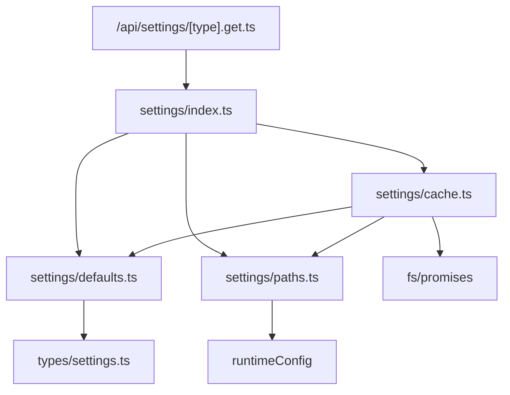
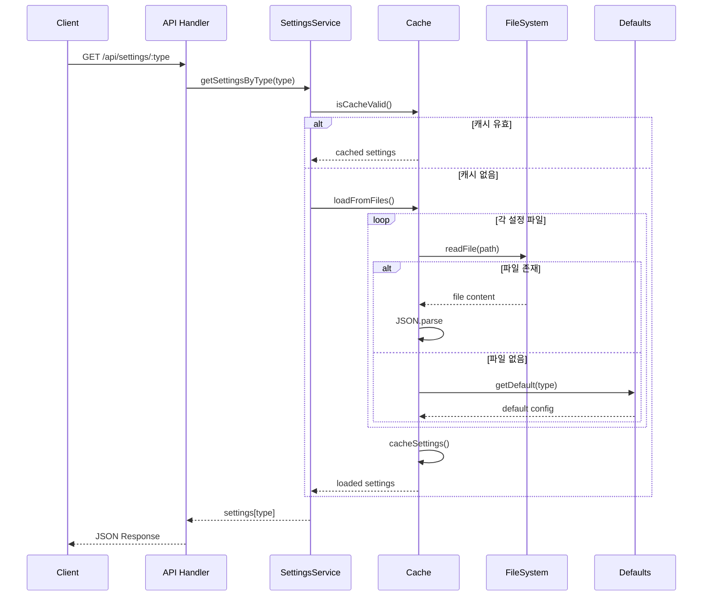
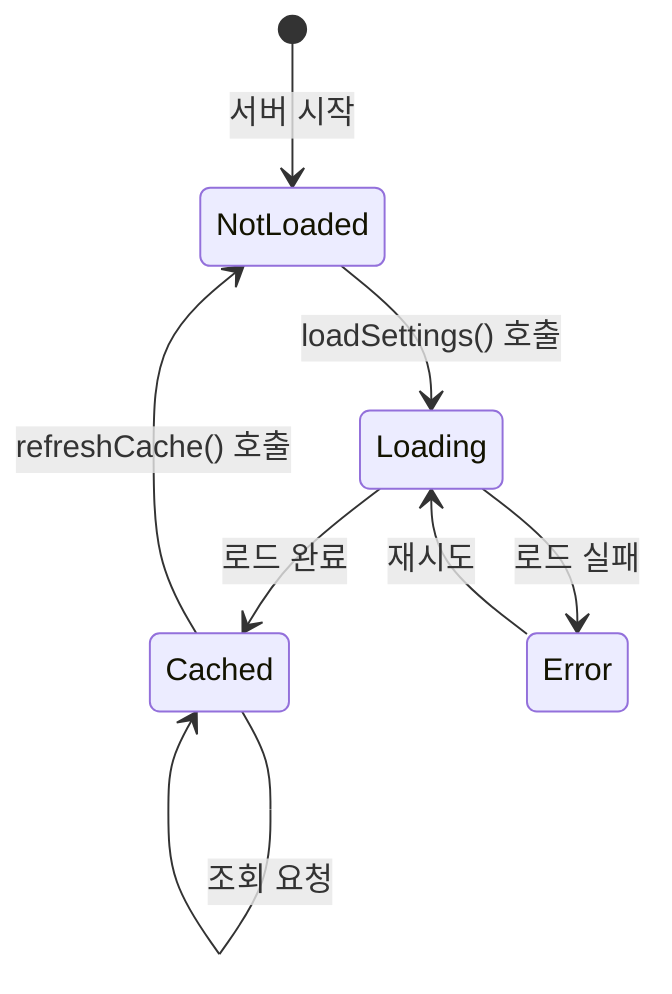

# 상세설계: 설정 서비스 구현

## 문서 정보

| 항목 | 내용 |
|------|------|
| Task ID | TSK-02-03-02 |
| Category | development |
| 상태 | [dd] 상세설계 |
| 상위 Activity | ACT-02-03 (Settings Service) |
| 상위 Work Package | WP-02 (Data Storage Layer) |
| 기본설계 참조 | 010-basic-design.md |
| PRD 참조 | PRD 8.1 |
| 작성일 | 2025-12-14 |
| 선행 Task | TSK-02-03-01 (설정 스키마 정의) - 완료 |
| 분할 문서 | 025-traceability-matrix.md, 026-test-specification.md |

---

## 1. 일관성 검증 결과

### 1.1 검증 요약

| 항목 | 통과 | 경고 | 실패 |
|------|------|------|------|
| PRD ↔ 기본설계 | 4 | 0 | 0 |
| 기본설계 ↔ 상세설계 | 6 | 0 | 0 |
| TRD ↔ 상세설계 | 5 | 0 | 0 |
| **총계** | 15 | 0 | 0 |

### 1.2 검증 상세

| 검증 ID | 항목 | 결과 | 비고 |
|---------|------|------|------|
| CHK-PRD-01 | 기능 요구사항 완전성 | PASS | 3개 기능 요구사항 모두 반영 |
| CHK-PRD-02 | 비즈니스 규칙 일치성 | PASS | 4개 BR 정확히 반영 |
| CHK-PRD-03 | 용어 일관성 | PASS | Settings, Config 용어 일관 |
| CHK-PRD-04 | 범위 일치성 | PASS | PRD 8.1 범위 내 |
| CHK-BD-01 | 기능 요구사항 완전성 | PASS | FR-001~FR-003 설계 명시 |
| CHK-BD-02 | 비즈니스 규칙 구현 명세 | PASS | BR-001~BR-004 구현 방안 |
| CHK-BD-03 | 데이터 모델 일치성 | PASS | TSK-02-03-01 타입 활용 |
| CHK-BD-04 | 인터페이스 일치성 | PASS | 4개 API 엔드포인트 매핑 |
| CHK-BD-05 | 화면 일치성 | PASS | N/A (Backend 전용) |
| CHK-BD-06 | 수용 기준 구현 가능성 | PASS | 5개 AC 테스트 변환 |
| CHK-TRD-01 | 기술 스택 준수 | PASS | Nuxt 3, TypeScript |
| CHK-TRD-02 | 아키텍처 패턴 준수 | PASS | Server Routes 구조 |
| CHK-TRD-03 | API 설계 규칙 준수 | PASS | RESTful 규칙 준수 |
| CHK-TRD-04 | DB 스키마 규칙 준수 | PASS | N/A (파일 기반) |
| CHK-TRD-05 | 에러 핸들링 표준 준수 | PASS | H3 에러 표준 |

---

## 2. 목적 및 범위

### 2.1 목적

ORCHAY 시스템의 전역 설정을 로드하고 관리하는 서비스를 구현합니다. 설정 파일이 없는 경우 기본값을 사용하며, 한 번 로드된 설정은 캐싱하여 성능을 최적화합니다.

### 2.2 구현 범위

| 포함 | 제외 |
|------|------|
| 설정 파일 로드 (없으면 기본값) | JSON 스키마 정의 (TSK-02-03-01) |
| 설정 캐싱 | 프로젝트 메타데이터 (TSK-02-03-03) |
| 설정 조회 API | 설정 수정 API (1차 범위 외) |

---

## 3. 기술 스택

| 항목 | 기술 | 버전 |
|------|------|------|
| 런타임 | Node.js | 20.x |
| 프레임워크 | Nuxt 3 (Server Routes) | 3.18.x |
| 언어 | TypeScript | 5.6.x |
| 파일 시스템 | Node.js fs/promises | 내장 |
| HTTP 에러 | H3 (createError) | 내장 |

---

## 4. 용어 정의

| 용어 | 정의 |
|------|------|
| Settings | 전역 설정 통합 객체 (columns, categories, workflows, actions) |
| SettingsService | 설정 로드/캐싱/조회를 담당하는 서비스 모듈 |
| SettingsCache | 메모리에 캐시된 설정 객체 |
| SettingsFileType | 4가지 설정 타입 열거 (columns, categories, workflows, actions) |

---

## 5. 시스템 구조

### 5.1 모듈 구조

```
server/
├── api/
│   └── settings/
│       └── [type].get.ts       # GET /api/settings/:type
│
└── utils/
    └── settings/
        ├── index.ts            # SettingsService 메인
        ├── defaults.ts         # 기본값 (TSK-02-03-01)
        ├── cache.ts            # 캐시 관리 (신규)
        └── paths.ts            # 설정 경로 관리 (신규)
```

### 5.1.1 설정 경로 관리

> **ISS-001 반영**: 경로 하드코딩 대신 환경 설정 기반 경로 관리

```typescript
// server/utils/settings/paths.ts
export function getSettingsBasePath(): string {
  const config = useRuntimeConfig();
  return config.orchayBasePath || process.cwd();
}

export function getSettingsDir(): string {
  return join(getSettingsBasePath(), '.orchay', 'settings');
}

export function getSettingsFilePath(type: SettingsFileType): string {
  return join(getSettingsDir(), SETTINGS_FILE_NAMES[type]);
}
```

**환경 설정 (nuxt.config.ts)**:
```typescript
export default defineNuxtConfig({
  runtimeConfig: {
    orchayBasePath: process.env.orchay_BASE_PATH || process.cwd(),
  },
});
```

### 5.2 모듈 역할

| 모듈 | 역할 | 의존성 |
|------|------|--------|
| `settings/index.ts` | 설정 로드 및 조회 함수 export | cache.ts, defaults.ts, paths.ts |
| `settings/cache.ts` | 메모리 캐시 관리 | defaults.ts, paths.ts |
| `settings/paths.ts` | 설정 경로 관리 | runtimeConfig |
| `settings/defaults.ts` | 기본값 상수 (기존) | types/settings.ts |
| `api/settings/[type].get.ts` | REST API 핸들러 | settings/index.ts |

### 5.3 의존성 다이어그램



---

## 6. 데이터 모델

### 6.1 타입 참조

TSK-02-03-01에서 정의된 `types/settings.ts` 활용:

| 타입 | 용도 |
|------|------|
| `Settings` | 전체 설정 통합 타입 |
| `ColumnsConfig` | 칸반 컬럼 설정 |
| `CategoriesConfig` | 카테고리 설정 |
| `WorkflowsConfig` | 워크플로우 설정 |
| `ActionsConfig` | 액션 설정 |
| `SettingsFileType` | 설정 타입 열거 |
| `SETTINGS_FILE_NAMES` | 파일명 매핑 상수 |

### 6.2 캐시 데이터 구조

| 필드 | 타입 | 설명 |
|------|------|------|
| settings | `Settings \| null` | 캐시된 전체 설정 |
| isLoaded | `boolean` | 로드 완료 여부 |
| loadedAt | `Date \| null` | 로드 시각 |

---

## 7. 인터페이스 계약

### 7.1 서비스 함수

| 함수명 | 입력 | 출력 | 설명 |
|--------|------|------|------|
| `loadSettings()` | 없음 | `Promise<Settings>` | 전체 설정 로드 |
| `getColumns()` | 없음 | `Promise<ColumnsConfig>` | 칸반 컬럼 조회 |
| `getCategories()` | 없음 | `Promise<CategoriesConfig>` | 카테고리 조회 |
| `getWorkflows()` | 없음 | `Promise<WorkflowsConfig>` | 워크플로우 조회 |
| `getActions()` | 없음 | `Promise<ActionsConfig>` | 액션 조회 |
| `refreshCache()` | 없음 | `Promise<void>` | 캐시 무효화 |
| `getSettingsByType()` | `type: SettingsFileType` | `Promise<ColumnsConfig \| CategoriesConfig \| WorkflowsConfig \| ActionsConfig>` | 타입별 조회 |

### 7.2 REST API 엔드포인트

| Method | Endpoint | 설명 | 성공 응답 | 에러 응답 |
|--------|----------|------|----------|----------|
| GET | /api/settings/columns | 칸반 컬럼 조회 | `ColumnsConfig` | 400, 500 |
| GET | /api/settings/categories | 카테고리 조회 | `CategoriesConfig` | 400, 500 |
| GET | /api/settings/workflows | 워크플로우 조회 | `WorkflowsConfig` | 400, 500 |
| GET | /api/settings/actions | 액션 조회 | `ActionsConfig` | 400, 500 |

### 7.3 API 요청/응답 상세

**GET /api/settings/:type**

| 구분 | 필드 | 타입 | 설명 |
|------|------|------|------|
| Path Param | type | string | columns, categories, workflows, actions 중 하나 |

**성공 응답 (200)**

| 필드 | 타입 | 설명 |
|------|------|------|
| version | string | 설정 버전 |
| [data] | array | 해당 타입 데이터 배열 |

**에러 응답**

| HTTP 상태 | 에러 코드 | 메시지 | 발생 조건 |
|----------|----------|--------|----------|
| 400 | INVALID_SETTINGS_TYPE | Invalid settings type: {type} | 지원하지 않는 타입 |
| 500 | SETTINGS_LOAD_ERROR | Failed to load settings | 설정 로드 실패 |

---

## 8. 프로세스 흐름

### 8.1 설정 로드 흐름



### 8.2 상태 다이어그램



---

## 9. 비즈니스 규칙 구현

### 9.1 BR-001: 설정 파일 없으면 기본값 사용

| 항목 | 내용 |
|------|------|
| 규칙 | 설정 파일이 없으면 기본값 사용 |
| 적용 시점 | 설정 로드 시 |
| 구현 위치 | `settings/cache.ts` - `loadFromFile()` |
| 구현 방법 | try-catch로 파일 읽기 시도, ENOENT 에러 시 DEFAULT_SETTINGS 사용 |

### 9.2 BR-002: JSON 파싱 오류 시 기본값 폴백

| 항목 | 내용 |
|------|------|
| 규칙 | JSON 파싱 오류 시 기본값으로 폴백 |
| 적용 시점 | 설정 로드 시 |
| 구현 위치 | `settings/cache.ts` - `loadFromFile()` |
| 구현 방법 | JSON.parse 실패 시 console.warn 후 기본값 반환 |

### 9.3 BR-003: 서버 시작 시 1회 로드 후 캐싱

| 항목 | 내용 |
|------|------|
| 규칙 | 설정은 서버 시작 시 1회 로드 후 캐싱 |
| 적용 시점 | 서버 초기화 시 |
| 구현 위치 | `settings/cache.ts` - 모듈 레벨 캐시 |
| 구현 방법 | 싱글톤 패턴으로 모듈 레벨 변수에 캐시, isLoaded 플래그 사용 |

### 9.4 BR-004: 설정 타입 4가지 제한

| 항목 | 내용 |
|------|------|
| 규칙 | 설정 타입은 4가지로 제한 |
| 적용 시점 | API 요청 시 |
| 구현 위치 | `api/settings/[type].get.ts` |
| 구현 방법 | SettingsFileType 타입 체크, 불일치 시 400 에러 |

---

## 10. 오류 처리

### 10.1 예상 오류 및 처리

| 오류 상황 | 처리 방법 | 로그 레벨 |
|----------|----------|----------|
| 설정 파일 없음 (ENOENT) | 기본값 사용, 정상 진행 | INFO |
| JSON 파싱 오류 | 기본값 사용, 경고 출력 | WARN |
| 지원하지 않는 타입 | 400 에러 반환 | WARN |
| 파일 시스템 오류 | 500 에러 반환, 재시도 가능 | ERROR |

### 10.2 에러 응답 형식

> **P4-1 반영**: 디버깅 용이성을 위해 timestamp 필드 추가

| 필드 | 타입 | 설명 |
|------|------|------|
| statusCode | number | HTTP 상태 코드 |
| statusMessage | string | 에러 유형 |
| message | string | 상세 메시지 |
| timestamp | string | 에러 발생 시각 (ISO 8601) |

**에러 응답 예시**:
```json
{
  "statusCode": 400,
  "statusMessage": "INVALID_SETTINGS_TYPE",
  "message": "Invalid settings type: unknown",
  "timestamp": "2025-12-14T10:30:00.000Z"
}
```

---

## 11. 구현 체크리스트

### 11.1 Backend 체크리스트

| 항목 | 파일 | 체크 |
|------|------|------|
| 경로 관리 모듈 구현 | `server/utils/settings/paths.ts` | [ ] |
| 캐시 모듈 구현 | `server/utils/settings/cache.ts` | [ ] |
| 서비스 함수 구현 | `server/utils/settings/index.ts` | [ ] |
| API 핸들러 구현 | `server/api/settings/[type].get.ts` | [ ] |
| 타입 가드 구현 | `server/utils/settings/index.ts` | [ ] |
| runtimeConfig 설정 | `nuxt.config.ts` | [ ] |

### 11.2 품질 체크리스트

| 항목 | 기준 | 체크 |
|------|------|------|
| TypeScript 컴파일 | 에러 없음 | [ ] |
| 단위 테스트 | 커버리지 80% 이상 | [ ] |
| 에러 핸들링 | 모든 에러 케이스 처리 | [ ] |
| 로깅 | 적절한 로그 레벨 사용 | [ ] |

---

## 12. 파일 목록

### 12.1 신규 생성 파일

| 파일 경로 | 용도 |
|----------|------|
| `server/utils/settings/cache.ts` | 캐시 관리 모듈 |
| `server/utils/settings/paths.ts` | 설정 경로 관리 (ISS-001 반영) |
| `server/api/settings/[type].get.ts` | REST API 핸들러 |

### 12.2 수정 파일

| 파일 경로 | 수정 내용 |
|----------|----------|
| `server/utils/settings/index.ts` | 서비스 함수 추가, paths.ts 의존성 |
| `nuxt.config.ts` | orchayBasePath runtimeConfig 추가 (ISS-001 반영) |

### 12.3 참조 파일 (수정 없음)

| 파일 경로 | 용도 |
|----------|------|
| `types/settings.ts` | 타입 정의 (TSK-02-03-01) |
| `server/utils/settings/defaults.ts` | 기본값 (TSK-02-03-01) |

---

## 13. 수용 기준

| AC ID | 수용 기준 | 검증 방법 |
|-------|----------|----------|
| AC-001 | 설정 파일 로드 기능 정상 동작 | 단위 테스트 |
| AC-002 | 설정 파일 없을 때 기본값 사용 | 단위 테스트 |
| AC-003 | 설정 캐싱 동작 확인 | 단위 테스트 |
| AC-004 | `/api/settings/:type` API 응답 확인 | API 테스트 |
| AC-005 | 잘못된 타입 요청 시 400 에러 반환 | API 테스트 |

---

## 14. 관련 문서

| 문서 | 위치 | 용도 |
|------|------|------|
| 기본설계 | 010-basic-design.md | 요구사항 참조 |
| 추적성 매트릭스 | 025-traceability-matrix.md | 요구사항 추적 |
| 테스트 명세 | 026-test-specification.md | 테스트 케이스 |
| 선행 Task 설계 | TSK-02-03-01/010-tech-design.md | 스키마 참조 |
| PRD | prd.md (섹션 8.1) | 제품 요구사항 |
| TRD | trd.md | 기술 표준 |

---

**문서 종료**
