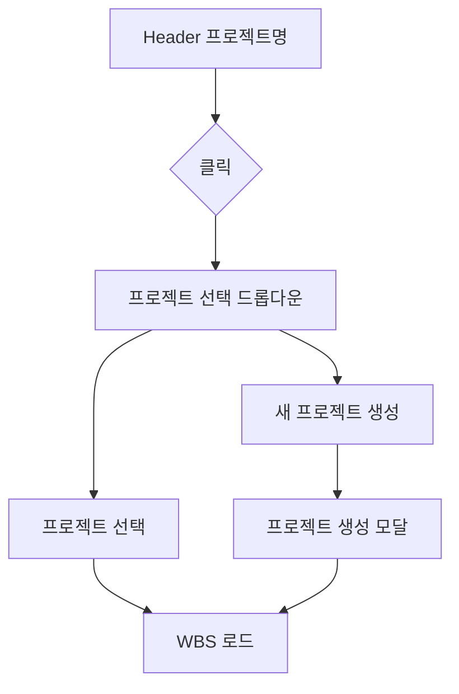

# 기본설계: 프로젝트 메타데이터 서비스

## 문서 정보
| 항목 | 내용 |
|------|------|
| Task ID | TSK-02-03-03 |
| Category | development |
| 상태 | [bd] 기본설계 |
| 상위 Activity | ACT-02-03 |
| 상위 Work Package | WP-02 |
| PRD 참조 | PRD 7.1 |
| 작성일 | 2025-12-14 |

---

## 1. 개요

### 1.1 목적
프로젝트별 메타데이터(project.json, team.json)를 관리하는 서비스를 구현합니다. 프로젝트 생성, 조회 및 팀원 관리 기능을 제공하여 WBS와 연동될 프로젝트 정보를 관리합니다.

### 1.2 구현 범위
> WBS Task 설명에서 추출

- project.json 읽기/쓰기
- team.json 읽기/쓰기
- 프로젝트 목록 조회

### 1.3 제외 범위
> 동일 PRD 섹션이지만 다른 Task에서 구현

- 전역 설정 (columns, categories, workflows, actions) → TSK-02-03-01, TSK-02-03-02
- 프로젝트 삭제/아카이브 (1차 범위 외)
- 팀원 역할/권한 관리 (1차 범위 외)

---

## 2. 사용자 시나리오

### 2.1 주요 사용자
- **관리자/팀장**: 프로젝트 생성 및 설정
- **개발자**: 프로젝트 정보 조회
- **시스템**: WBS 로드 시 프로젝트 정보 참조

### 2.2 사용 시나리오

**시나리오 1: 프로젝트 생성**
1. 사용자가 새 프로젝트 생성 요청
2. 시스템이 프로젝트 폴더 생성 (`.orchay/projects/{project-id}/`)
3. project.json 초기 파일 생성
4. team.json 초기 파일 생성 (빈 팀원 목록)
5. 프로젝트 목록(projects.json) 업데이트
6. 사용자에게 생성 완료 알림

**시나리오 2: 프로젝트 목록 조회**
1. 사용자가 대시보드 또는 프로젝트 선택기 접근
2. 시스템이 `.orchay/settings/projects.json` 로드
3. 각 프로젝트의 기본 정보 반환
4. 프로젝트 목록 UI에 표시

**시나리오 3: 프로젝트 상세 정보 조회**
1. 사용자가 특정 프로젝트 선택
2. 시스템이 project.json 로드
3. 시스템이 team.json 로드
4. 통합된 프로젝트 상세 정보 반환

**시나리오 4: 팀원 추가/수정**
1. 사용자가 팀원 관리 화면 접근
2. 팀원 정보 입력 (이름, 역할, 이메일)
3. team.json 업데이트
4. 변경사항 저장 완료

---

## 3. 기능 요구사항

### 3.1 프로젝트 목록 조회
**설명**: 등록된 모든 프로젝트 목록 조회
**입력**: 없음
**출력**: 프로젝트 목록 배열
**제약조건**: projects.json이 없으면 빈 배열 반환

### 3.2 프로젝트 상세 조회
**설명**: 특정 프로젝트의 메타데이터 조회
**입력**: 프로젝트 ID
**출력**: project.json + team.json 통합 데이터
**제약조건**: 프로젝트가 없으면 404 에러

### 3.3 프로젝트 생성
**설명**: 새 프로젝트 폴더 및 초기 파일 생성
**입력**: 프로젝트 기본 정보 (id, name, description)
**출력**: 생성된 프로젝트 정보
**제약조건**:
- 중복 ID 불가
- 폴더 및 파일 자동 생성

### 3.4 프로젝트 정보 수정
**설명**: 프로젝트 메타데이터 수정
**입력**: 프로젝트 ID, 수정할 필드
**출력**: 수정된 프로젝트 정보
**제약조건**: 프로젝트 ID는 수정 불가

### 3.5 팀원 목록 조회/수정
**설명**: 프로젝트 팀원 관리
**입력**: 프로젝트 ID, (수정 시) 팀원 목록
**출력**: 팀원 목록
**제약조건**: 팀원 ID는 프로젝트 내 고유

---

## 4. 비즈니스 규칙

| 규칙 ID | 규칙 설명 | 적용 시점 |
|---------|----------|----------|
| BR-001 | 프로젝트 ID는 영소문자, 숫자, 하이픈만 허용 | 프로젝트 생성 시 |
| BR-002 | 프로젝트 ID는 변경 불가 (폴더명과 동일) | 프로젝트 수정 시 |
| BR-003 | 팀원 ID는 프로젝트 내 고유해야 함 | 팀원 추가 시 |
| BR-004 | 프로젝트 생성 시 기본 폴더 구조 자동 생성 | 프로젝트 생성 시 |
| BR-005 | defaultProject 설정 시 유효한 프로젝트 ID 검증 | 설정 변경 시 |

---

## 5. 데이터 요구사항 (개념)

### 5.1 주요 데이터

| 데이터 | 설명 | 비즈니스 의미 |
|--------|------|--------------|
| Project | 프로젝트 메타데이터 | 프로젝트 기본 정보 |
| TeamMember | 팀원 정보 | Task 담당자 할당에 활용 |
| ProjectList | 프로젝트 목록 | 프로젝트 선택/전환에 활용 |

### 5.2 데이터 구조

**projects.json** (전역 프로젝트 목록):
```
ProjectsConfig
├── version: string
├── projects: ProjectListItem[]
│   ├── id: string
│   ├── name: string
│   ├── path: string
│   ├── status: "active" | "archived"
│   ├── wbsDepth: 3 | 4
│   └── createdAt: string
└── defaultProject: string
```

**project.json** (개별 프로젝트):
```
ProjectConfig
├── id: string
├── name: string
├── description: string
├── version: string
├── status: "active" | "archived"
├── createdAt: string
├── updatedAt: string
├── scheduledStart: string
└── scheduledEnd: string
```

**team.json** (팀원 목록):
```
TeamConfig
├── version: string
└── members: TeamMember[]
    ├── id: string
    ├── name: string
    ├── email: string
    ├── role: string
    ├── avatar: string (optional)
    └── active: boolean
```

---

## 6. 화면 요구사항 (개념)

### 6.1 화면 목록
| 화면 | 목적 | 주요 기능 |
|------|------|----------|
| 프로젝트 선택기 | 프로젝트 전환 | 목록 표시, 선택, 새 프로젝트 생성 |
| 프로젝트 설정 | 프로젝트 정보 관리 | 정보 조회/수정, 팀원 관리 |

### 6.2 화면 흐름


---

## 7. 인터페이스 요구사항 (개념)

### 7.1 Server-Side Service

| 함수 | 설명 | 입력 | 출력 |
|------|------|------|------|
| getProjectList() | 프로젝트 목록 조회 | 없음 | ProjectListItem[] |
| getProject(id) | 프로젝트 상세 조회 | 프로젝트 ID | ProjectDetail |
| createProject(data) | 프로젝트 생성 | CreateProjectDto | ProjectDetail |
| updateProject(id, data) | 프로젝트 수정 | ID, UpdateProjectDto | ProjectDetail |
| getTeam(projectId) | 팀원 목록 조회 | 프로젝트 ID | TeamMember[] |
| updateTeam(projectId, members) | 팀원 목록 수정 | ID, TeamMember[] | TeamMember[] |

### 7.2 REST API

| Method | Endpoint | 설명 | 응답 |
|--------|----------|------|------|
| GET | /api/projects | 프로젝트 목록 | ProjectListItem[] |
| GET | /api/projects/:id | 프로젝트 상세 | ProjectDetail |
| POST | /api/projects | 프로젝트 생성 | ProjectDetail |
| PUT | /api/projects/:id | 프로젝트 수정 | ProjectDetail |
| GET | /api/projects/:id/team | 팀원 목록 | TeamMember[] |
| PUT | /api/projects/:id/team | 팀원 수정 | TeamMember[] |

---

## 8. 수용 기준

- [ ] 프로젝트 목록 조회 정상 동작
- [ ] 프로젝트 상세 조회 정상 동작
- [ ] 프로젝트 생성 시 폴더/파일 자동 생성
- [ ] 팀원 조회/수정 정상 동작
- [ ] 존재하지 않는 프로젝트 접근 시 404 에러

---

## 9. 다음 단계
- `/wf:draft` 명령어로 상세설계 진행

---

## 관련 문서
- PRD: `.orchay/projects/orchay/prd.md` (섹션 7.1, 8.1)
- 선행 Task: TSK-02-01-02 (파일 읽기/쓰기 유틸리티)
- 공통 모듈: `.claude/includes/wf-common.md`
