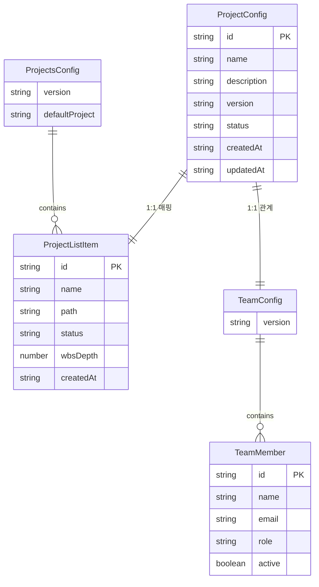
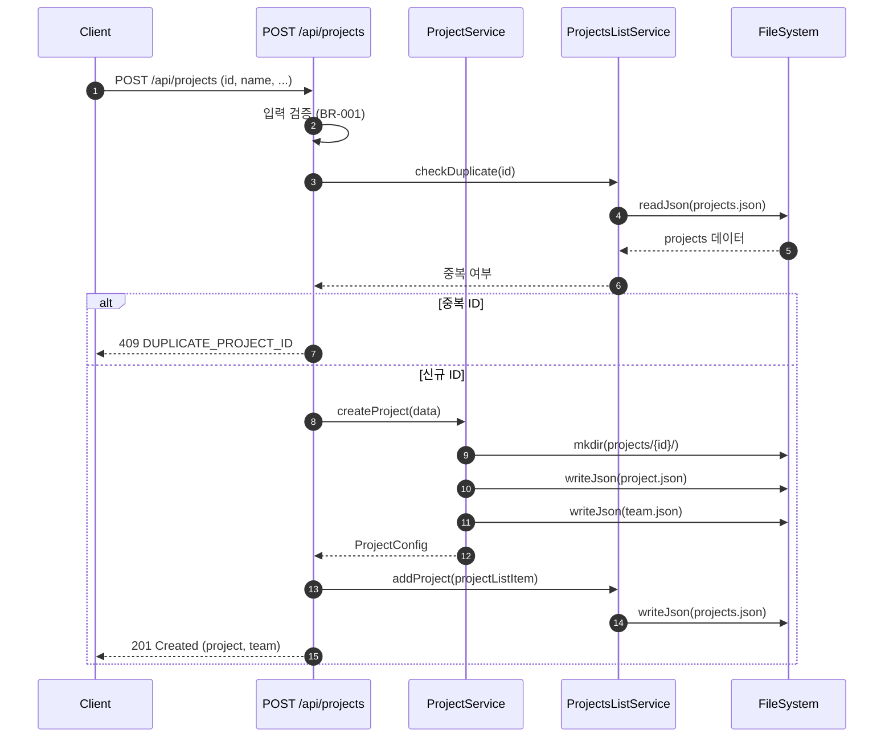
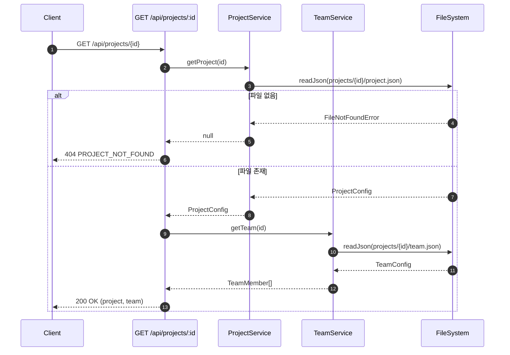

# 상세설계: 프로젝트 메타데이터 서비스

**Template Version:** 3.0.0 — **Last Updated:** 2025-12-14

> **설계 규칙**
> * *기능 중심 설계*에 집중한다.
> * 실제 소스코드(전체 또는 일부)는 **절대 포함하지 않는다**.
> * 작성 후 **상위 문서(PRD, TRD, 기본설계)와 비교**하여 차이가 있으면 **즉시 중단 → 차이 설명 → 지시 대기**.
> * **다이어그램 규칙**
>   * 프로세스: **Mermaid**만 사용
>   * UI 레이아웃: **Text Art(ASCII)** → 바로 아래 **SVG 개념도**를 순차 배치
>
> **분할 문서**
> * 요구사항 추적성: `025-traceability-matrix.md`
> * 테스트 명세: `026-test-specification.md`

---

## 0. 문서 메타데이터

| 항목 | 내용 |
|------|------|
| Task ID | TSK-02-03-03 |
| Task명 | 프로젝트 메타데이터 서비스 |
| Category | development |
| 상태 | [dd] 상세설계 |
| 작성일 | 2025-12-14 |
| 작성자 | Claude |

### 상위 문서 참조

| 문서 유형 | 경로 | 참조 섹션 |
|----------|------|----------|
| PRD | `.orchay/projects/orchay/prd.md` | 섹션 7.1, 8.1 |
| TRD | `.orchay/projects/orchay/trd.md` | 전체 |
| 기본설계 | `010-basic-design.md` | 전체 |
| 상위 Activity | ACT-02-03: Settings Service | - |
| 상위 Work Package | WP-02: Data Storage Layer | - |

### 분할 문서 참조

| 문서 유형 | 파일명 | 목적 |
|----------|--------|------|
| 추적성 매트릭스 | `025-traceability-matrix.md` | 요구사항 ↔ 설계 ↔ 테스트 추적 |
| 테스트 명세 | `026-test-specification.md` | 테스트 시나리오, 데이터, data-testid |

---

## 1. 일관성 검증 결과

> 상위 문서와의 일관성 검증 결과를 기록합니다.

### 1.1 검증 요약

| 구분 | 통과 | 경고 | 실패 |
|------|------|------|------|
| PRD ↔ 기본설계 | 5개 | 0개 | 0개 |
| 기본설계 ↔ 상세설계 | 6개 | 0개 | 0개 |
| TRD ↔ 상세설계 | 5개 | 0개 | 0개 |

### 1.2 검증 상세

| 검증 ID | 검증 항목 | 결과 | 비고 |
|---------|----------|------|------|
| CHK-PRD-01 | 기능 요구사항 완전성 | ✅ PASS | PRD 7.1, 8.1 요구사항 모두 포함 |
| CHK-PRD-02 | 비즈니스 규칙 일치성 | ✅ PASS | 5개 BR 모두 매핑 |
| CHK-PRD-03 | 용어 일관성 | ✅ PASS | 용어 통일됨 |
| CHK-PRD-04 | 범위 일치성 | ✅ PASS | 기본설계 범위 내 |
| CHK-PRD-05 | 데이터 구조 일치성 | ✅ PASS | PRD 7.1 구조 준수 |
| CHK-BD-01 | 기능 요구사항 완전성 | ✅ PASS | FR-001~FR-005 모두 구현 |
| CHK-BD-02 | 비즈니스 규칙 구현 명세 | ✅ PASS | BR-001~BR-005 구현 위치 명시 |
| CHK-BD-03 | 데이터 모델 일치성 | ✅ PASS | 기본설계 엔티티 반영 |
| CHK-BD-04 | 인터페이스 일치성 | ✅ PASS | 6개 API 엔드포인트 매핑 |
| CHK-BD-05 | 수용 기준 테스트 변환 | ✅ PASS | 5개 수용 기준 테스트케이스화 |
| CHK-BD-06 | 시나리오 흐름 일치성 | ✅ PASS | 4개 시나리오 반영 |
| CHK-TRD-01 | 기술 스택 준수 | ✅ PASS | Nuxt 3, Vue 3, TypeScript 사용 |
| CHK-TRD-02 | 아키텍처 패턴 준수 | ✅ PASS | Server Routes 패턴 준수 |
| CHK-TRD-03 | API 설계 규칙 준수 | ✅ PASS | RESTful 규칙 준수 |
| CHK-TRD-04 | 파일 시스템 규칙 준수 | ✅ PASS | .orchay/ 구조 준수 |
| CHK-TRD-05 | 에러 핸들링 표준 준수 | ✅ PASS | 표준 에러 응답 형식 사용 |

---

## 2. 목적 및 범위

### 2.1 목적
프로젝트별 메타데이터(project.json, team.json)를 관리하는 서비스를 구현하여, 프로젝트 생성/조회/수정 및 팀원 관리 기능을 제공합니다. WBS 트리 뷰 및 Task 상세 패널에서 프로젝트 정보를 참조할 수 있도록 합니다.

### 2.2 범위

**포함 범위** (기본설계 구현 범위의 기술적 구현 사항):
- 프로젝트 목록 조회 API 및 서비스
- 프로젝트 상세 조회 API 및 서비스
- 프로젝트 생성 API 및 서비스 (폴더/파일 자동 생성)
- 프로젝트 정보 수정 API 및 서비스
- 팀원 목록 조회/수정 API 및 서비스

**제외 범위** (다른 Task에서 구현):
- 전역 설정 (columns, categories, workflows, actions) → TSK-02-03-01, TSK-02-03-02
- 프로젝트 삭제/아카이브 (1차 범위 외)
- 팀원 역할/권한 관리 (1차 범위 외)

---

## 3. 기술 스택

> TRD 기준, 이 Task에서 사용하는 기술만 명시

| 구분 | 기술 | 버전 | 용도 |
|------|------|------|------|
| Backend | Nuxt 3 Server Routes | 3.18.x | API 서버 |
| Language | TypeScript | 5.6.x | 타입 안전성 |
| Data | JSON 파일 (.orchay/) | - | 데이터 저장 |
| Validation | Zod (권장) | - | 입력 검증 |
| Testing | Vitest | 2.x | 단위 테스트 |

---

## 4. 용어/가정/제약

### 4.1 용어 정의

| 용어 | 정의 |
|------|------|
| ProjectsConfig | 전역 프로젝트 목록 설정 (.orchay/settings/projects.json) |
| ProjectConfig | 개별 프로젝트 메타데이터 (.orchay/projects/{id}/project.json) |
| TeamConfig | 프로젝트 팀원 목록 (.orchay/projects/{id}/team.json) |
| ProjectDetail | project.json + team.json 통합 응답 |

### 4.2 가정 (Assumptions)
- TSK-02-01-02 (파일 읽기/쓰기 유틸리티)가 완료된 상태
- TSK-02-03-02 (설정 서비스)가 완료되어 SettingsService 사용 가능
- .orchay/ 폴더 구조가 TSK-02-01-01에서 생성됨

### 4.3 제약 (Constraints)
- 파일 시스템 기반으로만 데이터 저장 (DB 사용 불가)
- 동시 쓰기 시 파일 락 미지원 (단일 사용자 환경 가정)
- 프로젝트 ID는 폴더명으로 사용되므로 파일 시스템 제약 적용

---

## 5. 시스템/모듈 구조

> **규칙**: 구현 코드가 아닌 **구조/역할/책임**만 표현

### 5.1 모듈 역할 및 책임

| 모듈 | 역할 | 책임 |
|------|------|------|
| ProjectPaths | 프로젝트 경로 관리 | 경로 생성, 경로 검증 (DR-001 반영) |
| ProjectService | 프로젝트 메타데이터 관리 | 프로젝트 CRUD, 폴더 생성 |
| TeamService | 팀원 정보 관리 | 팀원 조회/수정, 중복 검증 |
| ProjectsListService | 전역 프로젝트 목록 관리 | projects.json CRUD |
| ProjectFacade | 프로젝트 작업 조율 | 서비스 간 조율 (DR-002 반영) |
| Server API Handlers | HTTP 요청 처리 | 입력 검증, 서비스 호출, 응답 포맷팅 |

### 5.2 모듈 구조도 (개념)

```
server/
├── api/
│   └── projects/
│       ├── index.get.ts              # GET /api/projects (목록)
│       ├── index.post.ts             # POST /api/projects (생성)
│       ├── [id].get.ts               # GET /api/projects/:id (상세)
│       ├── [id].put.ts               # PUT /api/projects/:id (수정)
│       └── [id]/
│           └── team.ts               # GET/PUT /api/projects/:id/team
└── utils/
    ├── projects/
    │   ├── paths.ts                  # 프로젝트 경로 관리 (신규, DR-001)
    │   ├── projectService.ts         # 프로젝트 서비스
    │   ├── teamService.ts            # 팀원 서비스
    │   ├── projectsListService.ts    # 프로젝트 목록 서비스
    │   └── projectFacade.ts          # 서비스 조율 Facade (DR-002)
    ├── validators/
    │   └── projectValidators.ts      # 입력 검증 스키마 (Zod, DR-003)
    └── errors/
        └── standardError.ts          # 표준 에러 헬퍼 (DR-004)
```

### 5.3 외부 의존성

| 의존성 | 유형 | 용도 |
|--------|------|------|
| FileSystemService | 내부 서비스 | JSON 파일 읽기/쓰기 (TSK-02-01-02) |
| SettingsService | 내부 서비스 | 기본 설정 조회 (TSK-02-03-02) |
| SettingsPaths | 내부 모듈 | 기본 경로 조회 (TSK-02-03-02, DR-001 참조) |
| Node.js fs/promises | 표준 라이브러리 | 폴더 생성, 파일 존재 확인 |
| Zod | 외부 라이브러리 | 입력 검증 스키마 (DR-003) |

### 5.4 경로 관리 패턴 (DR-001 반영)

> **핵심**: 모든 프로젝트 경로는 `paths.ts` 모듈을 통해 생성하며, 하드코딩 금지

```
ProjectPaths 모듈 함수:
├── getProjectsBasePath()           # .orchay/projects 기본 경로
├── getProjectDir(projectId)        # .orchay/projects/{id}
├── getProjectFilePath(projectId, fileName)  # project.json, team.json 경로
└── validateProjectId(projectId)    # 경로 탐색 공격 방지 (DR-009)
```

| 함수 | 반환 예시 | 설명 |
|------|----------|------|
| `getProjectsBasePath()` | `.orchay/projects` | runtimeConfig.orchayBasePath 활용 |
| `getProjectDir('my-project')` | `.orchay/projects/my-project` | 프로젝트 폴더 |
| `getProjectFilePath('my-project', 'project.json')` | `.orchay/projects/my-project/project.json` | 프로젝트 파일 |
| `validateProjectId('../hack')` | Error | 경로 탐색 공격 방지 |

---

## 6. 데이터 모델 (개념 수준)

> **규칙**: 코드가 아닌 **개념 수준 ERD와 필드 정의**만 기술

### 6.1 엔티티 정의

#### Entity: ProjectsConfig (전역 프로젝트 목록)

| 필드명 | 타입 | 필수 | 설명 | 제약조건 |
|--------|------|------|------|----------|
| version | String | Y | 설정 버전 | 예: "1.0" |
| projects | Array | Y | 프로젝트 목록 | ProjectListItem[] |
| defaultProject | String | N | 기본 프로젝트 ID | 유효한 프로젝트 ID |

#### Entity: ProjectListItem (프로젝트 목록 항목)

| 필드명 | 타입 | 필수 | 설명 | 제약조건 |
|--------|------|------|------|----------|
| id | String | Y | 프로젝트 ID | 영소문자, 숫자, 하이픈만 |
| name | String | Y | 프로젝트 표시명 | 1-100자 |
| path | String | Y | 프로젝트 폴더명 | ID와 동일 |
| status | Enum | Y | 상태 | "active" \| "archived" |
| wbsDepth | Number | Y | WBS 깊이 | 3 \| 4 |
| createdAt | String | Y | 생성일 | ISO 날짜 형식 |

#### Entity: ProjectConfig (개별 프로젝트)

| 필드명 | 타입 | 필수 | 설명 | 제약조건 |
|--------|------|------|------|----------|
| id | String | Y | 프로젝트 ID | PK, 영소문자/숫자/하이픈 |
| name | String | Y | 프로젝트명 | 1-100자 |
| description | String | N | 설명 | 최대 1000자 |
| version | String | Y | 프로젝트 버전 | 예: "0.1.0" |
| status | Enum | Y | 상태 | "active" \| "archived" |
| createdAt | String | Y | 생성일시 | ISO 8601 |
| updatedAt | String | Y | 수정일시 | ISO 8601 |
| scheduledStart | String | N | 예정 시작일 | ISO 날짜 |
| scheduledEnd | String | N | 예정 종료일 | ISO 날짜 |

#### Entity: TeamConfig (팀원 목록)

| 필드명 | 타입 | 필수 | 설명 | 제약조건 |
|--------|------|------|------|----------|
| version | String | Y | 설정 버전 | 예: "1.0" |
| members | Array | Y | 팀원 목록 | TeamMember[] |

#### Entity: TeamMember (팀원)

| 필드명 | 타입 | 필수 | 설명 | 제약조건 |
|--------|------|------|------|----------|
| id | String | Y | 팀원 ID | 프로젝트 내 고유 |
| name | String | Y | 이름 | 1-50자 |
| email | String | N | 이메일 | 이메일 형식 |
| role | String | N | 역할 | 자유 입력 |
| avatar | String | N | 아바타 URL | URL 또는 경로 |
| active | Boolean | Y | 활성 상태 | 기본값: true |

### 6.2 관계 다이어그램



### 6.3 파일 저장 위치

| 엔티티 | 파일 경로 | 비고 |
|--------|----------|------|
| ProjectsConfig | `.orchay/settings/projects.json` | 전역 설정 |
| ProjectConfig | `.orchay/projects/{id}/project.json` | 프로젝트별 |
| TeamConfig | `.orchay/projects/{id}/team.json` | 프로젝트별 |

---

## 7. 인터페이스 계약 (API Contract)

> **규칙**: TypeScript 코드가 아닌 **표 형태의 계약 정의**

### 7.1 엔드포인트 목록

| Method | Endpoint | 설명 | 요구사항 |
|--------|----------|------|----------|
| GET | /api/projects | 프로젝트 목록 조회 | FR-001 |
| GET | /api/projects/:id | 프로젝트 상세 조회 | FR-002 |
| POST | /api/projects | 프로젝트 생성 | FR-003 |
| PUT | /api/projects/:id | 프로젝트 수정 | FR-004 |
| GET | /api/projects/:id/team | 팀원 목록 조회 | FR-005 |
| PUT | /api/projects/:id/team | 팀원 목록 수정 | FR-005 |

### 7.2 API 상세: GET /api/projects (프로젝트 목록)

**요구사항**: FR-001

#### 요청 (Request)

| 구분 | 파라미터 | 타입 | 필수 | 설명 | 기본값 |
|------|----------|------|------|------|--------|
| Query | status | string | N | 상태 필터 (active/archived) | - |

#### 응답 (Response)

**성공 응답 (200)**:

| 필드 | 타입 | 설명 |
|------|------|------|
| projects | ProjectListItem[] | 프로젝트 목록 |
| defaultProject | string \| null | 기본 프로젝트 ID |
| total | number | 총 프로젝트 수 |

**에러 응답**:

| 코드 | 에러 코드 | 설명 | 비즈니스 규칙 |
|------|----------|------|--------------|
| 500 | FILE_READ_ERROR | 설정 파일 읽기 실패 | - |

---

### 7.3 API 상세: GET /api/projects/:id (프로젝트 상세)

**요구사항**: FR-002

#### 요청 (Request)

| 구분 | 파라미터 | 타입 | 필수 | 설명 | 기본값 |
|------|----------|------|------|------|--------|
| Path | id | string | Y | 프로젝트 ID | - |

#### 응답 (Response)

**성공 응답 (200)**:

| 필드 | 타입 | 설명 |
|------|------|------|
| project | ProjectConfig | 프로젝트 정보 |
| team | TeamMember[] | 팀원 목록 |

**에러 응답**:

| 코드 | 에러 코드 | 설명 | 비즈니스 규칙 |
|------|----------|------|--------------|
| 404 | PROJECT_NOT_FOUND | 프로젝트 없음 | - |
| 500 | FILE_READ_ERROR | 파일 읽기 실패 | - |

---

### 7.4 API 상세: POST /api/projects (프로젝트 생성)

**요구사항**: FR-003

#### 요청 (Request)

| 구분 | 파라미터 | 타입 | 필수 | 설명 | 기본값 |
|------|----------|------|------|------|--------|
| Body | id | string | Y | 프로젝트 ID | - |
| Body | name | string | Y | 프로젝트명 | - |
| Body | description | string | N | 설명 | "" |
| Body | wbsDepth | number | N | WBS 깊이 | 4 |
| Body | scheduledStart | string | N | 시작 예정일 | - |
| Body | scheduledEnd | string | N | 종료 예정일 | - |

#### 유효성 검증

| 필드 | 규칙 | 에러 메시지 | 비즈니스 규칙 |
|------|------|------------|--------------|
| id | required, 영소문자/숫자/하이픈만 | 프로젝트 ID는 영소문자, 숫자, 하이픈만 허용됩니다 | BR-001 |
| id | unique | 이미 존재하는 프로젝트 ID입니다 | - |
| name | required, 1-100자 | 프로젝트명은 1-100자여야 합니다 | - |
| wbsDepth | 3 또는 4 | WBS 깊이는 3 또는 4여야 합니다 | - |

#### 응답 (Response)

**성공 응답 (201)**:

| 필드 | 타입 | 설명 |
|------|------|------|
| project | ProjectConfig | 생성된 프로젝트 정보 |
| team | TeamMember[] | 빈 팀원 목록 |

**에러 응답**:

| 코드 | 에러 코드 | 설명 | 비즈니스 규칙 |
|------|----------|------|--------------|
| 400 | VALIDATION_ERROR | 유효성 검증 실패 | BR-001 |
| 409 | DUPLICATE_PROJECT_ID | 중복 프로젝트 ID | - |
| 500 | FILE_WRITE_ERROR | 파일/폴더 생성 실패 | - |

---

### 7.5 API 상세: PUT /api/projects/:id (프로젝트 수정)

**요구사항**: FR-004

#### 요청 (Request)

| 구분 | 파라미터 | 타입 | 필수 | 설명 | 기본값 |
|------|----------|------|------|------|--------|
| Path | id | string | Y | 프로젝트 ID | - |
| Body | name | string | N | 프로젝트명 | - |
| Body | description | string | N | 설명 | - |
| Body | version | string | N | 버전 | - |
| Body | status | string | N | 상태 | - |
| Body | scheduledStart | string | N | 시작 예정일 | - |
| Body | scheduledEnd | string | N | 종료 예정일 | - |

#### 유효성 검증

| 필드 | 규칙 | 에러 메시지 | 비즈니스 규칙 |
|------|------|------------|--------------|
| id (Body) | 수정 불가 | 프로젝트 ID는 변경할 수 없습니다 | BR-002 |
| name | 1-100자 | 프로젝트명은 1-100자여야 합니다 | - |
| status | active/archived | 상태는 active 또는 archived여야 합니다 | - |

#### 응답 (Response)

**성공 응답 (200)**:

| 필드 | 타입 | 설명 |
|------|------|------|
| project | ProjectConfig | 수정된 프로젝트 정보 |

**에러 응답**:

| 코드 | 에러 코드 | 설명 | 비즈니스 규칙 |
|------|----------|------|--------------|
| 400 | VALIDATION_ERROR | 유효성 검증 실패 | - |
| 400 | ID_IMMUTABLE | ID 변경 시도 | BR-002 |
| 404 | PROJECT_NOT_FOUND | 프로젝트 없음 | - |

---

### 7.6 API 상세: GET/PUT /api/projects/:id/team (팀원 관리)

**요구사항**: FR-005

#### GET 요청 (Request)

| 구분 | 파라미터 | 타입 | 필수 | 설명 | 기본값 |
|------|----------|------|------|------|--------|
| Path | id | string | Y | 프로젝트 ID | - |

#### GET 응답 (200)

| 필드 | 타입 | 설명 |
|------|------|------|
| members | TeamMember[] | 팀원 목록 |
| total | number | 총 팀원 수 |

#### PUT 요청 (Request)

| 구분 | 파라미터 | 타입 | 필수 | 설명 | 기본값 |
|------|----------|------|------|------|--------|
| Path | id | string | Y | 프로젝트 ID | - |
| Body | members | TeamMember[] | Y | 팀원 목록 | - |

#### PUT 유효성 검증

| 필드 | 규칙 | 에러 메시지 | 비즈니스 규칙 |
|------|------|------------|--------------|
| members[].id | unique | 팀원 ID가 중복됩니다 | BR-003 |
| members[].name | required, 1-50자 | 팀원 이름은 1-50자여야 합니다 | - |
| members[].email | email 형식 | 올바른 이메일 형식이 아닙니다 | - |

#### PUT 에러 응답

| 코드 | 에러 코드 | 설명 | 비즈니스 규칙 |
|------|----------|------|--------------|
| 400 | DUPLICATE_MEMBER_ID | 팀원 ID 중복 | BR-003 |
| 404 | PROJECT_NOT_FOUND | 프로젝트 없음 | - |

---

## 8. 프로세스 흐름

### 8.1 프로젝트 생성 프로세스

> 각 단계에 관련 요구사항 태그 `[FR-XXX]` 병기

1. **요청 수신** [FR-003]: 클라이언트에서 프로젝트 생성 요청
2. **입력 검증** [BR-001]: 프로젝트 ID 형식 검증 (영소문자, 숫자, 하이픈)
3. **중복 확인**: projects.json에서 동일 ID 존재 여부 확인
4. **폴더 생성** [BR-004]: `.orchay/projects/{id}/` 폴더 생성
5. **초기 파일 생성** [BR-004]: project.json, team.json 생성
6. **목록 업데이트**: projects.json에 새 프로젝트 추가
7. **응답 반환**: 생성된 프로젝트 정보 반환

### 8.2 시퀀스 다이어그램: 프로젝트 생성



### 8.3 시퀀스 다이어그램: 프로젝트 상세 조회



---

## 9. UI 설계

> 이 Task는 백엔드 서비스이므로 UI 설계는 프론트엔드 연동 화면 개념만 포함

### 9.1 연동 화면 목록

| 화면 | 사용 API | 목적 |
|------|----------|------|
| 프로젝트 선택기 (Header) | GET /api/projects | 프로젝트 목록 드롭다운 |
| 프로젝트 생성 모달 | POST /api/projects | 새 프로젝트 생성 |
| 프로젝트 설정 페이지 | GET/PUT /api/projects/:id | 프로젝트 정보 조회/수정 |
| 팀원 관리 탭 | GET/PUT /api/projects/:id/team | 팀원 조회/수정 |

### 9.2 프로젝트 선택기 연동 개념

```
┌────────────────────────────────────────────────────────────┐
│ Header                                                      │
│ ┌──────────────────┐                                       │
│ │ 🏠 orchay        │  [프로젝트명 ▼]  대시보드 칸반 WBS    │
│ └──────────────────┘                                       │
│                      ┌─────────────────────────┐           │
│                      │ ✓ orchay               │           │
│                      │   sample-project       │           │
│                      ├─────────────────────────┤           │
│                      │ + 새 프로젝트 생성      │           │
│                      └─────────────────────────┘           │
└────────────────────────────────────────────────────────────┘
```

---

## 10. 비즈니스 규칙 구현 명세

> 기본설계 BR-XXX 규칙의 구현 방안

| 규칙 ID | 규칙 설명 | 구현 위치(개념) | 구현 방식(개념) | 검증 방법 |
|---------|----------|-----------------|-----------------|-----------|
| BR-001 | 프로젝트 ID는 영소문자, 숫자, 하이픈만 허용 | API Validator | 정규식 `/^[a-z0-9-]+$/` 검증 | 단위 테스트 UT-001 |
| BR-002 | 프로젝트 ID는 변경 불가 | API Handler | Body에 id 포함 시 에러 반환 | 단위 테스트 UT-005 |
| BR-003 | 팀원 ID는 프로젝트 내 고유 | TeamService | Set으로 중복 체크 | 단위 테스트 UT-007 |
| BR-004 | 프로젝트 생성 시 폴더 구조 자동 생성 | ProjectService | fs.mkdir + writeJson 호출 | E2E 테스트 E2E-002 |
| BR-005 | defaultProject 설정 시 유효 ID 검증 | ProjectsListService | projects 배열에서 존재 확인 | 단위 테스트 UT-009 |

---

## 11. 오류/예외 처리

### 11.1 표준 에러 응답 형식 (DR-004 반영)

> **참조**: TSK-02-03-02 에러 처리 패턴과 일관성 유지

모든 에러 응답은 다음 형식을 따릅니다:

| 필드 | 타입 | 설명 |
|------|------|------|
| statusCode | number | HTTP 상태 코드 |
| statusMessage | string | 에러 코드 (예: PROJECT_NOT_FOUND) |
| message | string | 사용자 메시지 |
| data.timestamp | string | 에러 발생 시각 (ISO 8601) |

**표준 에러 헬퍼 함수** (`server/utils/errors/standardError.ts`):
```
createStandardError(statusCode, statusMessage, message)
└── 반환: { statusCode, statusMessage, message, data: { timestamp } }
```

### 11.2 예상 오류 상황

| 오류 상황 | 오류 코드 | HTTP 코드 | 사용자 메시지 | 복구 전략 |
|----------|----------|-----------|--------------|----------|
| 프로젝트 없음 | PROJECT_NOT_FOUND | 404 | 요청한 프로젝트를 찾을 수 없습니다 | 프로젝트 목록으로 이동 |
| 중복 프로젝트 ID | DUPLICATE_PROJECT_ID | 409 | 이미 존재하는 프로젝트 ID입니다 | 다른 ID 입력 안내 |
| ID 형식 오류 | INVALID_PROJECT_ID | 400 | 프로젝트 ID는 영소문자, 숫자, 하이픈만 허용됩니다 | 올바른 형식 안내 |
| ID 변경 시도 | ID_IMMUTABLE | 400 | 프로젝트 ID는 변경할 수 없습니다 | id 필드 제거 안내 |
| 팀원 ID 중복 | DUPLICATE_MEMBER_ID | 400 | 팀원 ID가 중복됩니다 | 고유 ID 입력 안내 |
| 경로 탐색 공격 | INVALID_PROJECT_ID | 400 | 잘못된 프로젝트 ID 형식입니다 | 올바른 형식 안내 (DR-009) |
| 파일 읽기 실패 | FILE_READ_ERROR | 500 | 데이터를 읽는 중 오류가 발생했습니다 | 재시도 버튼 제공 |
| 파일 쓰기 실패 | FILE_WRITE_ERROR | 500 | 데이터를 저장하는 중 오류가 발생했습니다 | 재시도 버튼 제공 |

### 11.3 경계 조건

| 조건 | 처리 방안 |
|------|----------|
| projects.json 없음 | 빈 배열 반환 (기본값 처리) |
| team.json 없음 | 빈 팀원 목록 반환 |
| 프로젝트 폴더 없음 | 404 PROJECT_NOT_FOUND |
| 빈 프로젝트 목록 | 빈 배열 정상 반환 |

---

## 12. 구현 체크리스트

### 인프라 (DR 반영 항목)
- [ ] paths.ts 모듈 구현 (DR-001 경로 관리)
- [ ] validateProjectId 보안 함수 구현 (DR-009 경로 탐색 방지)
- [ ] standardError.ts 헬퍼 구현 (DR-004 에러 일관성)
- [ ] projectValidators.ts Zod 스키마 구현 (DR-003 검증 집중화)

### Backend
- [ ] ProjectService 구현 (CRUD)
- [ ] TeamService 구현 (조회/수정)
- [ ] ProjectsListService 구현
- [ ] ProjectFacade 구현 (DR-002 서비스 조율)
- [ ] GET /api/projects 엔드포인트
- [ ] POST /api/projects 엔드포인트
- [ ] GET /api/projects/:id 엔드포인트
- [ ] PUT /api/projects/:id 엔드포인트
- [ ] GET /api/projects/:id/team 엔드포인트
- [ ] PUT /api/projects/:id/team 엔드포인트
- [ ] 에러 핸들링 (표준 에러 형식)
- [ ] 단위 테스트

### 품질
- [ ] 요구사항 추적성 검증 완료 (`025-traceability-matrix.md`)
- [ ] 테스트 명세 작성 완료 (`026-test-specification.md`)
- [ ] 비즈니스 규칙 구현 완료 (BR-001~BR-005)
- [ ] 설계 리뷰 지적사항 반영 완료 (DR-001~DR-004, DR-009)
- [ ] 일관성 검증 통과

---

## 13. 다음 단계

- `/wf:review` 명령어로 설계리뷰 진행
- `/wf:build` 명령어로 구현 시작

---

## 관련 문서

- 기본설계: `010-basic-design.md`
- 추적성 매트릭스: `025-traceability-matrix.md`
- 테스트 명세: `026-test-specification.md`
- PRD: `.orchay/projects/orchay/prd.md`
- TRD: `.orchay/projects/orchay/trd.md`

---

<!--
author: Claude
Created: 2025-12-14
Task: TSK-02-03-03 프로젝트 메타데이터 서비스 상세설계
-->
