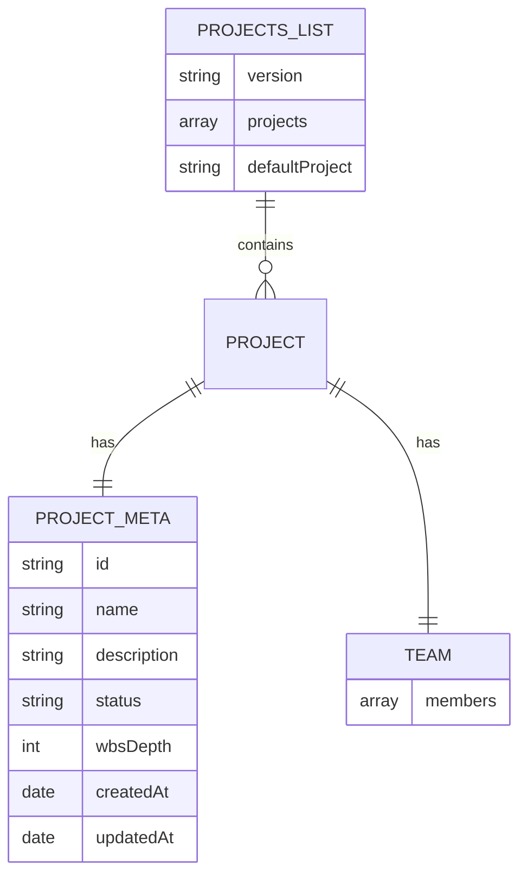
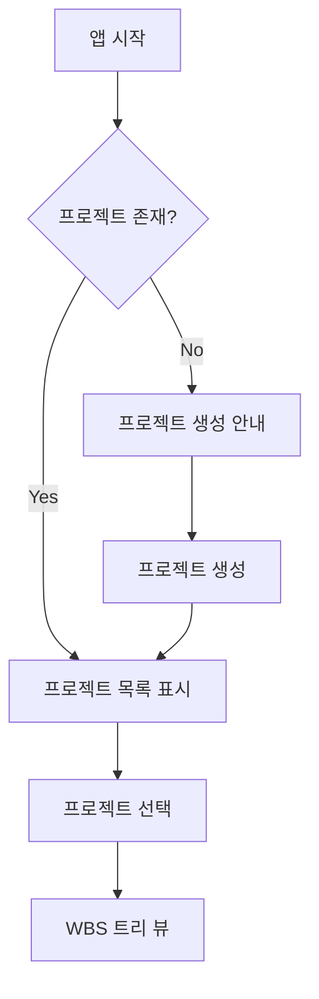

# 기본설계: Project API

## 문서 정보
| 항목 | 내용 |
|------|------|
| Task ID | TSK-03-01 |
| Category | development |
| 상태 | [bd] 기본설계 |
| 상위 Work Package | WP-03: Backend API & Workflow |
| PRD 참조 | 8.1 Server Routes (Nuxt) |
| 작성일 | 2025-12-14 |

---

## 1. 개요

### 1.1 목적
프로젝트 관리를 위한 REST API 구현. 사용자가 orchay 시스템에서 프로젝트를 조회, 생성할 수 있도록 백엔드 API 엔드포인트를 제공합니다.

### 1.2 구현 범위
> WBS Task 설명에서 추출

- GET /api/projects - 프로젝트 목록 조회
- GET /api/projects/:id - 프로젝트 상세 조회 (project.json, team.json 포함)
- POST /api/projects - 프로젝트 생성 (폴더, 초기 파일 생성)

### 1.3 제외 범위
> 동일 PRD 섹션이지만 다른 Task에서 구현

- PUT /api/projects/:id/wbs → TSK-03-02 (WBS API)
- GET /api/projects/:id/wbs → TSK-03-02 (WBS API)
- GET/PUT /api/tasks/:id → TSK-03-02 (WBS API)
- POST /api/tasks/:id/transition → TSK-03-03 (Workflow API)
- GET /api/settings/:type → TSK-03-03 (Workflow API)

---

## 2. 사용자 시나리오

### 2.1 주요 사용자
- **개발자**: orchay 웹 UI를 통해 프로젝트 목록 조회 및 선택
- **프로젝트 관리자**: 새 프로젝트 생성 및 초기 설정

### 2.2 사용 시나리오

**시나리오 1: 프로젝트 목록 조회**
1. 사용자가 orchay 웹 UI에 접속
2. 시스템이 /api/projects 호출
3. 등록된 모든 프로젝트 목록 표시
4. 사용자가 프로젝트 선택

**시나리오 2: 프로젝트 상세 조회**
1. 사용자가 프로젝트 목록에서 특정 프로젝트 클릭
2. 시스템이 /api/projects/:id 호출
3. 프로젝트 메타데이터(project.json)와 팀원 정보(team.json) 표시

**시나리오 3: 새 프로젝트 생성**
1. 사용자가 "새 프로젝트" 버튼 클릭
2. 프로젝트 정보 입력 (ID, 이름, 설명)
3. 시스템이 /api/projects POST 호출
4. 프로젝트 폴더 구조 및 초기 파일 자동 생성
5. 새 프로젝트가 목록에 추가됨

---

## 3. 기능 요구사항
> PRD 8.1에서 범위 내 항목만 추출

### 3.1 GET /api/projects - 프로젝트 목록 조회
**설명**: 등록된 모든 프로젝트의 요약 정보 반환
**입력**: 없음
**출력**: 프로젝트 배열 (id, name, status, wbsDepth 등)
**제약조건**:
- .orchay/settings/projects.json 파일 기반
- 파일 없으면 빈 배열 반환

### 3.2 GET /api/projects/:id - 프로젝트 상세 조회
**설명**: 특정 프로젝트의 전체 정보 반환
**입력**: 프로젝트 ID (URL 파라미터)
**출력**: 프로젝트 메타데이터 + 팀원 정보
**제약조건**:
- .orchay/projects/{id}/project.json 읽기
- .orchay/projects/{id}/team.json 읽기
- 존재하지 않는 프로젝트는 404 반환

### 3.3 POST /api/projects - 프로젝트 생성
**설명**: 새 프로젝트 폴더 및 초기 파일 생성
**입력**: 프로젝트 정보 (id, name, description, wbsDepth)
**출력**: 생성된 프로젝트 정보
**제약조건**:
- 중복 ID 체크
- 프로젝트 폴더 생성 (.orchay/projects/{id}/)
- project.json, team.json, wbs.md 초기 파일 생성
- settings/projects.json에 프로젝트 추가

---

## 4. 비즈니스 규칙
> PRD에서 추출한 범위 내 규칙만

| 규칙 ID | 규칙 설명 | 적용 시점 |
|---------|----------|----------|
| BR-001 | 프로젝트 ID는 영문소문자, 숫자, 하이픈만 허용 | 프로젝트 생성 시 |
| BR-002 | 프로젝트 ID는 고유해야 함 | 프로젝트 생성 시 |
| BR-003 | wbsDepth는 3 또는 4만 허용 | 프로젝트 생성 시 |
| BR-004 | 프로젝트 상태는 active, archived 중 하나 | 프로젝트 조회/생성 시 |

---

## 5. 데이터 요구사항 (개념)
> 비즈니스 관점의 데이터 정의

### 5.1 주요 데이터
| 데이터 | 설명 | 비즈니스 의미 |
|--------|------|--------------|
| projects.json | 전체 프로젝트 목록 | 시스템에 등록된 모든 프로젝트 관리 |
| project.json | 개별 프로젝트 메타데이터 | 프로젝트의 기본 정보 및 설정 |
| team.json | 팀원 목록 | 프로젝트 참여자 정보 |

### 5.2 데이터 관계

---

## 6. 화면 요구사항 (개념)
> 사용자 관점의 화면 정의

### 6.1 화면 목록
| 화면 | 목적 | 주요 기능 |
|------|------|----------|
| 프로젝트 선택 | 작업할 프로젝트 선택 | 목록 표시, 프로젝트 전환 |
| 프로젝트 생성 | 새 프로젝트 등록 | 정보 입력, 생성 |

> Note: 화면 구현은 프론트엔드 Task (WP-04, WP-05)에서 담당
> 본 Task는 백엔드 API만 구현

### 6.2 화면 흐름

---

## 7. 인터페이스 요구사항 (개념)
> 비즈니스 관점의 API 정의

| 기능 | 설명 | 입력 | 출력 |
|------|------|------|------|
| 목록 조회 | 전체 프로젝트 확인 | - | 프로젝트 배열 |
| 상세 조회 | 특정 프로젝트 정보 | 프로젝트 ID | 프로젝트 상세 + 팀원 |
| 생성 | 새 프로젝트 등록 | 프로젝트 정보 | 생성된 프로젝트 |

---

## 8. 수용 기준
> 비즈니스 관점의 완료 조건

- [ ] GET /api/projects가 프로젝트 목록 반환
- [ ] GET /api/projects/:id가 프로젝트 상세 정보 반환
- [ ] POST /api/projects가 프로젝트 폴더 및 파일 생성
- [ ] 존재하지 않는 프로젝트 조회 시 404 반환
- [ ] 중복 프로젝트 ID 생성 시 400 반환
- [ ] 잘못된 프로젝트 ID 형식 시 400 반환

---

## 9. 다음 단계
- `/wf:draft TSK-03-01` 명령어로 상세설계 진행

---

## 관련 문서
- 프로젝트 정보: `.orchay/projects/orchay/project.json`
- PRD: `.orchay/projects/orchay/prd.md`
