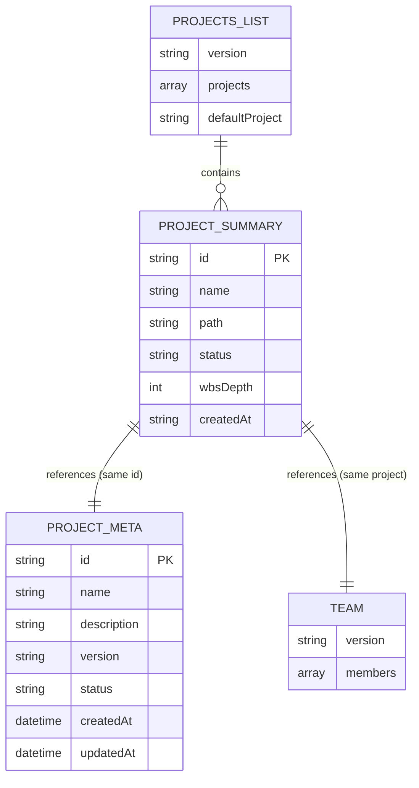
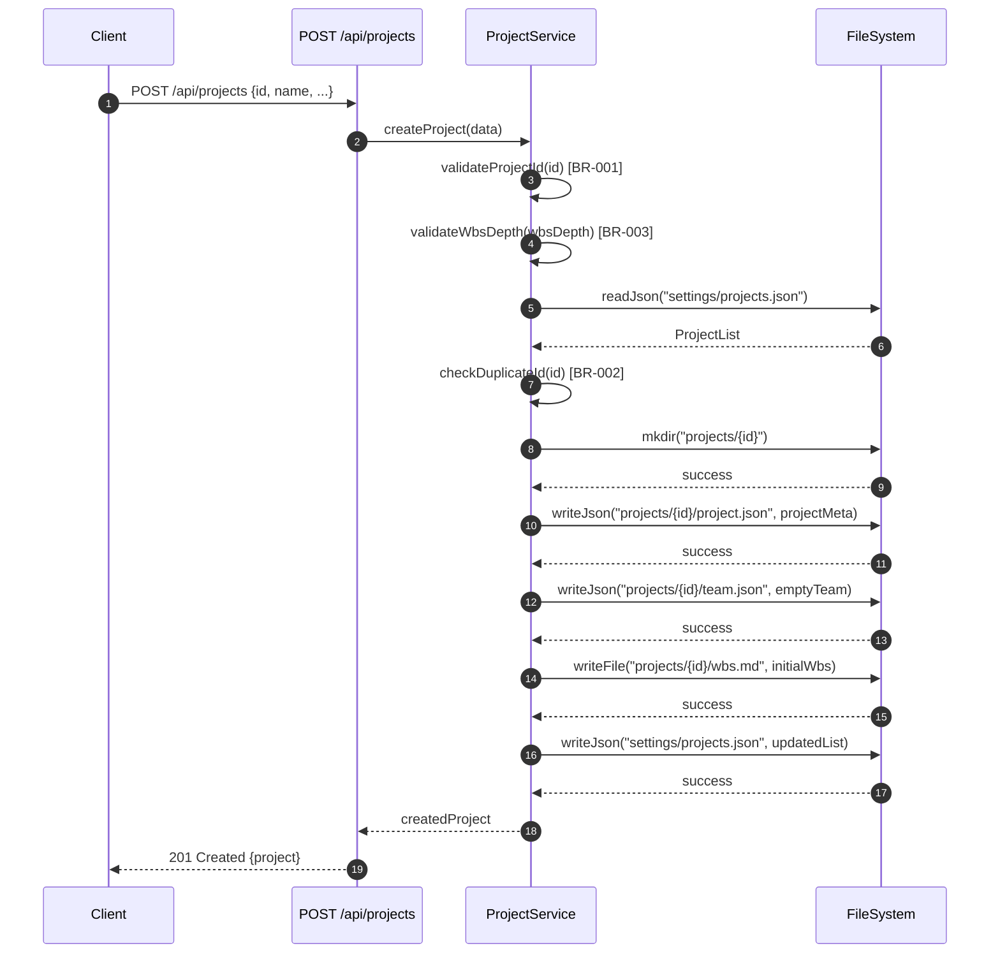
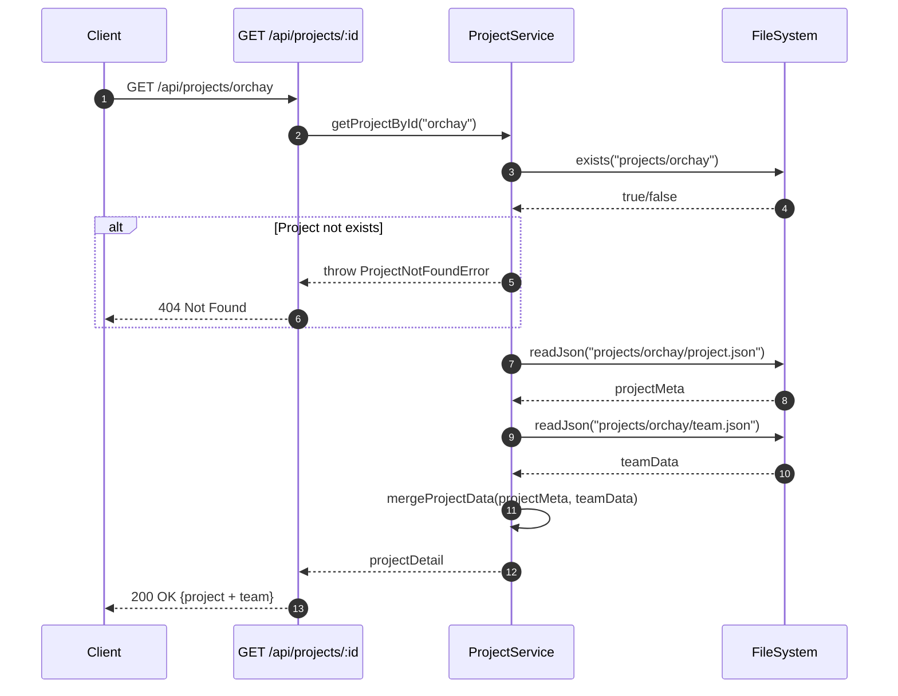

# 상세설계: Project API

**Template Version:** 3.0.0 — **Last Updated:** 2025-12-14

> **설계 규칙**
> * *기능 중심 설계*에 집중한다.
> * 실제 소스코드(전체 또는 일부)는 **절대 포함하지 않는다**.
> * 작성 후 **상위 문서(PRD, TRD, 기본설계)와 비교**하여 차이가 있으면 **즉시 중단 → 차이 설명 → 지시 대기**.
> * **다이어그램 규칙**
>   * 프로세스: **Mermaid**만 사용
>   * UI 레이아웃: **Text Art(ASCII)** → 바로 아래 **SVG 개념도**를 순차 배치
>
> **분할 문서**
> * 요구사항 추적성: `025-traceability-matrix.md`
> * 테스트 명세: `026-test-specification.md`

---

## 0. 문서 메타데이터

| 항목 | 내용 |
|------|------|
| Task ID | TSK-03-01 |
| Task명 | Project API |
| Category | development |
| 상태 | [dd] 상세설계 |
| 작성일 | 2025-12-14 |
| 작성자 | Claude |

### 상위 문서 참조

| 문서 유형 | 경로 | 참조 섹션 |
|----------|------|----------|
| PRD | `.orchay/projects/orchay/prd.md` | 8.1 Server Routes (Nuxt) |
| TRD | `.orchay/projects/orchay/trd.md` | 전체 |
| 기본설계 | `010-basic-design.md` | 전체 |
| 상위 Work Package | WP-03: Backend API & Workflow | - |

### 분할 문서 참조

| 문서 유형 | 파일명 | 목적 |
|----------|--------|------|
| 추적성 매트릭스 | `025-traceability-matrix.md` | 요구사항 ↔ 설계 ↔ 테스트 추적 |
| 테스트 명세 | `026-test-specification.md` | 테스트 시나리오, 데이터, data-testid |

---

## 1. 일관성 검증 결과

> 상위 문서와의 일관성 검증 결과를 기록합니다.

### 1.1 검증 요약

| 구분 | 통과 | 경고 | 실패 |
|------|------|------|------|
| PRD ↔ 기본설계 | 4개 | 0개 | 0개 |
| 기본설계 ↔ 상세설계 | 6개 | 0개 | 0개 |
| TRD ↔ 상세설계 | 5개 | 0개 | 0개 |

### 1.2 검증 상세

| 검증 ID | 검증 항목 | 결과 | 비고 |
|---------|----------|------|------|
| CHK-PRD-01 | 기능 요구사항 완전성 | ✅ PASS | PRD 8.1의 프로젝트 API 3개 엔드포인트 모두 포함 |
| CHK-PRD-02 | 비즈니스 규칙 일치성 | ✅ PASS | 프로젝트 ID 규칙, 중복 체크 등 반영 |
| CHK-PRD-03 | 용어 일관성 | ✅ PASS | project, wbsDepth 등 용어 일치 |
| CHK-PRD-04 | 범위 일치성 | ✅ PASS | 기본설계 범위 내 설계 |
| CHK-BD-01 | 기능 요구사항 완전성 | ✅ PASS | 3.1~3.3 모든 기능 구현 방법 명시 |
| CHK-BD-02 | 비즈니스 규칙 구현 명세 | ✅ PASS | BR-001~004 구현 위치/방법 명시 |
| CHK-BD-03 | 데이터 모델 일치성 | ✅ PASS | projects.json, project.json, team.json 구조 일치 |
| CHK-BD-04 | 인터페이스 일치성 | ✅ PASS | 기본설계 7절 인터페이스 → API 명세 매핑 |
| CHK-BD-05 | 수용 기준 구현 가능성 | ✅ PASS | 8절 수용 기준 모두 테스트케이스로 변환 가능 |
| CHK-BD-06 | 사용자 시나리오 커버리지 | ✅ PASS | 2.2절 3개 시나리오 모두 지원 |
| CHK-TRD-01 | 기술 스택 준수 | ✅ PASS | Nuxt 3 Server Routes 사용 |
| CHK-TRD-02 | 아키텍처 패턴 준수 | ✅ PASS | server/api/ 디렉토리 구조 준수 |
| CHK-TRD-03 | API 설계 규칙 준수 | ✅ PASS | RESTful 엔드포인트 규칙 준수 |
| CHK-TRD-04 | 파일 시스템 서비스 사용 | ✅ PASS | FileSystemService 활용 |
| CHK-TRD-05 | 에러 핸들링 표준 준수 | ✅ PASS | TRD 표준 에러 응답 형식 사용 |

---

## 2. 목적 및 범위

### 2.1 목적

프로젝트 관리를 위한 REST API 엔드포인트를 구현하여, 사용자가 orchay 시스템에서 프로젝트 목록 조회, 상세 조회, 신규 생성을 할 수 있도록 합니다.

### 2.2 범위

**포함 범위** (기본설계 구현 범위의 기술적 구현 사항):
- `GET /api/projects` - 프로젝트 목록 조회 API
- `GET /api/projects/:id` - 프로젝트 상세 조회 API
- `POST /api/projects` - 프로젝트 생성 API
- 파일 시스템 기반 데이터 저장/조회
- 유효성 검증 및 에러 핸들링

**제외 범위** (다른 Task에서 구현):
- WBS API (GET/PUT /api/projects/:id/wbs) → TSK-03-02
- Task API (GET/PUT /api/tasks/:id) → TSK-03-02
- Workflow API (POST /api/tasks/:id/transition) → TSK-03-03
- Settings API (GET /api/settings/:type) → TSK-03-03

---

## 3. 기술 스택

> TRD 기준, 이 Task에서 사용하는 기술만 명시

| 구분 | 기술 | 버전 | 용도 |
|------|------|------|------|
| Runtime | Node.js | 20.x LTS | 서버 실행 환경 |
| Framework | Nuxt 3 | 3.18.x | Server Routes 기반 API |
| Language | TypeScript | 5.6.x | 타입 안전성 |
| Data | JSON 파일 | - | .orchay/ 폴더 기반 저장 |
| Testing | Vitest | 2.x | 단위 테스트 |
| E2E Testing | Playwright | 1.49.x | API E2E 테스트 |

---

## 4. 용어/가정/제약

### 4.1 용어 정의

| 용어 | 정의 |
|------|------|
| Project | orchay에서 관리하는 작업 단위, 하나의 .orchay/projects/{id}/ 폴더에 대응 |
| projects.json | 전체 프로젝트 목록을 관리하는 전역 설정 파일 (.orchay/settings/projects.json) |
| project.json | 개별 프로젝트의 메타데이터 파일 (.orchay/projects/{id}/project.json) |
| team.json | 개별 프로젝트의 팀원 목록 파일 (.orchay/projects/{id}/team.json) |
| wbsDepth | WBS 계층 깊이 (3단계 또는 4단계) |

### 4.2 가정 (Assumptions)

- .orchay 폴더가 이미 초기화되어 있음 (TSK-02-01-01에서 구현)
- 파일 시스템 유틸리티가 구현되어 있음 (TSK-02-01-02에서 구현)
- 단일 사용자/단일 프로세스 환경 (동시성 충돌 없음)

### 4.3 제약 (Constraints)

- 데이터베이스 없이 파일 시스템만 사용
- 프로젝트 ID는 폴더명으로 사용되므로 파일 시스템 호환 문자만 허용
- Git 동기화를 고려하여 JSON 파일은 pretty-print 형식으로 저장

---

## 5. 시스템/모듈 구조

> **규칙**: 구현 코드가 아닌 **구조/역할/책임**만 표현

### 5.1 모듈 역할 및 책임

| 모듈 | 역할 | 책임 |
|------|------|------|
| server/api/projects/index.get.ts | 프로젝트 목록 조회 | projects.json 읽기, 목록 반환 |
| server/api/projects/index.post.ts | 프로젝트 생성 | 유효성 검증, 폴더 생성, 초기 파일 생성, projects.json 업데이트 |
| server/api/projects/[id].get.ts | 프로젝트 상세 조회 | project.json + team.json 병합 반환 |
| server/utils/projectService.ts | 프로젝트 비즈니스 로직 | 프로젝트 CRUD 로직, 유효성 검증 |
| server/utils/fileSystem.ts | 파일 시스템 접근 | JSON 읽기/쓰기 (기존 구현 활용) |

### 5.2 모듈 구조도 (개념)

```
server/
├── api/
│   └── projects/
│       ├── index.get.ts       # GET /api/projects
│       ├── index.post.ts      # POST /api/projects
│       └── [id].get.ts        # GET /api/projects/:id
└── utils/
    ├── projectService.ts      # 프로젝트 서비스 (신규)
    └── fileSystem.ts          # 파일 시스템 서비스 (기존)
```

### 5.3 외부 의존성

| 의존성 | 유형 | 용도 |
|--------|------|------|
| fileSystem.ts | 내부 모듈 | JSON 파일 읽기/쓰기 |
| Node.js fs/path | 표준 라이브러리 | 디렉토리 생성, 경로 조작 |

---

## 6. 데이터 모델 (개념 수준)

> **규칙**: 코드가 아닌 **개념 수준 ERD와 필드 정의**만 기술

### 6.1 엔티티 정의

#### Entity: ProjectList (projects.json)

| 필드명 | 타입 | 필수 | 설명 | 제약조건 |
|--------|------|------|------|----------|
| version | String | Y | 스키마 버전 | "1.0" 고정 |
| projects | Array<ProjectSummary> | Y | 프로젝트 목록 | 빈 배열 허용 |
| defaultProject | String | N | 기본 프로젝트 ID | projects 배열 내 존재해야 함 |

#### Entity: ProjectSummary (projects[] 내 항목)

| 필드명 | 타입 | 필수 | 설명 | 제약조건 |
|--------|------|------|------|----------|
| id | String | Y | 프로젝트 고유 ID | 영소문자, 숫자, 하이픈만, Unique |
| name | String | Y | 프로젝트 표시명 | 1-100자 |
| path | String | Y | 프로젝트 폴더 경로 | id와 동일 |
| status | Enum | Y | 프로젝트 상태 | "active" \| "archived" |
| wbsDepth | Number | Y | WBS 계층 깊이 | 3 또는 4 |
| createdAt | String | Y | 생성일 | ISO 8601 날짜 (YYYY-MM-DD) |

#### Entity: ProjectMeta (project.json)

| 필드명 | 타입 | 필수 | 설명 | 제약조건 |
|--------|------|------|------|----------|
| id | String | Y | 프로젝트 고유 ID | 영소문자, 숫자, 하이픈만 |
| name | String | Y | 프로젝트 표시명 | 1-100자 |
| description | String | N | 프로젝트 설명 | 최대 1000자 |
| version | String | N | 프로젝트 버전 | 기본값 "0.1.0" |
| status | Enum | Y | 프로젝트 상태 | "active" \| "archived" |
| createdAt | String | Y | 생성일시 | ISO 8601 |
| updatedAt | String | Y | 수정일시 | ISO 8601 |
| scheduledStart | String | N | 예정 시작일 | YYYY-MM-DD |
| scheduledEnd | String | N | 예정 종료일 | YYYY-MM-DD |

#### Entity: Team (team.json)

| 필드명 | 타입 | 필수 | 설명 | 제약조건 |
|--------|------|------|------|----------|
| version | String | Y | 스키마 버전 | "1.0" 고정 |
| members | Array<TeamMember> | Y | 팀원 목록 | 빈 배열 허용 |

#### Entity: TeamMember (members[] 내 항목)

| 필드명 | 타입 | 필수 | 설명 | 제약조건 |
|--------|------|------|------|----------|
| id | String | Y | 팀원 고유 ID | 영소문자, 숫자, 하이픈 |
| name | String | Y | 팀원 이름 | 1-50자 |
| role | String | N | 역할 | 자유 텍스트 |
| email | String | N | 이메일 | 이메일 형식 |

### 6.2 관계 다이어그램



### 6.3 파일 경로 규칙

| 파일 | 경로 | 설명 |
|------|------|------|
| 프로젝트 목록 | `.orchay/settings/projects.json` | 전역 프로젝트 목록 |
| 프로젝트 메타데이터 | `.orchay/projects/{id}/project.json` | 개별 프로젝트 정보 |
| 팀원 목록 | `.orchay/projects/{id}/team.json` | 개별 프로젝트 팀원 |

---

## 7. 인터페이스 계약 (API Contract)

> **규칙**: TypeScript 코드가 아닌 **표 형태의 계약 정의**

### 7.1 엔드포인트 목록

| Method | Endpoint | 설명 | 요구사항 |
|--------|----------|------|----------|
| GET | /api/projects | 프로젝트 목록 조회 | FR-001 |
| GET | /api/projects/:id | 프로젝트 상세 조회 | FR-002 |
| POST | /api/projects | 프로젝트 생성 | FR-003 |

---

### 7.2 API 상세: GET /api/projects

**요구사항**: FR-001

#### 요청 (Request)

| 구분 | 파라미터 | 타입 | 필수 | 설명 | 기본값 |
|------|----------|------|------|------|--------|
| - | - | - | - | 파라미터 없음 | - |

#### 응답 (Response)

**성공 응답 (200)**:

| 필드 | 타입 | 설명 |
|------|------|------|
| version | String | 스키마 버전 ("1.0") |
| projects | Array | 프로젝트 목록 |
| projects[].id | String | 프로젝트 ID |
| projects[].name | String | 프로젝트 이름 |
| projects[].path | String | 프로젝트 폴더 경로 |
| projects[].status | String | 상태 (active/archived) |
| projects[].wbsDepth | Number | WBS 계층 깊이 (3/4) |
| projects[].createdAt | String | 생성일 (YYYY-MM-DD) |
| defaultProject | String | 기본 프로젝트 ID (선택) |

**에러 응답**:

| 코드 | 에러 코드 | 설명 | 비즈니스 규칙 |
|------|----------|------|--------------|
| 500 | FILE_ACCESS_ERROR | projects.json 읽기 실패 | - |

---

### 7.3 API 상세: GET /api/projects/:id

**요구사항**: FR-002

#### 요청 (Request)

| 구분 | 파라미터 | 타입 | 필수 | 설명 | 기본값 |
|------|----------|------|------|------|--------|
| Path | id | String | Y | 프로젝트 ID | - |

#### 응답 (Response)

**성공 응답 (200)**:

| 필드 | 타입 | 설명 |
|------|------|------|
| id | String | 프로젝트 ID |
| name | String | 프로젝트 이름 |
| description | String | 프로젝트 설명 |
| version | String | 프로젝트 버전 |
| status | String | 상태 (active/archived) |
| createdAt | String | 생성일시 (ISO 8601) |
| updatedAt | String | 수정일시 (ISO 8601) |
| scheduledStart | String | 예정 시작일 (선택) |
| scheduledEnd | String | 예정 종료일 (선택) |
| team | Object | 팀 정보 |
| team.version | String | 팀 스키마 버전 |
| team.members | Array | 팀원 목록 |

**에러 응답**:

| 코드 | 에러 코드 | 설명 | 비즈니스 규칙 |
|------|----------|------|--------------|
| 404 | PROJECT_NOT_FOUND | 프로젝트 폴더 또는 파일 없음 | - |
| 500 | FILE_ACCESS_ERROR | 파일 읽기 실패 | - |

---

### 7.4 API 상세: POST /api/projects

**요구사항**: FR-003

#### 요청 (Request)

| 구분 | 파라미터 | 타입 | 필수 | 설명 | 기본값 |
|------|----------|------|------|------|--------|
| Body | id | String | Y | 프로젝트 ID | - |
| Body | name | String | Y | 프로젝트 이름 | - |
| Body | description | String | N | 프로젝트 설명 | "" |
| Body | wbsDepth | Number | N | WBS 계층 깊이 | 4 |

#### 응답 (Response)

**성공 응답 (201)**:

| 필드 | 타입 | 설명 |
|------|------|------|
| id | String | 생성된 프로젝트 ID |
| name | String | 프로젝트 이름 |
| description | String | 프로젝트 설명 |
| version | String | 프로젝트 버전 ("0.1.0") |
| status | String | 상태 ("active") |
| createdAt | String | 생성일시 |
| updatedAt | String | 수정일시 |
| team | Object | 빈 팀 정보 |

**에러 응답**:

| 코드 | 에러 코드 | 설명 | 비즈니스 규칙 |
|------|----------|------|--------------|
| 400 | INVALID_PROJECT_ID | 프로젝트 ID 형식 오류 | BR-001 |
| 400 | INVALID_WBS_DEPTH | wbsDepth가 3 또는 4가 아님 | BR-003 |
| 400 | VALIDATION_ERROR | 필수 필드 누락 | - |
| 409 | DUPLICATE_PROJECT_ID | 이미 존재하는 프로젝트 ID | BR-002 |
| 500 | FILE_WRITE_ERROR | 파일 생성 실패 | - |

#### 유효성 검증

| 필드 | 규칙 | 에러 메시지 | 비즈니스 규칙 |
|------|------|------------|--------------|
| id | required | 프로젝트 ID는 필수입니다 | - |
| id | 영소문자,숫자,하이픈만 | 프로젝트 ID는 영소문자, 숫자, 하이픈만 사용할 수 있습니다 | BR-001 |
| id | unique | 이미 존재하는 프로젝트 ID입니다 | BR-002 |
| name | required | 프로젝트 이름은 필수입니다 | - |
| name | 1-100자 | 프로젝트 이름은 1-100자여야 합니다 | - |
| wbsDepth | 3 또는 4 | WBS 깊이는 3 또는 4만 가능합니다 | BR-003 |

---

## 8. 프로세스 흐름

### 8.1 프로젝트 목록 조회 프로세스

1. **요청 수신** [FR-001]: 클라이언트가 GET /api/projects 호출
2. **파일 읽기**: .orchay/settings/projects.json 파일 읽기
3. **예외 처리**: 파일 없으면 빈 목록 반환
4. **응답 반환**: 프로젝트 목록 JSON 반환

### 8.2 프로젝트 상세 조회 프로세스

1. **요청 수신** [FR-002]: 클라이언트가 GET /api/projects/:id 호출
2. **존재 확인**: 프로젝트 폴더 존재 여부 확인
3. **파일 읽기**: project.json과 team.json 읽기
4. **데이터 병합**: 두 파일 데이터 병합
5. **응답 반환**: 병합된 프로젝트 상세 정보 반환

### 8.3 프로젝트 생성 프로세스

1. **요청 수신** [FR-003]: 클라이언트가 POST /api/projects 호출
2. **유효성 검증** [BR-001, BR-003]: ID 형식, wbsDepth 검증
3. **중복 확인** [BR-002]: projects.json에서 ID 중복 체크
4. **폴더 생성**: .orchay/projects/{id}/ 폴더 생성
5. **초기 파일 생성**: project.json, team.json, wbs.md 생성
6. **목록 업데이트**: projects.json에 신규 프로젝트 추가
7. **응답 반환**: 생성된 프로젝트 정보 반환

### 8.4 시퀀스 다이어그램: 프로젝트 생성



### 8.5 시퀀스 다이어그램: 프로젝트 상세 조회



---

## 9. UI 설계

> **참고**: 본 Task는 백엔드 API만 구현하며, UI는 프론트엔드 Task (WP-04, WP-05)에서 담당합니다.
> 기본설계 6절의 화면 요구사항을 참조하여 API 응답 구조를 설계했습니다.

### 9.1 API 활용 화면 (참조용)

| 화면 | 사용 API | 목적 |
|------|----------|------|
| 프로젝트 선택 다이얼로그 | GET /api/projects | 프로젝트 목록 표시 |
| 프로젝트 상세 패널 | GET /api/projects/:id | 프로젝트 정보 + 팀원 표시 |
| 프로젝트 생성 폼 | POST /api/projects | 새 프로젝트 등록 |

---

## 10. 비즈니스 규칙 구현 명세

> 기본설계 BR-XXX 규칙의 구현 방안

| 규칙 ID | 규칙 설명 | 구현 위치 | 구현 방식 | 검증 방법 |
|---------|----------|-----------|-----------|-----------|
| BR-001 | 프로젝트 ID는 영소문자, 숫자, 하이픈만 허용 | ProjectService.validateProjectId() | 정규식 `/^[a-z0-9-]+$/` 검증 | 단위 테스트 |
| BR-002 | 프로젝트 ID는 고유해야 함 | ProjectService.checkDuplicateId() | projects.json 조회 후 중복 체크 | 단위 테스트, E2E 테스트 |
| BR-003 | wbsDepth는 3 또는 4만 허용 | ProjectService.validateWbsDepth() | `[3, 4].includes(depth)` 검증 | 단위 테스트 |
| BR-004 | 프로젝트 상태는 active, archived 중 하나 | ProjectService 초기값 | 생성 시 "active" 고정 | 단위 테스트 |

---

## 11. 오류/예외 처리

### 11.1 예상 오류 상황

| 오류 상황 | 오류 코드 | HTTP 상태 | 사용자 메시지 | 복구 전략 |
|----------|----------|----------|--------------|----------|
| 프로젝트 ID 형식 오류 | INVALID_PROJECT_ID | 400 | 프로젝트 ID는 영소문자, 숫자, 하이픈만 사용할 수 있습니다 | 올바른 ID 입력 안내 |
| 프로젝트 ID 중복 | DUPLICATE_PROJECT_ID | 409 | 이미 존재하는 프로젝트 ID입니다 | 다른 ID 입력 안내 |
| 프로젝트 없음 | PROJECT_NOT_FOUND | 404 | 요청한 프로젝트를 찾을 수 없습니다 | 프로젝트 목록으로 이동 |
| wbsDepth 오류 | INVALID_WBS_DEPTH | 400 | WBS 깊이는 3 또는 4만 가능합니다 | 올바른 값 선택 안내 |
| 파일 읽기 실패 | FILE_ACCESS_ERROR | 500 | 데이터를 불러올 수 없습니다 | 재시도 버튼 제공 |
| 파일 쓰기 실패 | FILE_WRITE_ERROR | 500 | 데이터 저장에 실패했습니다 | 재시도 버튼 제공 |

### 11.2 경계 조건

| 조건 | 처리 방안 |
|------|----------|
| projects.json 없음 | 빈 목록 `{ version: "1.0", projects: [] }` 반환 |
| 프로젝트 폴더만 있고 project.json 없음 | 404 PROJECT_NOT_FOUND 반환 |
| team.json 없음 | 빈 팀 `{ version: "1.0", members: [] }` 사용 |

---

## 12. 구현 체크리스트

### Backend
- [ ] GET /api/projects 엔드포인트 구현 (server/api/projects/index.get.ts)
- [ ] GET /api/projects/:id 엔드포인트 구현 (server/api/projects/[id].get.ts)
- [ ] POST /api/projects 엔드포인트 구현 (server/api/projects/index.post.ts)
- [ ] ProjectService 구현 (server/utils/projectService.ts)
- [ ] 유효성 검증 로직 (BR-001, BR-002, BR-003)
- [ ] 에러 핸들링 (에러 코드, HTTP 상태 코드)
- [ ] 초기 wbs.md 템플릿 생성 로직

### Testing
- [ ] ProjectService 단위 테스트
- [ ] API 엔드포인트 E2E 테스트
- [ ] 비즈니스 규칙 검증 테스트
- [ ] 에러 케이스 테스트

### 품질
- [ ] 요구사항 추적성 검증 완료 (`025-traceability-matrix.md`)
- [ ] 테스트 명세 작성 완료 (`026-test-specification.md`)
- [ ] 비즈니스 규칙 구현 완료
- [ ] 일관성 검증 통과

---

## 13. 다음 단계

- `/wf:review TSK-03-01` 명령어로 설계리뷰 진행
- 리뷰 완료 후 `/wf:build TSK-03-01` 명령어로 구현 시작

---

## 관련 문서

- 기본설계: `010-basic-design.md`
- 추적성 매트릭스: `025-traceability-matrix.md`
- 테스트 명세: `026-test-specification.md`
- PRD: `.orchay/projects/orchay/prd.md`
- TRD: `.orchay/projects/orchay/trd.md`
