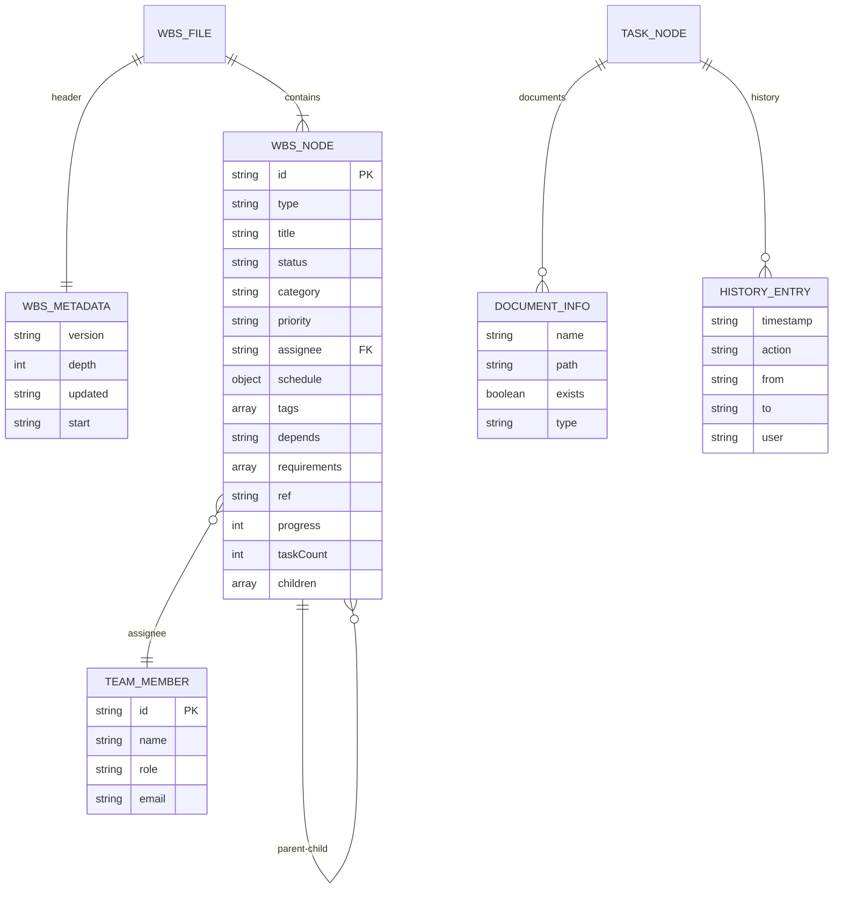
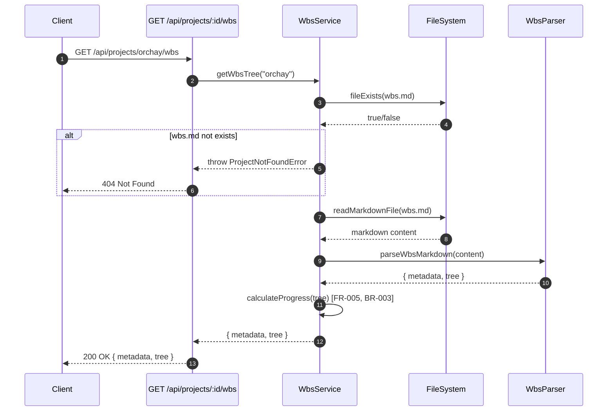
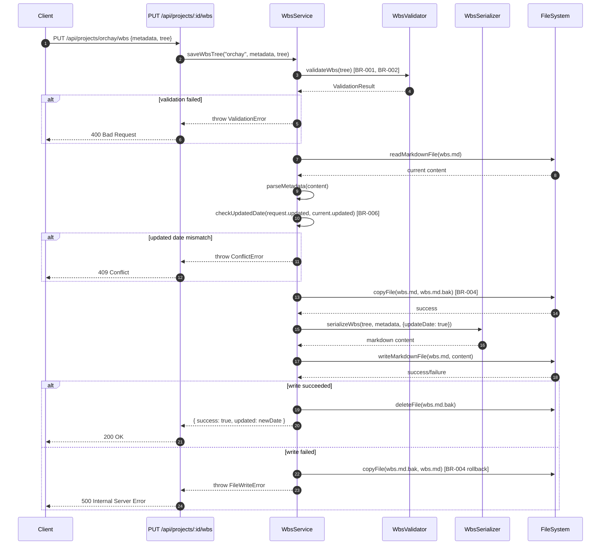
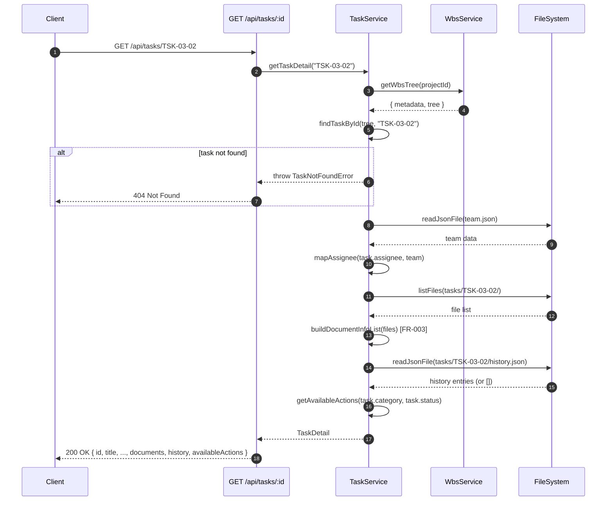
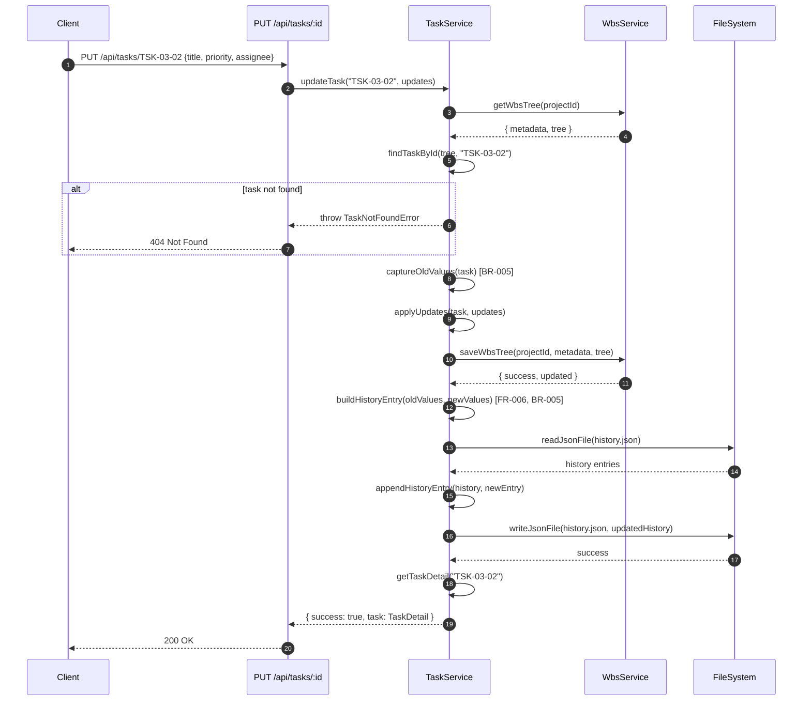

# 상세설계: WBS API

**Template Version:** 3.0.0 — **Last Updated:** 2025-12-14

> **설계 규칙**
> * *기능 중심 설계*에 집중한다.
> * 실제 소스코드(전체 또는 일부)는 **절대 포함하지 않는다**.
> * 작성 후 **상위 문서(PRD, TRD, 기본설계)와 비교**하여 차이가 있으면 **즉시 중단 → 차이 설명 → 지시 대기**.
> * **다이어그램 규칙**
>   * 프로세스: **Mermaid**만 사용
>   * UI 레이아웃: **Text Art(ASCII)** → 바로 아래 **SVG 개념도**를 순차 배치
>
> **분할 문서**
> * 요구사항 추적성: `025-traceability-matrix.md`
> * 테스트 명세: `026-test-specification.md`

---

## 0. 문서 메타데이터

| 항목 | 내용 |
|------|------|
| Task ID | TSK-03-02 |
| Task명 | WBS API |
| Category | development |
| 상태 | [dd] 상세설계 |
| 작성일 | 2025-12-14 |
| 작성자 | Claude Code |

### 상위 문서 참조

| 문서 유형 | 경로 | 참조 섹션 |
|----------|------|----------|
| PRD | `.orchay/projects/orchay/prd.md` | 8.1, 8.2 |
| TRD | `.orchay/projects/orchay/trd.md` | 전체 |
| 기본설계 | `010-basic-design.md` | 전체 |
| 상위 Work Package | WP-03: Backend API & Workflow | - |

### 분할 문서 참조

| 문서 유형 | 파일명 | 목적 |
|----------|--------|------|
| 추적성 매트릭스 | `025-traceability-matrix.md` | 요구사항 ↔ 설계 ↔ 테스트 추적 |
| 테스트 명세 | `026-test-specification.md` | 테스트 시나리오, 데이터, data-testid |

---

## 1. 일관성 검증 결과

> 상위 문서와의 일관성 검증 결과를 기록합니다.

### 1.1 검증 요약

| 구분 | 통과 | 경고 | 실패 |
|------|------|------|------|
| PRD ↔ 기본설계 | 6개 | 0개 | 0개 |
| 기본설계 ↔ 상세설계 | 8개 | 0개 | 0개 |
| TRD ↔ 상세설계 | 6개 | 0개 | 0개 |

### 1.2 검증 상세

| 검증 ID | 검증 항목 | 결과 | 비고 |
|---------|----------|------|------|
| CHK-PRD-01 | 기능 요구사항 완전성 | ✅ PASS | PRD 8.1/8.2의 WBS API 4개 엔드포인트 모두 포함 |
| CHK-PRD-02 | 비즈니스 규칙 일치성 | ✅ PASS | 진행률 자동 계산, 이력 기록 등 반영 |
| CHK-PRD-03 | 용어 일관성 | ✅ PASS | WbsNode, TaskDetail 등 용어 일치 |
| CHK-PRD-04 | 범위 일치성 | ✅ PASS | 기본설계 범위 내 설계 |
| CHK-PRD-05 | 워크플로우 상태 정의 | ✅ PASS | Task 상태 코드 일치 |
| CHK-PRD-06 | 데이터 모델 일치성 | ✅ PASS | wbs.md, team.json 구조 일치 |
| CHK-BD-01 | 기능 요구사항 완전성 | ✅ PASS | FR-001~006 모든 기능 구현 방법 명시 |
| CHK-BD-02 | 비즈니스 규칙 구현 명세 | ✅ PASS | BR-001~006 구현 위치/방법 명시 |
| CHK-BD-03 | 데이터 모델 일치성 | ✅ PASS | WbsNode, TaskDetail, HistoryEntry 구조 일치 |
| CHK-BD-04 | 인터페이스 일치성 | ✅ PASS | 기본설계 7절 인터페이스 → API 명세 매핑 |
| CHK-BD-05 | 수용 기준 구현 가능성 | ✅ PASS | 9절 수용 기준 모두 테스트케이스로 변환 가능 |
| CHK-BD-06 | 사용자 시나리오 커버리지 | ✅ PASS | 8절 3개 시나리오 모두 지원 |
| CHK-BD-07 | 에러 처리 전략 | ✅ PASS | 롤백 메커니즘, 낙관적 잠금 일치 |
| CHK-BD-08 | 의존성 관리 | ✅ PASS | TSK-02-02-01/02/03 선행 Task 확인 |
| CHK-TRD-01 | 기술 스택 준수 | ✅ PASS | Nuxt 3 Server Routes 사용 |
| CHK-TRD-02 | 아키텍처 패턴 준수 | ✅ PASS | server/api/ 디렉토리 구조 준수 |
| CHK-TRD-03 | API 설계 규칙 준수 | ✅ PASS | RESTful 엔드포인트 규칙 준수 |
| CHK-TRD-04 | 파일 시스템 서비스 사용 | ✅ PASS | file.ts 유틸리티 활용 |
| CHK-TRD-05 | 에러 핸들링 표준 준수 | ✅ PASS | standardError.ts 사용 |
| CHK-TRD-06 | 파서/시리얼라이저 활용 | ✅ PASS | 기존 wbs/parser, wbs/serializer 활용 |

---

## 2. 목적 및 범위

### 2.1 목적

WBS(Work Breakdown Structure) 데이터를 조회, 수정하고 개별 Task 정보를 관리하기 위한 REST API를 구현합니다. 이를 통해 프론트엔드에서 WBS 트리를 표시하고 Task 상세 정보를 편집할 수 있습니다.

### 2.2 범위

**포함 범위** (기본설계 구현 범위의 기술적 구현 사항):
- `GET /api/projects/:id/wbs` - WBS 트리 조회 API (파싱, 계층 구조, 진행률)
- `PUT /api/projects/:id/wbs` - WBS 전체 저장 API (유효성 검증, 롤백)
- `GET /api/tasks/:id` - Task 상세 조회 API (문서 목록, 이력 포함)
- `PUT /api/tasks/:id` - Task 정보 수정 API (이력 기록)
- 파일 기반 데이터 저장/조회
- 유효성 검증 및 에러 핸들링
- 백업/롤백 메커니즘

**제외 범위** (다른 Task에서 구현):
- 워크플로우 상태 전이 API → TSK-03-03
- 설정 조회 API (columns, categories 등) → TSK-03-03
- Task 문서 조회/수정 API → WP-05 (프론트엔드)

---

## 3. 기술 스택

> TRD 기준, 이 Task에서 사용하는 기술만 명시

| 구분 | 기술 | 버전 | 용도 |
|------|------|------|------|
| Runtime | Node.js | 20.x LTS | 서버 실행 환경 |
| Framework | Nuxt 3 | 3.18.x | Server Routes 기반 API |
| Language | TypeScript | 5.6.x | 타입 안전성 |
| Data | wbs.md + JSON | - | .orchay/ 폴더 기반 저장 |
| Parser | wbs/parser | - | wbs.md → WbsNode[] 변환 (기존) |
| Serializer | wbs/serializer | - | WbsNode[] → wbs.md 변환 (기존) |
| Validator | wbs/validation | - | WBS 유효성 검증 (기존) |
| Testing | Vitest | 2.x | 단위 테스트 |
| E2E Testing | Playwright | 1.49.x | API E2E 테스트 |

---

## 4. 용어/가정/제약

### 4.1 용어 정의

| 용어 | 정의 |
|------|------|
| WBS | Work Breakdown Structure, 작업 분해 구조 (4단계 계층) |
| wbs.md | 프로젝트의 WBS 데이터를 저장하는 Markdown 파일 (유일한 소스) |
| WbsNode | WBS 트리의 단일 노드 (project, wp, act, task 타입) |
| TaskDetail | Task의 상세 정보 (문서, 이력, 가능한 액션 포함) |
| HistoryEntry | Task 변경 이력 항목 |
| progress | 진행률 (0-100), 하위 Task 기반 자동 계산 |
| updated | wbs.md의 최종 수정일 (낙관적 잠금용) |

### 4.2 가정 (Assumptions)

- .orchay 폴더가 이미 초기화되어 있음 (TSK-02-01-01에서 구현)
- 파일 시스템 유틸리티가 구현되어 있음 (file.ts)
- WBS 파서/시리얼라이저가 구현되어 있음 (TSK-02-02-01/02)
- WBS 유효성 검증이 구현되어 있음 (TSK-02-02-03)
- 단일 사용자/단일 프로세스 환경 (동시성 충돌 최소화)
- team.json이 존재함 (Task assignee 정보 조회용)

### 4.3 제약 (Constraints)

- 데이터베이스 없이 파일 시스템만 사용
- wbs.md는 단일 진실 소스 (Single Source of Truth)
- wbs.md 파일 크기는 10MB 이하 (노드 수 1000개 제한)
- Git 동기화를 고려하여 파일은 UTF-8, LF 줄바꿈 사용
- Task 이력은 별도 파일로 관리 (tasks/{id}/history.json)

---

## 5. 시스템/모듈 구조

> **규칙**: 구현 코드가 아닌 **구조/역할/책임**만 표현

### 5.1 모듈 역할 및 책임

| 모듈 | 역할 | 책임 |
|------|------|------|
| server/api/projects/[id]/wbs.get.ts | WBS 트리 조회 | wbs.md 파싱, 진행률 계산, 트리 반환 |
| server/api/projects/[id]/wbs.put.ts | WBS 트리 저장 | 유효성 검증, 시리얼라이즈, wbs.md 쓰기, 롤백 |
| server/api/tasks/[id].get.ts | Task 상세 조회 | Task 검색, 문서 목록, 이력 조회, 가능한 액션 반환 |
| server/api/tasks/[id].put.ts | Task 정보 수정 | Task 속성 수정, wbs.md 업데이트, 이력 기록 |
| server/utils/wbs/wbsService.ts | WBS 비즈니스 로직 | wbs.md 읽기/쓰기, 트리 가공, 백업/롤백 |
| server/utils/wbs/taskService.ts | Task 비즈니스 로직 | Task 검색, 수정, 이력 관리 |
| server/utils/wbs/parser/index.ts | wbs.md 파싱 | Markdown → WbsNode[] 변환 (기존) |
| server/utils/wbs/serializer.ts | WbsNode[] 시리얼라이즈 | WbsNode[] → Markdown 변환 (기존) |
| server/utils/wbs/validation/index.ts | WBS 유효성 검증 | ID 중복, 필수 속성, 상태 검증 (기존) |
| server/utils/file.ts | 파일 시스템 접근 | Markdown/JSON 읽기/쓰기 (기존) |

### 5.2 모듈 구조도 (개념)

```
server/
├── api/
│   ├── projects/
│   │   └── [id]/
│   │       ├── wbs.get.ts       # GET /api/projects/:id/wbs
│   │       └── wbs.put.ts       # PUT /api/projects/:id/wbs
│   └── tasks/
│       ├── [id].get.ts          # GET /api/tasks/:id
│       └── [id].put.ts          # PUT /api/tasks/:id
└── utils/
    ├── wbs/
    │   ├── wbsService.ts        # WBS 서비스 (신규)
    │   ├── taskService.ts       # Task 서비스 (신규)
    │   ├── parser/              # WBS 파서 (기존)
    │   │   └── index.ts
    │   ├── serializer.ts        # WBS 시리얼라이저 (기존)
    │   └── validation/          # WBS 검증 (기존)
    │       └── index.ts
    ├── file.ts                  # 파일 유틸리티 (기존)
    └── errors/
        └── standardError.ts     # 에러 헬퍼 (기존)
```

### 5.3 외부 의존성

| 의존성 | 유형 | 용도 |
|--------|------|------|
| file.ts | 내부 모듈 | Markdown/JSON 파일 읽기/쓰기 |
| wbs/parser | 내부 모듈 | wbs.md 파싱 |
| wbs/serializer | 내부 모듈 | WbsNode[] 시리얼라이즈 |
| wbs/validation | 내부 모듈 | WBS 유효성 검증 |
| standardError.ts | 내부 모듈 | 표준 에러 응답 생성 |
| Node.js fs/path | 표준 라이브러리 | 파일 복사, 경로 조작 |

---

## 6. 데이터 모델 (개념 수준)

> **규칙**: 코드가 아닌 **개념 수준 ERD와 필드 정의**만 기술

### 6.1 엔티티 정의

#### Entity: WbsMetadata (wbs.md 헤더)

| 필드명 | 타입 | 필수 | 설명 | 제약조건 |
|--------|------|------|------|----------|
| version | String | Y | WBS 파일 버전 | "1.0" 고정 |
| depth | Number | Y | 계층 깊이 | 3 또는 4 |
| updated | String | Y | 최종 수정일 | YYYY-MM-DD, 낙관적 잠금용 |
| start | String | N | 프로젝트 시작일 | YYYY-MM-DD |

#### Entity: WbsNode (트리 노드)

| 필드명 | 타입 | 필수 | 설명 | 제약조건 |
|--------|------|------|------|----------|
| id | String | Y | 노드 고유 ID | WP-XX, ACT-XX-XX, TSK-XX-XX |
| type | Enum | Y | 노드 타입 | 'project' \| 'wp' \| 'act' \| 'task' |
| title | String | Y | 노드 제목 | 1-200자 |
| status | String | N | 상태 기호 | 예: "[bd]", "detail-design [dd]" |
| category | Enum | N (Task만) | 카테고리 | 'development' \| 'defect' \| 'infrastructure' |
| priority | Enum | N | 우선순위 | 'critical' \| 'high' \| 'medium' \| 'low' |
| assignee | String | N | 담당자 ID | team.json의 member id |
| schedule | Object | N | 일정 범위 | { start: "YYYY-MM-DD", end: "YYYY-MM-DD" } |
| tags | Array | N | 태그 목록 | String[] |
| depends | String | N | 선행 Task ID | Task ID 문자열 |
| requirements | Array | N | 요구사항 목록 | String[] |
| ref | String | N | 참조 문서 | 자유 텍스트 |
| progress | Number | Y | 진행률 | 0-100, 자동 계산 |
| taskCount | Number | Y | 하위 Task 수 | >= 0 |
| children | Array | Y | 하위 노드 배열 | WbsNode[] |

#### Entity: TaskDetail (Task 상세)

| 필드명 | 타입 | 필수 | 설명 | 제약조건 |
|--------|------|------|------|----------|
| id | String | Y | Task ID | TSK-XX-XX 또는 TSK-XX-XX-XX |
| title | String | Y | Task 제목 | 1-200자 |
| category | String | Y | 카테고리 | development \| defect \| infrastructure |
| status | String | Y | 상태 기호 | 예: "[bd]" |
| priority | String | Y | 우선순위 | critical \| high \| medium \| low |
| assignee | Object | N | 담당자 정보 | TeamMember 또는 null |
| parentWp | String | Y | 소속 Work Package ID | WP-XX |
| parentAct | String | N | 소속 Activity ID | ACT-XX-XX (4단계 시) |
| schedule | Object | N | 일정 범위 | { start, end } |
| requirements | Array | Y | 요구사항 목록 | String[] |
| tags | Array | Y | 태그 목록 | String[] |
| depends | Array | N | 선행 Task 목록 | String[] |
| ref | String | N | 참조 문서 | 자유 텍스트 |
| documents | Array | Y | 문서 목록 | DocumentInfo[] |
| history | Array | Y | 변경 이력 | HistoryEntry[] |
| availableActions | Array | Y | 가능한 워크플로우 명령어 | String[] (예: ["draft", "review"]) |

#### Entity: TeamMember (팀원 정보)

| 필드명 | 타입 | 필수 | 설명 | 제약조건 |
|--------|------|------|------|----------|
| id | String | Y | 팀원 고유 ID | 영소문자, 숫자, 하이픈 |
| name | String | Y | 팀원 이름 | 1-50자 |
| role | String | N | 역할 | 자유 텍스트 |
| email | String | N | 이메일 | 이메일 형식 |

#### Entity: DocumentInfo (문서 정보)

| 필드명 | 타입 | 필수 | 설명 | 제약조건 |
|--------|------|------|------|----------|
| name | String | Y | 문서 파일명 | 예: "010-basic-design.md" |
| path | String | Y | 문서 상대 경로 | tasks/{id}/{name} |
| exists | Boolean | Y | 파일 존재 여부 | true/false |
| type | Enum | Y | 문서 유형 | 'design' \| 'implementation' \| 'test' \| 'manual' |

#### Entity: HistoryEntry (이력 엔트리)

| 필드명 | 타입 | 필수 | 설명 | 제약조건 |
|--------|------|------|------|----------|
| timestamp | String | Y | 변경 일시 | ISO 8601 (YYYY-MM-DDTHH:mm:ssZ) |
| action | String | Y | 변경 유형 | 'status_change' \| 'update' \| 'create' |
| from | String | N | 변경 전 값 | action에 따라 다름 |
| to | String | N | 변경 후 값 | action에 따라 다름 |
| user | String | N | 변경자 ID | 향후 확장 (현재는 null) |

### 6.2 관계 다이어그램



### 6.3 파일 경로 규칙

| 파일 | 경로 | 설명 |
|------|------|------|
| WBS 파일 | `.orchay/projects/{id}/wbs.md` | WBS 트리 데이터 (유일한 소스) |
| WBS 백업 | `.orchay/projects/{id}/wbs.md.bak` | 임시 백업 파일 (쓰기 중) |
| 팀원 목록 | `.orchay/projects/{id}/team.json` | 팀원 정보 |
| Task 이력 | `.orchay/projects/{id}/tasks/{taskId}/history.json` | Task 변경 이력 |
| Task 문서 | `.orchay/projects/{id}/tasks/{taskId}/*.md` | Task 관련 문서 |

---

## 7. 인터페이스 계약 (API Contract)

> **규칙**: TypeScript 코드가 아닌 **표 형태의 계약 정의**

### 7.1 엔드포인트 목록

| Method | Endpoint | 설명 | 요구사항 |
|--------|----------|------|----------|
| GET | /api/projects/:id/wbs | WBS 트리 조회 | FR-001 |
| PUT | /api/projects/:id/wbs | WBS 트리 저장 | FR-002 |
| GET | /api/tasks/:id | Task 상세 조회 | FR-003 |
| PUT | /api/tasks/:id | Task 정보 수정 | FR-004 |

---

### 7.2 API 상세: GET /api/projects/:id/wbs

**요구사항**: FR-001

#### 요청 (Request)

| 구분 | 파라미터 | 타입 | 필수 | 설명 | 기본값 |
|------|----------|------|------|------|--------|
| Path | id | String | Y | 프로젝트 ID | - |

#### 응답 (Response)

**성공 응답 (200)**:

| 필드 | 타입 | 설명 |
|------|------|------|
| metadata | Object | WBS 메타데이터 |
| metadata.version | String | WBS 버전 ("1.0") |
| metadata.depth | Number | 계층 깊이 (3/4) |
| metadata.updated | String | 최종 수정일 (YYYY-MM-DD) |
| metadata.start | String | 프로젝트 시작일 (YYYY-MM-DD) |
| tree | Array | WBS 노드 트리 (WbsNode[]) |

**에러 응답**:

| 코드 | 에러 코드 | 설명 | 비즈니스 규칙 |
|------|----------|------|--------------|
| 404 | PROJECT_NOT_FOUND | 프로젝트 또는 wbs.md 없음 | - |
| 500 | PARSE_ERROR | wbs.md 파싱 실패 | - |
| 500 | FILE_ACCESS_ERROR | 파일 읽기 실패 | - |

---

### 7.3 API 상세: PUT /api/projects/:id/wbs

**요구사항**: FR-002

#### 요청 (Request)

| 구분 | 파라미터 | 타입 | 필수 | 설명 | 기본값 |
|------|----------|------|------|------|--------|
| Path | id | String | Y | 프로젝트 ID | - |
| Body | metadata | Object | Y | WBS 메타데이터 | - |
| Body | metadata.version | String | Y | WBS 버전 | - |
| Body | metadata.depth | Number | Y | 계층 깊이 (3/4) | - |
| Body | metadata.updated | String | Y | 최종 수정일 (낙관적 잠금) | - |
| Body | tree | Array | Y | WBS 노드 트리 | - |

#### 응답 (Response)

**성공 응답 (200)**:

| 필드 | 타입 | 설명 |
|------|------|------|
| success | Boolean | 성공 여부 (true) |
| updated | String | 새로운 수정일 (YYYY-MM-DD) |

**에러 응답**:

| 코드 | 에러 코드 | 설명 | 비즈니스 규칙 |
|------|----------|------|--------------|
| 400 | VALIDATION_ERROR | 유효성 검증 실패 | BR-001, BR-002 |
| 409 | CONFLICT_ERROR | 동시성 충돌 (updated 불일치) | BR-006 |
| 404 | PROJECT_NOT_FOUND | 프로젝트 없음 | - |
| 500 | FILE_WRITE_ERROR | 파일 쓰기 실패 | BR-004 |
| 500 | SERIALIZATION_ERROR | 시리얼라이즈 실패 | - |

#### 유효성 검증

| 필드 | 규칙 | 에러 메시지 | 비즈니스 규칙 |
|------|------|------------|--------------|
| metadata.version | required | WBS 버전은 필수입니다 | - |
| metadata.depth | 3 또는 4 | WBS 깊이는 3 또는 4만 가능합니다 | - |
| metadata.updated | required | 최종 수정일은 필수입니다 | - |
| tree | required | WBS 트리는 필수입니다 | - |
| tree[].id | unique | 중복된 ID가 있습니다 | BR-002 |
| tree[].type=task | category required | Task는 카테고리가 필수입니다 | BR-001 |

---

### 7.4 API 상세: GET /api/tasks/:id

**요구사항**: FR-003

#### 요청 (Request)

| 구분 | 파라미터 | 타입 | 필수 | 설명 | 기본값 |
|------|----------|------|------|------|--------|
| Path | id | String | Y | Task ID (예: "TSK-03-02") | - |

#### 응답 (Response)

**성공 응답 (200)**:

| 필드 | 타입 | 설명 |
|------|------|------|
| id | String | Task ID |
| title | String | Task 제목 |
| category | String | 카테고리 |
| status | String | 상태 기호 |
| priority | String | 우선순위 |
| assignee | Object | 담당자 정보 (TeamMember 또는 null) |
| parentWp | String | 소속 Work Package ID |
| parentAct | String | 소속 Activity ID (4단계 시) |
| schedule | Object | 일정 범위 (선택) |
| requirements | Array | 요구사항 목록 |
| tags | Array | 태그 목록 |
| depends | Array | 선행 Task 목록 |
| ref | String | 참조 문서 (선택) |
| documents | Array | 문서 목록 (DocumentInfo[]) |
| history | Array | 변경 이력 (HistoryEntry[]) |
| availableActions | Array | 가능한 워크플로우 명령어 |

**에러 응답**:

| 코드 | 에러 코드 | 설명 | 비즈니스 규칙 |
|------|----------|------|--------------|
| 404 | TASK_NOT_FOUND | Task 없음 | - |
| 404 | PROJECT_NOT_FOUND | 프로젝트 없음 | - |
| 500 | FILE_ACCESS_ERROR | 파일 읽기 실패 | - |

---

### 7.5 API 상세: PUT /api/tasks/:id

**요구사항**: FR-004

#### 요청 (Request)

| 구분 | 파라미터 | 타입 | 필수 | 설명 | 기본값 |
|------|----------|------|------|------|--------|
| Path | id | String | Y | Task ID | - |
| Body | title | String | N | Task 제목 | - |
| Body | priority | String | N | 우선순위 | - |
| Body | assignee | String | N | 담당자 ID | - |
| Body | schedule | Object | N | 일정 범위 | - |
| Body | tags | Array | N | 태그 목록 | - |
| Body | depends | String | N | 선행 Task ID | - |

#### 응답 (Response)

**성공 응답 (200)**:

| 필드 | 타입 | 설명 |
|------|------|------|
| success | Boolean | 성공 여부 (true) |
| task | Object | 수정된 Task 정보 (TaskDetail) |

**에러 응답**:

| 코드 | 에러 코드 | 설명 | 비즈니스 규칙 |
|------|----------|------|--------------|
| 400 | VALIDATION_ERROR | 유효성 검증 실패 | - |
| 404 | TASK_NOT_FOUND | Task 없음 | - |
| 404 | PROJECT_NOT_FOUND | 프로젝트 없음 | - |
| 500 | FILE_WRITE_ERROR | 파일 쓰기 실패 | BR-004, BR-005 |

#### 유효성 검증

| 필드 | 규칙 | 에러 메시지 | 비즈니스 규칙 |
|------|------|------------|--------------|
| title | 1-200자 | 제목은 1-200자여야 합니다 | - |
| priority | critical\|high\|medium\|low | 유효하지 않은 우선순위입니다 | - |
| assignee | team.json에 존재 | 존재하지 않는 팀원입니다 | - |
| schedule.start | YYYY-MM-DD | 유효하지 않은 날짜 형식입니다 | - |
| schedule.end | >= start | 종료일은 시작일 이후여야 합니다 | - |

---

## 8. 프로세스 흐름

### 8.1 WBS 트리 조회 프로세스

1. **요청 수신** [FR-001]: 클라이언트가 GET /api/projects/:id/wbs 호출
2. **프로젝트 확인**: 프로젝트 폴더 존재 여부 확인
3. **파일 읽기**: wbs.md 파일 읽기
4. **파싱**: parseWbsMarkdown()으로 WbsNode[] 트리 변환
5. **진행률 계산**: calculateProgress()로 하위 Task 기반 진행률 계산
6. **응답 반환**: { metadata, tree } 반환

### 8.2 WBS 트리 저장 프로세스

1. **요청 수신** [FR-002]: 클라이언트가 PUT /api/projects/:id/wbs 호출
2. **유효성 검증** [BR-001, BR-002]: validateWbs()로 ID 중복, 필수 속성 검증
3. **낙관적 잠금 확인** [BR-006]: 요청의 updated와 현재 파일의 updated 비교
4. **백업 생성** [BR-004]: wbs.md를 wbs.md.bak으로 복사
5. **시리얼라이즈**: serializeWbs()로 WbsNode[] → Markdown 변환
6. **파일 쓰기**: wbs.md에 시리얼라이즈된 내용 쓰기
7. **성공/실패 처리**:
   - 성공: wbs.md.bak 삭제, { success: true, updated } 반환
   - 실패: wbs.md.bak으로 복구, 에러 반환
8. **updated 필드 갱신**: 현재 날짜(YYYY-MM-DD)로 자동 갱신

### 8.3 Task 상세 조회 프로세스

1. **요청 수신** [FR-003]: 클라이언트가 GET /api/tasks/:id 호출
2. **WBS 조회**: getWbsTree()로 WBS 트리 로드
3. **Task 검색**: findTaskById()로 트리에서 Task 노드 찾기
4. **팀원 정보 조회**: team.json에서 assignee 정보 매핑
5. **문서 목록 조회**: tasks/{id}/ 폴더의 파일 목록 스캔, DocumentInfo[] 생성
6. **이력 조회**: tasks/{id}/history.json 읽기 (없으면 빈 배열)
7. **가능한 액션 조회**: Task의 category와 status 기반으로 availableActions 계산
8. **응답 반환**: TaskDetail 객체 반환

### 8.4 Task 정보 수정 프로세스

1. **요청 수신** [FR-004]: 클라이언트가 PUT /api/tasks/:id 호출
2. **유효성 검증**: 요청 body 검증 (title, priority, assignee 등)
3. **WBS 조회**: getWbsTree()로 WBS 트리 로드
4. **Task 검색**: findTaskById()로 트리에서 Task 노드 찾기
5. **속성 수정**: 요청 body의 속성을 Task 노드에 적용
6. **이력 기록** [BR-005]: 변경 전/후 값을 HistoryEntry로 기록
7. **WBS 저장**: 수정된 트리를 serializeWbs()로 시리얼라이즈 후 wbs.md 쓰기
8. **이력 저장**: tasks/{id}/history.json에 새 HistoryEntry 추가
9. **응답 반환**: { success: true, task: TaskDetail } 반환

### 8.5 시퀀스 다이어그램: WBS 트리 조회



### 8.6 시퀀스 다이어그램: WBS 트리 저장



### 8.7 시퀀스 다이어그램: Task 상세 조회



### 8.8 시퀀스 다이어그램: Task 정보 수정



---

## 9. UI 설계

> **참고**: 본 Task는 백엔드 API만 구현하며, UI는 프론트엔드 Task (WP-04, WP-05)에서 담당합니다.
> 기본설계 8절의 사용자 시나리오를 참조하여 API 응답 구조를 설계했습니다.

### 9.1 API 활용 화면 (참조용)

| 화면 | 사용 API | 목적 |
|------|----------|------|
| WBS 트리 뷰 | GET /api/projects/:id/wbs | WBS 계층 구조 표시, 진행률 시각화 |
| 칸반 보드 | GET /api/projects/:id/wbs, PUT /api/projects/:id/wbs | Task 상태 드래그 앤 드롭 |
| Task 상세 패널 | GET /api/tasks/:id | Task 정보, 문서 목록, 이력 표시 |
| Task 편집 폼 | PUT /api/tasks/:id | Task 속성 수정 |

---

## 10. 비즈니스 규칙 구현 명세

> 기본설계 BR-XXX 규칙의 구현 방안

| 규칙 ID | 규칙 설명 | 구현 위치 | 구현 방식 | 검증 방법 |
|---------|----------|-----------|-----------|-----------|
| BR-001 | Task는 category, status, priority 필수 | WbsValidator.validateAttributes() | Task 노드의 필수 필드 검증 | 단위 테스트 |
| BR-002 | Task ID는 중복 불가 | WbsValidator.checkDuplicates() | 트리 전체 ID 수집 후 중복 체크 | 단위 테스트, E2E 테스트 |
| BR-003 | progress는 자동 계산 (하위 Task 기반) | WbsParser.calculateProgress() | 재귀적으로 하위 Task의 done 비율 계산 | 단위 테스트 |
| BR-004 | WBS 저장 실패 시 원본 파일 유지 | WbsService.saveWbsTree() | wbs.md.bak 백업 → 쓰기 → 실패 시 백업 복구 | E2E 테스트 |
| BR-005 | Task 수정 시 이력 기록 | TaskService.updateTask() | 변경 전/후 값을 HistoryEntry로 기록 후 history.json 저장 | 단위 테스트, E2E 테스트 |
| BR-006 | wbs.md updated 필드는 저장 시 자동 갱신 | WbsService.saveWbsTree() | serializeWbs() 호출 시 { updateDate: true } 옵션 전달 | 단위 테스트 |

---

## 11. 오류/예외 처리

### 11.1 예상 오류 상황

| 오류 상황 | 오류 코드 | HTTP 상태 | 사용자 메시지 | 복구 전략 |
|----------|----------|----------|--------------|----------|
| 프로젝트 없음 | PROJECT_NOT_FOUND | 404 | 요청한 프로젝트를 찾을 수 없습니다 | 프로젝트 목록으로 이동 |
| Task 없음 | TASK_NOT_FOUND | 404 | 요청한 Task를 찾을 수 없습니다 | WBS 트리로 이동 |
| wbs.md 파싱 실패 | PARSE_ERROR | 500 | WBS 파일을 읽을 수 없습니다 | 파일 복구 또는 관리자 문의 |
| 유효성 검증 실패 | VALIDATION_ERROR | 400 | WBS 데이터가 유효하지 않습니다: {상세} | 에러 메시지 표시, 재입력 안내 |
| ID 중복 | VALIDATION_ERROR | 400 | 중복된 Task ID가 있습니다: {id} | ID 수정 후 재시도 |
| 동시성 충돌 | CONFLICT_ERROR | 409 | 다른 사용자가 수정했습니다. 새로고침 후 재시도하세요 | 최신 데이터 로드 후 재시도 |
| 파일 쓰기 실패 | FILE_WRITE_ERROR | 500 | 데이터 저장에 실패했습니다 | 백업 복구, 재시도 버튼 제공 |
| 시리얼라이즈 실패 | SERIALIZATION_ERROR | 500 | WBS 데이터를 변환할 수 없습니다 | 데이터 검증 후 재시도 |
| 순환 참조 감지 | VALIDATION_ERROR | 400 | 순환 참조가 감지되었습니다: {id} | 의존성 수정 안내 |
| 노드 수 초과 | SERIALIZATION_ERROR | 400 | WBS 노드 수가 제한(1000개)을 초과했습니다 | 노드 수 줄이기 안내 |

### 11.2 경계 조건

| 조건 | 처리 방안 |
|------|----------|
| wbs.md 없음 | 404 PROJECT_NOT_FOUND 반환 |
| 빈 wbs.md (메타데이터만) | 빈 트리 `{ metadata, tree: [] }` 반환 |
| team.json 없음 | assignee는 null로 처리 |
| history.json 없음 | 빈 이력 `[]` 반환 |
| tasks/{id}/ 폴더 없음 | 빈 문서 목록 `[]` 반환 |
| wbs.md.bak이 이미 존재 | 덮어쓰기 (이전 백업 무시) |
| updated 필드 누락 | 현재 날짜로 초기화 |
| progress 필드 누락 | 0으로 초기화 후 자동 계산 |

### 11.3 에러 응답 형식

모든 에러 응답은 `standardError.ts`의 형식을 따릅니다:

```json
{
  "statusCode": 400,
  "statusMessage": "VALIDATION_ERROR",
  "message": "WBS 데이터가 유효하지 않습니다: Task ID 중복",
  "data": {
    "timestamp": "2025-12-14T10:30:00Z"
  }
}
```

---

## 12. 성능 및 최적화

### 12.1 성능 목표

| 메트릭 | 목표 | 측정 방법 |
|--------|------|----------|
| WBS 조회 응답 시간 | < 500ms (1000 노드 기준) | E2E 테스트, Playwright 측정 |
| WBS 저장 응답 시간 | < 1000ms (1000 노드 기준) | E2E 테스트 |
| Task 조회 응답 시간 | < 200ms | E2E 테스트 |
| Task 수정 응답 시간 | < 500ms | E2E 테스트 |

### 12.2 최적화 전략

| 항목 | 전략 | 근거 |
|------|------|------|
| 파싱 최적화 | 한 줄씩 순차 파싱 (메모리 효율) | 대용량 파일 대비 |
| 진행률 계산 | 한 번만 계산 (재귀 후처리) | 중복 계산 방지 |
| 문서 목록 조회 | 파일명만 조회 (내용 읽지 않음) | I/O 최소화 |
| 이력 조회 | 최대 100개 제한 | 메모리 절약 |
| 백업 파일 | 동기식 복사 (원자성 보장) | 데이터 무결성 우선 |

---

## 13. 보안 고려사항

| 위협 | 완화 방안 |
|------|----------|
| 마크다운 인젝션 | 제목에서 `#` 시작 제거 (sanitizeTitle) |
| 경로 순회 공격 | 프로젝트 ID 검증 (영소문자, 숫자, 하이픈만) |
| 파일 덮어쓰기 | 프로젝트 폴더 외부 경로 접근 차단 |
| 대용량 데이터 | 노드 수 1000개 제한, 파일 크기 10MB 제한 |
| 순환 참조 | visited Set으로 순환 참조 감지 및 에러 반환 |

---

## 14. 구현 체크리스트

### Backend API

- [ ] GET /api/projects/[id]/wbs.get.ts 구현 (WBS 트리 조회)
- [ ] PUT /api/projects/[id]/wbs.put.ts 구현 (WBS 트리 저장)
- [ ] GET /api/tasks/[id].get.ts 구현 (Task 상세 조회)
- [ ] PUT /api/tasks/[id].put.ts 구현 (Task 정보 수정)

### Backend Services

- [ ] server/utils/wbs/wbsService.ts 구현
  - [ ] getWbsTree() - WBS 조회
  - [ ] saveWbsTree() - WBS 저장 (백업/롤백)
  - [ ] parseMetadata() - 메타데이터 파싱
  - [ ] checkUpdatedDate() - 낙관적 잠금 확인
- [ ] server/utils/wbs/taskService.ts 구현
  - [ ] getTaskDetail() - Task 상세 조회
  - [ ] updateTask() - Task 수정
  - [ ] findTaskById() - Task 검색
  - [ ] buildDocumentInfoList() - 문서 목록 생성
  - [ ] getAvailableActions() - 가능한 액션 조회
  - [ ] buildHistoryEntry() - 이력 엔트리 생성

### Testing

- [ ] wbsService 단위 테스트
  - [ ] WBS 조회 성공 케이스
  - [ ] WBS 저장 성공 케이스
  - [ ] 백업/롤백 메커니즘
  - [ ] 낙관적 잠금 충돌
- [ ] taskService 단위 테스트
  - [ ] Task 검색 성공/실패
  - [ ] Task 수정 및 이력 기록
  - [ ] 문서 목록 생성
  - [ ] 가능한 액션 조회
- [ ] API E2E 테스트
  - [ ] GET /api/projects/:id/wbs
  - [ ] PUT /api/projects/:id/wbs
  - [ ] GET /api/tasks/:id
  - [ ] PUT /api/tasks/:id
- [ ] 비즈니스 규칙 테스트 (BR-001~006)
- [ ] 에러 케이스 테스트
- [ ] 성능 테스트 (1000 노드)

### 품질

- [ ] 요구사항 추적성 검증 완료 (`025-traceability-matrix.md`)
- [ ] 테스트 명세 작성 완료 (`026-test-specification.md`)
- [ ] 비즈니스 규칙 구현 완료 (BR-001~006)
- [ ] 일관성 검증 통과 (섹션 1)
- [ ] 테스트 커버리지 >= 80%

---

## 15. 다음 단계

- `/wf:review TSK-03-02` 명령어로 설계리뷰 진행
- 리뷰 완료 후 `/wf:build TSK-03-02` 명령어로 구현 시작

---

## 관련 문서

- 기본설계: `010-basic-design.md`
- 추적성 매트릭스: `025-traceability-matrix.md`
- 테스트 명세: `026-test-specification.md`
- PRD: `.orchay/projects/orchay/prd.md`
- TRD: `.orchay/projects/orchay/trd.md`
- 선행 Task:
  - TSK-02-02-01: WBS Parser 구현
  - TSK-02-02-02: WBS Serializer 구현
  - TSK-02-02-03: WBS Validator 구현
  - TSK-03-01: Project API 구현

---

<!--
author: Claude Code
Template Version: 3.0.0
-->
