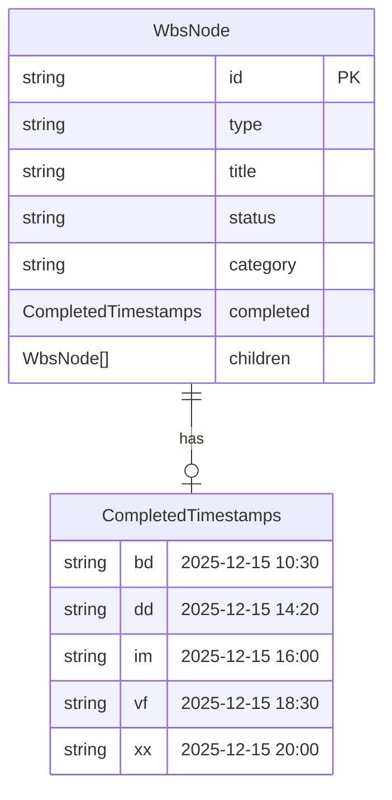
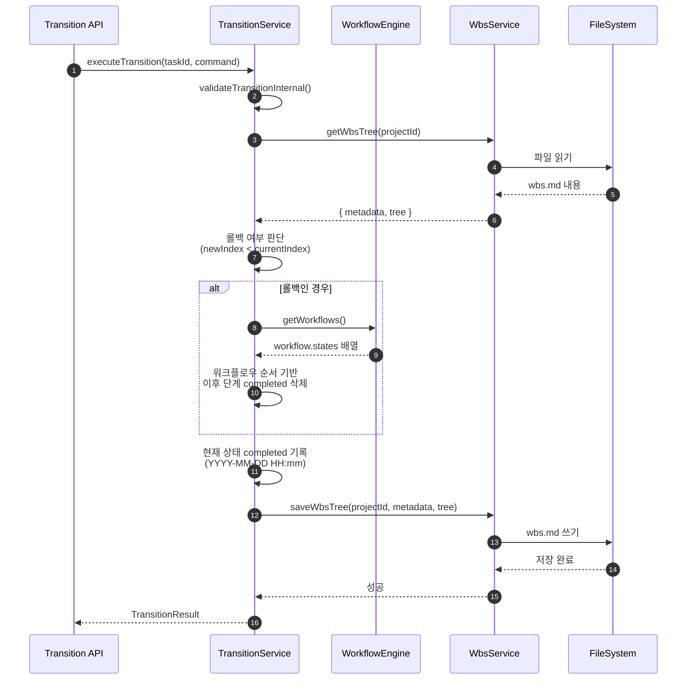
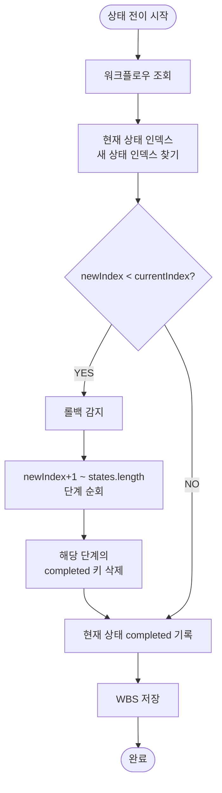

# 상세설계 (020-detail-design.md)

**Template Version:** 3.0.0 — **Last Updated:** 2025-12-15

> **설계 규칙**
> * *기능 중심 설계*에 집중한다.
> * 실제 소스코드(전체 또는 일부)는 **절대 포함하지 않는다**.
> * 작성 후 **상위 문서(PRD, TRD, 기본설계)와 비교**하여 차이가 있으면 **즉시 중단 → 차이 설명 → 지시 대기**.
> * **다이어그램 규칙**
>   * 프로세스: **Mermaid**만 사용
>   * UI 레이아웃: **Text Art(ASCII)** → 바로 아래 **SVG 개념도**를 순차 배치
>
> **분할 문서**
> * 요구사항 추적성: `025-traceability-matrix.md`
> * 테스트 명세: `026-test-specification.md`

---

## 0. 문서 메타데이터

| 항목 | 내용 |
|------|------|
| Task ID | TSK-03-06 |
| Task명 | completed 필드 지원 (Parser/Serializer/API) |
| Category | development |
| 상태 | [dd] 상세설계 |
| 작성일 | 2025-12-15 |
| 작성자 | AI Agent |

### 상위 문서 참조

| 문서 유형 | 경로 | 참조 섹션 |
|----------|------|----------|
| PRD | `.orchay/projects/orchay/prd.md` | 섹션 7.5 |
| TRD | `.orchay/projects/orchay/trd.md` | 전체 |
| 기본설계 | `010-basic-design.md` | 전체 |
| 상위 Activity | ACT-03: Workflow Engine 구현 | - |
| 상위 Work Package | WP-03: Workflow & State Machine | - |

### 분할 문서 참조

| 문서 유형 | 파일명 | 목적 |
|----------|--------|------|
| 추적성 매트릭스 | `025-traceability-matrix.md` | 요구사항 ↔ 설계 ↔ 테스트 추적 |
| 테스트 명세 | `026-test-specification.md` | 테스트 시나리오, 데이터, data-testid |

---

## 1. 일관성 검증 결과

> 상위 문서와의 일관성 검증 결과를 기록합니다.

### 1.1 검증 요약

| 구분 | 통과 | 경고 | 실패 |
|------|------|------|------|
| PRD ↔ 기본설계 | 5개 | 0개 | 0개 |
| 기본설계 ↔ 상세설계 | 7개 | 1개 | 0개 |
| TRD ↔ 상세설계 | 4개 | 0개 | 0개 |

### 1.2 검증 상세

| 검증 ID | 검증 항목 | 결과 | 비고 |
|---------|----------|------|------|
| CHK-PRD-01 | 기능 요구사항 완전성 | ✅ PASS | FR-001~FR-004 모두 커버 |
| CHK-PRD-02 | 비즈니스 규칙 일치성 | ✅ PASS | 타임스탬프 형식, 롤백 정책 일치 |
| CHK-PRD-03 | 용어 일관성 | ✅ PASS | completed, CompletedTimestamps 일관됨 |
| CHK-BD-01 | 기능 요구사항 완전성 | ✅ PASS | 기존 구현 검증 + 롤백 로직 추가 설계 |
| CHK-BD-02 | 비즈니스 규칙 구현 명세 | ✅ PASS | 타임스탬프 형식, 롤백 시 삭제 정책 |
| CHK-BD-03 | 데이터 모델 일치성 | ✅ PASS | CompletedTimestamps 타입 일치 |
| CHK-BD-04 | 기존 구현 확인 | ⚠️ WARN | Parser/Serializer/Transition API 이미 구현됨 확인 필요 |
| CHK-BD-05 | 롤백 로직 설계 | ✅ PASS | 워크플로우 순서 기반 삭제 알고리즘 설계 |
| CHK-TRD-01 | 기술 스택 준수 | ✅ PASS | TypeScript, Server Utilities 사용 |
| CHK-TRD-02 | 아키텍처 패턴 준수 | ✅ PASS | Layered Architecture (Parser → Service → API) |
| CHK-TRD-03 | 코딩 규칙 준수 | ✅ PASS | TypeScript, 함수형 프로그래밍 |
| CHK-TRD-04 | 테스트 전략 준수 | ✅ PASS | 단위 테스트 + E2E 테스트 |

---

## 2. 목적 및 범위

### 2.1 목적

워크플로우 상태 전이 시 각 단계별 완료 시각을 자동으로 기록하고, 롤백 시 이후 단계의 completed 타임스탬프를 삭제하여 데이터 일관성을 유지합니다. 이를 통해 Task의 진행 이력을 정확히 추적할 수 있습니다.

### 2.2 범위

**포함 범위**:
- 기존 구현 검증 테스트 작성 (Parser, Serializer, Transition API)
- 롤백 로직 설계 및 구현 (transitionService.ts)
- 워크플로우 순서 기반 completed 삭제 알고리즘
- 단위 테스트 및 E2E 테스트 시나리오

**제외 범위**:
- UI 컴포넌트 구현 (Timeline 표시 등) → 향후 Task
- 통계 분석 기능 (평균 소요 시간 계산 등) → 향후 Task
- 이력 조회 API (별도 API로 분리 가능) → 향후 Task

---

## 3. 기술 스택

> TRD 기준, 이 Task에서 사용하는 기술만 명시

| 구분 | 기술 | 버전 | 용도 |
|------|------|------|------|
| Runtime | Node.js | 20.x | Server Utilities 실행 |
| Language | TypeScript | 5.x | 타입 안정성 |
| Testing (Unit) | Vitest | 2.x | 단위 테스트 |
| Testing (E2E) | Playwright | 1.49.x | E2E 테스트 |
| Data | JSON 파일 (.orchay/) | - | 설정 데이터 (workflows.json) |

---

## 4. 용어/가정/제약

### 4.1 용어 정의

| 용어 | 정의 |
|------|------|
| completed | Task의 각 워크플로우 단계별 완료 시각을 기록하는 필드 (Record<string, string> 형태) |
| CompletedTimestamps | completed 필드의 TypeScript 타입 (예: { bd: "2025-12-15 10:30", dd: "2025-12-15 14:20" }) |
| Rollback | 워크플로우 상태를 이전 단계로 되돌리는 작업 (예: [im] → [dd]) |
| Status Code | 워크플로우 상태 코드 (예: "bd", "dd", "im", "vf", "xx") |
| Workflow Order | 카테고리별로 정의된 워크플로우 상태의 진행 순서 |

### 4.2 가정 (Assumptions)

- workflows.json (또는 defaults.ts)에 카테고리별 워크플로우 순서(states)가 정의되어 있음
- 롤백은 워크플로우 순서상 이전 단계로만 이동 가능함 (임의 단계로 점프 불가)
- 타임스탬프 형식은 "YYYY-MM-DD HH:mm" (로컬 시간, PRD 7.5 명시)
- 기존 구현(Parser, Serializer, Transition API)이 정상 동작함

### 4.3 타임존 처리 방침 (ISS-002 반영)

> **타임스탬프 = 서버의 시스템 시간 (타임존 변환 없음)**

| 항목 | 설명 |
|------|------|
| 시간 기준 | Node.js 서버의 시스템 시간 (`new Date()`) |
| 저장 형식 | `YYYY-MM-DD HH:mm` (로컬 시간, 타임존 정보 없음) |
| 표시 방식 | 저장된 그대로 표시 (타임존 변환 없음) |
| 리스크 | 서버와 클라이언트 타임존 차이로 인한 시각 불일치 가능 |
| 향후 개선 | UI에서 타임스탬프 표시 시 사용자 타임존 변환 고려 (별도 Task)

### 4.4 제약 (Constraints)

- 롤백 시 이후 단계의 completed 항목을 즉시 삭제해야 함 (데이터 일관성)
- 타임스탬프 형식 변경 불가 (하위 호환성 유지)
- 파싱 성능은 기존 대비 5% 이내 오버헤드 (NFR-003)

---

## 5. 시스템/모듈 구조

> **규칙**: 구현 코드가 아닌 **구조/역할/책임**만 표현

### 5.1 모듈 역할 및 책임

| 모듈 | 역할 | 책임 |
|------|------|------|
| parseCompleted() | completed 필드 파싱 | - 중첩 리스트 형식 파싱<br>- CompletedTimestamps 객체 생성<br>- 잘못된 형식 라인 무시 |
| serializeAttributes() | completed 필드 직렬화 | - CompletedTimestamps를 마크다운 목록으로 변환<br>- 올바른 들여쓰기 적용 |
| executeTransition() | 타임스탬프 자동 기록 및 롤백 처리 | - 상태 전이 시 현재 시각 기록<br>- 롤백 감지 및 이후 단계 completed 삭제<br>- WBS 트리 업데이트 |
| getWorkflows() | 워크플로우 설정 조회 (기존 함수) | - 카테고리별 워크플로우 states 배열 반환<br>- workflows.json 또는 defaults.ts 참조 |
| isRollback() | 롤백 여부 판단 (내부 로직) | - 현재 상태와 새 상태의 인덱스 비교<br>- 롤백 여부 boolean 반환 |

### 5.2 모듈 구조도 (개념)

```
server/utils/
├── wbs/
│   ├── parser/
│   │   └── _attributes.ts           # parseCompleted() 존재 (검증 필요)
│   └── serializer/
│       └── _attributes.ts           # serializeAttributes() 존재 (검증 필요)
├── workflow/
│   ├── transitionService.ts         # executeTransition() 존재 (롤백 로직 추가)
│   ├── statusUtils.ts               # extractStatusCode(), formatStatusCode()
│   └── workflowEngine.ts            # getWorkflowState() (워크플로우 조회)
└── settings/
    ├── index.ts                     # getWorkflows() (워크플로우 설정 조회)
    └── defaults.ts                  # DEFAULT_WORKFLOWS (기본 워크플로우 정의)
```

### 5.3 외부 의존성

| 의존성 | 유형 | 용도 |
|--------|------|------|
| types/index.ts | Internal Type | CompletedTimestamps 타입 정의 |
| types/settings.ts | Internal Type | Workflow, WorkflowsConfig 타입 정의 |
| server/utils/settings/index.ts | Internal Service | getWorkflows() 설정 조회 |
| server/utils/wbs/wbsService.ts | Internal Service | saveWbsTree() WBS 저장 |

---

## 6. 데이터 모델 (개념 수준)

> **규칙**: 코드가 아닌 **개념 수준 ERD와 필드 정의**만 기술

### 6.1 엔티티 정의

#### Entity: WbsNode (Task)

| 필드명 | 타입 | 필수 | 설명 | 제약조건 |
|--------|------|------|------|----------|
| id | string | Y | Task ID | PK, "TSK-XX-XX" 형식 |
| type | 'task' | Y | 노드 타입 | 고정값 'task' |
| title | string | Y | Task 제목 | 1-200자 |
| status | string | Y | 현재 상태 | "[bd]", "[dd]" 등 |
| category | TaskCategory | Y | 카테고리 | 'development', 'defect', 'infrastructure' |
| **completed** | CompletedTimestamps | N | **단계별 완료 시각** | **Record<string, string>** |
| children | WbsNode[] | N | 하위 노드 | 빈 배열 |

#### Type: CompletedTimestamps

| 필드명 | 타입 | 설명 | 예시 |
|--------|------|------|------|
| [key: string] | string | 상태 코드 → 완료 시각 | `{ bd: "2025-12-15 10:30", dd: "2025-12-15 14:20" }` |

### 6.2 관계 다이어그램



### 6.3 인덱스 및 제약조건

| 엔티티 | 인덱스/제약 | 필드 | 목적 |
|--------|------------|------|------|
| WbsNode | PK | id | 고유 식별 |
| CompletedTimestamps | - | - | Key-Value 저장, 순서 유지 (Object.entries()) |

---

## 7. 인터페이스 계약 (API Contract)

> **규칙**: TypeScript 코드가 아닌 **표 형태의 계약 정의**

### 7.1 함수 인터페이스 목록

| 함수명 | 모듈 | 설명 | 요구사항 |
|--------|------|------|----------|
| parseCompleted() | _attributes.ts (parser) | completed 필드 파싱 | FR-001 |
| serializeAttributes() | _attributes.ts (serializer) | completed 필드 직렬화 | FR-002 |
| executeTransition() | transitionService.ts | 타임스탬프 기록 및 롤백 처리 | FR-003, FR-004 |
| getWorkflows() | server/utils/settings/index.ts | 워크플로우 설정 조회 (기존 함수 활용) | FR-004 |

### 7.2 API 상세: parseCompleted()

**요구사항**: FR-001 (completed 필드 파싱)

#### 요청 (Request)

| 구분 | 파라미터 | 타입 | 필수 | 설명 | 기본값 |
|------|----------|------|------|------|--------|
| 입력 | lines | string[] | Y | 속성 라인 배열 | - |
| 입력 | startIndex | number | Y | 시작 인덱스 | - |

#### 응답 (Response)

**성공 응답**:

| 필드 | 타입 | 설명 |
|------|------|------|
| completed | CompletedTimestamps | 파싱된 completed 객체 (예: { bd: "2025-12-15 10:30" }) |

**예외 상황**:
- 빈 completed 필드 → 빈 객체 `{}` 반환
- 잘못된 형식 라인 → 무시하고 계속 파싱
- 새로운 속성 시작 → 파싱 중단

#### 유효성 검증

| 필드 | 규칙 | 처리 방법 |
|------|------|----------|
| lines | 배열 필수 | 빈 배열이면 빈 객체 반환 |
| 형식 | "  - bd: 2025-12-15 10:30" | 정규식 매칭, 불일치 시 무시 |

---

### 7.3 API 상세: serializeAttributes()

**요구사항**: FR-002 (completed 필드 직렬화)

#### 요청 (Request)

| 구분 | 파라미터 | 타입 | 필수 | 설명 | 기본값 |
|------|----------|------|------|------|--------|
| 입력 | node | WbsNode | Y | WBS 노드 객체 | - |

#### 응답 (Response)

**성공 응답**:

| 필드 | 타입 | 설명 |
|------|------|------|
| lines | string[] | 마크다운 라인 배열 (예: ["- completed:", "  - bd: 2025-12-15 10:30"]) |

**예외 상황**:
- completed 없음 → completed 라인 출력 안 함
- 빈 completed 객체 → completed 라인 출력 안 함

#### 유효성 검증

| 필드 | 규칙 | 처리 방법 |
|------|------|----------|
| node.completed | 선택 | 없거나 빈 객체이면 출력 안 함 |
| 들여쓰기 | 2칸 공백 | "  - bd: ..." 형식 유지 |

---

### 7.4 API 상세: executeTransition()

**요구사항**: FR-003 (타임스탬프 자동 기록), FR-004 (롤백 처리)

#### 요청 (Request)

| 구분 | 파라미터 | 타입 | 필수 | 설명 | 기본값 |
|------|----------|------|------|------|--------|
| 입력 | taskId | string | Y | Task ID | - |
| 입력 | command | string | Y | 전이 명령어 | - |
| 입력 | comment | string | N | 변경 사유 | undefined |

#### 응답 (Response)

**성공 응답 (TransitionResult)**:

| 필드 | 타입 | 설명 |
|------|------|------|
| success | boolean | 성공 여부 (항상 true) |
| taskId | string | Task ID |
| previousStatus | string | 이전 상태 코드 (예: "bd") |
| newStatus | string | 새 상태 코드 (예: "dd") |
| command | string | 실행된 명령어 |
| documentCreated | string? | 생성된 문서 파일명 |
| timestamp | string | 실행 시각 (ISO 8601) |

**에러 응답**:

| 코드 | 에러 코드 | 설명 | 비즈니스 규칙 |
|------|----------|------|--------------|
| 404 | TASK_NOT_FOUND | Task 없음 | - |
| 409 | INVALID_TRANSITION | 유효하지 않은 전이 | BR-전이 규칙 |
| 500 | FILE_WRITE_ERROR | wbs.md 저장 실패 | - |

#### 유효성 검증

| 필드 | 규칙 | 에러 메시지 | 비즈니스 규칙 |
|------|------|------------|--------------|
| taskId | 존재하는 Task | Task를 찾을 수 없습니다 | - |
| command | 현재 상태에서 가능한 명령어 | 유효하지 않은 전이입니다 | 워크플로우 규칙 |

---

## 8. 프로세스 흐름

### 8.1 프로세스 설명

> 각 단계에 관련 요구사항 태그 `[FR-XXX]` 병기

**파싱 프로세스 (wbs.md → WbsNode)**:
1. **라인 순회** [FR-001]: parseCompleted() 함수가 속성 라인 배열을 순회
2. **들여쓰기 리스트 감지**: "  - bd: 2025-12-15 10:30" 형식 매칭
3. **키-값 추출**: 콜론(:) 기준으로 키와 값 분리
4. **객체 생성**: CompletedTimestamps 객체에 추가
5. **중단 조건**: 새로운 속성 시작 또는 빈 줄 연속 시 파싱 중단

**직렬화 프로세스 (WbsNode → wbs.md)**:
1. **completed 존재 확인** [FR-002]: node.completed 필드 확인
2. **빈 객체 체크**: Object.keys(completed).length > 0 확인
3. **헤더 출력**: "- completed:" 라인 추가
4. **항목 순회**: Object.entries()로 키-값 순회
5. **항목 출력**: "  - ${key}: ${value}" 형식으로 추가

**전이 프로세스 (상태 전이 시)**:
1. **Task 조회** [FR-003]: findTaskById()로 Task 검색
2. **전이 유효성 검증**: validateTransitionInternal()로 규칙 확인
3. **롤백 여부 판단** [FR-004]: 새 상태가 이전 단계인지 확인
4. **타임스탬프 기록**: 현재 시각을 "YYYY-MM-DD HH:mm" 형식으로 기록
5. **롤백 처리**: 롤백인 경우 이후 단계 completed 삭제
6. **WBS 저장**: saveWbsTree()로 파일 저장

### 8.2 시퀀스 다이어그램 (롤백 시나리오)



### 8.3 롤백 알고리즘 흐름도



---

## 9. 비즈니스 규칙 구현 명세

> 기본설계 BR-XXX 규칙의 구현 방안

| 규칙 ID | 규칙 설명 | 구현 위치(개념) | 구현 방식(개념) | 검증 방법 |
|---------|----------|-----------------|-----------------|-----------|
| BR-001 | 타임스탬프 형식 "YYYY-MM-DD HH:mm" | executeTransition() | Date 객체 포맷팅 함수 | 단위 테스트 (형식 검증) |
| BR-002 | 상태 전이 시 자동 기록 | executeTransition() | newStatus 코드 추출 후 completed[code] = timestamp | E2E 테스트 (전이 후 확인) |
| BR-003 | 롤백 시 이후 단계 삭제 | executeTransition() | 워크플로우 순서 기반 인덱스 비교 및 삭제 | 단위 테스트 + E2E 테스트 |
| BR-004 | 기존 completed 항목 보존 | executeTransition() | 기존 completed 객체 유지, 새 키만 추가/덮어쓰기 | 단위 테스트 |

---

## 10. 오류/예외 처리

### 10.1 예상 오류 상황

| 오류 상황 | 오류 코드 | 사용자 메시지 | 복구 전략 |
|----------|----------|--------------|----------|
| Task 없음 | TASK_NOT_FOUND | Task를 찾을 수 없습니다 | 404 응답, 로그 기록 |
| 유효하지 않은 전이 | INVALID_TRANSITION | 현재 상태에서 해당 명령어를 사용할 수 없습니다 | 409 응답, 가능한 명령어 안내 |
| 워크플로우 없음 | WORKFLOW_NOT_FOUND | 카테고리에 해당하는 워크플로우를 찾을 수 없습니다 | 400 응답, 설정 확인 필요 |
| wbs.md 저장 실패 | FILE_WRITE_ERROR | 데이터 저장에 실패했습니다 | 500 응답, 재시도 안내 |

### 10.2 경계 조건 (ISS-003, ISS-004 반영)

| 조건 | 처리 방안 | 상세 설명 |
|------|----------|----------|
| completed 필드 없음 | 빈 객체 `{}` 반환 (Parser), 출력 안 함 (Serializer) | 정상 동작 |
| 롤백 시 삭제할 completed 키 없음 | 무시하고 계속 진행 (에러 없음) | JavaScript의 `delete` 연산자는 존재하지 않는 키 삭제 시 에러 없이 무시됨. 별도 체크 불필요 |
| 워크플로우 순서에 없는 상태 코드 | 경고 로그 후 무시 | `console.warn()` 사용, 삭제 대상 목록에서 제외 (데이터 보존) |
| 중복 전이 (같은 상태로 재전이) | completed 타임스탬프 덮어쓰기 | **비즈니스 규칙**: 중복 전이는 "재시작"으로 간주하여 타임스탬프 갱신. 원본 시각이 필요한 경우 이력 조회 기능 활용 (향후 Task) |

---

## 11. 구현 체크리스트

### Backend
- [x] parseCompleted() 함수 검증 (이미 구현됨)
- [x] serializeAttributes() completed 처리 검증 (이미 구현됨)
- [x] executeTransition() 타임스탬프 기록 검증 (이미 구현됨)
- [ ] 롤백 감지 로직 추가 (executeTransition)
- [ ] 워크플로우 순서 조회 로직 추가
- [ ] 이후 단계 completed 삭제 로직 추가
- [ ] 단위 테스트 작성

### 품질
- [ ] 요구사항 추적성 검증 완료 (`025-traceability-matrix.md`)
- [ ] 테스트 명세 작성 완료 (`026-test-specification.md`)
- [ ] 비즈니스 규칙 구현 완료
- [ ] 일관성 검증 통과

---

## 12. 롤백 로직 상세 설계

### 12.1 롤백 감지 알고리즘 (ISS-001 반영)

> **참고**: 워크플로우 순서 조회는 기존 `getWorkflows()` 함수 (server/utils/settings/index.ts)를 사용합니다.

**입력**:
- `category`: TaskCategory (development, defect, infrastructure)
- `currentStatus`: 현재 상태 코드 (예: "im")
- `newStatus`: 새 상태 코드 (예: "dd")

**출력**:
- `isRollback`: boolean (true면 롤백, false면 정상 전이)

**처리 순서**:
1. `getWorkflows()`로 워크플로우 설정 조회 (기존 함수 활용)
2. category에 해당하는 Workflow 객체 찾기
3. workflow.states 배열에서 currentStatus와 newStatus의 인덱스 찾기
4. newIndex < currentIndex 이면 롤백으로 판단

**코드 예시** (개념):
```
// 워크플로우 설정 조회 (기존 함수 사용)
const workflowsConfig = await getWorkflows();
const workflow = workflowsConfig[category];
if (!workflow) {
  throw new Error(`Workflow not found for category: ${category}`);
}
const states = workflow.states; // ["[ ]", "[bd]", "[dd]", ...]
```

### 12.2 completed 삭제 알고리즘

**입력**:
- `workflow.states`: 워크플로우 순서 배열 (예: ["[ ]", "[bd]", "[dd]", "[im]", "[vf]", "[xx]"])
- `newIndex`: 새 상태의 인덱스 (예: 2 for "[dd]")
- `node.completed`: 현재 completed 객체 (예: { bd: "...", dd: "...", im: "...", vf: "..." })

**출력**:
- 업데이트된 `node.completed` 객체 (예: { bd: "...", dd: "..." })

**처리 순서**:
1. newIndex + 1부터 states.length까지 순회
2. 각 인덱스의 상태 코드를 extractStatusCode()로 추출
3. node.completed에 해당 키가 있으면 `delete node.completed[key]` 실행
   - **키가 없으면 무시 (에러 발생 없음)** - JavaScript의 delete 연산자 특성
4. 업데이트된 completed 객체 반환

### 12.3 롤백 시나리오 예시

**시나리오 1: [im] → [dd] 롤백 (development)**

| 항목 | 값 |
|------|-----|
| **워크플로우 순서** | ["[ ]", "[bd]", "[dd]", "[im]", "[vf]", "[xx]"] |
| **현재 상태** | "[im]" (인덱스 3) |
| **새 상태** | "[dd]" (인덱스 2) |
| **롤백 여부** | true (2 < 3) |
| **삭제 대상** | 인덱스 3~5: "[im]", "[vf]", "[xx]" |
| **Before completed** | `{ bd: "2025-12-15 10:00", dd: "2025-12-15 12:00", im: "2025-12-15 14:00" }` |
| **After completed** | `{ bd: "2025-12-15 10:00", dd: "2025-12-15 16:30" }` (dd 타임스탬프 갱신) |

**시나리오 2: [fx] → [an] 롤백 (defect)**

| 항목 | 값 |
|------|-----|
| **워크플로우 순서** | ["[ ]", "[an]", "[fx]", "[vf]", "[xx]"] |
| **현재 상태** | "[fx]" (인덱스 2) |
| **새 상태** | "[an]" (인덱스 1) |
| **롤백 여부** | true (1 < 2) |
| **삭제 대상** | 인덱스 2~4: "[fx]", "[vf]", "[xx]" |
| **Before completed** | `{ an: "2025-12-15 09:00", fx: "2025-12-15 11:00" }` |
| **After completed** | `{ an: "2025-12-15 13:00" }` (an 타임스탬프 갱신) |

**시나리오 3: [bd] → [dd] 정상 전이 (롤백 아님)**

| 항목 | 값 |
|------|-----|
| **워크플로우 순서** | ["[ ]", "[bd]", "[dd]", "[im]", "[vf]", "[xx]"] |
| **현재 상태** | "[bd]" (인덱스 1) |
| **새 상태** | "[dd]" (인덱스 2) |
| **롤백 여부** | false (2 > 1) |
| **삭제 대상** | 없음 |
| **Before completed** | `{ bd: "2025-12-15 10:00" }` |
| **After completed** | `{ bd: "2025-12-15 10:00", dd: "2025-12-15 11:00" }` (dd 추가) |

---

## 13. 다음 단계

- `/wf:build` 명령어로 구현 진행
- 롤백 로직 구현 후 단위 테스트 작성
- E2E 테스트로 전체 워크플로우 검증

---

## 관련 문서

- 추적성 매트릭스: `025-traceability-matrix.md`
- 테스트 명세: `026-test-specification.md`
- 기본설계: `010-basic-design.md`
- PRD: `.orchay/projects/orchay/prd.md`
- TRD: `.orchay/projects/orchay/trd.md`

---

<!--
author: AI Agent
Template Version: 3.0.0
-->
