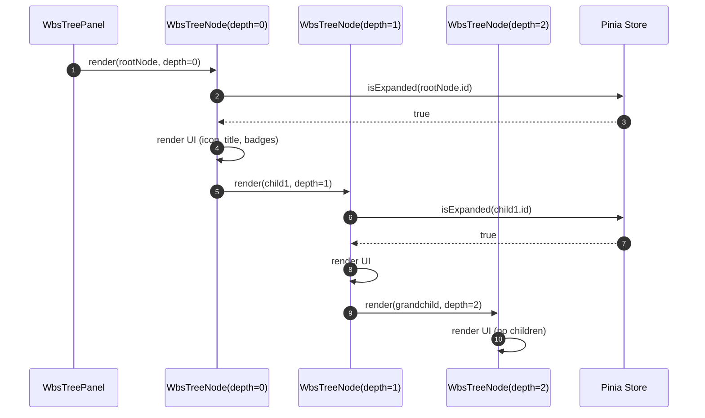
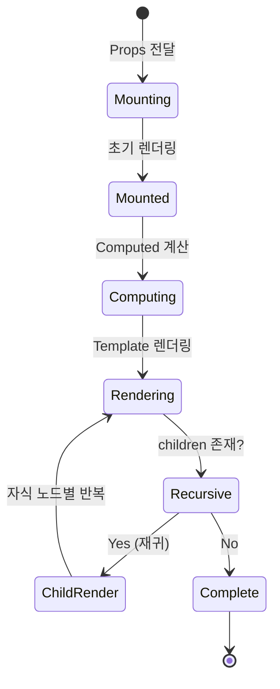

# 상세설계 (020-detail-design.md)

**Template Version:** 3.0.0 — **Last Updated:** 2025-12-15

> **설계 규칙**
> * *기능 중심 설계*에 집중한다.
> * 실제 소스코드(전체 또는 일부)는 **절대 포함하지 않는다**.
> * 작성 후 **상위 문서(PRD, TRD, 기본설계)와 비교**하여 차이가 있으면 **즉시 중단 → 차이 설명 → 지시 대기**.
> * **다이어그램 규칙**
>   * 프로세스: **Mermaid**만 사용
>   * UI 레이아웃: **Text Art(ASCII)** → 바로 아래 **SVG 개념도**를 순차 배치
>
> **분할 문서**
> * 요구사항 추적성: `025-traceability-matrix.md`
> * 테스트 명세: `026-test-specification.md`

---

## 0. 문서 메타데이터

| 항목 | 내용 |
|------|------|
| Task ID | TSK-04-02 |
| Task명 | Tree Node |
| Category | development |
| 상태 | [dd] 상세설계 |
| 작성일 | 2025-12-15 |
| 작성자 | Claude (System Architect) |

### 상위 문서 참조

| 문서 유형 | 경로 | 참조 섹션 |
|----------|------|----------|
| PRD | `.orchay/projects/orchay/prd.md` | 섹션 6.2.2, 10.1 |
| TRD | `.orchay/projects/orchay/trd.md` | 전체 |
| 기본설계 | `010-basic-design.md` | 전체 |
| UI설계 | `011-ui-design.md` | 전체 |
| 상위 Work Package | WP-04: WBS Tree View | - |

### 분할 문서 참조

| 문서 유형 | 파일명 | 목적 |
|----------|--------|------|
| 추적성 매트릭스 | `025-traceability-matrix.md` | 요구사항 ↔ 설계 ↔ 테스트 추적 |
| 테스트 명세 | `026-test-specification.md` | 테스트 시나리오, 데이터, data-testid |

---

## 1. 일관성 검증 결과

### 1.1 검증 요약

| 구분 | 통과 | 경고 | 실패 |
|------|------|------|------|
| PRD ↔ 기본설계 | 8개 | 0개 | 0개 |
| 기본설계 ↔ 상세설계 | 12개 | 0개 | 0개 |
| TRD ↔ 상세설계 | 5개 | 0개 | 0개 |

### 1.2 검증 상세

| 검증 ID | 검증 항목 | 결과 | 비고 |
|---------|----------|------|------|
| CHK-PRD-01 | 기능 요구사항 완전성 | ✅ PASS | FR-001 ~ FR-008 모두 반영 |
| CHK-PRD-02 | 비즈니스 규칙 일치성 | ✅ PASS | 워크플로우 상태 매핑 일치 |
| CHK-PRD-03 | 용어 일관성 | ✅ PASS | WbsNode, TaskCategory, TaskStatus 동일 |
| CHK-BD-01 | 컴포넌트 구조 일치성 | ✅ PASS | 5개 컴포넌트 모두 정의됨 |
| CHK-BD-02 | Props/Emits 인터페이스 | ✅ PASS | 모든 인터페이스 검증 완료 |
| CHK-BD-03 | 데이터 흐름 일치성 | ✅ PASS | Pinia 스토어 연동 방식 동일 |
| CHK-TRD-01 | Vue 3 Composition API | ✅ PASS | `<script setup>` 사용 |
| CHK-TRD-02 | PrimeVue 4.x 사용 | ✅ PASS | Tag, ProgressBar, Button 활용 |

---

## 2. 목적 및 범위

### 2.1 목적

WBS 트리 뷰에서 개별 노드를 재귀적으로 렌더링하는 컴포넌트 시스템을 구현합니다. 사용자가 WBS 계층 구조, 상태, 카테고리, 진행률 등을 직관적으로 확인할 수 있도록 시각적으로 일관되고 접근 가능한 UI를 제공합니다.

**해결하는 문제**:
- 무한 깊이의 WBS 계층 구조를 효율적으로 렌더링
- 계층별 시각적 차별화 (아이콘, 색상, 들여쓰기)
- 상태와 카테고리 정보의 일관된 시각화
- 진행률의 직관적인 표시

### 2.2 범위

**포함 범위**:
- WbsTreeNode: 재귀 렌더링 컨테이너 (들여쓰기, 펼침/접기, 선택 UI)
- NodeIcon: 계층별 아이콘 배지 (라운드 사각형, 색상 매핑)
- StatusBadge: 상태 표시 배지 (9개 상태 지원)
- CategoryTag: 카테고리 태그 (3개 카테고리 지원)
- ProgressBar: 진행률 시각화 (3구간 색상 분리)

**제외 범위**:
- 트리 인터랙션 로직 (토글, 선택 이벤트 처리) → TSK-04-03
- WBS 데이터 로드 및 스토어 관리 → TSK-04-01
- 노드 편집 기능 → WP-05
- 검색 하이라이트 기능 → TSK-04-01 (향후)

---

## 3. 기술 스택

| 구분 | 기술 | 버전 | 용도 |
|------|------|------|------|
| Frontend | Vue 3 (Composition API) | 3.5.x | 컴포넌트 렌더링 |
| Framework | Nuxt 3 | 3.18.x | 애플리케이션 프레임워크 |
| UI Framework | PrimeVue | 4.x | 기본 UI 컴포넌트 (Tag, ProgressBar, Button) |
| Styling | TailwindCSS | 3.4.x | 유틸리티 CSS 및 커스텀 스타일 |
| State Management | Pinia | 2.x | 트리 상태 관리 (확장/선택) |
| Testing | Vitest + Playwright | 2.x / 1.49.x | 단위/E2E 테스트 |

---

## 4. 용어/가정/제약

### 4.1 용어 정의

| 용어 | 정의 |
|------|------|
| WbsNode | WBS 트리의 단일 노드 (Project, WP, ACT, Task 모두 포함) |
| Depth | 트리 계층 깊이 (0=Project, 1=WP, 2=ACT, 3=Task) |
| 재귀 렌더링 | 컴포넌트가 자기 자신을 children으로 호출하여 트리 구조 렌더링 |
| Pass Through | PrimeVue 컴포넌트의 내부 스타일 커스터마이징 API |
| 라운드 사각형 | border-radius 적용된 사각형 배지 (4px 모서리) |

### 4.2 가정 (Assumptions)

- WbsNode 데이터 구조는 TSK-02-02-01에서 정의된 형식을 따름
- Pinia 스토어 (wbs, selection)는 TSK-04-01에서 구현됨
- PrimeVue 4.x는 TSK-01-01-02에서 설정 완료
- 최대 트리 깊이는 4단계 (Project → WP → ACT → Task)
- 노드 수는 1000개 미만 (성능 최적화 필요시 가상 스크롤 고려)

### 4.3 제약 (Constraints)

- Vue 3 재귀 컴포넌트 제약: name 옵션 필요
- PrimeVue Tag severity는 제한된 옵션만 지원 (secondary, info, warning, success)
- 브라우저 최소 너비: 300px (모바일 지원)
- TailwindCSS 색상 팔레트 범위 내에서만 커스터마이징

---

## 5. 시스템/모듈 구조

### 5.1 모듈 역할 및 책임

| 모듈 | 역할 | 책임 |
|------|------|------|
| WbsTreeNode.vue | 재귀 컨테이너 | - 노드 렌더링<br>- 자식 노드 재귀 호출<br>- 들여쓰기 계산<br>- 펼침/접기 UI 표시 |
| NodeIcon.vue | 계층 아이콘 | - 계층별 아이콘 매핑<br>- 색상 적용<br>- 라운드 배지 스타일 |
| StatusBadge.vue | 상태 배지 | - 상태 코드 파싱<br>- 레이블 변환<br>- Severity 매핑 |
| CategoryTag.vue | 카테고리 태그 | - 카테고리별 아이콘 표시<br>- 색상 적용<br>- 레이블 표시 |
| ProgressBar.vue | 진행률 바 | - 진행률 시각화<br>- 구간별 색상 적용<br>- 퍼센트 텍스트 표시 |

### 5.2 모듈 구조도 (개념)

```
app/
├── components/
│   └── wbs/
│       ├── WbsTreeNode.vue         ← 재귀 컨테이너
│       ├── NodeIcon.vue            ← 계층 아이콘
│       ├── StatusBadge.vue         ← 상태 배지
│       ├── CategoryTag.vue         ← 카테고리 태그
│       └── ProgressBar.vue         ← 진행률 바
├── stores/
│   ├── wbs.ts                      ← 트리 상태 (expandedNodes)
│   └── selection.ts                ← 선택 상태 (selectedNode)
└── types/
    └── index.ts                    ← WbsNode, TaskCategory, TaskStatus
```

### 5.3 외부 의존성

| 의존성 | 유형 | 용도 |
|--------|------|------|
| PrimeVue Tag | UI Component | 상태/카테고리 배지 |
| PrimeVue ProgressBar | UI Component | 진행률 표시 |
| PrimeVue Button | UI Component | 펼침/접기 버튼 |
| Pinia | Library | 전역 상태 관리 |
| TailwindCSS | Library | 유틸리티 CSS |

---

## 6. 데이터 모델 (개념 수준)

### 6.1 엔티티 정의

#### Entity: WbsNode (기존 정의 활용)

| 필드명 | 타입 | 필수 | 설명 | 제약조건 |
|--------|------|------|------|----------|
| id | String | Y | 노드 고유 ID | WP-XX, ACT-XX-XX, TSK-XX-XX-XX 형식 |
| type | WbsNodeType | Y | 계층 타입 | 'project', 'wp', 'act', 'task' |
| title | String | Y | 노드 제목 | 1-200자 |
| status | String | N | 현재 상태 | 예: "basic-design [bd]" |
| category | TaskCategory | N | 카테고리 | 'development', 'defect', 'infrastructure' |
| priority | Priority | N | 우선순위 | 'critical', 'high', 'medium', 'low' |
| progress | Number | N | 진행률 | 0-100 정수 |
| children | WbsNode[] | Y | 자식 노드 배열 | 빈 배열 가능 |

### 6.2 타입 정의 (types/index.ts)

```
WbsNodeType: 'project' | 'wp' | 'act' | 'task'
TaskCategory: 'development' | 'defect' | 'infrastructure'
TaskStatus: '[ ]' | '[bd]' | '[dd]' | '[an]' | '[ds]' | '[im]' | '[fx]' | '[vf]' | '[xx]'
Priority: 'critical' | 'high' | 'medium' | 'low'
```

### 6.3 컴포넌트 Props 인터페이스

#### WbsTreeNode Props
- `node: WbsNode` (필수)
- `depth: number` (선택, 기본값: 0)

#### NodeIcon Props
- `type: WbsNodeType` (필수)

#### StatusBadge Props
- `status: string` (필수)

#### CategoryTag Props
- `category: TaskCategory` (필수)

#### ProgressBar Props
- `value: number` (필수, 0-100)
- `showValue: boolean` (선택, 기본값: true)

---

## 7. 인터페이스 계약 (API Contract)

이 Task는 Frontend UI 컴포넌트이므로 Backend API는 없습니다.
대신 **Pinia Store 인터페이스**를 정의합니다.

### 7.1 Pinia Store 인터페이스

#### stores/wbs.ts (TSK-04-01에서 구현)

**State**:
- `expandedNodes: Set<string>` - 펼쳐진 노드 ID 집합

**Getters**:
- `isExpanded(nodeId: string): boolean` - 노드 펼침 상태 확인

**Actions**:
- `toggleExpand(nodeId: string): void` - 노드 펼침/접기 토글

#### stores/selection.ts (TSK-04-01에서 구현)

**State**:
- `selectedNode: WbsNode | null` - 현재 선택된 노드

**Getters**:
- `isSelected(nodeId: string): boolean` - 노드 선택 상태 확인

**Actions**:
- `selectNode(node: WbsNode): void` - 노드 선택
- `clearSelection(): void` - 선택 해제

---

## 8. 프로세스 흐름

### 8.1 프로세스 설명

#### 노드 렌더링 프로세스

1. **초기 렌더링** [FR-001]: WbsTreePanel에서 루트 노드를 WbsTreeNode에 전달 (depth=0)
2. **노드 UI 구성** [FR-002, FR-004]: NodeIcon, 제목, StatusBadge, CategoryTag, ProgressBar 순차 렌더링
3. **들여쓰기 계산** [FR-002]: `depth × 20px`를 padding-left로 적용
4. **펼침/접기 아이콘 표시** [FR-003]: `children.length > 0`이면 Button 표시, 아니면 placeholder
5. **자식 노드 재귀 렌더링** [FR-001]: `isExpanded && children.length > 0`이면 children을 순회하며 WbsTreeNode 재귀 호출 (depth+1)
6. **선택 상태 시각화** [FR-008]: `isSelected`이면 selected 클래스 적용

#### 상태 코드 파싱 프로세스

1. **상태 문자열 입력** [FR-005]: `"basic-design [bd]"` 형식의 문자열
2. **정규식 파싱**: `\[([^\]]+)\]` 패턴으로 `[bd]` 추출
3. **레이블 매핑**: 상태 코드 → 레이블 딕셔너리 조회 (`bd` → `Design`)
4. **Severity 매핑**: 상태 코드 → PrimeVue severity 조회 (`bd` → `info`)
5. **PrimeVue Tag 렌더링** [FR-005]: `<Tag value="Design" severity="info" />`

### 8.2 재귀 렌더링 시퀀스



### 8.3 컴포넌트 생명주기



---

## 9. UI 설계

### 9.1 화면 목록

이 Task는 독립적인 화면이 아닌 **재사용 가능한 컴포넌트**입니다.
화면 통합은 TSK-04-01 (WbsTreePanel)에서 수행됩니다.

### 9.2 WbsTreeNode 레이아웃

```
┌─────────────────────────────────────────────────────────────┐
│ [indent] [▼] [📁] Project Alpha                             │ ← depth 0
│   [indent] [▼] [💼] WP-01: Backend                         │ ← depth 1
│     [indent] [▶] [📋] ACT-01-01: API Design                │ ← depth 2
│       [indent] [  ] [✓] TSK-01-01-01                       │ ← depth 3
│                         [Design] [Dev]                      │
│                         ▓▓▓▓▓▓░░░░░░ 45%                    │
└─────────────────────────────────────────────────────────────┘

구조:
┌────────────────────────────────────────────────────┐
│ [Indent] [Expand] [Icon] [Content Area]            │
│                                                     │
│  Content Area:                                     │
│  - Title (노드 제목)                                │
│  - Meta Row (StatusBadge + CategoryTag)            │
│  - ProgressBar                                     │
└────────────────────────────────────────────────────┘
```

### 9.3 컴포넌트 구조 (개념)

| 컴포넌트 | 역할 | Props (개념) | Events (개념) |
|----------|------|--------------|---------------|
| WbsTreeNode | 노드 컨테이너 | node, depth | 없음 (스토어 직접 사용) |
| NodeIcon | 아이콘 배지 | type | 없음 |
| StatusBadge | 상태 배지 | status | 없음 |
| CategoryTag | 카테고리 태그 | category | 없음 |
| ProgressBar | 진행률 바 | value, showValue | 없음 |

### 9.4 상태 관리 (개념)

| Store | 상태 | Getters | Actions |
|-------|------|---------|---------|
| wbs | expandedNodes: Set<string> | isExpanded(nodeId) | toggleExpand(nodeId) |
| selection | selectedNode: WbsNode \| null | isSelected(nodeId) | selectNode(node), clearSelection() |

### 9.5 반응형/접근성 가이드

**반응형**:
- `≥ Desktop (1024px)`: 표준 레이아웃, 모든 배지 표시
- `Tablet (768px)`: Meta Row 줄바꿈 가능
- `Mobile (<768px)`: 아이콘 크기 축소 (20px), 폰트 크기 14px

**접근성**:
- WbsTreeNode: `role="treeitem"`, `aria-expanded`, `aria-selected`, `aria-level`
- StatusBadge/CategoryTag: `aria-label` 추가
- ProgressBar: `role="progressbar"`, `aria-valuenow`, `aria-valuemin`, `aria-valuemax`
- 포커스 순서: 펼침/접기 버튼 → 노드 컨텐츠 → 자식 노드
- 키보드 네비게이션: Arrow Keys, Enter, Space (TSK-04-03에서 구현)

---

## 10. 비즈니스 규칙 구현 명세

이 Task는 순수 UI 컴포넌트로, 복잡한 비즈니스 규칙은 없습니다.
대신 **시각적 규칙**을 정의합니다.

| 규칙 ID | 규칙 설명 | 구현 위치(개념) | 구현 방식(개념) | 검증 방법 |
|---------|----------|-----------------|-----------------|-----------|
| VR-001 | 계층별 아이콘 색상 고유성 | NodeIcon.vue | 색상 매핑 딕셔너리 (project: indigo, wp: blue, act: green, task: amber) | 단위 테스트 |
| VR-002 | 상태 코드 파싱 실패 시 원본 표시 | StatusBadge.vue | 정규식 매칭 실패 시 status 원본 반환 | 단위 테스트 |
| VR-003 | 진행률 구간별 색상 구분 | ProgressBar.vue | 0-30% 빨강, 30-70% 황색, 70-100% 초록 | E2E 테스트 |
| VR-004 | 들여쓰기는 depth × 20px | WbsTreeNode.vue | Computed 속성으로 동적 계산 | E2E 테스트 |
| VR-005 | children 없으면 펼침/접기 버튼 숨김 | WbsTreeNode.vue | v-if="hasChildren" 조건부 렌더링 | E2E 테스트 |

---

## 11. 오류/예외 처리

### 11.1 예상 오류 상황

| 오류 상황 | 오류 코드 | 사용자 메시지 | 복구 전략 |
|----------|----------|--------------|----------|
| node prop 누락 | PROP_VALIDATION_ERROR | (콘솔 경고) | 빈 노드 렌더링 방지 |
| 상태 코드 파싱 실패 | - | 원본 status 문자열 표시 | 사용자에게는 영향 없음 |
| 잘못된 category 값 | - | 기본 아이콘 표시 (pi-question) | 기본 스타일 적용 |
| progress 범위 초과 | - | 0-100 범위로 클램핑 | Math.min(100, Math.max(0, value)) |
| 순환 참조 (재귀 무한) | RECURSION_ERROR | (스택 오버플로 방지 불가능, 데이터 검증 필요) | 데이터 검증은 WBS 파서에서 수행 |

### 11.2 경계 조건

| 조건 | 처리 방안 |
|------|----------|
| depth가 매우 큼 (>10) | CSS로 최대 들여쓰기 제한 (max 200px) |
| children이 빈 배열 | 펼침/접기 버튼 숨김, placeholder 표시 |
| title이 매우 긴 경우 | CSS ellipsis 적용 또는 줄바꿈 |
| status가 undefined | StatusBadge 렌더링 안 함 (v-if 조건) |
| progress가 undefined | ProgressBar 렌더링 안 함 (v-if 조건) |

---

## 12. 구현 체크리스트

### Frontend - 컴포넌트

#### WbsTreeNode.vue
- [ ] Vue 3 Composition API (`<script setup>`) 사용
- [ ] `name: 'WbsTreeNode'` 옵션 추가 (재귀를 위한 필수)
- [ ] Props 정의: `node: WbsNode`, `depth?: number`
- [ ] Computed 속성: `isExpanded`, `isSelected`, `hasChildren`, `indentWidth`
- [ ] 들여쓰기 스타일 바인딩: `:style="{ paddingLeft: \`\${indentWidth}px\` }"`
- [ ] 펼침/접기 버튼: `v-if="hasChildren"`로 조건부 렌더링
- [ ] 자식 노드 재귀: `v-if="isExpanded && hasChildren"`
- [ ] 선택 상태 클래스: `:class="{ selected: isSelected }"`
- [ ] ARIA 속성: `role="treeitem"`, `aria-expanded`, `aria-selected`, `aria-level`
- [ ] Hover 및 Focus 스타일

#### NodeIcon.vue
- [ ] Props 정의: `type: WbsNodeType`
- [ ] Computed 속성: `iconConfig` (icon, color, label 매핑)
- [ ] 라운드 사각형 스타일: `border-radius: 4px`, `24px × 24px`
- [ ] 계층별 색상 적용: `background-color` 동적 바인딩
- [ ] PrimeVue 아이콘 사용: `<i class="pi pi-{icon}" />`

#### StatusBadge.vue
- [ ] Props 정의: `status: string`
- [ ] Computed 속성: `statusCode` (정규식 파싱), `statusLabel`, `statusSeverity`
- [ ] PrimeVue Tag 사용: `<Tag :value="statusLabel" :severity="statusSeverity" rounded />`
- [ ] 9개 상태 모두 매핑 테이블 구현
- [ ] ARIA 속성: `aria-label`

#### CategoryTag.vue
- [ ] Props 정의: `category: TaskCategory`
- [ ] Computed 속성: `categoryConfig` (icon, color, label)
- [ ] PrimeVue Tag 사용: `<Tag :value="categoryLabel" :icon="categoryIcon" />`
- [ ] 커스텀 배경색: `:style="{ backgroundColor: categoryColor }"`
- [ ] ARIA 속성: `aria-label`

#### ProgressBar.vue
- [ ] Props 정의: `value: number`, `showValue?: boolean`
- [ ] Computed 속성: `barColor` (구간별 색상)
- [ ] PrimeVue ProgressBar 사용: `:pt="{ value: { style: { backgroundColor: barColor } } }"`
- [ ] ARIA 속성: `role="progressbar"`, `aria-valuenow`, `aria-valuemin`, `aria-valuemax`

### 품질
- [ ] 요구사항 추적성 검증 완료 (`025-traceability-matrix.md`)
- [ ] 테스트 명세 작성 완료 (`026-test-specification.md`)
- [ ] 일관성 검증 통과
- [ ] TypeScript 타입 검증 (no type errors)
- [ ] ESLint/Prettier 통과

---

## 13. 다음 단계

- `/wf:review` 명령어로 설계리뷰 진행
- 설계 승인 후 `/wf:build`로 구현 단계 진행

---

## 관련 문서

- 기본설계: `010-basic-design.md`
- UI설계: `011-ui-design.md`
- 추적성 매트릭스: `025-traceability-matrix.md`
- 테스트 명세: `026-test-specification.md`
- PRD: `.orchay/projects/orchay/prd.md`
- TRD: `.orchay/projects/orchay/trd.md`
- WBS: `.orchay/projects/orchay/wbs.md` (TSK-04-02)

---

<!--
author: Claude (System Architect)
Template Version: 3.0.0
Created: 2025-12-15
-->
