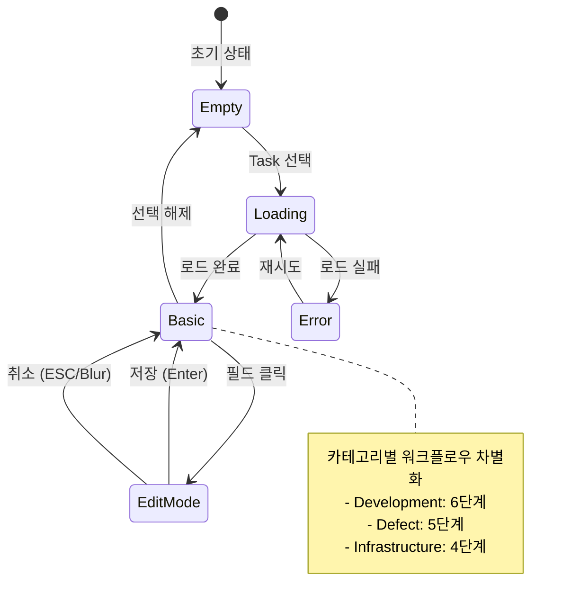

# 화면설계 (011-ui-design.md)

**Template Version:** 1.0.0 — **Last Updated:** 2025-12-15

> **화면설계 규칙**
> * 모든 화면 요소는 PrimeVue 4.x 컴포넌트 기반
> * SVG 목업으로 시각적 명확성 확보
> * 상호작용 시나리오 명시
> * 접근성 고려사항 포함

---

## 0. 문서 메타데이터

| 항목 | 내용 |
|------|------|
| Task ID | TSK-05-01 |
| Task명 | Detail Panel Structure |
| Category | development |
| 상태 | [bd] 기본설계 |
| 작성일 | 2025-12-15 |
| 작성자 | Claude (Frontend Architect) |

### 상위 문서 참조

| 문서 유형 | 경로 | 참조 섹션 |
|----------|------|----------|
| 기본설계 | `010-basic-design.md` | 전체 |
| PRD | `.orchay/projects/orchay/prd.md` | 섹션 6.3, 6.3.1, 6.3.2 |

---

## 1. 화면 목록

| 화면 ID | 화면명 | 설명 | SVG 파일 |
|---------|--------|------|----------|
| SCR-01-A | 빈 상태 (선택 없음) | Task 선택 전 초기 상태 | `screen-01-detail-panel-empty.svg` |
| SCR-01-B | 로딩 상태 | Task 데이터 로딩 중 | `screen-01-detail-panel-loading.svg` |
| SCR-01-C | 기본 상태 | Task 정보 표시 (기본 정보 + 진행 상태) | `screen-01-detail-panel-basic.svg` |
| SCR-02 | 인라인 편집 모드 | 필드 편집 시 UI 변화 | `screen-02-basic-info-edit.svg` |
| SCR-03-A | Development 워크플로우 | 6단계 워크플로우 시각화 | `screen-03-progress-development.svg` |
| SCR-03-B | Defect 워크플로우 | 5단계 워크플로우 시각화 | `screen-03-progress-defect.svg` |
| SCR-03-C | Infrastructure 워크플로우 | 4단계 워크플로우 시각화 | `screen-03-progress-infrastructure.svg` |

---

## 2. 화면 전환 흐름



---

## 3. 화면별 상세 설계

### SCR-01-A: 빈 상태 (선택 없음)

**목적**: 사용자에게 Task 선택을 유도하는 명확한 안내 제공

**레이아웃**:
```
┌─────────────────────────────────────┐
│      TaskDetailPanel (400x600)      │
│                                     │
│                                     │
│            [📥 아이콘]               │
│                                     │
│        "Task를 선택하세요"            │
│                                     │
│                                     │
│                                     │
└─────────────────────────────────────┘
```

**컴포넌트**:
- Container: `<div class="empty-state">`
- Icon: `<i class="pi pi-inbox text-6xl text-gray-400" />`
- Text: `<p class="text-gray-500 mt-4">Task를 선택하세요</p>`

**스타일**:
- 배경: `#FFFFFF`
- 중앙 정렬: Flexbox (vertical center, horizontal center)
- 아이콘 크기: `text-6xl` (96px)
- 아이콘 색상: `text-gray-400` (#9CA3AF)
- 텍스트 색상: `text-gray-500` (#6B7280)

**접근성**:
- Role: `region`
- ARIA-label: "Task 선택 영역"

---

### SCR-01-B: 로딩 상태

**목적**: Task 데이터 로딩 중임을 명확히 표시하여 사용자 대기 유도

**레이아웃**:
```
┌─────────────────────────────────────┐
│      TaskDetailPanel (400x600)      │
│                                     │
│                                     │
│          [⟳ 스피너 애니메이션]         │
│                                     │
│     "Task 정보를 불러오는 중..."       │
│                                     │
│                                     │
│                                     │
└─────────────────────────────────────┘
```

**컴포넌트**:
- Container: `<div class="loading-state">`
- Spinner: `<ProgressSpinner />`
- Text: `<p class="text-gray-500 mt-4">Task 정보를 불러오는 중...</p>`

**스타일**:
- 배경: `#FFFFFF`
- 중앙 정렬: Flexbox
- 스피너 크기: 기본 (50px)
- 스피너 색상: PrimeVue 기본 (blue-500)

**접근성**:
- Role: `alert`
- ARIA-live: `polite`
- ARIA-busy: `true`

---

### SCR-01-C: 기본 상태 (Task 정보 표시)

**목적**: Task의 기본 정보와 진행 상태를 한눈에 확인

**레이아웃**:
```
┌─────────────────────────────────────┐
│      TaskDetailPanel (400x600)      │
├─────────────────────────────────────┤
│  📋 기본 정보                        │
│  ┌───────────────────────────────┐  │
│  │ ID          TSK-05-01         │  │
│  │ 제목        Detail Panel... ✏ │  │
│  │ 카테고리     Development     ✏ │  │
│  │ 우선순위     High            ✏ │  │
│  │ 담당자      미배정            ✏ │  │
│  └───────────────────────────────┘  │
├─────────────────────────────────────┤
│  📈 진행 상태                        │
│  ┌───────────────────────────────┐  │
│  │ 현재 상태: [bd] Basic Design  │  │
│  │                               │  │
│  │ 워크플로우 흐름:               │  │
│  │ ●━━●━━○━━○━━○━━○             │  │
│  │ Todo Design Detail Impl Done │  │
│  └───────────────────────────────┘  │
└─────────────────────────────────────┘
```

**컴포넌트 구조**:
1. **TaskBasicInfo Card**
   - Header: "📋 기본 정보" (아이콘 + 텍스트)
   - Content: Grid 레이아웃 (Label | Value)

2. **TaskProgress Card**
   - Header: "📈 진행 상태"
   - Content: 현재 상태 + 워크플로우 시각화

**스타일 가이드**:
- Card 간격: `mb-4` (16px)
- Card 패딩: `p-4` (16px)
- Grid: `grid grid-cols-3 gap-2`
- 편집 가능 필드: hover 시 `bg-gray-50`, 커서 `pointer`
- 편집 아이콘: `text-gray-400`, hover 시 `text-blue-500`

**인터랙션**:
- 필드 hover 시: 배경색 변경, 편집 아이콘 강조
- 필드 클릭 시: 편집 모드 전환 (SCR-02 참조)

**접근성**:
- 각 필드: `role="button"`, `tabindex="0"`
- 키보드 네비게이션: Tab으로 필드 간 이동
- ARIA-label: "제목 편집하려면 클릭하세요"

---

### SCR-02: 인라인 편집 모드

**목적**: 필드별 즉시 편집 기능 제공으로 빠른 수정 가능

**레이아웃 (제목 편집 예시)**:
```
┌─────────────────────────────────────┐
│  📋 기본 정보                        │
│  ┌───────────────────────────────┐  │
│  │ ID          TSK-05-01         │  │
│  │ 제목  ┌─────────────────────┐ │  │
│  │       │ Detail Panel...    │ │  │ ← InputText (focus)
│  │       └─────────────────────┘ │  │
│  │ 카테고리     Development     ✏ │  │
│  │ 우선순위     High            ✏ │  │
│  │ 담당자      미배정            ✏ │  │
│  └───────────────────────────────┘  │
└─────────────────────────────────────┘
```

**필드별 편집 UI**:

| 필드 | 편집 컴포넌트 | 동작 |
|------|--------------|------|
| ID | 읽기 전용 | 편집 불가 (Tag 표시) |
| 제목 | InputText | - 클릭 시 포커스<br>- Enter: 저장<br>- ESC: 취소 |
| 카테고리 | Dropdown | - 옵션: development, defect, infrastructure<br>- 선택 시 즉시 저장 |
| 우선순위 | Dropdown | - 옵션: critical, high, medium, low<br>- 선택 시 즉시 저장 |
| 담당자 | Dropdown | - team.json 기반 옵션<br>- 선택 시 즉시 저장 |

**편집 시나리오**:

**시나리오 1: 제목 편집**
1. 사용자: 제목 필드 클릭
2. 시스템: InputText 표시, 현재 값 로드, 포커스
3. 사용자: 텍스트 수정
4. 사용자: Enter 키 입력
5. 시스템: 값 저장 (낙관적 업데이트), 읽기 모드 전환

**시나리오 2: 카테고리 변경**
1. 사용자: 카테고리 필드 클릭
2. 시스템: Dropdown 표시, 옵션 목록 로드
3. 사용자: 새 카테고리 선택
4. 시스템: 값 저장 (낙관적 업데이트), 워크플로우 시각화 갱신

**시나리오 3: 편집 취소**
1. 사용자: 제목 필드 클릭 → 텍스트 수정
2. 사용자: ESC 키 또는 외부 클릭 (blur)
3. 시스템: 변경 취소, 원래 값 복원, 읽기 모드 전환

**스타일**:
- InputText: `w-full`, 테두리 `border-blue-500` (focus)
- Dropdown: `w-full`, PrimeVue 기본 스타일
- 포커스 상태: 파란색 테두리, shadow

**접근성**:
- InputText: autofocus, ARIA-label "Task 제목"
- Dropdown: ARIA-label "{필드명} 선택"
- 키보드 단축키:
  - Enter: 저장
  - ESC: 취소
  - Tab: 다음 필드로 이동

---

### SCR-03-A: Development 워크플로우 (6단계)

**목적**: Development 카테고리 Task의 워크플로우 진행 상황 시각화

**워크플로우 단계**:
```
Todo [ ] → Design [bd] → Detail [dd] → Implement [im] → Verify [vf] → Done [xx]
```

**레이아웃**:
```
┌─────────────────────────────────────┐
│  📈 진행 상태                        │
│  ┌───────────────────────────────┐  │
│  │ 현재 상태                      │  │
│  │ [bd] Basic Design             │  │
│  │                               │  │
│  │ 워크플로우 흐름                │  │
│  │  ●━━━━●━━━━○━━━━○━━━━○━━━━○  │  │
│  │  │    │    │    │    │    │  │  │
│  │ Todo Design Detail Impl Verify Done │
│  │                               │  │
│  │ ℹ development 워크플로우       │  │
│  └───────────────────────────────┘  │
└─────────────────────────────────────┘
```

**시각화 요소**:
- **노드 (원형)**:
  - 완료: ✓ (녹색, #22C55E)
  - 현재: ● (파란색, #3B82F6, 그림자)
  - 대기: 번호 (회색, #9CA3AF)
- **연결선**:
  - 완료: 녹색 (#22C55E)
  - 대기: 회색 (#D1D5DB)

**노드별 상태 (예시: [bd] Design 진행 중)**:
| 단계 | 코드 | 라벨 | 상태 | 색상 |
|------|------|------|------|------|
| 1 | ` ` | Todo | 완료 | 녹색 + ✓ |
| 2 | `bd` | Design | 현재 | 파란색 + ● |
| 3 | `dd` | Detail | 대기 | 회색 + 3 |
| 4 | `im` | Implement | 대기 | 회색 + 4 |
| 5 | `vf` | Verify | 대기 | 회색 + 5 |
| 6 | `xx` | Done | 대기 | 회색 + 6 |

**스타일 세부사항**:
```css
/* 노드 */
.state-circle {
  width: 40px;
  height: 40px;
  border-radius: 50%;
  display: flex;
  align-items: center;
  justify-content: center;
}

.state-completed {
  background-color: #22C55E;
  border: 2px solid #22C55E;
  color: white;
}

.state-current {
  background-color: #3B82F6;
  border: 2px solid #3B82F6;
  box-shadow: 0 0 0 4px rgba(59, 130, 246, 0.2);
  color: white;
}

.state-pending {
  background-color: #E5E7EB;
  border: 2px solid #D1D5DB;
  color: #9CA3AF;
}

/* 연결선 */
.workflow-connector {
  width: 60px;
  height: 2px;
}

.connector-completed {
  background-color: #22C55E;
}

.connector-pending {
  background-color: #D1D5DB;
}
```

**접근성**:
- Role: `progressbar`
- ARIA-valuenow: 현재 단계 인덱스 (0-5)
- ARIA-valuemin: 0
- ARIA-valuemax: 5
- ARIA-label: "Development 워크플로우: 6단계 중 2단계 완료"

---

### SCR-03-B: Defect 워크플로우 (5단계)

**목적**: Defect 카테고리 Task의 워크플로우 진행 상황 시각화

**워크플로우 단계**:
```
Todo [ ] → Analyze [an] → Fix [fx] → Verify [vf] → Done [xx]
```

**레이아웃**:
```
┌─────────────────────────────────────┐
│  📈 진행 상태                        │
│  ┌───────────────────────────────┐  │
│  │ 현재 상태                      │  │
│  │ [an] Analyze                  │  │
│  │                               │  │
│  │ 워크플로우 흐름                │  │
│  │   ●━━━━●━━━━○━━━━○━━━━○      │  │
│  │   │    │    │    │    │      │  │
│  │  Todo Analyze Fix Verify Done │  │
│  │                               │  │
│  │ ℹ defect 워크플로우            │  │
│  └───────────────────────────────┘  │
└─────────────────────────────────────┘
```

**노드별 상태 (예시: [an] Analyze 진행 중)**:
| 단계 | 코드 | 라벨 | 상태 | 색상 |
|------|------|------|------|------|
| 1 | ` ` | Todo | 완료 | 녹색 + ✓ |
| 2 | `an` | Analyze | 현재 | 파란색 + ● |
| 3 | `fx` | Fix | 대기 | 회색 + 3 |
| 4 | `vf` | Verify | 대기 | 회색 + 4 |
| 5 | `xx` | Done | 대기 | 회색 + 5 |

**차별화 요소**:
- 단계 수: 5단계 (development보다 1단계 적음)
- 라벨: Analyze, Fix (development과 다름)
- 하단 메시지: "defect 워크플로우"

---

### SCR-03-C: Infrastructure 워크플로우 (4단계)

**목적**: Infrastructure 카테고리 Task의 워크플로우 진행 상황 시각화

**워크플로우 단계**:
```
Todo [ ] → Design [ds] → Implement [im] → Done [xx]
```

**레이아웃**:
```
┌─────────────────────────────────────┐
│  📈 진행 상태                        │
│  ┌───────────────────────────────┐  │
│  │ 현재 상태                      │  │
│  │ [im] Implement                │  │
│  │                               │  │
│  │ 워크플로우 흐름                │  │
│  │     ●━━━━●━━━━●━━━━○          │  │
│  │     │    │    │    │          │  │
│  │    Todo Design Implement Done │  │
│  │                               │  │
│  │ ℹ infrastructure 워크플로우    │  │
│  └───────────────────────────────┘  │
└─────────────────────────────────────┘
```

**노드별 상태 (예시: [im] Implement 진행 중)**:
| 단계 | 코드 | 라벨 | 상태 | 색상 |
|------|------|------|------|------|
| 1 | ` ` | Todo | 완료 | 녹색 + ✓ |
| 2 | `ds` | Design | 완료 | 녹색 + ✓ |
| 3 | `im` | Implement | 현재 | 파란색 + ● |
| 4 | `xx` | Done | 대기 | 회색 + 4 |

**차별화 요소**:
- 단계 수: 4단계 (가장 간소화)
- Verify 단계 없음 (인프라 특성 반영)
- 하단 메시지: "infrastructure 워크플로우"

---

## 4. 공통 컴포넌트

### 4.1 CategoryTag

**재사용**: 기존 컴포넌트 (`app/components/common/CategoryTag.vue`)

**사용 위치**: TaskBasicInfo 카테고리 필드

**Props**:
```typescript
interface Props {
  category: TaskCategory; // 'development' | 'defect' | 'infrastructure'
}
```

**스타일**:
- development: 파란색 배지
- defect: 빨간색 배지
- infrastructure: 보라색 배지

---

### 4.2 PrimeVue 컴포넌트

| 컴포넌트 | 사용 위치 | 설정 |
|---------|----------|------|
| Card | TaskBasicInfo, TaskProgress | 기본 테마 |
| InputText | 제목 편집 | `w-full`, autofocus |
| Dropdown | 카테고리, 우선순위, 담당자 편집 | `w-full`, option-label/value |
| Tag | ID, 현재 상태, 우선순위 표시 | severity 기반 색상 |
| ProgressSpinner | 로딩 상태 | 기본 크기, 중앙 정렬 |
| Message | 에러 상태 | severity="error", closable=false |
| Divider | 섹션 구분 | 기본 스타일 |

---

## 5. 반응형 고려사항

### 5.1 우측 패널 너비 (40%)

**기준 해상도별 실제 너비**:
- 1920px: ~768px (여유)
- 1440px: ~576px (적정)
- 1024px: ~410px (최소)

**최소 너비**: 400px (이하 시 스크롤)

### 5.2 컴포넌트 대응

- **TaskBasicInfo**: Grid 레이아웃 (3컬럼) 유지, 최소 너비 400px
- **TaskProgress**: 워크플로우 노드 간격 동적 조정 (최소 40px)
- **Dropdown/InputText**: `w-full`로 부모 너비 따름

---

## 6. 접근성 체크리스트

- [ ] 모든 인터랙티브 요소에 `role`, `tabindex` 설정
- [ ] ARIA-label, ARIA-live 적절히 사용
- [ ] 키보드 네비게이션 지원 (Tab, Enter, ESC)
- [ ] 색상 대비 WCAG AA 준수 (4.5:1 이상)
- [ ] 스크린 리더 호환성 테스트
- [ ] Focus 상태 명확히 표시 (테두리, shadow)

---

## 7. SVG 파일 목록

### 파일 경로: `ui-assets/`

| 파일명 | 화면 ID | 설명 | 크기 |
|--------|---------|------|------|
| `screen-01-detail-panel-empty.svg` | SCR-01-A | 빈 상태 (선택 없음) | 400x600 |
| `screen-01-detail-panel-loading.svg` | SCR-01-B | 로딩 상태 | 400x600 |
| `screen-01-detail-panel-basic.svg` | SCR-01-C | 기본 정보 + 진행 상태 | 400x600 |
| `screen-02-basic-info-edit.svg` | SCR-02 | 인라인 편집 모드 (제목) | 400x300 |
| `screen-03-progress-development.svg` | SCR-03-A | Development 워크플로우 | 400x300 |
| `screen-03-progress-defect.svg` | SCR-03-B | Defect 워크플로우 | 400x300 |
| `screen-03-progress-infrastructure.svg` | SCR-03-C | Infrastructure 워크플로우 | 400x300 |

### SVG 스타일 가이드

**색상 팔레트**:
```css
/* 기본 */
--background: #FFFFFF;
--border: #E5E7EB;
--text-primary: #1F2937;
--text-secondary: #6B7280;
--text-tertiary: #9CA3AF;

/* 상태 */
--blue-500: #3B82F6;  /* 현재 상태 */
--green-500: #22C55E; /* 완료 상태 */
--gray-400: #9CA3AF;  /* 대기 상태 */
--gray-200: #E5E7EB;  /* 배경 */

/* 우선순위 */
--red-500: #EF4444;    /* Critical */
--orange-500: #F97316; /* High */
--blue-500: #3B82F6;   /* Medium */
--gray-500: #6B7280;   /* Low */
```

**타이포그래피**:
- 헤더: 16px, bold, #1F2937
- 라벨: 14px, semi-bold, #6B7280
- 값: 14px, regular, #1F2937
- 캡션: 12px, regular, #9CA3AF

**레이아웃 규칙**:
- 뷰포트: `viewBox="0 0 400 600"` (또는 300)
- 패딩: 16px (상하좌우)
- Card 간격: 16px
- 내부 요소 간격: 8px

---

## 8. 다음 단계

### 8.1 상세설계 (020-detail-design.md)
- TailwindCSS 클래스 세부 명세
- 인라인 편집 UX 플로우 상세화
- 단위 테스트 시나리오 작성
- API 저장 로직 설계 (TSK-05-03 참조)

### 8.2 구현 (030-implementation.md)
- Vue 컴포넌트 파일 작성
- PrimeVue 통합
- TailwindCSS 스타일링
- 인라인 편집 로직 구현

### 8.3 검증 (070-integration-test.md)
- E2E 테스트 (Playwright)
- 접근성 테스트 (ARIA, 키보드)
- UX 플로우 검증

---

## 관련 문서

- 기본설계: `010-basic-design.md`
- PRD: `.orchay/projects/orchay/prd.md` (섹션 6.3)
- WBS: `.orchay/projects/orchay/wbs.md` (TSK-05-01)
- SVG 파일: `ui-assets/*.svg`

---

<!--
author: Claude (Frontend Architect)
Template Version: 1.0.0
Created: 2025-12-15
-->
