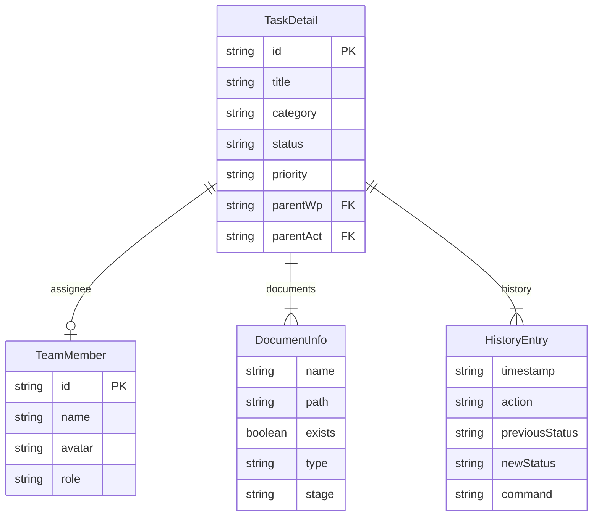
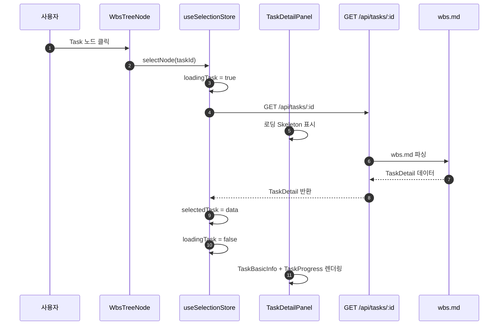
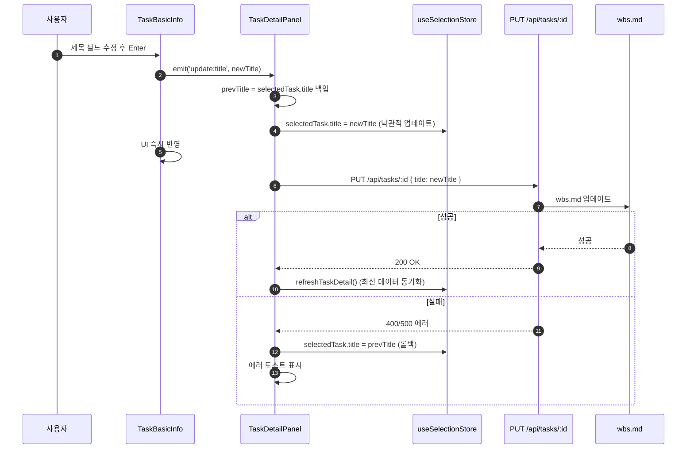
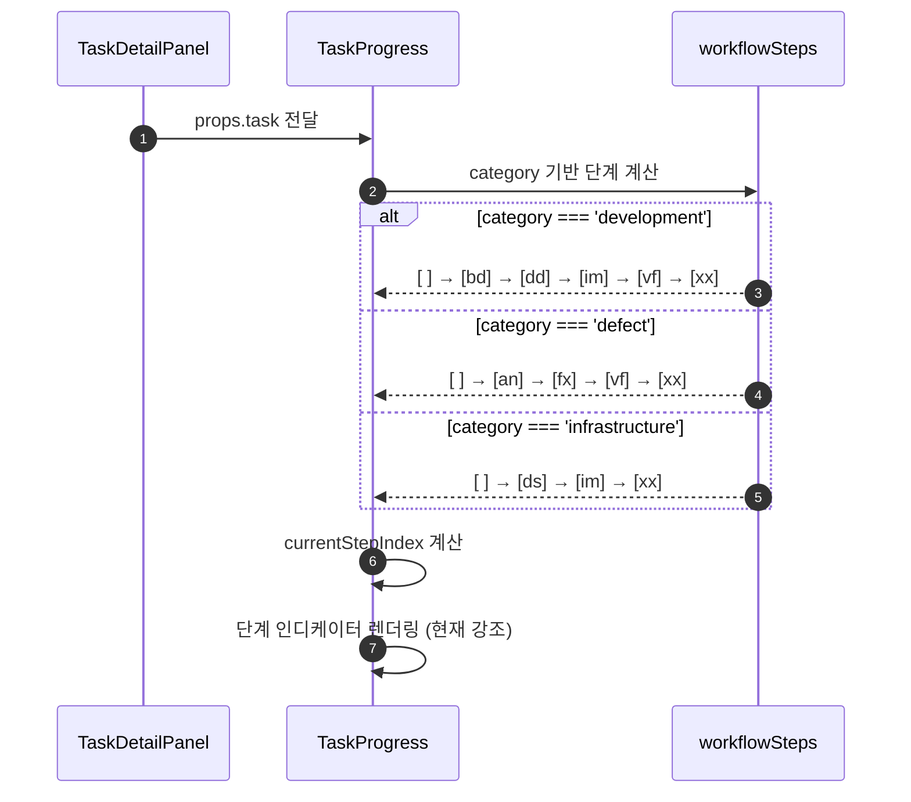
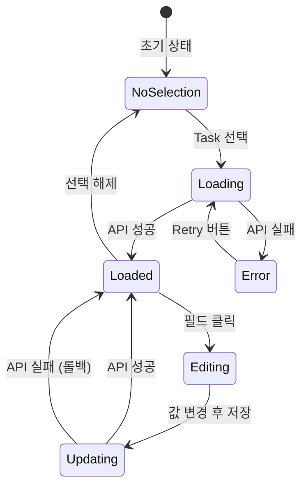

# 상세설계 (020-detail-design.md)

**Template Version:** 3.0.0 — **Last Updated:** 2025-12-15

> **설계 규칙**
> * *기능 중심 설계*에 집중한다.
> * 실제 소스코드(전체 또는 일부)는 **절대 포함하지 않는다**.
> * 작성 후 **상위 문서(PRD, TRD, 기본설계)와 비교**하여 차이가 있으면 **즉시 중단 → 차이 설명 → 지시 대기**.
> * **다이어그램 규칙**
>   * 프로세스: **Mermaid**만 사용
>   * UI 레이아웃: **Text Art(ASCII)** → 바로 아래 **SVG 개념도**를 순차 배치
>
> **분할 문서**
> * 요구사항 추적성: `025-traceability-matrix.md`
> * 테스트 명세: `026-test-specification.md`

---

## 0. 문서 메타데이터

| 항목 | 내용 |
|------|------|
| Task ID | TSK-05-01 |
| Task명 | Detail Panel Structure |
| Category | development |
| 상태 | [dd] 상세설계 |
| 작성일 | 2025-12-15 |
| 작성자 | AI Agent |

### 상위 문서 참조

| 문서 유형 | 경로 | 참조 섹션 |
|----------|------|----------|
| PRD | `.orchay/projects/orchay/prd.md` | 섹션 6.3, 6.3.1, 6.3.2, 10.1 |
| TRD | `.orchay/projects/orchay/trd.md` | 전체 |
| 기본설계 | `010-basic-design.md` | 전체 |
| 상위 Activity | ACT-05: Task Detail & Document | - |
| 상위 Work Package | WP-05: Task Detail & Document (Frontend) | - |

### 분할 문서 참조

| 문서 유형 | 파일명 | 목적 |
|----------|--------|------|
| 추적성 매트릭스 | `025-traceability-matrix.md` | 요구사항 ↔ 설계 ↔ 테스트 추적 |
| 테스트 명세 | `026-test-specification.md` | 테스트 시나리오, 데이터, data-testid |

---

## 1. 일관성 검증 결과

### 1.1 검증 요약

| 구분 | 통과 | 경고 | 실패 |
|------|------|------|------|
| PRD ↔ 기본설계 | 10개 | 0개 | 0개 |
| 기본설계 ↔ 상세설계 | 14개 | 0개 | 0개 |
| TRD ↔ 상세설계 | 5개 | 0개 | 0개 |

### 1.2 검증 상세

| 검증 ID | 검증 항목 | 결과 | 비고 |
|---------|----------|------|------|
| CHK-PRD-01 | 기능 요구사항 완전성 | ✅ PASS | FR-001~FR-010 모두 매핑 |
| CHK-PRD-02 | 비즈니스 규칙 일치성 | ✅ PASS | - |
| CHK-PRD-03 | 용어 일관성 | ✅ PASS | TaskDetail, TeamMember, DocumentInfo 타입 정의 존재 |
| CHK-PRD-04 | UI 컴포넌트 요구사항 | ✅ PASS | PrimeVue 4.x 사용 |
| CHK-PRD-05 | 색상 팔레트 준수 | ✅ PASS | Dark Blue 테마, 카테고리/우선순위별 색상 |
| CHK-BD-01 | 기능 요구사항 완전성 | ✅ PASS | 모든 FR 구현 명세 포함 |
| CHK-BD-02 | 비즈니스 규칙 구현 명세 | ✅ PASS | 낙관적 업데이트, 롤백 로직 |
| CHK-BD-03 | 데이터 모델 일치성 | ✅ PASS | TaskDetail, TeamMember 타입 활용 |
| CHK-BD-04 | 컴포넌트 계층 일치성 | ✅ PASS | TaskDetailPanel → TaskBasicInfo + TaskProgress |
| CHK-BD-05 | 상태 관리 패턴 | ✅ PASS | useSelectionStore 사용 |
| CHK-TRD-01 | 기술 스택 준수 | ✅ PASS | Vue 3 Composition API, PrimeVue, TailwindCSS |
| CHK-TRD-02 | 아키텍처 패턴 준수 | ✅ PASS | Pinia 상태 관리, Server Routes API |
| CHK-TRD-03 | 접근성 표준 | ✅ PASS | ARIA 속성 정의 |
| CHK-TRD-04 | TypeScript 사용 | ✅ PASS | 모든 Props/Emits 타입 정의 |
| CHK-TRD-05 | 컴포넌트 패턴 | ✅ PASS | script setup, composables 활용 |

---

## 2. 목적 및 범위

### 2.1 목적

WBS 트리에서 선택된 Task의 기본 정보, 진행 상태, 워크플로우를 시각화하는 Detail Panel 구조를 제공하여 사용자가 Task 정보를 한눈에 파악하고 인라인 편집을 통해 즉시 수정할 수 있도록 한다.

**핵심 가치**:
- Task 정보의 직관적인 시각화
- 인라인 편집을 통한 빠른 정보 수정 (낙관적 업데이트)
- 워크플로우 진행 상태의 명확한 표현
- 사용자 경험 최적화 (200ms 이내 응답)

### 2.2 범위

**포함 범위** (기본설계 구현 범위의 기술적 구현 사항):
- TaskDetailPanel 컴포넌트 구현 (Pinia 연동, 로딩/에러/빈 상태 처리)
- TaskBasicInfo 컴포넌트 구현 (인라인 편집 UI, 카테고리/우선순위 색상)
- TaskProgress 컴포넌트 구현 (워크플로우 단계 시각화)
- 인라인 편집 낙관적 업데이트 및 롤백 메커니즘
- PrimeVue 컴포넌트 상세 설정 (Card, Panel, Tag, Dropdown, InputText, Badge)
- TailwindCSS 스타일링 및 반응형 레이아웃
- ARIA 접근성 속성 적용

**제외 범위** (다른 Task에서 구현):
- TaskWorkflow (워크플로우 상세 흐름도) → TSK-05-02
- TaskRequirements (요구사항 목록) → TSK-05-02
- TaskDocuments (문서 목록 및 뷰어) → TSK-05-02, TSK-05-04
- TaskHistory (상태 변경 이력) → TSK-05-02
- TaskActions (편집/전이 액션 버튼) → TSK-05-03
- 상태 전이 및 문서 생성 로직 → TSK-03-04

---

## 3. 기술 스택

> TRD 기준, 이 Task에서 사용하는 기술만 명시

| 구분 | 기술 | 버전 | 용도 |
|------|------|------|------|
| Frontend | Vue 3 + Nuxt 3 | 3.5.x / 3.18.x | UI 렌더링, Composition API |
| UI Framework | PrimeVue | 4.x | Card, Panel, Tag, Dropdown, InputText, Badge, Message |
| Styling | TailwindCSS | 3.4.x | 유틸리티 CSS, 반응형, 색상 팔레트 |
| State Management | Pinia | 2.x | useSelectionStore (selectedTask 관리) |
| Backend | Nuxt Server Routes | - | PUT /api/tasks/:id API |
| Type System | TypeScript | 5.x | TaskDetail, TeamMember, Props/Emits 타입 |
| Testing | Playwright | 1.49.x | E2E 테스트 (인라인 편집, 상태 표시) |

---

## 4. 용어/가정/제약

### 4.1 용어 정의

| 용어 | 정의 |
|------|------|
| Task Detail Panel | WBS 트리 우측에 표시되는 Task 상세 정보 패널 |
| 인라인 편집 | 별도 모달 없이 필드를 클릭하여 즉시 편집하는 방식 |
| 낙관적 업데이트 | API 응답 전에 UI를 먼저 업데이트하고, 실패 시 롤백하는 패턴 |
| 워크플로우 단계 인디케이터 | 현재 Task가 속한 워크플로우의 모든 단계를 시각화하고 현재 위치를 강조 |
| 빈 상태 (Empty State) | Task가 선택되지 않은 상태에서 표시하는 안내 메시지 |
| 롤백 (Rollback) | API 호출 실패 시 UI를 이전 상태로 복원하는 작업 |

### 4.2 가정 (Assumptions)

- useSelectionStore의 selectedTask는 TSK-04-03에서 이미 구현되어 있음
- GET /api/tasks/:id 엔드포인트는 TSK-03-02에서 구현되어 있음
- PUT /api/tasks/:id 엔드포인트는 TSK-03-02에서 구현되어 있음
- team.json 파일은 TSK-02-03-03에서 이미 생성되어 있으며 팀원 목록 포함
- TaskDetail, TeamMember 타입은 types/index.ts에 정의되어 있음
- 워크플로우 규칙 정보는 settings/workflows.json에서 로드 가능 (선택적)

### 4.3 제약 (Constraints)

- PrimeVue 4.x에는 InlineEdit 컴포넌트가 없으므로 InputText + Dropdown 조합으로 커스텀 구현 필요
- 인라인 편집은 제목, 우선순위, 담당자만 지원 (카테고리, ID는 읽기 전용)
- 응답 시간 제약: Task 정보 표시 < 200ms (NFR-001)
- 접근성 제약: 키보드 네비게이션 지원, ARIA 레이블 적용 필수 (NFR-003)
- 카테고리는 3개 고정 (development, defect, infrastructure)
- 우선순위는 4개 고정 (critical, high, medium, low)

---

## 5. 시스템/모듈 구조

### 5.1 모듈 역할 및 책임

| 모듈 | 역할 | 책임 |
|------|------|------|
| TaskDetailPanel | 컨테이너 컴포넌트 | - Pinia useSelectionStore 구독<br>- selectedTask 변경 감지<br>- 로딩/에러/빈 상태 분기 처리<br>- 인라인 편집 이벤트 핸들링 및 API 호출<br>- 낙관적 업데이트 및 롤백 로직 |
| TaskBasicInfo | 기본 정보 표시 | - ID, 제목, 카테고리, 우선순위, 담당자 렌더링<br>- 제목 인라인 편집 UI (InputText)<br>- 우선순위/담당자 Dropdown 렌더링<br>- 카테고리/우선순위별 색상 적용<br>- 편집 이벤트 Emit |
| TaskProgress | 진행 상태 표시 | - 현재 상태 Badge 렌더링<br>- 카테고리별 워크플로우 단계 계산<br>- 워크플로우 단계 인디케이터 렌더링<br>- 현재 단계 강조 표시 |
| useSelectionStore | 전역 상태 관리 | - selectedTask 상태 관리<br>- loadingTask 상태 관리<br>- loadTaskDetail() 액션<br>- refreshTaskDetail() 액션 |
| /api/tasks/:id | API 엔드포인트 | - GET: Task 상세 조회<br>- PUT: Task 정보 수정 (title, priority, assignee) |

### 5.2 모듈 구조도 (개념)

```
components/wbs/detail/
├── TaskDetailPanel.vue         (컨테이너, Pinia 연동, API 호출)
├── TaskBasicInfo.vue           (기본 정보, 인라인 편집)
└── TaskProgress.vue            (진행 상태, 워크플로우 단계)

stores/
└── selection.ts                (useSelectionStore: selectedTask, loadTaskDetail, refreshTaskDetail)

server/api/tasks/
└── [id].put.ts                 (PUT /api/tasks/:id - 제목, 우선순위, 담당자 수정)

types/
└── index.ts                    (TaskDetail, TeamMember, DocumentInfo 타입)
```

### 5.3 외부 의존성

| 의존성 | 유형 | 용도 |
|--------|------|------|
| PrimeVue Card | UI 라이브러리 | TaskDetailPanel 컨테이너 |
| PrimeVue Panel | UI 라이브러리 | TaskBasicInfo, TaskProgress 섹션 구분 |
| PrimeVue Tag | UI 라이브러리 | 카테고리 태그 표시 |
| PrimeVue Badge | UI 라이브러리 | 상태 배지, ID 표시 |
| PrimeVue Dropdown | UI 라이브러리 | 우선순위, 담당자 선택 |
| PrimeVue InputText | UI 라이브러리 | 제목 인라인 편집 |
| PrimeVue Message | UI 라이브러리 | 에러/빈 상태 메시지 |
| PrimeVue Skeleton | UI 라이브러리 | 로딩 상태 표시 |
| useSelectionStore | Pinia 스토어 | selectedTask 구독 |
| GET /api/tasks/:id | Server API | Task 상세 정보 로드 |
| PUT /api/tasks/:id | Server API | Task 정보 수정 |
| GET /api/projects/:id | Server API | 팀원 목록 로드 (project.team) |

---

## 6. 데이터 모델 (개념 수준)

### 6.1 엔티티 정의

#### Entity: TaskDetail (types/index.ts에서 정의됨)

| 필드명 | 타입 | 필수 | 설명 | 제약조건 |
|--------|------|------|------|----------|
| id | string | Y | Task ID | TSK-XX-XX-XX 형식 |
| title | string | Y | Task 제목 | 1-200자, 인라인 편집 가능 |
| category | TaskCategory | Y | 카테고리 | development/defect/infrastructure, 읽기 전용 |
| status | TaskStatus | Y | 현재 상태 | [ ], [bd], [dd], [an], [ds], [im], [fx], [vf], [xx] |
| priority | Priority | Y | 우선순위 | critical/high/medium/low, 인라인 편집 가능 |
| assignee | TeamMember | N | 담당자 | 팀원 객체, 인라인 편집 가능 |
| parentWp | string | Y | 상위 WP ID | WP-XX 형식 |
| parentAct | string | N | 상위 ACT ID | ACT-XX-XX 형식 (3단계 구조 시 null) |
| schedule | ScheduleRange | N | 일정 범위 | start/end (YYYY-MM-DD) |
| requirements | string[] | Y | 요구사항 목록 | - |
| tags | string[] | Y | 태그 목록 | - |
| depends | string[] | N | 의존 Task ID | - |
| ref | string | N | PRD 참조 | - |
| documents | DocumentInfo[] | Y | 문서 목록 | 존재/예정 구분 |
| history | HistoryEntry[] | Y | 상태 변경 이력 | - |
| availableActions | string[] | Y | 가능한 워크플로우 명령 | - |

#### Entity: TeamMember (types/index.ts에서 정의됨)

| 필드명 | 타입 | 필수 | 설명 | 제약조건 |
|--------|------|------|------|----------|
| id | string | Y | 팀원 ID | 고유 식별자 |
| name | string | Y | 팀원 이름 | 1-100자 |
| avatar | string | N | 아바타 URL | 이미지 경로 또는 URL |
| role | string | N | 역할 | 팀 내 역할 (예: Developer, Designer) |

### 6.2 관계 다이어그램



### 6.3 인덱스 및 제약조건

| 엔티티 | 인덱스/제약 | 필드 | 목적 |
|--------|------------|------|------|
| TaskDetail | Primary Key | id | 고유 식별 |
| TaskDetail | Foreign Key | assignee.id | 팀원 참조 |
| TeamMember | Primary Key | id | 고유 식별 |
| TeamMember | Unique | name | 팀원 이름 중복 방지 (프로젝트 내) |

---

## 7. 인터페이스 계약 (API Contract)

### 7.1 엔드포인트 목록

| Method | Endpoint | 설명 | 요구사항 |
|--------|----------|------|----------|
| GET | /api/tasks/:id | Task 상세 조회 | FR-002 |
| PUT | /api/tasks/:id | Task 정보 수정 (title, priority, assignee) | FR-003, FR-008 |
| GET | /api/projects/:id | 프로젝트 정보 및 팀원 목록 조회 | FR-005 |

### 7.2 API 상세: GET /api/tasks/:id

**요구사항**: FR-002 (Task 기본 정보 표시)

#### 요청 (Request)

| 구분 | 파라미터 | 타입 | 필수 | 설명 | 기본값 |
|------|----------|------|------|------|--------|
| Path | id | string | Y | Task ID (TSK-XX-XX-XX) | - |

#### 응답 (Response)

**성공 응답 (200)**:

| 필드 | 타입 | 설명 |
|------|------|------|
| id | string | Task ID |
| title | string | Task 제목 |
| category | string | 카테고리 |
| status | string | 현재 상태 |
| priority | string | 우선순위 |
| assignee | TeamMember \| null | 담당자 객체 |
| parentWp | string | 상위 WP ID |
| parentAct | string \| null | 상위 ACT ID |
| schedule | ScheduleRange \| null | 일정 범위 |
| requirements | string[] | 요구사항 목록 |
| tags | string[] | 태그 목록 |
| depends | string[] | 의존 Task ID |
| ref | string \| null | PRD 참조 |
| documents | DocumentInfo[] | 문서 목록 |
| history | HistoryEntry[] | 상태 변경 이력 |
| availableActions | string[] | 가능한 명령 |

**에러 응답**:

| 코드 | 에러 코드 | 설명 | 비즈니스 규칙 |
|------|----------|------|--------------|
| 404 | TASK_NOT_FOUND | Task ID에 해당하는 항목 없음 | - |
| 500 | FILE_READ_ERROR | wbs.md 파일 읽기 실패 | - |

### 7.3 API 상세: PUT /api/tasks/:id

**요구사항**: FR-003 (제목 인라인 편집), FR-008 (API 연동 및 낙관적 업데이트)

#### 요청 (Request)

| 구분 | 파라미터 | 타입 | 필수 | 설명 | 기본값 |
|------|----------|------|------|------|--------|
| Path | id | string | Y | Task ID | - |
| Body | title | string | N | 새 제목 | - |
| Body | priority | string | N | 새 우선순위 | - |
| Body | assignee | string \| null | N | 새 담당자 ID | - |

#### 응답 (Response)

**성공 응답 (200)**:

| 필드 | 타입 | 설명 |
|------|------|------|
| success | boolean | 성공 여부 (true) |
| data | TaskDetail | 수정된 Task 전체 정보 |

**에러 응답**:

| 코드 | 에러 코드 | 설명 | 비즈니스 규칙 |
|------|----------|------|--------------|
| 400 | VALIDATION_ERROR | 제목 길이 초과, 우선순위 값 오류 | - |
| 404 | TASK_NOT_FOUND | Task ID 없음 | - |
| 404 | ASSIGNEE_NOT_FOUND | 담당자 ID가 팀원 목록에 없음 | - |
| 500 | FILE_WRITE_ERROR | wbs.md 파일 쓰기 실패 | - |

#### 유효성 검증

| 필드 | 규칙 | 에러 메시지 | 비즈니스 규칙 |
|------|------|------------|--------------|
| title | 1-200자 | 제목은 1-200자여야 합니다 | - |
| priority | critical/high/medium/low | 올바른 우선순위를 선택하세요 | - |
| assignee | 팀원 목록에 존재 | 해당 팀원을 찾을 수 없습니다 | - |

### 7.4 API 상세: GET /api/projects/:id

**요구사항**: FR-005 (담당자 Dropdown 팀원 목록)

#### 요청 (Request)

| 구분 | 파라미터 | 타입 | 필수 | 설명 | 기본값 |
|------|----------|------|------|------|--------|
| Path | id | string | Y | 프로젝트 ID | - |

#### 응답 (Response)

**성공 응답 (200)**:

| 필드 | 타입 | 설명 |
|------|------|------|
| id | string | 프로젝트 ID |
| name | string | 프로젝트명 |
| team | TeamMember[] | 팀원 목록 |
| ... | ... | 기타 프로젝트 정보 |

---

## 8. 프로세스 흐름

### 8.1 프로세스 설명

#### 8.1.1 Task 선택 및 로드 프로세스

1. **WBS 트리 노드 선택** [FR-001]: 사용자가 WBS 트리에서 Task 노드 클릭
2. **Selection Store 업데이트**: useSelectionStore.selectNode(taskId) 호출
3. **API 호출 시작**: loadTaskDetail(taskId) → GET /api/tasks/:id
4. **로딩 상태 표시** [FR-010]: TaskDetailPanel에서 Skeleton 또는 Spinner 표시
5. **응답 수신 및 렌더링**: selectedTask 업데이트 → TaskBasicInfo + TaskProgress 자동 렌더링
6. **에러 처리**: API 실패 시 Message 컴포넌트로 에러 표시 + Retry 버튼

#### 8.1.2 인라인 편집 프로세스 (낙관적 업데이트)

1. **편집 시작** [FR-003]: 사용자가 제목/우선순위/담당자 필드 클릭 또는 변경
2. **이벤트 발생**: TaskBasicInfo에서 @update:title / @update:priority / @update:assignee 이벤트 Emit
3. **낙관적 업데이트** [FR-008]: TaskDetailPanel에서 즉시 selectedTask 값 수정 (UI 즉시 반영)
4. **API 호출**: PUT /api/tasks/:id 비동기 호출
5. **성공 처리**: refreshTaskDetail() 호출로 최신 데이터 동기화
6. **실패 처리**: 이전 값으로 롤백 + 에러 토스트 표시

#### 8.1.3 빈 상태 처리 프로세스

1. **선택 없음 상태** [FR-001]: selectedTask === null
2. **빈 상태 표시**: TaskDetailPanel에서 PrimeVue Message (info) 렌더링
3. **안내 메시지**: "왼쪽에서 Task를 선택하세요"

### 8.2 시퀀스 다이어그램

#### 8.2.1 Task 선택 및 로드



#### 8.2.2 인라인 편집 (낙관적 업데이트)



#### 8.2.3 워크플로우 단계 계산



### 8.3 상태 다이어그램



---

## 9. UI 설계

### 9.1 화면 목록

| 화면 | 경로 | 목적 | 주요 기능 |
|------|------|------|----------|
| Task Detail Panel | /wbs (우측 패널) | Task 상세 정보 표시 | 기본 정보, 진행 상태, 인라인 편집 |

### 9.2 Task Detail Panel 레이아웃

```
┌─────────────────────────────────────────────────────────────────┐
│ TaskDetailPanel (PrimeVue Card)                                 │
├─────────────────────────────────────────────────────────────────┤
│                                                                  │
│  [로딩 상태]                                                      │
│  ┌──────────────────────────────────────────────────────────┐  │
│  │ Skeleton (제목)                                           │  │
│  │ Skeleton (필드들)                                         │  │
│  │ Skeleton (진행바)                                         │  │
│  └──────────────────────────────────────────────────────────┘  │
│                                                                  │
│  [에러 상태]                                                      │
│  ┌──────────────────────────────────────────────────────────┐  │
│  │ ⚠️ Message (error)                                        │  │
│  │ "Task 정보를 불러오는 데 실패했습니다"                       │  │
│  │ [Retry 버튼]                                              │  │
│  └──────────────────────────────────────────────────────────┘  │
│                                                                  │
│  [빈 상태]                                                        │
│  ┌──────────────────────────────────────────────────────────┐  │
│  │ ℹ️ Message (info)                                         │  │
│  │ "왼쪽에서 Task를 선택하세요"                               │  │
│  └──────────────────────────────────────────────────────────┘  │
│                                                                  │
│  [정상 상태 - 스크롤 가능]                                        │
│  ┌──────────────────────────────────────────────────────────┐  │
│  │ TaskBasicInfo (PrimeVue Panel: "기본 정보")               │  │
│  │ ┌────────────────────────────────────────────────────┐   │  │
│  │ │ Badge: TSK-05-01                                    │   │  │
│  │ │ 제목 (클릭 시 InputText): Detail Panel Structure    │   │  │
│  │ │ Tag: development (블루 색상)                         │   │  │
│  │ │ 우선순위 Dropdown: high (앰버 색상)                   │   │  │
│  │ │ 담당자 Dropdown: [Avatar] 팀원 이름                  │   │  │
│  │ └────────────────────────────────────────────────────┘   │  │
│  └──────────────────────────────────────────────────────────┘  │
│                                                                  │
│  ┌──────────────────────────────────────────────────────────┐  │
│  │ TaskProgress (PrimeVue Panel: "진행 상태")                │  │
│  │ ┌────────────────────────────────────────────────────┐   │  │
│  │ │ Badge: [bd] 기본설계                                 │   │  │
│  │ │                                                     │   │  │
│  │ │ 워크플로우 단계:                                      │   │  │
│  │ │ ○ → ● → ○ → ○ → ○ → ○                              │   │  │
│  │ │ [ ]  [bd] [dd] [im] [vf] [xx]                      │   │  │
│  │ │                                                     │   │  │
│  │ │ (현재: [bd] 강조 표시)                               │   │  │
│  │ └────────────────────────────────────────────────────┘   │  │
│  └──────────────────────────────────────────────────────────┘  │
│                                                                  │
└─────────────────────────────────────────────────────────────────┘
```

### 9.3 컴포넌트 구조 (개념)

| 컴포넌트 | 역할 | Props (개념) | Events (개념) |
|----------|------|--------------|---------------|
| TaskDetailPanel | 컨테이너, Pinia 연동, API 호출 | 없음 (Pinia 직접 사용) | 없음 |
| TaskBasicInfo | 기본 정보 표시 및 인라인 편집 | task: TaskDetail | update:title, update:priority, update:assignee |
| TaskProgress | 진행 상태 및 워크플로우 | task: TaskDetail | 없음 (읽기 전용) |

#### TaskDetailPanel Props/Emits

**Props**: 없음 (useSelectionStore 직접 구독)

**Emits**: 없음

**Computed**:
- selectedTask: useSelectionStore의 selectedTask (ref)
- loadingTask: useSelectionStore의 loadingTask (ref)
- error: useSelectionStore의 error (ref)

**State (Local)**:
- updating: ref\<boolean\> (API 호출 중 플래그)
- updateError: ref\<string | null\> (편집 에러 메시지)

**Methods**:
- handleUpdateTitle(newTitle: string): 제목 수정 핸들러
- handleUpdatePriority(newPriority: Priority): 우선순위 수정 핸들러
- handleUpdateAssignee(assigneeId: string | null): 담당자 수정 핸들러
- handleRetry(): 에러 상태에서 재시도

#### TaskBasicInfo Props/Emits

**Props**:
- task: TaskDetail (required)

**Emits**:
- update:title: [title: string]
- update:priority: [priority: Priority]
- update:assignee: [assigneeId: string | null]

**State (Local)**:
- isEditingTitle: ref\<boolean\> (제목 편집 모드)
- editedTitle: ref\<string\> (편집 중인 제목 임시 저장)
- teamMembers: ref\<TeamMember[]\> (담당자 Dropdown 옵션)

**Methods**:
- startEditTitle(): 제목 편집 모드 시작
- saveTitle(): 제목 편집 완료 (Enter/Blur)
- cancelEditTitle(): 제목 편집 취소 (Escape)
- loadTeamMembers(): 팀원 목록 로드

#### TaskProgress Props/Emits

**Props**:
- task: TaskDetail (required)

**Emits**: 없음

**Computed**:
- workflowSteps: 카테고리별 워크플로우 단계 배열
- currentStepIndex: 현재 상태의 단계 인덱스
- progressPercentage: 진행률 퍼센트 (현재 단계 / 전체 단계 * 100)

### 9.4 상태 관리 (개념)

| Store | 상태 | Actions |
|-------|------|---------|
| useSelectionStore | selectedTask: TaskDetail \| null<br>loadingTask: boolean<br>error: string \| null | selectNode(taskId: string)<br>loadTaskDetail(taskId: string)<br>refreshTaskDetail()<br>clearSelection() |

**useSelectionStore 주요 흐름**:
1. selectNode(taskId) 호출
2. loadingTask = true 설정
3. GET /api/tasks/:id 호출
4. 성공 시: selectedTask = data, loadingTask = false
5. 실패 시: error = message, loadingTask = false

### 9.5 반응형/접근성 가이드

#### 반응형

* **Desktop (≥ 1200px)**:
  - WBS Tree 60% + Detail Panel 40%
  - Detail Panel 최소 너비 480px
  - 스크롤 영역: max-height 계산 (viewport - header)

* **Tablet (768px ~ 1199px)**:
  - WBS Tree 50% + Detail Panel 50%
  - 폰트 크기 약간 축소

* **Mobile (< 768px)**:
  - WBS Tree와 Detail Panel 분리 (탭 또는 오버레이 방식)
  - 이 Task 범위 외 (추후 구현)

#### 접근성

* **키보드 네비게이션**:
  - Tab 키로 편집 가능 필드 순회
  - Enter: 제목 편집 완료, Dropdown 열기
  - Escape: 제목 편집 취소, Dropdown 닫기
  - Space: Dropdown 옵션 선택

* **ARIA 속성**:
  - TaskDetailPanel: `role="region"`, `aria-label="Task 상세 정보"`
  - 제목 편집 InputText: `aria-label="Task 제목 편집"`
  - 우선순위 Dropdown: `aria-label="우선순위 선택"`
  - 담당자 Dropdown: `aria-label="담당자 선택"`
  - 로딩 상태: `aria-busy="true"`, `aria-live="polite"`
  - 에러 메시지: `role="alert"`, `aria-live="assertive"`

* **포커스 관리**:
  - Task 선택 시 TaskDetailPanel에 포커스 이동
  - 제목 편집 시작 시 InputText에 포커스
  - 편집 완료 후 다음 편집 가능 필드로 포커스 이동 (선택적)

---

## 10. 비즈니스 규칙 구현 명세

| 규칙 ID | 규칙 설명 | 구현 위치(개념) | 구현 방식(개념) | 검증 방법 |
|---------|----------|-----------------|-----------------|-----------|
| BR-001 | 제목은 1-200자 범위 | TaskDetailPanel.handleUpdateTitle | API 호출 전 클라이언트 검증 + API 서버 재검증 | E2E 테스트 (201자 입력 시 에러) |
| BR-002 | 우선순위는 4개 값만 허용 | TaskBasicInfo Dropdown | Dropdown 옵션 제한 (critical/high/medium/low) | 단위 테스트 (유효성 검증) |
| BR-003 | 담당자는 팀원 목록에 존재해야 함 | TaskDetailPanel.handleUpdateAssignee | API 서버에서 team.json 조회 후 검증 | E2E 테스트 (잘못된 ID 입력 시 에러) |
| BR-004 | 낙관적 업데이트 실패 시 롤백 | TaskDetailPanel 편집 핸들러 | try-catch로 API 에러 처리 + 이전 값 복원 | E2E 테스트 (API 실패 시뮬레이션) |
| BR-005 | 카테고리는 읽기 전용 | TaskBasicInfo | Tag 컴포넌트로 표시 (편집 UI 제공 안 함) | E2E 테스트 (카테고리 편집 불가 확인) |

---

## 10. 오류/예외 처리

### 10.1 예상 오류 상황

| 오류 상황 | 오류 코드 | 사용자 메시지 | 복구 전략 |
|----------|----------|--------------|----------|
| Task ID 없음 | TASK_NOT_FOUND | 요청한 Task를 찾을 수 없습니다 | WBS 트리로 포커스 이동, 선택 해제 |
| 제목 길이 초과 | VALIDATION_ERROR | 제목은 1-200자여야 합니다 | 이전 값 롤백, 에러 토스트 표시 |
| 잘못된 우선순위 | VALIDATION_ERROR | 올바른 우선순위를 선택하세요 | 이전 값 롤백, Dropdown 다시 열기 |
| 담당자 ID 없음 | ASSIGNEE_NOT_FOUND | 해당 팀원을 찾을 수 없습니다 | 이전 값 롤백, 팀원 목록 새로고침 |
| wbs.md 읽기 실패 | FILE_READ_ERROR | 데이터를 불러오는 데 실패했습니다 | Retry 버튼 제공 |
| wbs.md 쓰기 실패 | FILE_WRITE_ERROR | 변경 사항을 저장하는 데 실패했습니다 | 이전 값 롤백, Retry 버튼 제공 |
| 네트워크 오류 | NETWORK_ERROR | 네트워크 연결을 확인하세요 | Retry 버튼 제공 |
| API 타임아웃 | TIMEOUT | 요청 시간이 초과되었습니다 | Retry 버튼 제공 |

### 10.2 경계 조건

| 조건 | 처리 방안 |
|------|----------|
| selectedTask === null | 빈 상태 Message 표시 ("왼쪽에서 Task를 선택하세요") |
| 팀원 목록 빈 배열 | 담당자 Dropdown에 "팀원 없음" 표시, 선택 불가 |
| 제목이 빈 문자열 | API 호출 전 차단, "제목을 입력하세요" 토스트 |
| 워크플로우 단계 정보 없음 | 기본 단계 표시 ([ ] → [xx]) |
| 아바타 이미지 로드 실패 | 기본 아바타 아이콘 표시 (PrimeVue Avatar fallback) |

---

## 11. 구현 체크리스트

### Backend
- [ ] PUT /api/tasks/:id 엔드포인트 구현 (title, priority, assignee 수정)
- [ ] TaskDetail 유효성 검증 로직 (제목 길이, 우선순위, 담당자 ID)
- [ ] 팀원 목록 조회 로직 (team.json)
- [ ] wbs.md 파싱 및 업데이트 로직 (시리얼라이저 활용)
- [ ] 에러 핸들링 (404, 400, 500)
- [ ] 단위 테스트 (API 엔드포인트, 유효성 검증)

### Frontend
- [ ] TaskDetailPanel.vue 컴포넌트 구현
  - [ ] useSelectionStore 구독 (selectedTask, loadingTask, error)
  - [ ] 로딩/에러/빈 상태 분기 렌더링
  - [ ] handleUpdateTitle/Priority/Assignee 핸들러
  - [ ] 낙관적 업데이트 및 롤백 로직
  - [ ] 에러 토스트 표시
- [ ] TaskBasicInfo.vue 컴포넌트 구현
  - [ ] ID Badge 렌더링
  - [ ] 제목 인라인 편집 (InputText, Enter/Blur/Escape)
  - [ ] 카테고리 Tag (색상 매핑)
  - [ ] 우선순위 Dropdown (색상 매핑)
  - [ ] 담당자 Dropdown (Avatar + 이름)
  - [ ] 이벤트 Emit (update:title, update:priority, update:assignee)
- [ ] TaskProgress.vue 컴포넌트 구현
  - [ ] 현재 상태 Badge 렌더링
  - [ ] workflowSteps computed (카테고리별 단계 계산)
  - [ ] 워크플로우 단계 인디케이터 렌더링
  - [ ] 현재 단계 강조 스타일링
- [ ] PrimeVue 컴포넌트 설정
  - [ ] Card (패딩, 그림자)
  - [ ] Panel (헤더, 콘텐츠)
  - [ ] Tag (색상 커스터마이징)
  - [ ] Badge (라운드, 색상)
  - [ ] Dropdown (옵션 템플릿, Avatar)
  - [ ] InputText (포커스 스타일)
  - [ ] Message (info, error)
  - [ ] Skeleton (로딩 상태)
- [ ] TailwindCSS 스타일링
  - [ ] 스크롤 영역 (overflow-y-auto, max-height)
  - [ ] 색상 팔레트 (카테고리, 우선순위)
  - [ ] 간격 (spacing, padding, gap)
  - [ ] 반응형 (md, lg breakpoints)
- [ ] ARIA 접근성 속성
  - [ ] role, aria-label, aria-busy, aria-live
  - [ ] 키보드 네비게이션 (Tab, Enter, Escape)
- [ ] E2E 테스트
  - [ ] Task 선택 시 상세 패널 표시
  - [ ] 제목 인라인 편집 성공
  - [ ] 우선순위 Dropdown 변경 성공
  - [ ] 담당자 Dropdown 변경 성공
  - [ ] API 실패 시 롤백 확인
  - [ ] 빈 상태 메시지 표시

### 품질
- [ ] 요구사항 추적성 검증 완료 (`025-traceability-matrix.md`)
- [ ] 테스트 명세 작성 완료 (`026-test-specification.md`)
- [ ] 비즈니스 규칙 구현 완료 (BR-001 ~ BR-005)
- [ ] 일관성 검증 통과 (PRD, 기본설계, TRD)
- [ ] 응답 시간 < 200ms 달성 (NFR-001)
- [ ] 접근성 표준 준수 (NFR-003)

---

## 12. 다음 단계

- `/wf:review` 명령어로 설계리뷰 진행 (021-design-review.md)
- 리뷰 통과 후 `/wf:build` 명령어로 구현 진행 (030-implementation.md)

---

## 관련 문서

- 기본설계: `010-basic-design.md`
- 추적성 매트릭스: `025-traceability-matrix.md`
- 테스트 명세: `026-test-specification.md`
- PRD: `.orchay/projects/orchay/prd.md` (섹션 6.3, 6.3.1, 6.3.2, 10.1)
- TRD: `.orchay/projects/orchay/trd.md`
- WBS: `.orchay/projects/orchay/wbs.md` (TSK-05-01)

---

<!--
author: AI Agent
Template Version: 3.0.0
-->
