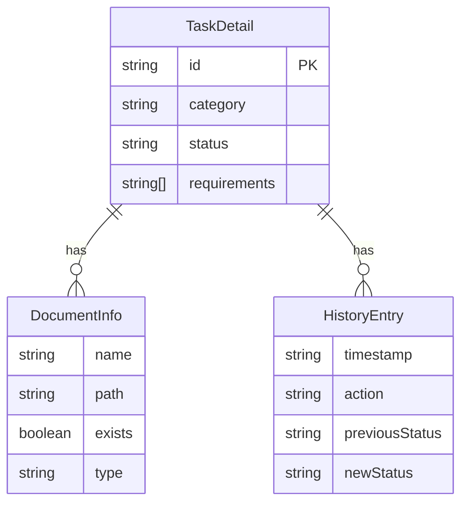
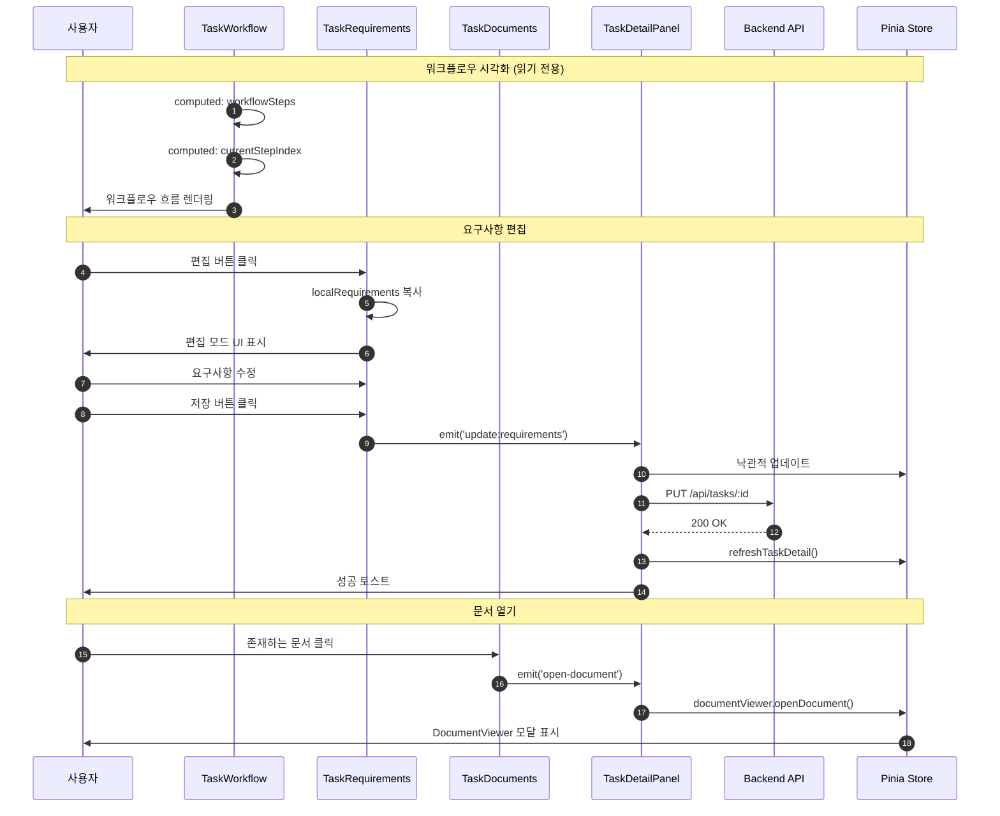

# 상세설계 (020-detail-design.md)

**Template Version:** 3.0.0 — **Last Updated:** 2025-12-15

> **설계 규칙**
> * *기능 중심 설계*에 집중한다.
> * 실제 소스코드(전체 또는 일부)는 **절대 포함하지 않는다**.
> * 작성 후 **상위 문서(PRD, TRD, 기본설계)와 비교**하여 차이가 있으면 **즉시 중단 → 차이 설명 → 지시 대기**.
> * **다이어그램 규칙**
>   * 프로세스: **Mermaid**만 사용
>   * UI 레이아웃: **Text Art(ASCII)** → 바로 아래 **SVG 개념도**를 순차 배치
>
> **분할 문서**
> * 요구사항 추적성: `025-traceability-matrix.md`
> * 테스트 명세: `026-test-specification.md`

---

## 0. 문서 메타데이터

| 항목 | 내용 |
|------|------|
| Task ID | TSK-05-02 |
| Task명 | Detail Sections |
| Category | development |
| 상태 | [dd] 상세설계 |
| 작성일 | 2025-12-15 |
| 작성자 | AI Agent |

### 상위 문서 참조

| 문서 유형 | 경로 | 참조 섹션 |
|----------|------|----------|
| PRD | `.orchay/projects/orchay/prd.md` | 섹션 6.3.2, 6.3.3, 6.3.4, 6.3.6, 9.2, 10.1 |
| 기본설계 | `010-basic-design.md` | 전체 |
| 상위 Work Package | WP-05: Task Detail & Document (Frontend) | - |

### 분할 문서 참조

| 문서 유형 | 파일명 | 목적 |
|----------|--------|------|
| 추적성 매트릭스 | `025-traceability-matrix.md` | 요구사항 ↔ 설계 ↔ 테스트 추적 |
| 테스트 명세 | `026-test-specification.md` | 테스트 시나리오, 데이터, data-testid |

---

## 1. 일관성 검증 결과

### 1.1 검증 요약

| 구분 | 통과 | 경고 | 실패 |
|------|------|------|------|
| PRD ↔ 기본설계 | 14개 | 0개 | 0개 |
| 기본설계 ↔ 상세설계 | 14개 | 0개 | 0개 |

### 1.2 검증 상세

| 검증 ID | 검증 항목 | 결과 | 비고 |
|---------|----------|------|------|
| CHK-PRD-01 | 기능 요구사항 완전성 (FR-001~FR-014) | ✅ PASS | 모든 요구사항 설계에 반영 |
| CHK-PRD-02 | 비기능 요구사항 일치성 (NFR-001~NFR-006) | ✅ PASS | 렌더링 성능, 접근성 준수 |
| CHK-PRD-03 | 워크플로우 정의 일치성 | ✅ PASS | PRD 섹션 5.2, 5.3과 일치 |
| CHK-PRD-04 | 컴포넌트 구조 일치성 | ✅ PASS | PRD 섹션 9.2와 일치 |
| CHK-BD-01 | 컴포넌트 역할 일치성 | ✅ PASS | 4개 컴포넌트 역할 명확 |
| CHK-BD-02 | 데이터 흐름 일치성 | ✅ PASS | Props/Emits 구조 일치 |
| CHK-BD-03 | API 연동 방식 일치성 | ✅ PASS | TaskDetailPanel 통합 처리 |
| CHK-BD-04 | 기술 결정 준수 | ✅ PASS | PrimeVue Timeline, Card 활용 |

---

## 2. 목적 및 범위

### 2.1 목적

Task 상세 패널에서 워크플로우 흐름, 요구사항, 문서 목록, 상태 변경 이력을 시각화하는 4개의 섹션 컴포넌트를 구현하여 사용자가 Task의 전체 컨텍스트를 파악하고 문서 접근 및 이력 추적을 용이하게 한다.

**핵심 가치**:
- 워크플로우 진행 단계의 명확한 시각화
- 요구사항과 문서의 체계적인 관리 및 접근
- 상태 변경 이력의 투명한 추적
- 작업 컨텍스트의 종합적인 이해 지원

### 2.2 범위

**포함 범위**:
- TaskWorkflow.vue: 카테고리별 워크플로우 흐름도 컴포넌트 (읽기 전용)
- TaskRequirements.vue: 요구사항 목록 표시 및 인라인 편집 컴포넌트
- TaskDocuments.vue: 문서 목록 표시 및 뷰어 연동 컴포넌트
- TaskHistory.vue: 상태 변경 이력 타임라인 컴포넌트 (읽기 전용)
- TaskDetailPanel.vue 통합: 4개 컴포넌트 통합 및 이벤트 핸들링

**제외 범위**:
- TaskDetailPanel, TaskBasicInfo, TaskProgress → TSK-05-01 (완료)
- TaskActions (편집/전이 액션 버튼) → TSK-05-03
- DocumentViewer (마크다운 뷰어) → TSK-05-04
- 워크플로우 엔진 로직 → TSK-03-04
- 상태 전이 API → TSK-03-03

---

## 3. 기술 스택

| 구분 | 기술 | 버전 | 용도 |
|------|------|------|------|
| Frontend | Vue 3 + Nuxt 3 | 3.5.x / 3.18.x | UI 렌더링, Composition API |
| UI Framework | PrimeVue | 4.x | Panel, Timeline, Card, InputText |
| Styling | TailwindCSS | 3.4.x | 유틸리티 CSS, 반응형 |
| State | Pinia | 2.x | selection 스토어 연동 |
| Testing | Vitest + Playwright | 2.x / 1.49.x | 단위/E2E 테스트 |
| TypeScript | TypeScript | 5.x | 타입 안정성 |

---

## 4. 용어/가정/제약

### 4.1 용어 정의

| 용어 | 정의 |
|------|------|
| 워크플로우 단계 | 카테고리별로 정의된 상태 전이 경로 (예: development의 6단계) |
| 상태 노드 | 워크플로우 흐름도에서 각 상태를 나타내는 시각적 요소 |
| 인라인 편집 | 별도 모달 없이 현재 화면에서 직접 편집하는 방식 |
| 낙관적 업데이트 | API 응답 전에 UI를 먼저 업데이트하고 실패 시 롤백하는 방식 |
| 문서 존재/예정 | 파일 시스템에 실제 존재 여부에 따른 문서 분류 |
| 타임라인 역순 | 최신 이력이 위에 오도록 타임스탬프 내림차순 정렬 |

### 4.2 가정 (Assumptions)

- TaskDetail 객체는 TSK-05-01에서 Pinia selection 스토어에 로드되어 있음
- GET /api/tasks/:id API는 documents, history 필드를 포함하여 응답 (TSK-03-02)
- workflows.json 설정 파일은 시스템 초기화 시 로드되어 있음 (TSK-02-03-01)
- 요구사항 편집은 사용자가 명시적으로 편집 모드를 활성화한 후에만 가능
- 문서 뷰어는 TSK-05-04에서 구현되며, DocumentViewer 스토어를 통해 연동

### 4.3 제약 (Constraints)

- 워크플로우 시각화는 PrimeVue Steps가 아닌 커스텀 Flexbox 구현 (수평 흐름 제한 극복)
- 요구사항 편집 시 롤백을 위해 로컬 상태 복사본 유지 필요
- 문서 목록은 정적 파일 시스템 기반이므로 실시간 감지 불가 (새로고침 필요)
- 이력 데이터는 append-only 구조로 수정/삭제 불가 (읽기 전용)
- 반응형 제약: 최소 1200px 너비 기준, 모바일 미지원 (PRD 11.3)

---

## 5. 시스템/모듈 구조

### 5.1 모듈 역할 및 책임

| 모듈 | 역할 | 책임 |
|------|------|------|
| TaskWorkflow.vue | 워크플로우 시각화 | - 카테고리별 워크플로우 단계 표시<br>- 현재 상태 강조<br>- 완료/현재/미완료 시각적 구분<br>- 읽기 전용 (상호작용 없음) |
| TaskRequirements.vue | 요구사항 관리 | - 요구사항 목록 렌더링<br>- PRD 참조 링크 표시<br>- 인라인 편집 상태 관리<br>- update:requirements 이벤트 발행 |
| TaskDocuments.vue | 문서 목록 관리 | - 문서 목록 Card 형태 렌더링<br>- 존재/예정 상태 시각적 구분<br>- 문서 클릭 시 open-document 이벤트 발행<br>- 생성 조건 정보 표시 |
| TaskHistory.vue | 이력 타임라인 | - 이력 엔트리 역순 정렬<br>- PrimeVue Timeline 렌더링<br>- 상태 전이/문서 생성 정보 표시<br>- 읽기 전용 |
| TaskDetailPanel.vue | 통합 컨테이너 | - 4개 섹션 컴포넌트 배치<br>- 이벤트 핸들링 (update, open-document)<br>- API 호출 및 에러 처리<br>- 낙관적 업데이트 및 롤백 |

### 5.2 모듈 구조도 (개념)

```
components/detail/
├── TaskDetailPanel.vue          (컨테이너, TSK-05-01에서 생성)
│   ├── TaskBasicInfo.vue        (TSK-05-01)
│   ├── TaskProgress.vue         (TSK-05-01)
│   ├── TaskWorkflow.vue         (이 Task - 읽기 전용)
│   ├── TaskRequirements.vue     (이 Task - 편집 가능)
│   ├── TaskDocuments.vue        (이 Task - 클릭 이벤트)
│   └── TaskHistory.vue          (이 Task - 읽기 전용)
│
└── (내부 서브 컴포넌트 - 필요 시)
    ├── WorkflowNode.vue         (워크플로우 노드 재사용)
    ├── RequirementItem.vue      (요구사항 항목 재사용)
    ├── DocumentCard.vue         (문서 카드 재사용)
    └── HistoryEntry.vue         (이력 엔트리 재사용)

stores/
├── selection.ts                 (selectedTask computed로 제공)
└── documentViewer.ts            (TSK-05-04, openDocument 액션)

server/api/
└── tasks/[id].put.ts            (요구사항 수정 API)
```

### 5.3 외부 의존성

| 의존성 | 유형 | 용도 |
|--------|------|------|
| TSK-05-01 TaskDetailPanel | 컴포넌트 | 4개 섹션 컴포넌트 통합 컨테이너 |
| TSK-03-02 GET /api/tasks/:id | API | Task 상세 정보 조회 (documents, history 포함) |
| TSK-03-02 PUT /api/tasks/:id | API | Task 요구사항 수정 |
| TSK-03-03 GET /api/tasks/:id/documents | API | 문서 목록 조회 (선택적 사용) |
| TSK-05-04 DocumentViewer | 컴포넌트 | 문서 열람 기능 |
| types/index.ts | 타입 | TaskDetail, DocumentInfo, HistoryEntry 인터페이스 |
| .orchay/settings/workflows.json | 설정 | 워크플로우 단계 정의 (선택적) |

---

## 6. 데이터 모델 (개념 수준)

### 6.1 엔티티 정의

#### Entity: WorkflowStep (런타임 전용, 계산 속성)

| 필드명 | 타입 | 필수 | 설명 | 제약조건 |
|--------|------|------|------|----------|
| code | String | Y | 상태 코드 | `[ ]`, `[bd]`, `[dd]`, `[im]`, `[vf]`, `[xx]` 등 |
| name | String | Y | 상태 이름 | Todo, Design, Detail, Implement, Verify, Done |
| description | String | Y | 상태 설명 | 한글 설명 (예: 시작 전, 기본설계) |

#### Entity: DocumentInfo (기존 types/index.ts)

| 필드명 | 타입 | 필수 | 설명 | 제약조건 |
|--------|------|------|------|----------|
| name | String | Y | 파일명 | 예: `010-basic-design.md` |
| path | String | Y | 전체 경로 | 예: `.orchay/projects/orchay/tasks/TSK-05-02/010-basic-design.md` |
| exists | Boolean | Y | 파일 존재 여부 | true/false |
| type | Enum | Y | 문서 타입 | design, implementation, test, manual, analysis, review |
| stage | Enum | Y | 문서 단계 | current, expected |
| size | Number | N | 파일 크기 (bytes) | exists=true일 때만 |
| createdAt | String | N | 생성일시 ISO 8601 | exists=true일 때만 |
| updatedAt | String | N | 수정일시 ISO 8601 | exists=true일 때만 |
| expectedAfter | String | N | 생성 조건 설명 | exists=false일 때만 |
| command | String | N | 생성 명령어 | exists=false일 때만 (예: `/wf:draft`) |

#### Entity: HistoryEntry (기존 types/index.ts)

| 필드명 | 타입 | 필수 | 설명 | 제약조건 |
|--------|------|------|------|----------|
| taskId | String | N | Task ID | 선택적 |
| timestamp | String | Y | 이력 발생 시각 | ISO 8601 형식 |
| userId | String | N | 사용자 ID | 선택적 |
| action | Enum | Y | 이력 유형 | transition, action, update |
| previousStatus | String | N | 이전 상태 | transition일 때 사용 |
| newStatus | String | N | 새 상태 | transition일 때 사용 |
| command | String | N | 실행 명령어 | 예: `/wf:draft` |
| comment | String | N | 코멘트 | 선택적 설명 |
| documentCreated | String | N | 생성된 문서명 | 예: `020-detail-design.md` |

### 6.2 관계 다이어그램



---

## 7. 인터페이스 계약 (API Contract)

### 7.1 엔드포인트 목록

| Method | Endpoint | 설명 | 요구사항 |
|--------|----------|------|----------|
| PUT | /api/tasks/:id | Task 요구사항 수정 | FR-006 |

**참고**: 다른 API는 TSK-05-01에서 정의됨

### 7.2 API 상세: PUT /api/tasks/:id (요구사항 수정)

**요구사항**: FR-006 (요구사항 인라인 편집)

#### 요청 (Request)

| 구분 | 파라미터 | 타입 | 필수 | 설명 | 기본값 |
|------|----------|------|------|------|--------|
| Path | id | string | Y | Task ID | - |
| Body | requirements | string[] | Y | 수정된 요구사항 배열 | - |

**요청 본문 예시**:
```json
{
  "requirements": [
    "워크플로우 흐름 시각화",
    "요구사항 목록 표시",
    "문서 목록 표시",
    "상태 변경 이력 표시"
  ]
}
```

#### 응답 (Response)

**성공 응답 (200)**:

| 필드 | 타입 | 설명 |
|------|------|------|
| data | TaskDetail | 수정된 Task 전체 객체 |

**에러 응답**:

| 코드 | 에러 코드 | 설명 |
|------|----------|------|
| 400 | VALIDATION_ERROR | requirements 배열 형식 오류 |
| 404 | TASK_NOT_FOUND | Task가 존재하지 않음 |
| 500 | FILE_WRITE_ERROR | wbs.md 파일 쓰기 실패 |

#### 유효성 검증

| 필드 | 규칙 | 에러 메시지 |
|------|------|------------|
| requirements | array 타입 | requirements는 배열이어야 합니다 |
| requirements[i] | string, 1-500자 | 각 요구사항은 1-500자여야 합니다 |

---

## 8. 프로세스 흐름

### 8.1 워크플로우 시각화 프로세스

1. **컴포넌트 마운트** [FR-001]: TaskWorkflow.vue 마운트 시 props.task.category 확인
2. **워크플로우 단계 계산** [FR-001]: category에 따라 workflowSteps computed 속성 계산
   - development → 6단계 ([ ], [bd], [dd], [im], [vf], [xx])
   - defect → 5단계 ([ ], [an], [fx], [vf], [xx])
   - infrastructure → 4단계 ([ ], [ds], [im], [xx])
3. **현재 상태 인덱스 계산** [FR-002]: props.task.status와 workflowSteps 비교하여 currentStepIndex 계산
4. **노드 렌더링** [FR-002, FR-003]:
   - index < currentStepIndex → 완료 상태 (초록 배경)
   - index === currentStepIndex → 현재 상태 (파란 배경, 볼드, scale(1.1))
   - index > currentStepIndex → 미완료 상태 (회색 배경, 점선 테두리)
5. **화살표 삽입** [FR-001]: 각 노드 사이에 → 아이콘 표시

### 8.2 요구사항 편집 프로세스

1. **초기 표시** [FR-004]: 요구사항 목록을 읽기 모드로 표시 (불릿 포인트)
2. **편집 모드 활성화** [FR-006]: 사용자가 "편집" 버튼 클릭
   - localRequirements에 props.task.requirements 복사
   - isEditing = true
3. **항목 수정** [FR-006]: 사용자가 각 항목을 InputText로 수정
4. **항목 추가/삭제** [FR-006]:
   - 추가 버튼 → localRequirements.push('')
   - 삭제 버튼 → localRequirements.splice(index, 1)
5. **저장** [FR-006]: 사용자가 "저장" 버튼 클릭
   - emit('update:requirements', localRequirements)
   - isEditing = false
6. **TaskDetailPanel 처리** [FR-006]:
   - 낙관적 업데이트 (selectedTask.requirements 즉시 변경)
   - PUT /api/tasks/:id 호출
   - 성공 → 스토어 갱신
   - 실패 → 롤백 + 에러 토스트

### 8.3 문서 열기 프로세스

1. **문서 목록 표시** [FR-007, FR-008]:
   - exists=true → 파란 배경, 클릭 가능
   - exists=false → 회색 배경, 점선 테두리, 클릭 불가
2. **문서 클릭** [FR-009]: 사용자가 exists=true 문서 클릭
3. **이벤트 발행** [FR-009]: emit('open-document', document)
4. **TaskDetailPanel 처리**: documentViewerStore.openDocument(doc) 호출
5. **DocumentViewer 표시** (TSK-05-04): 모달 또는 사이드 패널로 문서 표시

### 8.4 시퀀스 다이어그램



---

## 9. UI 설계

### 9.1 화면 목록

| 화면 | 경로 | 목적 | 주요 기능 |
|------|------|------|----------|
| Task 상세 패널 | /wbs (우측 패널) | Task 상세 정보 표시 | 워크플로우, 요구사항, 문서, 이력 섹션 |

### 9.2 TaskWorkflow 레이아웃

```
┌─────────────────────────────────────────────────────────────┐
│ 워크플로우 흐름                                     (Panel)  │
├─────────────────────────────────────────────────────────────┤
│                                                               │
│  ┌──────┐    ┌──────┐    ┌──────┐    ┌──────┐    ┌──────┐  │
│  │ Todo │ →  │Design│ →  │Detail│ →  │Implem│ →  │ Done │  │
│  │ [ ]  │    │ [bd] │    │ [dd] │    │ [im] │    │ [xx] │  │
│  └──────┘    └──────┘    └──────┘    └──────┘    └──────┘  │
│   회색        회색        파란색       회색        회색     │
│   점선        점선        볼드         점선        점선     │
│  (미완료)    (미완료)    (현재)      (미완료)    (미완료)  │
│                                                               │
└─────────────────────────────────────────────────────────────┘
```

**상태별 스타일**:
- 완료: 초록 배경 (#22c55e), 흰색 텍스트
- 현재: 파란 배경 (#3b82f6), 흰색 텍스트, 볼드, transform: scale(1.1)
- 미완료: 회색 배경 (#e5e7eb), 회색 텍스트, 점선 테두리 (2px dashed #9ca3af)

### 9.3 TaskRequirements 레이아웃

```
┌─────────────────────────────────────────────────────────────┐
│ 요구사항                                   [편집] (Panel)  │
├─────────────────────────────────────────────────────────────┤
│ ref: PRD 6.3.2, 6.3.3, 6.3.4, 6.3.6                         │
├─────────────────────────────────────────────────────────────┤
│                                                               │
│ • TaskWorkflow 컴포넌트 (워크플로우 흐름, 상태 노드)      │
│ • TaskRequirements 컴포넌트 (요구사항 목록, 인라인 편집)  │
│ • TaskDocuments 컴포넌트 (문서 목록, 존재/예정 구분)      │
│ • TaskHistory 컴포넌트 (상태 변경 이력, 타임라인)         │
│                                                               │
│                                       [+ 추가] (편집 모드)   │
└─────────────────────────────────────────────────────────────┘

(편집 모드)
┌─────────────────────────────────────────────────────────────┐
│ 요구사항                              [취소] [저장] (Panel) │
├─────────────────────────────────────────────────────────────┤
│                                                               │
│ ┌─────────────────────────────────────────────────┐ [X 삭제]│
│ │ TaskWorkflow 컴포넌트...                       │         │
│ └─────────────────────────────────────────────────┘         │
│ ┌─────────────────────────────────────────────────┐ [X 삭제]│
│ │ TaskRequirements 컴포넌트...                   │         │
│ └─────────────────────────────────────────────────┘         │
│                                                               │
│                                                  [+ 추가]     │
└─────────────────────────────────────────────────────────────┘
```

### 9.4 TaskDocuments 레이아웃

```
┌─────────────────────────────────────────────────────────────┐
│ 관련 문서                                            (Panel) │
├─────────────────────────────────────────────────────────────┤
│                                                               │
│ ┌─────────────────────────────────────────────────────────┐ │
│ │ 📄 010-basic-design.md                                  │ │
│ │ 타입: 기본설계                                           │ │
│ │ 크기: 15.5 KB | 수정일: 2025-12-15 13:12        [열기] │ │
│ └─────────────────────────────────────────────────────────┘ │
│ (파란 배경 - 존재함)                                         │
│                                                               │
│ ┌─────────────────────────────────────────────────────────┐ │
│ │ 📄 020-detail-design.md                                 │ │
│ │ 타입: 상세설계                                           │ │
│ │ 생성 조건: /wf:draft 실행 후 생성                        │ │
│ └─────────────────────────────────────────────────────────┘ │
│ (회색 배경, 점선 테두리 - 예정)                             │
│                                                               │
└─────────────────────────────────────────────────────────────┘
```

**문서 타입별 아이콘 색상**:
- design: `pi pi-file-edit`, #3b82f6 (블루)
- implementation: `pi pi-code`, #22c55e (그린)
- test: `pi pi-check-square`, #f59e0b (앰버)
- manual: `pi pi-book`, #8b5cf6 (퍼플)
- analysis: `pi pi-search`, #ef4444 (레드)
- review: `pi pi-comments`, #06b6d4 (시안)

### 9.5 TaskHistory 레이아웃

```
┌─────────────────────────────────────────────────────────────┐
│ 이력                                                 (Panel) │
├─────────────────────────────────────────────────────────────┤
│                                                               │
│ ● 2025-12-15 13:12 - 상태 전이                              │
│   [bd] → [dd]                                                │
│   명령어: /wf:draft                                          │
│   문서 생성: 020-detail-design.md                            │
│   사용자: AI Agent                                            │
│                                                               │
│ ● 2025-12-15 09:30 - 상태 전이                              │
│   [ ] → [bd]                                                 │
│   명령어: /wf:start                                          │
│   문서 생성: 010-basic-design.md                             │
│   사용자: AI Agent                                            │
│                                                               │
│ ● 2025-12-15 09:00 - Task 생성                              │
│   초기 상태: [ ]                                             │
│                                                               │
└─────────────────────────────────────────────────────────────┘
```

**타임라인 스타일**:
- PrimeVue Timeline 컴포넌트 사용
- 마커: 둥근 점 (●), 상태 전이는 파란색, 업데이트는 초록색
- 연결선: 회색 점선
- 타임스탬프 포맷: `YYYY-MM-DD HH:mm`

### 9.6 컴포넌트 구조 (개념)

| 컴포넌트 | 역할 | Props (개념) | Events (개념) |
|----------|------|--------------|---------------|
| TaskWorkflow | 워크플로우 흐름 | task: TaskDetail | - (읽기 전용) |
| TaskRequirements | 요구사항 관리 | task: TaskDetail | update:requirements |
| TaskDocuments | 문서 목록 | documents: DocumentInfo[] | open-document |
| TaskHistory | 이력 타임라인 | history: HistoryEntry[] | - (읽기 전용) |

### 9.7 상태 관리 (개념)

| Store | 상태 | Actions |
|-------|------|---------|
| selectionStore | selectedTask: TaskDetail \| null | selectNode, refreshTaskDetail |
| documentViewerStore | currentDocument: DocumentInfo \| null | openDocument, closeDocument |

### 9.8 반응형/접근성 가이드

**반응형**:
- Desktop (≥ 1200px): 모든 섹션 표시, 워크플로우 수평 배치
- Tablet: 지원하지 않음 (PRD 제약)
- Mobile: 지원하지 않음 (PRD 제약)

**접근성**:
- 워크플로우 노드: `role="list"`, 각 노드에 `role="listitem"`, `aria-current="step"` (현재 상태)
- 요구사항 편집:
  - 편집 버튼: `aria-label="요구사항 편집"`
  - InputText: `aria-label="요구사항 {index+1}"`
  - 추가 버튼: `aria-label="요구사항 추가"`
  - 삭제 버튼: `aria-label="요구사항 {index+1} 삭제"`
- 문서 카드:
  - 클릭 가능: `role="button"`, `tabindex="0"`, `aria-label="문서 열기: {name}"`
  - 클릭 불가: `aria-disabled="true"`
- 타임라인: PrimeVue Timeline 기본 접근성 활용, 각 엔트리에 `aria-label="이력: {action} {timestamp}"`

---

## 10. 비즈니스 규칙 구현 명세

이 Task는 표시 및 편집 기능이 주이며, 복잡한 비즈니스 규칙은 없음.
워크플로우 규칙은 TSK-03-04에서 구현되며, 이 컴포넌트는 시각화만 담당.

| 규칙 ID | 규칙 설명 | 구현 위치(개념) | 구현 방식(개념) | 검증 방법 |
|---------|----------|-----------------|-----------------|-----------|
| BR-WF-01 | 카테고리별 워크플로우 단계 정의 | TaskWorkflow computed | switch-case로 category별 분기 | 단위 테스트 (각 category) |
| BR-REQ-01 | 요구사항 항목은 500자 이하 | TaskRequirements 편집 | 클라이언트 유효성 검증 | E2E 테스트 (긴 텍스트) |
| BR-DOC-01 | 예정 문서는 클릭 불가 | TaskDocuments 렌더링 | exists=false일 때 cursor: not-allowed, 이벤트 차단 | E2E 테스트 (클릭 시도) |
| BR-HIST-01 | 이력은 타임스탬프 역순 정렬 | TaskHistory computed | sort((a,b) => new Date(b) - new Date(a)) | 단위 테스트 (정렬) |

---

## 11. 오류/예외 처리

### 11.1 예상 오류 상황

| 오류 상황 | 오류 코드 | 사용자 메시지 | 복구 전략 |
|----------|----------|--------------|----------|
| 요구사항 수정 API 실패 | API_ERROR | 요구사항 저장에 실패했습니다 | 롤백 + 재시도 버튼 |
| 요구사항 항목 초과 (500자) | VALIDATION_ERROR | 요구사항은 500자 이하여야 합니다 | 입력 차단 + 카운터 표시 |
| 문서 목록 로드 실패 | API_ERROR | 문서 목록을 불러올 수 없습니다 | 스켈레톤 유지 + 재시도 |
| 이력 데이터 없음 | - | (빈 상태 UI) | "아직 이력이 없습니다" 메시지 |
| 잘못된 category 값 | INVALID_CATEGORY | 알 수 없는 카테고리입니다 | 기본 워크플로우 표시 |

### 11.2 경계 조건

| 조건 | 처리 방안 |
|------|----------|
| 요구사항 0개 | "요구사항이 없습니다" 빈 상태 UI 표시 + 추가 버튼 |
| 문서 0개 | "관련 문서가 없습니다" 빈 상태 UI 표시 |
| 이력 0개 | "이력이 없습니다" 빈 상태 UI 표시 |
| 매우 긴 요구사항 텍스트 | 말줄임표 처리 (text-overflow: ellipsis) + 툴팁 |
| 워크플로우 단계 20개 이상 | 수평 스크롤 활성화 (overflow-x: auto) |
| 이력 100개 이상 | 가상 스크롤 검토 또는 페이지네이션 (향후) |

---

## 12. 구현 체크리스트

### Backend
- [ ] PUT /api/tasks/:id 엔드포인트 (requirements 필드 수정)
- [ ] 요구사항 유효성 검증 (배열 타입, 항목 길이)
- [ ] wbs.md 파일 업데이트 (시리얼라이저)
- [ ] 에러 핸들링 (파일 쓰기 실패 등)
- [ ] 단위 테스트 (API 엔드포인트)

### Frontend
- [ ] TaskWorkflow.vue 컴포넌트
  - [ ] workflowSteps computed (category별 분기)
  - [ ] currentStepIndex computed
  - [ ] 노드 렌더링 (완료/현재/미완료 스타일)
  - [ ] 화살표 삽입
  - [ ] 접근성 (ARIA 레이블)
- [ ] TaskRequirements.vue 컴포넌트
  - [ ] 요구사항 목록 표시 (읽기 모드)
  - [ ] PRD 참조 링크
  - [ ] 편집 모드 토글
  - [ ] 항목 추가/삭제/수정
  - [ ] update:requirements 이벤트 발행
  - [ ] 접근성 (키보드 네비게이션)
- [ ] TaskDocuments.vue 컴포넌트
  - [ ] 문서 카드 렌더링 (Card)
  - [ ] 존재/예정 스타일 구분
  - [ ] 문서 타입별 아이콘/색상
  - [ ] open-document 이벤트 발행
  - [ ] 접근성 (role, tabindex)
- [ ] TaskHistory.vue 컴포넌트
  - [ ] 이력 정렬 (타임스탬프 역순)
  - [ ] PrimeVue Timeline 렌더링
  - [ ] 타임스탬프 포맷팅
  - [ ] 상태 전이 정보 표시
  - [ ] 문서 생성 정보 표시
- [ ] TaskDetailPanel.vue 통합
  - [ ] 4개 컴포넌트 배치
  - [ ] handleUpdateRequirements (낙관적 업데이트 + API 호출)
  - [ ] handleOpenDocument (documentViewer 스토어 연동)
  - [ ] 에러 핸들링 (토스트)
  - [ ] 로딩 상태 관리

### 품질
- [ ] 요구사항 추적성 검증 완료 (`025-traceability-matrix.md`)
- [ ] 테스트 명세 작성 완료 (`026-test-specification.md`)
- [ ] 단위 테스트 (computed 속성, 이벤트 발행)
- [ ] E2E 테스트 (워크플로우 표시, 요구사항 편집, 문서 클릭, 이력 표시)
- [ ] 접근성 테스트 (키보드 네비게이션, 스크린리더)
- [ ] 일관성 검증 통과

---

## 13. 다음 단계

- `/wf:review` 명령어로 설계리뷰 진행 (AI Agent)
- 리뷰 후 `/wf:build` 명령어로 구현 시작

---

## 관련 문서

- 기본설계: `010-basic-design.md`
- 추적성 매트릭스: `025-traceability-matrix.md`
- 테스트 명세: `026-test-specification.md`
- PRD: `.orchay/projects/orchay/prd.md`
- WBS: `.orchay/projects/orchay/wbs.md`

---

<!--
author: AI Agent
Template Version: 3.0.0
-->
