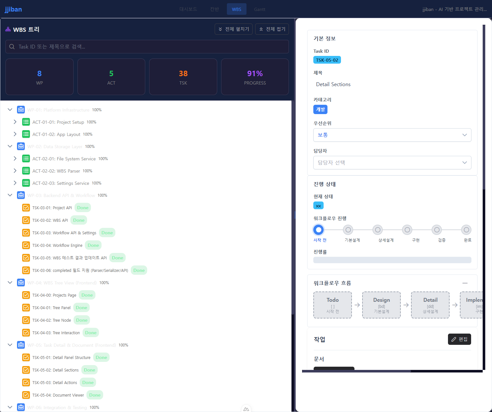
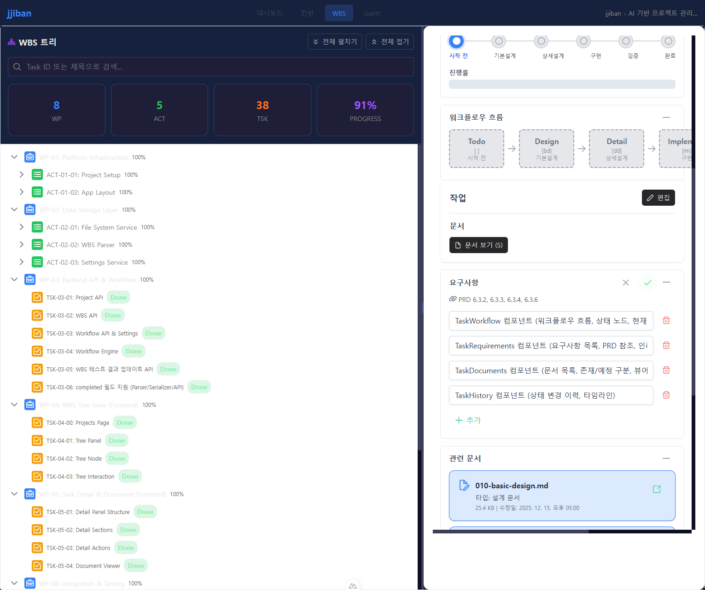
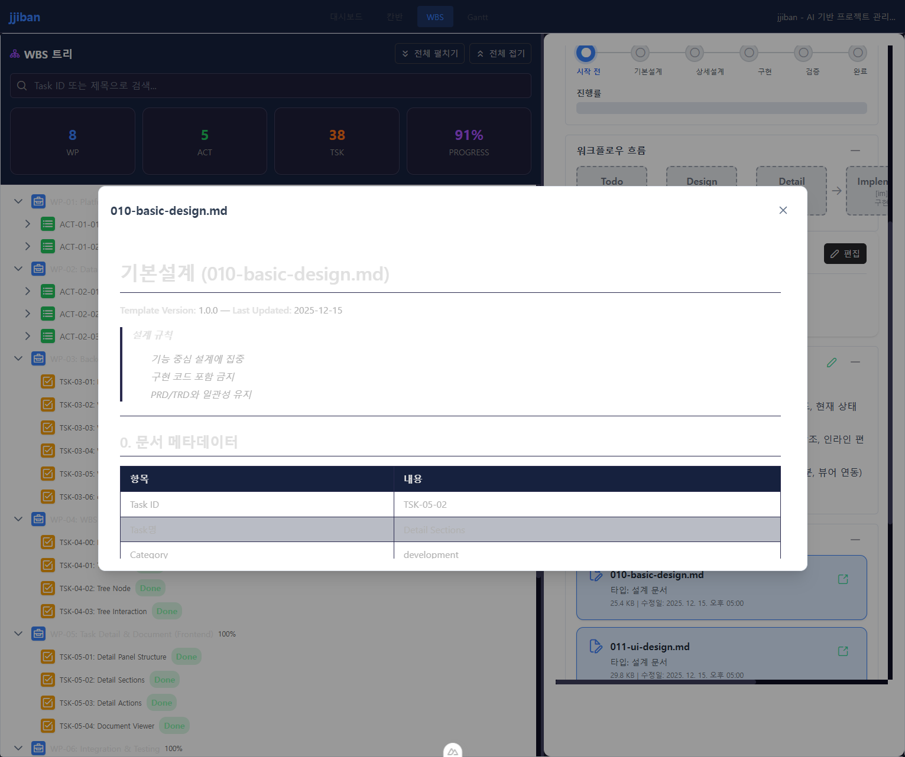

# 사용자 매뉴얼 (080-user-manual.md)

**Template Version:** 1.0.0 — **Last Updated:** 2025-12-16

> **작성 규칙**
> * 시나리오 기반 사용자 관점 작성
> * 단계별 안내는 Step 1, 2, 3... 형식 사용
> * 스크린샷은 `./manual-images/` 폴더에 저장

---

## 0. 문서 메타데이터

| 항목 | 내용 |
|------|------|
| Task ID | TSK-05-02 |
| Task명 | Detail Sections |
| 대상 기능 | Task 상세 섹션 (워크플로우, 요구사항, 문서, 이력) |
| 작성일 | 2025-12-16 |
| 버전 | 1.0.0 |

---

# 사용자 매뉴얼: Task 상세 섹션

**버전:** 1.0.0 — **최종 수정일:** 2025-12-16

---

## 1. 개요

Task 상세 패널에서 워크플로우 흐름, 요구사항, 관련 문서, 상태 변경 이력을 확인하고 관리하는 기능입니다.

### 1.1 화면 구성

```
┌─────────────────────────────────────────────────────────────┐
│  WBS 트리 패널 (좌측)    │  Task 상세 패널 (우측)           │
├──────────────────────────┼──────────────────────────────────┤
│                          │  기본 정보                        │
│  프로젝트 트리 구조       │  ├─ Task ID, 제목, 카테고리      │
│                          │  └─ 우선순위, 담당자              │
│  - WP-01                 ├──────────────────────────────────┤
│    - TSK-01-01           │  진행 상태                        │
│    - TSK-01-02           │  └─ 워크플로우 진행률 표시        │
│  - WP-02                 ├──────────────────────────────────┤
│    ...                   │  워크플로우 흐름 ← 이 기능        │
│                          ├──────────────────────────────────┤
│                          │  요구사항 ← 이 기능               │
│                          ├──────────────────────────────────┤
│                          │  관련 문서 ← 이 기능              │
│                          ├──────────────────────────────────┤
│                          │  이력 ← 이 기능                   │
└──────────────────────────┴──────────────────────────────────┘
```

### 1.2 주요 기능 요약

| 영역/기능 | 설명 |
|----------|------|
| 워크플로우 흐름 | 카테고리별 워크플로우 단계와 현재 상태 시각화 |
| 요구사항 | PRD 참조 및 요구사항 목록 표시, 인라인 편집 |
| 관련 문서 | Task 관련 문서 목록 및 문서 뷰어 연동 |
| 이력 | 상태 변경 이력 타임라인 표시 |

---

## 2. 시나리오별 사용 가이드

### 시나리오 1: 워크플로우 흐름 확인하기

**목표**: Task의 워크플로우 진행 단계와 현재 상태를 시각적으로 확인합니다.

#### 단계별 안내

**Step 1.** 좌측 WBS 트리에서 확인하려는 Task를 클릭합니다.

**Step 2.** 우측 상세 패널의 "워크플로우 흐름" 섹션을 확인합니다.



**Step 3.** 워크플로우 단계별 상태를 확인합니다.

| 상태 표시 | 의미 |
|---------|------|
| 초록색 배경 | 완료된 단계 |
| 파란색 배경 (강조) | 현재 진행 중인 단계 |
| 회색 배경 + 점선 | 미완료 단계 |

#### 카테고리별 워크플로우

| 카테고리 | 워크플로우 단계 |
|---------|---------------|
| development | Todo → Design → Detail → Implement → Verify → Done |
| defect | Todo → Analyze → Fix → Verify → Done |
| infrastructure | Todo → Design(선택) → Implement → Done |

> **Tip**: 워크플로우 흐름 섹션은 접기/펼치기가 가능합니다. 헤더의 화살표 아이콘을 클릭하세요.

---

### 시나리오 2: 요구사항 편집하기

**목표**: Task의 요구사항을 확인하고 추가, 수정, 삭제합니다.

#### 단계별 안내

**Step 1.** Task 상세 패널에서 "요구사항" 섹션을 찾습니다.

**Step 2.** PRD 참조 정보와 현재 요구사항 목록을 확인합니다.

**Step 3.** 편집 버튼(연필 아이콘)을 클릭하여 편집 모드로 전환합니다.



**Step 4.** 요구사항을 편집합니다.

| 조작 | 동작 |
|------|------|
| 텍스트 입력 | 기존 요구사항 내용 수정 |
| 휴지통 아이콘 클릭 | 해당 요구사항 삭제 |
| "추가" 버튼 클릭 | 새 요구사항 항목 추가 |

**Step 5.** 편집 완료 후 저장 버튼을 클릭합니다.

| 버튼 | 동작 |
|------|------|
| 저장 (체크 아이콘) | 변경사항을 서버에 저장 |
| 취소 (X 아이콘) | 변경사항을 취소하고 읽기 모드로 복귀 |

> **주의**: 빈 요구사항은 저장할 수 없습니다. 내용을 입력하거나 삭제해 주세요.

---

### 시나리오 3: 관련 문서 열기

**목표**: Task에 연결된 설계 문서, 구현 문서 등을 확인합니다.

#### 단계별 안내

**Step 1.** "관련 문서" 섹션에서 문서 목록을 확인합니다.

**Step 2.** 문서 카드의 상태를 확인합니다.

| 표시 | 의미 |
|------|------|
| 파란색 배경 | 문서가 존재함 (열기 가능) |
| 회색 배경 + 점선 | 예정 문서 (아직 생성되지 않음) |

**Step 3.** 열려는 문서 카드의 "열기" 버튼을 클릭합니다.



**Step 4.** 문서 뷰어에서 내용을 확인합니다.

**Step 5.** 우측 상단의 X 버튼을 클릭하여 뷰어를 닫습니다.

> **Tip**: 예정 문서에는 생성 조건이 표시됩니다. (예: "/wf:draft 실행 후 생성")

---

### 시나리오 4: 상태 변경 이력 확인하기

**목표**: Task의 상태 변경 기록과 문서 생성 이력을 확인합니다.

#### 단계별 안내

**Step 1.** "이력" 섹션을 확인합니다.

**Step 2.** 타임라인 형태로 표시된 이력 엔트리를 확인합니다.

| 정보 | 설명 |
|------|------|
| 타임스탬프 | 이벤트 발생 시간 |
| 액션 | 상태 전이, 정보 수정 등 |
| 내용 | 이전 상태 → 새 상태, 실행된 명령어 |
| 문서 생성 | 해당 단계에서 생성된 문서명 |

> **Tip**: 이력은 최신 항목이 위에 표시됩니다 (시간 역순 정렬).

---

## 3. 키보드 단축키

| 키 | 동작 |
|----|------|
| **Tab** | 다음 입력 필드/버튼으로 이동 |
| **Enter** | 버튼 클릭, 편집 모드에서 저장 |
| **ESC** | 편집 취소, 다이얼로그 닫기 |
| **Space** | 버튼 클릭, 섹션 접기/펼치기 |

---

## 4. 상태별 화면

| 상태 | 화면 |
|------|------|
| 로딩 중 | 스켈레톤 UI 표시 |
| 에러 | 토스트 메시지로 오류 안내 |
| 데이터 없음 (요구사항) | "요구사항이 없습니다. 추가 버튼을 눌러 추가하세요." |
| 데이터 없음 (문서) | "관련 문서가 없습니다." |
| 데이터 없음 (이력) | "아직 이력이 없습니다." |
| 정상 | 각 섹션에 데이터 표시 |

---

## 5. FAQ / 트러블슈팅

### Q1. 요구사항이 저장되지 않습니다.
- 빈 요구사항 항목이 있는지 확인하세요. 빈 항목은 저장할 수 없습니다.
- 네트워크 연결 상태를 확인하세요.
- 저장 실패 시 토스트 메시지를 확인하세요.

### Q2. 문서를 열 수 없습니다.
- 회색 배경의 예정 문서는 아직 생성되지 않아 열 수 없습니다.
- 해당 워크플로우 명령어를 실행하여 문서를 먼저 생성하세요.

### Q3. 워크플로우 흐름이 표시되지 않습니다.
- Task 카테고리가 올바르게 설정되어 있는지 확인하세요.
- 페이지를 새로고침해 보세요.

---

## 6. 접근성

### 6.1 키보드 지원
- Tab 키로 모든 인터랙티브 요소 탐색 가능
- Enter/Space로 버튼 및 링크 활성화
- ESC로 편집 취소 및 다이얼로그 닫기

### 6.2 스크린 리더
- `aria-label`: 모든 버튼에 명확한 레이블 제공
- `role="list"`: 워크플로우 단계, 요구사항, 문서 목록에 적용
- `aria-current="step"`: 현재 워크플로우 단계 표시
- `aria-expanded`: 접기/펼치기 가능한 섹션에 적용

### 6.3 색상 대비
- WCAG AA 기준 명암비 충족
- 상태 표시는 색상과 함께 아이콘/텍스트로 구분

---

## 7. 관련 문서

| 문서 | 경로 |
|------|------|
| 기본설계 | `tasks/TSK-05-02/010-basic-design.md` |
| UI설계 | `tasks/TSK-05-02/011-ui-design.md` |
| 상세설계 | `tasks/TSK-05-02/020-detail-design.md` |
| 추적성 매트릭스 | `tasks/TSK-05-02/025-traceability-matrix.md` |
| 테스트 명세 | `tasks/TSK-05-02/026-test-specification.md` |

---

## 8. 변경 이력

| 버전 | 날짜 | 변경 내용 |
|------|------|----------|
| 1.0.0 | 2025-12-16 | 초기 작성 |

---

<!--
Author: AI Agent
Template Version: 1.0.0
Created: 2025-12-16
Based on: TSK-05-02 (Detail Sections)
-->
