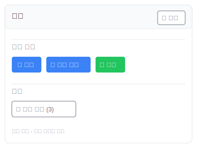
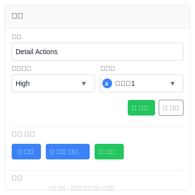
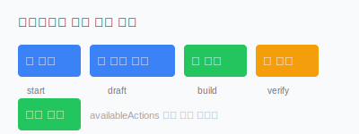
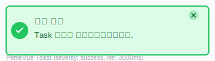
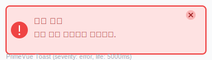

# 화면설계 (011-ui-design.md)

**Template Version:** 1.0.0 — **Last Updated:** 2025-12-15

> **설계 규칙**
> * UI/UX 중심 설계에 집중
> * SVG 개념도로 시각적 설명
> * 실제 소스코드 포함 금지
> * 상위 문서(기본설계, 상세설계)와 일관성 유지

---

## 0. 문서 메타데이터

| 항목 | 내용 |
|------|------|
| Task ID | TSK-05-03 |
| Task명 | Detail Actions |
| Category | development |
| 상태 | [dd] 상세설계 |
| 작성일 | 2025-12-15 |
| 작성자 | AI Agent |

### 상위 문서 참조

| 문서 유형 | 경로 | 참조 섹션 |
|----------|------|----------|
| PRD | `.orchay/projects/orchay/prd.md` | 섹션 6.3.5 |
| 기본설계 | `010-basic-design.md` | 전체 |
| 상세설계 | `020-detail-design.md` | 전체 |

---

## 1. 목적 및 범위

### 1.1 목적

Task 상세 패널의 TaskActions 컴포넌트에 대한 UI/UX 설계를 제공한다. 사용자가 직관적으로 Task 정보를 편집하고, 상태를 전이하며, 관련 문서를 열 수 있는 인터페이스를 설계한다.

**핵심 UI/UX 가치**:
- 명확한 편집/보기 모드 구분
- 즉각적인 피드백 (낙관적 업데이트)
- 워크플로우 명령어의 시각적 구분
- 접근성을 고려한 키보드 네비게이션

### 1.2 범위

**포함 범위**:
- TaskActions 컴포넌트 레이아웃
- 편집 모드 UI (인라인 편집 필드)
- 상태 전이 버튼 UI
- 문서 열기 버튼 UI
- 로딩/에러 상태 표시
- Toast 알림 디자인

**제외 범위**:
- 문서 뷰어 UI → TSK-05-04
- TaskBasicInfo/TaskProgress UI → TSK-05-01

---

## 2. 화면 구성

### 2.1 TaskActions 컴포넌트 개요

TaskActions는 Task 상세 패널 하단에 위치하며, 3개의 섹션으로 구성됩니다:

1. **편집 섹션**: 편집 모드 토글 및 인라인 편집 필드
2. **상태 전이 섹션**: 워크플로우 명령어 버튼
3. **문서 섹션**: 문서 열기 버튼

### 2.2 화면 상태

| 상태 | 설명 | UI 변화 |
|------|------|---------|
| 읽기 모드 | 기본 상태 | "편집" 버튼만 표시 |
| 편집 모드 | 편집 활성화 | 인라인 편집 필드 + "저장"/"취소" 버튼 |
| 로딩 중 | API 호출 중 | 버튼 비활성화 + 스피너 |
| 에러 상태 | API 실패 | 에러 토스트 표시 |

---

## 3. 화면 레이아웃

### 3.1 읽기 모드 (편집 모드 OFF)



**구성 요소**:
- PrimeVue Card (타이틀: "작업")
- "편집" 버튼 (우측 상단)
- Divider (상태 전이 섹션 구분)
- 상태 전이 버튼들 (워크플로우 명령어 기반)
- Divider (문서 섹션 구분)
- "문서 보기" 버튼

### 3.2 편집 모드 (편집 모드 ON)



**구성 요소**:
- PrimeVue Card (타이틀: "작업")
- 제목 필드 (InputText)
- 우선순위 필드 (Dropdown)
- 담당자 필드 (Dropdown with Avatar)
- "저장" / "취소" 버튼
- Divider (상태 전이 섹션 구분)
- 상태 전이 버튼들
- Divider (문서 섹션 구분)
- "문서 보기" 버튼

---

## 4. 컴포넌트 상세 설계

### 4.1 편집 섹션

#### 4.1.1 읽기 모드 - 편집 버튼

**PrimeVue Button**:
- Label: "편집"
- Icon: `pi pi-pencil`
- Severity: `secondary`
- Size: `small`
- Position: Card 우측 상단

**속성**:
```
label="편집"
icon="pi pi-pencil"
severity="secondary"
size="small"
outlined
@click="enterEditMode"
data-testid="action-edit-button"
```

#### 4.1.2 편집 모드 - 인라인 편집 필드

**제목 필드 (InputText)**:
- Label: "제목"
- Placeholder: "Task 제목을 입력하세요"
- Full width
- 키보드: Enter (저장), Escape (취소)

**속성**:
```
v-model="editedValues.title"
placeholder="Task 제목을 입력하세요"
class="w-full"
@keyup.enter="saveAll"
@keyup.escape="cancelEdit"
aria-label="Task 제목"
data-testid="action-title-input"
```

**우선순위 필드 (Dropdown)**:
- Label: "우선순위"
- Options: Critical, High, Medium, Low
- 색상 태그 표시

**속성**:
```
v-model="editedValues.priority"
:options="priorityOptions"
optionLabel="label"
optionValue="value"
placeholder="우선순위 선택"
class="w-full md:w-1/2"
aria-label="우선순위"
data-testid="action-priority-dropdown"
```

**Options 구조**:
```
[
  { label: 'Critical', value: 'critical', severity: 'danger' },
  { label: 'High', value: 'high', severity: 'warning' },
  { label: 'Medium', value: 'medium', severity: 'info' },
  { label: 'Low', value: 'low', severity: 'success' }
]
```

**담당자 필드 (Dropdown with Avatar)**:
- Label: "담당자"
- Options: 팀원 목록
- Avatar + Name 표시
- Nullable (담당자 미할당 가능)

**속성**:
```
v-model="editedValues.assignee"
:options="teamMembers"
optionLabel="name"
optionValue="id"
placeholder="담당자 선택"
class="w-full md:w-1/2"
aria-label="담당자"
data-testid="action-assignee-dropdown"
```

**Avatar 템플릿**:
- Value slot: 선택된 담당자 Avatar + Name
- Option slot: 모든 옵션에 Avatar + Name

#### 4.1.3 편집 모드 - 액션 버튼

**저장 버튼 (PrimeVue Button)**:
```
label="저장"
icon="pi pi-check"
severity="success"
:loading="updating"
:disabled="!hasChanges"
@click="saveAll"
data-testid="action-save-button"
```

**취소 버튼 (PrimeVue Button)**:
```
label="취소"
icon="pi pi-times"
severity="secondary"
outlined
:disabled="updating"
@click="cancelEdit"
data-testid="action-cancel-button"
```

### 4.2 상태 전이 섹션



#### 4.2.1 워크플로우 명령어 버튼 매핑

| 명령어 | 라벨 | 아이콘 | Severity | 설명 |
|--------|------|--------|----------|------|
| start | 시작 | pi pi-play | primary | 작업 시작 |
| draft | 초안 작성 | pi pi-pencil | info | 기본설계 작성 |
| build | 구현 | pi pi-code | success | 구현 진행 |
| verify | 검증 | pi pi-check | warning | 검증 진행 |
| done | 완료 | pi pi-check-circle | success | 작업 완료 |

**버튼 속성 (공통)**:
```
:label="btn.label"
:icon="btn.icon"
:severity="btn.severity"
:loading="updating"
:disabled="updating"
@click="handleTransition(btn.command)"
:data-testid="`action-transition-${btn.command}`"
```

**레이아웃**:
- Desktop: 수평 정렬 (flex gap-2)
- Mobile: 수직 정렬 (flex-col gap-2)

### 4.3 문서 섹션

**문서 열기 버튼 (PrimeVue Button)**:
```
:label="`문서 보기 (${documentCount})`"
icon="pi pi-folder-open"
severity="secondary"
outlined
:disabled="documentCount === 0"
@click="openDocuments"
data-testid="action-documents-button"
```

**상태**:
- documents.length > 0: 활성화
- documents.length === 0: 비활성화 (회색 처리)

---

## 5. 인터랙션 설계

### 5.1 편집 모드 전환

**시나리오 1: 편집 모드 진입**
```
1. 사용자가 "편집" 버튼 클릭
2. editMode = true
3. 인라인 편집 필드 표시 (fade-in 애니메이션)
4. 제목 필드에 자동 포커스
5. "편집" 버튼 → "저장"/"취소" 버튼으로 전환
```

**시나리오 2: 편집 저장**
```
1. 사용자가 필드 값 변경
2. "저장" 버튼 활성화 (hasChanges = true)
3. 사용자가 "저장" 버튼 클릭 또는 Enter 키 입력
4. 낙관적 업데이트: UI 즉시 반영
5. API 호출 시작 (버튼 로딩 스피너)
6. 성공: 편집 모드 종료 + 성공 토스트
7. 실패: 롤백 + 에러 토스트 + 편집 모드 유지
```

**시나리오 3: 편집 취소**
```
1. 사용자가 "취소" 버튼 클릭 또는 Escape 키 입력
2. editedValues 원본으로 복원
3. editMode = false
4. 인라인 편집 필드 숨김 (fade-out 애니메이션)
5. "편집" 버튼 다시 표시
```

### 5.2 상태 전이 인터랙션

**시나리오: 상태 전이 실행**
```
1. 사용자가 워크플로우 명령어 버튼 클릭 (예: "시작")
2. 버튼 로딩 스피너 표시
3. 모든 상태 전이 버튼 비활성화
4. API 호출 (POST /api/tasks/:id/transition)
5. 성공:
   - 최신 데이터 동기화 (refreshTaskDetail)
   - 성공 토스트 표시
   - availableActions 업데이트 → 버튼 재렌더링
6. 실패:
   - 에러 토스트 표시
   - 버튼 다시 활성화
```

### 5.3 키보드 네비게이션

**Tab 순서**:
```
1. "편집" 버튼 (읽기 모드)
   ↓
2. 제목 InputText (편집 모드)
   ↓
3. 우선순위 Dropdown (편집 모드)
   ↓
4. 담당자 Dropdown (편집 모드)
   ↓
5. "저장" 버튼 (편집 모드)
   ↓
6. "취소" 버튼 (편집 모드)
   ↓
7. 상태 전이 버튼들 (순차)
   ↓
8. "문서 보기" 버튼
```

**단축키**:
- Enter: 편집 저장 (편집 모드에서)
- Escape: 편집 취소 (편집 모드에서)
- Tab: 다음 필드로 이동
- Shift+Tab: 이전 필드로 이동

---

## 6. 피드백 및 알림

### 6.1 성공 토스트



**PrimeVue Toast (Success)**:
```
severity: 'success'
summary: '수정 완료' / '상태 전이 완료'
detail: 구체적인 성공 메시지
life: 3000 (3초)
```

**메시지 예시**:
- 편집 성공: "Task 정보가 업데이트되었습니다."
- 상태 전이 성공: "start 명령이 실행되었습니다."

### 6.2 에러 토스트



**PrimeVue Toast (Error)**:
```
severity: 'error'
summary: '수정 실패' / '상태 전이 실패'
detail: 구체적인 에러 메시지
life: 5000 (5초)
```

**메시지 예시**:
- 유효성 검증 실패: "입력 값이 유효하지 않습니다. 다시 확인해주세요."
- 워크플로우 위반: "현재 상태에서 실행할 수 없는 명령어입니다."
- 네트워크 오류: "네트워크 연결을 확인해주세요."

### 6.3 로딩 상태

**버튼 로딩 (PrimeVue Button loading 속성)**:
- 스피너 아이콘 표시
- 버튼 비활성화
- 라벨 유지

**전체 로딩 (updating = true)**:
- 모든 상태 전이 버튼 비활성화
- "저장"/"취소" 버튼 비활성화
- aria-busy="true" 속성 추가

---

## 7. 반응형 디자인

### 7.1 Desktop (≥1200px)

**레이아웃**:
- 편집 필드: 2열 그리드 (제목: 전체, 우선순위/담당자: 50%)
- 상태 전이 버튼: 수평 정렬
- 버튼 간격: gap-2

**예시**:
```
[제목                                                  ]

[우선순위 ▼          ] [담당자 ▼              ]

                               [저장] [취소]

──────────────────────────────────────────────

[시작] [초안 작성] [구현] [검증] [완료]
```

### 7.2 Tablet (768px~1199px)

**레이아웃**:
- 편집 필드: 2열 그리드 유지
- 상태 전이 버튼: 수평 정렬, 작은 크기
- 버튼 간격: gap-2

### 7.3 Mobile (<768px)

**레이아웃**:
- 편집 필드: 1열 (전체 너비)
- 상태 전이 버튼: 수직 정렬
- 버튼 크기: 전체 너비

**예시**:
```
[제목                    ]

[우선순위 ▼              ]

[담당자 ▼                ]

[저장]
[취소]

───────────────────────

[시작]
[초안 작성]
[구임]
[검증]
[완료]
```

---

## 8. 접근성 (Accessibility)

### 8.1 ARIA 속성

**편집 필드**:
- `aria-label`: 모든 InputText, Dropdown에 명확한 라벨
- `aria-describedby`: 에러 메시지 연결
- `aria-invalid`: 유효성 검증 실패 시 true

**버튼**:
- `aria-label`: 아이콘만 있는 버튼에 필수
- `aria-busy`: 로딩 중일 때 true

**Toast**:
- `aria-live="polite"`: 성공 메시지
- `aria-live="assertive"`: 에러 메시지

### 8.2 포커스 관리

**편집 모드 진입 시**:
- 제목 InputText에 자동 포커스

**편집 모드 종료 시**:
- "편집" 버튼으로 포커스 이동

**에러 발생 시**:
- 에러가 발생한 필드로 포커스 이동

### 8.3 스크린 리더 지원

**상태 알림**:
- 편집 모드 진입: "편집 모드 활성화됨"
- 저장 성공: "Task 정보가 업데이트되었습니다"
- 상태 전이 성공: "start 명령이 실행되었습니다"

**버튼 설명**:
- "편집": "Task 정보 편집 모드로 전환"
- "저장": "변경사항 저장"
- "취소": "편집 취소 및 원래 값으로 복원"

---

## 9. 스타일 가이드

### 9.1 색상

| 용도 | 색상 | Hex | TailwindCSS |
|------|------|-----|-------------|
| Primary Button | 파랑 | #3B82F6 | bg-blue-500 |
| Success Button | 초록 | #22C55E | bg-green-500 |
| Warning Button | 주황 | #F59E0B | bg-yellow-500 |
| Danger Button | 빨강 | #EF4444 | bg-red-500 |
| Secondary Button | 회색 | #6B7280 | bg-gray-500 |
| Success Toast BG | 연초록 | #DCFCE7 | bg-green-100 |
| Success Toast Border | 초록 | #22C55E | border-green-500 |
| Error Toast BG | 연빨강 | #FEE2E2 | bg-red-100 |
| Error Toast Border | 빨강 | #EF4444 | border-red-500 |

### 9.2 간격

| 요소 | 간격 | TailwindCSS |
|------|------|-------------|
| 필드 간 세로 간격 | 16px | space-y-4 |
| 버튼 간 가로 간격 | 8px | gap-2 |
| 섹션 간 여백 | 24px | space-y-6 |
| Card 내부 패딩 | 20px | p-5 |

### 9.3 타이포그래피

| 요소 | 크기 | 굵기 | TailwindCSS |
|------|------|------|-------------|
| Card 타이틀 | 18px | 600 | text-lg font-semibold |
| 필드 라벨 | 14px | 500 | text-sm font-medium |
| 버튼 텍스트 | 14px | 500 | text-sm font-medium |
| Toast 제목 | 14px | 600 | text-sm font-semibold |
| Toast 내용 | 14px | 400 | text-sm |

---

## 10. 애니메이션

### 10.1 전환 효과

**편집 모드 진입/종료**:
- Duration: 200ms
- Easing: ease-in-out
- Type: opacity + transform (fade-in/fade-out)

**Toast 표시/숨김**:
- Duration: 300ms
- Easing: ease-out
- Type: slide-in-right + fade-in

**버튼 호버**:
- Duration: 150ms
- Easing: ease-in-out
- Type: background-color

### 10.2 로딩 애니메이션

**버튼 스피너**:
- PrimeVue 기본 스피너 사용
- 크기: 16px
- 색상: 버튼 텍스트 색상과 동일

---

## 11. 에러 상태 표시

### 11.1 인라인 에러 (필드별)

**유효성 검증 실패 시**:
- 필드 테두리: 빨강 (border-red-500)
- 에러 메시지: 필드 하단에 작은 텍스트
- 색상: 빨강 (text-red-500)
- 아이콘: `pi pi-exclamation-circle`

**예시**:
```
[제목                    ] ← border-red-500
⚠ 제목은 1-200자여야 합니다 ← text-red-500 text-xs
```

### 11.2 Toast 에러

**에러 유형별 메시지**:
- VALIDATION_ERROR: "입력 값이 유효하지 않습니다. 다시 확인해주세요."
- TASK_NOT_FOUND: "Task를 찾을 수 없습니다."
- ASSIGNEE_NOT_FOUND: "존재하지 않는 담당자입니다."
- FILE_WRITE_ERROR: "데이터 저장에 실패했습니다. 잠시 후 다시 시도해주세요."
- WORKFLOW_VIOLATION: "현재 상태에서 실행할 수 없는 명령어입니다."
- NETWORK_ERROR: "네트워크 연결을 확인해주세요."

---

## 12. data-testid 속성

| 요소 | data-testid 값 |
|------|----------------|
| 편집 버튼 | `action-edit-button` |
| 제목 InputText | `action-title-input` |
| 우선순위 Dropdown | `action-priority-dropdown` |
| 담당자 Dropdown | `action-assignee-dropdown` |
| 저장 버튼 | `action-save-button` |
| 취소 버튼 | `action-cancel-button` |
| 상태 전이 버튼 (start) | `action-transition-start` |
| 상태 전이 버튼 (draft) | `action-transition-draft` |
| 상태 전이 버튼 (build) | `action-transition-build` |
| 상태 전이 버튼 (verify) | `action-transition-verify` |
| 상태 전이 버튼 (done) | `action-transition-done` |
| 문서 보기 버튼 | `action-documents-button` |
| TaskActions 컴포넌트 | `task-actions-component` |

---

## 13. UI 자산 목록

### 13.1 SVG 개념도

| 파일명 | 설명 | 크기 |
|--------|------|------|
| `screen-01-actions-view.svg` | 읽기 모드 화면 (기본 상태) | 400x300 |
| `screen-01-actions-edit.svg` | 편집 모드 화면 (편집 필드 활성화) | 400x400 |
| `screen-02-transition-buttons.svg` | 상태 전이 버튼들 | 400x150 |
| `screen-03-toast-success.svg` | 성공 토스트 | 350x100 |
| `screen-03-toast-error.svg` | 에러 토스트 | 350x100 |

### 13.2 아이콘 목록 (PrimeIcons)

| 용도 | 아이콘 클래스 |
|------|--------------|
| 편집 | `pi pi-pencil` |
| 저장 | `pi pi-check` |
| 취소 | `pi pi-times` |
| 시작 | `pi pi-play` |
| 초안 작성 | `pi pi-pencil` |
| 구현 | `pi pi-code` |
| 검증 | `pi pi-check` |
| 완료 | `pi pi-check-circle` |
| 문서 열기 | `pi pi-folder-open` |
| 에러 | `pi pi-exclamation-circle` |

---

## 14. 구현 체크리스트

### UI 구현
- [ ] PrimeVue Card 컨테이너 생성
- [ ] 편집 버튼 구현 (읽기 모드)
- [ ] 제목 InputText 필드 구현 (편집 모드)
- [ ] 우선순위 Dropdown 구현 (편집 모드)
- [ ] 담당자 Dropdown with Avatar 구현 (편집 모드)
- [ ] 저장/취소 버튼 구현 (편집 모드)
- [ ] 상태 전이 버튼 동적 렌더링
- [ ] 문서 보기 버튼 구현
- [ ] Divider 구분선 추가
- [ ] Toast 알림 통합

### 인터랙션
- [ ] 편집 모드 토글 기능
- [ ] 키보드 네비게이션 (Tab, Enter, Escape)
- [ ] 필드 자동 포커스
- [ ] 버튼 로딩 상태
- [ ] 낙관적 업데이트 UI 반영
- [ ] 에러 시 롤백 UI

### 반응형
- [ ] Desktop 레이아웃 (≥1200px)
- [ ] Tablet 레이아웃 (768px~1199px)
- [ ] Mobile 레이아웃 (<768px)
- [ ] 버튼 크기 조정

### 접근성
- [ ] ARIA 라벨 모든 필드
- [ ] 포커스 관리
- [ ] 스크린 리더 알림
- [ ] 키보드 네비게이션 순서

### 스타일
- [ ] TailwindCSS 클래스 적용
- [ ] 색상 가이드 준수
- [ ] 간격 가이드 준수
- [ ] 타이포그래피 가이드 준수
- [ ] 애니메이션 적용

### 테스트
- [ ] data-testid 속성 모든 요소
- [ ] E2E 테스트 (편집 시나리오)
- [ ] E2E 테스트 (상태 전이 시나리오)
- [ ] 접근성 테스트

---

## 15. 다음 단계

- 구현 단계에서 SVG 개념도를 참고하여 실제 UI 개발
- 테스트 명세(`026-test-specification.md`)의 시나리오 기반 E2E 테스트 작성

---

## 관련 문서

- 기본설계: `010-basic-design.md`
- 상세설계: `020-detail-design.md`
- 테스트 명세: `026-test-specification.md`
- PRD: `.orchay/projects/orchay/prd.md`

---

<!--
author: AI Agent
Template Version: 1.0.0
-->
