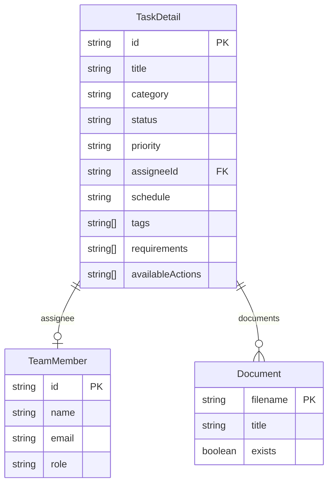
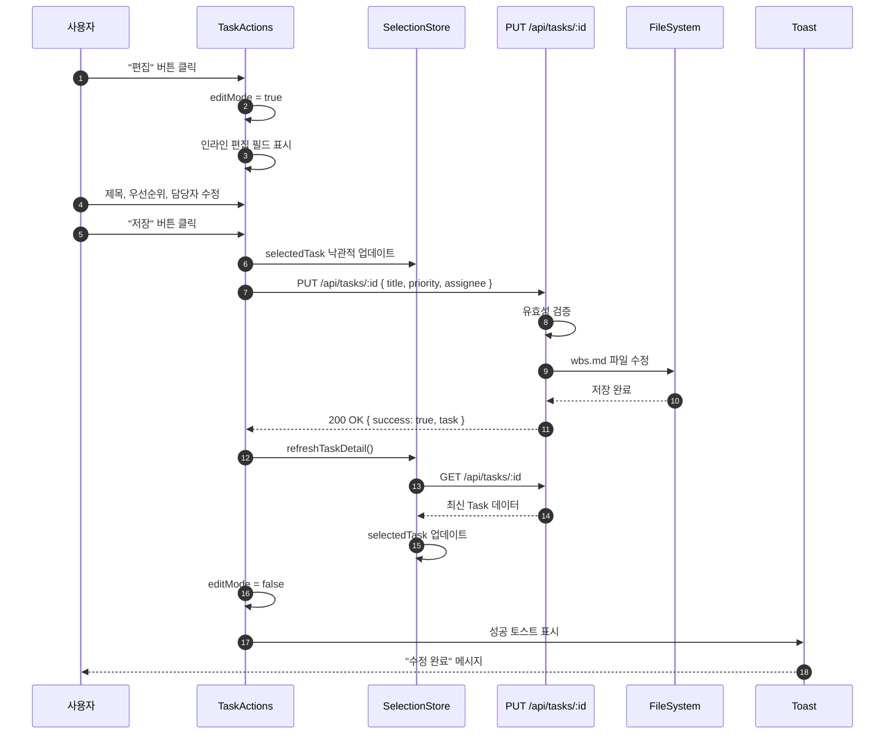
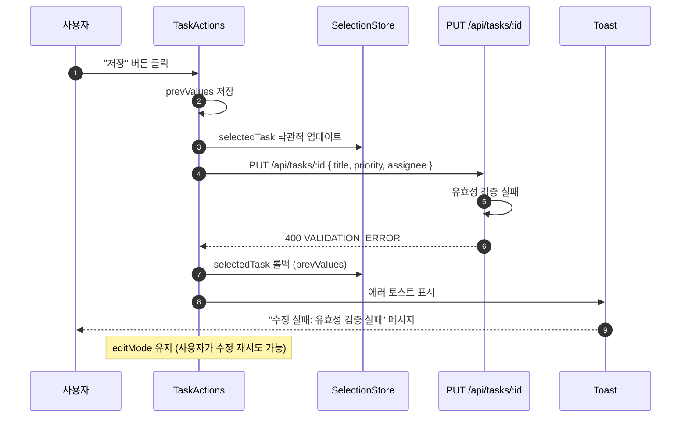
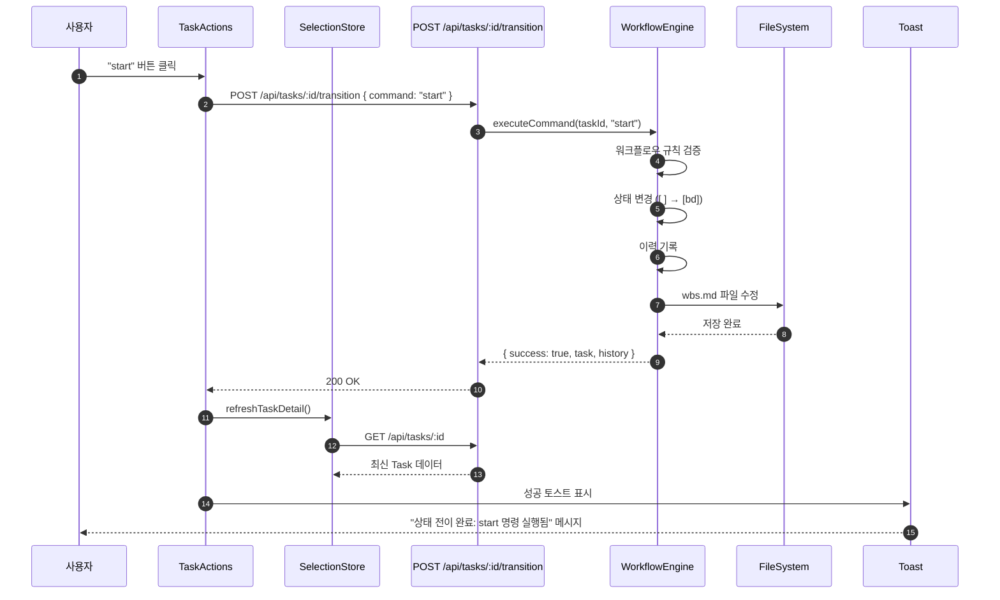
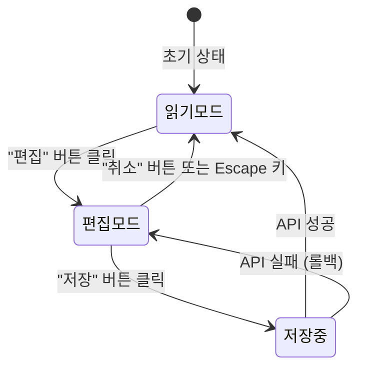
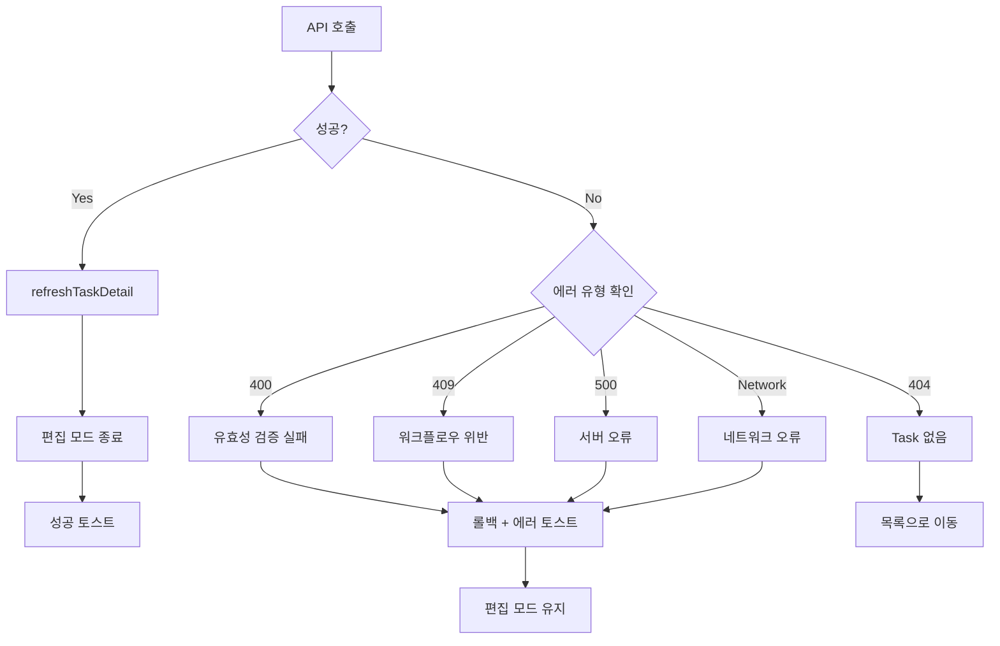

# 상세설계 (020-detail-design.md)

**Template Version:** 3.0.0 — **Last Updated:** 2025-12-15

> **설계 규칙**
> * *기능 중심 설계*에 집중한다.
> * 실제 소스코드(전체 또는 일부)는 **절대 포함하지 않는다**.
> * 작성 후 **상위 문서(PRD, TRD, 기본설계)와 비교**하여 차이가 있으면 **즉시 중단 → 차이 설명 → 지시 대기**.
> * **다이어그램 규칙**
>   * 프로세스: **Mermaid**만 사용
>   * UI 레이아웃: **Text Art(ASCII)** → 바로 아래 **SVG 개념도**를 순차 배치
>
> **분할 문서**
> * 요구사항 추적성: `025-traceability-matrix.md`
> * 테스트 명세: `026-test-specification.md`

---

## 0. 문서 메타데이터

| 항목 | 내용 |
|------|------|
| Task ID | TSK-05-03 |
| Task명 | Detail Actions |
| Category | development |
| 상태 | [dd] 상세설계 |
| 작성일 | 2025-12-15 |
| 작성자 | AI Agent |

### 상위 문서 참조

| 문서 유형 | 경로 | 참조 섹션 |
|----------|------|----------|
| PRD | `.orchay/projects/orchay/prd.md` | 섹션 6.3.5, 8.1, 8.2, 11 |
| TRD | `.orchay/projects/orchay/trd.md` | 전체 |
| 기본설계 | `010-basic-design.md` | 전체 |
| 상위 Activity | ACT-05: Task Detail & Document | - |
| 상위 Work Package | WP-05: Task Detail & Document (Frontend) | - |

### 분할 문서 참조

| 문서 유형 | 파일명 | 목적 |
|----------|--------|------|
| 추적성 매트릭스 | `025-traceability-matrix.md` | 요구사항 ↔ 설계 ↔ 테스트 추적 |
| 테스트 명세 | `026-test-specification.md` | 테스트 시나리오, 데이터, data-testid |

---

## 1. 일관성 검증 결과

> 상위 문서와의 일관성 검증 결과를 기록합니다.

### 1.1 검증 요약

| 구분 | 통과 | 경고 | 실패 |
|------|------|------|------|
| PRD ↔ 기본설계 | 10개 | 0개 | 0개 |
| 기본설계 ↔ 상세설계 | 15개 | 0개 | 0개 |
| TRD ↔ 상세설계 | 5개 | 0개 | 0개 |

### 1.2 검증 상세

| 검증 ID | 검증 항목 | 결과 | 비고 |
|---------|----------|------|------|
| CHK-PRD-01 | 기능 요구사항 완전성 (FR-001~FR-010) | ✅ PASS | 모든 PRD 요구사항 매핑 완료 |
| CHK-PRD-02 | 비즈니스 규칙 일치성 | ✅ PASS | 낙관적 업데이트 전략 일치 |
| CHK-PRD-03 | 용어 일관성 | ✅ PASS | Task, 상태 전이, 워크플로우 용어 통일 |
| CHK-BD-01 | 기능 요구사항 완전성 | ✅ PASS | 기본설계 FR-001~FR-010 모두 구현 |
| CHK-BD-02 | 비즈니스 규칙 구현 명세 | ✅ PASS | 낙관적 업데이트 롤백 메커니즘 |
| CHK-BD-03 | 데이터 모델 일치성 | ✅ PASS | TaskDetail, TeamMember 타입 일치 |
| CHK-BD-04 | API 인터페이스 일치성 | ✅ PASS | PUT /api/tasks/:id, POST /api/tasks/:id/transition |
| CHK-BD-05 | 컴포넌트 구조 일치성 | ✅ PASS | TaskActions, 인라인 편집 필드 구조 |
| CHK-TRD-01 | 기술 스택 준수 | ✅ PASS | Vue 3, Nuxt 3, PrimeVue 4.x, TypeScript |
| CHK-TRD-02 | 아키텍처 패턴 준수 | ✅ PASS | Composition API, Pinia 상태 관리 |

---

## 2. 목적 및 범위

### 2.1 목적

Task 상세 패널에서 사용자가 Task 정보를 직관적으로 편집하고, 상태 전이를 수행하며, 관련 문서를 열 수 있도록 하는 액션 컴포넌트를 제공한다. 인라인 편집과 낙관적 업데이트를 통해 빠른 사용자 경험을 구현한다.

**핵심 가치**:
- 빠른 정보 수정 (인라인 편집)
- 명확한 워크플로우 액션 제공
- 낙관적 업데이트로 즉각적인 피드백
- API 연동을 통한 데이터 일관성 유지

### 2.2 범위

**포함 범위** (기본설계 구현 범위의 기술적 구현 사항):
- TaskActions 컴포넌트 상세 설계 (Vue SFC 구조)
- 인라인 편집 UI 상세 설계 (PrimeVue 컴포넌트 속성)
- 낙관적 업데이트 및 롤백 로직 상세화
- API 연동 상세 (에러 핸들링, 토스트 메시지)
- 키보드 접근성 (Enter, Escape, Tab 네비게이션)
- 상태 전이 버튼 렌더링 로직
- PrimeVue Toast 통합

**제외 범위** (다른 Task에서 구현):
- 상태 전이 로직 자체 → TSK-03-04 (Workflow Engine)
- 문서 뷰어 구현 → TSK-05-04 (Document Viewer)
- 워크플로우 규칙 정의 → TSK-02-03-01 (Settings Schema)
- TaskBasicInfo/TaskProgress 컴포넌트 → TSK-05-01 (Detail Panel Structure)

---

## 3. 기술 스택

> TRD 기준, 이 Task에서 사용하는 기술만 명시

| 구분 | 기술 | 버전 | 용도 |
|------|------|------|------|
| Frontend | Vue 3 + Nuxt 3 | 3.5.x / 3.18.x | UI 렌더링, Composition API |
| UI Framework | PrimeVue | 4.x | Button, InputText, Dropdown, Toast, Card, Divider |
| Styling | TailwindCSS | 3.4.x | 유틸리티 CSS, 간격/레이아웃 |
| 상태 관리 | Pinia | 2.x | useSelectionStore (selectedTask, refreshTaskDetail) |
| Type System | TypeScript | 5.x | Props, Emits, TaskDetail 타입 정의 |
| API | Nuxt Server Routes | - | PUT /api/tasks/:id, POST /api/tasks/:id/transition |
| Testing | Vitest + Playwright | 2.x / 1.49.x | 단위 테스트, E2E 테스트 |

---

## 4. 용어/가정/제약

### 4.1 용어 정의

| 용어 | 정의 |
|------|------|
| 인라인 편집 | 별도 모달/페이지 없이 현재 화면에서 필드를 직접 수정하는 편집 방식 |
| 낙관적 업데이트 | API 응답 전에 UI를 즉시 업데이트하고, 실패 시 롤백하는 전략 |
| 상태 전이 | Task의 워크플로우 상태를 변경하는 명령어 실행 (start, draft, build 등) |
| availableActions | 현재 Task 상태에서 실행 가능한 워크플로우 명령어 목록 |
| 편집 모드 | 인라인 편집 필드가 활성화된 상태 (editMode = true) |
| 롤백 | API 실패 시 이전 값으로 UI를 복원하는 작업 |

### 4.2 가정 (Assumptions)

- useSelectionStore의 selectedTask는 항상 최신 Task 정보를 포함
- refreshTaskDetail() 메서드는 서버에서 최신 데이터를 가져와 selectedTask를 업데이트
- teamMembers 데이터는 project.json에서 로드되어 전역 상태로 관리됨
- Toast 컴포넌트는 AppLayout에서 이미 설정되어 있음
- 워크플로우 명령어는 availableActions 배열로 제공됨 (API 응답 포함)

### 4.3 제약 (Constraints)

- PrimeVue 4.x에는 InlineEdit 컴포넌트가 없어 커스텀 구현 필요
- 단일 사용자 환경으로 동시 편집 충돌 처리 불필요
- API 응답 시간 목표: PUT /api/tasks/:id < 300ms
- 인라인 편집은 제목, 우선순위, 담당자 필드만 지원 (일정, 태그는 제외)

---

## 5. 시스템/모듈 구조

> **규칙**: 구현 코드가 아닌 **구조/역할/책임**만 표현

### 5.1 모듈 역할 및 책임

| 모듈 | 역할 | 책임 |
|------|------|------|
| TaskActions.vue | 액션 컴포넌트 | - 편집 모드 상태 관리<br>- 인라인 편집 UI 렌더링<br>- API 호출 및 낙관적 업데이트<br>- 상태 전이 버튼 렌더링<br>- 에러 처리 및 토스트 표시 |
| useSelectionStore | 선택 상태 관리 | - selectedTask 제공<br>- refreshTaskDetail() 제공<br>- Task 업데이트 반영 |
| useToast | 알림 관리 | - 성공/에러 메시지 표시<br>- 자동 사라짐 처리 |
| /api/tasks/:id | Task 수정 API | - Task 정보 업데이트<br>- 유효성 검증<br>- wbs.md 파일 저장 |
| /api/tasks/:id/transition | 상태 전이 API | - 워크플로우 명령어 실행<br>- 상태 변경 이력 기록<br>- wbs.md 파일 저장 |

### 5.2 모듈 구조도 (개념)

```
components/tasks/
├── TaskDetailPanel.vue (컨테이너)
├── TaskBasicInfo.vue (읽기 전용)
├── TaskProgress.vue (읽기 전용)
├── TaskWorkflow.vue (읽기 전용)
├── TaskDocuments.vue (읽기 전용)
└── TaskActions.vue (본 Task) ★
    ├── 편집 모드 토글 섹션
    ├── 인라인 편집 필드 (InputText, Dropdown)
    ├── 상태 전이 버튼 섹션
    └── 문서 열기 버튼 섹션

stores/
└── selection.ts
    ├── state: selectedTask
    └── actions: refreshTaskDetail()

composables/
└── useToast.ts (PrimeVue Toast 래퍼)

server/api/tasks/
├── [id].put.ts (Task 수정)
└── [id]/transition.post.ts (상태 전이)
```

### 5.3 외부 의존성

| 의존성 | 유형 | 용도 |
|--------|------|------|
| PrimeVue Button | Library | 편집, 저장, 취소, 상태 전이 버튼 |
| PrimeVue InputText | Library | 제목 인라인 편집 |
| PrimeVue Dropdown | Library | 우선순위, 담당자 인라인 편집 |
| PrimeVue Toast | Library | 성공/에러 메시지 알림 |
| PrimeVue Card | Library | 액션 섹션 컨테이너 |
| PrimeVue Divider | Library | 섹션 구분선 |
| PrimeVue Avatar | Library | 담당자 아바타 표시 |
| useSelectionStore | Pinia Store | selectedTask 접근 및 refreshTaskDetail |
| $fetch | Nuxt API | API 호출 (PUT, POST) |

---

## 6. 데이터 모델 (개념 수준)

> **규칙**: 코드가 아닌 **개념 수준 ERD와 필드 정의**만 기술

### 6.1 엔티티 정의

#### Entity: TaskDetail

| 필드명 | 타입 | 필수 | 설명 | 제약조건 |
|--------|------|------|------|----------|
| id | String | Y | Task ID | PK, TSK-XX-XX-XX 형식 |
| title | String | Y | Task 제목 | 1-200자 |
| category | Enum | Y | 카테고리 | development/defect/infrastructure |
| status | String | Y | 현재 상태 | [ ]/[bd]/[dd]/[im]/[vf]/[xx] |
| priority | Enum | Y | 우선순위 | critical/high/medium/low |
| assignee | TeamMember? | N | 담당자 | FK to TeamMember |
| schedule | String | N | 일정 | YYYY-MM-DD ~ YYYY-MM-DD |
| tags | String[] | N | 태그 | 최대 10개 |
| requirements | String[] | N | 요구사항 | 자유 형식 |
| documents | Document[] | N | 문서 목록 | 관련 문서 배열 |
| availableActions | String[] | Y | 가능한 워크플로우 명령어 | start/draft/build/verify/done 등 |

#### Entity: TeamMember

| 필드명 | 타입 | 필수 | 설명 | 제약조건 |
|--------|------|------|------|----------|
| id | String | Y | 팀원 ID | PK |
| name | String | Y | 이름 | 1-100자 |
| email | String | N | 이메일 | 이메일 형식 |
| role | String | N | 역할 | 자유 형식 |

#### Entity: Document

| 필드명 | 타입 | 필수 | 설명 | 제약조건 |
|--------|------|------|------|----------|
| filename | String | Y | 파일명 | 010-basic-design.md 형식 |
| title | String | Y | 문서 제목 | 1-100자 |
| exists | Boolean | Y | 존재 여부 | true/false |

### 6.2 관계 다이어그램



### 6.3 인덱스 및 제약조건

| 엔티티 | 인덱스/제약 | 필드 | 목적 |
|--------|------------|------|------|
| TaskDetail | PK | id | 고유 식별 |
| TeamMember | PK | id | 고유 식별 |

---

## 7. 인터페이스 계약 (API Contract)

> **규칙**: TypeScript 코드가 아닌 **표 형태의 계약 정의**

### 7.1 엔드포인트 목록

| Method | Endpoint | 설명 | 요구사항 |
|--------|----------|------|----------|
| PUT | /api/tasks/:id | Task 정보 수정 | FR-007, FR-008 |
| POST | /api/tasks/:id/transition | 상태 전이 실행 | FR-005 |

### 7.2 API 상세: PUT /api/tasks/:id (Task 정보 수정)

**요구사항**: FR-007 (API 연동), FR-008 (낙관적 업데이트)

#### 요청 (Request)

| 구분 | 파라미터 | 타입 | 필수 | 설명 | 기본값 |
|------|----------|------|------|------|--------|
| Path | id | string | Y | Task ID | - |
| Body | title | string | N | 제목 | - |
| Body | priority | string | N | 우선순위 (critical/high/medium/low) | - |
| Body | assignee | string | N | 담당자 ID (null 가능) | - |

**요청 예시**:
```json
{
  "title": "새로운 제목",
  "priority": "high",
  "assignee": "dev-001"
}
```

#### 응답 (Response)

**성공 응답 (200)**:

| 필드 | 타입 | 설명 |
|------|------|------|
| success | boolean | 성공 여부 (true) |
| task | TaskDetail | 업데이트된 Task 전체 정보 |

**응답 예시**:
```json
{
  "success": true,
  "task": {
    "id": "TSK-05-03",
    "title": "새로운 제목",
    "priority": "high",
    "assignee": {
      "id": "dev-001",
      "name": "개발자1"
    },
    ...
  }
}
```

**에러 응답**:

| 코드 | 에러 코드 | 설명 | 비즈니스 규칙 |
|------|----------|------|--------------|
| 400 | VALIDATION_ERROR | 유효성 검증 실패 (잘못된 priority 값 등) | - |
| 404 | TASK_NOT_FOUND | Task ID에 해당하는 Task 없음 | - |
| 409 | ASSIGNEE_NOT_FOUND | 담당자 ID가 팀원 목록에 없음 | - |
| 500 | FILE_WRITE_ERROR | wbs.md 파일 저장 실패 | - |

#### 유효성 검증

| 필드 | 규칙 | 에러 메시지 | 비즈니스 규칙 |
|------|------|------------|--------------|
| title | 1-200자 | 제목은 1-200자여야 합니다 | - |
| priority | critical/high/medium/low 중 하나 | 유효하지 않은 우선순위입니다 | - |
| assignee | 팀원 목록에 존재 (또는 null) | 존재하지 않는 담당자입니다 | - |

### 7.3 API 상세: POST /api/tasks/:id/transition (상태 전이)

**요구사항**: FR-005 (상태 전이 버튼)

#### 요청 (Request)

| 구분 | 파라미터 | 타입 | 필수 | 설명 | 기본값 |
|------|----------|------|------|------|--------|
| Path | id | string | Y | Task ID | - |
| Body | command | string | Y | 워크플로우 명령어 (start/draft/build/verify/done 등) | - |

**요청 예시**:
```json
{
  "command": "start"
}
```

#### 응답 (Response)

**성공 응답 (200)**:

| 필드 | 타입 | 설명 |
|------|------|------|
| success | boolean | 성공 여부 (true) |
| task | TaskDetail | 업데이트된 Task 전체 정보 |
| history | HistoryEntry[] | 상태 변경 이력 |

**응답 예시**:
```json
{
  "success": true,
  "task": {
    "id": "TSK-05-03",
    "status": "[bd]",
    ...
  },
  "history": [
    {
      "timestamp": "2025-12-15T10:30:00Z",
      "action": "status_change",
      "fromStatus": "[ ]",
      "toStatus": "[bd]",
      "command": "start"
    }
  ]
}
```

**에러 응답**:

| 코드 | 에러 코드 | 설명 | 비즈니스 규칙 |
|------|----------|------|--------------|
| 400 | INVALID_COMMAND | 유효하지 않은 명령어 | 워크플로우 규칙 위반 |
| 404 | TASK_NOT_FOUND | Task ID에 해당하는 Task 없음 | - |
| 409 | WORKFLOW_VIOLATION | 현재 상태에서 실행 불가능한 명령어 | availableActions 검증 |
| 500 | FILE_WRITE_ERROR | wbs.md 파일 저장 실패 | - |

#### 유효성 검증

| 필드 | 규칙 | 에러 메시지 | 비즈니스 규칙 |
|------|------|------------|--------------|
| command | availableActions에 포함 | 현재 상태에서 실행할 수 없는 명령어입니다 | 워크플로우 규칙 |

---

## 8. 프로세스 흐름

### 8.1 프로세스 설명

> 각 단계에 관련 요구사항 태그 `[FR-XXX]` 병기

#### 프로세스 1: 인라인 편집 흐름

1. **편집 모드 진입** [FR-001]: 사용자가 "편집" 버튼 클릭
2. **편집 필드 활성화** [FR-002, FR-003, FR-004]: InputText, Dropdown 컴포넌트 표시
3. **값 변경** [FR-002, FR-003, FR-004]: 사용자가 제목, 우선순위, 담당자 필드 수정
4. **저장 트리거** [FR-010]: "저장" 버튼 클릭 또는 Enter 키 입력
5. **낙관적 업데이트** [FR-008]: selectedTask 즉시 업데이트
6. **API 호출** [FR-007]: PUT /api/tasks/:id 호출
7. **성공 처리** [FR-009]: refreshTaskDetail() → 편집 모드 종료 → 성공 토스트
8. **실패 처리** [FR-009]: 롤백 → 에러 토스트 → 편집 모드 유지

#### 프로세스 2: 상태 전이 흐름

1. **상태 전이 버튼 클릭** [FR-005]: 사용자가 워크플로우 명령어 버튼 클릭 (예: "start")
2. **API 호출**: POST /api/tasks/:id/transition { command: "start" }
3. **성공 처리**: refreshTaskDetail() → 성공 토스트
4. **실패 처리**: 에러 토스트 → 현재 상태 유지

#### 프로세스 3: 문서 열기 흐름

1. **문서 열기 버튼 클릭** [FR-006]: 사용자가 "문서 보기" 버튼 클릭
2. **라우팅**: router.push(`/documents?task=${taskId}`)
3. **DocumentViewer 표시**: TSK-05-04에서 구현

### 8.2 시퀀스 다이어그램

#### 인라인 편집 성공 시나리오



#### 인라인 편집 실패 시나리오 (롤백)



#### 상태 전이 시나리오



### 8.3 상태 다이어그램 (편집 모드)



---

## 9. UI 설계

> **규칙**: Text Art(ASCII)로 영역 구성 → SVG 개념도로 시각 배치

### 9.1 화면 목록

| 화면 | 경로 | 목적 | 주요 기능 |
|------|------|------|----------|
| TaskActions 컴포넌트 | TaskDetailPanel 내부 | Task 액션 제공 | 편집, 상태 전이, 문서 열기 |

### 9.2 TaskActions 컴포넌트 레이아웃

#### 읽기 모드 (편집 모드 OFF)

```
┌─────────────────────────────────────────────────────────────┐
│ 작업                                                  [편집] │ ← PrimeVue Card
├─────────────────────────────────────────────────────────────┤
│ 상태 전이                                                    │ ← Divider
├─────────────────────────────────────────────────────────────┤
│ [시작] [초안 작성] [구현]                                    │ ← 워크플로우 버튼
├─────────────────────────────────────────────────────────────┤
│ 문서                                                         │ ← Divider
├─────────────────────────────────────────────────────────────┤
│ [문서 보기 (3)]                                              │ ← 문서 열기 버튼
└─────────────────────────────────────────────────────────────┘
```

#### 편집 모드 (편집 모드 ON)

```
┌─────────────────────────────────────────────────────────────┐
│ 작업                                                         │ ← PrimeVue Card
├─────────────────────────────────────────────────────────────┤
│ 제목                                                         │
│ [InputText: 현재 제목                                      ] │
│                                                              │
│ 우선순위                                                     │
│ [Dropdown: High ▼]                                          │
│                                                              │
│ 담당자                                                       │
│ [Dropdown: 👤 개발자1 ▼]                                     │
│                                                              │
│                                    [저장] [취소]             │
├─────────────────────────────────────────────────────────────┤
│ 상태 전이                                                    │ ← Divider
├─────────────────────────────────────────────────────────────┤
│ [시작] [초안 작성] [구현]                                    │
├─────────────────────────────────────────────────────────────┤
│ 문서                                                         │ ← Divider
├─────────────────────────────────────────────────────────────┤
│ [문서 보기 (3)]                                              │
└─────────────────────────────────────────────────────────────┘
```

### 9.3 컴포넌트 구조 (개념)

| 컴포넌트 | 역할 | Props (개념) | Events (개념) |
|----------|------|--------------|---------------|
| TaskActions | 액션 관리 | task: TaskDetail | task-updated, transition-completed |
| PrimeVue Button | 버튼 | label, icon, severity, loading, disabled | click |
| PrimeVue InputText | 텍스트 입력 | modelValue, placeholder | update:modelValue, keyup.enter, keyup.escape |
| PrimeVue Dropdown | 드롭다운 선택 | modelValue, options, optionLabel, optionValue, placeholder | update:modelValue, change |
| PrimeVue Card | 카드 컨테이너 | - | - |
| PrimeVue Divider | 구분선 | - | - |
| PrimeVue Avatar | 아바타 | label, image | - |
| PrimeVue Toast | 알림 메시지 | - | - |

### 9.4 상태 관리 (개념)

#### 로컬 상태 (TaskActions.vue)

| 상태 | 타입 | 설명 |
|------|------|------|
| editMode | ref(boolean) | 편집 모드 활성화 여부 |
| updating | ref(boolean) | API 호출 중 (로딩 상태) |
| editedValues | ref(object) | 편집 중인 값들 (title, priority, assignee) |

#### 전역 상태 (Pinia)

| Store | 상태 | Actions |
|-------|------|---------|
| useSelectionStore | selectedTask: TaskDetail? | refreshTaskDetail() |

### 9.5 반응형/접근성 가이드

**반응형**:
- Desktop (≥1200px): 전체 너비 표시
- Tablet (768px~1199px): 전체 너비 유지, 버튼 크기 조정
- Mobile (<768px): 버튼 세로 정렬, 드롭다운 전체 너비

**접근성**:
- 키보드 네비게이션: Tab으로 필드 이동, Enter로 저장, Escape로 취소
- ARIA 라벨: 모든 입력 필드에 aria-label 속성
- 포커스 순서: 편집 버튼 → 제목 → 우선순위 → 담당자 → 저장/취소 → 상태 전이 버튼 → 문서 버튼
- 로딩 상태: aria-busy="true" 속성으로 스크린 리더 알림
- 에러 메시지: aria-live="assertive"로 즉시 알림

**PrimeVue 컴포넌트 접근성 속성**:
- InputText: aria-label, aria-describedby
- Dropdown: aria-label, aria-expanded
- Button: aria-label (아이콘만 있는 경우)

---

## 10. 비즈니스 규칙 구현 명세

> 기본설계 BR-XXX 규칙의 구현 방안

### 10.1 낙관적 업데이트 규칙

| 규칙 ID | 규칙 설명 | 구현 위치(개념) | 구현 방식(개념) | 검증 방법 |
|---------|----------|-----------------|-----------------|-----------|
| BR-001 | API 호출 전 UI 즉시 업데이트 | TaskActions.vue | handleUpdateField() 메서드에서 API 호출 전 selectedTask 수정 | E2E 테스트 (낙관적 업데이트 시나리오) |
| BR-002 | API 실패 시 이전 값으로 롤백 | TaskActions.vue | try-catch 블록의 catch에서 prevValues로 복원 | 단위 테스트 (API 실패 모킹) |
| BR-003 | 성공 시 서버 데이터로 재동기화 | TaskActions.vue | refreshTaskDetail() 호출로 최신 데이터 가져오기 | E2E 테스트 (동기화 검증) |

### 10.2 워크플로우 규칙

| 규칙 ID | 규칙 설명 | 구현 위치(개념) | 구현 방식(개념) | 검증 방법 |
|---------|----------|-----------------|-----------------|-----------|
| BR-004 | availableActions에 포함된 명령어만 버튼 표시 | TaskActions.vue | computed로 availableActions 필터링 | 단위 테스트 (버튼 렌더링) |
| BR-005 | 워크플로우 명령어 실행 시 서버 검증 | /api/tasks/:id/transition | WorkflowEngine에서 규칙 검증 | E2E 테스트 (잘못된 명령어 시도) |

---

## 11. 오류/예외 처리

### 11.1 예상 오류 상황

| 오류 상황 | 오류 코드 | 사용자 메시지 | 복구 전략 |
|----------|----------|--------------|----------|
| 유효성 검증 실패 | VALIDATION_ERROR | 입력 값이 유효하지 않습니다. 다시 확인해주세요. | 편집 모드 유지, 필드 포커스 |
| Task 없음 | TASK_NOT_FOUND | Task를 찾을 수 없습니다. | 목록으로 이동 |
| 담당자 없음 | ASSIGNEE_NOT_FOUND | 존재하지 않는 담당자입니다. | 편집 모드 유지, 담당자 드롭다운 포커스 |
| 파일 저장 실패 | FILE_WRITE_ERROR | 데이터 저장에 실패했습니다. 잠시 후 다시 시도해주세요. | 롤백 + 재시도 버튼 제공 |
| 워크플로우 규칙 위반 | WORKFLOW_VIOLATION | 현재 상태에서 실행할 수 없는 명령어입니다. | 현재 상태 유지 |
| 네트워크 오류 | NETWORK_ERROR | 네트워크 연결을 확인해주세요. | 롤백 + 재시도 버튼 제공 |

### 11.2 경계 조건

| 조건 | 처리 방안 |
|------|----------|
| availableActions 빈 배열 | 상태 전이 섹션 숨김 또는 "전이 가능한 상태 없음" 메시지 |
| documents 빈 배열 | 문서 버튼 비활성화 또는 숨김 |
| teamMembers 빈 배열 | 담당자 드롭다운에 "팀원 없음" 표시 |
| API 응답 지연 (>5초) | 로딩 스피너 + "저장 중입니다..." 메시지 |
| 편집 중 다른 Task 선택 | 편집 모드 강제 종료 + 경고 메시지 |

### 11.3 에러 처리 플로우



---

## 12. 구현 체크리스트

### Backend
- [ ] PUT /api/tasks/:id 엔드포인트 구현
- [ ] POST /api/tasks/:id/transition 엔드포인트 구현
- [ ] 유효성 검증 로직 (title, priority, assignee)
- [ ] 워크플로우 규칙 검증 (availableActions)
- [ ] wbs.md 파일 저장 로직
- [ ] 에러 핸들링 (400, 404, 409, 500)
- [ ] 단위 테스트 (API 로직)

### Frontend
- [ ] TaskActions.vue 컴포넌트 생성
- [ ] 편집 모드 토글 기능
- [ ] 인라인 편집 필드 (InputText, Dropdown)
- [ ] PrimeVue 컴포넌트 통합 (Button, Card, Divider, Toast)
- [ ] 낙관적 업데이트 로직
- [ ] 롤백 메커니즘
- [ ] API 연동 ($fetch)
- [ ] 상태 전이 버튼 렌더링
- [ ] 문서 열기 버튼 (라우팅)
- [ ] 키보드 네비게이션 (Enter, Escape, Tab)
- [ ] ARIA 접근성 속성
- [ ] 로딩/에러 상태 처리
- [ ] Toast 알림 통합
- [ ] E2E 테스트 (편집, 상태 전이 시나리오)

### 품질
- [ ] 요구사항 추적성 검증 완료 (`025-traceability-matrix.md`)
- [ ] 테스트 명세 작성 완료 (`026-test-specification.md`)
- [ ] 비즈니스 규칙 구현 완료 (낙관적 업데이트, 롤백)
- [ ] 일관성 검증 통과 (PRD, 기본설계, 상세설계)
- [ ] data-testid 속성 모든 요소에 추가
- [ ] TypeScript 타입 안정성 (Props, Emits, TaskDetail)

---

## 13. 다음 단계

- `/wf:review` 명령어로 설계리뷰 진행

---

## 관련 문서

- 기본설계: `010-basic-design.md`
- 추적성 매트릭스: `025-traceability-matrix.md`
- 테스트 명세: `026-test-specification.md`
- PRD: `.orchay/projects/orchay/prd.md`
- TRD: `.orchay/projects/orchay/trd.md`

---

<!--
author: AI Agent
Template Version: 3.0.0
-->
