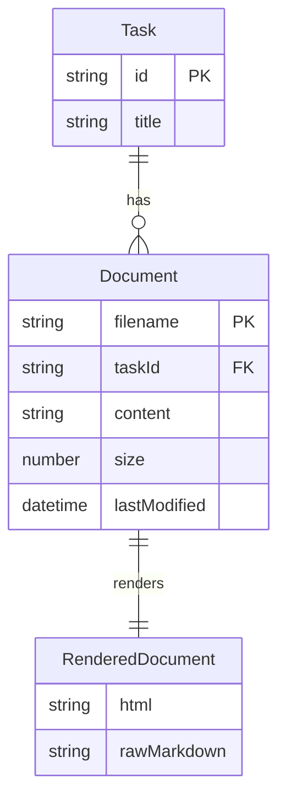
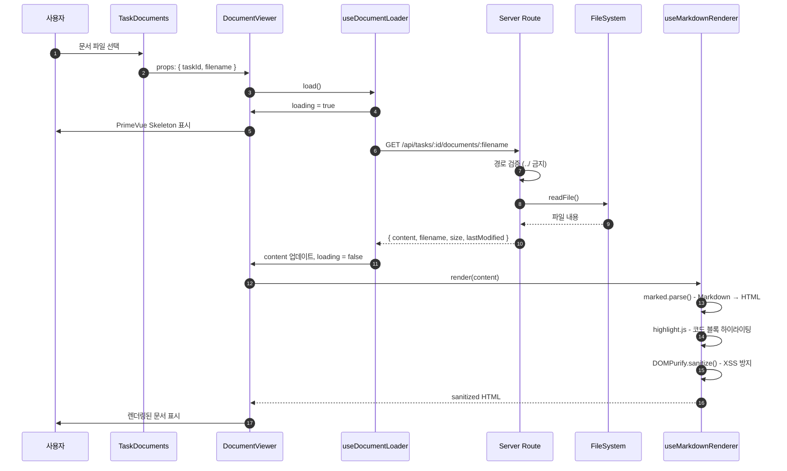
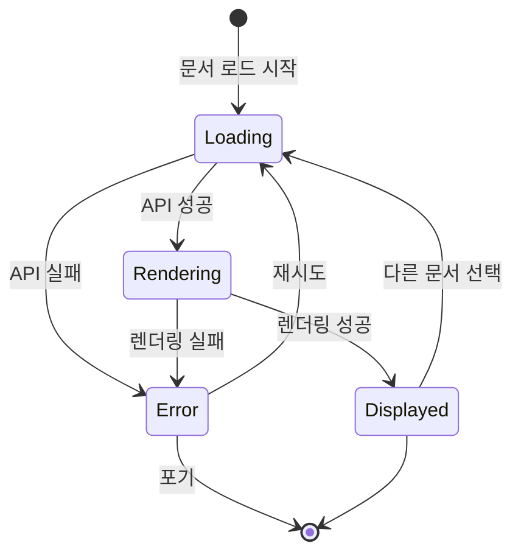

# 상세설계 (020-detail-design.md)

**Template Version:** 3.0.0 — **Last Updated:** 2025-12-15

> **설계 규칙**
> * *기능 중심 설계*에 집중한다.
> * 실제 소스코드(전체 또는 일부)는 **절대 포함하지 않는다**.
> * 작성 후 **상위 문서(PRD, TRD, 기본설계)와 비교**하여 차이가 있으면 **즉시 중단 → 차이 설명 → 지시 대기**.
> * **다이어그램 규칙**
>   * 프로세스: **Mermaid**만 사용
>   * UI 레이아웃: **Text Art(ASCII)** → 바로 아래 **SVG 개념도**를 순차 배치
>
> **분할 문서**
> * 요구사항 추적성: `025-traceability-matrix.md`
> * 테스트 명세: `026-test-specification.md`

---

## 0. 문서 메타데이터

| 항목 | 내용 |
|------|------|
| Task ID | TSK-05-04 |
| Task명 | Document Viewer |
| Category | development |
| 상태 | [dd] 상세설계 |
| 작성일 | 2025-12-15 |
| 작성자 | AI Agent |

### 상위 문서 참조

| 문서 유형 | 경로 | 참조 섹션 |
|----------|------|----------|
| PRD | `.orchay/projects/orchay/prd.md` | 섹션 8.1 (API 명세), 9.2 (컴포넌트 구조) |
| TRD | `.orchay/projects/orchay/trd.md` | 섹션 2.2 (UI 스택), 2.3 (PrimeVue 우선순위) |
| 기본설계 | `010-basic-design.md` | 전체 |
| 상위 Activity | ACT-05-01 | Detail Panel Components |
| 상위 Work Package | WP-05 | Task Detail Panel |

### 분할 문서 참조

| 문서 유형 | 파일명 | 목적 |
|----------|--------|------|
| 추적성 매트릭스 | `025-traceability-matrix.md` | 요구사항 ↔ 설계 ↔ 테스트 추적 |
| 테스트 명세 | `026-test-specification.md` | 테스트 시나리오, 데이터, data-testid |

---

## 1. 일관성 검증 결과

> 상위 문서와의 일관성 검증 결과를 기록합니다.

### 1.1 검증 요약

| 구분 | 통과 | 경고 | 실패 |
|------|------|------|------|
| PRD ↔ 기본설계 | 7개 | 0개 | 0개 |
| 기본설계 ↔ 상세설계 | 10개 | 0개 | 0개 |
| TRD ↔ 상세설계 | 5개 | 0개 | 0개 |

### 1.2 검증 상세

| 검증 ID | 검증 항목 | 결과 | 비고 |
|---------|----------|------|------|
| CHK-PRD-01 | 기능 요구사항 완전성 | ✅ PASS | FR-001~FR-007 모두 매핑 |
| CHK-PRD-02 | API 명세 일치성 | ✅ PASS | GET /api/tasks/:id/documents/:filename |
| CHK-PRD-03 | 용어 일관성 | ✅ PASS | Task, Document 용어 일치 |
| CHK-BD-01 | 기능 요구사항 완전성 | ✅ PASS | 7개 요구사항 구현 설계 완료 |
| CHK-BD-02 | 아키텍처 구조 일치 | ✅ PASS | Composables 기반 설계 유지 |
| CHK-BD-03 | 라이브러리 선택 일치 | ✅ PASS | marked, highlight.js, DOMPurify |
| CHK-TRD-01 | 기술 스택 준수 | ✅ PASS | Vue 3, Nuxt 3, PrimeVue 4.x |
| CHK-TRD-02 | PrimeVue 우선순위 준수 | ✅ PASS | Skeleton, Card 컴포넌트 사용 |
| CHK-TRD-03 | Dark Blue 테마 준수 | ✅ PASS | 색상 팔레트 일치 |

---

## 2. 목적 및 범위

### 2.1 목적

Task 상세 패널에서 Markdown 기반 개발 프로세스 문서(기본설계, 상세설계, 코드리뷰 등)를 렌더링하여 표시. LLM이 생성한 Markdown 문서를 즉시 확인할 수 있도록 가독성 높은 렌더링 환경 제공.

### 2.2 범위

**포함 범위**:
- Markdown 파싱 및 HTML 렌더링 (marked 라이브러리)
- 코드 블록 문법 하이라이팅 (highlight.js)
- GFM 확장 구문 지원 (테이블, 체크박스, 취소선)
- XSS 방지를 위한 HTML Sanitization (DOMPurify)
- DocumentViewer 컴포넌트 (로딩, 에러 상태 UI)
- useDocumentLoader Composable (API 호출, 캐싱)
- useMarkdownRenderer Composable (렌더링, sanitization)
- Server Route: GET /api/tasks/:id/documents/:filename

**제외 범위**:
- Mermaid 다이어그램 렌더링 → TSK-05-05 (2차)
- 문서 편집 기능 → TSK-05-06 (2차)
- PDF 내보내기 → 2차

---

## 3. 기술 스택

> TRD 기준, 이 Task에서 사용하는 기술만 명시

| 구분 | 기술 | 버전 | 용도 |
|------|------|------|------|
| Frontend | Vue 3 + Nuxt 3 | 3.5.x / 3.18.x | UI 렌더링 |
| UI Framework | PrimeVue | 4.x | Skeleton, Card 컴포넌트 |
| Styling | TailwindCSS | 3.4.x | 유틸리티 CSS |
| Markdown Parser | marked | 13.x | Markdown → HTML 변환 |
| Code Highlighter | highlight.js | 11.x | 코드 블록 하이라이팅 |
| HTML Sanitizer | DOMPurify | 3.x | XSS 방지 |
| Backend | Nuxt Server Routes | - | API 서버 |
| Data | 파일 시스템 | - | .orchay/projects/:id/tasks/:taskId/ |
| Testing | Vitest + Playwright | 2.x / 1.49.x | 단위 + E2E 테스트 |

---

## 4. 용어/가정/제약

### 4.1 용어 정의

| 용어 | 정의 |
|------|------|
| Document | Task 폴더 내 Markdown 파일 (010-basic-design.md, 020-detail-design.md 등) |
| Markdown Body | 렌더링된 HTML을 표시하는 컨테이너 영역 (markdown-body 클래스) |
| GFM | GitHub Flavored Markdown (테이블, 체크박스, 취소선 등 확장 구문) |
| Sanitization | XSS 공격 방지를 위한 HTML 정제 과정 |
| Code Block | 백틱 3개로 감싸인 코드 영역 (문법 하이라이팅 대상) |

### 4.2 가정 (Assumptions)

- Task 문서는 UTF-8 인코딩된 Markdown 파일
- 문서 파일 크기는 최대 1MB 이하
- 모든 문서 파일은 `.orchay/projects/:projectId/tasks/:taskId/` 경로에 위치
- 브라우저는 모던 브라우저 (ES2020 지원)
- 동시에 하나의 문서만 표시

### 4.3 제약 (Constraints)

- 로컬 파일 시스템 접근은 Server Routes를 통해서만 가능
- v-html 사용으로 인한 XSS 리스크 → DOMPurify 필수 적용
- 코드 하이라이팅 언어 팩은 번들 사이즈 고려하여 주요 언어만 포함
- Markdown 렌더링은 클라이언트 사이드에서만 수행
- 캐싱은 메모리 기반 (페이지 새로고침 시 초기화)

---

## 5. 시스템/모듈 구조

> **규칙**: 구현 코드가 아닌 **구조/역할/책임**만 표현

### 5.1 모듈 역할 및 책임

| 모듈 | 역할 | 책임 |
|------|------|------|
| **DocumentViewer.vue** | 문서 뷰어 컴포넌트 | Props 수신, 상태 관리, 레이아웃 구성, 이벤트 발행 |
| **useDocumentLoader** | 문서 로딩 Composable | API 호출, 캐싱, 에러 처리, 로딩 상태 관리 |
| **useMarkdownRenderer** | Markdown 렌더링 Composable | Markdown → HTML 변환, sanitization, 코드 하이라이팅 |
| **documentService** | 문서 서비스 유틸리티 | 파일 시스템 접근, 파일 읽기, 에러 처리 |
| **Server Route** | API 엔드포인트 | 파일 경로 검증, 파일 읽기, HTTP 응답 |

### 5.2 모듈 구조도 (개념)

```
components/task/
├── DocumentViewer.vue          # 컴포넌트
composables/
├── useDocumentLoader.ts        # 문서 로딩 로직
└── useMarkdownRenderer.ts      # 렌더링 로직
server/
├── api/tasks/[id]/documents/[filename].get.ts  # API Route
└── utils/
    └── documentService.ts      # 파일 서비스
assets/
└── styles/
    └── markdown.css            # Markdown 스타일
```

### 5.3 외부 의존성

| 의존성 | 유형 | 용도 |
|--------|------|------|
| marked | Library | Markdown 파싱 |
| highlight.js | Library | 코드 하이라이팅 |
| dompurify | Library | HTML Sanitization |
| fs/promises | Node.js API | 파일 읽기 (Server Side) |
| path | Node.js API | 파일 경로 처리 (Server Side) |

---

## 6. 데이터 모델 (개념 수준)

> **규칙**: 코드가 아닌 **개념 수준 ERD와 필드 정의**만 기술

### 6.1 엔티티 정의

#### Entity: DocumentContent

| 필드명 | 타입 | 필수 | 설명 | 제약조건 |
|--------|------|------|------|----------|
| content | String | Y | Markdown 원본 텍스트 | UTF-8, 최대 1MB |
| filename | String | Y | 파일명 | 패턴: `\d{3}-[\w-]+\.md` |
| size | Number | Y | 파일 크기 (bytes) | 양수 |
| lastModified | DateTime | Y | 최종 수정 시각 | ISO 8601 |

#### Entity: RenderedDocument

| 필드명 | 타입 | 필수 | 설명 | 제약조건 |
|--------|------|------|------|----------|
| html | String | Y | 렌더링된 HTML | Sanitized |
| rawMarkdown | String | Y | 원본 Markdown | - |
| toc | Array | N | 목차 (헤딩 목록) | 향후 확장 |

### 6.2 관계 다이어그램



---

## 7. 인터페이스 계약 (API Contract)

> **규칙**: TypeScript 코드가 아닌 **표 형태의 계약 정의**

### 7.1 엔드포인트 목록

| Method | Endpoint | 설명 | 요구사항 |
|--------|----------|------|----------|
| GET | /api/tasks/:id/documents/:filename | Task 문서 조회 | FR-004 |

### 7.2 API 상세: GET /api/tasks/:id/documents/:filename

**요구사항**: [FR-004]

#### 요청 (Request)

| 구분 | 파라미터 | 타입 | 필수 | 설명 | 기본값 |
|------|----------|------|------|------|--------|
| Path | id | string | Y | Task ID (예: TSK-05-04) | - |
| Path | filename | string | Y | 문서 파일명 (예: 010-basic-design.md) | - |

#### 응답 (Response)

**성공 응답 (200)**:

| 필드 | 타입 | 설명 |
|------|------|------|
| content | string | 파일 내용 (UTF-8 텍스트) |
| filename | string | 파일명 |
| size | number | 파일 크기 (bytes) |
| lastModified | string | 최종 수정 시각 (ISO 8601) |

**에러 응답**:

| 코드 | 에러 코드 | 설명 | 비즈니스 규칙 |
|------|----------|------|--------------|
| 400 | INVALID_FILENAME | 파일명 형식 오류 | 파일명은 `\d{3}-[\w-]+\.md` 패턴 |
| 404 | DOCUMENT_NOT_FOUND | 파일 없음 | 파일 시스템에 존재하지 않음 |
| 500 | FILE_READ_ERROR | 파일 읽기 실패 | 권한, 인코딩 문제 |

#### 유효성 검증

| 필드 | 규칙 | 에러 메시지 | 비즈니스 규칙 |
|------|------|------------|--------------|
| id | required, 패턴: TSK-\d{2}-\d{2} | 유효하지 않은 Task ID 형식입니다 | - |
| filename | required, 패턴: `\d{3}-[\w-]+\.md` | 유효하지 않은 파일명 형식입니다 | - |
| filename | 경로 탐색 금지 (../ 포함 불가) | 잘못된 파일 경로입니다 | 보안 규칙 |

---

## 8. 프로세스 흐름

### 8.1 프로세스 설명

> 각 단계에 관련 요구사항 태그 `[FR-XXX]` 병기

1. **문서 선택** [FR-004]: 사용자가 TaskDocuments 컴포넌트에서 문서 파일 선택
2. **Props 전달**: TaskDocuments → DocumentViewer로 taskId, filename 전달
3. **문서 로드** [FR-004]: useDocumentLoader가 GET /api/tasks/:id/documents/:filename 호출
4. **로딩 UI 표시** [FR-005]: API 응답 대기 중 PrimeVue Skeleton 표시
5. **Markdown 파싱** [FR-001]: useMarkdownRenderer가 marked로 Markdown → HTML 변환
6. **코드 하이라이팅** [FR-002]: highlight.js로 코드 블록 스타일 적용
7. **GFM 렌더링** [FR-003]: 테이블, 체크박스, 취소선 변환
8. **Sanitization** [FR-001]: DOMPurify로 XSS 방지 처리
9. **렌더링** [FR-001]: v-html로 DOM에 HTML 삽입
10. **에러 처리** [FR-006]: 실패 시 에러 메시지 표시

### 8.2 시퀀스 다이어그램



### 8.3 에러 처리 흐름



---

## 9. UI 설계

> **규칙**: Text Art(ASCII)로 영역 구성 → SVG 개념도로 시각 배치

### 9.1 화면 목록

| 화면 | 경로 | 목적 | 주요 기능 |
|------|------|------|----------|
| DocumentViewer | Task 상세 패널 내 | 문서 렌더링 표시 | 로딩, 에러, 렌더링 |

### 9.2 DocumentViewer 레이아웃

```
┌──────────────────────────────────────────────────────────────┐
│ DocumentViewer                                                │
├──────────────────────────────────────────────────────────────┤
│ 로딩 상태 (loading = true):                                  │
│ ┌────────────────────────────────────────────────────────┐  │
│ │ <Skeleton height="2rem" />                             │  │
│ │ <Skeleton height="1rem" class="mt-2" />                │  │
│ │ <Skeleton height="1rem" class="mt-2" />                │  │
│ │ <Skeleton height="300px" class="mt-4" />               │  │
│ └────────────────────────────────────────────────────────┘  │
├──────────────────────────────────────────────────────────────┤
│ 에러 상태 (error != null):                                   │
│ ┌────────────────────────────────────────────────────────┐  │
│ │ ⚠️ 문서를 불러올 수 없습니다                            │  │
│ │ [에러 메시지: DOCUMENT_NOT_FOUND]                       │  │
│ │ [재시도 버튼]                                           │  │
│ └────────────────────────────────────────────────────────┘  │
├──────────────────────────────────────────────────────────────┤
│ 정상 상태 (content 렌더링):                                  │
│ ┌────────────────────────────────────────────────────────┐  │
│ │ <div class="markdown-body" v-html="renderedHtml">      │  │
│ │   # 기본설계 (010-basic-design.md)                     │  │
│ │   ## 1. 목적 및 범위                                   │  │
│ │   ...                                                   │  │
│ │   ```typescript                                         │  │
│ │   // 코드 블록 (하이라이팅 적용)                        │  │
│ │   ```                                                   │  │
│ │ </div>                                                  │  │
│ └────────────────────────────────────────────────────────┘  │
└──────────────────────────────────────────────────────────────┘
```

### 9.3 컴포넌트 구조 (개념)

| 컴포넌트 | 역할 | Props (개념) | Events (개념) |
|----------|------|--------------|---------------|
| DocumentViewer | 문서 뷰어 | taskId: string, filename: string, maxHeight?: number | loaded: [content], error: [error] |
| (내부) Skeleton | 로딩 UI | height, class | - |
| (내부) ErrorDisplay | 에러 UI | error, onRetry | - |

### 9.4 상태 관리 (개념)

**Local State (DocumentViewer.vue)**

| 상태 | 타입 | 설명 |
|------|------|------|
| content | string \| null | Markdown 원본 |
| loading | boolean | 로딩 중 여부 |
| error | Error \| null | 에러 객체 |
| renderedHtml | string | 렌더링된 HTML (computed) |

**Composable State (useDocumentLoader)**

| 상태 | 타입 | 설명 |
|------|------|------|
| cache | Map<string, string> | 파일명 → 내용 캐시 |
| loadingMap | Map<string, boolean> | 파일명 → 로딩 상태 |

### 9.5 반응형/접근성 가이드

**반응형**:
- `≥ Desktop (1200px)`: 전체 너비, 스크롤 가능
- `Tablet (768px~1199px)`: 전체 너비, 폰트 크기 조정
- `Mobile (<768px)`: 전체 너비, 코드 블록 가로 스크롤

**접근성**:
- Semantic HTML: `<article>`, `<h1>`~`<h6>` 태그 사용
- Heading 구조: 올바른 계층 (h1 → h2 → h3)
- ARIA 라벨:
  - `aria-busy="true"` (로딩 중)
  - `role="alert"` (에러 메시지)
  - `aria-label="문서 내용"` (article)
- 키보드 탐색: Tab 키로 링크, 버튼 접근 가능
- 포커스 표시: 링크, 버튼에 명확한 포커스 스타일

---

## 10. 비즈니스 규칙 구현 명세

> 기본설계 BR-XXX 규칙의 구현 방안

| 규칙 ID | 규칙 설명 | 구현 위치(개념) | 구현 방식(개념) | 검증 방법 |
|---------|----------|-----------------|-----------------|-----------|
| BR-001 | 파일명 패턴 검증 | Server Route | 정규식 검증: `\d{3}-[\w-]+\.md` | 단위 테스트 (잘못된 파일명) |
| BR-002 | 경로 탐색 금지 | Server Route | `filename.includes('..')` 검증 | E2E 테스트 (../공격) |
| BR-003 | XSS 방지 | useMarkdownRenderer | DOMPurify.sanitize() 적용 | 단위 테스트 (악성 HTML) |
| BR-004 | 파일 크기 제한 | Server Route | 1MB 초과 시 에러 반환 | 단위 테스트 (대용량 파일) |

---

## 11. 오류/예외 처리

### 11.1 예상 오류 상황

| 오류 상황 | 오류 코드 | 사용자 메시지 | 복구 전략 |
|----------|----------|--------------|----------|
| 파일 없음 | DOCUMENT_NOT_FOUND | 요청한 문서를 찾을 수 없습니다 | 파일 목록 새로고침 제안 |
| 파일 읽기 실패 | FILE_READ_ERROR | 문서를 불러올 수 없습니다 | 재시도 버튼 제공 |
| 잘못된 파일명 | INVALID_FILENAME | 유효하지 않은 파일명입니다 | - |
| 경로 탐색 시도 | INVALID_PATH | 잘못된 파일 경로입니다 | - |
| 네트워크 오류 | NETWORK_ERROR | 네트워크 연결을 확인해주세요 | 재시도 버튼 제공 |
| 파싱 오류 | MARKDOWN_PARSE_ERROR | 문서 렌더링에 실패했습니다 | 원본 텍스트 표시 옵션 제공 |

### 11.2 경계 조건

| 조건 | 처리 방안 |
|------|----------|
| 빈 파일 (0 bytes) | 빈 상태 메시지 표시: "문서 내용이 없습니다" |
| 매우 큰 파일 (>1MB) | 서버에서 400 에러 반환, 메시지: "파일이 너무 큽니다 (최대 1MB)" |
| 잘못된 UTF-8 인코딩 | 서버에서 500 에러 반환, 메시지: "파일 인코딩 오류" |
| HTML만 포함 (Markdown 아님) | 정상 렌더링 (sanitization 후 표시) |
| 매우 많은 코드 블록 (>100개) | 성능 경고 로그, 정상 렌더링 |

---

## 12. Composables 상세 설계

### 12.1 useDocumentLoader

**책임**: API 호출, 캐싱, 에러 처리

**입력 파라미터**:

| 파라미터 | 타입 | 필수 | 설명 |
|---------|------|------|------|
| taskId | string | Y | Task ID (Ref 가능) |
| filename | string | Y | 파일명 (Ref 가능) |
| options.cache | boolean | N | 캐싱 활성화 (기본: true) |
| options.timeout | number | N | 타임아웃 (ms, 기본: 5000) |

**반환값**:

| 속성 | 타입 | 설명 |
|------|------|------|
| content | Ref<string \| null> | 파일 내용 |
| loading | Ref<boolean> | 로딩 상태 |
| error | Ref<Error \| null> | 에러 객체 |
| load | () => Promise<void> | 문서 로드 함수 |
| reload | () => Promise<void> | 강제 재로드 (캐시 무시) |

**동작 설명**:
1. taskId, filename 변경 감지 시 자동 로드
2. 캐시 활성화 시 메모리 캐시 확인
3. API 호출 (fetch with timeout)
4. 성공 시 캐시 저장, content 업데이트
5. 실패 시 error 업데이트

### 12.2 useMarkdownRenderer

**책임**: Markdown → HTML 변환, sanitization

**입력 파라미터**:

| 파라미터 | 타입 | 필수 | 설명 |
|---------|------|------|------|
| markdown | string \| Ref<string> | Y | Markdown 텍스트 |
| options.gfm | boolean | N | GFM 활성화 (기본: true) |
| options.highlight | boolean | N | 코드 하이라이팅 (기본: true) |
| options.sanitize | boolean | N | HTML sanitization (기본: true) |

**반환값**:

| 속성 | 타입 | 설명 |
|------|------|------|
| renderedHtml | ComputedRef<string> | 렌더링된 HTML |
| render | (md: string) => string | 수동 렌더링 함수 |

**동작 설명**:
1. markdown 변경 감지 시 자동 렌더링 (computed)
2. marked.parse() 호출 (GFM 옵션)
3. highlight.js로 코드 블록 처리
4. DOMPurify.sanitize() 적용
5. 렌더링된 HTML 반환

### 12.3 marked 설정 상세

**Renderer 커스터마이징**:

| 요소 | 설정 | 목적 |
|------|------|------|
| heading | id 속성 추가 | 앵커 링크 지원 (향후 목차) |
| link | target="_blank", rel="noopener" | 외부 링크 보안 |
| code | highlight.js 적용 | 코드 하이라이팅 |
| table | PrimeVue 스타일 클래스 | 테마 일관성 |

**Extensions**:

| 확장 | 설정 | 목적 |
|------|------|------|
| gfm | true | 테이블, 취소선, 체크박스 |
| breaks | true | 줄바꿈 자동 변환 |
| pedantic | false | 엄격한 Markdown 해제 |
| smartypants | false | 스마트 인용부호 비활성화 |

### 12.4 highlight.js 설정 상세

**언어 팩 선택**:

| 언어 | 용도 | 우선순위 |
|------|------|---------|
| typescript | TypeScript 코드 | High |
| javascript | JavaScript 코드 | High |
| vue | Vue SFC | High |
| bash | 쉘 스크립트 | Medium |
| json | JSON 데이터 | Medium |
| markdown | Markdown 예시 | Low |
| yaml | 설정 파일 | Low |
| sql | SQL 쿼리 | Low |

**테마 커스터마이징**:

| CSS 변수 | 값 | 설명 |
|----------|-----|------|
| --hljs-bg | #0f0f23 | 코드 블록 배경색 (TRD Dark Blue) |
| --hljs-keyword | #c678dd | 키워드 색상 (보라) |
| --hljs-string | #98c379 | 문자열 색상 (초록) |
| --hljs-function | #61afef | 함수 색상 (파랑) |
| --hljs-comment | #5c6370 | 주석 색상 (회색) |

### 12.5 DOMPurify 설정 상세

**허용 태그**:

```
h1, h2, h3, h4, h5, h6, p, div, span, a, ul, ol, li,
code, pre, blockquote, table, thead, tbody, tr, th, td,
strong, em, del, input[type="checkbox"]
```

**허용 속성**:

```
href, id, class, alt, title,
type (input만), checked (input만),
data-* (모든 태그)
```

**금지 태그**:

```
script, iframe, object, embed, style, link
```

**URL 스키마 제한**:

```
허용: http:, https:, mailto:
금지: javascript:, data:, vbscript:
```

---

## 13. 스타일링 상세 설계

### 13.1 Markdown CSS 클래스 (.markdown-body)

**타이포그래피**:

| 요소 | 스타일 | 값 |
|------|--------|-----|
| h1 | font-size, color, margin | 2rem, #e0e0e0, 1.5rem 0 1rem |
| h2 | font-size, color, margin | 1.5rem, #e0e0e0, 1.2rem 0 0.8rem |
| h3 | font-size, color, margin | 1.25rem, #e0e0e0, 1rem 0 0.6rem |
| p | font-size, color, line-height | 1rem, #b0b0b0, 1.6 |
| a | color, text-decoration | #6c9bcf, underline |
| code | background, color, padding | #16213e, #9cdcfe, 0.2em 0.4em |

**코드 블록**:

| 속성 | 값 | 설명 |
|------|-----|------|
| background | #0f0f23 | TRD Dark Blue |
| border | 1px solid #2a2a4e | 경계선 |
| border-radius | 4px | 둥근 모서리 |
| padding | 1rem | 내부 여백 |
| overflow-x | auto | 가로 스크롤 |
| font-family | 'Fira Code', monospace | 코드 폰트 |

**테이블**:

| 속성 | 값 | 설명 |
|------|-----|------|
| border-collapse | collapse | 테두리 병합 |
| width | 100% | 전체 너비 |
| th background | #16213e | 헤더 배경 |
| th color | #e0e0e0 | 헤더 텍스트 |
| td border | 1px solid #2a2a4e | 셀 경계선 |
| td padding | 0.5rem 1rem | 셀 내부 여백 |

**체크박스**:

| 속성 | 값 | 설명 |
|------|-----|------|
| input[type="checkbox"] | pointer-events: none | 비활성화 (표시 전용) |
| checked | accent-color: #6c9bcf | 체크 색상 |

### 13.2 Dark Blue 테마 색상 팔레트

| 용도 | CSS 변수 | 값 | 설명 |
|------|----------|-----|------|
| 배경 (주) | --md-bg-primary | #0f0f23 | 코드 블록, 어두운 영역 |
| 배경 (부) | --md-bg-secondary | #16213e | 헤더, 테이블 헤더 |
| 경계선 | --md-border | #2a2a4e | 테두리 색상 |
| 텍스트 (주) | --md-text-primary | #e0e0e0 | 제목, 중요 텍스트 |
| 텍스트 (부) | --md-text-secondary | #b0b0b0 | 본문 텍스트 |
| 링크 | --md-link | #6c9bcf | 링크 색상 |
| 코드 텍스트 | --md-code-text | #9cdcfe | 인라인 코드 |

---

## 14. 구현 체크리스트

### Backend
- [ ] Server Route 구현 (GET /api/tasks/:id/documents/:filename)
- [ ] documentService 구현 (파일 읽기)
- [ ] 파일명 검증 로직 (정규식, 경로 탐색 금지)
- [ ] 파일 크기 제한 검증 (1MB)
- [ ] 에러 응답 처리 (404, 400, 500)
- [ ] 단위 테스트 (documentService)

### Frontend - Composables
- [ ] useDocumentLoader 구현
- [ ] useMarkdownRenderer 구현
- [ ] marked 설정 (GFM, renderer 커스터마이징)
- [ ] highlight.js 설정 (언어 팩, 테마)
- [ ] DOMPurify 설정 (allowedTags, allowedAttributes)
- [ ] 캐싱 로직
- [ ] 타임아웃 처리
- [ ] 단위 테스트 (Composables)

### Frontend - Components
- [ ] DocumentViewer.vue 구현
- [ ] Props 정의 (taskId, filename, maxHeight)
- [ ] Emits 정의 (loaded, error)
- [ ] 로딩 상태 UI (PrimeVue Skeleton)
- [ ] 에러 상태 UI (재시도 버튼)
- [ ] 렌더링 영역 (v-html)
- [ ] 반응형 레이아웃
- [ ] 접근성 속성 (ARIA)
- [ ] E2E 테스트

### Styling
- [ ] markdown.css 작성 (.markdown-body 클래스)
- [ ] 타이포그래피 스타일
- [ ] 코드 블록 스타일
- [ ] 테이블 스타일
- [ ] highlight.js 테마 커스터마이징
- [ ] Dark Blue 테마 색상 적용

### 품질
- [ ] 요구사항 추적성 검증 완료 (`025-traceability-matrix.md`)
- [ ] 테스트 명세 작성 완료 (`026-test-specification.md`)
- [ ] 비즈니스 규칙 구현 완료 (BR-001~BR-004)
- [ ] 일관성 검증 통과 (PRD, TRD, 기본설계)
- [ ] XSS 방지 검증 (악성 HTML 테스트)
- [ ] 성능 검증 (10KB 문서 < 100ms)

---

## 15. 다음 단계

- `/wf:review` 명령어로 설계리뷰 진행

---

## 관련 문서

- 기본설계: `010-basic-design.md`
- 추적성 매트릭스: `025-traceability-matrix.md`
- 테스트 명세: `026-test-specification.md`
- PRD: `.orchay/projects/orchay/prd.md`
- TRD: `.orchay/projects/orchay/trd.md`

---

<!--
author: AI Agent (Claude Opus 4.5)
Template Version: 3.0.0
Created: 2025-12-15
-->
