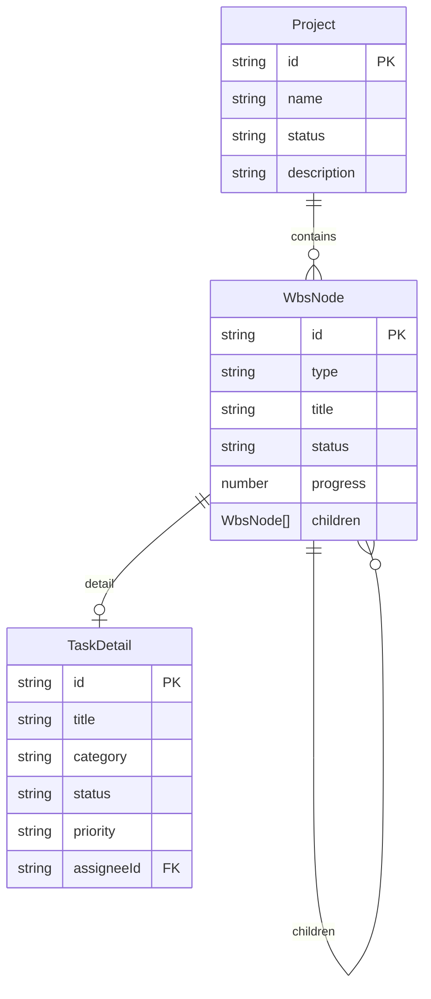
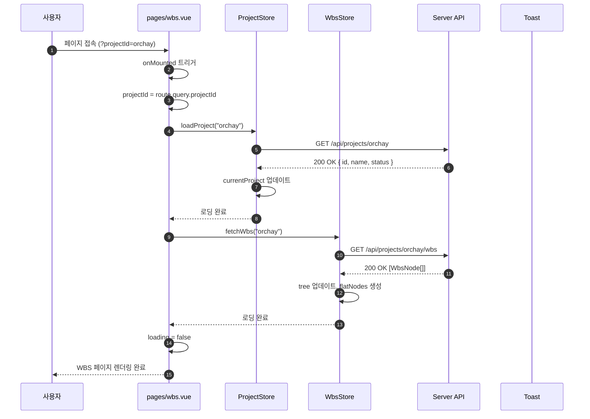
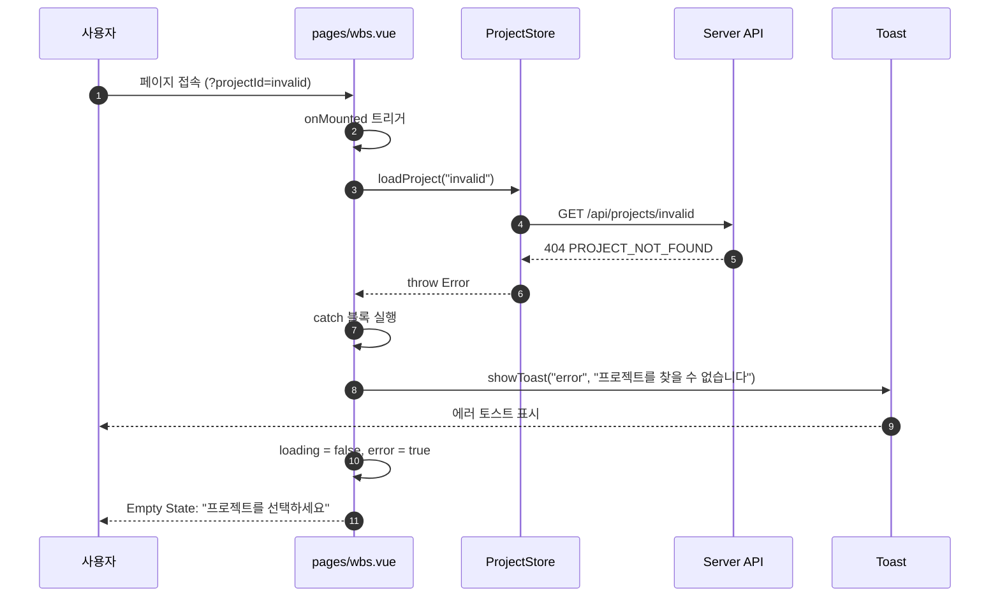
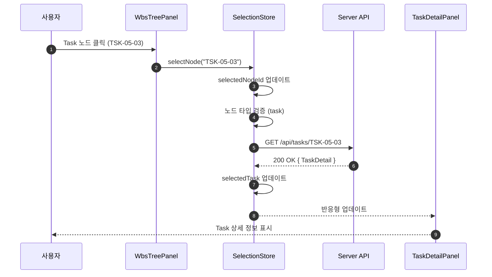
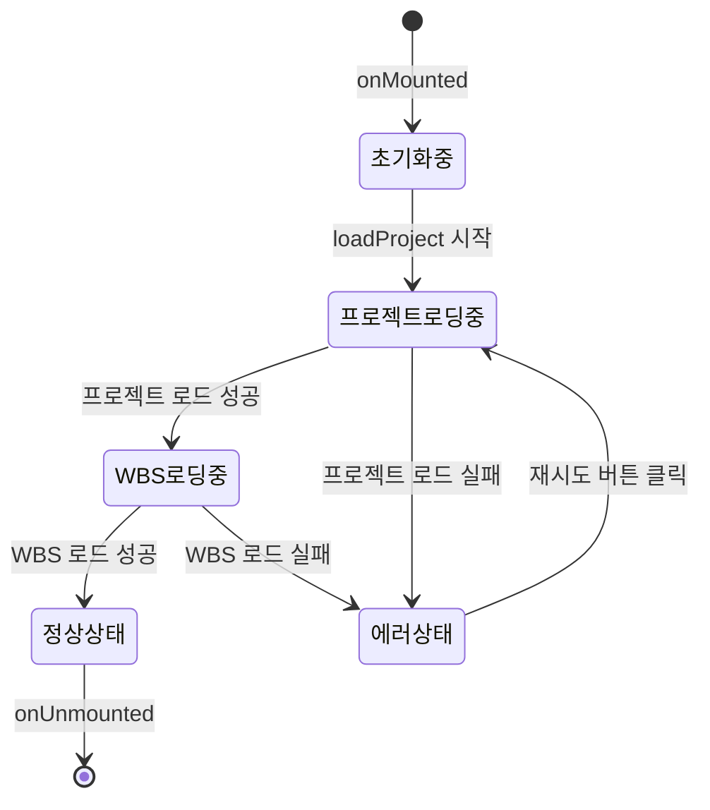
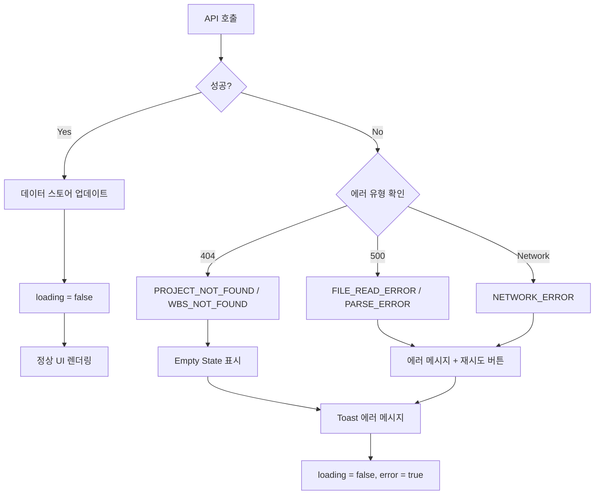

# 상세설계 (020-detail-design.md)

**Template Version:** 3.0.0 — **Last Updated:** 2025-12-15

> **설계 규칙**
> * *기능 중심 설계*에 집중한다.
> * 실제 소스코드(전체 또는 일부)는 **절대 포함하지 않는다**.
> * 작성 후 **상위 문서(PRD, TRD, 기본설계)와 비교**하여 차이가 있으면 **즉시 중단 → 차이 설명 → 지시 대기**.
> * **다이어그램 규칙**
>   * 프로세스: **Mermaid**만 사용
>   * UI 레이아웃: **Text Art(ASCII)** → 바로 아래 **SVG 개념도**를 순차 배치
>
> **분할 문서**
> * 요구사항 추적성: `025-traceability-matrix.md`
> * 테스트 명세: `026-test-specification.md`

---
 
## 0. 문서 메타데이터

| 항목 | 내용 |
|------|------|
| Task ID | TSK-06-01 |
| Task명 | Integration |
| Category | development |
| 상태 | [dd] 상세설계 |
| 작성일 | 2025-12-15 |
| 작성자 | System Architect |

### 상위 문서 참조

| 문서 유형 | 경로 | 참조 섹션 |
|----------|------|----------|
| PRD | `.orchay/projects/orchay/prd.md` | 섹션 6.2, 6.3, 9.1, 9.3, 11 |
| TRD | `.orchay/projects/orchay/trd.md` | 전체 |
| 기본설계 | `010-basic-design.md` | 전체 |
| 상위 Activity | ACT-06: Integration & Polish | - |
| 상위 Work Package | WP-06: Integration & Polish | - |

### 분할 문서 참조

| 문서 유형 | 파일명 | 목적 |
|----------|--------|------|
| 추적성 매트릭스 | `025-traceability-matrix.md` | 요구사항 ↔ 설계 ↔ 테스트 추적 |
| 테스트 명세 | `026-test-specification.md` | 테스트 시나리오, 데이터, data-testid |

---

## 1. 일관성 검증 결과

> 상위 문서와의 일관성 검증 결과를 기록합니다.

### 1.1 검증 요약

| 구분 | 통과 | 경고 | 실패 |
|------|------|------|------|
| PRD ↔ 기본설계 | 10개 | 0개 | 0개 |
| 기본설계 ↔ 상세설계 | 18개 | 0개 | 0개 |
| TRD ↔ 상세설계 | 6개 | 0개 | 0개 |

### 1.2 검증 상세

| 검증 ID | 검증 항목 | 결과 | 비고 |
|---------|----------|------|------|
| CHK-PRD-01 | 기능 요구사항 완전성 (FR-001~FR-010) | ✅ PASS | 모든 PRD 요구사항 매핑 완료 |
| CHK-PRD-02 | 비즈니스 규칙 일치성 | ✅ PASS | 상태 관리 패턴, 에러 핸들링 전략 일치 |
| CHK-PRD-03 | 용어 일관성 | ✅ PASS | Project, WBS, Task, 워크플로우 용어 통일 |
| CHK-BD-01 | 기능 요구사항 완전성 | ✅ PASS | 기본설계 FR-001~FR-010 모두 구현 |
| CHK-BD-02 | 비즈니스 규칙 구현 명세 | ✅ PASS | Empty State, Toast 메시지, 로딩 전략 |
| CHK-BD-03 | 데이터 모델 일치성 | ✅ PASS | Project, WbsNode, TaskDetail 타입 일치 |
| CHK-BD-04 | API 인터페이스 일치성 | ✅ PASS | GET /api/projects/:id, GET /api/projects/:id/wbs |
| CHK-BD-05 | 컴포넌트 구조 일치성 | ✅ PASS | WbsTreePanel, TaskDetailPanel 통합 패턴 |
| CHK-TRD-01 | 기술 스택 준수 | ✅ PASS | Nuxt 3, Vue 3, PrimeVue 4.x, Pinia, TypeScript |
| CHK-TRD-02 | 아키텍처 패턴 준수 | ✅ PASS | Composition API, Pinia 상태 관리, Server Routes |

---

## 2. 목적 및 범위

### 2.1 목적

WBS 페이지의 완전한 통합을 구현하여 프로젝트 로딩, WBS 트리 표시, Task 상세 패널 연동, 에러 핸들링, 로딩 상태 관리를 완성한다. 3개의 Pinia 스토어(project, wbs, selection)를 중앙에서 조율하고, 사용자에게 일관되고 안정적인 경험을 제공한다.

**핵심 가치**:
- 통합된 페이지 컨트롤러로 스토어 간 상태 조율
- 명확한 에러 피드백과 복구 옵션 제공
- 로딩/빈 상태의 직관적인 사용자 경험
- 반응형 상태 연동으로 일관된 데이터 표시

### 2.2 범위

**포함 범위** (기본설계 구현 범위의 기술적 구현 사항):
- pages/wbs.vue 상세 설계 (Vue SFC 구조)
- useWbsPage composable 상세 설계 (라이프사이클 관리)
- 스토어 연동 상세 (watch, computed 패턴)
- 에러 핸들링 상세 (Toast, Empty State, 재시도)
- 로딩 상태 UI 상세 (ProgressSpinner, Skeleton)
- PrimeVue Toast 통합
- 키보드 접근성 (Tab, Escape)

**제외 범위** (다른 Task에서 구현):
- WbsTreePanel 내부 구현 → TSK-04-03 (Tree Interaction)
- TaskDetailPanel 내부 구현 → TSK-05-03 (Detail Actions)
- API 엔드포인트 구현 → TSK-03-01, TSK-03-02 (Backend API)
- 워크플로우 엔진 → TSK-03-04 (Workflow Engine)

---

## 3. 기술 스택

> TRD 기준, 이 Task에서 사용하는 기술만 명시

| 구분 | 기술 | 버전 | 용도 |
|------|------|------|------|
| Frontend | Vue 3 + Nuxt 3 | 3.5.x / 3.18.x | UI 렌더링, Composition API, 라이프사이클 |
| UI Framework | PrimeVue | 4.x | ProgressSpinner, Skeleton, Toast, Message |
| Styling | TailwindCSS | 3.4.x | 레이아웃, 간격, 반응형 |
| 상태 관리 | Pinia | 2.x | useProjectStore, useWbsStore, useSelectionStore |
| Type System | TypeScript | 5.x | Props, Emits, 타입 안정성 |
| Routing | Vue Router | 4.x | useRoute, useRouter, 쿼리 파라미터 |
| API | Nuxt Server Routes | - | $fetch, GET 엔드포인트 |
| Testing | Vitest + Playwright | 2.x / 1.49.x | 단위 테스트, E2E 테스트 |

---

## 4. 용어/가정/제약

### 4.1 용어 정의

| 용어 | 정의 |
|------|------|
| 페이지 컨트롤러 | pages/wbs.vue가 수행하는 중앙 조율 역할 (스토어 로딩 순서, 에러 핸들링) |
| Empty State | 데이터가 없거나 조건이 충족되지 않을 때 표시하는 안내 UI |
| 순차 로딩 | 프로젝트 → WBS → Task 순서로 데이터를 단계적으로 로드하는 전략 |
| 반응형 상태 연동 | watch를 통해 스토어 간 상태 변화를 자동으로 감지하고 동기화 |
| 재시도 메커니즘 | 에러 발생 시 사용자가 동일 작업을 다시 시도할 수 있는 기능 |

### 4.2 가정 (Assumptions)

- URL 쿼리 파라미터 projectId는 항상 유효한 프로젝트 ID
- Pinia 스토어들은 이미 구현되어 있으며 API 호출 메서드 제공
- PrimeVue Toast는 AppLayout에서 전역으로 설정되어 있음
- WbsTreePanel과 TaskDetailPanel 컴포넌트는 완성되어 있음
- API 응답 시간 목표: < 1초 (프로젝트 로딩), < 500ms (WBS 로딩)

### 4.3 제약 (Constraints)

- 단일 사용자 환경으로 동시 편집 충돌 처리 불필요
- 페이지 새로고침 시 모든 상태는 URL 쿼리에서 재구성
- 최소 화면 너비: 1200px (반응형 지원 범위)
- 브라우저 뒤로가기 시 페이지 상태 초기화 (라우팅 단순화)

---

## 5. 시스템/모듈 구조

> **규칙**: 구현 코드가 아닌 **구조/역할/책임**만 표현

### 5.1 모듈 역할 및 책임

| 모듈 | 역할 | 책임 |
|------|------|------|
| pages/wbs.vue | 페이지 컨트롤러 | - URL 쿼리 파싱<br>- 프로젝트/WBS 순차 로딩<br>- 에러 핸들링 중앙화<br>- Toast 메시지 표시<br>- 라이프사이클 관리 (onMounted, onUnmounted)<br>- 패널 레이아웃 렌더링 |
| composables/useWbsPage.ts | 페이지 로직 추출 | - 로딩 상태 관리<br>- 에러 상태 관리<br>- 프로젝트/WBS 로딩 함수<br>- 재시도 로직<br>- Toast 유틸리티 |
| WbsTreePanel | 좌측 패널 (60%) | - WBS 트리 렌더링<br>- 검색/필터링<br>- 펼침/접기 상태 |
| TaskDetailPanel | 우측 패널 (40%) | - Task 상세 정보 표시<br>- 인라인 편집<br>- 상태 전이 |
| useProjectStore | 프로젝트 상태 관리 | - currentProject 제공<br>- loadProject(id) 액션 |
| useWbsStore | WBS 상태 관리 | - tree, filteredTree 제공<br>- fetchWbs(projectId) 액션 |
| useSelectionStore | 선택 상태 관리 | - selectedNodeId, selectedTask 제공<br>- selectNode(id) 액션 |
| PrimeVue Toast | 알림 시스템 | - 성공/에러/경고 메시지<br>- 자동 사라짐 (3초) |

### 5.2 모듈 구조도 (개념)

```
app/
├── pages/
│   └── wbs.vue (페이지 컨트롤러) ★
│       ├── URL 쿼리 파싱
│       ├── onMounted: 순차 로딩
│       ├── onUnmounted: 상태 초기화
│       ├── watch: 스토어 간 연동
│       └── 템플릿: 패널 레이아웃
│
├── composables/
│   └── useWbsPage.ts (페이지 로직) ★
│       ├── state: loading, error
│       ├── loadProjectAndWbs()
│       ├── handleError()
│       └── showToast()
│
├── components/
│   ├── wbs/
│   │   └── WbsTreePanel.vue (좌측 패널)
│   └── tasks/
│       └── TaskDetailPanel.vue (우측 패널)
│
└── stores/
    ├── project.ts (프로젝트 스토어)
    ├── wbs.ts (WBS 스토어)
    └── selection.ts (선택 스토어)
```

### 5.3 외부 의존성

| 의존성 | 유형 | 용도 |
|--------|------|------|
| PrimeVue ProgressSpinner | Library | 로딩 스피너 표시 |
| PrimeVue Skeleton | Library | 스켈레톤 UI (긴 로딩) |
| PrimeVue Toast | Library | 알림 메시지 표시 |
| PrimeVue Message | Library | 에러 메시지 인라인 표시 |
| PrimeVue Button | Library | 재시도 버튼 |
| LayoutAppLayout | Component | 페이지 레이아웃 컨테이너 |
| LayoutAppHeader | Component | 헤더 표시 (프로젝트명) |
| useRoute | Composable | URL 쿼리 파라미터 접근 |
| useRouter | Composable | 라우팅 제어 |
| useToast | Composable | PrimeVue Toast 래퍼 |
| storeToRefs | Pinia Utility | 반응형 스토어 참조 |

---

## 6. 데이터 모델 (개념 수준)

> **규칙**: 코드가 아닌 **개념 수준 필드 정의**만 기술

### 6.1 엔티티 정의

#### Entity: Project

| 필드명 | 타입 | 필수 | 설명 | 제약조건 |
|--------|------|------|------|----------|
| id | String | Y | 프로젝트 ID | PK, 소문자 케밥케이스 |
| name | String | Y | 프로젝트 이름 | 1-100자 |
| status | String | Y | 프로젝트 상태 | active/archived/planning |
| description | String | N | 프로젝트 설명 | 최대 500자 |

#### Entity: WbsNode

| 필드명 | 타입 | 필수 | 설명 | 제약조건 |
|--------|------|------|------|----------|
| id | String | Y | 노드 ID | PK, WP-XX/ACT-XX-XX/TSK-XX-XX 형식 |
| type | Enum | Y | 노드 타입 | project/wp/act/task |
| title | String | Y | 노드 제목 | 1-200자 |
| status | String | Y | 현재 상태 | [ ]/[bd]/[dd]/[im]/[vf]/[xx] |
| progress | Number | N | 진행률 | 0-100 |
| children | WbsNode[] | N | 자식 노드 | 계층 구조 |

#### Entity: TaskDetail

| 필드명 | 타입 | 필수 | 설명 | 제약조건 |
|--------|------|------|------|----------|
| id | String | Y | Task ID | PK, TSK-XX-XX 형식 |
| title | String | Y | Task 제목 | 1-200자 |
| category | Enum | Y | 카테고리 | development/defect/infrastructure |
| status | String | Y | 현재 상태 | [ ]/[bd]/[dd]/[im]/[vf]/[xx] |
| priority | Enum | Y | 우선순위 | critical/high/medium/low |
| assignee | TeamMember? | N | 담당자 | FK to TeamMember |

### 6.2 관계 다이어그램



### 6.3 인덱스 및 제약조건

| 엔티티 | 인덱스/제약 | 필드 | 목적 |
|--------|------------|------|------|
| Project | PK | id | 고유 식별 |
| WbsNode | PK | id | 고유 식별 |
| TaskDetail | PK | id | 고유 식별 |

---

## 7. 인터페이스 계약 (API Contract)

> **규칙**: TypeScript 코드가 아닌 **표 형태의 계약 정의**

### 7.1 엔드포인트 목록

| Method | Endpoint | 설명 | 요구사항 |
|--------|----------|------|----------|
| GET | /api/projects/:id | 프로젝트 정보 조회 | FR-001 |
| GET | /api/projects/:id/wbs | WBS 트리 데이터 조회 | FR-002 |

### 7.2 API 상세: GET /api/projects/:id (프로젝트 조회)

**요구사항**: FR-001 (프로젝트 로드)

#### 요청 (Request)

| 구분 | 파라미터 | 타입 | 필수 | 설명 | 기본값 |
|------|----------|------|------|------|--------|
| Path | id | string | Y | 프로젝트 ID | - |

**요청 예시**:
```http
GET /api/projects/orchay
```

#### 응답 (Response)

**성공 응답 (200)**:

| 필드 | 타입 | 설명 |
|------|------|------|
| id | string | 프로젝트 ID |
| name | string | 프로젝트 이름 |
| status | string | 프로젝트 상태 |
| description | string | 프로젝트 설명 |

**응답 예시**:
```json
{
  "id": "orchay",
  "name": "ORCHAY Project Manager",
  "status": "active",
  "description": "AI 기반 프로젝트 관리 도구"
}
```

**에러 응답**:

| 코드 | 에러 코드 | 설명 | 비즈니스 규칙 |
|------|----------|------|--------------|
| 404 | PROJECT_NOT_FOUND | 프로젝트 ID에 해당하는 프로젝트 없음 | - |
| 500 | FILE_READ_ERROR | project.json 파일 읽기 실패 | - |

### 7.3 API 상세: GET /api/projects/:id/wbs (WBS 조회)

**요구사항**: FR-002 (WBS 데이터 조회)

#### 요청 (Request)

| 구분 | 파라미터 | 타입 | 필수 | 설명 | 기본값 |
|------|----------|------|------|------|--------|
| Path | id | string | Y | 프로젝트 ID | - |

**요청 예시**:
```http
GET /api/projects/orchay/wbs
```

#### 응답 (Response)

**성공 응답 (200)**:

| 필드 | 타입 | 설명 |
|------|------|------|
| (root) | WbsNode[] | WBS 트리 노드 배열 |

**응답 예시**:
```json
[
  {
    "id": "WP-01",
    "type": "wp",
    "title": "Setup & Infrastructure",
    "status": "[xx]",
    "progress": 100,
    "children": [
      {
        "id": "TSK-01-01",
        "type": "task",
        "title": "프로젝트 초기화",
        "status": "[xx]",
        "progress": 100,
        "children": []
      }
    ]
  }
]
```

**에러 응답**:

| 코드 | 에러 코드 | 설명 | 비즈니스 규칙 |
|------|----------|------|--------------|
| 404 | WBS_NOT_FOUND | wbs.md 파일이 존재하지 않음 | - |
| 500 | FILE_READ_ERROR | wbs.md 파일 읽기 실패 | - |
| 500 | PARSE_ERROR | wbs.md 파싱 실패 (형식 오류) | - |

---

## 8. 프로세스 흐름

### 8.1 프로세스 설명

> 각 단계에 관련 요구사항 태그 `[FR-XXX]` 병기

#### 프로세스 1: 페이지 초기화 흐름

1. **URL 쿼리 파싱** [FR-001]: useRoute()로 projectId 추출
2. **프로젝트 로딩** [FR-001]: projectStore.loadProject(projectId) 호출
3. **로딩 스피너 표시** [FR-004]: loading = true, ProgressSpinner 렌더링
4. **프로젝트 로드 성공** [FR-002]: WBS 로딩 트리거
5. **WBS 데이터 조회** [FR-002]: wbsStore.fetchWbs(projectId) 호출
6. **WBS 로드 성공**: WbsTreePanel 렌더링
7. **로딩 완료**: loading = false, 정상 상태 표시

#### 프로세스 2: 에러 핸들링 흐름

1. **에러 발생** [FR-005]: API 호출 실패 (404, 500 등)
2. **에러 캐치**: try-catch 블록에서 에러 객체 캡처
3. **에러 분류**: 에러 코드에 따라 메시지 결정
4. **Toast 표시** [FR-005]: severity="error", 에러 메시지 표시
5. **Empty State 표시**: 에러 유형에 따라 적절한 Empty State 렌더링
6. **재시도 옵션**: 재시도 버튼 제공 (네트워크 오류, 서버 오류)

#### 프로세스 3: 노드 선택 연동 흐름

1. **노드 선택** [FR-003]: WbsTreePanel에서 node-selected 이벤트 발생
2. **선택 스토어 업데이트** [FR-003]: selectionStore.selectNode(nodeId) 호출
3. **Task 타입 확인**: selectedNodeType이 'task'인지 검증
4. **Task 상세 로드** [FR-003]: selectionStore.loadTaskDetail(taskId) 호출
5. **TaskDetailPanel 업데이트** [FR-003]: selectedTask 반응형 업데이트
6. **로딩 상태 표시**: loadingTask = true, 우측 패널 스피너 표시
7. **상세 로드 완료**: TaskDetailPanel 전체 정보 렌더링

#### 프로세스 4: 페이지 언마운트 흐름

1. **언마운트 트리거** [FR-009]: 사용자가 다른 페이지로 이동
2. **상태 초기화 1**: wbsStore.clearWbs() 호출
3. **상태 초기화 2**: selectionStore.clearSelection() 호출
4. **상태 초기화 3**: projectStore.clearProject() 호출 (선택적)
5. **메모리 정리**: watch, computed 자동 정리 (Vue 라이프사이클)

### 8.2 시퀀스 다이어그램

#### 페이지 초기화 성공 시나리오



#### 프로젝트 로딩 실패 시나리오



#### 노드 선택 → Task 상세 로드 시나리오



### 8.3 상태 다이어그램 (페이지 로딩)



---

## 9. UI 설계

> **규칙**: Text Art(ASCII)로 영역 구성 → 개념 설명

### 9.1 화면 목록

| 화면 | 경로 | 목적 | 주요 기능 |
|------|------|------|----------|
| WBS 페이지 | /wbs?projectId=xxx | WBS 트리 및 Task 상세 통합 페이지 | 프로젝트 로딩, 트리 표시, 상세 패널 연동 |

### 9.2 WBS 페이지 레이아웃

#### 정상 상태 (WBS 데이터 로드 완료)

```
┌────────────────────────────────────────────────────────────────┐
│ AppHeader: ORCHAY Project Manager                              │
├────────────────────────────────────────────────────────────────┤
│                                                                 │
│  ┌───────────────────────┬───────────────────────────────────┐ │
│  │ WbsTreePanel (60%)    │ TaskDetailPanel (40%)             │ │
│  │                       │                                    │ │
│  │ - 검색 박스           │ - 기본 정보                        │ │
│  │ - 요약 카드           │ - 진행 상태                        │ │
│  │ - 펼치기/접기 버튼    │ - 워크플로우                       │ │
│  │ - WBS 트리 노드       │ - 문서 링크                        │ │
│  │   └ WP-01             │ - 작업 버튼                        │ │
│  │     └ TSK-01-01       │                                    │ │
│  │                       │                                    │ │
│  └───────────────────────┴───────────────────────────────────┘ │
│                                                                 │
└────────────────────────────────────────────────────────────────┘
```

#### 로딩 상태

```
┌────────────────────────────────────────────────────────────────┐
│ AppHeader: ORCHAY Project Manager                              │
├────────────────────────────────────────────────────────────────┤
│                                                                 │
│                         [ProgressSpinner]                       │
│                         로딩 중입니다...                        │
│                                                                 │
└────────────────────────────────────────────────────────────────┘
```

#### Empty State: 프로젝트 없음

```
┌────────────────────────────────────────────────────────────────┐
│ AppHeader: -                                                    │
├────────────────────────────────────────────────────────────────┤
│                                                                 │
│                         [📁 아이콘]                            │
│                    프로젝트를 선택하세요                        │
│                  [대시보드로 이동] 버튼                         │
│                                                                 │
└────────────────────────────────────────────────────────────────┘
```

#### Empty State: WBS 데이터 없음

```
┌────────────────────────────────────────────────────────────────┐
│ AppHeader: ORCHAY Project Manager                              │
├────────────────────────────────────────────────────────────────┤
│                                                                 │
│  ┌───────────────────────┬───────────────────────────────────┐ │
│  │ [📦 아이콘]           │ TaskDetailPanel (40%)             │ │
│  │ WBS 데이터가 없습니다 │                                    │ │
│  │ [WBS 생성] 버튼       │ (Task 미선택 상태)                 │ │
│  └───────────────────────┴───────────────────────────────────┘ │
│                                                                 │
└────────────────────────────────────────────────────────────────┘
```

#### 에러 상태

```
┌────────────────────────────────────────────────────────────────┐
│ AppHeader: ORCHAY Project Manager                              │
├────────────────────────────────────────────────────────────────┤
│                                                                 │
│                    [⚠️ Message 컴포넌트]                       │
│              프로젝트 로드에 실패했습니다.                      │
│                     [재시도] 버튼                              │
│                                                                 │
└────────────────────────────────────────────────────────────────┘
```

### 9.3 컴포넌트 구조 (개념)

| 컴포넌트 | 역할 | Props (개념) | Events (개념) |
|----------|------|--------------|---------------|
| pages/wbs.vue | 페이지 컨트롤러 | - (쿼리에서 projectId 추출) | - |
| LayoutAppLayout | 레이아웃 컨테이너 | - | - |
| LayoutAppHeader | 헤더 | projectName: string | - |
| WbsTreePanel | 좌측 패널 | - (스토어에서 직접 조회) | node-selected(nodeId) |
| TaskDetailPanel | 우측 패널 | - (스토어에서 직접 조회) | task-updated, transition-completed |
| PrimeVue ProgressSpinner | 로딩 스피너 | strokeWidth, animationDuration | - |
| PrimeVue Skeleton | 스켈레톤 UI | width, height, shape | - |
| PrimeVue Toast | 알림 메시지 | - | - |
| PrimeVue Message | 인라인 메시지 | severity, closable | - |
| PrimeVue Button | 버튼 | label, icon, severity | click |

### 9.4 상태 관리 (개념)

#### 로컬 상태 (pages/wbs.vue)

| 상태 | 타입 | 설명 |
|------|------|------|
| projectId | computed(string) | URL 쿼리에서 추출한 프로젝트 ID |
| loading | ref(boolean) | 페이지 전체 로딩 상태 |
| error | ref(string?) | 에러 메시지 (null이면 에러 없음) |

#### 전역 상태 (Pinia)

| Store | 상태 | Actions |
|-------|------|---------|
| useProjectStore | currentProject, loading, error | loadProject(id), clearProject() |
| useWbsStore | tree, filteredTree, loading, error | fetchWbs(projectId), clearWbs() |
| useSelectionStore | selectedNodeId, selectedTask, loadingTask | selectNode(id), clearSelection() |

#### Watch 연동 패턴

| Watch 대상 | 트리거 조건 | 액션 |
|-----------|------------|------|
| projectStore.currentProject | 프로젝트 로드 성공 | wbsStore.fetchWbs(projectId) 호출 |
| wbsStore.tree | WBS 데이터 로드 완료 | 최상위 노드 자동 확장 |
| selectionStore.selectedNodeId | 노드 선택 변경 | Task 타입이면 상세 정보 로드 |

### 9.5 반응형/접근성 가이드

**반응형**:
- Desktop (≥1200px): 좌우 패널 60%/40% 비율
- Tablet (768px~1199px): 좌우 패널 50%/50% 비율
- Mobile (<768px): 세로 스택, 좌측 패널 전체 너비 → 우측 패널 전체 너비

**접근성**:
- 키보드 네비게이션: Tab으로 패널 간 이동, Escape로 선택 해제
- ARIA 라벨:
  - LayoutAppLayout: aria-label="WBS 페이지"
  - WbsTreePanel: aria-label="WBS 트리 패널", aria-busy="true" (로딩 시)
  - TaskDetailPanel: aria-label="Task 상세 패널"
- 포커스 순서: 헤더 → 좌측 패널 → 우측 패널
- 로딩 상태: aria-busy="true", aria-live="polite"
- 에러 메시지: aria-live="assertive"

**PrimeVue 컴포넌트 접근성 속성**:
- ProgressSpinner: aria-label="로딩 중"
- Message: role="alert"
- Button: aria-label (재시도 버튼)

---

## 10. 비즈니스 규칙 구현 명세

> 기본설계 핵심 원칙의 구현 방안

### 10.1 순차 로딩 규칙

| 규칙 ID | 규칙 설명 | 구현 위치(개념) | 구현 방식(개념) | 검증 방법 |
|---------|----------|-----------------|-----------------|-----------|
| BR-001 | 프로젝트 → WBS 순서로 로딩 | pages/wbs.vue | onMounted에서 loadProject → watch로 fetchWbs 트리거 | E2E 테스트 (로딩 순서 검증) |
| BR-002 | 프로젝트 로드 실패 시 WBS 로드 중단 | pages/wbs.vue | try-catch로 에러 캐치, WBS 로딩 skip | 단위 테스트 (에러 시나리오) |
| BR-003 | WBS 로드 실패 시 Empty State 표시 | pages/wbs.vue | error 상태 기반 v-if 렌더링 | E2E 테스트 (Empty State 표시) |

### 10.2 에러 핸들링 규칙

| 규칙 ID | 규칙 설명 | 구현 위치(개념) | 구현 방식(개념) | 검증 방법 |
|---------|----------|-----------------|-----------------|-----------|
| BR-004 | 에러 발생 시 Toast 표시 | pages/wbs.vue | useToast().add({ severity: "error", ... }) | E2E 테스트 (Toast 표시) |
| BR-005 | 네트워크/서버 오류 시 재시도 버튼 제공 | pages/wbs.vue | 에러 타입 분류 → 재시도 버튼 렌더링 | E2E 테스트 (재시도 버튼) |
| BR-006 | 에러 메시지 사용자 친화적 변환 | useWbsPage.ts | 에러 코드 → 한글 메시지 매핑 | 단위 테스트 (메시지 변환) |

### 10.3 상태 동기화 규칙

| 규칙 ID | 규칙 설명 | 구현 위치(개념) | 구현 방식(개념) | 검증 방법 |
|---------|----------|-----------------|-----------------|-----------|
| BR-007 | 스토어 간 반응형 연동 | pages/wbs.vue | watch로 currentProject 변화 감지 → fetchWbs 호출 | 단위 테스트 (watch 트리거) |
| BR-008 | 페이지 언마운트 시 상태 초기화 | pages/wbs.vue | onUnmounted에서 clearWbs(), clearSelection() | 단위 테스트 (정리 검증) |

### 10.4 watch 가드 조건 (리뷰 반영: H-001)

> **목적**: watch 순환 트리거 방지 및 불필요한 API 호출 방지

| 규칙 ID | 규칙 설명 | 가드 조건 | 검증 방법 |
|---------|----------|----------|-----------|
| BR-009 | currentProject watch 가드 | 동일 프로젝트 ID면 skip, null → null 전환 skip | 단위 테스트 |
| BR-010 | selectedNodeId watch 가드 | 동일 노드 ID면 skip, Task 타입이 아니면 상세 로드 skip | 단위 테스트 |

**watch 가드 구현 명세 (개념 수준)**:

```
// currentProject watch 가드 조건
watch(currentProject):
  IF newProject?.id === oldProject?.id THEN return (skip)
  IF !newProject AND !oldProject THEN return (skip)
  IF newProject THEN fetchWbs(newProject.id)

// selectedNodeId watch 가드 조건
watch(selectedNodeId):
  IF newId === oldId THEN return (skip)
  IF node.type !== 'task' THEN clearSelectedTask()
  ELSE loadTaskDetail(newId)
```

### 10.5 URL 쿼리 파라미터 검증 (리뷰 반영: H-002)

> **목적**: 잘못된 projectId로 인한 서버 에러 방지

| 규칙 ID | 규칙 설명 | 검증 패턴 | 검증 방법 |
|---------|----------|----------|-----------|
| BR-011 | projectId 형식 검증 | 소문자, 숫자, 하이픈만 허용 `/^[a-z0-9-]+$/` | 단위 테스트 |
| BR-012 | 잘못된 형식 시 처리 | null 반환 → Empty State 표시 | E2E 테스트 |

**URL 검증 구현 명세 (개념 수준)**:

```
computed projectId:
  id = route.query.projectId
  IF !id THEN return null
  IF !/^[a-z0-9-]+$/.test(id) THEN return null (잘못된 형식)
  return id
```

---

## 11. 오류/예외 처리

### 11.1 예상 오류 상황

| 오류 상황 | 오류 코드 | 사용자 메시지 | 복구 전략 |
|----------|----------|--------------|----------|
| 프로젝트 없음 | PROJECT_NOT_FOUND | 프로젝트를 찾을 수 없습니다. | 대시보드로 이동 버튼 |
| WBS 파일 없음 | WBS_NOT_FOUND | WBS 데이터가 없습니다. | WBS 생성 버튼 (향후) |
| 파일 읽기 실패 | FILE_READ_ERROR | 데이터를 불러올 수 없습니다. 잠시 후 다시 시도해주세요. | 재시도 버튼 |
| 파싱 오류 | PARSE_ERROR | 데이터 형식이 올바르지 않습니다. | 관리자 문의 안내 |
| 네트워크 오류 | NETWORK_ERROR | 네트워크 연결을 확인해주세요. | 재시도 버튼 |
| URL 쿼리 없음 | NO_PROJECT_ID | 프로젝트를 선택하세요. | 대시보드로 이동 버튼 |

### 11.2 경계 조건

| 조건 | 처리 방안 |
|------|----------|
| projectId 쿼리 파라미터 없음 | Empty State: "프로젝트를 선택하세요" + 대시보드 링크 |
| WBS 트리 빈 배열 | Empty State: "WBS 데이터가 없습니다" + WBS 생성 안내 |
| API 응답 지연 (>5초) | ProgressSpinner + "로딩 중입니다..." 메시지 |
| 브라우저 뒤로가기 | 페이지 재로딩, 상태 초기화 |
| 페이지 새로고침 | URL 쿼리에서 projectId 재추출, 순차 로딩 재실행 |

### 11.3 Empty State 우선순위 규칙 (리뷰 반영: H-003)

> **목적**: 여러 Empty State 조건이 동시에 충족될 때 표시 우선순위 명확화

| 우선순위 | 조건 | Empty State | data-testid |
|---------|------|-------------|-------------|
| 1 (최고) | 로딩 중 | ProgressSpinner + "로딩 중입니다..." | `loading-spinner` |
| 2 | 에러 발생 | 에러 메시지 + 재시도 버튼 | `error-message` |
| 3 | projectId 없음/잘못된 형식 | "프로젝트를 선택하세요" + 대시보드 링크 | `empty-state-no-project` |
| 4 | 프로젝트 로드 실패 | "프로젝트를 찾을 수 없습니다" | `empty-state-project-not-found` |
| 5 | WBS 데이터 없음 | "WBS 데이터가 없습니다" | `empty-state-no-wbs` |
| 6 | Task 미선택 | "Task를 선택하세요" (우측 패널) | `empty-state-no-task` |

**템플릿 v-if 순서 (개념 수준)**:

```
<template>
  <!-- 1. 로딩 중 -->
  <ProgressSpinner v-if="loading" />

  <!-- 2. 에러 상태 -->
  <ErrorMessage v-else-if="error" />

  <!-- 3. projectId 없음 -->
  <EmptyStateNoProject v-else-if="!projectId" />

  <!-- 4-5. 정상 콘텐츠 (내부에서 WBS 없음 처리) -->
  <WbsContent v-else>
    <!-- WbsTreePanel: WBS 없음 Empty State 처리 -->
    <!-- TaskDetailPanel: Task 미선택 Empty State 처리 -->
  </WbsContent>
</template>
```

### 11.4 에러 처리 플로우



---

## 12. 구현 체크리스트

### Backend (기존 API 확인)
- [ ] GET /api/projects/:id 엔드포인트 동작 확인
- [ ] GET /api/projects/:id/wbs 엔드포인트 동작 확인
- [ ] 에러 응답 형식 확인 (404, 500)

### Frontend
- [ ] pages/wbs.vue 개선 (기존 파일 수정)
  - [ ] URL 쿼리 파싱 (useRoute)
  - [ ] onMounted 라이프사이클 구현
  - [ ] onUnmounted 상태 초기화
  - [ ] watch를 통한 스토어 간 연동
  - [ ] 에러 핸들링 (try-catch)
  - [ ] Toast 통합 (useToast)
- [ ] composables/useWbsPage.ts 생성 (선택적)
  - [ ] loadProjectAndWbs() 함수
  - [ ] handleError() 함수
  - [ ] showToast() 함수
- [ ] 로딩 상태 UI
  - [ ] ProgressSpinner 통합
  - [ ] Skeleton UI (선택적)
- [ ] Empty State UI
  - [ ] 프로젝트 없음
  - [ ] WBS 데이터 없음
  - [ ] Task 미선택 (TaskDetailPanel 내부)
- [ ] 에러 상태 UI
  - [ ] Message 컴포넌트
  - [ ] 재시도 버튼
- [ ] 접근성
  - [ ] ARIA 라벨 추가
  - [ ] 키보드 네비게이션 테스트
  - [ ] 로딩/에러 상태 스크린 리더 알림

### 통합 테스트
- [ ] E2E 테스트: 정상 로딩 시나리오
- [ ] E2E 테스트: 프로젝트 로드 실패 시나리오
- [ ] E2E 테스트: WBS 로드 실패 시나리오
- [ ] E2E 테스트: 노드 선택 → Task 상세 로드
- [ ] E2E 테스트: 페이지 언마운트 정리
- [ ] 단위 테스트: watch 트리거 검증
- [ ] 단위 테스트: 에러 메시지 변환 로직

### 품질
- [ ] 요구사항 추적성 검증 완료 (`025-traceability-matrix.md`)
- [ ] 테스트 명세 작성 완료 (`026-test-specification.md`)
- [ ] 비즈니스 규칙 구현 완료 (순차 로딩, 에러 핸들링, 상태 동기화)
- [ ] 일관성 검증 통과 (PRD, 기본설계, 상세설계)
- [ ] data-testid 속성 모든 요소에 추가
- [ ] TypeScript 타입 안정성 (Props, Emits)

---

## 13. 다음 단계

- `/wf:review` 명령어로 설계리뷰 진행

---

## 관련 문서

- 기본설계: `010-basic-design.md`
- 추적성 매트릭스: `025-traceability-matrix.md`
- 테스트 명세: `026-test-specification.md`
- PRD: `.orchay/projects/orchay/prd.md`
- TRD: `.orchay/projects/orchay/trd.md`
- TSK-04-03 상세설계: `.orchay/projects/orchay/tasks/TSK-04-03/020-detail-design.md`
- TSK-05-03 상세설계: `.orchay/projects/orchay/tasks/TSK-05-03/020-detail-design.md`

---

<!--
author: System Architect
Template Version: 3.0.0
-->
