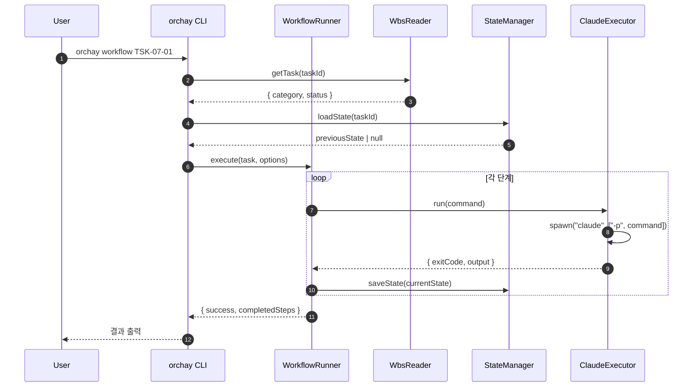
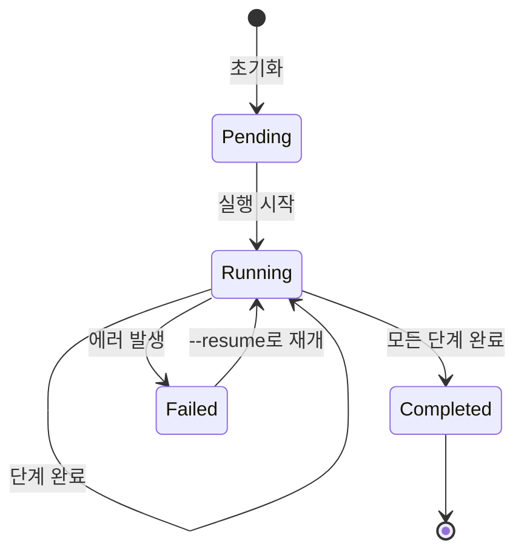

# 상세설계 (020-detail-design.md)

**Template Version:** 3.0.0 — **Last Updated:** 2025-12-15

> **설계 규칙**
> * *기능 중심 설계*에 집중한다.
> * 실제 소스코드(전체 또는 일부)는 **절대 포함하지 않는다**.
> * 작성 후 **상위 문서(PRD, TRD, 기본설계)와 비교**하여 차이가 있으면 **즉시 중단 → 차이 설명 → 지시 대기**.

---

## 0. 문서 메타데이터

| 항목 | 내용 |
|------|------|
| Task ID | TSK-07-01 |
| Task명 | Workflow Orchestrator CLI 구현 |
| Category | development |
| 상태 | [dd] 상세설계 |
| 작성일 | 2025-12-15 |
| 작성자 | Claude |

### 상위 문서 참조

| 문서 유형 | 경로 | 참조 섹션 |
|----------|------|----------|
| PRD | `.orchay/projects/orchay/prd.md` | 섹션 13 |
| 기본설계 | `010-basic-design.md` | 전체 |
| 상위 Work Package | WP-07: CLI Tools | - |

### 분할 문서 참조

| 문서 유형 | 파일명 | 목적 |
|----------|--------|------|
| 추적성 매트릭스 | `025-traceability-matrix.md` | 요구사항 ↔ 설계 ↔ 테스트 추적 |
| 테스트 명세 | `026-test-specification.md` | 테스트 시나리오, 데이터 |

---

## 1. 일관성 검증 결과

### 1.1 검증 요약

| 구분 | 통과 | 경고 | 실패 |
|------|------|------|------|
| PRD ↔ 기본설계 | 10개 | 0개 | 0개 |
| 기본설계 ↔ 상세설계 | 10개 | 0개 | 0개 |

### 1.2 검증 상세

| 검증 ID | 검증 항목 | 결과 | 비고 |
|---------|----------|------|------|
| CHK-PRD-01 | 기능 요구사항 완전성 | ✅ PASS | FR-001~010 모두 포함 |
| CHK-PRD-02 | 비즈니스 규칙 일치성 | ✅ PASS | - |
| CHK-BD-01 | 아키텍처 일관성 | ✅ PASS | 기본설계 컴포넌트 모두 구현 |
| CHK-BD-02 | 데이터 흐름 일치성 | ✅ PASS | - |

---

## 2. 목적 및 범위

### 2.1 목적

orchay 워크플로우를 터미널에서 독립적으로 실행할 수 있는 Node.js CLI 도구 개발. 각 워크플로우 단계마다 새로운 Claude 세션을 호출하여 컨텍스트 격리를 보장하고, 상태를 파일로 저장하여 중단/재개를 지원한다.

### 2.2 범위

**포함 범위**:
- CLI 진입점 (`bin/orchay.js`)
- `workflow` 명령어 구현
- 워크플로우 러너 (단계별 Claude 세션 호출)
- 상태 관리자 (`workflow-state.json`)
- wbs.md 파서 연동
- Claude CLI 실행기
- 옵션: `--until`, `--dry-run`, `--resume`, `--verbose`

**제외 범위**:
- 웹 UI 연동 → TSK-06-01
- 새로운 워크플로우 규칙 정의 → TSK-03-04

---

## 3. 기술 스택

| 구분 | 기술 | 버전 | 용도 |
|------|------|------|------|
| Runtime | Node.js | 20.x | CLI 실행 |
| CLI Framework | commander | 12.x | 명령어 파싱 |
| Process | Node.js spawn | 내장 | Claude CLI 실행 |
| Data | JSON | - | 상태 파일 저장 |
| Testing | Vitest | 2.x | 단위 테스트 |

---

## 4. 용어/가정/제약

### 4.1 용어 정의

| 용어 | 정의 |
|------|------|
| Workflow Step | 하나의 `/wf:*` 명령어 실행 단위 |
| Claude Session | `claude -p` 실행으로 생성되는 독립 세션 |
| State File | `workflow-state.json` 파일 |
| Target | `--until` 옵션으로 지정한 목표 단계 |

### 4.2 가정 (Assumptions)

- Claude CLI가 시스템에 설치되어 있음 (`claude` 명령어 실행 가능)
- 프로젝트 루트에서 CLI가 실행됨 (`.orchay/` 폴더 접근 가능)
- wbs.md 파일이 유효한 형식임

### 4.3 제약 (Constraints)

- Node.js 20.x 이상 필요
- Claude CLI 타임아웃: 단계당 최대 30분
- 동시 실행 불가 (순차 실행만 지원)

---

## 5. 시스템/모듈 구조

> **설계 리뷰 반영**: DIP-001(의존성 주입), SRP-001(책임 분리), SEC-001(보안 검증) 이슈 해결

### 5.1 모듈 역할 및 책임

| 모듈 | 역할 | 책임 |
|------|------|------|
| `bin/orchay.js` | CLI 진입점 | commander 설정, 의존성 조립 |
| `cli/commands/workflow.js` | workflow 명령어 | 옵션 파싱, Runner 호출 |
| `cli/core/WorkflowRunner.js` | 오케스트레이터 | **조율만** (Planner/Executor/StateMachine 위임) |
| `cli/core/WorkflowPlanner.js` | 계획 생성기 | 현재 상태 → 목표까지 단계 목록 생성 |
| `cli/core/WorkflowExecutor.js` | 단계 실행기 | 각 단계 Claude 세션 실행 |
| `cli/core/WorkflowStateMachine.js` | 상태 머신 | 상태 전이 관리, 유효성 검증 |
| `cli/core/ClaudeExecutor.js` | Claude 실행기 | spawn으로 claude -p 호출 |
| `cli/core/StateManager.js` | 상태 저장소 | workflow-state.json 저장/로드 |
| `cli/core/WbsReader.js` | WBS 저장소 | 기존 파서 래핑, Task 조회 |
| `cli/core/LockManager.js` | 락 관리자 | 동시 실행 방지 (lock 파일) |
| `cli/validation/TaskIdValidator.js` | Task ID 검증 | 정규식 검증, 인젝션 방지 |
| `cli/config/workflowSteps.js` | 워크플로우 설정 | 카테고리별 단계 정의 |

### 5.2 모듈 구조도 (개념)

```
orchay/
├── bin/
│   └── orchay.js              # CLI 진입점 (ESM)
├── cli/
│   ├── commands/
│   │   └── workflow.js        # workflow 명령어 핸들러
│   ├── core/
│   │   ├── WorkflowRunner.js  # 오케스트레이터 (조율만)
│   │   ├── WorkflowPlanner.js # 실행 계획 생성
│   │   ├── WorkflowExecutor.js# 단계별 실행
│   │   ├── WorkflowStateMachine.js # 상태 전이
│   │   ├── ClaudeExecutor.js  # Claude CLI 실행기
│   │   ├── StateManager.js    # 상태 파일 관리
│   │   ├── WbsReader.js       # WBS 파서 래퍼
│   │   └── LockManager.js     # 동시 실행 방지
│   ├── validation/
│   │   ├── TaskIdValidator.js # Task ID 검증
│   │   └── PathValidator.js   # 경로 검증
│   ├── interfaces/            # 추상화 인터페이스 (DI용)
│   │   ├── IWorkflowPlanner.js
│   │   ├── IWorkflowExecutor.js
│   │   ├── IStateMachine.js
│   │   ├── IStateRepository.js
│   │   ├── IWbsRepository.js
│   │   └── IClaudeRunner.js
│   ├── errors/
│   │   ├── OrchayError.js     # 기본 에러 클래스
│   │   ├── TaskNotFoundError.js
│   │   ├── ClaudeExecutionError.js
│   │   └── ValidationError.js
│   ├── config/
│   │   └── workflowSteps.js   # 카테고리별 단계 정의
│   └── utils/
│       └── logger.js          # 로깅 유틸리티
└── package.json               # bin 설정, commander 의존성
```

### 5.3 의존성 주입 패턴 (DIP-001 해결)

> **설계 원칙**: 모든 핵심 컴포넌트는 인터페이스에 의존하고, 구체 구현은 진입점에서 조립

```
WorkflowRunner (Orchestrator)
├── IWorkflowPlanner     ← WorkflowPlanner
├── IWorkflowExecutor    ← WorkflowExecutor
│   └── IClaudeRunner    ← ClaudeExecutor
├── IStateMachine        ← WorkflowStateMachine
├── IStateRepository     ← StateManager
├── IWbsRepository       ← WbsReader
└── ILockManager         ← LockManager
```

**진입점에서 조립 (bin/orchay.js)**:
```
const runner = new WorkflowRunner({
  planner: new WorkflowPlanner(),
  executor: new WorkflowExecutor(new ClaudeExecutor()),
  stateMachine: new WorkflowStateMachine(),
  stateRepo: new StateManager(),
  wbsRepo: new WbsReader(),
  lockManager: new LockManager()
})
```

### 5.4 보안 검증 계층 (SEC-001, SEC-002 해결)

| 검증 | 위치 | 검증 내용 |
|------|------|----------|
| Task ID | TaskIdValidator | 정규식: `^TSK-\d{2}(-\d{2}){1,2}$` |
| 경로 | PathValidator | .orchay/ 내부인지 확인 |
| 명령어 | ClaudeExecutor | spawn 인자 배열 사용 (문자열 연결 금지) |

### 5.5 외부 의존성

| 의존성 | 유형 | 용도 |
|--------|------|------|
| commander | npm | CLI 명령어 파싱 |
| Claude CLI | 외부 | 워크플로우 단계 실행 |
| server/utils/wbs/parser | 내부 | wbs.md 파싱 |

---

## 6. 데이터 모델 (개념 수준)

### 6.1 엔티티 정의

#### Entity: WorkflowState

| 필드명 | 타입 | 필수 | 설명 | 제약조건 |
|--------|------|------|------|----------|
| taskId | String | Y | Task ID | TSK-XX-XX-XX 형식 |
| projectId | String | Y | 프로젝트 ID | - |
| category | Enum | Y | Task 카테고리 | development/defect/infrastructure |
| currentStep | Number | Y | 현재 단계 인덱스 | 0 이상 |
| targetStep | String | N | 목표 단계 | done이 기본 |
| steps | Array | Y | 실행할 단계 목록 | - |
| completedSteps | Array | Y | 완료된 단계 | - |
| status | Enum | Y | 전체 상태 | pending/running/completed/failed |
| startedAt | DateTime | N | 시작 시간 | - |
| updatedAt | DateTime | Y | 마지막 업데이트 | - |
| error | String | N | 에러 메시지 | - |

#### Entity: StepResult

| 필드명 | 타입 | 필수 | 설명 | 제약조건 |
|--------|------|------|------|----------|
| step | String | Y | 단계 이름 | start/draft/build 등 |
| command | String | Y | 실행 명령어 | /wf:start 등 |
| status | Enum | Y | 실행 결과 | success/failed/skipped |
| startedAt | DateTime | Y | 시작 시간 | - |
| finishedAt | DateTime | N | 종료 시간 | - |
| duration | Number | N | 실행 시간 (초) | - |
| exitCode | Number | N | 프로세스 종료 코드 | - |
| output | String | N | 출력 로그 (요약) | - |

### 6.2 파일 형식

**workflow-state.json** (프로젝트 루트 또는 .orchay/):

```json
{
  "taskId": "TSK-07-01",
  "projectId": "orchay",
  "category": "development",
  "currentStep": 2,
  "targetStep": "build",
  "steps": ["start", "draft", "review", "apply", "build"],
  "completedSteps": [
    { "step": "start", "status": "success", "duration": 120 },
    { "step": "draft", "status": "success", "duration": 180 }
  ],
  "status": "running",
  "startedAt": "2025-12-15T10:00:00Z",
  "updatedAt": "2025-12-15T10:05:00Z",
  "error": null
}
```

---

## 7. 인터페이스 계약 (CLI Interface)

### 7.1 명령어 목록

| 명령어 | 설명 | 옵션 | 요구사항 |
|--------|------|------|----------|
| `orchay workflow <taskId>` | 워크플로우 실행 | --until, --dry-run, --resume, --verbose | FR-002 |

### 7.2 CLI 상세: workflow

**요구사항**: FR-001 ~ FR-010

#### 인자 (Arguments)

| 인자 | 타입 | 필수 | 설명 |
|------|------|------|------|
| taskId | String | Y | Task ID (TSK-XX-XX-XX) |

#### 옵션 (Options)

| 옵션 | Short | 타입 | 필수 | 설명 | 기본값 |
|------|-------|------|------|------|--------|
| --until | -u | String | N | 목표 단계 | done |
| --dry-run | -d | Boolean | N | 실행 계획만 출력 | false |
| --resume | -r | Boolean | N | 중단된 워크플로우 재개 | false |
| --verbose | -v | Boolean | N | 상세 로그 출력 | false |
| --project | -p | String | N | 프로젝트 ID | 자동 탐지 |

#### 종료 코드

| 코드 | 의미 |
|------|------|
| 0 | 성공 |
| 1 | 일반 오류 |
| 2 | Task 찾을 수 없음 |
| 3 | Claude CLI 실행 실패 |
| 4 | 사용자 중단 (Ctrl+C) |

#### 출력 형식

**정상 실행**:
```
[orchay] Workflow started for TSK-07-01
[orchay] Category: development
[orchay] Target: build

[1/5] start: Running /wf:start TSK-07-01
      ✓ Completed (2m 15s)

[2/5] draft: Running /wf:draft TSK-07-01
      ✓ Completed (3m 42s)

[3/5] build: Running /wf:build TSK-07-01
      ✓ Completed (15m 8s)

[orchay] Workflow completed successfully!
[orchay] Total time: 21m 5s
```

**dry-run 모드**:
```
[orchay] Workflow Plan (dry-run)

Task: TSK-07-01
Category: development
Current Status: [bd]
Target: build

Execution Plan:
  1. draft   → /wf:draft TSK-07-01
  2. review  → /wf:review TSK-07-01
  3. apply   → /wf:apply TSK-07-01
  4. build   → /wf:build TSK-07-01

No changes were made.
```

---

## 8. 프로세스 흐름

### 8.1 프로세스 설명

1. **CLI 파싱** [FR-001, FR-002]: commander로 명령어, 인자, 옵션 파싱
2. **Task 조회** [FR-003]: WbsReader로 wbs.md에서 Task 정보 조회
3. **상태 복원** [FR-009]: --resume 시 StateManager로 기존 상태 로드
4. **실행 계획 생성** [FR-004]: 현재 상태 → 목표 단계까지 필요한 단계 목록 생성
5. **dry-run 처리** [FR-008]: --dry-run 시 계획만 출력하고 종료
6. **단계별 실행** [FR-005]: 각 단계마다 ClaudeExecutor로 Claude 세션 실행
7. **상태 저장** [FR-006]: 각 단계 완료 후 StateManager로 상태 저장
8. **결과 출력**: 최종 결과 요약 출력

### 8.2 시퀀스 다이어그램



### 8.3 상태 다이어그램



---

## 9. 워크플로우 단계 정의

### 9.1 카테고리별 단계 목록

| 카테고리 | 단계 순서 | 상태 전이 |
|----------|----------|----------|
| development | start → draft → review → apply → build → test → audit → patch → verify → done | [ ] → [bd] → [dd] → [im] → [ts] → [xx] |
| defect | start → fix → test → audit → patch → verify → done | [ ] → [an] → [fx] → [ts] → [xx] |
| infrastructure | start/skip → build → audit → patch → done | [ ] → [ds] → [im] → [xx] |

### 9.2 단계별 명령어 매핑

| 단계 | 명령어 | 설명 |
|------|--------|------|
| start | /wf:start | 기본설계 (development) / 분석 (defect) |
| draft | /wf:draft | 상세설계 |
| review | /wf:review | 설계 리뷰 |
| apply | /wf:apply | 리뷰 반영 |
| build | /wf:build | TDD 구현 |
| test | /wf:test | 단위/E2E 테스트 |
| audit | /wf:audit | 코드 리뷰 |
| patch | /wf:patch | 리뷰 반영 |
| verify | /wf:verify | 통합 테스트 |
| done | /wf:done | 완료 처리 |
| fix | /wf:fix | 결함 수정 (defect) |
| skip | /wf:skip | 설계 생략 (infrastructure) |

### 9.3 Target 단계 매핑

| --until 값 | 중단 시점 | development 실행 단계 |
|------------|----------|----------------------|
| basic-design | [bd] 완료 후 | start |
| detail-design | [dd] 완료 후 | start → draft |
| review | 리뷰 완료 후 | start → draft → review |
| apply | 리뷰 반영 후 | start → draft → review → apply |
| build | [im] 완료 후 | start → draft → review → apply → build → test |
| audit | 코드리뷰 후 | ... → build → test → audit |
| patch | 코드리뷰 반영 후 | ... → audit → patch |
| verify | [ts] 완료 후 | ... → patch → verify |
| done (기본) | [xx] 완료 | 전체 |

---

## 10. 비즈니스 규칙 구현 명세

| 규칙 ID | 규칙 설명 | 구현 위치(개념) | 구현 방식(개념) | 검증 방법 |
|---------|----------|-----------------|-----------------|-----------|
| BR-001 | 유효한 Task ID만 허용 | WbsReader | wbs.md 파싱 후 존재 확인 | 단위 테스트 |
| BR-002 | 카테고리별 단계 순서 보장 | WorkflowRunner | workflowSteps.js 설정 참조 | 단위 테스트 |
| BR-003 | 중단 시 상태 자동 저장 | StateManager | SIGINT 핸들러 등록 | E2E 테스트 |
| BR-004 | --resume 시 마지막 완료 단계부터 재개 | WorkflowRunner | completedSteps 확인 | 단위 테스트 |
| BR-005 | Claude CLI 타임아웃 | ClaudeExecutor | spawn 타임아웃 설정 | 단위 테스트 |

---

## 11. 오류/예외 처리

### 11.1 예상 오류 상황

| 오류 상황 | 오류 코드 | 사용자 메시지 | 복구 전략 |
|----------|----------|--------------|----------|
| Task 없음 | TASK_NOT_FOUND | Task를 찾을 수 없습니다: {taskId} | 올바른 Task ID 입력 안내 |
| wbs.md 없음 | WBS_NOT_FOUND | 프로젝트 WBS를 찾을 수 없습니다 | 프로젝트 초기화 안내 |
| Claude CLI 없음 | CLAUDE_NOT_FOUND | Claude CLI가 설치되어 있지 않습니다 | 설치 가이드 안내 |
| Claude 실행 실패 | CLAUDE_EXEC_FAILED | Claude 실행 중 오류 발생 | 상태 저장 후 --resume 안내 |
| 타임아웃 | STEP_TIMEOUT | 단계 실행 시간 초과 (30분) | 상태 저장 후 --resume 안내 |
| 상태 파일 손상 | STATE_CORRUPTED | 상태 파일이 손상되었습니다 | 새로 시작 안내 |

### 11.2 경계 조건

| 조건 | 처리 방안 |
|------|----------|
| 이미 완료된 Task | "이미 완료된 Task입니다" 메시지 출력 |
| 현재 상태 > 목표 단계 | "현재 상태가 목표보다 앞서 있습니다" 경고 |
| 사용자 중단 (Ctrl+C) | 현재 상태 저장 후 graceful shutdown |

---

## 12. 구현 체크리스트

> **설계 리뷰 반영**: SRP-001, DIP-001, SEC-001 이슈 해결 항목 포함

### CLI
- [ ] bin/orchay.js 진입점 생성 + 의존성 조립
- [ ] commander 설정 및 workflow 명령어 등록
- [ ] 옵션 파싱 (--until, --dry-run, --resume, --verbose)
- [ ] package.json bin 필드 설정

### Core Modules (SRP-001 책임 분리)
- [ ] WorkflowRunner 구현 (**조율만**, Planner/Executor/StateMachine 위임)
- [ ] WorkflowPlanner 구현 (실행 계획 생성)
- [ ] WorkflowExecutor 구현 (단계별 실행)
- [ ] WorkflowStateMachine 구현 (상태 전이)
- [ ] ClaudeExecutor 구현 (spawn으로 claude -p 호출)
- [ ] StateManager 구현 (JSON 저장/로드)
- [ ] WbsReader 구현 (기존 파서 래핑)
- [ ] LockManager 구현 (동시 실행 방지)

### Interfaces (DIP-001 의존성 주입)
- [ ] IWorkflowPlanner 인터페이스
- [ ] IWorkflowExecutor 인터페이스
- [ ] IStateMachine 인터페이스
- [ ] IStateRepository 인터페이스
- [ ] IWbsRepository 인터페이스
- [ ] IClaudeRunner 인터페이스
- [ ] ILockManager 인터페이스

### Validation (SEC-001, SEC-002 보안)
- [ ] TaskIdValidator 구현 (정규식: ^TSK-\d{2}(-\d{2}){1,2}$)
- [ ] PathValidator 구현 (.orchay/ 내부 확인)
- [ ] spawn 인자 배열 사용 (문자열 연결 금지)

### Errors
- [ ] OrchayError 기본 클래스
- [ ] TaskNotFoundError
- [ ] ClaudeExecutionError
- [ ] ValidationError

### Config
- [ ] workflowSteps.js (카테고리별 단계 정의)
- [ ] Target 단계 매핑

### Error Handling
- [ ] SIGINT 핸들러 (Ctrl+C)
- [ ] 타임아웃 처리 (30분)
- [ ] Lock 파일 정리

### Testing
- [ ] 단위 테스트 (Vitest) - Mock 주입으로 테스트 가능
- [ ] E2E 테스트
- [ ] 경계값 테스트 (TEST-001)
- [ ] 동시성 테스트 (TEST-002)

### Documentation
- [ ] 사용 가이드 (080-manual.md)

---

## 13. 다음 단계

- `/wf:review` 명령어로 설계리뷰 진행

---

## 관련 문서

- 기본설계: `010-basic-design.md`
- 추적성 매트릭스: `025-traceability-matrix.md`
- 테스트 명세: `026-test-specification.md`
- 기존 파서: `server/utils/wbs/parser/index.ts`

---

<!--
author: Claude
Template Version: 3.0.0
-->
